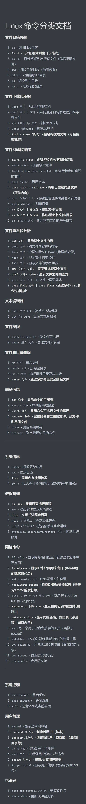

# Linux基础学习

## 数据库启动修复

```bash
# 停止所有mysql进程
sudo systemctl stop mariadb 2>/dev/null
sudo pkill -9 mysql 2>/dev/null
sudo pkill -9 mysqld 2>/dev/null

# 备份原有数据（安全起见）
sudo cp -ra /var/lib/mysql /var/lib/mysql.backup.$(date +%Y%m%d_%H%M%S)

# 确保mysql用户和组存在
sudo groupadd -r mysql 2>/dev/null || echo "mysql组已存在"
sudo useradd -r -g mysql -s /bin/false -M mysql 2>/dev/null || echo "mysql用户已存在"

# 强制更改所有文件属主
sudo chown -R mysql:mysql /var/lib/mysql

# 修复目录权限
sudo chmod 755 /var/lib/mysql
sudo find /var/lib/mysql -type f -exec chmod 660 {} \;

# 检查SELinux
getenforce
sudo setenforce 0 2>/dev/null

# 清理可能存在的锁文件
sudo rm -f /var/lib/mysql/mysql.sock 2>/dev/null
sudo rm -f /var/lib/mysql/mysql.sock.lock 2>/dev/null

# 尝试启动
sudo systemctl daemon-reload
sudo systemctl start mariadb

# 查看状态
sudo systemctl status mariadb --no-pager -l
```

## 编译测试

```bash
$ cd zstack/test
# systemctl status mariadb，确认 mariadb 是运行的。
# ZStack 的“单元测试”不是传统意义上的单测，而是基于模拟器的集测。
$ mvn test-Djacoco.skip=true-Dtest=CreateVmConcurrentlyCase
# 用 surefire:test 避免重新编译测试代码，再跑一次：
$ mvn surefire:test-Djacoco.skip=true-Dtest=CreateVmConcurrentlyCase
```

### 远程调试方法

```
mvn test -Djacoco.skip=true -Dtest=CreateVmConcurrentlyCase \-Dmaven.surefire.debug="-agentlib:jdwp=transport=dt_socket,server=y,suspend=y,address=5005"
```

# Linux基本操作

## 写在前面

菜鸟这个里面很全，而且是中文，英文文档查指令的效率我感觉不如直接问ai： [Linux 命令大全 | 菜鸟教程](https://www.runoob.com/linux/linux-command-manual.html)

## 常见指令

1. ssh  `username@server_ip`  远程连接云服务器
2. ls 查看
   - `ls` 显示当前目录下的列表
   - `ls -l` 显示文件的具体信息
   - `ls -la` 查看隐藏文件
3. pwd  `pwd` 显示当前所在位置
4. cd 切换目录
   -  `cd /where/you/want/to/go` 跳转到具体路径
   -  `cd /` 返回根目录
   -  `cd foldername` 进入子文件夹
   -  `cd ..`返回上一级目录
   -  `cd  `(空格之后输入空格) 返回默认目录，即连接成功默认进入的root
5. touch 创建文件
   - `touch filename1 filename2 ` 创建一个或者多个文件
   - `touch -d daytime filename` 创建一个文件夹并且为其编辑创建时间
6. echo `echo "I love Linux" > file_exist` 向已经存在的文件中写入句子
7. nano `nano filename` 进入编辑一个文件
   - ctrl+X+Y+enter(回车) 保存并退出
8. vim `vim filename` 使用vim编辑文件
   - i 插入
   - Esc 退出插入模式
   - `:wq` 在非插入模式保存并退出文件
9. cat `cat filename` 不进入文件并查看文件内容
10. shred `shred filename` 多次覆盖文件以保证彻底删除
11. mkdir `mkdir foldername` 创建子文件夹
12. cp `cp filename path/filename` 复制文件到某个文件夹下面
13. mv `mv filename path/filename`  剪切文件到某个文件夹下面
14. rm 删除
    - `rm filename` 删除子文件（和前面的一样，加上路径就删除其他文件夹下的文件了，不多赘述）
    - `rm -r foldername` 递归删除文件夹下面的所有文件
15. rmdir `rmdir foldername` 删除空文件夹
16. ln `ln -s filename linkname` 为文件创建软连接
17. clear `clear` 清空操作屏
18. whoami `whoami` 查询当前操作者身份
19. useradd `useradd username` 创建一个新用户
20. sudo `sudo order` 为一条指令添加权限
21. adduser `adduser password` 创建一个用户并且为他加入一些参数
22. su `su username` 切换用户
23. exit `exit`退出当前用户
24. passwd `passwd your_passwd` 设置密码
25. apt 下载
    - `sudo apt update` 下载或者更新apt
    - `sudo apt install sourcename` 安装依赖或组件
26. finger `finger other_username` 查看别的用户的信息
27. man `man order` 查看命令手册
28. whatis `whatis order` 快速查看命令说明
29. which `which order` 显示命令(资源包)所在路径
30. whereis `whereis finger` 查找命令所有位置
31. wget `wget source/path/from/the/internet` 从互联网上获取(下载)资源
32. curl `curl url > filename` 将资源下载为某个文件(也可以使用curl传输文件)
33. zip `zip zip_filename filename` 将后面的文件压缩成前面名称的文件
34. unzip `unzip filename` 解压缩 后续可选选项
35. less  一页一页的阅读文件
36. head `head filename` 阅读文件的开头
37. tail `tail filename` 阅读文件的结尾
38. cmp `cmp filename1 filename2` 比较两个文件哪里不同
39. diff `diff filename1 filename2` 比较两个文件哪里不同,并且详细列出
40. sort `cat filename | sort` 按照字母顺序排列
41. find 查找文件
    - `sudo find /path -name "filename" `在某个文件夹下面找某个文件
    - `sudo find . -type f -name ".*"` 查找隐藏文件
42. chmod 赋权
    - `chmod +x filename` 将文件转化为可执行文件
    - `./filename` 执行该可执行文件
43. chown `chown username filename` 改变文件的所有权
44. ipconfig `ipconfig` 查看服务器IP地址
45. ip address `ip address` 查看服务器IP地址
46. grep 过滤输出内容
    - `ip address | grep eth0` 查看以太网0对应的IP地址
    - `ip address | grep eth0 |grep inet` 查看以太网0中inet对应的ip
47. awk 过滤获取某段文本
    - `ip address | grep eth0 |grep inet | awk '{print $2}'` 
48. resolvectl `resolvectl status` 查看DNS
49. ping 测试联通性
    - `ping ip`测试域名或者ip对应服务器的连通性
    - `ping -c num -s num ip` 确定发送几次请求,数据包大小
50. traceroute `traceroute ip` 查看每一跳的延时
51. netstst 
    - `netstat` 查看服务器的端口
    - `netst -tulpn` 查看服务器使用的端口 
52. ss
    - `ss` 查看服务器的端口
    - `ss -tulpn` 查看服务器使用的端口 
53. iptables `sudo iptables -I INPUT -p tcp -m tcp --dport 80 -j ACCEPT` 开放80端口
54. ufw `ufw allow 80` 开放80端口
55. uname 
    - `uname` 获取操作系统
    - `uname -a` 获取更详细的信息
56. neofetch `neofetch` 获取更漂亮的页面
57. cal `cal`生成一个日历
58. bc `echo "4+5+6" | bc` 计算算式
59. free `free`计算剩余内存大小
60. df `df -H` 计算磁盘剩余空间
61. ps 查看进程
    - `ps` 查看简单的进程信息
    - `ps -aux` 查看详细的进程信息
62. top 
    - `top` 查看占用资源的进程
    - `htop` 美观的查看正在占用资源的进程
63. kill 终止进程
    - `ps -aux | grep filename` 查看进程ID
    - `kill ID` 关闭进程
    - `kill -9 ID` 强制关闭进程
64. pkill 使用进程名称关闭进程
    - `pkill -f filename` 关闭进程
65. systemctl 管理系统服务
    - `sudo systemctl start apache2` 启动服务
    - `sudo systemctl start apache2` 查看服务状态
66. history `history` 查看历史命令操作
67. reboot `sudo reboot` 重启系统
68. shutdown 
    - `sudo shutdown`一分钟后关机
    - `sudo shut -h now`直接关机
69. nohup `nohup ./myapp &` 持久化运行一个可执行程序

## 写在后面

这是我看国外的一个油管博主发的视频，很常见，复习一下做做笔记。如果感觉这个形式不好的话，可以看一下下面这个图片的归类方式。后续使用到一些更好的命令也会在这里补充

