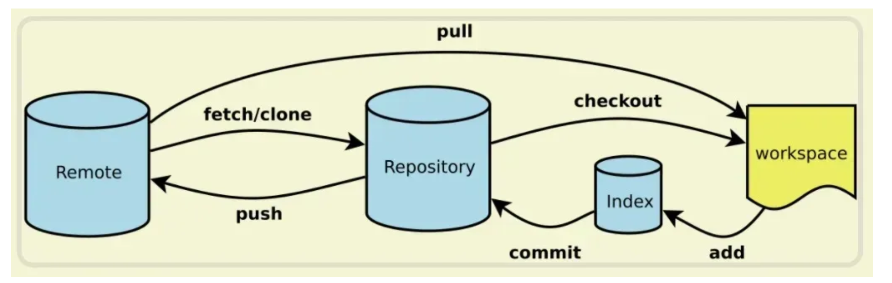

## Git 使用熟练吗？

熟悉，项目的代码是用 git 工具来管理的/

git 的工作原理如下图：



几个专用名词的译名如下：

- Workspace：工作区
- Index / Stage：暂存区
- Repository：仓库区（或本地仓库）
- Remote：远程仓库

> 工作流程

最基础的工作流程，首先执行 `git pull` 获取远程仓库的最新代码，进行代码的编写。

完成相应功能的开发后执行 `git add .` 将工作区代码的修改添加到暂存区，再执行 `git commit -m 完成xx功能` 将暂存区代码提交到本地仓库并添加相应的注释，最后执行 `git push` 命令推送到远程仓库。

> 撤回 git commit 操作

当执行了 `git commit -m 注释内容` 命令想要撤回，可以使用 `git reset --soft HEAD^` 把本地仓库回退到当前版本的上一个版本，也就是刚刚还没提交的时候，代码的改动会保留在暂存区和工作区。

也可以使用 `git reset --mixed HEAD^`，这样不止回退了刚刚的 `git commit` 操作，还回退了 `git add` 操作，代码的改动只会保留在工作区。因为 `--mixed` 参数是 `git reset` 命令的默认选项，也就是可以写为 `git reset HEAD^`。

> 撤回 git push 操作

当执行了 `git push` 命令想要撤回，可以使用 `git reset HEAD^` 将本地仓库回退到当前版本的上一个版本，代码的修改会保留在工作区，然后使用 `git push origin xxx --force` 将本地仓库当前版本的代码强制推送到远程仓库。

## git rebase和merge的区别

- **Rebase**（变基）是将一个分支上的提交逐个地应用到另一个分支上，使得提交历史变得更加线性。当执行rebase时，Git会将目标分支与源分支的共同祖先以来的所有提交挪到目标分支的最新位置。这个过程可以看作是将源分支上的每个提交复制到目标分支上。简而言之，rebase可以将提交按照时间顺序线性排列。
- **Merge**（合并）是将两个分支上的代码提交历史合并为一个新的提交。在执行merge时，Git会创建一个新的合并提交，将两个分支的提交历史连接在一起。这样，两个分支的修改都会包含在一个合并提交中。合并后的历史会保留每个分支的提交记录。

## 如何使用 git 命令合并两个分支，发生冲突如何解决

1. **查看冲突**：当发生冲突时，Git 会提示您文件中的冲突部分。您可以使用以下命令查看所有冲突文件的状态。

```bash
git status
```

1. **解决冲突**：打开包含冲突的文件，您会看到类似以下的标记：

```plain
<<<<<<< HEAD
// 代码来自目标分支
=======
// 代码来自要合并的分支
>>>>>>> branchName
```

您需要手动编辑这些文件，决定保留哪些变更或者如何整合这些变更。

1. **标记为已解决**：完成冲突解决后，对已解决的文件使用以下命令标记为已解决。

```bash
git add <已解决文件>
```

1. **完成合并**：继续提交这些已解决的冲突文件。

```bash
git commit -m "解决合并冲突"
```


# 图解Git

[图解Git](https://marklodato.github.io/visual-git-guide/index-zh-cn.html)


# 其他问题

### 第一级：基础概念与日常操作 (判断你是否真的在用)

这个级别的目标是确认你不是只停留在 `git clone`, `git pull`, `git push`。

### 1. **“请简单介绍一下 Git 是什么？”**

- **考察点：** 你对 Git 的核心定位是否理解。
- **回答要点：** Git 是一个**分布式版本控制系统**。关键点在于“分布式”，这意味着每个开发者本地都有一份完整的代码历史仓库，可以在不联网的情况下进行提交、查看历史、创建分支等操作。这与 [SVN](https://zhida.zhihu.com/search?content_id=261157934&content_type=Article&match_order=1&q=SVN&zhida_source=entity) 等集中式系统（必须连接中央服务器才能工作）是核心区别。

### 2. **“`git pull` 和 `git fetch` 有什么区别？”**

- **考察点：** 对远程仓库交互的理解是否清晰。这是个非常高频的问题。
- **回答要点：**
  - `git fetch`：从远程仓库下载最新的对象（commits, files, etc.），但**不会**自动合并或修改你当前的工作。它只是更新你的本地远程分支（如 `origin/main`）。你可以先 `fetch` 下来看看远程有什么更新，再决定是否合并。
  - `git pull`：相当于 `git fetch` 之后，立刻跟上一个 `git merge`。它会抓取最新内容并**立即尝试合并**到你当前所在的分支。


### 3.**“你平时一天的工作中，Git 的基本流程是怎样的？”**

- **考察点：** 你的实际工作习惯，是否规范。
- **回答要点：**

1. 开始新任务前，先切换到 `develop` 或 `main` 分支，`git pull` 拉取最新代码，确保基础代码是最新的。
2. `git checkout -b feature/xxx` 创建并切换到一个新的功能分支。
3. 在功能分支上进行开发，使用 `git add .` 和 `git commit -m "..."` 进行阶段性提交。
4. 开发完成后，`git push origin feature/xxx` 将本地分支推送到远程。
5. 在 [GitHub](https://zhida.zhihu.com/search?content_id=261157934&content_type=Article&match_order=1&q=GitHub&zhida_source=entity)/[GitLab](https://zhida.zhihu.com/search?content_id=261157934&content_type=Article&match_order=1&q=GitLab&zhida_source=entity) 等平台上，创建一个 Pull Request (或 [Merge Request](https://zhida.zhihu.com/search?content_id=261157934&content_type=Article&match_order=1&q=Merge+Request&zhida_source=entity))，请求将你的功能分支合并到主开发分支（如 `develop`）。


### 第二级：分支与团队协作 (判断你是否能和团队高效合作)

这个级别的问题是面试的重点，直接关系到你在团队中的协作效率。

### 5. **“`git merge` 和 `git rebase` 的区别是什么？你更倾向于用哪个？”**

- **考察点：** Git 核心技能，对代码历史整洁度的理解。这是**必考题**。
- **回答要点：**
  - **`git merge`**：会创建一个新的“合并提交”(merge commit)，将两个分支的历史交汇在一起。它的历史记录是真实的，但如果合并频繁，会导致提交历史的分叉非常多，看起来很乱。
  - **`git rebase`** (变基)：会把你当前分支的提交“搬到”目标分支的最新提交之后，形成一条**线性的、干净的**提交历史。
  - **倾向与选择：**
    - 在合并自己本地的、还未推送到远程公共分支的功能分支时，倾向于使用 `rebase` 来保持提交历史的整洁。例如，在合并到 `develop` 之前，先 `git pull --rebase origin develop`。
    - 在合并公共分支（如将 `develop` 合并到 `main`）时，通常使用 `merge`，以保留清晰的合并节点，记录下这是一个正式的版本合并。


- **关键原则：****永远不要对一个已经推送到远程并被多人使用的公共分支进行 `rebase`**，因为这会改写历史，给其他协作者带来灾难。


### 6. **“当 `git pull` 或 `merge` 时遇到冲突 (Conflict)，你会怎么解决？”**

- **考察点：** 解决协作中最常见问题的能力。
- **回答要点：**

1. 首先，保持冷静，`git status` 会清晰地告诉你哪些文件发生了冲突。
2. 打开冲突的文件，你会看到类似 `<<<<<<< HEAD`, `=======`, `>>>>>>>` 的标记。
3. 理解冲突的原因：`HEAD` 部分是你当前分支的修改，下面的部分是你要合并过来的分支的修改。
4. 与相关的同事沟通（如果需要），或者根据需求，手动编辑文件，删除这些特殊标记，并将代码修改成最终想要的样子。
5. 修改完毕后，执行 `git add <冲突文件名>` 将文件标记为已解决。
6. 最后，执行 `git commit` (如果是 `merge` 冲突) 或 `git rebase --continue` (如果是 `rebase` 冲突) 来完成合并。


### 第三级：进阶操作与问题解决 (判断你的经验深度和处理异常的能力)

如果你能答好这个级别的问题，会非常加分。

### 7. **“如果你提交了一个错误的 commit，甚至已经 push 到了远程，该如何修正？”**

- **考察点：** 代码修正和“后悔药”的能力。
  - **情况一：还未 push**
    - 修改 commit 信息：`git commit --amend`
    - 撤销上一次 commit 但保留代码修改：`git reset --soft HEAD^`


- **情况二：已经 push 到远程**
  - **最佳实践：** 使用 `git revert <commit-id>`。这会创建一个**新的 commit**，内容是指定 commit 的反向操作。它不会改写历史，对公共分支是安全的。
  - **危险操作 (仅限个人分支)：** 如果确定这个分支只有你一个人在用，可以使用 `git reset --hard <commit-id>` 回滚到某个版本，然后 `git push --force` 强制推送到远程。**强调你知道这是危险的，并解释为什么。**


### 8. **“`git reset`、`git revert` 和 `git checkout` 都可以用来回退代码，它们有什么区别？”**

- **考察点：** 对不同“撤销”工具的精确理解。
- **回答要点：**
  - `git reset`：移动 `HEAD` 指针，可以改变分支的指向。`--hard` 会丢弃工作区的修改，`--soft` 会保留。它会**改写历史**。
  - `git revert`：用一个新的 commit 来撤销一个旧的 commit。它**不改写历史**，是安全的回退方式。
  - `git checkout`：主要用于切换分支，也可以用来恢复工作区中某个文件的内容到指定的版本，一般不用于分支级别的回退。


### 8. **“`git stash` 是做什么用的？”**

- **考察点：** 是否知道如何处理“写了一半的代码，突然要切分支改 Bug”的场景。
- **回答要点：** 当你正在一个分支上开发，但代码还没到可以 commit 的程度，突然需要切换到另一个分支处理紧急任务时，可以使用 `git stash`。它会把你当前工作区的修改（staged 和 unstaged）“暂存”起来，让你的工作区变得干净。处理完任务回来后，再用 `git stash pop` 或 `git stash apply` 把之前暂存的代码恢复出来。


### 9. “`git cherry-pick` 是做什么的？你在什么场景下会使用它？”


- **考察点：** 是否知道如何“挑选”并复用单个 commit，处理特定、零散的需求。
- **回答要点：**
  - **作用：**`git cherry-pick` 的作用是将一个或多个已经存在的 commit “复制”一份，并应用到你当前所在的分支上。它会创建一个内容相同但哈希值（commit ID）全新的 commit。
  - **使用场景：**

1. **Bug 修复：** 假设你在 `develop` 分支上修复了一个紧急 Bug，这个修复也需要立即应用到已经发布的 `main` 分支上。但 `develop` 分支上还有很多其他未完成的功能，不能直接合并。这时，你就可以在 `main` 分支上 `cherry-pick` 那个修复 Bug 的 commit。
2. **功能提取：** 你在一个功能分支 `feature-A` 上开发了几个 commit，后来发现其中一个 commit（比如一个通用的工具函数）对另一个功能分支 `feature-B` 也很有用。你就可以用 `cherry-pick` 把这个特定的 commit “摘”到 `feature-B` 分支上，而无需合并整个 `feature-A`。


### 10. “什么是 `HEAD`？什么是“[分离头指针](https://zhida.zhihu.com/search?content_id=261157934&content_type=Article&match_order=1&q=分离头指针&zhida_source=entity)”（Detached HEAD）状态？”

- **考察点：** 对 Git 底层指针概念的理解，这是区分新手和熟练使用者的一个标志。
- **回答要点：**
  - **`HEAD` 是什么：**`HEAD` 是一个特殊的指针，它总是指向你当前所在的位置。在大多数情况下，`HEAD` 指向一个分支的末端（比如 `main` 或 `develop`）。当你切换分支时（`git checkout develop`），`HEAD` 就会从指向 `main` 变为指向 `develop`。
  - **分离头指针 (Detached HEAD)：** 当 `HEAD`**不指向一个分支名，而是直接指向一个具体的 commit 哈希值**时，你就进入了“分离头指针”状态。
  - **如何进入：** 通常是通过 `git checkout <commit-id>` 或 `git checkout <tag-name>` 进入的。
  - **危险性：** 在这个状态下，你仍然可以提交代码，但这些新的 commit 不属于任何分支。一旦你切换到其他分支（比如 `git checkout main`），这些在“分离”状态下产生的 commit 就可能**丢失**，因为没有任何分支指针指向它们，它们会被 Git 的垃圾回收机制清理掉。
  - **如何解决：** 如果你在分离头指针状态下做了有用的提交，应该立即用 `git checkout -b <new-branch-name>` 创建一个新分支来保存这些提交。


### 11. “`.gitignore` 文件是做什么用的？它的匹配规则是怎样的？如果一个文件已经被 Git 跟踪了，再把它加入 `.gitignore` 会怎么样？”

- **考察点：** 对项目配置和实际工程经验的了解。
- **回答要点：**
  - **作用：**`.gitignore` 文件用来告诉 Git 哪些文件或目录**不需要**被纳入版本控制。这通常包括编译产物（如 `dist` 目录）、日志文件、临时的依赖包（如 `node_modules`）以及包含敏感信息的配置文件等。
  - **匹配规则：** 可以简单提几条，比如：
    - `#` 开头的行是注释。
    - `/` 开头表示只匹配项目根目录下的文件。
    - `*` 是通配符，匹配任意字符。
    - `!` 开头表示例外，即不忽略某个文件。
  - **文件已被跟踪的情况：** 如果一个文件已经被 `git add` 和 `git commit` 纳入了版本历史，那么之后再把它加入 `.gitignore` 是**无效**的，Git 会继续跟踪这个文件的变化。
  - **解决方法：** 必须先从 Git 的跟踪列表中移除它，然后再提交。命令是：
    Bash
    \# 从 Git 仓库中删除，但保留本地文件
    git rm --cached <file_name>
    \# 然后提交这个删除操作
    git commit -m "Stop tracking <file_name>"
    这样之后，`.gitignore` 的规则才会对这个文件生效。


### 12. “当你在准备一个 Pull Request 时，发现自己分支上有很多零碎的、意义不大的 commit（比如 "fix typo", "update"），你会怎么处理？”

**考察点：** 对维护一个干净、可读的提交历史的意识和能力。

- **回答要点：**
  - 为了让主分支的历史保持清晰，也为了方便 Code Review 的人理解，我会将这些零碎的 commit 合并成一个或几个有意义的 commit。
  - 我会使用**交互式变基（`git rebase -i`）** 来实现这个目标。
  - **具体步骤：**

1. 比如我想合并最近的 5 个 commit，我会运行 `git rebase -i HEAD~5`。
2. 在打开的编辑器中，我会把第一个 commit 前面的 `pick` 保留，把后面几个 commit 的 `pick` 改为 `squash` (或 `s`)，意思是“将这个 commit 合并到前一个 commit 中”。
3. 保存并退出后，Git 会让我重新编辑一个新的 commit message，来概括这几个被合并的 commit 的所有工作。
4. 完成后，我的分支上就只有一个干净、完整的 commit 了。如果这个分支已经 push 过，我需要用 `git push --force-with-lease` 来强制更新远程分支。


### 13. “`git add` 这个命令是做什么的？它和 `git commit` 有什么关系？”

- **考察点：** 对 Git “暂存区”（Staging Area）这个核心概念的理解。
- **回答要点：**
  - `git add` 的作用是把你工作区里**指定文件**的**当前修改**添加到“暂存区”。暂存区就像一个购物篮或者草稿箱，你可以把想提交的内容先放进去。
  - 你可以多次使用 `git add` 把不同文件的修改放进暂存区。
  - `git commit` 命令则是把你**暂存区里所有内容**打包成一个版本（一个 commit）并永久记录到你的本地仓库历史中。
  - **总结关系就是：**`git add` 是准备工作，用来挑选你这次想提交的内容；`git commit` 是确认操作，把准备好的所有内容一次性提交。


### 14. “当你输入 `git status` 命令时，你通常会关注哪些信息？”

- **考察点：** 你是否会通过 `git status` 来清晰地了解当前工作状态，这是最基本、最重要的习惯。
- **回答要点：**

1. **当前所在分支：** 首先我会确认我目前在哪个分支上，避免在错误的分支上进行操作。
2. **是否有未暂存的修改 (Changes not staged for commit)：** 查看哪些文件被修改了，但还没有被 `git add`。
3. **是否有已暂存的修改 (Changes to be committed)：** 查看哪些文件已经被 `git add`，准备好被提交了。
4. **是否有未被跟踪的文件 (Untracked files)：** 查看项目中是否出现了 Git 还不认识的新文件。
5. **与远程分支的关系：** 查看本地分支是领先（ahead）还是落后（behind）于远程分支，这提示我是否需要 `push` 或 `pull`。


### 15. “什么是分支 (Branch)？为什么我们在开发中要使用分支？”

- **考察点：** 对 Git 最核心特性之一“分支”的理解，以及它带来的好处。
- **回答要点：**
  - **什么是分支：** 分支就像是代码历史的一个独立副本或一条独立的时间线。你可以在一个分支上自由地进行修改和提交，而不会影响到其他分支（比如主分支 `main`）。
  - **为什么使用分支：**

1. **隔离开发：** 最大的好处是**隔离**。开发新功能、修复 Bug 都在各自独立的分支上进行，不会污染主分支的稳定性。
2. **并行工作：** 团队成员可以同时在各自的分支上开发不同的功能，互不干扰。
3. **安全实验：** 你可以创建一个分支来尝试一些新的、不确定的想法。如果成功了，就合并它；如果失败了，直接删除这个分支就行，对主项目没有任何影响。
4. **清晰的工作流：** 通过分支可以实现像 Git Flow 这样的规范化流程，让版本管理更加清晰。


### 16. “`git clone` 和直接下载 ZIP 压缩包有什么区别？”


- **考察点：** 是否理解 Git 仓库的本质，即它不仅仅是代码文件。
- **回答要点：**
  - **下载 ZIP 包：** 你只得到了项目在**某个时间点**的所有代码文件。它是一个静态的快照，**不包含任何 Git 的版本历史记录**。你无法使用 `git log`, `git checkout` 等命令。
  - **`git clone`：** 你得到的是一个**完整的 Git 仓库**。这不仅包括了项目的所有代码文件，还包括了项目从创建以来的**全部版本历史**（所有的 commit 记录）。这是一个“活”的仓库，你可以立即在上面进行版本控制操作，并与远程仓库进行同步。


### 17. “Git 和 GitHub 有什么区别？”

- **考察点：** 这是最根本的概念辨析题，用来判断你是否混淆了工具和平台。
- **回答要点：**
  - **Git** 是一个**工具**。它是一个开源的、分布式的**版本控制系统**，安装在你的电脑上，用来管理代码的版本历史。它是核心，是引擎。
  - **GitHub** 是一个**平台**或**服务**。它是一个基于网络的托管服务，使用 Git 作为其核心的版本控制工具。GitHub 提供了一个地方（远程仓库）来存储你的代码，并提供了很多协作功能，比如 Pull Requests、Issues、代码审查、项目管理等。
  - **比喻：** Git 就像是 Word 程序，而 GitHub 就像是 Google Docs。Word（Git）是你本地用来写作和保存版本的工具，而 Google Docs（GitHub）是一个在线平台，让你可以把文档（代码）存到云端，并和别人一起协作编辑。


### 18. “什么是提交信息（Commit Message）？你觉得写好它为什么很重要？”

- **考察点：** 你的代码规范意识和团队沟通能力。
- **回答要点：**
  - **是什么：** 提交信息是在每次 `git commit` 时，对这次提交所做修改的简短描述。
  - **为什么重要：**

1. **方便回顾：** 当你想查找某个特定的修改时，清晰的提交信息能让你通过 `git log` 快速定位，而不需要去阅读每一行代码的变动。
2. **便于团队协作：** 你的队友可以通过提交信息快速了解你做了什么，这对于 Code Review（代码审查）和理解项目进展至关重要。
3. **快速定位问题：** 如果某个版本出现了 Bug，规范的提交信息可以帮助团队快速排查是哪一次提交引入了问题。

**（加分项）好的提交信息规范：** 可以简单提一下，比如遵循“第一行是标题，简明扼概括；空一行后是主体，详细描述修改内容和原因”的格式。


### 19. “`git remote -v` 这个命令是做什么用的？”

- **考察点：** 对远程仓库管理的基本命令是否熟悉。
- **回答要点：**
  - 这个命令用来查看你本地仓库当前配置的所有**远程仓库**的详细信息。
  - `-v` 是 `verbose`（详细）的缩写。
  - 输出结果会列出远程仓库的简称（通常是 `origin`）以及对应的 URL 地址，并且会区分 `fetch`（拉取）和 `push`（推送）的地址。这在确认你将要把代码推送到哪里时非常有用。


### 20. “如何创建一个新的本地分支，并把它推送到远程仓库？”

- **考察点：** 这是一个完整的、非常基础的工作流，检验你是否能将命令串联起来使用。
- **回答要点：**
  - **第一步：创建并切换到新分支。** 我会使用 `git checkout -b <new-branch-name>`。这个命令相当于 `git branch <new-branch-name>`（创建分支）和 `git checkout <new-branch-name>`（切换分支）两个命令的组合。
  - **第二步：在新分支上做一些提交。** 至少要有一个 commit，否则推送一个空的分支没有意义。
  - **第三步：推送到远程仓库。** 当我第一次推送这个新分支时，我会使用 `git push -u origin <new-branch-name>`。
  - **（加分项）解释 `-u` 参数：**`-u` 是 `--set-upstream` 的缩写。它的作用是在推送的同时，在本地建立起当前分支与远程分支的追踪（tracking）关系。这样设置一次之后，未来在这个分支上再推送时，我就可以直接使用简单的 `git push` 命令了。


### 21. “`git tag` 是做什么用的？你一般在什么时候会使用它？”


- **考察点：** 是否了解版本发布和里程碑标记。
- **回答要点：**
  - **作用：**`git tag` 用来给某一个特定的 commit 打上一个有意义的、不可移动的**标签**。它就像是代码历史上的一个“里程碑”或“书签”。
  - **主要用途：** 最常见的用途是**标记发布版本**。比如，当项目 `1.0` 版本开发完成并准备上线时，我们会在对应的最后一个 commit 上打一个 `v1.0.0` 的标签。
  - **好处：**

1. **易于识别：**`v1.0.0` 远比一长串的 commit 哈希值（如 `f8e2a9c`）更容易记忆和识别。
2. **方便检出：** 团队成员可以轻松地使用 `git checkout v1.0.0` 来获取这个特定版本的代码，非常适合代码发布和问题回溯。

**（加分项）如何推送标签：** 默认情况下，`git push` **不会**把标签推送到远程仓库。你需要显式地推送，可以使用 `git push origin <tag-name>` 推送单个标签，或者用 `git push --tags` 一次性推送所有本地的新标签。

### 22. “`git log` 命令是做什么的？你有没有用过它的一些参数？”


- **考察点：** 查看和理解提交历史的能力。
- **回答要-点：**
  - **作用：**`git log` 是用来查看当前分支的**提交历史记录**的命令。它会按时间倒序列出所有的 commit，包括作者、日期和提交信息。
  - **常用参数：**
    - `--oneline`：这是我最常用的参数之一，它把每个 commit 的信息压缩到一行显示，看起来非常清爽。
    - `--graph`：会用 ASCII 字符画出分支的合并历史图，能清晰地看到各个分支的来龙去脉。
    - `--all`：显示所有分支的历史，而不仅仅是当前分支。
    - **组合使用：** 我经常会把它们组合起来用，比如 `git log --oneline --graph --all`，这样可以快速地对整个项目的历史有一个全局的了解。


### 23. “什么是 `origin`？”

- **考察点：** 对远程仓库别名的理解。
- **回答要点：**
  - `origin` 是 Git 为你 `clone` 的那个远程仓库所设置的**默认别名**。
  - 它不是一个特殊的命令或关键字，它只是一个名字，一个指向远程仓库 URL 的指针。当你运行 `git remote -v` 时，你就能看到 `origin` 对应的就是你克隆时的那个长长的 URL。
  - 使用 `origin` 这个别名，可以让我们在 `push` 或 `pull` 的时候更方便，而不用每次都输入完整的仓库地址。当然，我们也可以添加其他名字的远程仓库，比如 `upstream` 或 `backup`。

### 24. “`HEAD`、`HEAD^` 和 `HEAD~2` 分别代表什么？”

- **考察点：** 对相对引用（relative reference）的理解，即如何在 commit 历史中移动。
- **回答要点：**
  - **`HEAD`**：指向当前所在分支的**最新一次提交**。可以把它理解为“当前位置”。
  - **`HEAD^`**（或者 `HEAD~1`）：代表 `HEAD` 的**上一个**提交，也就是父提交。
  - **`HEAD~2`**：代表 `HEAD` 的**上上个**提交，也就是往前数两个的提交。数字可以改变，`HEAD~5` 就是往前数五个。


### 25. Git 的三个主要区域（或工作区）是什么？请简单描述一下它们之间的关系。

- **考察点：** 这是对 Git 最核心、最底层的概念模型的理解。能说清楚这个，说明你真的懂 Git 是如何工作的。
- **回答要点：**

1. **工作目录 (Working Directory)：** 就是你在电脑上能看到的、包含项目文件的那个文件夹。这是你进行代码编辑、添加、删除文件的主要地方。
2. **暂存区 (Staging Area / Index)：** 这是一个位于 `.git` 目录中的特殊文件。当你使用 `git add` 命令时，你实际上是把工作目录中的修改快照添加到了暂存区。它像一个“待提交清单”，让你在提交前可以精确控制哪些修改要被包含进去。
3. **本地仓库 (Local Repository / .git directory)：** 当你运行 `git commit` 时，Git 会把暂存区里的所有内容生成一个永久的快照（一个 commit），并保存在本地仓库中。本地仓库包含了项目的所有版本历史。

**三者关系流转：** 你在**工作目录**修改代码 -> 使用 `git add` 将修改放入**暂存区** -> 使用 `git commit` 将暂存区的内容提交到**本地仓库**。


### 26. `git config` 命令是做什么的？你知道它有哪几个不同的配置级别吗？

- **考察点：** 对 Git 环境配置的了解，这是开始使用 Git 时的第一步。
- **回答要点：**
  - **作用：**`git config` 命令用来查看和设置 Git 的配置变量。最常见的配置就是你的用户名和邮箱，比如 `git config --global user.name "Your Name"`。
  - **三个主要级别：**

1. **`--local` (本地)：** 配置只对**当前**仓库有效。配置信息保存在当前仓库的 `.git/config` 文件中。这是默认级别，不加参数就是它。
2. **`--global` (全局)：** 配置对当前电脑用户的**所有**仓库都有效。配置信息保存在用户主目录下的 `.gitconfig` 文件中。这是最常用的配置级别。
3. **`--system` (系统)：** 配置对这台电脑上的**所有用户**和所有仓库都有效。配置信息保存在 Git 的安装目录里。这个用得比较少。


**优先级：** 如果同一个配置项在不同级别都有设置，**`local` 的优先级最高，其次是 `global`，最后是 `system`**。

### 27. 什么是 Commit Hash（提交哈希值）？

- **考察点：** 对 Git 如何唯一标识每一次提交的理解。
- **回答要点：**
  - Commit Hash（或称 Commit ID）是你每次运行 `git commit` 时，Git 自动生成的一个**唯一的、长度为 40 位的字符串**（由数字和字母组成）。
  - 它是通过对提交内容（包括代码、作者、提交信息、时间戳等）进行 SHA-1 哈希算法计算得出的。
  - **作用：** 它的核心作用是作为每一次提交的**唯一身份证号**。因为它是根据内容生成的，所以任何对提交内容的微小改动都会导致生成一个全新的哈希值，这保证了 Git 历史的完整性和不可篡改性。我们在 `revert`、`checkout`、`cherry-pick` 等操作中，就是用这个哈希值来精确定位某一次提交的。

### 28. `git diff` 是做什么的？你能举几个常用场景吗？

- **考察点：** 对比代码差异的能力，这是提交前检查代码的必备技能。
- **回答要点：**
  - **作用：**`git diff` 是一个用来**比较差异**的命令。
  - **常用场景：**

1. **`git diff`**：不加任何参数，它会显示**工作目录**中已修改但**未暂存**（还没有 `git add`）的文件与暂存区之间的差异。这是查看“我刚刚改了什么”最直接的方式。
2. **`git diff --staged`** (或 `--cached`)：显示**暂存区**与**最新一次提交 (HEAD)** 之间的差异。这可以让你在 `git commit` 之前，最后一次检查将要提交的内容是否正确。
3. **`git diff <分支A> <分支B>`**：比较两个分支之间的差异，这在准备合并分支或发起 Pull Request 之前非常有用。

### 29. 什么是“快进合并”（Fast-forward merge）？

- **考察点：** 对 `git merge` 底层机制的理解，这是报告中“merge”模块的一个重要知识点。
- **回答要点：**
  - “快进合并”是一种特殊的、最简单的合并场景。
  - **发生条件：** 当你要合并的分支（比如 `feature`）的历史记录，正好是当前分支（比如 `main`）的直接下游时，也就是说，从 `feature` 分支创建以来，`main` 分支没有任何新的提交。
  - **过程：** Git 不会创建一个新的“合并提交”，它只是简单地把 `main` 分支的指针直接移动到 `feature` 分支的最新位置。这个过程就像是把 `main` 分支“快进”了一下，所以叫 Fast-forward。
  - **结果：** 提交历史是一条干净的直线，没有分叉。

### 30. `git switch` 和 `git checkout` 在切换分支时有什么区别？

**考察点：** 对新命令的了解，表明你关注 Git 的发展。`git switch` 是在 Git 2.23 版本后引入的。

- **回答要点：**
  - 在早期版本中，`git checkout` 命令功能过于庞杂，它既能切换分支，又能恢复文件，容易引起混淆。
  - 为了让职责更清晰，Git 引入了两个新命令：
    - **`git switch`**：**专门用于切换分支**。比如 `git switch main`。
    - **`git restore`**：**专门用于恢复文件**。比如 `git restore a.txt`。
  - **区别与建议：**`git switch` 的意图更明确，只做切换分支这一件事，可以有效防止误操作。在较新的 Git 版本中，推荐使用 `git switch` 来切换分支。

### 31. `git commit --amend` 是做什么的？

- **考察点：** 修改最新一次提交的能力。
- **回答要点：**
  - `git commit --amend` 用来**修正最新的一次提交**。
  - **主要用途：**

1. **修改提交信息：** 如果你刚刚的 commit message 写错了，可以立刻运行这个命令来修改。
2. **补充文件：** 如果你提交后发现漏掉了一个文件，可以先 `git add <漏掉的文件>`，然后运行 `git commit --amend`，Git 会把这个文件补充进上一次的 commit 中，而不会产生新的 commit。

**注意：** 它本质上是用一个新的 commit **替换**了旧的 commit，所以如果你的旧 commit 已经推送到了远程，修改后需要强制推送。

### 32. `git blame` 是做什么用的？

**考察点：** 代码考古和问题追溯的能力。

- **回答要点：**
  - `git blame` 是一个非常有用的“甩锅”和“考古”工具。
  - **作用：** 它可以**逐行**显示一个文件中的每一行代码，是在**哪一次提交**中、由**哪位作者**、在**什么时间**修改的。
  - **使用场景：** 当你看到一段有问题的或者看不懂的代码时，可以使用 `git blame <文件名>` 来快速找到当初写下这行代码的人和相关的 commit，从而了解当时的背景和意图。
- 为什么说 `git reflog` 是“救命稻草”？

**考察点：** 终极“后悔药”的使用，体现你的经验深度。

- **回答要点：**
  - `git reflog`（Reference Log，引用日志）记录了 `HEAD` 指针在**本地仓库**中的所有移动历史。
  - **为什么是救命稻草：** 它记录了你几乎所有的操作，包括切换分支、提交、重置（reset）、变基（rebase）等，即使这些操作在 `git log` 中已经看不到了。
  - **使用场景：** 当你错误地使用了 `git reset --hard` 删除了一些重要的 commit，或者在 rebase 中搞砸了历史，导致一些提交“丢失”时，你可以在 `git reflog` 中找到这些操作之前的状态，然后使用 `git reset --hard <reflog中的哈希值>` 来恢复到那个安全的时间点。

### 工作流与最佳实践

### 34. 你能简单介绍一下 Git Flow 工作流吗？

- **考察点：** 对业界成熟的协作模型的了解。
- **回答要点：**
  - Git Flow 是一个非常经典、规范的 Git 分支管理模型，特别适合有明确版本发布周期的项目。
  - **它定义了几个关键分支：**
    - **`main` (或 `master`) 分支：** 存放最稳定的、可随时发布到生产环境的代码。只接受来自 `release` 或 `hotfix` 分支的合并。
    - **`develop` 分支：** 主开发分支，包含了所有准备在下一个版本发布的功能。它是功能分支的汇集点。
    - **`feature/\*` 分支：** 功能分支，从 `develop` 分支切出，用于开发新功能。开发完成后合并回 `develop`。
    - **`release/\*` 分支：** 发布分支，当 `develop` 分支的功能足够发布一个新版本时，从 `develop` 切出一个 `release` 分支，专门用于版本测试、修复 Bug。完成后，同时合并到 `main` 和 `develop` 分支。
    - **`hotfix/\*` 分支：** 热修复分支，当线上 `main` 分支出现紧急 Bug 时，从 `main` 分支切出，修复后同时合并回 `main` 和 `develop`。