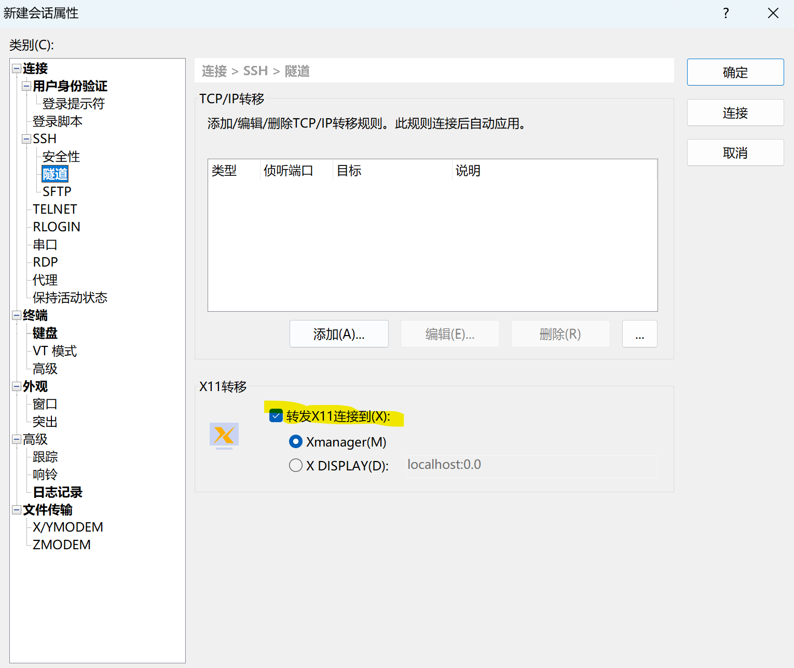

# 连接环境

首先，作为一个后端er，能使用linux系统是必备的技能，这里我建议可以使用Xshell连接云服务器的方案来完成。云服务器建议使用Ubuntu内核的阿里云服务器，学生头年免费。除此之外，使用虚拟机也是完全可以的，这里关于虚拟机配置就不展开说了，简单说一下云服务器的使用：

1. 首先，需要登陆阿里云控制台获取云服务器的公网ip，用户名和密码
2. 之后，打开Xshell，新建连接设置IP，用户名密码并且关闭隧道中的下图设置

3. 创建完成之后，直接双击连接使用即可。退出指令`exit`，进入时点击上方文件夹，之后双击连接即可

# 环境配置

只能说windows上面教程很多，我感觉Linux上面安装go以及环境配置是能更加清楚的感受整个过程，下面就简要讲讲：

1. 首先，就是现在go的安装包，这个下载途径有很多（包括之后的一些内外网的东西），这个就不多赘述了，大致下载好之后在根目录有一个压缩包：`go1.19.6.linux-amd64.tar.gz`
2. 之后，需要了解两个变量`GOROOT`(Go 标准库和工具的安装目录)`GOPATH`(开发者的项目代码和依赖包的工作目录)。因此，很容易发现这个压缩包需要解压到一个目录下面，这个目录到bin文件作为的是`GOROOT`
3. 之后，需要进入文件并编写环境变量`vim .bushrc`,(vim编辑器按`i`进入编辑模式，按`Esc`退出编辑模式，编辑模式输入`:wq`退出)，之后使用`source ~/.bashrc`保存修改。环境变量配置如下：`export GOROOT=/root/work/go
   export GOPATH=$HOME/go export PATH=$PATH:$GOROOT/bin:$GOPATH/bin`
4. 最后设置两个变量，国内代理以及MODULE两个环境变量：`GOPROXY="https://proxy.golang.com.cn,https://goproxy.cn,direct"  GO111MODULE="on"`

# 编译与运行

## Go Build

使用gobuild来实现编译的效果：

1. `go build .`: 编译当前目录
2. `go build ./name.go`: 编译文件（可以一次性编译多个）
3. `go build ./p1`: 编译指定目录，不会产生编译文件，只会进行语法检查
4. `go build -o ...`: 定向输出编译结果

## Go Ran

1.  `go run .`: 最常用的运行命令

## 交叉编译

例如在windows系统上编译用于linux上的可执行程序，这样操作需要修改GOOS、GOARCH、CGO_ENABLED三个环境变量:

1. GOOS:目标平台的操作系统(darwin、freebsd、linux、windows)
2. GOARCH:目标平台的体系架构(CPU)32位还是64位(386、amd64arm)
3. CGO_ENABLED:是否启用CGO(go语言对C语言的支持)，交叉编译不支持CGO 所以要禁用它

### windows上编译Linux与Mac可执行程序

```
#设置环境变量
$Env:CGO_ENABLED=0;$Env:GOARCH="amd64";$Env:GOOS="linux'
#编译,并输出到app文件
go build -o ./out/app .
```

```
#设置环境变量
$Env:CGO_ENABLED=0;$Env:GOARCH="amd64";$Env:GOOS="darwin'#编译,并输出到app文件
go build -o ./out/app .
```

### mac编译Linux与windows

```
CGO_ENABLED=0 GOOS=linux GOARCH=amd64 go build -o ./out/app .
CGO_ENABLED=0 GOOS=windows GOARCH=amd64 go build -o ./out/app.exe .
```

### Linux编译Mac与Windows

```
CGO_ENABLED=0 GOOS=darwin GOARCH=amd64 -o ./out/app .
CGO_ENABLED=0 GOOS=windows GOARCH=amd64 go build -o ./out/app.exe .
```

注意：

1. 这些步骤一般在goland的命令行下面进行，这样可以使这些环境变量的修改只在当前终端下生效。

# Goland调试

**调试分为三种：**

1. 本地调试
2. 附加到进程调试
3. 远程调试

## 本地调试

这个首先要配置配置文件(go build)：

1. run kind: 编译对象的类型 directory(目录) package(包) file(文件)
2. Output directory：输出文件目录，默认为缓存目录
3. Work directory：当前目录就是工作目录
4. Environment： 环境变量信息
5. Program assignment：程序参数（个人感觉相当于预声明了）
6. Module：一般选一个

## 附加到进程

1. 首先，安装插件`go install github.com/google/gops@latest`。之后，点击"运行"-->"Attach with debugger to"
2. 之后，终端输入构建`build -gcflags="all = -N -l" -o Demo.exe`

## 远程调试

首先要做如下设置：

1. `CGO_ENABLED = 0` C兼容
2. `GOARCH = Amd64`  指令集
3. `GOOS = linux` 操作系统

# Go mod

## go.mod文件包含内容

```go
module mod_name//gomod名称
go 1.17//go版本号

require(
	name version//包名 版本
)//依赖包的名称

exclude(
	//
)//排除的包 用于处理内含bug的包或者不在维护更新的第三方库

replace(
	source latest => target latest
)//替换的包 用于处理外网第三方包依赖的问题 或者是所依赖的包发生了迁移

retract(
   v 1.0.0 
)//撤回某个版本，放置其他用户依赖有问题的版本
```

## gomod指令

1. **初始化指令：** `go mod init mod_name`(mod_name可以不写，默认为项目名称)
2. **下载指令：** `go mod download mod_path`
3. **依赖对齐：** `go mod tidy`(确切来说就是使用了但是没有依赖的**一键增加**，或者写在gomod里面但是没有使用的**一键删除**)，是一个非常常见的命令,这也体现了go“没用就删”的简洁性特点。
4. **编辑依赖：**`go mod edit`后面加上`-replace=`之类的指令，相当于直接在mod文件下面修改了
5. **依赖包：**`go mod vinder` 不常用
6. **验证依赖正确性：** `go mod verify` 
7. **查询依赖项：** `go mod why reply_name` 这个这个依赖包在哪里使用了

## gomod文件解释

### 文件夹

在gomod文件夹（就是mod文件夹）里面的文件夹可以分为cache文件夹和其他文件夹。

1. cache文件夹存储的是在github（或者其他代码仓库平台）下载时缓存的信息（文件夹通常位于用户主目录下的 `go/pkg/mod` 目录，或者在 GOPATH 环境变量指定的路径下）；
2. 其他文件夹一般是每一条指令下载的（或者每一个仓库）存放在一个文件夹下方；

### 文件

1. gomod文件： 这个里面存储的就是基本依赖信息
2. gosum文件： 这个文件中存储的是路径 版本号 哈希签名三个信息（确保我们依赖的和使用的一致性）

## go其他常用指令

1. `go install name`: 用于安装插件
2. `go get name`: 获取模块信息并更新依赖
3. `go clean `: 清理临时目录中的文件`go clean -modcache`清除整个module下载的文件缓存

