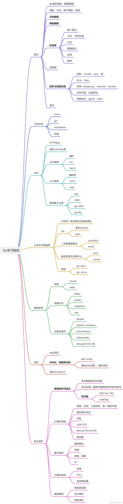
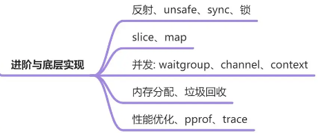
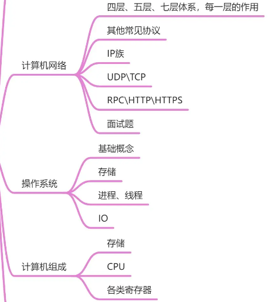
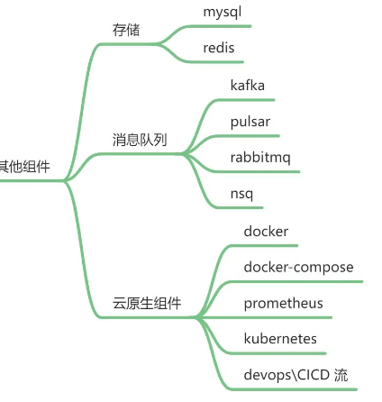
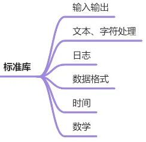
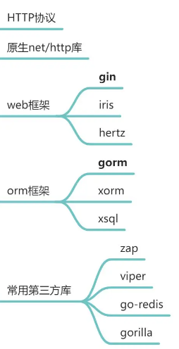
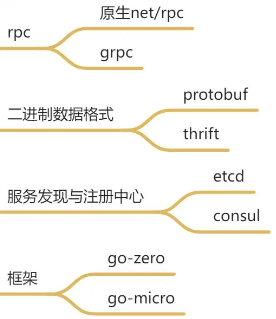

# GoLearning
这个仓库存放了一些go语言的相关资料

## go语言的学习路线

下面我简单谈一下我这一年踩坑得出的go语言的学习路线：

1. 首先，一定一定仔细看前置内容，简要学习Linux，Shell，虚拟机或者云服务器的使用，学习编出的代码如何在Linux系统上面运行、数据库和环境如何调配、交叉编译是怎样进行的等等。
2. 其次，go语言的基础语法，它是如何实现“面向对象”的、如何实现数组切片这些相对复杂的数据结构。这些内容不需要过多纠结和理解，但是一定要仔细学习（以免像我一样写项目的时候还要返工学习）
3. 之后，我认为go或者任何一门后端语言都是要注重应用场景的，`语言->框架+项目`这套学习模式真的是事半功倍的。go语言的应用场景，结合框架基本来说就是web—gin，数据库—gorm，分布式—grpc、go-kit工具集。搞懂这些框架为什么使用？（处理的是什么问题）、如何使用？（先使用，后理解）、与其他语言对比而言的优势？（这点是比较玄学的，但是我认为也是值得思考的问题）
4. 最后，我认为学习go后端，最重要的就是多和其他人交流，无论是后端er，前端er还是其他的同学。技术在交流中进步，知识在分享中传播。希望大家可以成为技术的学习者、传播者、分享者。

仓库资料持续更新中，大家认为需要改进的地方、表述不准确或者错误的地方，还希望及时联系创作者予以批评和指正。有更好的idea和资料也希望大家多多分享。

# 总任务

1. 设计模式
2. 项目MitRaft
3. 项目galbot
4. 数据结构底层
5. 组件面经
6. go机制与gin底层
7. 算法题

## 设计模式

1. 24种：[4小时了解Go语言24种设计模式|go设计模式_哔哩哔哩_bilibili](https://www.bilibili.com/video/BV1jyreYKE8z/?spm_id_from=333.337.search-card.all.click&vd_source=ec6316a581a37a9f967c180fffa5f8b5)
2. 大话设计模式

## 数据结构实现

使用go实现一下基本的数据结构

## 底层

### 数据结构底层

### 计网、计组与os

### 组件面经

### 第三方库

#### 标准库

#### Web第三方库

#### 微服务第三方库

### go机制与gin底层

1. gin底层：[gin框架底层技术原理剖析_哔哩哔哩_bilibili](https://www.bilibili.com/video/BV1zm4y177mb/?spm_id_from=333.1387.search.video_card.click&vd_source=ec6316a581a37a9f967c180fffa5f8b5)
2. gc：
   - [Go语言GC系列下篇——垃圾回收原理分析&源码走读_哔哩哔哩_bilibili](https://www.bilibili.com/video/BV1xu4y1w7gL/?spm_id_from=333.1387.upload.video_card.click&vd_source=ec6316a581a37a9f967c180fffa5f8b5)
   - [Go语言GC系列上篇——内存分配与管理机制_哔哩哔哩_bilibili](https://www.bilibili.com/video/BV1bv411c7bp/?spm_id_from=333.1387.upload.video_card.click&vd_source=ec6316a581a37a9f967c180fffa5f8b5)
3. gmp：[解说Golang GMP 实现原理_哔哩哔哩_bilibili](https://www.bilibili.com/video/BV1oT411Y7m3/?spm_id_from=333.1387.search.video_card.click&vd_source=ec6316a581a37a9f967c180fffa5f8b5)

### bilibili面经

linux技术大师百题
