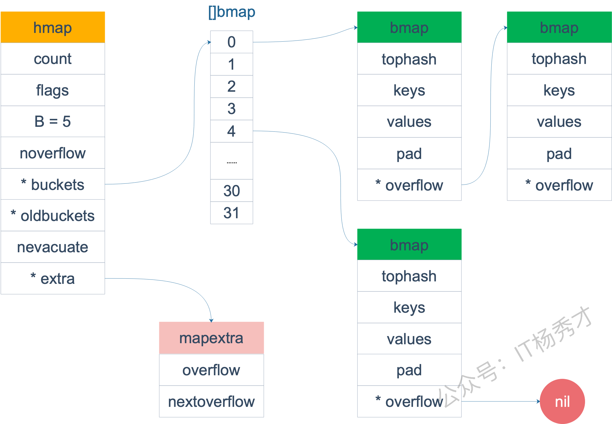
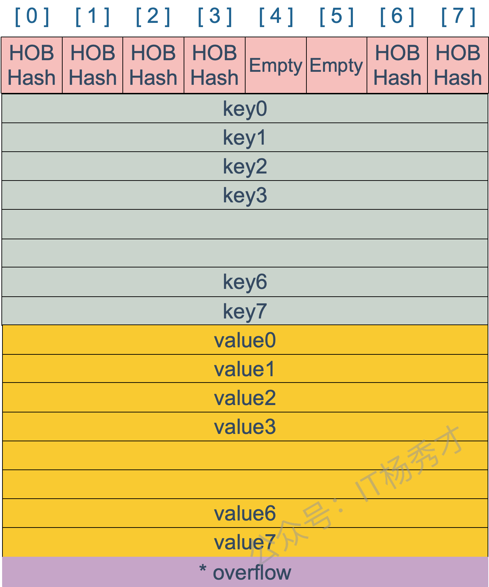
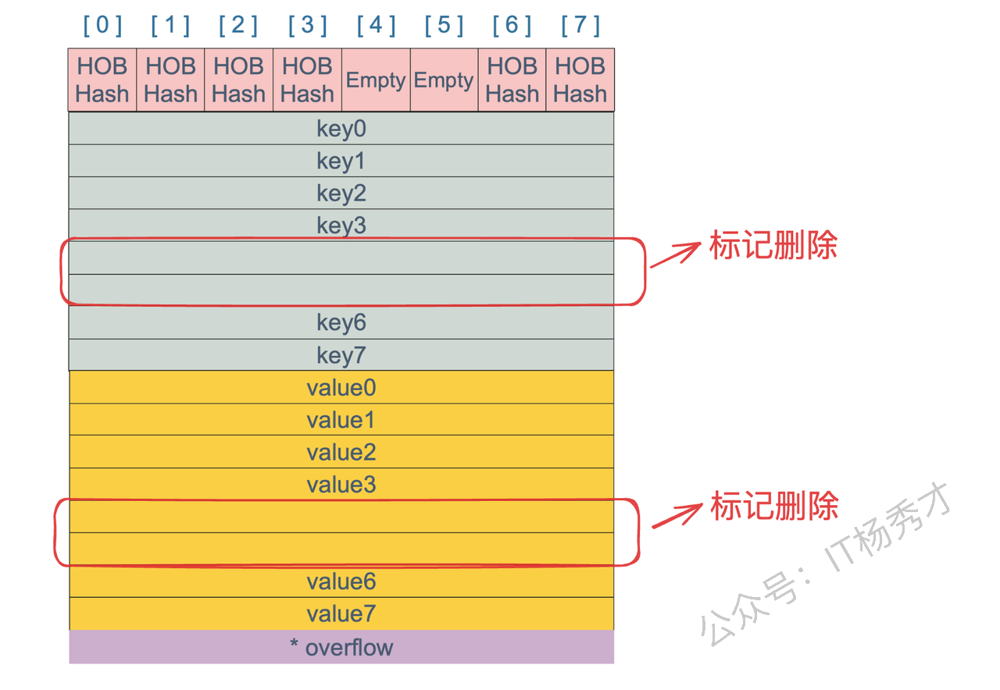

### (star)Go语言Map的底层实现原理是怎样的？

map的就是一个hmap的结构。Go Map的底层实现是一个**哈希表**。它在运行时表现为一个指向`hmap`结构体的指针，`hmap`中记录了**桶数组指针`buckets`**、**溢出桶指针**以及**元素个数**等字段。每个桶是一个`bmap`结构体，能存储**8个键值对**和**8个`tophash`**，并有指向下一个**溢出桶的指针`overflow`**。为了**内存紧凑**，`bmap`中采用的是先存8个键再存8个值的存储方式。

**分析：** hmap结构定义：

```go
// A header for a Go map.
type hmap struct {
   count     int // map中元素个数
   flags     uint8 // 状态标志位，标记map的一些状态
   B         uint8  // 桶数以2为底的对数，即B=log_2(len(buckets))，比如B=3，那么桶数为2^3=8
   noverflow uint16 //溢出桶数量近似值
   hash0     uint32 // 哈希种子

   buckets    unsafe.Pointer // 指向buckets数组的指针
   oldbuckets unsafe.Pointer // 是一个指向buckets数组的指针，在扩容时，oldbuckets 指向老的buckets数组(大小为新buckets数组的一半)，非扩容时，oldbuckets 为空
   nevacuate  uintptr        // 表示扩容进度的一个计数器，小于该值的桶已经完成迁移

   extra *mapextra // 指向mapextra 结构的指针，mapextra 存储map中的溢出桶
}
```



bmap结构如下：



### Go语言Map的遍历是有序的还是无序的？

Go语言里Map的遍历是**完全随机**的，并没有固定的顺序。map每次遍历,都会从一个随机值序号的桶,在每个桶中，再从按照之前选定随机槽位开始遍历,所以是无序的。

### Go语言Map的遍历为什么要设计成无序的？

map 在扩容后，会发生 **key 的搬迁**，原来落在同一个 bucket 中的 key，搬迁后，有些 key 就要远走高飞了（bucket 序号加上了 2^B）。而遍历的过程，就是按顺序遍历 bucket，同时按顺序遍历 bucket 中的 key。搬迁后，key 的位置发生了重大的变化，有些 key 飞上高枝，有些 key 则原地不动。这样，遍历 map 的结果就不可能按原来的顺序了。

Go团队为了避免开发者写出依赖底层实现细节的脆弱代码，而**有意为之**的一个设计。通过在遍历时引入随机数，Go从根本上杜绝了程序员依赖特定遍历顺序的可能性，强制我们写出更健壮的代码。

### Map如何实现顺序读取？

如果业务上确实需要有序遍历，最规范的做法就是将Map的键（Key）取出来放入一个切片（Slice）中，用`sort`包对切片进行排序，然后根据这个有序的切片去遍历Map。

### Go语言的Map是否是并发安全的？

map 不是线程安全的。

在查找、赋值、遍历、删除的过程中都会检测写标志，一旦发现写标志置位（等于1），则直接 panic。赋值和删除函数在检测完写标志是复位之后，先将写标志位置位，才会进行之后的操作。

检测写标志：

```go
if h.flags&hashWriting == 0 {
                throw("concurrent map writes")
        }
```

设置写标志：

```go
h.flags |= hashWriting
```

### Map的Key一定要是可比较的吗？为什么？

Map的Key必须要可比较。

首先，Map会对我们提供的Key进行哈希运算，得到一个哈希值。这个哈希值决定了这个键值对大概存储在哪个位置（也就是哪个"桶"里）。然而，不同的Key可能会产生相同的哈希值，这就是"哈希冲突"。当多个Key被定位到同一个"桶"里时，Map就没法只靠哈希值来区分它们了。此时，它必须在桶内进行逐个遍历，用我们传入的Key和桶里已有的每一个Key进行**相等（==）**比较。这样才能确保我们操作的是正确的键值对。

### (star)Go语言Map的扩容时机是怎样的？

向 map 插入新 key 的时候，会进行条件检测，符合下面这 2 个条件，就会触发扩容

1. 装载因子超过阈值，源码里定义的阈值是 6.5，这个时候会触发双倍扩容
2. overflow 的 bucket 数量过多：
   1. 当 B 小于 15，也就是 bucket 总数 2^B 小于 2^15 时，如果 overflow 的 bucket 数量超过 2^B；
   2. 当 B >= 15，也就是 bucket 总数 2^B 大于等于 2^15，如果 overflow 的 bucket 数量超过 2^15

这两种情况下会触发等量扩容

### (star)Go语言Map的扩容过程是怎样的？

Go的扩容是**渐进式（gradual**）的。

它不会在触发扩容时"stop the world"来一次性把所有数据搬迁到新空间，而是只分配新空间，然后在后续的每一次插入、修改或删除操作时，才会顺便搬迁一两个旧桶的数据。这种设计将庞大的扩容成本分摊到了多次操作中，极大地减少了服务的瞬间延迟（STW），保证了性能的平滑性。

- 如果是触发双倍扩容，会新建一个buckets数组，新的buckets数量大小是原来的2倍，然后旧buckets数据搬迁到新的buckets。
- 如果是等量扩容，buckets数量维持不变，重新做一遍类似双倍扩容的搬迁动作，把松散的键值对重新排列一次，使得同一个 bucket 中的 key 排列地更紧密，这样节省空间，存取效率更高

### 可以对Map的元素取地址吗？

无法对 map 的 key 或 value 进行取址。会发生编译报错，这样设计主要是因为map一旦发生扩容，key 和 value 的位置就会改变，之前保存的地址也就失效了。

会出现编译报错：`./main.go:8:14: cannot take the address of m["qcrao"]`

### Map 中删除一个 key，它的内存会释放么？

**不会**，`delete`一个key，并不会立刻释放或收缩Map占用的内存。具体来说，`delete(m, key)` 这个操作，只是把key和value对应的内存块标记为"空闲"，让它们的内容可以被后续的垃圾回收（GC）处理掉。但是，Map底层为了存储这些键值对而分配的"桶"（buckets）数组，它的规模是不会缩小的。只有在**置空这个map的时候，整个map的空间才会被垃圾回后释放**



### Map可以边遍历边删除吗

不会

map 并不是一个线程安全的数据结构。如果多个线程边遍历，边删除，同时读写一个 map 是未定义的行为，如果被检测到，会直接 panic。

如果是发生在多个协程同时读写同一个 map 的情况下。 如果在同一个协程内边遍历边删除，并不会检测到同时读写，理论上是可以这样做的。但是，遍历的结果就可能不会是相同的了，有可能结果遍历结果集中包含了删除的 key，也有可能不包含，这取决于删除 key 的时间：是在遍历到 key 所在的 bucket 时刻前或者后。这种情况 下，可以通过加读写锁sync.RWMutex来保证