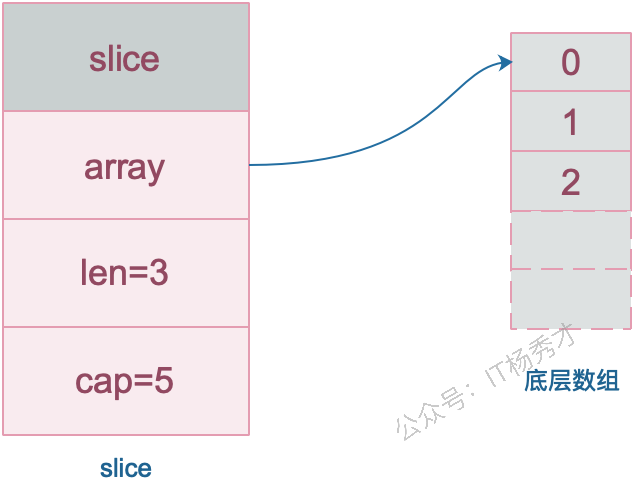
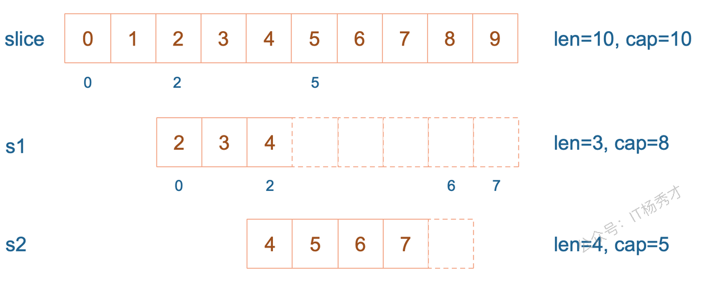
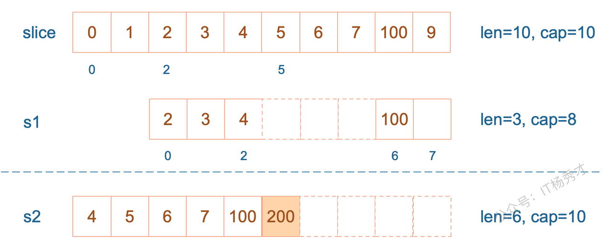
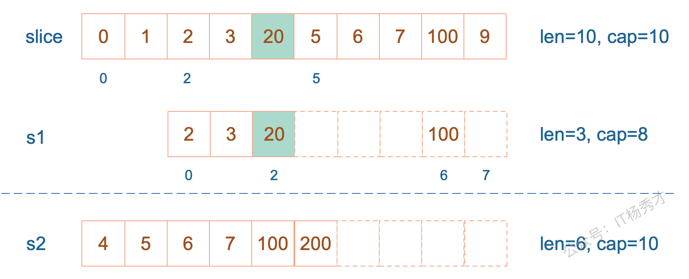

## slice的底层结构是怎样的？

slice 实际上是一个结构体，包含三个字段：长度、容量、底层数组

```go
type slice struct {
        array unsafe.Pointer // 元素指针
        len   int // 长度 
        cap   int // 容量
}
```



## 怎么扩容的

1.17及以前

1. 如果期望容量大于当前容量的两倍就会使用期望容量；
2. 如果当前切片的长度小于 1024 就会将容量翻倍；
3. 如果当前切片的长度大于 1024 就会每次增加 25% 的容量，直到新容量大于期望容量；

Go1.18及以后，引入了新的扩容规则：

- 当原slice容量(oldcap)小于256的时候，新slice(newcap)容量为原来的2倍；
- 原slice容量超过256，新slice容量newcap = oldcap+(oldcap+3*256)/4

## 从一个切片截取出另一个切片，修改新切片的值会影响原来的切片内容吗

在截取完之后，如果新切片没有触发扩容，则修改切片元素会影响原切片，如果触发了扩容则不会。

例子（可以先不管）：

`s1` 从 `slice` 索引2（闭区间）到索引5（开区间，元素真正取到索引4），长度为3，容量默认到数组结尾，为8。 `s2` 从 `s1` 的索引2（闭区间）到索引6（开区间，元素真正取到索引5），容量到索引7（开区间，真正到索引6），为5。



接着，向 `s2` 尾部追加一个元素 100：

```go
s2 = append(s2, 100)
```

`s2` 容量刚好够，直接追加。不过，这会修改原始数组对应位置的元素。这一改动，数组和 `s1` 都可以看得到。


再次向 `s2` 追加元素200

```go
s2 = append(s2, 200)
```

这时，`s2` 的容量不够用，该扩容了。于是，`s2` 另起炉灶，将原来的元素复制新的位置，扩大自己的容量。并且为了应对未来可能的 `append` 带来的再一次扩容，`s2` 会在此次扩容的时候多留一些 `buffer`，将新的容量将扩大为原始容量的2倍，也就是10了。



最后，修改 `s1` 索引为2位置的元素：

```go
s1[2] = 20
```

这次只会影响原始数组相应位置的元素。它影响不到 `s2` 了，人家已经远走高飞了。



再提一点，打印 `s1` 的时候，只会打印出 `s1` 长度以内的元素。所以，只会打印出3个元素，虽然它的底层数组不止3个元素。

## slice作为函数参数传递，会改变原slice吗？

当 slice 作为函数参数时，因为会**拷贝一份新的slice作为实参**，所以原来的 slice 结构并不会被函数中的操作改变，也就是说，slice 其实是一个结构体，包含了三个成员：len, cap, array并不会变化。但是需要注意的是，尽管slice结构不会变，但是其底层数组的数据如果有修改的话，则会发生变化。若传的是 slice 的指针，则原 slice 结构会变，底层数组的数据也会变。

