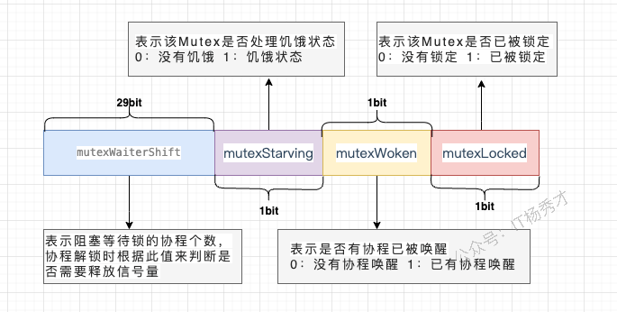
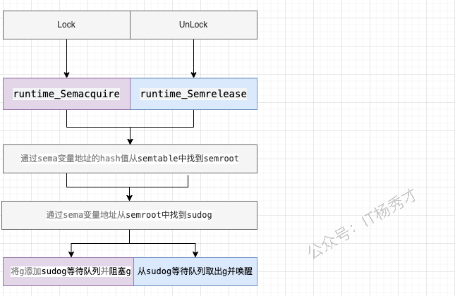
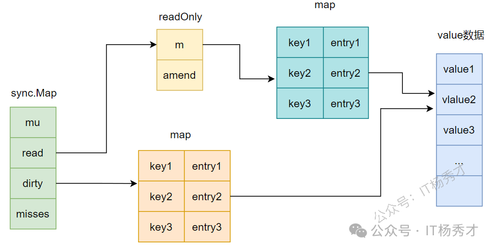

### 除了 mutex 以外还有那些方式安全读写共享变量？

除了Mutex，主要还有**信号量**、**通道（Channel），原子操作（atomic）**这几种方式。

信号量的实现其实跟mutex差不多，实现起来也很方便，主要通过信号量计数来保证。chanenl是Go最推崇的方式，它通过通信来传递数据所有权，从根源上避免竞争，更适合复杂的业务逻辑；而原子操作则针对最简单的整型或指针等进行无锁操作，性能最高，常用于实现计数器或状态位。选择哪种，完全取决于数据结构的复杂度和业务的读写模型。

### Go 语言是如何实现原子操作的？

Go语言实现原子操作，其根本是**依赖底层CPU硬件提供的原子指令**，而不是通过操作系统或更上层的锁机制。

具体来说，Go的`sync/atomic`包中的函数，在编译时会被编译器识别，并直接转换成对应目标硬件平台（如x86、ARM）的单条原子机器指令。例如，在x86架构上，`atomic.AddInt64`这类操作会对应到像`LOCK; ADD`这样的指令。前面的`LOCK`前缀是关键，它会锁住总线或缓存行，确保后续的`ADD`指令在执行期间，其他CPU核心不能访问这块内存，从而保证了整个操作的原子性。

### 聊聊原子操作和锁的区别？

原子操作和锁最核心的区别在于它们的**实现层级**和**保护范围**。

**原子操作**是CPU硬件层面的"微观"机制，它保证对单个数据（通常是整型或指针）的单次读改写操作是绝对不可分割的，性能极高，因为它不涉及操作系统内核的介入和goroutine的挂起。

**锁**则是操作系统或语言运行时提供的"宏观"机制，它保护的是一个**代码块**（临界区），而不仅仅是单个变量。当获取锁失败时，它会让goroutine休眠，而不是空耗CPU。虽然锁的开销远大于原子操作，但它能保护一段复杂的、涉及多个变量的业务逻辑。

所以，对于简单的计数器或标志位更新，用原子操作追求极致性能；而只要需要保护一段逻辑或多个变量的一致性，就必须用锁。

### Go语言互斥锁mutex底层是怎么实现的？

mutex底层是通过原子操作加信号量来实现的，通过atomic 包中的一些原子操作来实现锁的锁定，通过信号量来实现协程的阻塞与唤醒

**分析**

互斥锁对应的是底层结构是sync.Mutex结构体

```go
type Mutex struct {  
  state int32  
  sema  uint32
 }
```

state表示锁的状态，有锁定、被唤醒、饥饿模式等，并且是用state的二进制位来标识的，不同模式下会有不同的处理方式



sema表示信号量，mutex阻塞队列的定位是通过这个变量来实现的，从而实现goroutine的阻塞和唤醒



### Mutex 有几种模式？

Go的`Mutex`主要有两种模式：**正常模式（Normal Mode）和饥饿模式（Starvation Mode）**。

1. **正常模式**：这是默认模式，讲究的是性能。新请求锁的goroutine会和等待队列头部的goroutine竞争，新来的goroutine有几次"自旋"的机会，如果在此期间锁被释放，它就可以直接抢到锁。这种方式吞吐量高，但可能会导致队列头部的goroutine等待很久，即"不公平"。
2. **饥饿模式**：当一个goroutine在等待队列中等待超过1毫сан（1ms）后，Mutex就会切换到此模式，讲究的是公平。在此模式下，锁的所有权会直接从解锁的goroutine移交给等待队列的头部，新来的goroutine不会自旋，必须排到队尾。这样可以确保队列中的等待者不会被"饿死"。

当等待队列为空，或者一个goroutine拿到锁时发现它的等待时间小于1ms，饥饿模式就会结束，切换回正常模式。这两种模式的动态切换，是Go在性能和公平性之间做的精妙平衡。

### 在Mutex上自旋的goroutine 会占用太多资源吗

并不会，因为Go的自旋设计得非常"克制"和"智能"。

首先，自旋不是无休止的空转，它有严格的次数和时间限制，通常只持续几十纳秒。其次，自旋仅仅在特定条件下才会发生，比如CPU核数大于1，并且当前机器不算繁忙（没有太多goroutine在排队）。它是在赌，与其付出"goroutine挂起和唤醒"这种涉及内核调度的巨大代价，不如原地"稍等一下"，因为锁可能马上就释放了。

所以，这种自旋是一种机会主义的短线优化，目的是用极小的CPU开销去避免一次昂贵的上下文切换，在锁竞争不激烈、占用时间极短的场景下，它反而是**节省**了资源。

### Mutex 已经被一个 Goroutine 获取了, 其它等待中的 Goroutine 们只能一直等待。那么等这个锁释放后，等待中的 Goroutine 中哪一个会优先获取 Mutex 呢?

取决于Mutex当前处于正常模式还是饥饿模式。

在**正常模式**下，锁的分配是"不公平"的。当锁被释放时，等待队列中的第一个goroutine会被唤醒，但它**不一定**能拿到锁。它需要和那些此刻刚刚到达、正在自旋的新goroutine进行竞争。新来的goroutine因为正在CPU上运行，很有可能"插队"成功，直接抢到锁。这种策略的优点是吞吐量高，但缺点是可能导致等待队列中的goroutine被饿死。

而一旦Mutex进入**饥饿模式**，锁的分配就变得"绝对公平"。锁被释放后，会直接移交给等待队列的队头goroutine，任何新来的goroutine都不会参与竞争，必须乖乖排到队尾。

### sync.Once 的作用是什么，讲讲它的底层实现原理？

`sync.Once`的作用是**确保一个函数在程序生命周期内，无论在多少个goroutine中被调用，都只会被执行一次**。它常用于单例对象的初始化或一些只需要执行一次的全局配置加载

`sync.Once`保证代码段只执行1次的原理主要是其内部维护了一个标识位，当它 == 0 时表示还没执行过函数，此时会加锁修改标识位，然后执行对应函数。后续再执行时发现标识位 != 0，则不会再执行后续动作了

**分析**

Once其实是一个结构体

```go
type Once struct {
    done uint32  // 标识位
    m    Mutex
}
```

核心依赖一个`uint32`的`done`标志位和一个互斥锁`Mutex`，

当`Once.Do(f)`首次被调用时：

1. 它首先会通过原子操作（`atomic.LoadUint32`）快速检查`done`标志位。如果`done`为1，说明初始化已完成，直接返回，这个路径完全无锁，开销极小。
2. 如果`done`为0，说明可能是第一次调用，这时它会进入一个慢路径（`doSlow`）。
3. 在慢路径里，它会先**加锁**，然后**再次检查**`done`标志位。这个"双重检查"（Double-Checked Locking）是关键，它防止了在多个goroutine同时进入慢路径时，函数`f`被重复执行。
4. 如果此时`done`仍然为0，那么当前goroutine就会执行传入的函数`f`。执行完毕后，它会通过原子操作（`atomic.StoreUint32`）将`done`标志位置为1，最后**解锁**。

之后任何再调用`Do`的goroutine，都会在第一步的原子`Load`操作时发现`done`为1而直接返回。整个过程结合了原子操作的速度和互斥锁的安全性，高效且线程安全地实现了"仅执行一次"的保证

### WaiGroup 是怎样实现协程等待？

`WaitGroup`实现等待，本质上是**一个原子计数器和一个信号量的协作**。

调用`Add`会增加计数值，`Done`会减计数值。而`Wait`方法会检查这个计数器，如果不为零，就利用信号量将当前goroutine高效地挂起。直到最后一个`Done`调用将计数器清零，它就会通过这个信号量，一次性唤醒所有在`Wait`处等待的goroutine，从而实现等待目的。

**分析：**

waitgroup的结构定义：

```go
// A WaitGroup waits for a collection of goroutines to finish.
// The main goroutine calls Add to set the number of goroutines to wait for.
// Then each of the goroutines runs and calls Done when finished. At the same
// time, Wait can be used to block until all goroutines have finished.
//
// A WaitGroup must not be copied after first use.
type WaitGroup struct {
        noCopy noCopy // 用于vet工具检查是否被复制

        // 64位的值：高32位是计数器，低32位是等待的goroutine数量。
        // 通过原子操作访问，保存了状态和等待者数量。
        state atomic.Uint64

        // 用于等待者休眠的信号量。
        sema uint32
}
```

**`noCopy`**: 这是一个特殊的字段，用于静态分析工具（`go vet`）在编译时检查`WaitGroup`实例是否被复制。`WaitGroup`被复制后会导致状态不一致，可能引发程序错误，因此该字段的存在旨在防止此类问题的发生。

**`state`**: 这是`WaitGroup`的核心，一个64位的无符号整型，通过`sync/atomic`包进行原子操作，以保证并发安全。这个64位的空间被巧妙地分成了两部分：

- **高32位**: 作为**计数器（counter）**，记录了需要等待的 goroutine 的数量。
- **低32位**: 作为**等待者计数器（waiter count）**，记录了调用`Wait()`方法后被阻塞的 goroutine 的数量。

**`sema`**: 这是一个信号量，用于实现 goroutine 的阻塞和唤醒。当主 goroutine 调用`Wait()`方法且计数器不为零时，它会通过这个信号量进入休眠状态。当所有子 goroutine 完成任务后，会通过这个信号量来唤醒等待的主 goroutine。

### 讲讲sync.Map的底层原理

`sync.Map`的底层核心是**"空间换时间"，**通过两个Map（`read`和`dirty`）** 的冗余结构，实现"读写分离"，最终达到**针对特定场景的"读"操作无锁优化**。

它的`read`是一个只读的`map`，提供无锁的并发读取，速度极快。写操作则会先操作一个加了锁的、可读写的`dirty` map。当`dirty` map的数据积累到一定程度，或者`read` map中没有某个key时，`sync.Map`会将`dirty` map里的数据"晋升"并覆盖掉旧的`read` map，完成一次数据同步。

**分析：**

`sync.Map`的结构定义

```go
type Map struct {
   mu Mutex             //  用于保护dirty字段的锁
   read atomic.Value    // 只读字段，其实际的数据类型是一个readOnly结构
   dirty map[interface{}]*entry  //需要加锁才能访问的map，其中包含在read中除了被expunged(删除)以外的所有元素以及新加入的元素
   misses int // 计数器，记录在从read中读取数据的时候，没有命中的次数，当misses值等于dirty长度时，dirty提升为read
}
```

`read`字段的类型是`atomic.Value`，但是在使用中里面其实存储的是`readOnly`结构，`readOnly`结构定义如下：

```go
// readOnly is an immutable struct stored atomically in the Map.read field.
type readOnly struct {
   m       map[interface{}]*entry   // key为任意可比较类型，value为entry指针
   amended bool // amended为true，表明dirty中包含read中没有的数据，为false表明dirty中的数据在read中都存在
}
```

`entry`这个结构:

```go
type entry struct {
    p unsafe.Pointer  // p指向真正的value所在的地址
}
```



### read map和dirty map之间有什么关联？

它们之间是**"只读缓存"**和**"最新全集"**的关联。

`read` map是`dirty` map的一个不完全、且可能是过期的只读快照。`dirty` map则包含了所有的最新数据。

具体来说，`read` map中的所有数据，在`dirty` map里一定存在。一个key如果在`read` map里，那它的value要么就是最终值，要么就是一个特殊指针，指向`dirty` map里对应的条目。而`dirty` map里有，`read` map里却可能没有，因为`dirty`是最新、最全的。

当`dirty` map积累了足够多的新数据后，它会"晋升"为新的`read` map，旧的`read` map则被废弃。这个过程，就完成了"缓存"的更新。

### 为什么要设计nil和expunged两种删除状态？

设计`nil`和`expunged`这两个状态，是为了解决**在`sync.Map`的"读写分离"架构下，如何高效、无锁地处理"删除"操作**。

因为`read` map本身是只读的，我们不能直接从中删除一个key。所以，当用户调用`Delete`时，如果这个key只存在于`read` map中，系统并不会真的删除它，而是将它的值标记为一个特殊的"已删除"状态，这个状态就是`expunged`。后续的读操作如果看到这个`expunged`标记，就知道这个key其实已经不存在了，直接返回`nil, false`。

而`nil`则是一个中间状态，主要用于`dirty` map和`read` map的同步过程，表示这个key正在被删除或迁移。

简单来说，这两个状态就像是在只读的`read` map上打的"逻辑删除"补丁。它避免了因为一次`Delete`操作就引发加锁和map的整体复制，把真正的物理删除延迟到了`dirty` map"晋升"为`read` map的那一刻，是典型的用状态标记来换取无锁性能的设计。

### sync.Map 适用的场景？

`sync.Map`适合读多写少的场景，而不是和写多读少的场景。

因为我们期望将更多的流量在read map这一层进行拦截，从而避免加锁访问dirty map 对于更新，删除，读取，read map可以尽量通过一些原子操作，让整个操作变得无锁化，这样就可以避免进一步加锁访问dirty map。倘若写操作过多，sync.Map 基本等价于一把互斥锁 + map，其读写效率会大大下降