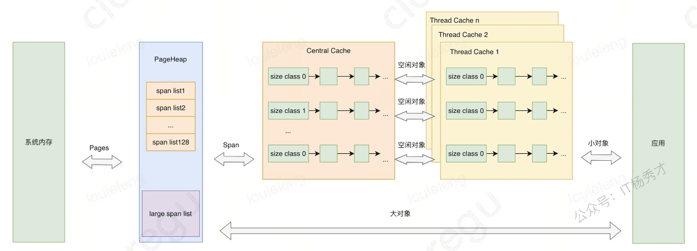

### 讲讲Go语言是如何分配内存的？

Go语言的内存分配采用了**TCMalloc算法**的改进版本，核心是分级分配和本地缓存。

**分配器架构**：Go内存分配有三个层级：**mcache（线程缓存）、mcentral（中央缓存）、mheap（页堆）**。每个P都有独立的mcache，避免了锁竞争；mcentral按对象大小分类管理；mheap负责从操作系统申请大块内存。

**对象分类分配**：根据对象大小分为三类处理：

- **微小对象**（<16字节）：在mcache的tiny分配器中分配，多个微小对象可以共享一个内存块
- **小对象**（16字节-32KB）：通过size class机制，预定义了67种大小规格，优先从P的mcache对应的mspan中分配，如果 mcache 没有内存，则从 mcentral 获取，如果 mcentral 也没有，则向 mheap 申请，如果 mheap 也没有，则从操作系统申请内存。
- **大对象**（>32KB）：直接从mheap分配，跨越多个页面

### 知道 golang 的内存逃逸吗？什么情况下会发生内存逃逸？

内存逃逸是编译器在程序编译时期根据逃逸分析策略，将原本应该分配到栈上的对象分配到堆上的一个过程

**主要逃逸场景**：

- **返回局部变量指针**：函数返回内部变量的地址，变量必须逃逸到堆上
- **interface{}类型**：传递给interface{}参数的具体类型会逃逸，因为需要运行时类型信息
- **闭包引用外部变量**：被闭包捕获的变量会逃逸到堆上
- **切片/map动态扩容**：当容量超出编译期确定范围时会逃逸
- **大对象**：超过栈大小限制的对象直接分配到堆上

### 内存逃逸有什么影响？

因为堆对象需要垃圾回收机制来释放内存，栈对象会跟随函数结束被编译器回收，所以大量的内存逃逸会给gc带来压力

### Channel是分配在栈上，还是堆上？

channel分配在堆上，Channel 被设计用来实现协程间通信的组件，其作用域和生命周期不可能仅限于某个函数内部，所以 一般情况下golang 直接将其分配在堆上

### Go语言在什么情况下会发生内存泄漏？

以下是一些内存泄漏的场景场景：

**goroutine泄漏**：这是最常见的泄漏场景。goroutine没有正常退出会一直占用内存，比如从channel读取数据但channel永远不会有数据写入，或者死循环没有退出条件。我在项目中遇到过，启动了处理任务的goroutine但没有合适的退出机制，导致随着请求增加goroutine越来越多。

**channel泄漏**：未关闭的channel和等待channel的goroutine会相互持有引用。比如生产者已经结束但没有关闭channel，消费者goroutine会一直阻塞等待，造成内存无法回收。

**slice引用大数组**：当slice引用一个大数组的小部分时，整个底层数组都无法被GC回收。解决方法是使用copy创建新的slice。

**map元素过多**：map中删除元素只是标记删除，底层bucket不会缩减。如果map曾经很大后来元素减少，内存占用仍然很高。

**定时器未停止**：`time.After`或`time.NewTimer`创建的定时器如果不手动停止，会在heap中持续存在。

**循环引用**：虽然Go的GC能处理循环引用，但在某些复杂场景下仍可能出现问题。

### Go语言发生了内存泄漏如何定位和优化？

**定位工具**：

- **pprof**：最重要的工具，通过`go tool pprof http://localhost:port/debug/pprof/heap`分析堆内存分布，`go tool pprof http://localhost:port/debug/pprof/goroutine`分析goroutine泄漏
- **trace工具**：`go tool trace`可以看到goroutine的生命周期和阻塞情况
- **runtime统计**：通过`runtime.ReadMemStats()`监控内存使用趋势，`runtime.NumGoroutine()`监控协程数量

**定位方法**：我通常先看内存增长曲线，如果内存持续上涨不回收，就用pprof分析哪个函数分配内存最多。如果是goroutine泄漏，会看到goroutine数量异常增长，然后分析这些goroutine阻塞在哪里。

**常见优化手段**：

- **goroutine泄漏**：使用context设置超时，确保goroutine有退出机制，避免无限阻塞
- **channel泄漏**：及时关闭channel，使用select+default避免阻塞
- **slice引用优化**：对大数组的小slice使用copy创建独立副本
- **定时器清理**：手动调用`timer.Stop()`释放资源