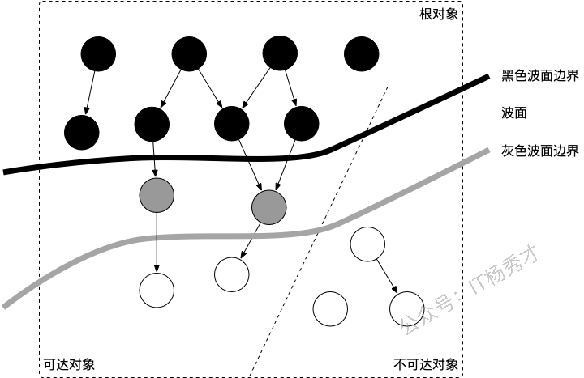
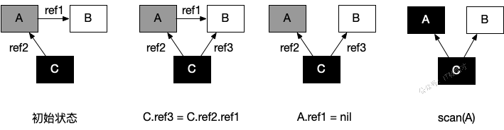
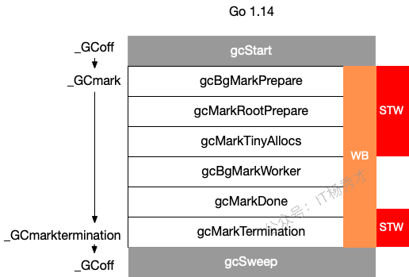

### 常见的 GC 实现方式有哪些？

所有的 GC 算法其存在形式可以归结为追踪（Tracing）GC和引用计数（Reference Counting）这两种形式的混合运用。

目前比较常见的实现方式有：

- 标记清扫：从根对象出发，将确定存活的对象进行标记，并清扫可以回收的对象。
- 标记整理：为了解决内存碎片问题而提出，在标记过程中，将对象尽可能整理到一块连续的内存上。
- 增量式：将标记与清扫的过程分批执行，每次执行很小的部分，从而增量的推进垃圾回收，达到近似实时、几乎无停顿的目的。
- 增量整理：在增量式的基础上，增加对对象的整理过程。
- 分代式：将对象根据存活时间的长短进行分类，存活时间小于某个值的为年轻代，存活时间大于某个值的为老年代，永远不会参与回收的对象为永久代。并根据分代假设（如果一个对象存活时间不长则倾向于被回收，如果一个对象已经存活很长时间则倾向于存活更长时间）对对象进行回收。
- 引用计数：根据对象自身的引用计数来回收，当引用计数归零时立即回收。

### Go 语言的 GC 使用的是什么？

Go 的 GC 目前使用的是无分代（对象没有代际之分）、不整理（回收过程中不对对象进行移动与整理）、并发（与用户代码并发执行）的三色标记清扫算法。

### 三色标记法是什么？

三色标记法是Go垃圾回收器使用的核心算法

**三色定义**：

- **白色**：未被访问的对象，垃圾回收结束后白色对象会被清理
- **灰色**：已被访问但其引用对象还未完全扫描的对象，是待处理队列
- **黑色**：已被访问且其所有引用对象都已扫描完成的对象，确认存活

**标记流程**：GC开始时所有对象都是白色，从GC Root（全局变量、栈变量等）开始将直接可达对象标记为灰色。然后不断从灰色队列中取出对象，扫描其引用的对象：如果引用对象是白色就标记为灰色，当前对象所有引用扫描完成后标记为黑色。重复这个过程直到灰色队列为空。

**分析：**



当垃圾回收开始时，只有白色对象。随着标记过程开始进行时，灰色对象开始出现（着色），这时候波面便开始扩大。当一个对象的所有子节点均完成扫描时，会被着色为黑色。当整个堆遍历完成时，只剩下黑色和白色对象，这时的黑色对象为可达对象，即存活；而白色对象为不可达对象，即死亡。这个过程可以视为以灰色对象为波面，将黑色对象和白色对象分离，使波面不断向前推进，直到所有可达的灰色对象都变为黑色对象为止的过程。如上图所示

### Go语言GC的根对象到底是什么？

根对象在垃圾回收的术语中又叫做根集合，它是垃圾回收器在标记过程时最先检查的对象，包括：

1. 全局变量：程序在编译期就能确定的那些存在于程序整个生命周期的变量。
2. 执行栈：每个 goroutine 都包含自己的执行栈，这些执行栈上包含栈上的变量及指向分配的堆内存区块的指针。
3. 寄存器：寄存器的值可能表示一个指针，参与计算的这些指针可能指向某些赋值器分配的堆内存区块。

### STW 是什么意思？

`STW` 是 `Stop the World` 的缩写，通常意义上指的是用户代码被完全停止运行，`STW` 越长，对用户代码造成的影响（例如延迟）就越大，早期 Go 对垃圾回收器的实现中 `STW` 长达几百毫秒，对时间敏感的实时通信等应用程序会造成巨大的影响。

### 并发标记清除法的难点是什么？

并发标记清除法的核心难点在于如何保证在用户程序并发修改对象引用时，垃圾回收器仍能正确识别存活对象。

**主要难点**：

- **对象消失问题**：在标记过程中，如果用户程序删除了从黑色对象到白色对象的引用，同时从灰色对象到该白色对象的引用也被删除，这个白色对象就会被错误回收，但它实际上还是可达的
- **新对象处理**：标记期间新分配的对象如何着色？如果标记为白色可能被误回收，标记为黑色可能造成浮动垃圾

**以如下例子来分析：**

| 时序 | 回收器               | 赋值器                                                       | ｜说明 |
| ---- | -------------------- | ------------------------------------------------------------ | ------ |
| 1    | shade(A, gray)       | 回收器：根对象的子节点着色为灰色对象                         |        |
| 2    | shade(C, black)      | 回收器：当所有子节点着色为灰色后，将节点着为黑色             |        |
| 3    | C.ref3 = C.ref2.ref1 | 赋值器：并发的修改了 C 的子节点                              |        |
| 4    | A.ref1 = nil         | 赋值器：并发的修改了 A 的子节点                              |        |
| 5    | shade(A.ref1, gray)  | 回收器：进一步灰色对象的子节点并着色为灰色对象，这时由于 A.ref1 为 nil，什么事情也没有发生 |        |
| 6    | shade(A, black)      | 回收器：由于所有子节点均已标记，回收器也不会重新扫描已经被标记为黑色的对象，此时 A 被着色为黑色，scan(A) 什么也不会发生，进而 B 在此次回收过程中永远不会被标记为黑色，进而错误地被回收 |        |

- 初始状态：假设某个黑色对象 C 指向某个灰色对象 A ，而 A 指向白色对象 B；
- `C.ref3 = C.ref2.ref1`：赋值器并发地将黑色对象 C 指向（ref3）了白色对象 B；
- `A.ref1 = nil`：移除灰色对象 A 对白色对象 B 的引用（ref2）；
- 最终状态：在继续扫描的过程中，白色对象 B 永远不会被标记为黑色对象了（回收器不会重新扫描黑色对象），进而对象 B 被错误地回收。



### Go语言是如何解决并发标记清除时，用户程序并发修改对象引用问题的？

Go通过**写屏障技术**和**三色不变性维护**来解决这个并发安全问题。

核心挑战是防止"对象消失"现象：当黑色对象新增对白色对象的引用，同时灰色到白色的引用被删除时，白色对象可能被错误回收。Go采用**混合写屏障**策略，在指针赋值时执行额外逻辑：新建引用时将目标对象着为灰色，删除引用时将被删对象标为灰色，这样确保关键对象不会丢失在标记过程中。

同时Go维护了**弱三色不变性**：允许黑色对象指向白色对象，但要保证从白色对象出发存在全灰色路径可达根对象。栈操作因为频繁且开销敏感，没有采用写屏障结束，而是做了特殊处理：标记开始和结束时分别扫描栈，中间过程不加写屏障。

这套机制让Go实现了微秒级STW时间，大部分GC工作都与用户程序并发执行，在保证回收正确性的同时将性能影响降到最低。

### 什么是写屏障、混合写屏障，如何实现？

写屏障的本质是在编译器在指针赋值操作中插入的额外很短的指令，当执行`*slot = ptr`这样的指针赋值时，写屏障会在赋值前后执行特定逻辑来标记相关对象，防止并发标记过程中对象被错误回收。

首先Dijkstra**插入写屏障**在建立新引用时将目标对象标为灰色，但删除引用时无保护；**Yuasa删除写屏障**在删除引用时将原对象标为灰色，但新建引用时无保护。两者各有局限性

Go 1.8后采用的混合写屏障，结合两者优点，在堆上在建立新引用和删除引用时分别采用**插入写屏障和删除写屏障的做法。但同时他会做了优化，**它不再需要STW去重扫了。它的新规则是，任何在GC标记阶段，被创建于栈上的新对象，默认都标记为黑色。这样一来，GC就不需要关心栈上的指针指向堆里的哪个白色对象了，因为栈本身就被看作是黑色的，它指向的对象必须是可达的。

### Go 语言中 GC 的流程是什么？

| 阶段             | 说明                                                       | 赋值器状态 |
| ---------------- | ---------------------------------------------------------- | ---------- |
| SweepTermination | 清扫终止阶段，为下一个阶段的并发标记做准备工作，启动写屏障 | STW        |
| Mark             | 扫描标记阶段，与赋值器并发执行，写屏障开启                 | 并发       |
| MarkTermination  | 标记终止阶段，保证一个周期内标记任务完成，停止写屏障       | STW        |
| GCoff            | 内存清扫阶段，将需要回收的内存归还到堆中，写屏障关闭       | 并发       |
| GCoff            | 内存归还阶段，将过多的内存归还给操作系统，写屏障关闭       | 并发       |

**分析：**

具体而言，各个阶段的触发函数分别为：



### GC触发的时机有哪些？

1. **主动触发**，通过调用 runtime.GC() 来触发 GC，此调用阻塞式地等待当前 GC 运行完毕。
2. **被动触发**，分为两种方式：
   - go后台有一系统监控线程，当超过两分钟没有产生任何 GC 时，强制触发 GC。
   - 内存使用增长一定比例时有可能会触发，每次内存分配时检查当前内存分配量是否已达到阈值（环境变量GOGC）：默认100%，即当内存扩大一倍时启用GC
     - 我们可以通过debug.SetGCPercent(500)来修改步调，这里表示，如果当前堆大小超过了上次标记的堆大小的500%，就会触发
     - 而第一次GC的触发的临界值是4MB

### GC 关注的指标有哪些？

- CPU 利用率：回收算法会在多大程度上拖慢程序？有时候，这个是通过回收占用的 CPU 时间与其它 CPU 时间的百分比来描述的。
- GC 停顿时间：回收器会造成多长时间的停顿？目前的 GC 中需要考虑 STW 和 Mark Assist 两个部分可能造成的停顿。
- GC 停顿频率：回收器造成的停顿频率是怎样的？目前的 GC 中需要考虑 STW 和 Mark Assist 两个部分可能造成的停顿。
- GC 可扩展性：当堆内存变大时，垃圾回收器的性能如何？但大部分的程序可能并不一定关心这个问题。

### 有了 GC，为什么还会发生内存泄露？

有GC机制的话，内存泄漏其实是预期的能很快被释放的内存其生命期意外地被延长，导致预计能够立即回收的内存而长时间得不到回收。

Go用语言主要有以下两种：

1. 内存被根对象引用而没有得到迅速释放 ，比如某个局部变量被赋值到了一个全局变量map中
2. goroutine 泄漏，一些不当的使用，导致goroutine不能正常退出，也会造成内存泄漏

### Go 的 GC 如何调优？

1. 合理化内存分配的速度、提高赋值器的 CPU 利用率
2. 降低并复用已经申请的内存 ，比如使用sync.pool复用经常需要创建的重复对象
3. 调整 GOGC ，可以适量将 GOGC 的值设置得更大，让 GC 触发的时间变得更晚，从而减少其触发频率，进而增加用户代码对机器的使用率

### 如何观察 Go GC？

主要有以下几种方式：

```go
package main

func allocate() {
        _ = make([]byte, 1<<20)
}

func main() {
        for n := 1; n < 100000; n++ {
                allocate()
        }
}
```

方式一：`GODEBUG=gctrace=1` 我们首先可以通过

```go
$ go build -o main
$ GODEBUG=gctrace=1 ./main

gc 1 @0.000s 2%: 0.009+0.23+0.004 ms clock, 0.11+0.083/0.019/0.14+0.049 ms cpu, 4->6->2 MB, 5 MB goal, 12 P
scvg: 8 KB released
scvg: inuse: 3, idle: 60, sys: 63, released: 57, consumed: 6 (MB)
gc 2 @0.001s 2%: 0.018+1.1+0.029 ms clock, 0.22+0.047/0.074/0.048+0.34 ms cpu, 4->7->3 MB, 5 MB goal, 12 P
scvg: inuse: 3, idle: 60, sys: 63, released: 56, consumed: 7 (MB)
gc 3 @0.003s 2%: 0.018+0.59+0.011 ms clock, 0.22+0.073/0.008/0.042+0.13 ms cpu, 5->6->1 MB, 6 MB goal, 12 P
scvg: 8 KB released
scvg: inuse: 2, idle: 61, sys: 63, released: 56, consumed: 7 (MB)
gc 4 @0.003s 4%: 0.019+0.70+0.054 ms clock, 0.23+0.051/0.047/0.085+0.65 ms cpu, 4->6->2 MB, 5 MB goal, 12 P
scvg: 8 KB released
scvg: inuse: 3, idle: 60, sys: 63, released: 56, consumed: 7 (MB)
scvg: 8 KB released
scvg: inuse: 4, idle: 59, sys: 63, released: 56, consumed: 7 (MB)
gc 5 @0.004s 12%: 0.021+0.26+0.49 ms clock, 0.26+0.046/0.037/0.11+5.8 ms cpu, 4->7->3 MB, 5 MB goal, 12 P
scvg: inuse: 5, idle: 58, sys: 63, released: 56, consumed: 7 (MB)
gc 6 @0.005s 12%: 0.020+0.17+0.004 ms clock, 0.25+0.080/0.070/0.053+0.051 ms cpu, 5->6->1 MB, 6 MB goal, 12 P
scvg: 8 KB released
scvg: inuse: 1, idle: 62, sys: 63, released: 56, consumed: 7 (MB)
```

在这个日志中可以观察到两类不同的信息：

```go
gc 1 @0.000s 2%: 0.009+0.23+0.004 ms clock, 0.11+0.083/0.019/0.14+0.049 ms cpu, 4->6->2 MB, 5 MB goal, 12 P
gc 2 @0.001s 2%: 0.018+1.1+0.029 ms clock, 0.22+0.047/0.074/0.048+0.34 ms cpu, 4->7->3 MB, 5 MB goal, 12 P
```

以及

```go
scvg: 8 KB released
scvg: inuse: 3, idle: 60, sys: 63, released: 57, consumed: 6 (MB)
scvg: inuse: 3, idle: 60, sys: 63, released: 56, consumed: 7 (MB)
```

对于用户代码向运行时申请内存产生的垃圾回收：

```go
gc 2 @0.001s 2%: 0.018+1.1+0.029 ms clock, 0.22+0.047/0.074/0.048+0.34 ms cpu, 4->7->3 MB, 5 MB goal, 12 P
```

含义由下表所示：

| 字段  | 含义                                           |
| ----- | ---------------------------------------------- |
| gc 2  | 第二个 GC 周期                                 |
| 0.001 | 程序开始后的 0.001 秒                          |
| 2%    | 该 GC 周期中 CPU 的使用率                      |
| 0.018 | 标记开始时， STW 所花费的时间（wall clock）    |
| 1.1   | 标记过程中，并发标记所花费的时间（wall clock） |
| 0.029 | 标记终止时， STW 所花费的时间（wall clock）    |
| 0.22  | 标记开始时， STW 所花费的时间（cpu time）      |
| 0.047 | 标记过程中，标记辅助所花费的时间（cpu time）   |
| 0.074 | 标记过程中，并发标记所花费的时间（cpu time）   |
| 0.048 | 标记过程中，GC 空闲的时间（cpu time）          |
| 0.34  | 标记终止时， STW 所花费的时间（cpu time）      |
| 4     | 标记开始时，堆的大小的实际值                   |
| 7     | 标记结束时，堆的大小的实际值                   |
| 3     | 标记结束时，标记为存活的对象大小               |
| 5     | 标记结束时，堆的大小的预测值                   |
| 12    | P 的数量                                       |

> wall clock 是指开始执行到完成所经历的实际时间，包括其他程序和本程序所消耗的时间； cpu time 是指特定程序使用 CPU 的时间； 他们存在以下关系：
>
> - wall clock < cpu time: 充分利用多核
> - wall clock ≈ cpu time: 未并行执行
> - wall clock > cpu time: 多核优势不明显

对于运行时向操作系统申请内存产生的垃圾回收（向操作系统归还多余的内存）：

```go
scvg: 8 KB released
scvg: inuse: 3, idle: 60, sys: 63, released: 57, consumed: 6 (MB)
```

含义由下表所示：

| 字段          | 含义                                                       |
| ------------- | ---------------------------------------------------------- |
| 8 KB released | 向操作系统归还了 8 KB 内存                                 |
| 3             | 已经分配给用户代码、正在使用的总内存大小 (MB)              |
| 60            | 空闲以及等待归还给操作系统的总内存大小（MB）               |
| 63            | 通知操作系统中保留的内存大小（MB）                         |
| 57            | 已经归还给操作系统的（或者说还未正式申请）的内存大小（MB） |
| 6             | 已经从操作系统中申请的内存大小（MB）                       |

方式二：`go tool trace`

`go tool trace` 的主要功能是将统计而来的信息以一种可视化的方式展示给用户。要使用此工具，可以通过调用 trace API：

```go
package main

func main() {
        f, _ := os.Create("trace.out")
        defer f.Close()
        trace.Start(f)
        defer trace.Stop()
        (...)
}
```

并通过

```go
$ go tool trace trace.out
2019/12/30 15:50:33 Parsing trace...
2019/12/30 15:50:38 Splitting trace...
2019/12/30 15:50:45 Opening browser. Trace viewer is listening on http://127.0.0.1:51839
```

来启动可视化界面：


方式三：`debug.ReadGCStats`

此方式可以通过代码的方式来直接实现对感兴趣指标的监控，例如我们希望每隔一秒钟监控一次 GC 的状态：

```go
func printGCStats() {
        t := time.NewTicker(time.Second)
        s := debug.GCStats{}
        for {
                select {
                case <-t.C:
                        debug.ReadGCStats(&s)
                        fmt.Printf("gc %d last@%v, PauseTotal %v\n", s.NumGC, s.LastGC, s.PauseTotal)
                }
        }
}
func main() {
        go printGCStats()
        (...)
}
```

我们能够看到如下输出：

```go
$ go run main.go

gc 4954 last@2019-12-30 15:19:37.505575 +0100 CET, PauseTotal 29.901171ms
gc 9195 last@2019-12-30 15:19:38.50565 +0100 CET, PauseTotal 77.579622ms
gc 13502 last@2019-12-30 15:19:39.505714 +0100 CET, PauseTotal 128.022307ms
gc 17555 last@2019-12-30 15:19:40.505579 +0100 CET, PauseTotal 182.816528ms
gc 21838 last@2019-12-30 15:19:41.505595 +0100 CET, PauseTotal 246.618502ms
```

方式四：`runtime.ReadMemStats`

除了使用 debug 包提供的方法外，还可以直接通过运行时的内存相关的 API 进行监控：

```go
func printMemStats() {
        t := time.NewTicker(time.Second)
        s := runtime.MemStats{}

        for {
                select {
                case <-t.C:
                        runtime.ReadMemStats(&s)
                        fmt.Printf("gc %d last@%v, next_heap_size@%vMB\n", s.NumGC, time.Unix(int64(time.Duration(s.LastGC).Seconds()), 0), s.NextGC/(1<<20))
                }
        }
}
func main() {
        go printMemStats()
        (...)
}
$ go run main.go

gc 4887 last@2019-12-30 15:44:56 +0100 CET, next_heap_size@4MB
gc 10049 last@2019-12-30 15:44:57 +0100 CET, next_heap_size@4MB
gc 15231 last@2019-12-30 15:44:58 +0100 CET, next_heap_size@4MB
gc 20378 last@2019-12-30 15:44:59 +0100 CET, next_heap_size@6MB
```