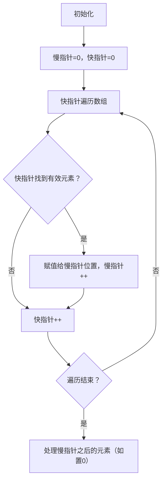
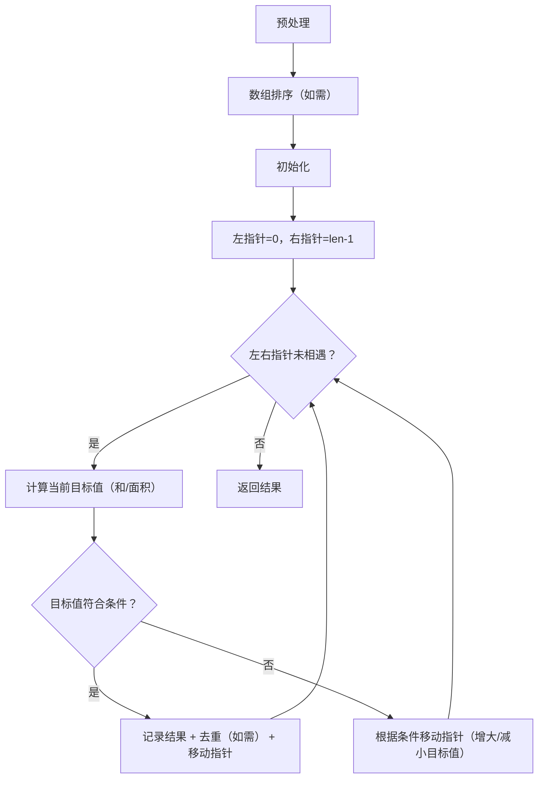

# 移动0

这个题目没有难度但是要注意两个点

1. 人家是要保持非0元素相对位置不变，所以就是说没法用左右指针
2. 如果先做slow的移动再做交换判断，在判断这一步会遇到数组越界（当然可以前面打个补丁判断，但是更优雅的方法就是先交换判断再去slow++）
3. btw：fast指针直接放在遍历里面很省事，而且注意range的后参数省略的时候不用用下划线写法

```go
func moveZeroes(nums []int) {
	//快慢指针  因为要保证元素的相对顺序
	slow := 0
	// 慢指针遇到0停止 快指针遇到非零去赋值
	for fast := range nums {
		if nums[fast] != 0 && nums[slow] == 0 {
			nums[slow] = nums[fast]
			nums[fast] = 0
			slow++
		}
		
		if nums[slow] != 0 {
			slow++
		}
		
	}
}
```

# 盛水最大容器

```
func maxArea(height []int) int {
	//用左右指针直到相遇 所以我们需要一个记录最大值的东西
	left := 0
	right := len(height) - 1
	maxContent := 0
	for left < right { //相等的话宽度是0，没有意义
		//先计算
		height_tmp := 0
		if height[left] > height[right] {
			height_tmp = height[right]
		} else {
			height_tmp = height[left]
		}
		length := right - left
		tmp := height_tmp * length
		if maxContent < tmp {
			maxContent = tmp
		}
		//再移动 移动低的那一个（因为这个最大容量是 最矮边高x宽度 只能提高这个最矮边才有可能增大结果）
		if height[left] > height[right] {
			right--
		} else {
			left++
		}
	}

	return maxContent
}
```

这个题目的核心点就是移动最矮的边，准确来说就是想到左右指针（那么为什么能想到左右指针呢？我感觉是因为有一个循环的终止条件是要遍历完所有的边而且计算是尽可能的拓宽宽度）

值得注意的是，go貌似不支持三元式这种优雅的写法

# 三数之和

```go
func threeSum(nums []int) [][]int {
	results := [][]int{}
	//边界检查
	if len(nums) < 3{
		return results
	}

	//先对数组进行一个排序 可以自己搓一个冒泡
	//sort.Ints(nums)
	sort.Slice(nums,func(i,j int)bool{
		return nums[i] < nums[j]
	})
	//遍历整个排序后的序列 定起点 移快慢（注意如果是和下一个位置相同的话直接跳过）
	for i := range nums{
		//如果这个元素已经大于0 说明不可能有结果为0的情况了 直接结束
		if nums[i] > 0 {
			break
		}
		//避免出现重复的 同时避免数组越界
		if i>0 && nums[i] == nums[i-1]{
			continue
		}
		//用左右指针搜索剩余区域
		left , right := i+1,len(nums)-1
		//一次只移动一个，如果sum<0 左指针右移 如果sum大于0的话 右指针左移
		for left < right {
			sum := nums[left]+nums[right]+nums[i]
			if sum == 0{
				results = append(results,[]int{nums[left],nums[right],nums[i]})
				//避免移动之后的左数不变重复计算
				for left < right && nums[left] == nums[left+1]{
					left++
				}
				for left < right && nums[right] == nums[right-1]{
					right--
				}
				// 同时移动指针，寻找下一个可能的组合
				left++
				right--
			} else if sum < 0{
				left++
			}else if sum > 0{
				right--
			}
		}
	}

	return results
}
```

这个题目的主要思路就是：

- 先升序排列（降序也可以）
- 主循环顺序移动一个数字
- 每一个数字都会对应到两个指针对右面的数字使用左右指针的方法去找到最佳结果

易错点

- 注意指针移动方向
- 注意数组越界

# 总结

### 一、双指针的核心定义

双指针指的是在遍历数据结构（通常是数组 / 链表）时，使用**两个指针**（索引）来代替单指针，通过指针的移动、配合，减少时间 / 空间复杂度（通常能把暴力解法的 O (n²) 优化为 O (n)）。

核心优势：**用空间换时间**，或**原地操作**（避免额外空间）。

### 二、双指针的核心使用场景（结合你做的题目）

根据指针的移动方向，双指针主要分为 3 类，对应不同场景：

|        类型        |         核心特征         |                       典型场景                       |       对应你的题目       |
| :----------------: | :----------------------: | :--------------------------------------------------: | :----------------------: |
| 同向双指针（快慢） |    两个指针同方向移动    | 1. 原地修改数组（去重 / 移动元素）2. 找子数组 / 子串 |    移动零（快慢指针）    |
| 对向双指针（左右） |   指针从两端向中间移动   |   1. 求最值（面积 / 长度）2. 两数 / 三数之和类问题   | 盛最多水的容器、三数之和 |
|     分离双指针     | 两个指针分别遍历两个数组 |               合并两个有序数组 / 链表                |    拓展题目（见下文）    |

#### 场景拆解（结合你的题目）

1. **同向双指针（快慢）**

   

   - 适用：需要**原地修改数组**，且要保持元素相对顺序的场景；
   - 核心：慢指针记录 “有效位置”，快指针遍历找 “有效元素”，找到后赋值给慢指针位置，慢指针右移；
   - 例子：移动零（慢指针记录非零元素位置，快指针找非零元素）。

   

2. **对向双指针（左右）**

   

   - 适用：数组**有序**（或排序后可解），需要找 “两数 / 三数组合” 或 “最值” 的场景；
   - 核心：通过指针移动控制 “总和 / 面积” 的大小，减少无效遍历；
   - 例子：
     - 盛最多水的容器：移动较矮的指针，尝试增大 “最小高度”，从而可能增大面积；
     - 三数之和：排序后固定一个数，左右指针找另外两个数，通过移动指针控制三数之和的大小。

### 三、双指针的核心使用方法（步骤化）

结合你的题目，总结通用解题步骤：

#### 1. 同向双指针（快慢）解题步骤



- 关键：**慢指针不回退**，只记录有效位置；快指针负责 “探索”。
- 例子：移动零中，快指针找非零元素，慢指针记录非零元素的放置位置，最后慢指针后全部置 0。

#### 2. 对向双指针（左右）解题步骤



- 关键：
  - 排序是对向双指针解 “求和类” 问题的前提（三数之和必须排序）；
  - 指针移动的逻辑：根据 “目标值” 的大小，决定移动左 / 右指针（核心！你之前的错误主要在这里）：
    - 盛最多水的容器：面积 = 宽度 × 最小高度 → 移动较矮的指针；
    - 三数之和：sum>0 → 右指针左移（减小总和），sum<0 → 左指针右移（增大总和）。

### 四、必刷力扣双指针题目（分难度，从易到难）

结合你已做的题目，按 “同向→对向→拓展” 的顺序推荐，帮你巩固：

#### 基础篇（同向双指针）

| 题目编号 |         题目名称          | 难度 |          核心考点           |
| :------: | :-----------------------: | :--: | :-------------------------: |
|    26    |  删除有序数组中的重复项   | 简单 |   同向快慢指针，原地去重    |
|    27    |         移除元素          | 简单 | 同向快慢指针，原地移除元素  |
|    80    | 删除有序数组中的重复项 II | 中等 | 快慢指针，允许最多 2 个重复 |

#### 进阶篇（对向双指针）

| 题目编号 |         题目名称         | 难度 |               核心考点                |
| :------: | :----------------------: | :--: | :-----------------------------------: |
|    1     |         两数之和         | 简单 |   对向双指针（数组排序后）/ 哈希表    |
|    15    |    三数之和（你做的）    | 中等 | 排序 + 固定单指针 + 对向双指针 + 去重 |
|    16    |     最接近的三数之和     | 中等 |   三数之和变种，找最接近目标值的和    |
|    11    | 盛最多水的容器（你做的） | 中等 |        对向双指针，求面积最值         |
|    18    |         四数之和         | 中等 |  三数之和拓展，嵌套固定指针 + 双指针  |

#### 拓展篇（分离双指针）

| 题目编号 |     题目名称     | 难度 |                核心考点                |
| :------: | :--------------: | :--: | :------------------------------------: |
|    88    | 合并两个有序数组 | 简单 | 两个指针分别遍历两个数组，从后往前合并 |
|    21    | 合并两个有序链表 | 简单 |            链表版分离双指针            |

### 五、关键技巧 & 避坑点（结合你的踩坑经历）

1. **排序的重要性**：对向双指针解 “求和类” 问题时，排序是前提（三数之和必须排序，否则无法控制 sum 的大小，也无法去重）；
2. **指针移动逻辑**：这是你最容易踩坑的点！一定要记住：
   - 升序数组中，sum <目标值 → 左指针右移（增大值）；sum> 目标值 → 右指针左移（减小值）；
   - 盛最多水的容器：移动较矮的指针（因为面积由矮边决定）；
3. **去重逻辑**：
   - 三数之和中，要对 “固定指针 i”“左指针 left”“右指针 right” 分别去重；
   - 去重时必须加边界判断（如 `i>0`、`left<right`），避免数组越界；
4. **边界处理**：
   - 数组长度不足时（如三数之和 len<3），直接返回空；
   - 指针移动时避免越界（如 `left < right` 是对向双指针的核心循环条件）。

### 总结

1. 双指针核心分**同向（快慢）** 和**对向（左右）** 两类，同向用于原地修改数组，对向用于有序数组的求和 / 最值问题；
2. 对向双指针的关键是**排序 + 指针移动逻辑**，一定要牢记 “升序数组中，sum 小移左、sum 大移右”；
3. 去重和边界判断是双指针解 “求和类” 问题的必考点，也是新手最容易踩坑的地方；
4. 练习建议：先刷基础同向双指针（26、27），再巩固对向双指针（1、16），最后拓展分离双指针（88），逐步掌握核心逻辑。