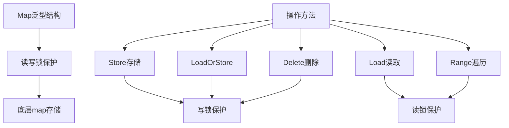
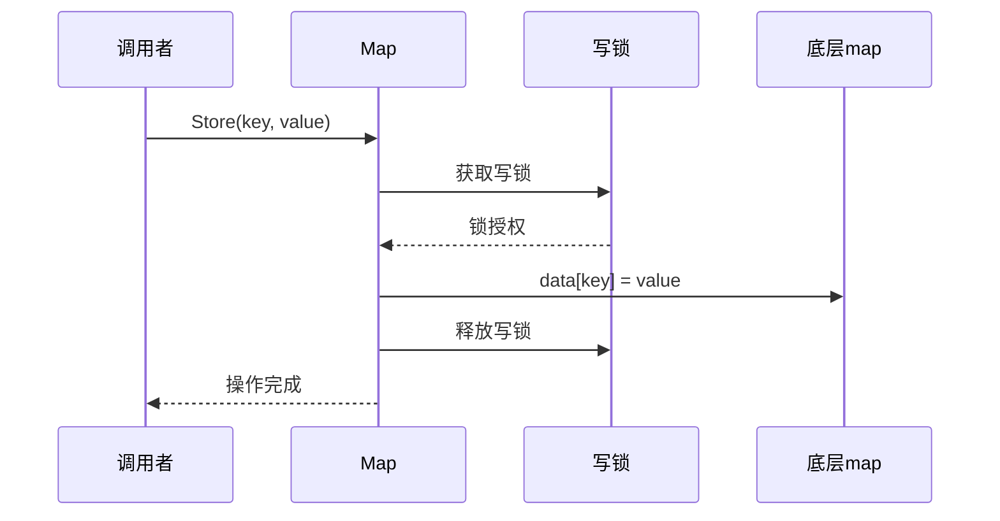
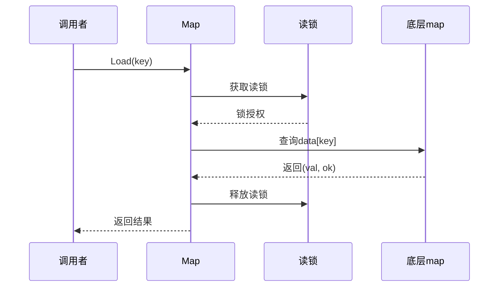
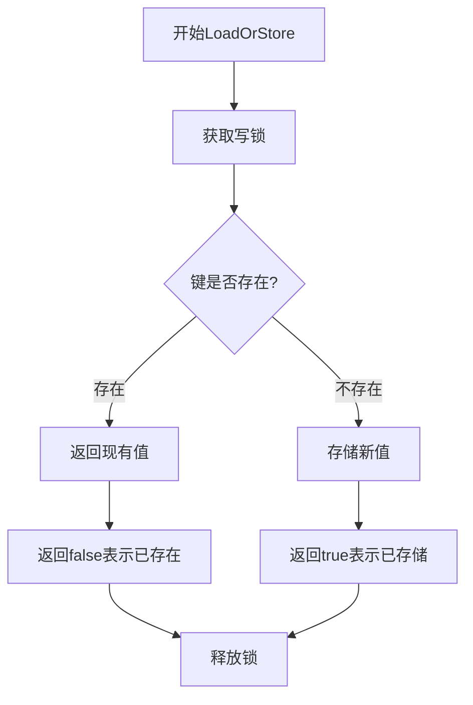
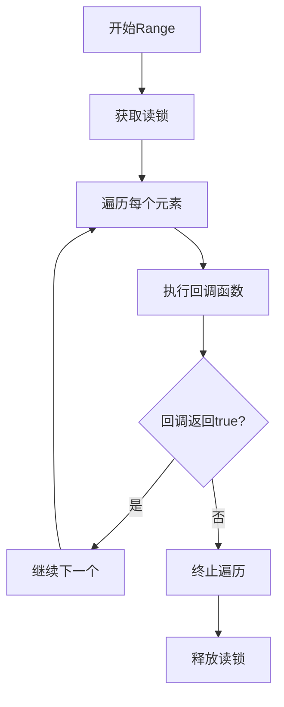
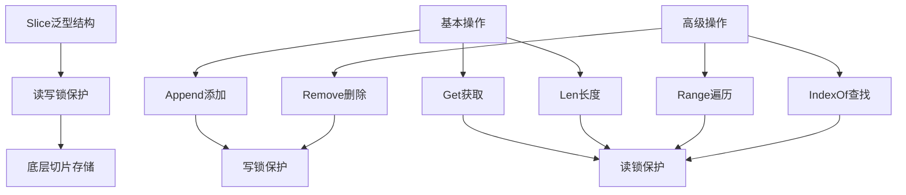
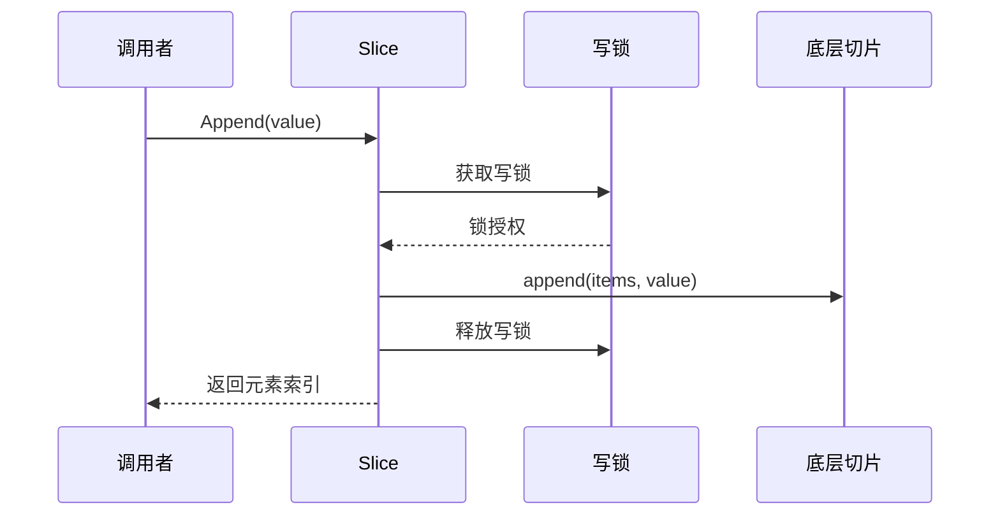
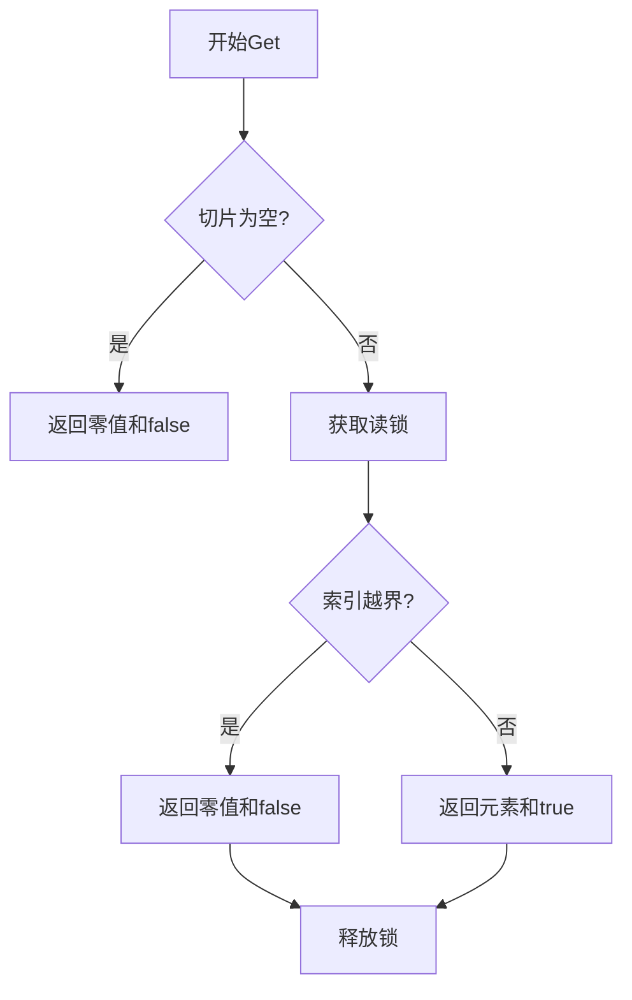
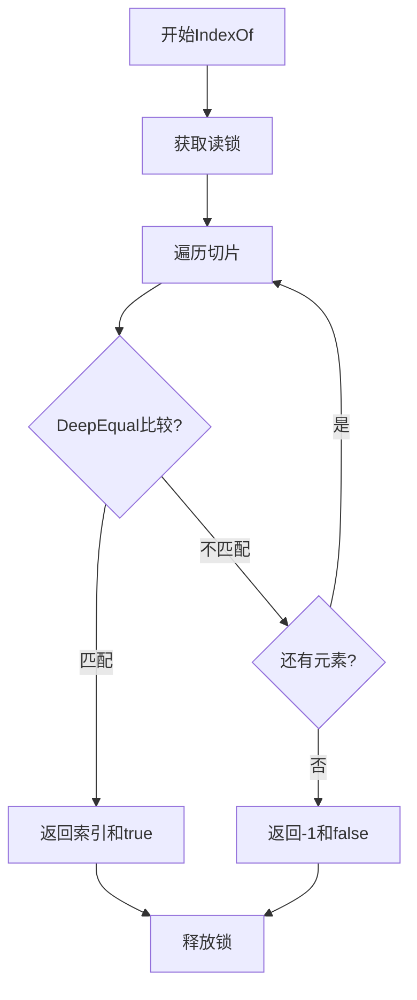
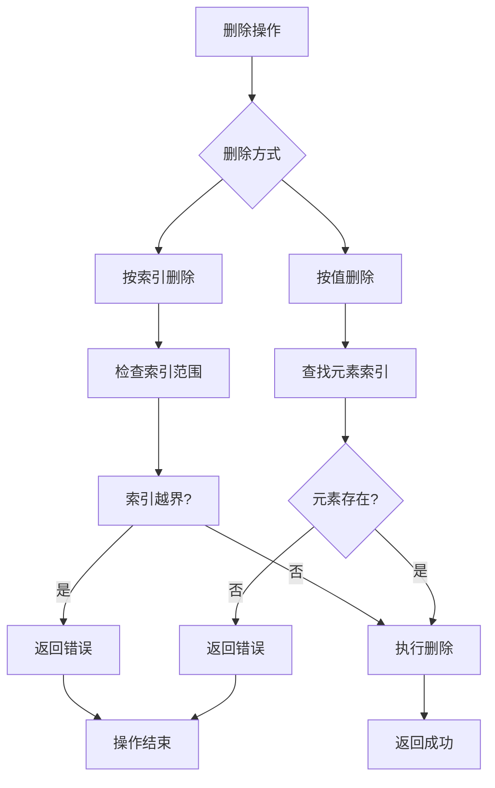

# Map 线程安全实现

## 代码

```go
// 定义一个支持泛型的线程安全 Map
type Map[K comparable, V any] struct {
	mu   sync.RWMutex
	data map[K]V
}

// 构造函数，初始化 Map
func NewMap[K comparable, V any]() *Map[K, V] {
	return &Map[K, V]{data: make(map[K]V)}
}

// Store 存储一个键值对
func (m *Map[K, V]) Store(key K, value V) {
	m.mu.Lock()
	defer m.mu.Unlock()
	m.data[key] = value
}

// Load 获取键对应的值
func (m *Map[K, V]) Load(key K) (V, bool) {
	m.mu.RLock()
	defer m.mu.RUnlock()
	val, ok := m.data[key]
	return val, ok
}

// LoadOrStore 如果键存在返回值，否则存储键值对并返回存储的值
func (m *Map[K, V]) LoadOrStore(key K, value V) (V, bool) {
	m.mu.Lock() // 使用写锁
	defer m.mu.Unlock()
	val, ok := m.data[key]
	if ok {
		return val, false // 键已存在，返回原值
	}
	m.data[key] = value
	return value, true // 存储并返回新值
}

// Delete 删除一个键值对
func (m *Map[K, V]) Delete(key K) {
	m.mu.Lock() // 使用写锁
	defer m.mu.Unlock()
	delete(m.data, key)
}

// Range 遍历所有键值对
func (m *Map[K, V]) Range(f func(key K, value V) bool) {
	m.mu.RLock() // 使用读锁
	defer m.mu.RUnlock()
	for key, value := range m.data {
		if !f(key, value) {
			break
		}
	}
}

```

整体架构设计



### 1.1 `Store(key K, value V)` - 存储键值对
```go
func (m *Map[K, V]) Store(key K, value V) {
    m.mu.Lock()
    defer m.mu.Unlock()
    m.data[key] = value
}
```

**执行流程：**


**逻辑分析：**
- 获取**写锁**确保并发安全
- 直接操作底层map进行存储
- 使用defer确保锁一定会释放
- 时间复杂度：O(1)

### 1.2 `Load(key K) (V, bool)` - 读取键值
```go
func (m *Map[K, V]) Load(key K) (V, bool) {
    m.mu.RLock()
    defer m.mu.RUnlock()
    val, ok := m.data[key]
    return val, ok
}
```

**执行流程：**


**特点：**
- 使用**读锁**，支持并发读取
- 返回值和是否存在标志
- 读操作不会阻塞其他读操作

### 1.3 `LoadOrStore(key K, value V) (V, bool)` - 原子性加载或存储
```go
func (m *Map[K, V]) LoadOrStore(key K, value V) (V, bool) {
    m.mu.Lock() // 使用写锁
    defer m.mu.Unlock()
    val, ok := m.data[key]
    if ok {
        return val, false // 键已存在，返回原值
    }
    m.data[key] = value
    return value, true // 存储并返回新值
}
```

**决策流程：**


**关键设计：**
- 使用**写锁**确保操作的原子性
- 避免"先检查后执行"的竞态条件
- 返回值指示是加载还是存储操作

### 1.4 `Delete(key K)` - 删除键值对
```go
func (m *Map[K, V]) Delete(key K) {
    m.mu.Lock() // 使用写锁
    defer m.mu.Unlock()
    delete(m.data, key)
}
```

**逻辑：**
- 写锁保护删除操作
- 直接调用内置delete函数
- 如果key不存在，操作静默失败

### 1.5 `Range(f func(key K, value V) bool)` - 安全遍历
```go
func (m *Map[K, V]) Range(f func(key K, value V) bool) {
    m.mu.RLock() // 使用读锁
    defer m.mu.RUnlock()
    for key, value := range m.data {
        if !f(key, value) {
            break // 如果回调函数返回 false，终止遍历
        }
    }
}
```

**遍历控制流程：**


**特点：**
- 读锁保护，遍历期间map不会被修改
- 回调函数可以控制遍历的提前终止
- 遍历期间其他读操作可以并发执行

# Slice 线程安全实现

## 代码

```go
// Slice 是一个线程安全的泛型切片
type Slice[T any] struct {
	mu    sync.RWMutex
	items []T
}

// 创建一个新的条件泛型队列
func NewSlice[T any]() *Slice[T] {
	return &Slice[T]{
		items: make([]T, 0),
	}
}

// Len 返回切片的长度
func (s *Slice[T]) Len() int {
	s.mu.RLock()
	length := len(s.items)
	s.mu.RUnlock()
	return length
}

// Append 添加元素并返回索引
func (s *Slice[T]) Append(value T) int {
	s.mu.Lock()
	defer s.mu.Unlock()

	s.items = append(s.items, value)
	return len(s.items) - 1
}

// All 获取切片中的所有元素
func (s *Slice[T]) All() []T {
	s.mu.RLock()
	defer s.mu.RUnlock()

	items := make([]T, len(s.items))
	copy(items, s.items)
	return items
}

// Get 获取指定索引的元素
func (s *Slice[T]) Get(index int) (T, bool) {
	if len(s.items) == 0 {
		var value T
		return value, false
	}

	s.mu.RLock()
	defer s.mu.RUnlock()

	var value T
	if index < 0 || index >= len(s.items) {
		return value, false
	}
	return s.items[index], true
}

// Range 遍历切片中的所有元素
func (s *Slice[T]) Range(f func(index int, value T) bool) {
	s.mu.RLock()
	defer s.mu.RUnlock()

	// 遍历切片并执行回调函数
	for i, v := range s.items {
		if !f(i, v) {
			break // 如果回调函数返回 false，终止遍历
		}
	}
}

// IndexOf 查找元素的索引
func (s *Slice[T]) IndexOf(value T) (int, bool) {
	s.mu.RLock()
	defer s.mu.RUnlock()
	return s.indexOf(value)
}

// RemoveAtIndex 删除指定索引的元素
func (s *Slice[T]) RemoveAtIndex(index int) (bool, error) {
	s.mu.Lock()
	defer s.mu.Unlock()

	if index < 0 || index >= len(s.items) {
		return false, fmt.Errorf("index out of range: %d", index)
	}

	s.removeAtIndex(index)
	return true, nil
}

// RemoveAtValue 删除指定值的元素
func (s *Slice[T]) RemoveAtValue(value T) (bool, error) {
	s.mu.Lock()
	defer s.mu.Unlock()

	index, found := s.indexOf(value)
	if !found {
		return false, fmt.Errorf("element not found: %v", value)
	}

	s.removeAtIndex(index)
	return true, nil
}

// removeAtIndex 删除指定索引的元素（内部使用）
func (s *Slice[T]) removeAtIndex(index int) {
	s.items = append(s.items[:index], s.items[index+1:]...)
}

// indexOf 查找元素的索引（内部使用）
func (s *Slice[T]) indexOf(value T) (int, bool) {
	// items := append([]T(nil), s.items...) // 生成一个新的切片副本
	for i, v := range s.items {
		if reflect.DeepEqual(v, value) {
			return i, true
		}
		// if v == value {
		// 	return i, true
		// }
	}
	return -1, false
}

```


## 整体架构设计


### 2.1 `Append(value T) int` - 添加元素
```go
func (s *Slice[T]) Append(value T) int {
    s.mu.Lock()
    defer s.mu.Unlock()
    s.items = append(s.items, value)
    return len(s.items) - 1
}
```

**执行流程：**


**特点：**
- 返回新元素的索引位置
- 自动处理切片扩容
- 写锁确保并发安全

### 2.2 `Get(index int) (T, bool)` - 获取元素
```go
func (s *Slice[T]) Get(index int) (T, bool) {
    if len(s.items) == 0 {
        var value T
        return value, false
    }
    
    s.mu.RLock()
    defer s.mu.RUnlock()
    
    var value T
    if index < 0 || index >= len(s.items) {
        return value, false
    }
    return s.items[index], true
}
```

**边界检查流程：**


### 2.3 `Len() int` - 获取长度
```go
func (s *Slice[T]) Len() int {
    s.mu.RLock()
    length := len(s.items)
    s.mu.RUnlock()
    return length
}
```

**优化点：**
- 手动控制锁范围，避免defer开销
- 读锁保护，支持并发调用
- 快速返回切片长度

### 2.4 `Range(f func(index int, value T) bool)` - 安全遍历
```go
func (s *Slice[T]) Range(f func(index int, value T) bool) {
    s.mu.RLock()
    defer s.mu.RUnlock()
    
    for i, v := range s.items {
        if !f(i, v) {
            break // 如果回调函数返回 false，终止遍历
        }
    }
}
```

**遍历控制：**
- 读锁保护遍历过程
- 回调函数接收索引和值
- 支持提前终止遍历

### 2.5 `IndexOf(value T) (int, bool)` - 查找元素索引
```go
func (s *Slice[T]) IndexOf(value T) (int, bool) {
    s.mu.RLock()
    defer s.mu.RUnlock()
    return s.indexOf(value)
}

// 内部实现
func (s *Slice[T]) indexOf(value T) (int, bool) {
    for i, v := range s.items {
        if reflect.DeepEqual(v, value) {
            return i, true
        }
    }
    return -1, false
}
```

**查找逻辑：**


**关键设计：**
- 使用 `reflect.DeepEqual` 支持复杂类型比较
- 内部方法避免重复加锁

### 2.6 删除操作系列

#### `RemoveAtIndex(index int)` - 按索引删除
```go
func (s *Slice[T]) RemoveAtIndex(index int) (bool, error) {
    s.mu.Lock()
    defer s.mu.Unlock()
    
    if index < 0 || index >= len(s.items) {
        return false, fmt.Errorf("index out of range: %d", index)
    }
    
    s.removeAtIndex(index)
    return true, nil
}
```

#### `RemoveAtValue(value T)` - 按值删除
```go
func (s *Slice[T]) RemoveAtValue(value T) (bool, error) {
    s.mu.Lock()
    defer s.mu.Unlock()
    
    index, found := s.indexOf(value)
    if !found {
        return false, fmt.Errorf("element not found: %v", value)
    }
    
    s.removeAtIndex(index)
    return true, nil
}
```

**删除操作流程：**


### 2.7 `All() []T` - 获取切片副本
```go
func (s *Slice[T]) All() []T {
    s.mu.RLock()
    defer s.mu.RUnlock()
    
    items := make([]T, len(s.items))
    copy(items, s.items)
    return items
}
```

**重要特性：**
- 返回切片的**完整副本**，不是引用
- 调用者可以安全修改返回的切片
- 读锁保护复制操作

## 3. 设计亮点总结

### 3.1 锁策略优化
- **读写分离**：读操作用读锁，写操作用写锁
- **锁粒度控制**：精确控制锁的范围
- **避免死锁**：使用defer确保锁释放

### 3.2 泛型支持
```go
// 支持任意可比较键类型和任意值类型
type Map[K comparable, V any] struct

// 支持任意元素类型
type Slice[T any] struct
```

### 3.3 错误处理
- 明确的错误返回值
- 边界条件检查
- 合理的默认值返回

### 3.4 性能考虑
- 减少不必要的内存分配
- 优化锁持有时间
- 提供批量操作接口

这两个线程安全容器为并发编程提供了可靠的基础数据结构，既保证了线程安全，又保持了良好的性能特性。