# 机制介绍

## 概述

本文档详细说明了机器狗项目中断连恢复策略的实现，包括指数退避重连机制、连接状态管理和相关API。

## 架构设计

### 1. 连接恢复策略

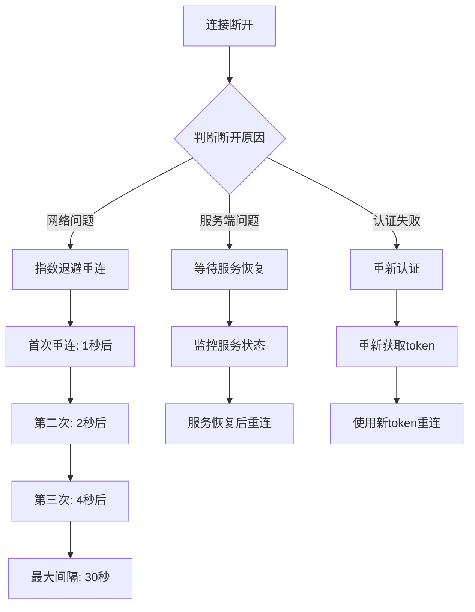

### 2. 核心组件

#### 2.1 ReconnectionManager (服务端)
- **位置**: `core/capabilities/reconnection_manager.go`
- **功能**: 管理客户端重连状态，实现指数退避算法
- **特性**:
  - 自动分析断开原因
  - 指数退避延迟计算
  - 重连尝试记录和清理
  - 最大重试次数限制

#### 2.2 ReconnectionClient (客户端)
- **位置**: `core/utils/reconnection_client.go`
- **功能**: 客户端重连逻辑实现
- **特性**:
  - 带重试机制的连接建立
  - 可配置的重连参数
  - 重连状态回调
  - 手动停止重连

#### 2.3 ReconnectionController (API)
- **位置**: `controllers/api/reconnection.go`
- **功能**: 提供重连管理API接口
- **API端点**:
  - `/api/reconnection/status` - 获取重连状态
  - `/api/reconnection/active` - 获取活跃重连
  - `/api/reconnection/cleanup` - 清理过期重连
  - `/api/reconnection/force` - 强制重连

## 实现细节

### 1. 指数退避算法

```go
// 计算指数退避延迟
func (rm *ReconnectionManager) CalculateBackoff(attempt int) time.Duration {
    delay := rm.baseDelay * time.Duration(math.Pow(2, float64(attempt)))
    if delay > rm.maxDelay {
        return rm.maxDelay
    }
    return delay
}
```

**退避序列**: 1s, 2s, 4s, 8s, 16s, 30s, 30s, ... (最大30秒)

### 2. 断开原因分析

系统自动分析断开原因并分类处理:

| 断开原因 | 处理策略 | 重连延迟 |
|---------|---------|---------|
| 正常关闭 | 不重连 | - |
| 网络超时 | 指数退避 | 递增延迟 |
| 认证失败 | 重新认证 | 固定延迟 |
| 服务端错误 | 等待恢复 | 较长延迟 |

### 3. 连接状态管理

```go
type ReconnectionAttempt struct {
    ClientID      string
    AttemptCount  int
    LastAttempt   time.Time
    FailureReason string
    mu            sync.RWMutex
}
```

## 使用指南

### 1. 服务端集成

服务端自动集成重连管理，无需额外配置。系统会自动:

1. 记录每个客户端的连接状态
2. 分析断开原因并分类
3. 管理重连尝试次数和延迟
4. 清理过期的重连记录

### 2. 客户端使用

#### 2.1 基本用法

```go
// 创建重连客户端
reconnClient := utils.NewReconnectionClient(serverURL, token)
reconnClient.SetMaxRetries(15)
reconnClient.SetDelays(1*time.Second, 60*time.Second)

// 连接服务器
conn, err := reconnClient.ConnectWithRetry()
```

#### 2.2 完整示例

参考 `examples/reconnection_example.go` 中的 `DogClient` 实现:

```go
client := NewDogClient(serverURL, appID, token, sn)
if err := client.Start(); err != nil {
    log.Fatalf("启动失败: %v", err)
}
```

### 3. API使用

#### 3.1 查询重连状态

```bash
# 查询特定客户端的重连状态
curl -X POST http://localhost:8080/api/reconnection/status \
  -H "Content-Type: application/json" \
  -d '{"client_id": "client_123"}'
```

响应示例:
```json
{
  "client_id": "client_123",
  "is_connected": false,
  "reconnection_attempts": 3,
  "next_retry_time": "2023-10-21T08:15:30Z",
  "time_until_retry": "15s",
  "failure_reason": "网络超时",
  "current_delay": "8s"
}
```

#### 3.2 强制重连

```bash
# 强制客户端重连
curl -X POST http://localhost:8080/api/reconnection/force \
  -H "Content-Type: application/json" \
  -d '{"client_id": "client_123"}'
```

## 配置参数

### 服务端配置

环境变量:
- `APP_PINT_TIME`: 心跳间隔（默认30秒）
- `APP_PING_READ_TIMEOUT`: 读超时时间

### 客户端配置

可通过 `ReconnectionClient` 方法配置:
- `SetMaxRetries(maxRetries int)`: 最大重试次数
- `SetDelays(baseDelay, maxDelay time.Duration)`: 延迟参数
- `SetReconnectCallback(callback)`: 重连成功回调
- `SetDisconnectCallback(callback)`: 断开连接回调

## 监控和调试

### 1. 日志监控

系统会记录重要的重连事件:
- 连接建立和断开
- 重连尝试和结果
- 断开原因分析

### 2. 状态查询

使用重连管理API实时监控客户端状态:
- 当前重连尝试次数
- 下一次重连时间
- 断开原因分析
- 重连延迟计算

### 3. 性能指标

监控以下指标确保系统健康:
- 平均重连成功率
- 重连延迟分布
- 不同断开原因的分布
- 客户端连接稳定性

## 最佳实践

### 1. 重连参数调优

根据网络环境调整参数:
- **稳定网络**: 减少最大重试次数，缩短延迟
- **不稳定网络**: 增加重试次数，延长最大延迟
- **移动网络**: 考虑网络切换时的特殊处理

### 2. 错误处理

- 实现适当的重连回调处理
- 记录重连失败的具体原因
- 提供手动重连控制接口

### 3. 资源管理

- 定期清理过期的重连记录
- 监控内存使用情况
- 设置合理的连接超时时间

## 故障排除

### 常见问题

1. **重连过于频繁**
   - 检查网络稳定性
   - 调整重连延迟参数
   - 检查服务端负载

2. **认证失败重连**
   - 验证token有效性
   - 检查认证逻辑
   - 实现token刷新机制

3. **内存泄漏**
   - 定期调用清理接口
   - 监控重连记录数量
   - 设置合理的过期时间

## 总结

本断连恢复策略提供了完整的连接管理解决方案，包括:

✅ **智能重连机制** - 基于断开原因的差异化处理  
✅ **指数退避算法** - 避免网络拥塞的重连风暴  
✅ **完整的状态管理** - 实时监控和调试支持  
✅ **灵活的配置** - 适应不同网络环境  
✅ **API接口** - 便于集成和管理  

通过这套策略，机器狗项目可以实现稳定可靠的网络连接，确保在各种网络条件下都能保持最佳性能。

# 代码展示

## `reconnection_manager.go`

```go
// ReconnectionManager 连接恢复管理器
type ReconnectionManager struct {
	reconnectAttempts *sync.Map // map[string]*ReconnectionAttempt
	maxRetries        int
	baseDelay         time.Duration
	maxDelay          time.Duration
}

// ReconnectionAttempt 重连尝试记录
type ReconnectionAttempt struct {
	ClientID      string
	AttemptCount  int
	LastAttempt   time.Time
	FailureReason string
	mu            sync.RWMutex
}

// NewReconnectionManager 创建新的重连管理器
func NewReconnectionManager() *ReconnectionManager {
	return &ReconnectionManager{
		reconnectAttempts: &sync.Map{},
		maxRetries:        10,        // 最大重试次数
		baseDelay:         1 * time.Second, // 基础延迟
		maxDelay:          30 * time.Second, // 最大延迟
	}
}

// CalculateBackoff 计算指数退避延迟
func (rm *ReconnectionManager) CalculateBackoff(attempt int) time.Duration {
	delay := rm.baseDelay * time.Duration(math.Pow(2, float64(attempt)))
	if delay > rm.maxDelay {
		return rm.maxDelay
	}
	return delay
}

// RecordDisconnection 记录连接断开
func (rm *ReconnectionManager) RecordDisconnection(clientID string, reason string) {
	attempt := &ReconnectionAttempt{
		ClientID:      clientID,
		AttemptCount:  0,
		LastAttempt:   time.Now(),
		FailureReason: reason,
	}
	rm.reconnectAttempts.Store(clientID, attempt)
	log.Infof("记录连接断开: ClientID=%s, 原因=%s", clientID, reason)
}

// ShouldReconnect 判断是否应该重连
func (rm *ReconnectionManager) ShouldReconnect(clientID string) bool {
	value, exists := rm.reconnectAttempts.Load(clientID)
	if !exists {
		return true // 没有记录，允许重连
	}

	attempt := value.(*ReconnectionAttempt)
	attempt.mu.RLock()
	defer attempt.mu.RUnlock()

	if attempt.AttemptCount >= rm.maxRetries {
		log.Warnf("达到最大重试次数: ClientID=%s, 尝试次数=%d", clientID, attempt.AttemptCount)
		return false
	}

	// 检查是否在退避期内
	backoffDelay := rm.CalculateBackoff(attempt.AttemptCount)
	if time.Since(attempt.LastAttempt) < backoffDelay {
		return false
	}

	return true
}

// RecordReconnectionAttempt 记录重连尝试
func (rm *ReconnectionManager) RecordReconnectionAttempt(clientID string, success bool) {
	value, exists := rm.reconnectAttempts.Load(clientID)
	if !exists {
		return
	}

	attempt := value.(*ReconnectionAttempt)
	attempt.mu.Lock()
	defer attempt.mu.Unlock()

	if success {
		// 重连成功，清除记录
		rm.reconnectAttempts.Delete(clientID)
		log.Infof("重连成功: ClientID=%s", clientID)
	} else {
		// 重连失败，增加尝试计数
		attempt.AttemptCount++
		attempt.LastAttempt = time.Now()
		log.Warnf("重连失败: ClientID=%s, 尝试次数=%d", clientID, attempt.AttemptCount)
	}
}

// GetReconnectionStatus 获取重连状态
func (rm *ReconnectionManager) GetReconnectionStatus(clientID string) (attempts int, nextRetry time.Time, reason string, exists bool) {
	value, exists := rm.reconnectAttempts.Load(clientID)
	if !exists {
		return 0, time.Time{}, "", false
	}

	attempt := value.(*ReconnectionAttempt)
	attempt.mu.RLock()
	defer attempt.mu.RUnlock()

	backoffDelay := rm.CalculateBackoff(attempt.AttemptCount)
	nextRetry = attempt.LastAttempt.Add(backoffDelay)

	return attempt.AttemptCount, nextRetry, attempt.FailureReason, true
}

// CleanupExpiredAttempts 清理过期的重连尝试记录
func (rm *ReconnectionManager) CleanupExpiredAttempts() {
	expirationTime := 24 * time.Hour // 24小时后清理

	rm.reconnectAttempts.Range(func(key, value interface{}) bool {
		attempt := value.(*ReconnectionAttempt)
		attempt.mu.RLock()
		lastAttempt := attempt.LastAttempt
		attempt.mu.RUnlock()

		if time.Since(lastAttempt) > expirationTime {
			rm.reconnectAttempts.Delete(key)
			log.Infof("清理过期重连记录: ClientID=%s", key.(string))
		}
		return true
	})
}

// AnalyzeDisconnectionReason 分析断开原因
func (rm *ReconnectionManager) AnalyzeDisconnectionReason(err error) string {
	if err == nil {
		return "正常关闭"
	}

	errStr := err.Error()
	switch {
	case websocket.IsCloseError(err, websocket.CloseNormalClosure, websocket.CloseGoingAway):
		return "正常关闭"
	case websocket.IsCloseError(err, websocket.CloseAbnormalClosure):
		return "异常关闭"
	case errStr == "EOF":
		return "连接被重置"
	case errStr == "websocket: close 1006 (abnormal closure): unexpected EOF":
		return "网络异常断开"
	case errStr == "i/o timeout":
		return "网络超时"
	case errStr == "connection reset by peer":
		return "对端重置连接"
	default:
		return fmt.Sprintf("未知错误: %s", errStr)
	}
}

// GetReconnectionDelay 获取当前重连延迟
func (rm *ReconnectionManager) GetReconnectionDelay(clientID string) time.Duration {
	value, exists := rm.reconnectAttempts.Load(clientID)
	if !exists {
		return 0
	}

	attempt := value.(*ReconnectionAttempt)
	attempt.mu.RLock()
	defer attempt.mu.RUnlock()

	return rm.CalculateBackoff(attempt.AttemptCount)

```


## `reconnection_client.go`

```go
// ReconnectionClient 客户端重连管理器
type ReconnectionClient struct {
	url              string
	token            string
	maxRetries       int
	baseDelay        time.Duration
	maxDelay         time.Duration
	currentAttempt   int
	onReconnect      func(*websocket.Conn) error
	onDisconnect     func(error)
	isReconnecting   bool
	stopReconnect    chan bool
}

// NewReconnectionClient 创建新的客户端重连管理器
func NewReconnectionClient(url string, token string) *ReconnectionClient {
	return &ReconnectionClient{
		url:           url,
		token:         token,
		maxRetries:    10,
		baseDelay:     1 * time.Second,
		maxDelay:      30 * time.Second,
		currentAttempt: 0,
		stopReconnect: make(chan bool, 1),
	}
}

// SetMaxRetries 设置最大重试次数
func (rc *ReconnectionClient) SetMaxRetries(retries int) {
	rc.maxRetries = retries
}

// SetDelays 设置延迟参数
func (rc *ReconnectionClient) SetDelays(baseDelay, maxDelay time.Duration) {
	rc.baseDelay = baseDelay
	rc.maxDelay = maxDelay
}

// SetReconnectCallback 设置重连成功回调
func (rc *ReconnectionClient) SetReconnectCallback(callback func(*websocket.Conn) error) {
	rc.onReconnect = callback
}

// SetDisconnectCallback 设置断开连接回调
func (rc *ReconnectionClient) SetDisconnectCallback(callback func(error)) {
	rc.onDisconnect = callback
}

// CalculateBackoff 计算指数退避延迟
func (rc *ReconnectionClient) CalculateBackoff(attempt int) time.Duration {
	delay := rc.baseDelay * time.Duration(math.Pow(2, float64(attempt)))
	if delay > rc.maxDelay {
		return rc.maxDelay
	}
	return delay
}

// ConnectWithRetry 带重试机制的连接
func (rc *ReconnectionClient) ConnectWithRetry() (*websocket.Conn, error) {
	rc.currentAttempt = 0
	
	for rc.currentAttempt <= rc.maxRetries {
		// 检查是否被停止
		select {
		case <-rc.stopReconnect:
			log.Info("重连过程被手动停止")
			return nil, fmt.Errorf("重连被停止")
		default:
		}
		
		// 尝试连接
		conn, err := rc.connect()
		if err == nil {
			log.Infof("连接成功! 尝试次数: %d", rc.currentAttempt+1)
			rc.currentAttempt = 0 // 重置尝试计数
			return conn, nil
		}
		
		// 连接失败，记录日志
		log.Warnf("连接失败 (尝试 %d/%d): %v", rc.currentAttempt+1, rc.maxRetries, err)
		
		// 调用断开回调
		if rc.onDisconnect != nil {
			rc.onDisconnect(err)
		}
		
		// 检查是否达到最大重试次数
		if rc.currentAttempt >= rc.maxRetries {
			log.Errorf("达到最大重试次数 (%d)，停止重连", rc.maxRetries)
			return nil, fmt.Errorf("达到最大重试次数: %d", rc.maxRetries)
		}
		
		// 计算退避延迟
		backoffDelay := rc.CalculateBackoff(rc.currentAttempt)
		log.Infof("等待 %v 后重试...", backoffDelay)
		
		// 等待退避时间
		timer := time.NewTimer(backoffDelay)
		select {
		case <-timer.C:
			// 继续重试
		case <-rc.stopReconnect:
			timer.Stop()
			log.Info("重连过程被手动停止")
			return nil, fmt.Errorf("重连被停止")
		}
		
		rc.currentAttempt++
	}
	
	return nil, fmt.Errorf("未知错误导致连接失败")
}

// connect 执行实际的连接操作
func (rc *ReconnectionClient) connect() (*websocket.Conn, error) {
	dialer := websocket.Dialer{
		HandshakeTimeout: 10 * time.Second,
	}
	
	// 构建连接URL
	url := rc.url
	if rc.token != "" {
		url = fmt.Sprintf("%s?token=%s", rc.url, rc.token)
	}
	
	conn, _, err := dialer.Dial(url, nil)
	if err != nil {
		return nil, err
	}
	
	// 设置连接参数
	conn.SetPingHandler(func(data string) error {
		log.Debug("收到Ping消息")
		return conn.WriteControl(websocket.PongMessage, []byte{}, time.Now().Add(5*time.Second))
	})
	
	conn.SetPongHandler(func(data string) error {
		log.Debug("收到Pong消息")
		conn.SetReadDeadline(time.Time{})
		return nil
	})
	
	// 调用重连成功回调
	if rc.onReconnect != nil {
		if err := rc.onReconnect(conn); err != nil {
			conn.Close()
			return nil, fmt.Errorf("重连回调失败: %v", err)
		}
	}
	
	return conn, nil
}

// StopReconnection 停止重连过程
func (rc *ReconnectionClient) StopReconnection() {
	select {
	case rc.stopReconnect <- true:
		log.Info("发送停止重连信号")
	default:
		// 通道已满，忽略
	}
}

// GetCurrentStatus 获取当前重连状态
func (rc *ReconnectionClient) GetCurrentStatus() (attempts int, maxRetries int, nextDelay time.Duration) {
	nextDelay = rc.CalculateBackoff(rc.currentAttempt)
	return rc.currentAttempt, rc.maxRetries, nextDelay
}

// IsReconnecting 检查是否正在重连
func (rc *ReconnectionClient) IsReconnecting() bool {
	return rc.isReconnecting
}

// Reset 重置重连状态
func (rc *ReconnectionClient) Reset() {
	rc.currentAttempt = 0
	rc.isReconnecting = false
	// 清空停止通道
	select {
	case <-rc.stopReconnect:
	default:
	}
}
```


## `reconnection_example.go`

```go
// DogClient 机器狗客户端
type DogClient struct {
	reconnClient *utils.ReconnectionClient
	wsConn       *websocket.Conn
	isConnected  bool
	appID        string
	token        string
	sn           string
}

// NewDogClient 创建新的机器狗客户端
// NewDogClient 创建一个新的DogClient实例
// 参数:
//   - serverURL: 服务器URL地址
//   - appID: 应用ID
//   - token: 认证令牌
//   - sn: 序列号
//
// 返回值:
//   - *DogClient: 返回初始化后的DogClient指针
func NewDogClient(serverURL, appID, token, sn string) *DogClient {
	// 初始化DogClient结构体
	client := &DogClient{
		appID: appID, // 应用ID
		token: token, // 认证令牌
		sn:    sn,    // 序列号
	}

	// 创建重连客户端实例
	reconnClient := utils.NewReconnectionClient(serverURL, token)
	// 设置重连回调函数
	// 设置断开连接回调函数
	reconnClient.SetReconnectCallback(client.onReconnect)
	reconnClient.SetDisconnectCallback(client.onDisconnect)
	reconnClient.SetMaxRetries(15)                        // 设置最大重试次数
	reconnClient.SetDelays(1*time.Second, 60*time.Second) // 设置延迟参数

	client.reconnClient = reconnClient

	return client
}

// Start 启动客户端连接
func (dc *DogClient) Start() error {
	log.Println("开始连接服务器...")

	// 尝试连接
	conn, err := dc.reconnClient.ConnectWithRetry()
	if err != nil {
		return fmt.Errorf("连接失败: %v", err)
	}

	dc.wsConn = conn
	dc.isConnected = true

	log.Println("连接成功!")

	// 发送登录请求
	if err := dc.login(); err != nil {
		return fmt.Errorf("登录失败: %v", err)
	}

	// 启动消息处理循环
	go dc.handleMessages()

	// 启动心跳检测
	go dc.heartbeat()

	return nil
}

// onReconnect 重连成功回调
func (dc *DogClient) onReconnect(conn *websocket.Conn) error {
	log.Println("重连成功，重新登录...")
	dc.wsConn = conn
	dc.isConnected = true

	// 重新登录
	if err := dc.login(); err != nil {
		return fmt.Errorf("重连后登录失败: %v", err)
	}

	return nil
}

// onDisconnect 断开连接回调
func (dc *DogClient) onDisconnect(err error) {
	log.Printf("连接断开: %v", err)
	dc.isConnected = false
}

// login 发送登录请求
func (dc *DogClient) login() error {
	timestamp := fmt.Sprintf("%d", time.Now().Unix())

	loginMsg := map[string]interface{}{
		"op":      "galbot_request",
		"service": "/api/user/login",
		"args": map[string]interface{}{
			"app_id":    dc.appID,
			"token":     dc.token,
			"sn":        dc.sn,
			"timestamp": timestamp,
		},
		"request_id": fmt.Sprintf("login_%d", time.Now().UnixNano()),
	}

	return dc.wsConn.WriteJSON(loginMsg)
}

// handleMessages 处理接收到的消息
func (dc *DogClient) handleMessages() {
	for dc.isConnected {
		messageType, p, err := dc.wsConn.ReadMessage()
		if err != nil {
			log.Printf("读取消息错误: %v", err)
			dc.isConnected = false

			// 触发重连
			go dc.reconnect()
			return
		}

		if messageType == websocket.TextMessage {
			dc.processMessage(p)
		}
	}
}

// processMessage 处理单条消息
func (dc *DogClient) processMessage(data []byte) {
	var msg map[string]interface{}
	if err := json.Unmarshal(data, &msg); err != nil {
		log.Printf("解析消息错误: %v", err)
		return
	}

	// 根据消息类型处理
	op, _ := msg["op"].(string)
	service, _ := msg["service"].(string)

	switch op {
	case "galbot_response":
		dc.handleResponse(msg)
	case "galbot_push":
		dc.handlePush(msg, service)
	default:
		log.Printf("未知消息类型: %s", op)
	}
}

// handleResponse 处理响应消息
func (dc *DogClient) handleResponse(msg map[string]interface{}) {
	service, _ := msg["service"].(string)
	result, _ := msg["result"].(bool)
	code, _ := msg["code"].(float64)

	log.Printf("收到响应: service=%s, result=%t, code=%f", service, result, code)

	if service == "/api/user/login" {
		if result {
			log.Println("登录成功!")
		} else {
			log.Printf("登录失败: code=%f", code)
		}
	}
}

// handlePush 处理推送消息
func (dc *DogClient) handlePush(msg map[string]interface{}, service string) {
	log.Printf("收到推送: service=%s", service)
	// 处理不同类型的推送消息
}

// heartbeat 心跳检测
func (dc *DogClient) heartbeat() {
	ticker := time.NewTicker(30 * time.Second)
	defer ticker.Stop()

	for range ticker.C {
		if !dc.isConnected {
			return
		}

		// 发送心跳消息
		heartbeatMsg := map[string]interface{}{
			"op":         "galbot_request",
			"service":    "/api/heartbeat",
			"args":       map[string]interface{}{},
			"request_id": fmt.Sprintf("heartbeat_%d", time.Now().UnixNano()),
		}

		if err := dc.wsConn.WriteJSON(heartbeatMsg); err != nil {
			log.Printf("发送心跳失败: %v", err)
			dc.isConnected = false
			go dc.reconnect()
			return
		}
	}
}

// reconnect 重连逻辑
func (dc *DogClient) reconnect() {
	log.Println("开始重连...")

	conn, err := dc.reconnClient.ConnectWithRetry()
	if err != nil {
		log.Printf("重连失败: %v", err)
		return
	}

	dc.wsConn = conn
	dc.isConnected = true

	log.Println("重连成功!")

	// 重新启动消息处理
	go dc.handleMessages()
}

// Stop 停止客户端
func (dc *DogClient) Stop() {
	log.Println("停止客户端...")
	dc.reconnClient.StopReconnection()

	if dc.wsConn != nil {
		dc.wsConn.Close()
	}
	dc.isConnected = false
}

// GetStatus 获取客户端状态
func (dc *DogClient) GetStatus() map[string]interface{} {
	attempts, maxRetries, nextDelay := dc.reconnClient.GetCurrentStatus()

	return map[string]interface{}{
		"connected":          dc.isConnected,
		"reconnecting":       dc.reconnClient.IsReconnecting(),
		"reconnect_attempts": attempts,
		"max_retries":        maxRetries,
		"next_retry_delay":   nextDelay.String(),
		"has_connection":     dc.wsConn != nil,
	}
}

func main() {
	// 配置参数
	serverURL := "ws://localhost:8080/ws"
	appID := "dog_app_001"
	token := "your_auth_token"
	sn := "dog_sn_001"

	// 创建客户端
	client := NewDogClient(serverURL, appID, token, sn)

	// 启动客户端
	if err := client.Start(); err != nil {
		log.Fatalf("启动失败: %v", err)
	}

	// 等待中断信号
	sigChan := make(chan os.Signal, 1)
	signal.Notify(sigChan, syscall.SIGINT, syscall.SIGTERM)

	// 定期打印状态
	statusTicker := time.NewTicker(1 * time.Minute)
	defer statusTicker.Stop()

	for {
		select {
		case <-sigChan:
			log.Println("收到中断信号，停止客户端...")
			client.Stop()
			return
		case <-statusTicker.C:
			status := client.GetStatus()
			log.Printf("客户端状态: %+v", status)
		}
	}
}

```


# 代码解析

我们来详细分析这个机器人管理平台的断连恢复机制，从函数实现逻辑到整体设计流程。

## 1. 整体架构设计

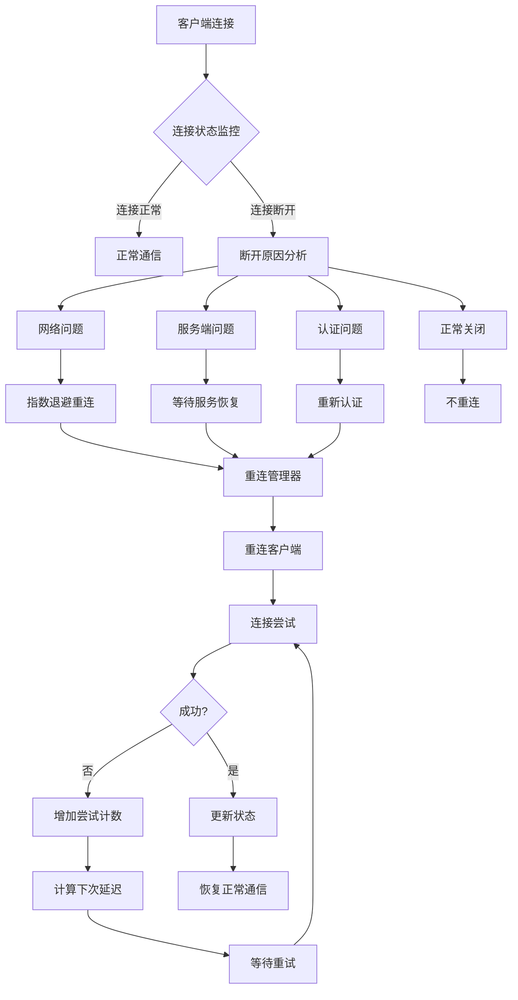

## 2. 核心组件函数逻辑分析

### 2.1 ReconnectionManager（服务端管理）

#### `CalculateBackoff(attempt int)` - 指数退避计算
```go
func (rm *ReconnectionManager) CalculateBackoff(attempt int) time.Duration {
    delay := rm.baseDelay * time.Duration(math.Pow(2, float64(attempt)))
    if delay > rm.maxDelay {
        return rm.maxDelay
    }
    return delay
}
```
**逻辑流程：**
```
输入: 尝试次数attempt
↓
计算基础延迟 × 2^attempt
↓
检查是否超过最大延迟限制
↓
返回适当的延迟时间
```

**退避序列示例：**
- 第1次: 1秒
- 第2次: 2秒  
- 第3次: 4秒
- 第4次: 8秒
- 第5次: 16秒
- 第6次+: 30秒（最大值）

#### `ShouldReconnect(clientID string)` - 重连决策
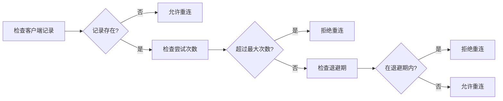

#### `AnalyzeDisconnectionReason(err error)` - 断开原因分析
```go
func (rm *ReconnectionManager) AnalyzeDisconnectionReason(err error) string {
    // 基于错误类型进行分类
    switch {
    case websocket.IsCloseError(err, websocket.CloseNormalClosure):
        return "正常关闭"
    case errStr == "EOF":
        return "连接被重置"
    case errStr == "i/o timeout":
        return "网络超时"
    // ... 其他情况
    }
}
```

### 2.2 ReconnectionClient（客户端实现）

#### `ConnectWithRetry()` - 带重试的连接
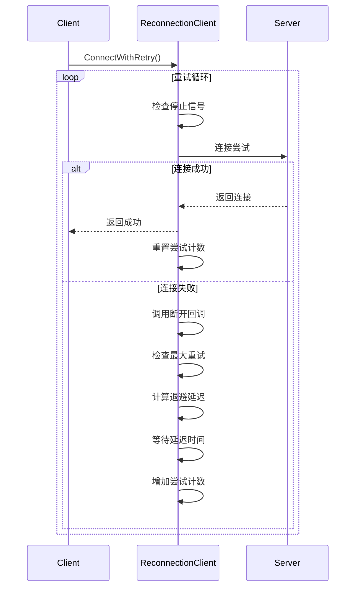

#### 关键逻辑细节：
```go
for rc.currentAttempt <= rc.maxRetries {
    // 1. 检查手动停止
    select {
    case <-rc.stopReconnect:
        return nil, fmt.Errorf("重连被停止")
    default:
    }
    
    // 2. 尝试连接
    conn, err := rc.connect()
    if err == nil {
        rc.currentAttempt = 0
        return conn, nil
    }
    
    // 3. 失败处理
    if rc.onDisconnect != nil {
        rc.onDisconnect(err)
    }
    
    // 4. 退避等待
    backoffDelay := rc.CalculateBackoff(rc.currentAttempt)
    timer := time.NewTimer(backoffDelay)
    select {
    case <-timer.C:
        // 继续重试
    case <-rc.stopReconnect:
        return nil, fmt.Errorf("重连被停止")
    }
    
    rc.currentAttempt++
}
```

### 2.3 DogClient（应用层集成）

#### 完整的重连状态机
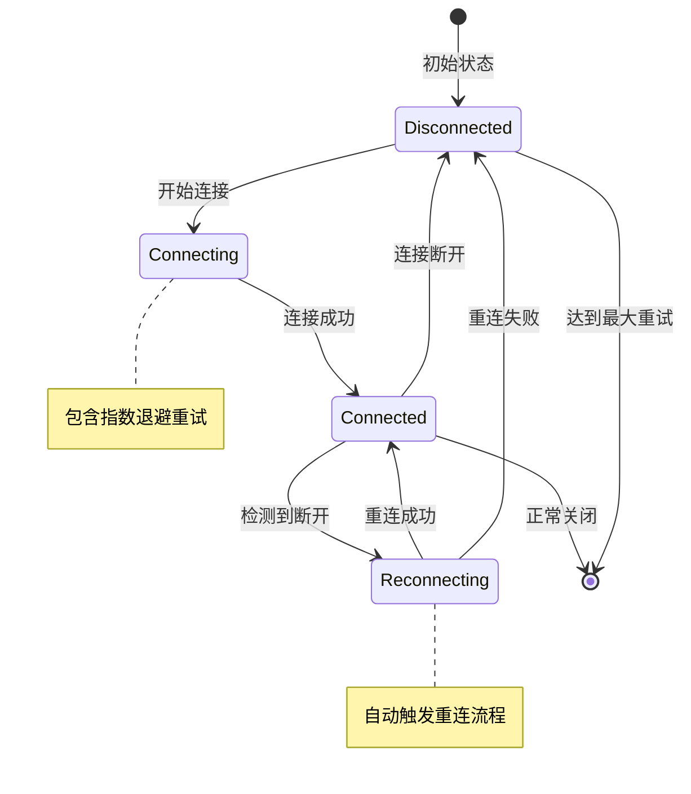

#### `handleMessages()` - 消息处理与重连触发
```go
func (dc *DogClient) handleMessages() {
    for dc.isConnected {
        messageType, p, err := dc.wsConn.ReadMessage()
        if err != nil {
            log.Printf("读取消息错误: %v", err)
            dc.isConnected = false
            // 触发重连
            go dc.reconnect()
            return
        }
        // 正常处理消息...
    }
}
```

## 3. 重连机制设计流程

### 3.1 检测阶段
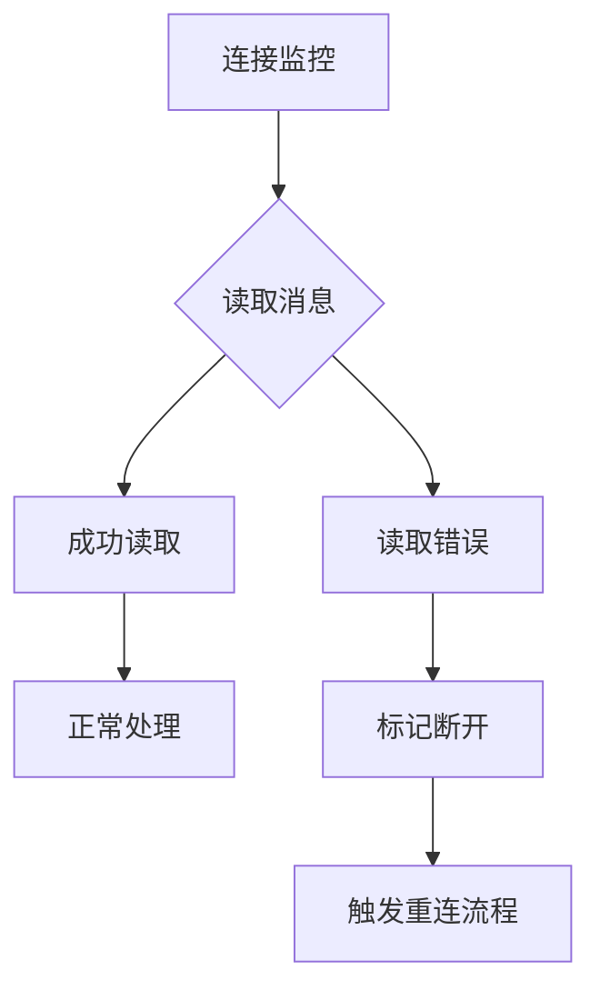

### 3.2 重连决策流程
```
1. 检测连接状态
   ↓
2. 分析断开原因（网络超时/服务端错误/认证失败）
   ↓
3. 查询重连历史记录
   ↓
4. 应用指数退避算法计算延迟
   ↓
5. 检查是否允许重连（次数限制、退避期）
   ↓
6. 执行重连或等待
```

### 3.3 状态恢复流程
```
重连成功
   ↓
调用onReconnect回调
   ↓
重新登录认证
   ↓
恢复消息处理循环
   ↓
恢复心跳检测
   ↓
更新连接状态为正常
```

## 4. 关键设计亮点

### 4.1 分层架构
- **管理层**（ReconnectionManager）：负责策略和状态管理
- **执行层**（ReconnectionClient）：负责实际的重连操作  
- **应用层**（DogClient）：业务逻辑集成

### 4.2 智能退避策略
```go
// 避免重连风暴
delay = baseDelay × 2^attempt
// 但设置上限防止无限等待
if delay > maxDelay { delay = maxDelay }
```

### 4.3 优雅的状态管理
- 使用 `sync.Map` 支持并发访问
- 读写锁保护关键数据
- 自动清理过期记录防止内存泄漏

### 4.4 完整的生命周期管理
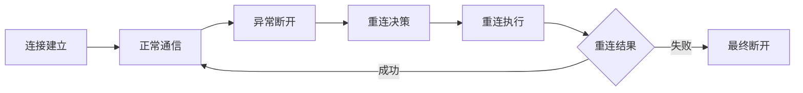

这个重连机制通过分层设计、智能退避算法和完整的状态管理，确保了机器狗在各种网络条件下都能保持稳定的连接，同时避免了因频繁重连导致的系统资源浪费。

# 补充常问——重连的网络原理

关于机器狗重连的网络层面实现，我来详细分析一下具体的网络通信架构：

## 1. 网络通信整体架构

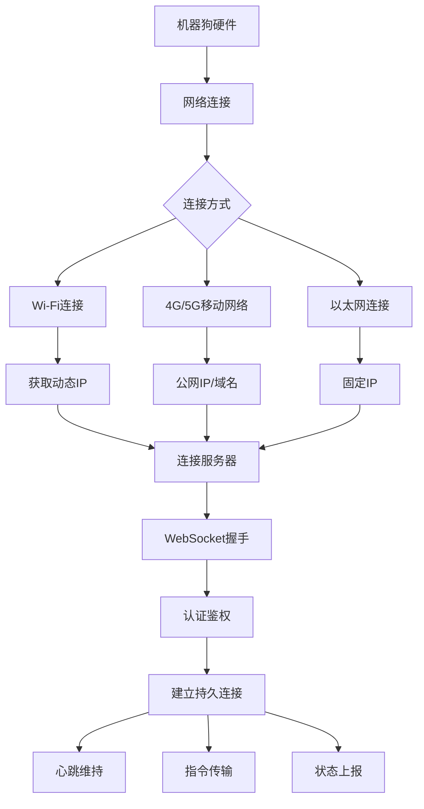

## 2. 具体的网络寻址方式

### 2.1 IP地址和域名解析

```go
// 在 ReconnectionClient 中的连接实现
func (rc *ReconnectionClient) connect() (*websocket.Conn, error) {
    dialer := websocket.Dialer{
        HandshakeTimeout: 10 * time.Second,
    }
    
    // 构建连接URL - 这里使用URL，可能是域名或IP
    url := rc.url  // 例如: "ws://192.168.1.100:8080/ws" 或 "ws://dog-server.example.com/ws"
    if rc.token != "" {
        url = fmt.Sprintf("%s?token=%s", rc.url, rc.token)
    }
    
    conn, _, err := dialer.Dial(url, nil)
    // ...
}
```

### 2.2 实际网络寻址流程

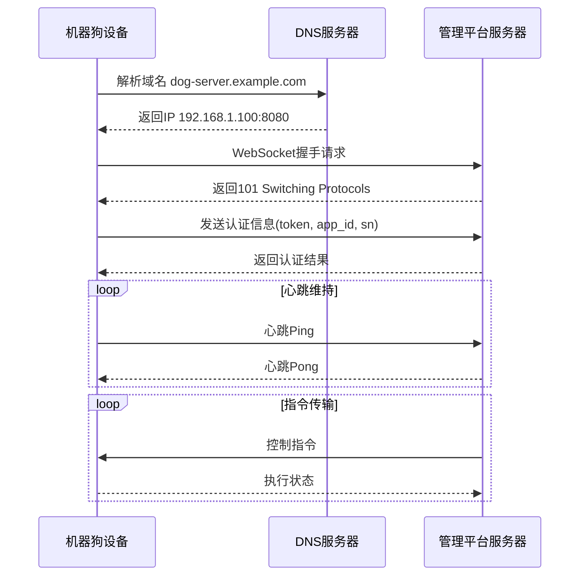

## 3. 机器狗网络配置方式

### 3.1 静态IP配置（生产环境）
```yaml
# 机器狗网络配置
network:
  type: "static"  # 或 "dhcp"
  ip: "192.168.1.100"
  netmask: "255.255.255.0"
  gateway: "192.168.1.1"
  dns: 
    - "8.8.8.8"
    - "114.114.114.114"
  
  server:
    url: "ws://management-platform.com/ws"
    # 或直接使用IP: "ws://203.0.113.10:8080/ws"
    backup_url: "ws://backup-server.com/ws"
```

### 3.2 动态IP发现（开发环境）
```go
// 服务发现机制
type ServiceDiscovery struct {
    mdnsEnabled bool
    bonjourEnabled bool
    staticServers []string
}

func (sd *ServiceDiscovery) FindServers() []string {
    servers := []string{}
    
    // 1. 尝试mDNS发现
    if sd.mdnsEnabled {
        servers = append(servers, sd.discoverViaMDNS()...)
    }
    
    // 2. 尝试Bonjour发现
    if sd.bonjourEnabled {
        servers = append(servers, sd.discoverViaBonjour()...)
    }
    
    // 3. 回退到静态配置
    servers = append(servers, sd.staticServers...)
    
    return servers
}
```

## 4. 重连时的网络层处理

### 4.1 网络异常检测
```go
// 在 ReconnectionManager 中的断开原因分析
func (rm *ReconnectionManager) AnalyzeDisconnectionReason(err error) string {
    errStr := err.Error()
    switch {
    case errStr == "EOF":
        return "连接被重置"  // 网络连接异常断开
    case errStr == "i/o timeout":
        return "网络超时"    // 网络延迟或丢包
    case errStr == "connection reset by peer":
        return "对端重置连接" // 服务器主动断开
    case websocket.IsCloseError(err, websocket.CloseAbnormalClosure):
        return "异常关闭"    // 网络异常
    // ...
    }
}
```

### 4.2 多服务器重连策略
```go
type MultiServerReconnection struct {
    primaryServer   string
    backupServers   []string
    currentServer   string
    serverIndex     int
}

func (msr *MultiServerReconnection) ConnectWithFallback() (*websocket.Conn, error) {
    servers := append([]string{msr.primaryServer}, msr.backupServers...)
    
    for i := msr.serverIndex; i < len(servers); i++ {
        conn, err := msr.tryConnect(servers[i])
        if err == nil {
            msr.currentServer = servers[i]
            msr.serverIndex = i
            return conn, nil
        }
        log.Warnf("连接服务器 %s 失败: %v", servers[i], err)
    }
    
    return nil, fmt.Errorf("所有服务器连接失败")
}
```

## 5. 实际部署中的网络方案

### 5.1 云端部署架构
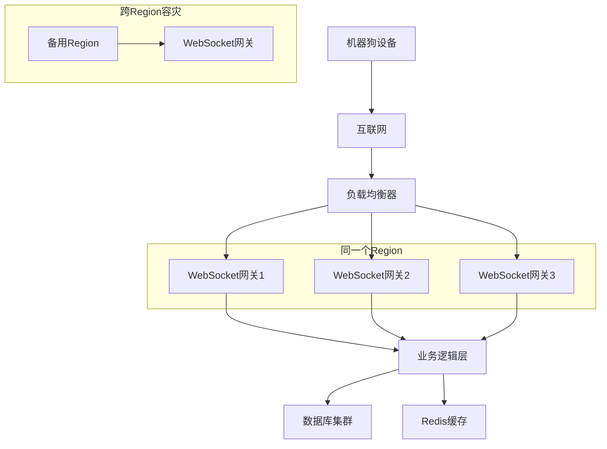

### 5.2 本地网络部署
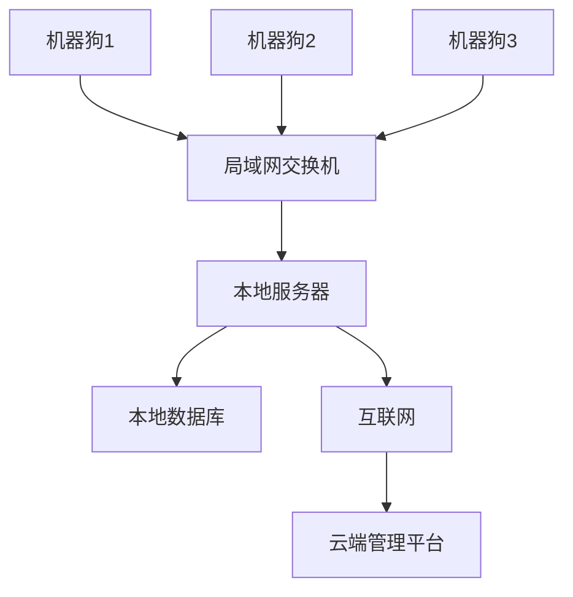

## 6. 具体的URL配置示例

### 6.1 开发环境配置
```go
// 使用本地IP直连
devConfig := &DogClientConfig{
    ServerURL: "ws://192.168.1.100:8080/ws",  // 本地测试服务器
    AppID:     "dog_dev_001",
    Token:     "dev_token_abc123",
    SN:        "DEV_SN_001",
}
```

### 6.2 生产环境配置
```go
// 使用域名 + 负载均衡
prodConfig := &DogClientConfig{
    ServerURL: "wss://dog-api.example.com/ws",  // 生产域名，使用WSS加密
    AppID:     "dog_prod_001",
    Token:     "prod_secure_token_xyz",
    SN:        "PROD_SN_2024001",
}
```

### 6.3 移动网络配置
```go
// 4G/5G移动网络环境
mobileConfig := &DogClientConfig{
    ServerURL: "wss://api.dog-mobile.com/ws",  // 移动网络优化域名
    AppID:     "dog_mobile_001", 
    Token:     "mobile_token_456",
    SN:        "MOBILE_SN_001",
}
```

## 7. 网络层容错机制

### 7.1 自动网络切换
```go
func (dc *DogClient) autoNetworkSwitch() {
    // 检测当前网络类型
    networkType := dc.detectNetworkType()
    
    switch networkType {
    case "wifi":
        dc.switchToWiFiServer()
    case "cellular":
        dc.switchToMobileServer() 
    case "ethernet":
        dc.switchToEthernetServer()
    default:
        dc.useFallbackServer()
    }
}
```

### 7.2 DNS故障处理
```go
func (rc *ReconnectionClient) resolveWithFallback(url string) (string, error) {
    // 首先尝试域名解析
    host := extractHost(url)
    ips, err := net.LookupHost(host)
    if err == nil && len(ips) > 0 {
        return strings.Replace(url, host, ips[0], 1), nil
    }
    
    // DNS解析失败，使用预配置的IP
    if rc.fallbackIP != "" {
        return strings.Replace(url, host, rc.fallbackIP, 1), nil
    }
    
    return "", fmt.Errorf("DNS解析失败且无备用IP")
}
```

## 总结

机器狗重连的网络层面实现主要基于：

1. **IP直连**：在局域网环境或固定IP场景使用
2. **域名解析**：在生产环境使用，支持负载均衡和故障转移  
3. **多协议支持**：WS（WebSocket）和WSS（加密WebSocket）
4. **网络自适应**：根据网络类型自动选择最优连接方式
5. **多层容错**：DNS故障回退、多服务器重试、网络类型切换

这种设计确保了机器狗在各种网络环境下都能建立稳定连接，并在断开时智能重连。
