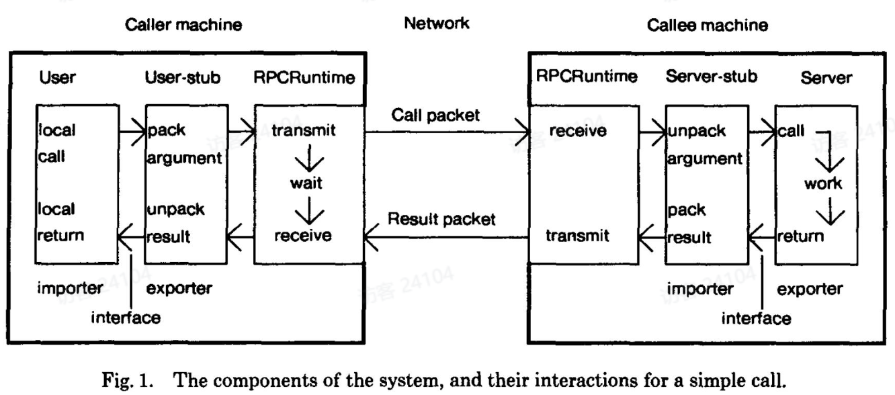
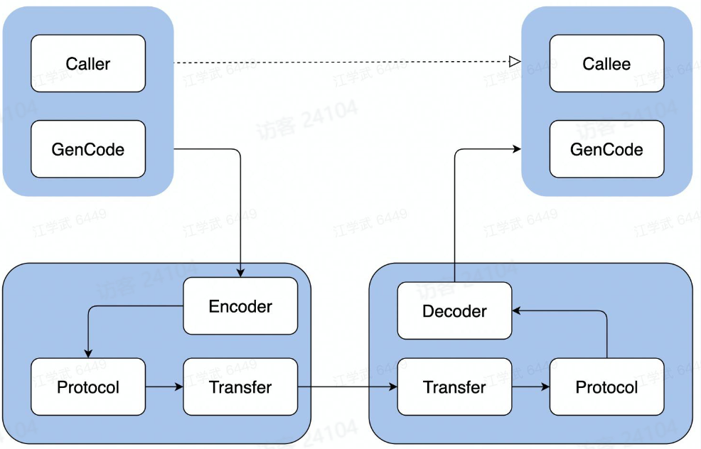
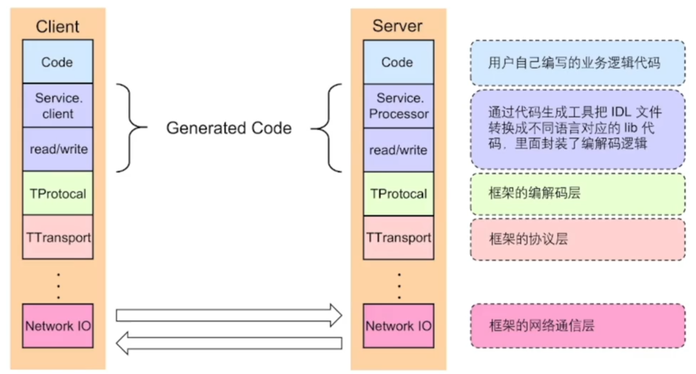
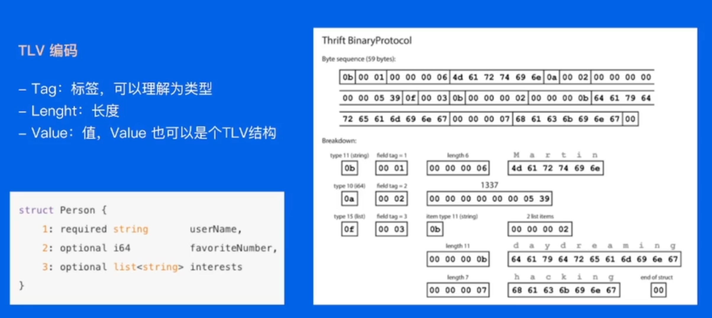

# 基本概念

## 远程调用

1. **本地调用：** 在一个程序中直接调用即可，在不同包中以包名+方法名的形式去调用
2. **远程调用：** 比如商城服务调用支付服务的话，需要商城服务通过网络想支付服务请求，支付服务扣除余额，之后返回扣除成功的消息。这个过程存在以下问题：
   - 函数映射
   - 数据转化成字节流
   - 网络传输

## RPC概念模型

概念模型分为五个组件

## 实现一次RPC过程

- **IDL (Interface description language):** 文件IDL 通过一种中立的方式来描述接口，使得在不同平台上运行的对象和用不同语言编写的程序可以相互通信
- **生成代码:** 通过编译器工具把 IDL 文件转换成语言对应的静态库
- **编解码:** 从内存中表示到字节序列的转换称为编码，反之为解码，也常叫做序列化和反序列化（解决了跨语言的调用）
- **通信协议:** 规范了数据在网络中的传输内容和格式。除必须的请求/响应数据外，通常还会包含额外的元数据
- **网络传输：** 通常基于成熟的网络库走 TCP/UDP 传输

当调用者想调用被调用者的方法时：

1. 首先，通过GenCode编码传给框架；
2. 框架中Encoder将代码进行编码，成为字节流；
3. 之后通过通讯协议传递给被调用端；
4. 被调用者接收之后解码

## 优点和问题

**优点：**

1. 单一职责，有利于分工协作和运维开发
2. 可扩展性强，资源使用率更优
3. 故障隔离，服务的整体可靠性更高

**问题：**

1. 服务宕机，对方应该如何处理?
2. 在调用过程中发生网络异常，如何保证消息的可达性?
3. 请求量突增导致服务无法及时处理，有哪些应对措施?

使用RPC框架解决上述问题！

# 框架设计

架构采用分层设计，分为 编解码层、协议层、网络通信层 

## 编解码层

### 生成代码

不同端之间依赖同一份IDL文件，生成不同语言对应的CodeGen

### 数据格式

1. **语言特定的格式：**许多编程语言都内建了将内存对象编码为字节序列的支持，例如Java有 iava.io.Serializable
2. **文本格式：**JSON、XML、CSV 等文本格式，具有人类可读性
3. **二进制编码：**具备跨语言和高性能等优点，常见有 Thrift 的 BinaryProtocol,Protobuf等

### 二进制编码

1. 将每个**数据**（并非变量）按照类型、长度、内容进行编码传输
2. 对于数组切片这种变量，先规定总体容量这些，接下来写变量

### 选型

1. **兼容性：**支持自动增加新的字段，而不影响老的服务，这将提高系统的灵活度
2. **通用性：**支持跨平台、跨语言
3. **性能:** 从空间和时间两个维度来考虑，也就是编码后数据大小和编码耗费时长

## 协议层

