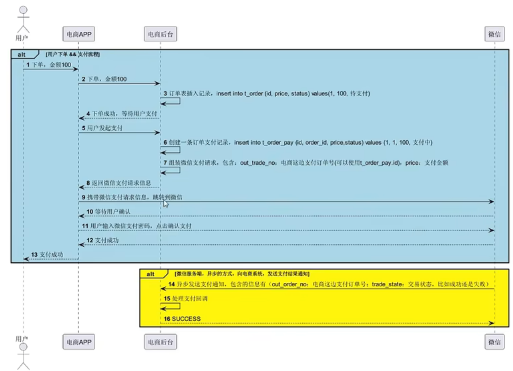
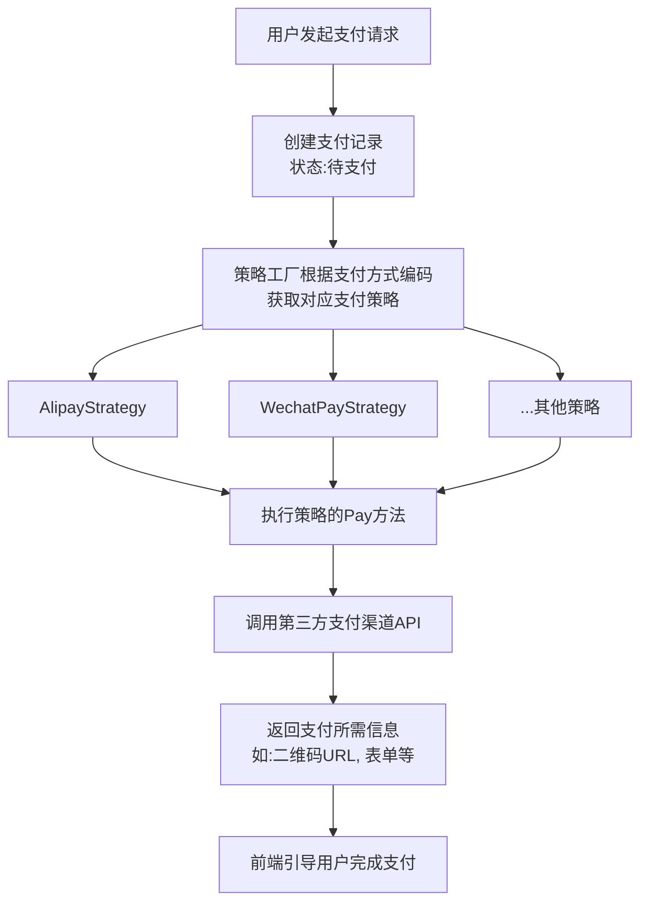
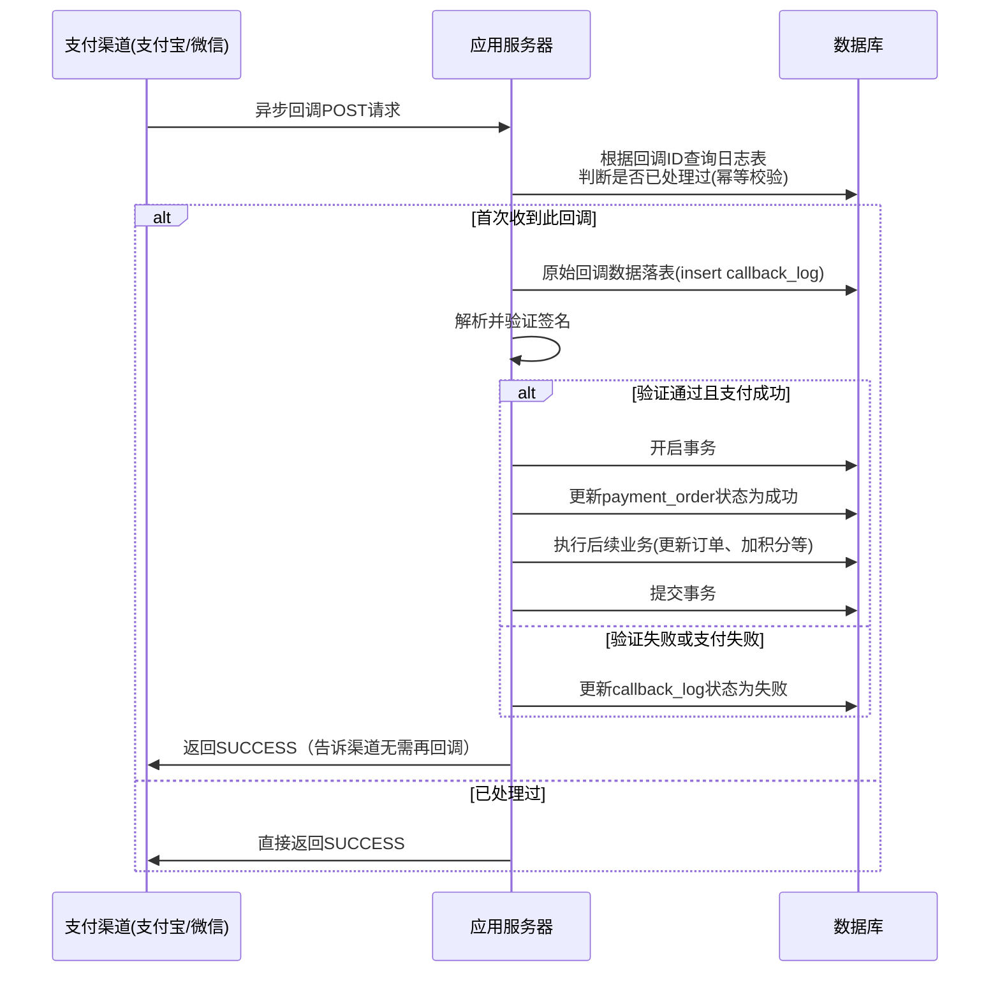
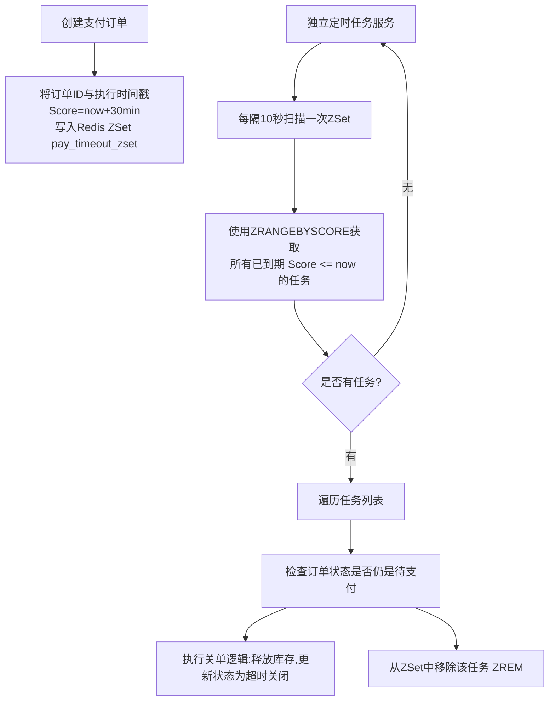

# 支付流程分析

1. 用户下单之后，订单列表插入记录，同时返回给前端确认信息等待用户支付
2. 用户发起支付，创建一条订单支付记录（消息序号、订单号、价格、状态）并且组装支付请求（订单号，支付金额）
3. 跳转到第三方平台等待用户支付

# 支付模块核心场景分析

支付模块的核心业务流程可以抽象为以下几个关键场景：

1.  **支付创建与路由**：用户选择支付方式，系统创建支付单，并根据策略路由到不同的支付渠道（支付宝、微信、银行卡等）。
2.  **支付状态同步**：处理支付渠道的异步回调（Callback）或同步返回（Return），并可靠地更新系统内部的支付状态。**这是最复杂、最容易出问题的环节。**
3.  **支付状态查询与补偿**：处理由于网络问题导致回调丢失、商户主动查询支付最终状态等场景。
4.  **支付超时与关单**：处理用户未在限定时间内支付的订单，及时释放资源（如库存）。

## 场景一：支付创建与路由（策略模式）

**1. 实现原理：**
- 定义一个`PaymentStrategy`接口，包含`Pay(request *PayRequest) (*PayResponse, error)`等方法。
- 为每种支付方式（`AlipayStrategy`, `WechatPayStrategy`）实现该接口。
- 使用一个`StrategyFactory`根据传入的支付方式编码，返回对应的策略实现类。
- 业务层通过工厂获取策略，调用统一的`Pay`方法，无需关心底层具体实现。

**2. 流程图：**

**3. 面试表达与思考：**
- **优点：** “策略模式完美地满足了**开闭原则**。当需要增加一个新的支付方式时，我只需要新增一个策略实现类并在工厂中注册它，完全不需要修改任何现有的业务代码，极大地降低了维护成本和迭代风险。”
- **缺点：** “每个策略类可能会引入自己独有的配置参数，增加了一定的配置管理复杂度。”
- **优化思路：** “可以将每个策略的配置（如AppID、密钥、网关地址）独立出来，使用配置中心（如Nacos、Apollo）进行管理，实现热更新。”

---

## 场景二 & 三：支付状态同步与补偿（双表设计 + 幂等性）

这是保证支付系统可靠性的核心。

**1. 实现原理：**
- **双表设计**：
    - **支付请求表（payment_order）**：记录用户发起的支付请求核心信息，如订单号、金额、状态（待支付/支付成功/支付失败/已关闭）、支付方式等。
    - **支付回调记录表（payment_callback_log）**：记录每次第三方回调的原始信息（整个JSON或XML）、解析后的状态、回调时间等。**一个支付请求可能对应多条回调记录。**
- **幂等性**：通过支付订单ID或第三方交易号作为幂等键，确保无论第三方回调多少次，系统都只处理一次成功的逻辑（如更新订单状态、发放商品）。

**2. 流程图（回调处理）：**

**3. 面试表达与思考：**
- **为什么用双表？**：“`payment_order`表是核心业务表，字段设计是精简、高效的。而`payment_callback_log`是**审计日志表**，它记录了最原始的数据，用于**对账、排查问题、追溯历史**。比如渠道说成功了但我们系统显示失败，我们就可以查这个日志表来定位是谁的问题。”
- **幂等性的重要性：** “第三方支付渠道为了确保商户收到通知，可能会多次回调。如果没有幂等性处理，用户支付一次，我们可能会因为收到多次回调而发放多次商品，造成资损。这是一个非常严重的问题。”
- **补偿机制（主动查询）**：“除了被动等回调，我们还会有一个**定时任务**，定期扫描那些长时间处于‘待支付’状态、但又超过了支付渠道通常回调时间的订单。这个任务会主动调用支付渠道的**查询API**，去获取订单的最终状态，从而解决回调丢失的问题，确保状态同步的最终一致性。”

---

## 场景四：支付超时与关单（分布式方案）

**1. 问题分析：**
用户创建支付单后可能放弃支付。这些订单会一直占用库存，导致其他用户无法购买。需要在超时（如30分钟）后自动关闭。

**2. 方案对比：**

| 方案                   | 实现原理                                                     | 优点                                                         | 缺点                                                         | 选择建议                                           |
| :--------------------- | :----------------------------------------------------------- | :----------------------------------------------------------- | :----------------------------------------------------------- | :------------------------------------------------- |
| **单机定时任务**       | 在应用启动时创建一个定时器（Ticker），周期性扫描本机内存中的未支付订单。 | 实现简单，延迟低。                                           | **无法分布式扩展**：集群部署时，每台机器都会扫描全量数据，导致重复关单。**可靠性差**：机器重启任务就没了。 | **仅用于demo或学习**，生产环境严禁使用。           |
| **数据库扫表轮询**     | 创建一个独立的定时任务服务，定期扫描`payment_order`表中超时的待支付订单，进行关单。 | 简单可靠，是常见的方案。                                     | **性能瓶颈**：随着数据量增大，全表扫描对数据库压力大。**效率低下**：延迟高，通常分钟级。 | 适用于中小项目，数据量不大的初期阶段。             |
| **Redis过期键监听**    | 创建支付单时，向Redis写入一个Key（如`pay_timeout:{orderId}`），并设置TTL为30分钟。配置Redis的`key event notification`，订阅`expired`事件。 | 实时性高，延迟在秒级。对数据库无压力。                       | **可靠性问题**：Redis的过期事件删除是**惰性+定期**的，可能不能**精确准时**地触发。且在高负载下，可能存在事件丢失的风险。 | 适用于对延迟敏感、且能接受极小概率事件丢失的业务。 |
| **Redis ZSet延迟队列** | 将超时关单任务作为元素，以其执行时间戳（`now + 30min`）作为分数（Score）存入Redis ZSet。一个定时任务周期性轮询ZSet，获取所有已到期的任务执行。 | **高性能、高可靠、可扩展**。是业界主流的分布式延迟方案。解决了数据库扫表的压力和Redis事件丢失的问题。 | 实现比前几种方案稍复杂。                                     | **生产环境推荐方案**。兼顾了实时性和可靠性。       |

**3. 推荐方案（Redis ZSet）流程图：**

**4. 面试表达与思考：**
- **为什么选择ZSet方案？**：“对于支付超时这种**对可靠性要求极高**的业务，我倾向于使用**Redis ZSet实现的延迟队列**。它既避免了数据库扫表的性能压力，又比监听Redis过期事件更可靠，是一个在性能和可靠性上取得很好平衡的方案。”
- **关于懒删除：** “您提到的‘懒删除’思想非常关键。在我们的设计中，ZSet里的任务元素被扫描到后，我们并不会立即删除它，而是**先执行关单逻辑，执行成功后再删除**。这样可以防止任务丢失。即使本次处理失败，下次扫描还会再次处理它，直到成功为止，这本身就是一种补偿机制。”
- **细节考虑：** “在关单前，**一定要再次查询订单的当前状态**。因为用户可能在最后一秒支付成功了，如果我们不检查就直接关单，会把已支付的订单错误地关闭并释放库存，导致‘超卖’。”

## 总结

在面试中，你可以这样总结：

“面试官，对于支付模块，我的设计核心思路是：**策略模式应对扩展，双表+幂等保证可靠，延迟队列处理超时**。”

“首先，通过策略模式优雅地支持多种支付方式，方便未来扩展。其次，支付状态同步是核心难点，我通过`双表设计`记录全链路日志，并通过`幂等性`处理和`主动查询补偿`机制，来保证支付状态的一致性。最后，对于支付超时问题，在分布式环境下我推荐使用`Redis ZSet`实现延迟队列来进行关单处理，这个方案在可靠性、性能和实时性上取得了很好的平衡。”

“当然，这里面还有很多可以深挖的细节，比如分布式锁在创建支付单和扣库存时的应用、RocketMQ的事务消息来确保本地事务与发送消息的一致性等，我非常希望能有机会在实战中继续深入研究。”

这个回答展现了你对支付全流程的深入思考，体现了你的系统设计能力和严谨性，绝对能让面试官眼前一亮。

