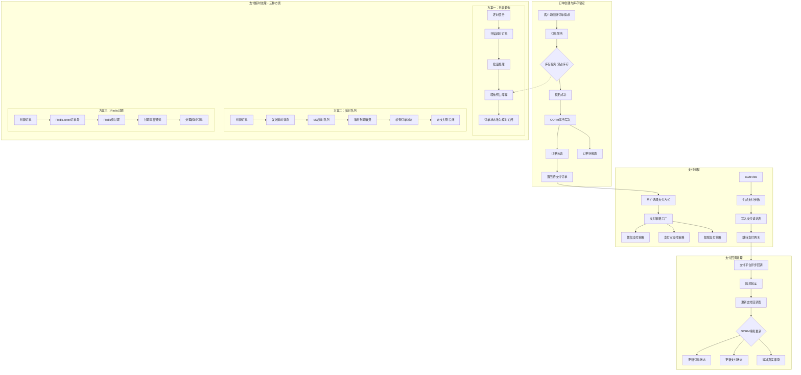
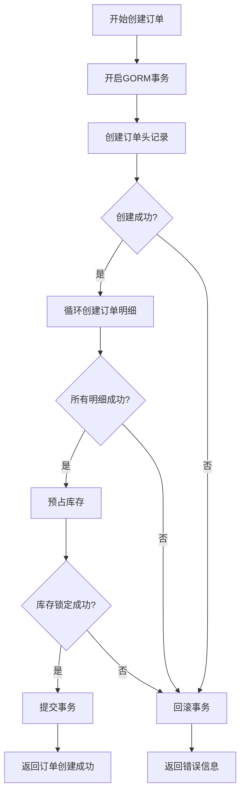
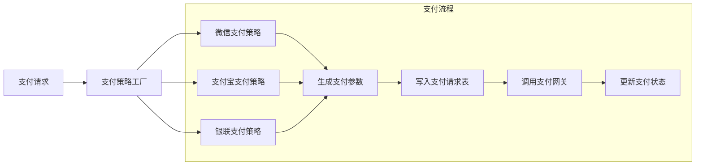
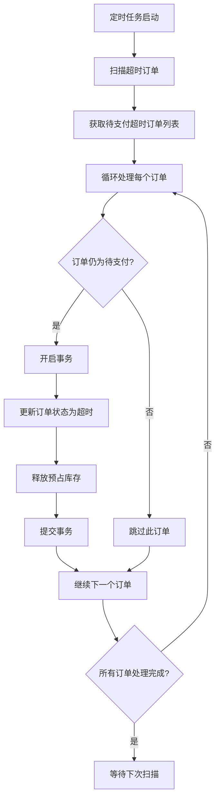
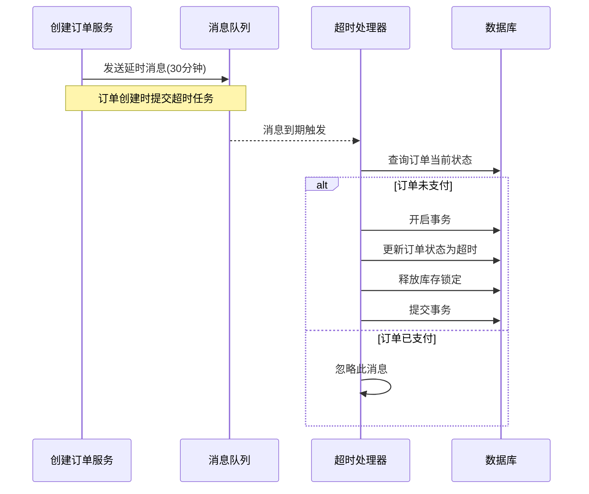
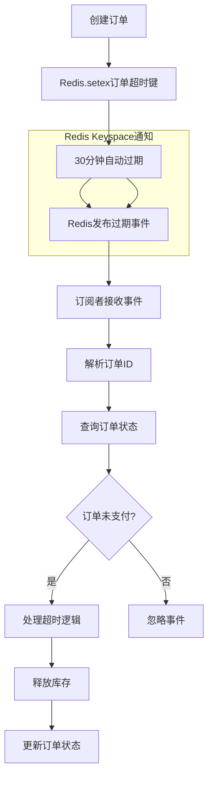
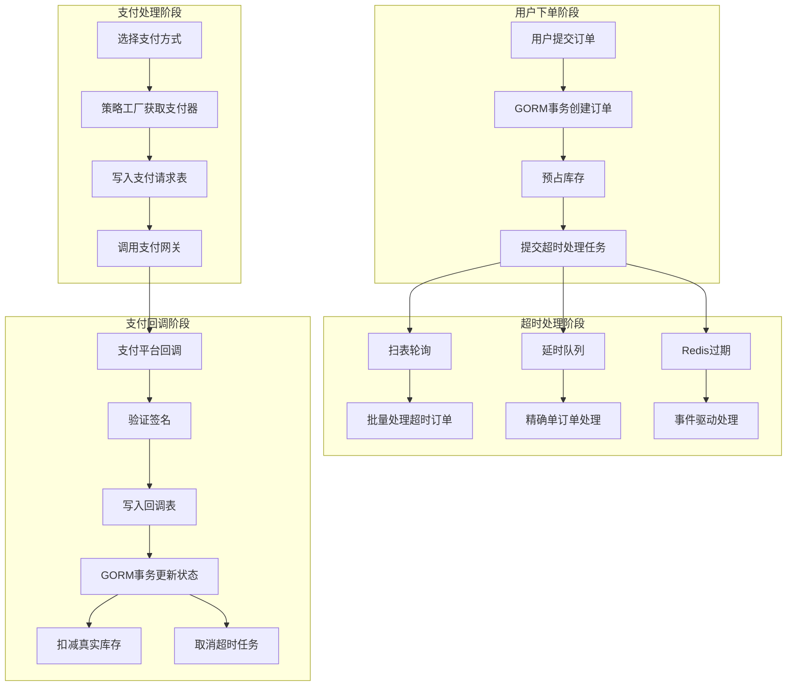

# 实施方案图



# 具体方案

## 1. 订单创建与库存锁定（GORM事务）

```go
// 订单创建服务
type OrderService struct {
    db *gorm.DB
}

func (s *OrderService) CreateOrder(req *CreateOrderRequest) (*Order, error) {
    return s.db.Transaction(func(tx *gorm.DB) error {
        // 1. 创建订单头
        orderHeader := &OrderHeader{
            OrderNo:    generateOrderNo(),
            UserID:     req.UserID,
            Status:     OrderStatusPending,
            TotalAmount: req.TotalAmount,
        }
        if err := tx.Create(orderHeader).Error; err != nil {
            return err
        }

        // 2. 创建订单明细
        for _, item := range req.Items {
            orderItem := &OrderItem{
                OrderID:   orderHeader.ID,
                ProductID: item.ProductID,
                Quantity:  item.Quantity,
                Price:     item.Price,
            }
            if err := tx.Create(orderItem).Error; err != nil {
                return err
            }
        }

        // 3. 预占库存
        if err := s.inventoryService.LockInventory(tx, req.Items); err != nil {
            return err
        }

        return nil
    })
}
```



**流程图解释：**
- 整个流程在数据库事务中执行，保证原子性
- 任何步骤失败都会触发事务回滚
- 只有所有步骤成功才提交事务
- 库存预占与订单创建在同一个事务中

## 2. 支付策略模式实现

```go
// 支付策略接口
type PaymentStrategy interface {
    Pay(request *PayRequest) (*PayResponse, error)
    Refund(request *RefundRequest) (*RefundResponse, error)
}

// 策略工厂
type PaymentFactory struct{}

func (f *PaymentFactory) GetStrategy(payType string) PaymentStrategy {
    switch payType {
    case "wechat":
        return &WechatPayment{}
    case "alipay":
        return &AlipayPayment{}
    case "unionpay":
        return &UnionPayment{}
    default:
        return nil
    }
}

// 支付服务
type PaymentService struct {
    db       *gorm.DB
    factory  *PaymentFactory
}

func (s *PaymentService) CreatePayment(orderID uint, payType string) error {
    // 写入支付请求表
    paymentRequest := &PaymentRequest{
        OrderID:     orderID,
        PayType:     payType,
        Status:      PaymentStatusInit,
        RequestTime: time.Now(),
    }
    if err := s.db.Create(paymentRequest).Error; err != nil {
        return err
    }

    // 执行支付
    strategy := s.factory.GetStrategy(payType)
    response, err := strategy.Pay(&PayRequest{OrderID: orderID})
    if err != nil {
        return err
    }

    // 更新支付请求
    paymentRequest.ThirdPartyID = response.ThirdPartyID
    paymentRequest.PayData = response.PayData
    return s.db.Save(paymentRequest).Error
}
```



**流程图解释：**
- **策略模式**：通过工厂方法动态选择支付策略
- **开闭原则**：新增支付方式无需修改现有代码
- **双表设计**：支付请求表记录发起信息，回调表记录异步结果
- **状态追踪**：完整记录支付生命周期

## 3. 支付超时处理方案

### 方案一：扫表轮询实现

```go
type TimeoutScanner struct {
    db *gorm.DB
}

func (s *TimeoutScanner) ScanTimeoutOrders() {
    for {
        timeoutOrders := s.findTimeoutOrders()
        for _, order := range timeoutOrders {
            s.processTimeoutOrder(order)
        }
        time.Sleep(30 * time.Second) // 30秒扫描一次
    }
}

func (s *TimeoutScanner) processTimeoutOrder(order *Order) error {
    return s.db.Transaction(func(tx *gorm.DB) error {
        // 1. 检查订单是否已支付
        if order.Status != OrderStatusPending {
            return nil
        }

        // 2. 更新订单状态为超时关闭
        if err := tx.Model(order).Update("status", OrderStatusTimeout).Error; err != nil {
            return err
        }

        // 3. 释放预占库存
        return s.inventoryService.ReleaseLockedInventory(tx, order.ID)
    })
}
```



### 方案二：延时队列实现

```go
type DelayQueueProcessor struct {
    mqClient MQClient
    db       *gorm.DB
}

func (p *DelayQueueProcessor) SubmitOrderTimeout(orderID uint, delay time.Duration) error {
    message := &TimeoutMessage{OrderID: orderID}
    return p.mqClient.SendDelayMessage("order_timeout", message, delay)
}

func (p *DelayQueueProcessor) HandleTimeoutMessage(message *TimeoutMessage) error {
    // 检查订单状态并处理超时
    var order Order
    if err := p.db.First(&order, message.OrderID).Error; err != nil {
        return err
    }
    
    if order.Status == OrderStatusPending {
        return p.processTimeoutOrder(&order)
    }
    return nil
}
```



### 方案三：Redis过期实现

```go
type RedisTimeoutManager struct {
    redisClient *redis.Client
    db          *gorm.DB
}

func (m *RedisTimeoutManager) SetOrderTimeout(orderID uint, timeout time.Duration) error {
    key := fmt.Sprintf("order_timeout:%d", orderID)
    return m.redisClient.SetEX(key, orderID, timeout).Err()
}

// Redis配置键空间通知
func (m *RedisTimeoutManager) ListenTimeoutEvents() {
    pubsub := m.redisClient.Subscribe("__keyevent@0__:expired")
    for msg := range pubsub.Channel() {
        if strings.HasPrefix(msg.Payload, "order_timeout:") {
            orderID := extractOrderID(msg.Payload)
            go m.handleOrderTimeout(orderID)
        }
    }
}
```



## 4. 整体架构流程图



**整体架构解释：**
- **数据一致性**：GORM事务保证关键操作的原子性
- **支付扩展性**：策略模式支持多种支付方式
- **超时容错**：三套方案适应不同业务规模
- **状态可追溯**：双表设计完整记录支付链路
- **库存安全**：预占机制防止超卖，超时自动释放

这样的设计既保证了系统的可靠性，又提供了良好的扩展性和性能表现。