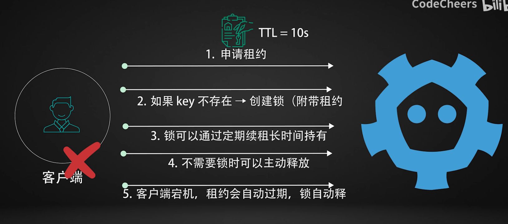
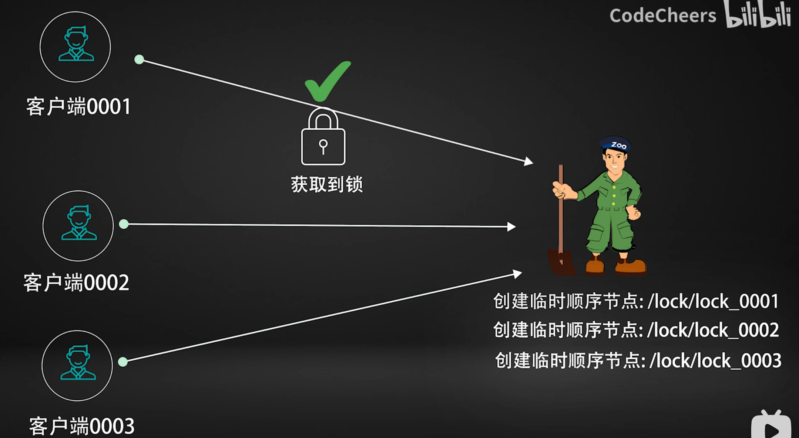

# 三种分布式锁实现方案

etcd，redis，zookeeper

1. redis最快，但是稳定性最差（success的数量）
2. etcd稍慢，但是最稳定
3. zookeeper最慢，但是最有秩序（每个加锁请求都会排队依次获取锁）

## 分布式锁是干什么的？

解决多个进程、多个服务在同一时间想操作同一资源的问题

## etcd实现与适用场景

核心实现是 租约+原子操作

1. 我们看一下第五条可以发现，由于自动释放无死锁，因此保证了这个方案的稳定性
2. 但是我们看一下1也可以发现，这种抢锁式随机的，无序的

因此，在高并发的场景下，适合这种快、准、稳的方案。适合服务协调、分布式调度、微服务选主的方案（k8s的底层组件）

## Redis实现与适用场景

核心思路：

1. 使用一个键代表锁，客户端想要加锁的时候，执行`SET key value NX EX 10`(如果key不存在就创建并且设置十秒过期)
2. 持锁方通过删除key或者执行lua脚本来释放锁
3. 如果客户端崩溃了，redis会根据锁过期时间自动删除锁

适合高并发场景，但是如果redis宕机或者进行主从切换可能会导致锁提前消失，导致多个客户端认为自己获取了锁

适合高并发、短锁生命周期的场景（秒杀、防止超卖、订单防重复）

## Zookeeper实现与适用场景

不依靠键值，而是使用节点来表示锁

每个客户端通过创建临时顺序节点来抢锁

1. 首先是创建一个编号节点
2. 检查自己是不是最小的，如果是就拿锁，如果不是就监听比自己小的那一个编号节点
3. 等比自己小的节点释放锁再重复步骤2

这样的设计让每个客户端都能按照顺序来排队，而且客户端断开连接之后锁自动释放，保证了有序性和稳定性

缺点是性能，每次加锁解锁都要创建节点很消耗性能，加上zookeeper的watch机制也会在监听太多节点的时候很吃力

适用于对顺序性要求比较严格的场景