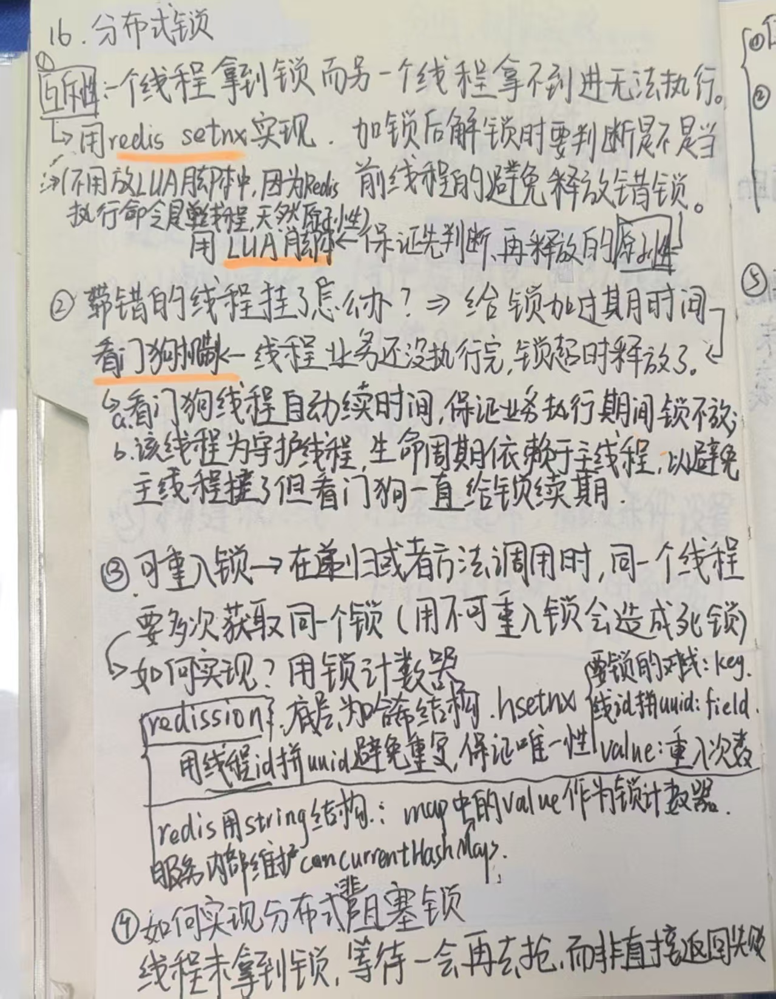
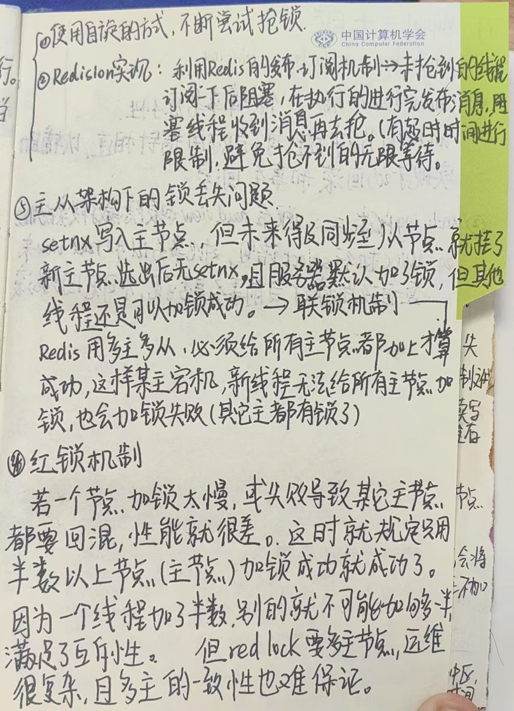
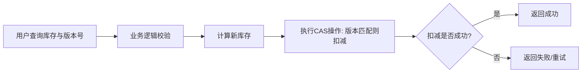
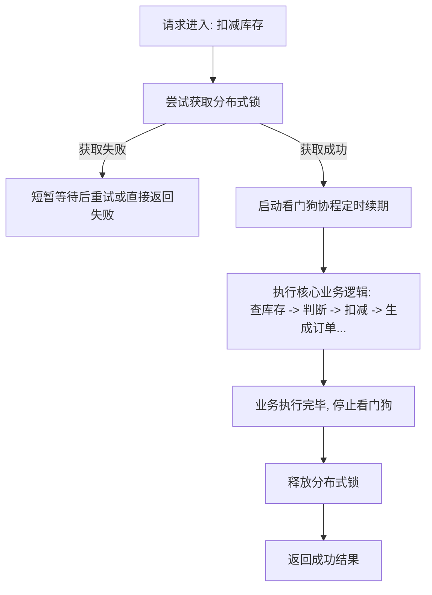

# 技术面经

## 分布式锁基本介绍





# 技术方案

## 方案总览

| 方案                        | 核心思想                 | 优点                 | 缺点                 | 适用场景                             |
| :-------------------------- | :----------------------- | :------------------- | :------------------- | :----------------------------------- |
| **方案一：乐观锁**          | 版本号控制，无锁竞争     | 实现简单，性能高     | 成功率低，体验不佳   | 读多写少，冲突不高的场景             |
| **方案二：原子Lua脚本**     | 计算挪到存储端，原子执行 | 极高性能，无网络开销 | 逻辑复杂，难调试     | 简单库存扣减，无需后续逻辑           |
| **方案三：分布式锁+看门狗** | 互斥访问，逻辑隔离       | 通用性强，逻辑清晰   | 实现复杂，有性能损耗 | 扣减后还有复杂业务逻辑（如生成订单） |

---

## 方案一：基于Redis的乐观锁（CAS）

这是最简单直接的方案，适合作为你回答的起点，体现你知道有多种解决方案。

**1. 实现原理：**
- 为每个商品的库存值维护一个**版本号**（`version`）。
- 用户查询库存时，同时获取当前版本号。
- 扣减时，比较版本号是否变化，如果没变才执行扣减，同时版本号+1。

**2. 流程图：**


**3. 面试表达与思考：**
- **优点：** “这个方案实现起来非常轻量，不需要引入复杂的锁机制，性能很高，因为大部分时候没有锁竞争。”
- **缺点：** “但它的问题也很明显，就是在高并发秒杀场景下，`CAS`操作失败的概率会非常高，用户体验不好（用户点击后总是提示失败）。这其实就是‘乐观锁’的适用场景问题，它假设冲突不频繁，但秒杀恰恰是冲突极高的场景。”
- **优化思路：** “虽然它不适合做最终的扣减方案，但可以用在**库存预检**环节。比如在用户点击秒杀按钮前，用`Redis`的`get`命令快速检查库存是否大于0，做一个初步过滤，把肯定没库存的请求快速返回失败，减轻后端压力。”

---

## 方案二：基于Redis Lua脚本的原子操作

这是**性能最高**的方案，也是很多大厂在纯扣减场景下的首选方案。

**1. 实现原理：**
- 将**库存查询、判断、扣减**等多个操作写到一个Lua脚本中。
- Redis会单线程原子性地执行整个Lua脚本，执行期间不会被其他命令打断。
- 无需在客户端处理复杂的锁逻辑。

**2. 核心Lua脚本逻辑：**
```lua
local key = KEYS[1] -- 商品ID
local change = tonumber(ARGV[1]) -- 要扣减的数量
local current = tonumber(redis.call('get', key) or 0)
if (current >= change) then
    return redis.call('decrby', key, change) -- 扣减成功，返回新库存
else
    return -1 -- 库存不足，返回特定标识
end
```

**3. 面试表达与思考：**
- **优点：** “这个方案是我认为在**纯库存扣减**场景下最优的。因为它利用了Redis单线程的特性，将整个计算过程原子化，没有网络延迟带来的并发问题，性能极高。”
- **缺点：** “它的局限性在于，**业务逻辑必须全部写在Lua脚本里**。如果扣减库存后还有复杂的逻辑，比如需要生成订单、通知用户等，这些操作就不适合也不应该放在Redis里执行。这会导致脚本变得臃肿，难以维护和调试。”
- **适用场景：** “所以这个方案特别适合作为**缓存库存**的扣减，后续再通过异步消息等方式去同步数据库。它的思想是‘计算找数据’，而不是‘数据找计算’，极大地减少了网络IO。”

---

## 方案三：分布式锁 + 看门狗机制（你的需求）

这是**最通用、最能体现你思考深度**的方案，也是面试官最想听到的。

**1. 实现原理：**
- **加锁**：使用 `SET lock_key unique_value NX PX 30000` 命令，为当前商品加一个具有唯一值和超时时间的锁。
- **执行业务**：在锁内执行：1. 查询库存 -> 2. 判断是否充足 -> 3. 扣减库存 -> 4. 生成订单等后续逻辑。
- **看门狗**：另起一个**守护协程**，在业务处理期间，定期（比如每10秒）检查锁是否还存在并为其续期，防止业务没处理完锁就自动释放了。
- **释放锁**：业务处理完成后，使用Lua脚本比较`unique_value`再删除锁，防止误删。

**2. 流程图：**


**3. 面试表达与思考（重点！）：**

- **为什么选这个方案？**：“虽然方案二性能更高，但我们的电商系统在扣减库存后，还有生成订单、更新用户优惠券等一连串的数据库操作，这些逻辑很重，不适合放在Lua脚本里。所以需要一个机制保证这一整个流程的原子性，分布式锁是最自然的选择。”

- **如何保证可靠性？**：“我主要考虑了四个关键点：
    1.  **原子加锁**：使用`SET NX PX`命令，保证加锁和设置超时是原子的。
    2.  **唯一值**：锁的值使用UUID等唯一标识，确保只能由加锁的客户端来解锁，防止误删。
    3.  **安全解锁**：使用Lua脚本先比较值再删除，保证解锁操作也是原子的。
    4.  **锁续期**：这是为了避免一种极端情况——如果业务处理时间超过了锁的超时时间，锁会自动释放，导致另一个请求拿到锁，造成数据混乱。‘看门狗’机制就是为了解决这个问题而设计的。”

- **缺点与优化**：“我当然也知道分布式锁的缺点，主要是**性能损耗**，因为同一时间只有一个请求能处理。为了缓解这个问题，我考虑了两个优化方向：
    1.  **锁粒度**：锁的key一定要精确到**具体的商品ID**，比如 `lock:product_123`，而不是一个全局锁 `lock:stock`。这样不同商品之间就不会互相锁住，大大提升了并发度。
    2.  **业务优化**：把生成订单等操作异步化。在锁内只完成最核心的库存扣减，扣减成功后就可以释放锁，然后发出一个扣减成功的消息，由下游服务异步地去创建订单。这样极大地缩短了持锁时间，提升了系统吞吐量。”

