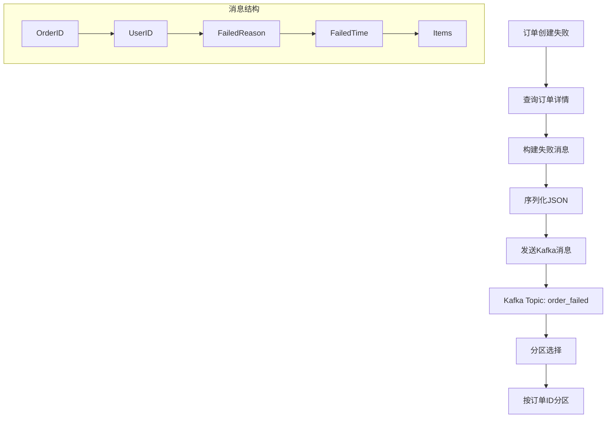
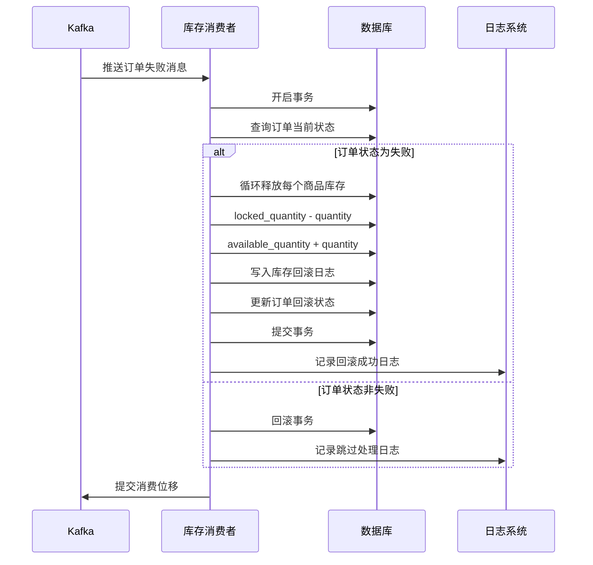
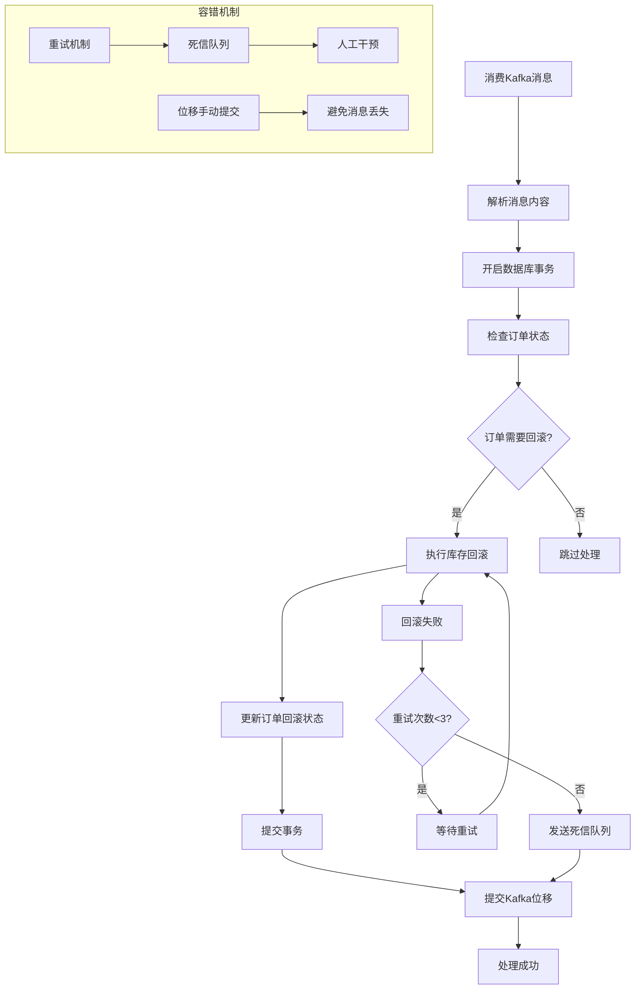

##  Kafka 实现订单失败的库存回滚

### 核心架构设计

```go
// 库存回滚服务
type InventoryRollbackService struct {
    db         *gorm.DB
    kafkaProducer *kafka.Producer
    kafkaConsumer *kafka.Consumer
}

// 订单失败消息
type OrderFailedMessage struct {
    OrderID    uint      `json:"order_id"`
    UserID     uint      `json:"user_id"`
    FailedReason string  `json:"failed_reason"`
    FailedTime   time.Time `json:"failed_time"`
    Items       []OrderItem `json:"items"`
}
```

### 1. 订单失败消息生产端

```go
// 订单服务 - 发送失败消息
type OrderService struct {
    db           *gorm.DB
    kafkaProducer *kafka.Producer
}

func (s *OrderService) HandleOrderFailure(orderID uint, reason string) error {
    // 查询订单信息
    var order Order
    if err := s.db.Preload("Items").First(&order, orderID).Error; err != nil {
        return err
    }

    // 构建失败消息
    message := &OrderFailedMessage{
        OrderID:     orderID,
        UserID:      order.UserID,
        FailedReason: reason,
        FailedTime:   time.Now(),
        Items:       order.Items,
    }

    // 发送到Kafka
    return s.sendToKafka(message)
}

func (s *OrderService) sendToKafka(message *OrderFailedMessage) error {
    jsonData, err := json.Marshal(message)
    if err != nil {
        return err
    }

    kafkaMessage := &kafka.Message{
        TopicPartition: kafka.TopicPartition{
            Topic:     &"order_failed",
            Partition: kafka.PartitionAny,
        },
        Value: jsonData,
        Key:   []byte(fmt.Sprintf("order_%d", message.OrderID)),
    }

    return s.kafkaProducer.Produce(kafkaMessage, nil)
}
```



**流程图解释：**
- 订单失败时立即发送消息到 Kafka
- 使用订单ID作为Key保证同一订单消息进入同一分区
- 消息包含完整的订单信息和失败原因
- 异步处理，不影响主业务流程

### 2. 库存回滚消息消费端

```go
// 库存回滚消费者
type InventoryRollbackConsumer struct {
    db           *gorm.DB
    kafkaConsumer *kafka.Consumer
}

func (c *InventoryRollbackConsumer) StartConsumer() {
    c.kafkaConsumer.SubscribeTopics([]string{"order_failed"}, nil)
    
    for {
        msg, err := c.kafkaConsumer.ReadMessage(-1)
        if err != nil {
            log.Printf("Consumer error: %v", err)
            continue
        }
        
        go c.processMessage(msg)
    }
}

func (c *InventoryRollbackConsumer) processMessage(msg *kafka.Message) error {
    var failedMessage OrderFailedMessage
    if err := json.Unmarshal(msg.Value, &failedMessage); err != nil {
        return err
    }

    return c.db.Transaction(func(tx *gorm.DB) error {
        // 检查订单状态，避免重复处理
        var order Order
        if err := tx.First(&order, failedMessage.OrderID).Error; err != nil {
            return err
        }
        
        if order.Status != OrderStatusFailed {
            // 订单可能已被其他流程处理，跳过
            return nil
        }

        // 执行库存回滚
        if err := c.rollbackInventory(tx, failedMessage.Items); err != nil {
            return err
        }

        // 更新订单回滚状态
        order.RollbackStatus = RollbackStatusCompleted
        order.RollbackTime = time.Now()
        return tx.Save(&order).Error
    })
}

func (c *InventoryRollbackConsumer) rollbackInventory(tx *gorm.DB, items []OrderItem) error {
    for _, item := range items {
        // 释放预占库存
        if err := tx.Exec(`
            UPDATE inventory 
            SET locked_quantity = locked_quantity - ?, 
                available_quantity = available_quantity + ? 
            WHERE product_id = ? AND locked_quantity >= ?`,
            item.Quantity, item.Quantity, item.ProductID, item.Quantity).Error; err != nil {
            return err
        }
        
        // 记录库存回滚日志
        inventoryLog := &InventoryLog{
            ProductID:  item.ProductID,
            OrderID:    item.OrderID,
            ChangeType: "rollback",
            Quantity:   item.Quantity,
            CreatedAt:  time.Now(),
        }
        if err := tx.Create(inventoryLog).Error; err != nil {
            return err
        }
    }
    return nil
}
```



### 3. 消费者组与容错机制

```go
// 消费者组配置
type ConsumerGroupConfig struct {
    GroupID           string
    Topics            []string
    SessionTimeout    time.Duration
    HeartbeatInterval time.Duration
    AutoOffsetReset   string
    EnableAutoCommit  bool
}

func (c *InventoryRollbackConsumer) setupConsumerGroup() {
    config := &kafka.ConfigMap{
        "bootstrap.servers":  "kafka1:9092,kafka2:9092",
        "group.id":           "inventory-rollback-group",
        "auto.offset.reset":  "earliest",
        "enable.auto.commit": false, // 手动提交位移
        "session.timeout.ms": 6000,
    }
    
    consumer, err := kafka.NewConsumer(config)
    if err != nil {
        log.Fatal("Failed to create consumer:", err)
    }
}

// 重试机制
func (c *InventoryRollbackConsumer) processMessageWithRetry(msg *kafka.Message) {
    maxRetries := 3
    for i := 0; i < maxRetries; i++ {
        err := c.processMessage(msg)
        if err == nil {
            // 处理成功，提交位移
            c.kafkaConsumer.CommitMessage(msg)
            return
        }
        
        if i == maxRetries-1 {
            // 最终失败，发送到死信队列
            c.sendToDLQ(msg, err)
            c.kafkaConsumer.CommitMessage(msg)
        } else {
            // 重试
            time.Sleep(time.Duration(i+1) * time.Second)
        }
    }
}

// 死信队列处理
func (c *InventoryRollbackConsumer) sendToDLQ(msg *kafka.Message, err error) {
    dlqMessage := &DLQMessage{
        OriginalMessage: msg.Value,
        Error:           err.Error(),
        FailedTime:      time.Now(),
    }
    
    dlqData, _ := json.Marshal(dlqMessage)
    kafkaMessage := &kafka.Message{
        TopicPartition: kafka.TopicPartition{Topic: &"order_failed_dlq", Partition: kafka.PartitionAny},
        Value:          dlqData,
    }
    c.kafkaProducer.Produce(kafkaMessage, nil)
}
```



### 4. 监控与告警

```go
// 监控指标
type MetricsCollector struct {
    rollbackSuccess prometheus.Counter
    rollbackFailure prometheus.Counter
    processingTime  prometheus.Histogram
    dlqMessages     prometheus.Counter
}

func (c *InventoryRollbackConsumer) processWithMetrics(msg *kafka.Message) {
    startTime := time.Now()
    
    err := c.processMessage(msg)
    
    if err != nil {
        c.metrics.rollbackFailure.Inc()
        log.Error("库存回滚失败", "order_id", msg.Key, "error", err)
    } else {
        c.metrics.rollbackSuccess.Inc()
        c.metrics.processingTime.Observe(time.Since(startTime).Seconds())
    }
}
```

### 方案优势总结

**可靠性保证：**
- ✅ **消息持久化**：Kafka保证消息不丢失
- ✅ **顺序性保证**：同一订单消息进入同一分区
- ✅ **重试机制**：自动重试+死信队列兜底
- ✅ **事务一致性**：数据库事务保证库存回滚原子性

**性能优势：**
- 🚀 **异步处理**：不影响主订单流程性能
- 🚀 **批量能力**：Kafka高吞吐支持
- 🚀 **水平扩展**：消费者组支持多实例部署

**运维友好：**
- 🔧 **监控完善**：关键指标监控和告警
- 🔧 **容错性强**：单点故障不影响整体系统
- 🔧 **可追溯**：完整日志记录和死信队列

这样的设计方案既保证了库存回滚的可靠性，又提供了良好的性能和可维护性。