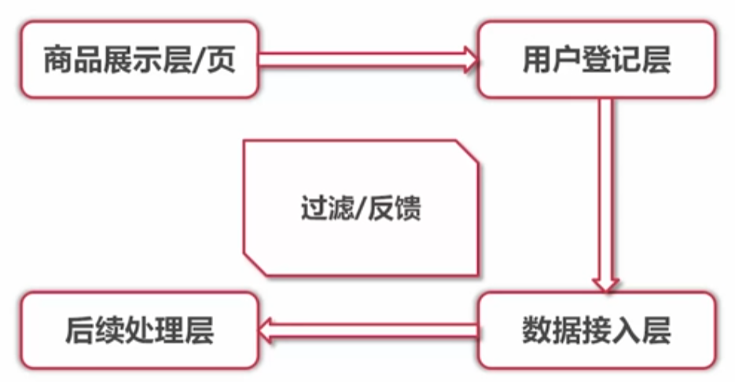
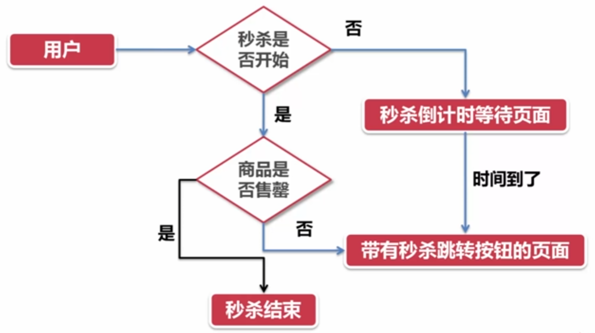
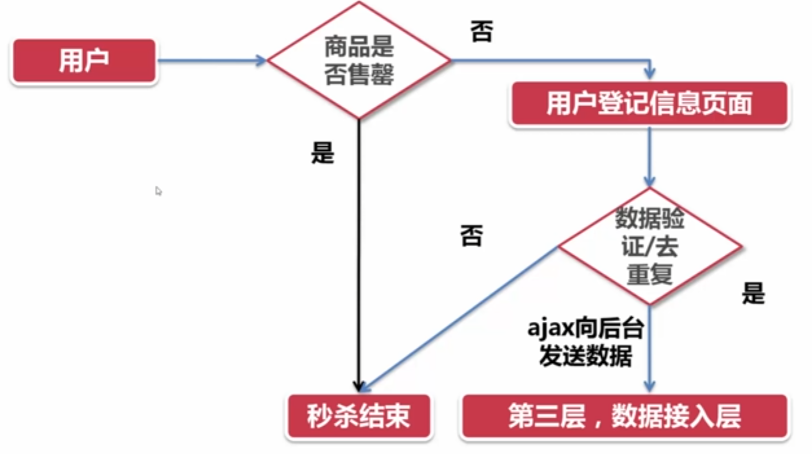
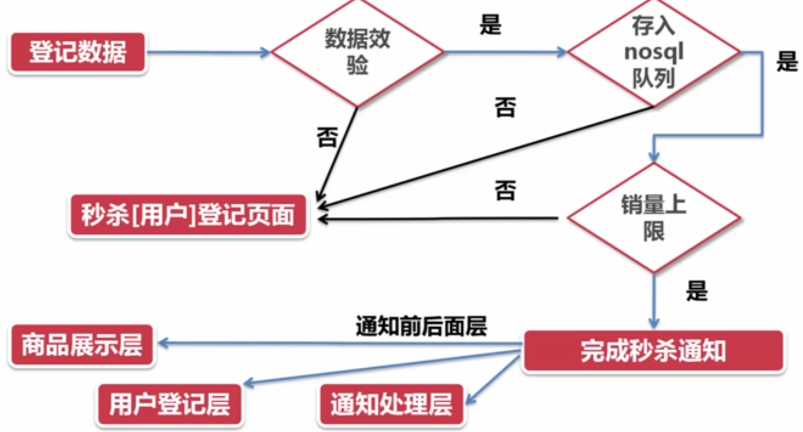
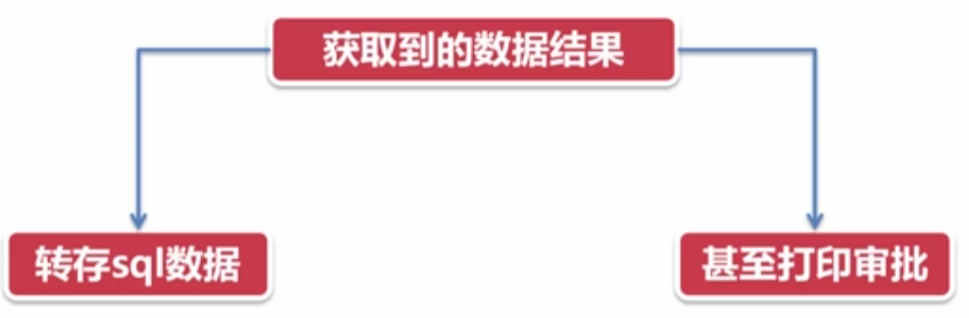

# 背景分析

注意点

- 脱离原站点部署
- 监控（运维、软件）

关键点

- 高可用
  - 双活
- 高并发
  - 负载均衡
  - 安全过滤

布局思路

- 静态页面
  - cdn
  - 网址隐藏
  - 页面压缩
  - 缓存机制
- 动态页面
  - 排队
  - 异步
  - 资质抢购

其他建议

- 百度
  - opcode缓存: 把 PHP 源代码编译好的字节码（opcode）直接留在内存里，下次请求跳过重复编译，让脚本瞬间提速
  - `cdn`
  - 更大的服务器实例
- 阿里
  - 云监控
  - 云盾:安全防护总管家，帮你挡攻击、查漏洞、做合规
  - `ecs`:即买即用的弹性虚拟服务器
  - `oss`:云对象存储，就是无限大的云端“网盘”，存图片/视频/日志
  - `rds `:云托管数据库，MySQL、PostgreSQL 等一键开通、自动备份
  - `cdn`:把内容缓存到全球节点，让用户就近访问，网站更快更省带宽

# 项目结构分析

## 环境分析（业务分析）

- 用户：超大量、正常客户、恶意客户
- 地域：全国各地
- 业务流程：｛前端｝商品展示-->登记-->｛后台｝数据接入-->数据处理

注意层层安检和反馈

# 技术要点分析

- 展示层和用户登记层核心是服务用户
- 数据接入层和后续处理层核心是让老板看到，属于是后台层

## 商品展示层

- 页面状态
  1. 商品展示：秒杀倒计时页面
  2. 秒杀进行中：点击进入秒杀页面
  3. 秒杀活动结束：提示活动已经结束

## 用户登记层

- 页面状态
  1. 秒杀进行中：秒杀登记页面
  2. 秒杀结束了：秒杀结束页面

## 数据接入层

- 页面功能
  - 数据校验：完成对数据、用户的验证
  - 存入`nosql`队列：去重复、排序数据
  - 检测商品最大数量：提示活动已结束

下面是主要流程图，核心是：一言不合就反馈（回退），功成名就天下尽人皆知（全局广播）

- 反馈（某个关键节点的审核不通过，就回返回到用户登记层）
  - 数据校验：类似于微软序列号（CD Key）生成技术的加密和解密
  - 队列排序：Redis中的有序集合
  - 最大数量检测：计数标志位

- 广播（一旦条件满足，程序就会使用PHP中的core技术向前面和后面的层活动结束了）

## 数据处理层

- 数据持久化：转存`nosql`数据到`mysql`

# 代码分析

由于这个是PHP的教程，我们就不去看代码实现了，只了解一下知识点

## 商品展示层

- 主要知识点
  - 页面、服务器优化
  - `cdn`网络加速（`css`等文件可以使用对象存储）
  - 隐藏跳转页面
  - 状态切换

## 用户登记层

- 主要知识点
  - token加密、解密
  - ajax跨域

## 数据接入层

- 数据校验
- 存入队列
- 商品数量检测

## 数据处理层

- 数据持久化
