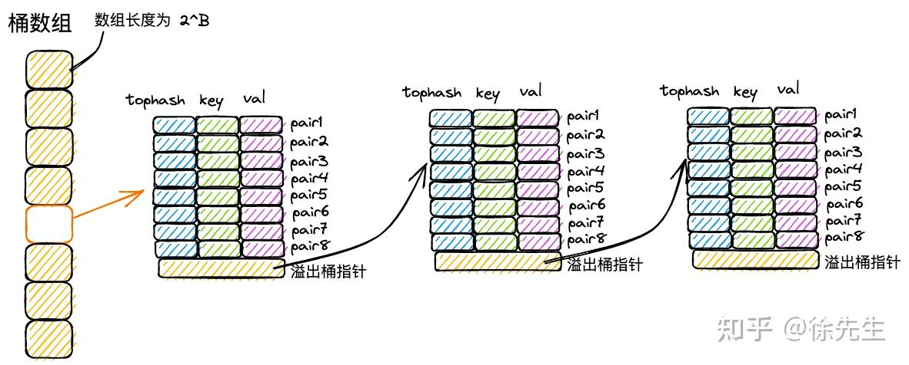
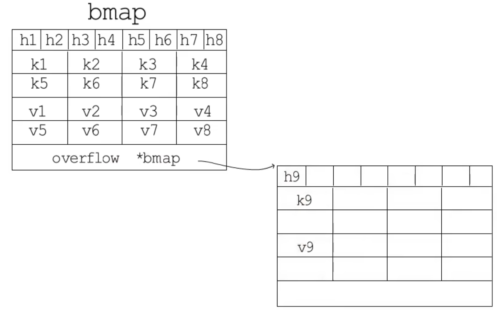
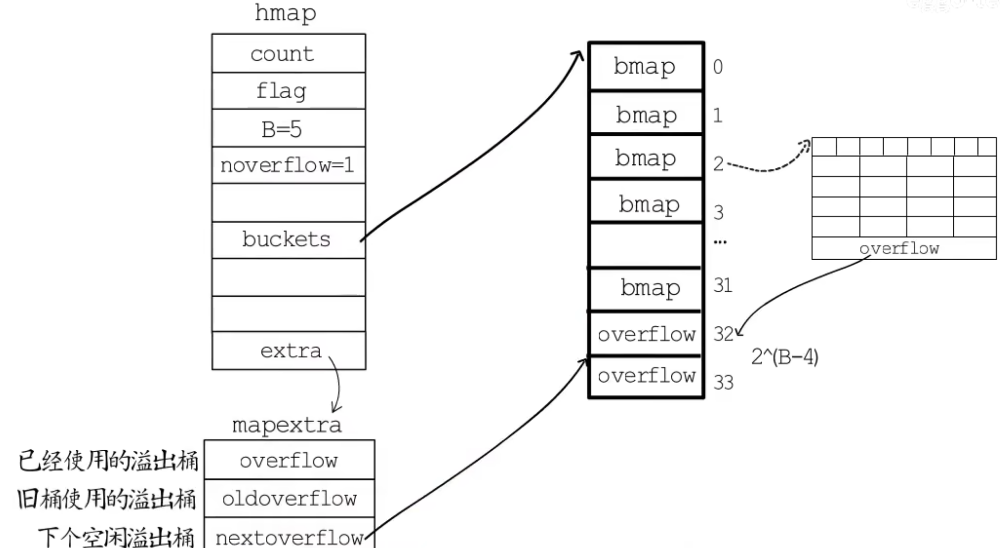
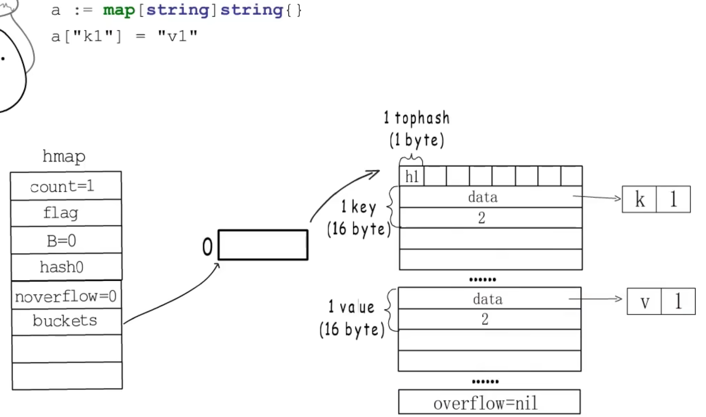
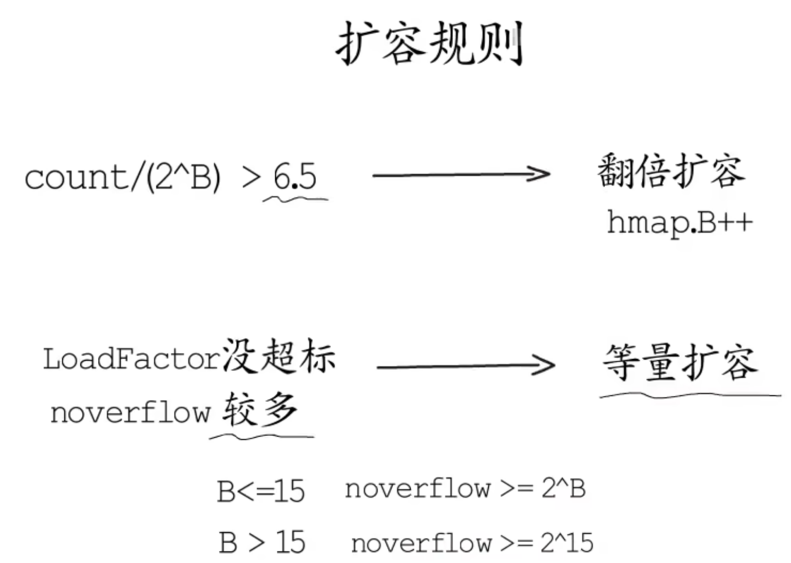

# Map的基本原理

## Map是什么

引用型数据结构、字典、k/v键值对、哈希表（使用的算法）、散列表（哈希对于数据的改变性质）

## Map的应用场景有哪些

1. 快速查找
2. 计数器
3. 配置管理
4. 数组去重
5. 缓存实现

## Map有哪些限制

1. 无序性（哈希计算、扩容导致的），与其在底层进行有序维护，不如在高层去做（这就是说range的时候打印出来的是随机的）
2. 有sync.Map（主要是底层的flags字段进行的标记），非线程安全的读写
   - 并发读没有问题；
   - 并发读写中的“写”是广义上的，包含写入、更新、删除等操作；
   - 读的时候发现其他 goroutine 在并发写，抛出 fatal error；
   - 写的时候发现其他 goroutine 在并发写，抛出 fatal error. （并发读写会引发 fatal error，是一种比 panic 更严重的错误，无法使用 recover 操作捕获）
3. map 中，key 的数据类型必须为可比较的类型，chan、map、func不可比较

## Map的使用

### 初始化

1. 对 map 的初始化分为以下几种方式：`myMap1 := make(map[int]int,2)`

2. 通过 make 关键字进行初始化，同时指定 map 预分配的容量`myMap2 := make(map[int]int)`

3. 通过 make 关键字进行初始化，不显式声明容量，因此默认容量 为 0，初始化操作连带赋值，一气呵成.

```go
myMap3 :=map[int]int{
  1:2,
  3:4,
}
```

### 读取

1. `v:=mp[key]`
2. `v,ok:=mp[key]`
3. `for k,v := range map` 再强调一下无序性，就是打印出来是随机的
4. `for k,v := range myMap` 这样写也是

### 写入

1. 直接写一个元素`myMap[5] = 6`，须注意的一点是，倘若 map **未初始化**，直接执行写操作会导致 panic：

```go
const plainError string
panic(plainError("assignment to entry in nil map"))
```

### 删除

`delete(myMap,5)` 执行 delete 方法时，倘若 key 存在，则会从 map 中将对应的 key-value 对删除；倘若 key 不存在或 map 未初始化，则方法直接结束，不会产生显式提示.

## 哈希表的扩容方式

### 两种基础的扩容方式

1. 开放地址法：取到哈希之后发现这个桶被占用，就往后找到第一个空桶放，查找也是先定位到这个桶之后往下找，直到找到新空桶还没找到的时候返回“不存在”
2. 拉链法：取到哈希之后发现这个桶被占用，就往后拉一个指针存储（像链表一样）

### 渐进式扩容

上面讲的是怎么去分配空间，这部分要讲如何将扩容分配到多次操作中，以避免一次性迁移造成的性能抖动

这样的分配需要的数据结构有以下三个关键的要素组成：

1. 有足够容量的新桶
2. 记录旧桶位置的字段
3. 记录迁移进度的字段

# 底层数据结构



## bmap的数据结构



这是一个基本的bmap的数据结构，键是放在一起的，值是放在一起的。这个数据结构是最基本存储键和值的单位，也是核心数据结构hmap的一个单元（关系见下面的图）

## `hmap` (map的数据结构)



### 桶结构

1. 每个桶固定可以存放 8 个 key-value 对；
2. 倘若超过 8 个 key-value 对打到桶数组的同一个索引当中，此时会通过创建桶链表的方式来化解这一问题.

```go
type hmap struct {
	// Note: the format of the hmap is also encoded in cmd/compile/internal/reflectdata/reflect.go.
	// Make sure this stays in sync with the compiler's definition.
	count     int // 当前map有多少个元素
	flags     uint8 //map是否正在进行写操作，不允许并发的读写
	B         uint8  // log_2 of # of buckets 代表了桶的数量，2位底数的幂数是B
	noverflow uint16 // approximate number of overflow buckets; see incrnoverflow for details
	hash0     uint32 // hash 因子

	buckets    unsafe.Pointer // bmap数组
	oldbuckets unsafe.Pointer // previous bucket array of half the size, non-nil only when growing
	nevacuate  uintptr        // progress counter for evacuation (buckets less than this have been evacuated)

	extra *mapextra // 扩展信息 optional fields
}
```

1. 哈希表使用桶的数量大于2^4时，就会认为使用溢出桶的几率比较大，就会预分配2^(b-4)个溢出桶。这些桶在内存中是连续的，只是前2^B用于常规桶，后面的用于溢出桶
2. hmap最后有一个extra字段，指向的是`mapextra`溢出桶结构体，该结构体中存储溢出桶的信息

## `mapextra` 溢出桶的数据结构

```go
type mapextra struct {
	// If both key and elem do not contain pointers and are inline, then we mark bucket
	// type as containing no pointers. This avoids scanning such maps.
	// However, bmap.overflow is a pointer. In order to keep overflow buckets
	// alive, we store pointers to all overflow buckets in hmap.extra.overflow and hmap.extra.oldoverflow.
	// overflow and oldoverflow are only used if key and elem do not contain pointers.
	// overflow contains overflow buckets for hmap.buckets.
	// oldoverflow contains overflow buckets for hmap.oldbuckets.
	// The indirection allows to store a pointer to the slice in hiter.
	overflow    *[]*bmap//记录已经被使用的溢出桶的地址
	oldoverflow *[]*bmap//在扩容阶段用于存储旧桶使用溢出桶的位置

	// nextOverflow holds a pointer to a free overflow bucket.
	nextOverflow *bmap//记录下个空闲溢出桶的位置
}
```

# 实际例子

## 基础桶的例子

当创建一个map之后，内存是张下面这样的



## 扩容

当这个桶存储满之后，我们要使用下面的方法去进行扩容。扩容的方式有翻倍扩容和等量扩容两个方式



1. 翻倍扩容是当LoadFactor超标时，说明桶里面存储了太多的数据，需要扩倍，这个时候需要将B字段加一实现扩倍。扩倍之后每个旧桶的键值都会分配到两个新桶中，如何分配根据的是元素哈希值的除余结果
2. 等量扩容适用于LoadFactor未超标时，说明存在大量删除元素后留下的空余空间，这时候迁移到等量的新桶就回省出连续的很多空间

