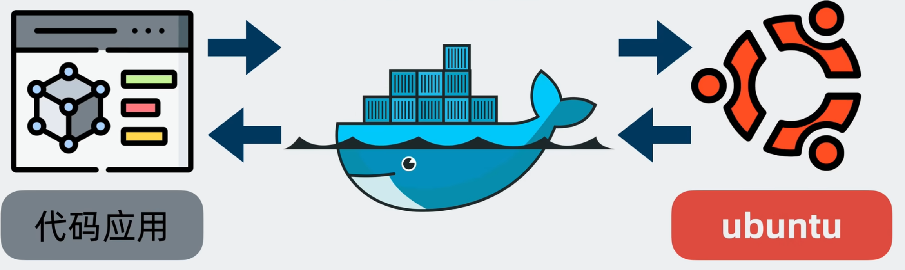
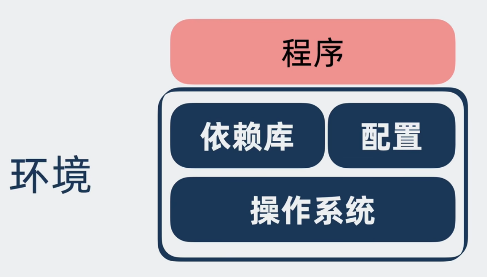
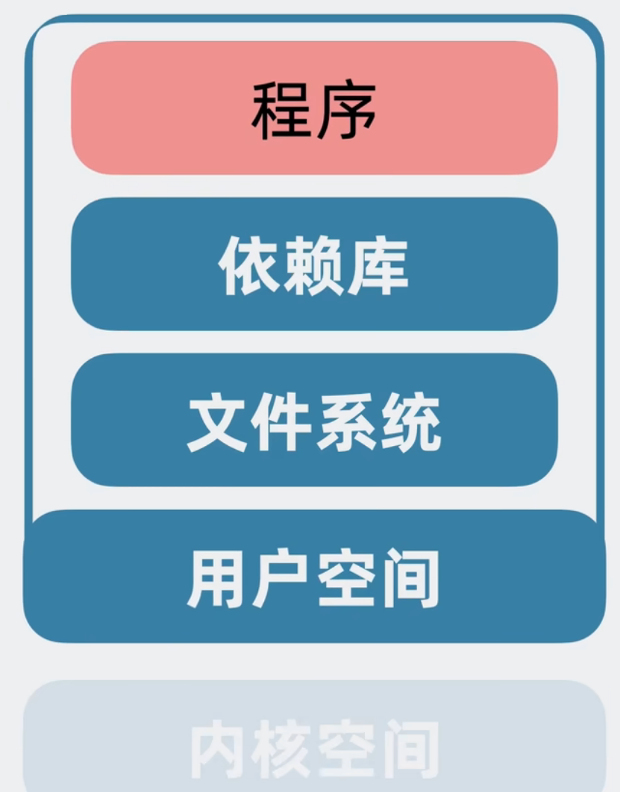

# Docker学习

在学习相关

## Docker是什么

在这个图里面，我们可以看到，docker（准确来说是docker容器）充当的是程序和操作系统之间的中间层，那么这个中间层解决的问题是什么呢？准确来说是解决依赖环境

下面举两个例子：

1. 我写了一个Python的脚本，在我的电脑上可以用来爬数据或者抢课，但是我转发给舍友之后他确用不了。原因就是我电脑上的`venv`他并没有，也就是依赖和配置出现了问题
2. 我在windows上面开发了一个go服务器程序，编译完成之后放在`linux`云服务器上面跑，发现跑不通。原因就是我没有交叉编译，也就是操作系统出现了问题

因此，我简单的理解为：**操作系统+依赖库 配置 = 环境**

那么解决这个问题的方法是什么呢？

浅显的理解就是 **把程序和环境一起打包**发给对方——docker就是一款可以将**环境和程序**一起**打包并运行**的工具软件

### 基础镜像是什么

对于一个Linux操作系统来说，一般会用用户态（空间）和内核态（空间）。由于程序通常运行在用户空间上，所以我们只需要打包 **用户空间+文件系统+依赖库+程序** 就可以。

这个打成类似于压缩包的东西，就是基础镜像`base image`

### `dockerfile`是什么

当我们拥有了一个基础环境之后，还需要执行 安装依赖、创建文件夹、启动程序 等操作。

`dockerfile`就是列举了这一系列事情的`TODOList`

### 容器镜像是什么

`dockerfile`只是一个List，需要我们执行`docker build`

### 虚拟化和容器化区别

## Docker基本概念

### docker解决的问题

1. 统一标准

   - 应用构建：可以理解为win上面exe的样式，docker解决了各个应用的依赖问题，将程序打包成软件包，**使用`docker build`根据`dockerfile`构建docker镜像**

   - 应用分享：类似于手机上面的应用商城，所有软件都放在一个地方`docker hub`

   - 应用运行：效果还是和exe一样，exe是双击执行，docker打包程序成镜像之后，**使用`docker run`运行**

2. 资源隔离
