虽然很多人想比较Kubernetes和Docker，但这其实不是非此即彼的问题。本文将探讨这两种强大的技术如何相互补充。

说到容器技术，开源领域有两个名字崛起：Kubernetes和Docker。很多人想知道哪个选项更好，但这个问题基于一个误解。它们实际上是根本不同的技术，并且不竞争——这不是非此即彼的问题。虽然它们各自擅长，但彼此互补，结合起来也能带来强大的力量。

在这篇文章中，我们将探讨Kubernetes和Docker的基础知识，并探讨单独和协同使用它们的优势。为此，重要的是从将它们联系在一起的基础技术开始：容器。

### 什么是容器？

[容器](https://www.ibm.com/cloud/learn/containers)是一个可执行的软件单元，用于将应用代码及其依赖打包，使其能够在任何IT基础设施上运行。**容器是独立存在的;它从主机作系统（OS）中抽象出来——通常是Linux——这使得它能够在IT环境中携带。**

**理解容器概念的一种方法是将其与[虚拟机（VM）](https://www.ibm.com/cloud/learn/virtual-machines)进行比较。两者都基于虚拟化技术，但容器虚拟化作系统，而虚拟机利用[虚拟机](https://www.ibm.com/cloud/learn/hypervisors)监控程序——虚拟机与计算机硬件之间的轻量级软件层——来虚拟化物理硬件。**

在传统[虚拟化](https://www.ibm.com/cloud/learn/virtualization-a-complete-guide)中，每个虚拟机包含一个客户作系统（OS）的完整副本、运行作系统所需的硬件的虚拟副本，以及应用程序及其相关的库和依赖。而容器则仅包含应用程序及其库和依赖。缺少客座主机大大缩小了集装箱的体积，使其变得轻便、快速且便携。

关于容器和虚拟机的区别，请参见《[容器与虚拟机：有什么区别？](https://www.ibm.com/cloud/blog/containers-vs-vms)》。

工程师可以使用容器快速开发能够在大量分布式系统和跨平台环境中稳定运行的应用程序。容器的可移植性消除了许多因功能团队之间工具和软件差异而产生的冲突。

这使得它们特别适合[DevOps](https://www.ibm.com/cloud/learn/devops-a-complete-guide) 工作流程，方便开发者和IT运营跨环境协作。容器体积小且轻便，也非常适合微[服务](https://www.ibm.com/cloud/learn/microservices)架构，其中应用由松耦合的较小服务组成。容器化通常是现代化本地应用并将其与云服务集成的第一步：

https://mediacenter.ibm.com/media/1_mtji10i1

### 什么是Docker？

[Docker](https://www.ibm.com/cloud/learn/docker) 是一个开源[的容器化](https://www.ibm.com/cloud/learn/containerization)平台。基本上，它是一个工具包，让开发者更容易、更安全、更快速地**构建、部署和管理容器**。尽管最初是一个开源项目，如今 Docker 也指代 Docker， Inc.，即生产商业 Docker 产品的公司。目前，无论开发者使用 Windows、Linux 还是 MacOS，它都是创建容器最受欢迎的工具。

事实上，在2013年Docker发布之前，容器技术已经存在了几十年。在早期，Linux 容器（或称 LXC）是其中最为普遍的。Docker 基于 LXC 构建，但 Docker 的定制技术很快超过 LXC，成为最受欢迎的容器化平台。

Docker 的一个关键特性是其可移植性。 **Docker 容器可以运行在任何桌面、[数据中心](https://www.ibm.com/cloud/learn/data-centers)或云环境中。** **每个容器中只能运行一个进程**，因此应用程序可以在部分进行更新或修复时持续运行。

Docker 常用的一些工具和术语包括以下几项：

- **Docker 引擎**：允许开发者构建和运行 contoainer 的运行环境。
- **Dockerfile**：一个简单的文本文件，定义构建 Docker 容器镜像所需的一切，如作系统网络规范和文件位置。它本质上是 Docker Engine 用来组装镜像的命令列表。
- **Docker Compose**：一个用于定义和运行多容器应用的工具。它创建一个 YAML 文件，指定应用中包含的服务，并通过 Docker CLI 单一命令部署和运行容器。

其他 Docker API 功能包括自动跟踪和回滚容器镜像、使用现有容器作为构建新容器的基础镜像，以及基于应用源代码构建容器。Docker 由一个充满活力的开发者社区支持，他们通过 Docker Hub 在互联网上共享数千个容器。

但虽然Docker在小型应用中表现良好，大型企业应用可能涉及大量容器——有时有数百甚至数千个——这对负责管理这些容器的IT团队来说会感到不堪重负。这就是容器编排发挥作用的地方。Docker 有自己的编排工具 Docker Swarm，但最受欢迎且最强大的选择是 Kubernetes。（详见《[Docker Swarm vs. Kubernetes 与 Kubernetes](https://www.ibm.com/cloud/blog/docker-swarm-vs-kubernetes-a-comparison) 比较》一文，了解 Kubernetes 与 Docker Swarm 的争论。）

### 什么是Kubernetes？

[Kubernetes](https://www.ibm.com/cloud/learn/kubernetes) 是一个开源[的容器编排](https://www.ibm.com/cloud/blog/container-orchestration-explained)平台，用于调度和自动化容器化应用的部署、管理和扩展。容器运行于称为“集群”的多容器架构中。[Kubernetes](https://www.ibm.com/cloud/blog/kubernetes-clusters-architecture-for-rapid-controlled-cloud-app-delivery)集群包含一个被称为“主节点”的容器，用于调度集群中其他容器——或“工作节点”的工作负载。

主节点决定应用（或 Docker 容器）的托管位置，决定如何组合它们并管理它们的编排。通过将构成应用的容器分组到集群中，Kubernetes 促进了服务发现，并实现了在整个生命周期中对大量容器的管理。

谷歌于2014年将Kubernetes作为开源项目推出。现在，它由一个名为云原生计算基金会的开源软件基金会管理。Kubernetes专为生产环境中的容器编排设计，部分因其强大的功能、拥有数千贡献者的活跃开源社区以及支持，以及跨越领先公有云供应商（如IBM Cloud、Google、Azure和AWS）的可移植性而广受欢迎。

Kubernetes 的关键功能包括以下内容：

- **部署：** 它调度并自动化了多个计算节点的容器部署，这些节点可以是虚拟机或裸机服务器。
- **服务发现与负载均衡：**在互联网上暴露一个容器，并在流量激增发生时采用[负载均衡](https://www.ibm.com/cloud/learn/load-balancing)以维持稳定性。
- **自动扩展功能**：自动启动新容器以应对重负载，无论是基于CPU占用率、内存阈值还是自定义指标。
- **自修复能力：**当容器失败或节点失效时，可以重启、替换或重新调度容器，并杀弃无法响应用户定义健康检查的容器。
- **自动推出与回滚：**推出应用变更并监控应用健康状况，若出现问题则回滚。
- **存储编排：**根据需要自动挂载选择的持久本地或云存储系统，以降低延迟并提升用户体验。

更多信息，请参见我们的视频《Kubernetes 解析》：

https://mediacenter.ibm.com/media/1_buvyfs4z

### Kubernetes与Docker：找到你的最佳容器解决方案

虽然Kubernetes和Docker是不同的技术，但它们高度互补，形成强大的组合。Docker 提供了容器化部分，使开发者能够通过命令行轻松将应用打包到小型、隔离的容器中。开发者随后可以在他们的IT环境中运行这些应用程序，而无需担心兼容性问题。如果应用程序在测试时只在单节点运行，它会在任何地方运行。

当需求激增时，Kubernetes提供Docker容器的编排，调度并自动部署到IT环境中，确保高可用性。除了运行容器，Kubernetes还具备负载均衡、自我修复以及自动推出和回滚等优势。此外，它配备了图形用户界面，便于使用。

对于未来计划扩展基础设施的公司来说，从一开始就使用Kubernetes可能是合理的选择。对于已经使用Docker的用户来说，Kubernetes利用现有的容器和工作负载，同时应对扩展过程中的复杂问题。欲了解更多信息，请观看《Kubernetes vs. Docker：这不是非此即彼的问题》：

https://mediacenter.ibm.com/media/1_lqi1fgk2

### 集成以更好地自动化和管理应用

后续版本的 Docker 内置了与 Kubernetes 的集成。这一功能使开发团队能够更有效地自动化和管理所有 Docker 帮助他们构建的容器化应用。

归根结底，关键在于你的团队需要什么样的工具组合来实现其业务目标。了解如何开始这些[Kubernetes](https://www.ibm.com/cloud/blog/kubernetes-tutorials-5-ways-to-get-you-building-fast)教程，并探索[IBM Cloud Kubernetes服务](https://www.ibm.com/cloud/kubernetes-service)以了解更多信息。

Earn a badge through free browser-based Kubernetes tutorials with [IBM CloudLabs](https://www.ibm.com/cloud/kubernetes-service/kubernetes-tutorials).

## Docker与K8S简介

### Docker前世今生

2010年，几个搞IT的年轻人，在美国旧金山成立了一家名叫“dotCloud”的公司。

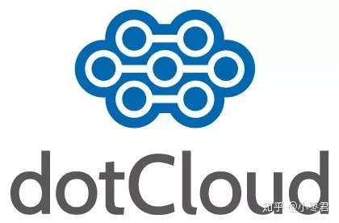

这家公司主要提供基于PaaS的云计算技术服务。具体来说，是和LXC有关的容器技术。

In fact, container technologies were available for decades prior to Docker’s release in 2013. In the early days, Linux Containers (or LXC) were the most prevalent of these. Docker was built on LXC, but Docker’s customized technology quickly overtook LXC to become the most popular containerization platform. 

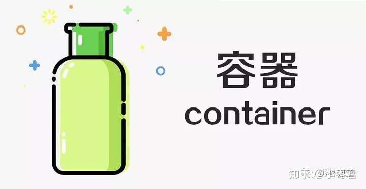LXC，就是Linux容器虚拟技术（Linux container)

后来，dotCloud公司将自己的容器技术进行了简化和标准化，并命名为——**Docker**。

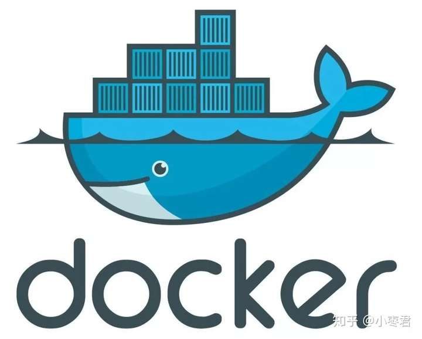

Docker技术诞生之后，并没有引起行业的关注。而dotCloud公司，作为一家小型创业企业，在激烈的竞争之下，也步履维艰。

正当他们快要坚持不下去的时候，脑子里蹦出了“开源”的想法。

### 创业公司开源之路

什么是“开源”？开源，就是开放源代码。也就是将原来内部保密的程序源代码开放给所有人，然后让大家一起参与进来，贡献代码和意见。

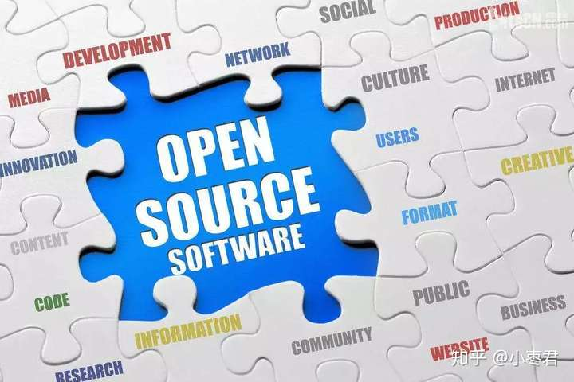开源，开源

有的软件是一开始就开源的。也有的软件，是混不下去，创造者又不想放弃，所以选择开源。自己养不活，就吃“百家饭”嘛。

**2013年3月**，dotCloud公司的创始人之一，Docker之父，28岁的**Solomon Hykes**正式决定，将Docker项目开源。

Solomon Hykes（今年刚从Docker离职)

不开则已，一开惊人。

越来越多的IT工程师发现了Docker的优点，然后蜂拥而至，加入Docker开源社区。

Docker的人气迅速攀升，速度之快，令人瞠目结舌。

开源当月，Docker 0.1 版本发布。此后的每一个月，Docker都会发布一个版本。到2014年6月9日，Docker 1.0 版本正式发布。

此时的Docker，已经成为行业里人气最火爆的开源技术，没有之一。甚至像Google、微软、Amazon、VMware这样的巨头，都对它青睐有加，表示将全力支持。

Docker火了之后，dotCloud公司干脆把公司名字也改成了Docker Inc. 。

### 实现原理

Docker和容器技术为什么会这么火爆？说白了，就是因为它“轻”。

在容器技术之前，业界的网红是**虚拟机**。虚拟机技术的代表，是**VMWare**和**OpenStack**。

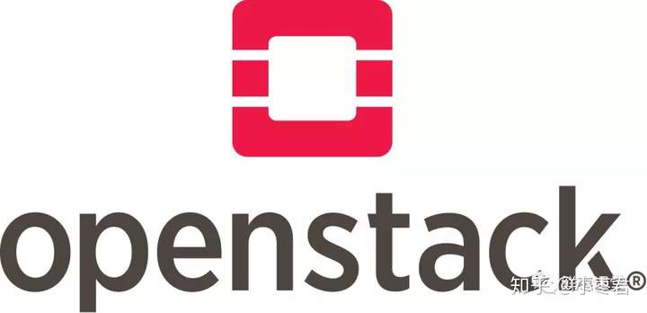

相信很多人都用过虚拟机。虚拟机，就是在你的操作系统里面，装一个软件，然后通过这个软件，再模拟一台甚至多台“子电脑”出来。

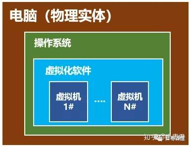

虚拟机，类似于“子电脑”

在“子电脑”里，你可以和正常电脑一样运行程序，例如开QQ。如果你愿意，你可以变出好几个“子电脑”，里面都开上QQ。“子电脑”和“子电脑”之间，是**相互隔离**的，互不影响。

虚拟机属于虚拟化技术。而Docker这样的容器技术，也是虚拟化技术，属于**轻量级的虚拟化**。每个虚拟机包含一个客户作系统（OS）的完整副本、运行作系统所需的硬件虚拟副本，以及应用程序及其相关的库和依赖。而容器则仅包含应用程序及其库和依赖。

虚拟机虽然可以隔离出很多“子电脑”，但占用空间更大，启动更慢，虚拟机软件可能还要花钱（例如VMWare）。

而容器技术恰好没有这些缺点。它不需要虚拟出整个操作系统，只需要虚拟一个小规模的环境（类似“沙箱”）。

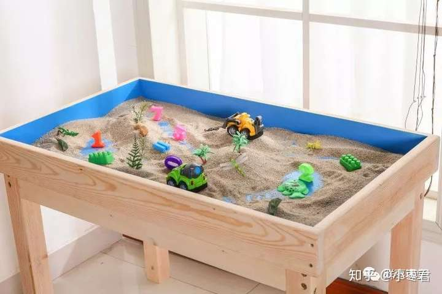沙箱

它启动时间很快，几秒钟就能完成。而且，它对资源的利用率很高（一台主机可以同时运行几千个Docker容器）。此外，**它占的空间很小，虚拟机一般要几GB到几十GB的空间，而容器只需要MB级甚至KB级。**

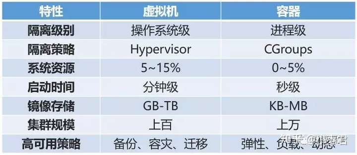容器和虚拟机的对比

正因为如此，容器技术受到了热烈的欢迎和追捧，发展迅速。

我们具体来看看Docker。

大家需要注意，**Docker本身并不是容器**，它是创建容器的工具，是应用容器引擎。

想要搞懂Docker，其实看它的两句口号就行。

第一句，是**“建造、飞船并奔跑”**。

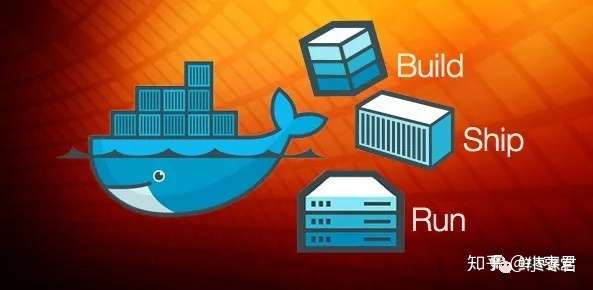

也就是，“搭建、发送、运行”，三板斧。

举个例子：

我来到一片空地，想建个房子，于是我搬石头、砍木头、画图纸，一顿操作，终于把这个房子盖好了。

结果，我住了一段时间，想搬到另一片空地去。 这时候，按以往的办法，我只能再次搬石头、砍木头、画图纸、盖房子。

但是，跑来一个老巫婆，教会我一种魔法。

这种魔法，可以把我盖好的房子复制一份，做成“镜像”，放在我的背包里。

等我到了另一片空地，就用这个“镜像”，复制一套房子，摆在那边，拎包入住。

怎么样？是不是很神奇？

所以，Docker的第二句口号就是：“**建一次，跑到哪里（搭建一次，到处能用）”。**

Docker技术的三大核心概念，分别是：

- **镜像（图片）**
- **容器（容器）**
- **仓库（仓库）**

我刚才例子里面，那个放在包里的“镜像”，就是**Docker镜像**。而我的背包，就是**Docker仓库**。我在空地上，用魔法造好的房子，就是一个**Docker容器**。

说白了，这个Docker镜像，是一个特殊的文件系统。它除了提供容器运行时所需的程序、库、资源、配置等文件外，还包含了一些为运行时准备的一些配置参数（例如环境变量）。镜像不包含任何动态数据，其内容在构建之后也不会被改变。

也就是说，每次变出房子，房子是一样的，但生活用品之类的，都是不管的。谁住谁负责添置。

每一个镜像可以变出一种房子。那么，我可以有多个镜像呀！

也就是说，我盖了一个欧式别墅，生成了镜像。另一个哥们可能盖了一个中国四合院，也生成了镜像。还有哥们，盖了一个非洲茅草屋，也生成了镜像。。。

这么一来，我们可以交换镜像，你用我的，我用你的，岂不是很爽？

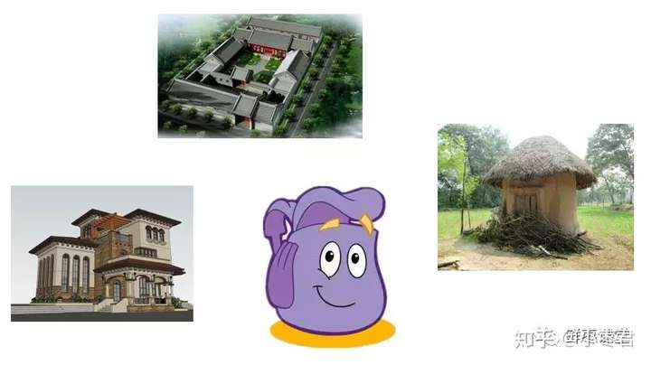

于是乎，就变成了一个大的公共仓库。

负责对Docker镜像进行管理的，是**Docker Registry服务**（类似仓库管理员）。

不是任何人建的任何镜像都是合法的。万一有人盖了一个有问题的房子呢？

所以，Docker Registry服务对镜像的管理是非常严格的。

最常使用的Registry公开服务，是官方的**Docker Hub**，这也是默认的Registry，并拥有大量的高质量的官方镜像。

好了，说完了Docker，我们再把目光转向K8S。

就在Docker容器技术被炒得热火朝天之时，大家发现，如果想要将Docker应用于具体的业务实现，是存在困难的——**编排、管理和调度等各个方面，都不容易**。于是，人们迫切需要一套管理系统，对Docker及容器进行更高级更灵活的管理。

就在这个时候，K8S出现了。

### K8S如何工作？

**K8S，就是基于容器的集群管理平台，它的全称，是kubernetes。**

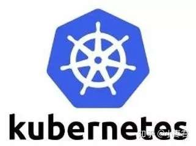

Kubernetes 这个单词来自于希腊语，含义是**舵手**或**领航员**。K8S是它的缩写，用“8”字替代了“ubernete”这8个字符。

和Docker不同，K8S的创造者，是众人皆知的行业巨头——**Google**。

然而，K8S并不是一件全新的发明。它的前身，是Google自己捣鼓了十多年的**Borg系统**。

K8S是2014年6月由Google公司正式公布出来并宣布开源的。

同年7月，微软、Red Hat、IBM、Docker、CoreOS、 Mesosphere和Saltstack 等公司，相继加入K8S。

之后的一年内，VMware、HP、Intel等公司，也陆续加入。

2015年7月，Google正式加入OpenStack基金会。与此同时，Kuberentes v1.0正式发布。

目前，kubernetes的版本已经发展到V1.13。

K8S的架构，略微有一点复杂，我们简单来看一下。

一个K8S系统，通常称为一个**K8S集群（Cluster）**。

这个集群主要包括两个部分：

- **一个Master节点（主节点）**
- **一群Node节点（计算节点）**

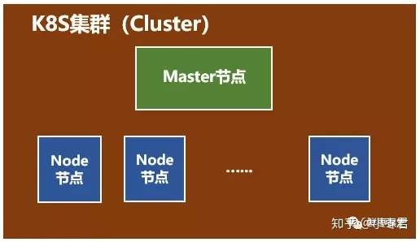

一看就明白：Master节点主要还是负责管理和控制。Node节点是工作负载节点，里面是具体的容器。

深入来看这两种节点。

首先是**Master节点**。

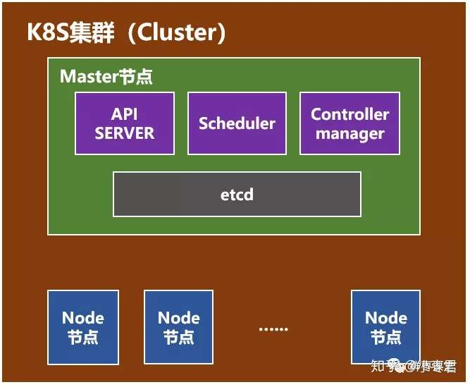

Master节点包括API Server、Scheduler、Controller manager、etcd。

API Server是整个系统的对外接口，供客户端和其它组件调用，相当于“营业厅”。

Scheduler负责对集群内部的资源进行调度，相当于“调度室”。

Controller manager负责管理控制器，相当于“大总管”。

然后是**Node节点**。

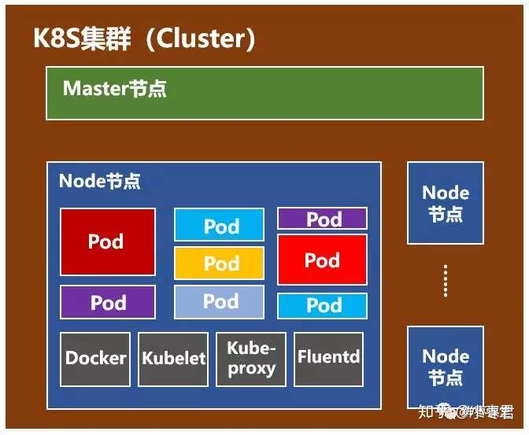

Node节点包括Docker、kubelet、kube-proxy、Fluentd、kube-dns（可选），还有就是**Pod**。

Pod是Kubernetes最基本的作单元。 一个Pod代表着集群中运行的一个进程，它内部封装了一个或多个紧密相关的容器。 除了Pod之外，K8S还有一个**Service**的概念，一个Service可以看作一组提供相同服务的Pod的对外访问接口。 这段不太好理解，跳过吧。

Docker，不用说了，创建容器的。

Kubelet，主要负责监视指派到它所在Node上的Pod，包括创建、修改、监控、删除等。

Kube-proxy，主要负责为Pod对象提供代理。

Fluentd，主要负责日志收集、存储与查询。

是不是有点懵？唉，三言两语真的很难讲清楚，继续跳过吧。

Docker和K8S都介绍完了，然而文章并没有结束。

接下来的部分，是**写给核心网工程师甚至所有通信工程师看的**。

从几十年前的1G，到现在的4G，再到将来的5G，移动通信发生了翻天覆地的变化，核心网亦是如此。

但是，如果你仔细洞察这些变化，会发现，所谓的核心网，其实本质上并没有发生改变，无非就是很多的服务器而已。 不同的核心网网元，就是不同的服务器，不同的计算节点。

变化的，是这些“服务器”的形态和接口：形态，从机柜单板，变成机柜刀片，从机柜刀片，变成X86通用刀片服务器；接口，从中继线缆，变成网线，从网线，变成光纤。

就算变来变去，还是服务器，是计算节点，是CPU。

既然是服务器，那么就势必会和IT云计算一样，走上虚拟化的道路。 毕竟，虚拟化有太多的优势，例如前文所说的低成本、高利用率、充分灵活、动态调度，等等。

前几年，大家以为虚拟机是核心网的终极形态。 目前看来，更有可能是**容器化**。这几年经常说的NFV（网元功能虚拟化），也有可能改口为NFC（网元功能容器化）。

以VoLTE为例，如果按以前2G/3G的方式，那需要大量的专用设备，分别充当EPC和IMS的不同网元。

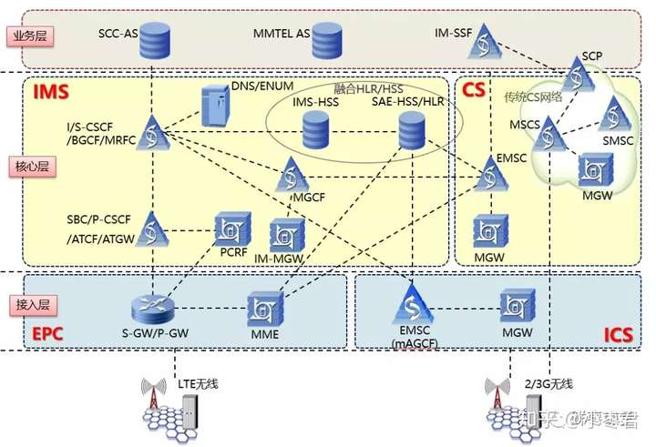VoLTE相关的网元

而采用容器之后，很可能只需要一台服务器，创建十几个容器，用不同的容器，来分别运行不同网元的服务程序。

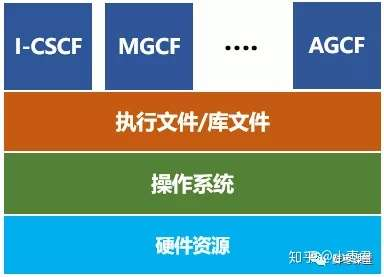

这些容器，随时可以创建，也可以随时销毁。还能够在不停机的情况下，随意变大，随意变小，随意变强，随意变弱，在性能和功耗之间动态平衡。

简直完美！

5G时代，核心网采用微服务架构，也是和容器完美搭配——单体式架构（Monolithic）变成微服务架构（Microservices），相当于一个全能型变成N个专能型。每个专能型，分配给一个隔离的容器，赋予了最大程度的灵活。

精细化分工

按照这样的发展趋势，在移动通信系统中，除了天线，剩下的部分都有可能虚拟化。核心网是第一个，但不是最后一个。虚拟化之后的核心网，与其说属于通信，实际上更应该归为IT。核心网的功能，只是容器中普通一个软件功能而已。

参考文献：

https://zhuanlan.zhihu.com/p/53260098