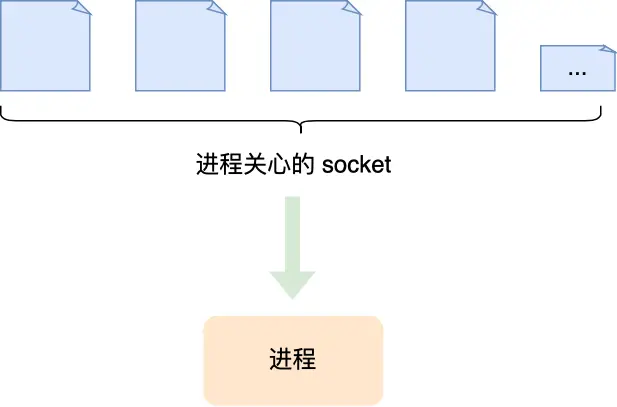

### 你了解过哪些io模型？

- 阻塞I/O模型：应用程序发起I/O操作后会被阻塞，直到操作完成才返回结果。适用于对实时性要求不高的场景。
- 非阻塞I/O模型：应用程序发起I/O操作后立即返回，不会被阻塞，但需要不断轮询或者使用select/poll/epoll等系统调用来检查I/O操作是否完成。适合于需要进行多路复用的场景，例如需要同时处理多个socket连接的服务器程序。
- I/O复用模型：通过select、poll、epoll等系统调用，**应用程序可以同时等待多个I/O操作**，当其中任何一个I/O操作准备就绪时，应用程序会被通知。适合于需要同时处理多个I/O操作的场景，比如高并发的服务端程序。
- 信号驱动I/O模型：应用程序发起I/O操作后，可以继续做其他事情，当I/O操作完成时，**操作系统会向应用程序发送信号来通知其完成**。适合于需要**异步I/O通知**的场景，可以提高系统的并发能力。(信号通知的是你什么时候可以做IO)
- 异步I/O模型：应用程序发起I/O操作后可以立即做其他事情，当I/O操作完成时，应用程序会得到通知。异步I/O模型**由操作系统内核完成I/O操作**，应用程序只需等待通知即可。适合于需要大量并发连接和高性能的场景，能够减少系统调用次数，提高系统效率。（异步通知的是什么时候IO完成了）

| 模型                              | 是否阻塞             | 并发能力              | 典型用法         |
| --------------------------------- | -------------------- | --------------------- | ---------------- |
| **阻塞 I/O**                      | 是                   | 低（1 连接 = 1 线程） | 简单脚本         |
| **非阻塞 I/O + 轮询**             | 否                   | 极低（CPU 空转）      | 几乎不用         |
| **I/O 复用（select/poll/epoll）** | **阻塞在复用调用上** | **高**                | Nginx、Redis     |
| **信号驱动 I/O**                  | 否（靠信号通知）     | 中                    | 较少用           |
| **异步 I/O（AIO/io_uring）**      | 否（完全后台完成）   | 高（现代方案）        | 新一代高性能服务 |

ps:这个是对三种系统调用的介绍:

- **`select`**：最早的 I/O 多路复用系统调用，支持跨平台，但有 fd 数量限制且效率低。
- **`poll`**：改进版 `select`，取消了 fd 数量限制，但仍需遍历所有描述符，性能一般。
- **`epoll`**：Linux 高性能 I/O 多路复用机制，仅返回就绪 fd，支持海量连接，适用于高并发场景。

1. `select`

   - **最早出现**（POSIX 标准），跨平台性好（Windows 也有类似机制）。

   - **原理**：传入三个 fd_set（分别表示关注可读、可写、异常的文件描述符集合），内核遍历这些集合，检查是否有事件发生。

   - **缺点**：

     - **FD 数量限制**：通常最多 1024 个（由 `FD_SETSIZE` 定义）；
     - **每次调用都要传递整个 fd 集合**，内核和用户空间需反复拷贝；
     - **内核每次都要线性扫描所有 fd**，即使只有少数活跃；
     - **返回后需遍历整个 fd_set 才知道哪些就绪了**（O(n) 开销）。

   - ```c
     int select(int nfds, fd_set *readfds, fd_set *writefds,
                fd_set *exceptfds, struct timeval *timeout);
     ```

2. `poll`

   - **改进版 `select`**，解决部分问题。

   - **原理**：使用 `pollfd` 结构体数组代替位图，每个结构体包含 fd + 关注事件 + 返回事件。

   - **优点**：
     - **没有 1024 限制**（只受系统资源限制）；
     - 接口更清晰（事件类型用字段表示，而非三个独立集合）。

   - **缺点**：

     - **仍需每次传递整个 fd 数组**（用户态 ↔ 内核态拷贝）；
     - **内核仍需线性扫描所有 fd**；
     - **返回后仍需遍历整个数组找就绪 fd**。

   - ```c
     int poll(struct pollfd *fds, nfds_t nfds, int timeout);
     ```

   -  `select` 和 `poll` 都是 **O(n) 时间复杂度**，在连接数多但活跃连接少时效率低下。

3. `epoll`（Linux 特有，高性能）

   - **为解决 `select/poll` 的性能瓶颈而设计**，适用于**大量连接、少量活跃**的场景（典型 Web 服务器）。

   - **核心机制**：
     - **`epoll_create()`**：创建一个 epoll 实例（返回一个 fd，代表内核中的“兴趣列表”）；
     - **`epoll_ctl()`**：向 epoll 实例**注册/修改/删除**要监听的 fd 及其事件（只需操作一次，后续不用重复传）；
     - **`epoll_wait()`**：等待事件发生，**只返回就绪的 fd 列表**（无需遍历全部）。

   - **优点**：

     - **无 fd 数量限制**（仅受内存限制）；
     - **内核维护“就绪链表”**，`epoll_wait()` 直接返回就绪事件，**时间复杂度 O(1)**；
     - **避免了每次调用都拷贝整个 fd 集合**（注册一次，长期有效）；
     - 支持 **边缘触发（ET）** 和 **水平触发（LT）** 两种模式。

   - ```c
     int epfd = epoll_create(1);
     struct epoll_event ev, events[MAX_EVENTS];
     ev.events = EPOLLIN; ev.data.fd = sockfd;
     epoll_ctl(epfd, EPOLL_CTL_ADD, sockfd, &ev);
     epoll_wait(epfd, events, MAX_EVENTS, timeout);
     ```

### 服务器处理并发请求有哪几种方式？

- 单线程web服务器方式：web服务器一次处理一个请求，结束后读取并处理下一个请求，性能比较低，一次只能处理一个请求。
- 多进程/多线程web服务器：web服务器生成多个进程或线程并行处理多个用户请求，进程或线程可以按需或事先生成。有的web服务器应用程序为每个用户请求生成一个单独的进程或线程来进行响应，不过，一旦并发请求数量达到成千上万时，多个同时运行的进程或线程将会消耗大量的系统资源。（即每个进程只能响应一个请求，并且一个进程对应一个线程）
- **I/O多路复用web服务器**：web服务器可以I/O多路复用，达到只用一个线程就能监听和处理多个客户端的 i/o 事件。
- 多路复用多线程web服务器：将多进程和多路复用的功能结合起来形成的web服务器架构，其避免了让一个进程服务于过多的用户请求，并能充分利用多CPU主机所提供的计算能力。（这种架构可以理解为有多个进程，并且一个进程又生成多个线程，每个线程处理一个请求）

### 讲一下io多路复用

IO多路复用是一种IO得处理方式，指的是复用一个线程，处理多个socket中的事件。能够资源复用，防止创建过多线程导致的上下文切换的开销。



### select、poll、epoll 的区别是什么？

我们熟悉的 select/poll/epoll 内核提供给用户态的多路复用系统调用，**进程可以通过一个系统调用函数从内核中获取多个事件**。

select/poll/epoll 是如何获取网络事件的呢？在获取事件时，先把所有连接（文件描述符）传给内核，再由内核返回产生了事件的连接，然后在用户态中再处理这些连接对应的请求即可。

select/poll/epoll 这是三个多路复用接口，都能实现 C10K 吗？接下来，我们分别说说它们。

> select/poll

select 实现多路复用的方式是，将已连接的 Socket 都放到一个**文件描述符集合**，然后调用 select 函数将文件描述符集合**拷贝**到内核里，让内核来检查是否有网络事件产生，检查的方式很粗暴，就是通过**遍历**文件描述符集合的方式，当检查到有事件产生后，将此 Socket 标记为可读或可写， 接着再把整个文件描述符集合**拷贝**回用户态里，然后用户态还需要再通过**遍历**的方法找到可读或可写的 Socket，然后再对其处理。

所以，对于 select 这种方式，需要进行 **2 次「遍历」文件描述符集合**，一次是在内核态里，一个次是在用户态里 ，而且还会发生 **2 次「拷贝」文件描述符集合**，先从用户空间传入内核空间，由内核修改后，再传出到用户空间中。

select 使用固定长度的 BitsMap，表示文件描述符集合，而且所支持的文件描述符的个数是有限制的，在 Linux 系统中，由内核中的 FD_SETSIZE 限制， 默认最大值为 1024，只能监听 0~1023 的文件描述符。

poll 不再用 BitsMap 来存储所关注的文件描述符，取而代之用动态数组，以链表形式来组织，突破了 select 的文件描述符个数限制，当然还会受到系统文件描述符限制。

但是 poll 和 select 并没有太大的本质区别，**都是使用「线性结构」存储进程关注的 Socket 集合，因此都需要遍历文件描述符集合来找到可读或可写的 Socket，时间复杂度为 O(n)，而且也需要在用户态与内核态之间拷贝文件描述符集合**，这种方式随着并发数上来，性能的损耗会呈指数级增长。

> epoll

先复习下 epoll 的用法。如下的代码中，先用epoll_create 创建一个 epol l对象 epfd，再通过 epoll_ctl 将需要监视的 socket 添加到epfd中，最后调用 epoll_wait 等待数据。

```c
int s = socket(AF_INET, SOCK_STREAM, 0);
bind(s, ...);
listen(s, ...)

int epfd = epoll_create(...);
epoll_ctl(epfd, ...); //将所有需要监听的socket添加到epfd中

while(1) {
    int n = epoll_wait(...);
    for(接收到数据的socket){
        //处理
    }
}
```

epoll 通过两个方面，很好解决了 select/poll 的问题。

- *第一点*，epoll 在内核里使用**红黑树来跟踪进程所有待检测的文件描述字**，把需要监控的 socket 通过 epoll_ctl() 函数加入内核中的红黑树里，红黑树是个高效的数据结构，增删改一般时间复杂度是 O(logn)。而 select/poll 内核里没有类似 epoll 红黑树这种保存所有待检测的 socket 的数据结构，所以 select/poll 每次操作时都传入整个 socket 集合给内核，而 epoll 因为在内核维护了红黑树，可以保存所有待检测的 socket ，所以只需要传入一个待检测的 socket，减少了内核和用户空间大量的数据拷贝和内存分配。
- *第二点*， epoll 使用**事件驱动**的机制，内核里**维护了一个链表来记录就绪事件**，当某个 socket 有事件发生时，通过**回调函数**内核会将其加入到这个就绪事件列表中，当用户调用 epoll_wait() 函数时，只会返回有事件发生的文件描述符的个数，不需要像 select/poll 那样轮询扫描整个 socket 集合，大大提高了检测的效率。

从下图你可以看到 epoll 相关的接口作用：


epoll 的方式即使监听的 Socket 数量越多的时候，效率不会大幅度降低，能够同时监听的 Socket 的数目也非常的多了，上限就为系统定义的进程打开的最大文件描述符个数。因而，**epoll 被称为解决 C10K 问题的利器**。

### epoll 的 边缘触发和水平触发有什么区别？

epoll 支持两种事件触发模式，分别是**边缘触发（edge-triggered，ET）和水平触发（level-triggered，LT**）。

这两个术语还挺抽象的，其实它们的区别还是很好理解的。

- 使用边缘触发模式时，当被监控的 Socket 描述符上有可读事件发生时，**服务器端只会从 epoll_wait 中苏醒一次**，即使进程没有调用 read 函数从内核读取数据，也依然只苏醒一次，因此我们程序要保证一次性将内核缓冲区的数据读取完；
- 使用水平触发模式时，当被监控的 Socket 上有可读事件发生时，**服务器端不断地从 epoll_wait 中苏醒，直到内核缓冲区数据被 read 函数读完才结束**，目的是告诉我们有数据需要读取；

举个例子，你的快递被放到了一个快递箱里，如果快递箱只会通过短信通知你一次，即使你一直没有去取，它也不会再发送第二条短信提醒你，这个方式就是边缘触发；如果快递箱发现你的快递没有被取出，它就会不停地发短信通知你，直到你取出了快递，它才消停，这个就是水平触发的方式。

这就是两者的区别，水平触发的意思是只要满足事件的条件，比如内核中有数据需要读，就一直不断地把这个事件传递给用户；而边缘触发的意思是只有第一次满足条件的时候才触发，之后就不会再传递同样的事件了。

如果使用水平触发模式，当内核通知文件描述符可读写时，接下来还可以继续去检测它的状态，看它是否依然可读或可写。所以在收到通知后，没必要一次执行尽可能多的读写操作。

如果使用边缘触发模式，I/O 事件发生时只会通知一次，而且我们不知道到底能读写多少数据，所以在收到通知后应尽可能地读写数据，以免错失读写的机会。因此，我们会**循环**从文件描述符读写数据，那么如果文件描述符是阻塞的，没有数据可读写时，进程会阻塞在读写函数那里，程序就没办法继续往下执行。所以，**边缘触发模式一般和非阻塞 I/O 搭配使用**，程序会一直执行 I/O 操作，直到系统调用（如 read 和 write）返回错误，错误类型为 EAGAIN 或 EWOULDBLOCK。

一般来说，边缘触发的效率比水平触发的效率要高，因为边缘触发可以减少 epoll_wait 的系统调用次数，系统调用也是有一定的开销的的，毕竟也存在上下文的切换。

### redis，nginx，netty 是依赖什么做的这么高性能？

主要是依赖**Reactor 模式**实现了高性能网络模式，这个是在i/o多路复用接口基础上实现的了网络模型。Reactor 翻译过来的意思是「反应堆」，这里的反应指的是「**对事件反应**」，也就是**来了一个事件，Reactor 就有相对应的反应/响应**。

Reactor 模式主要由 Reactor 和处理资源池这两个核心部分组成，它俩负责的事情如下：

- Reactor 负责监听和分发事件，事件类型包含连接事件、读写事件；
- 处理资源池负责处理事件，如 read -> 业务逻辑 -> send；

Reactor 模式是灵活多变的，可以应对不同的业务场景，灵活在于：

- Reactor 的数量可以只有一个，也可以有多个；
- 处理资源池可以是单个进程 / 线程，也可以是多个进程 /线程；

> Redis

Redis 6.0 之前使用的 Reactor 模型就是单 Reactor 单进程模式。单 Reactor 单进程的方案因为全部工作都在同一个进程内完成，所以实现起来比较简单，不需要考虑进程间通信，也不用担心多进程竞争。


但是，这种方案存在 2 个缺点：

- 第一个缺点，因为只有一个进程，**无法充分利用 多核 CPU 的性能**；
- 第二个缺点，Handler 对象在业务处理时，整个进程是无法处理其他连接的事件的，**如果业务处理耗时比较长，那么就造成响应的延迟**；

所以，单 Reactor 单进程的方案**不适用计算机密集型的场景，只适用于业务处理非常快速的场景**。

Redis 是由 C 语言实现的，在 Redis 6.0 版本之前采用的正是「单 Reactor 单进程」的方案，因为 Redis 业务处理主要是在内存中完成，操作的速度是很快的，性能瓶颈不在 CPU 上，所以 Redis 对于命令的处理是单进程的方案。

> Netty

Netty 是采用了多 Reactor 多线程方案，如下图：


多 Reactor 多线程的方案优势：

- 主线程和子线程分工明确，主线程只负责接收新连接，子线程负责完成后续的业务处理。
- 主线程和子线程的交互很简单，主线程只需要把新连接传给子线程，子线程无须返回数据，直接就可以在子线程将处理结果发送给客户端。

> nginx

nginx 是多 Reactor 多进程方案，不过方案与标准的多 Reactor 多进程有些差异。


具体差异表现在主进程中仅仅用来初始化 socket，并没有创建 mainReactor 来 accept 连接，而是由子进程的 Reactor 来 accept 连接，通过锁来控制一次只有一个子进程进行 accept（防止出现惊群现象），子进程 accept 新连接后就放到自己的 Reactor 进行处理，不会再分配给其他子进程。

### 零拷贝是什么？

传统 IO 的工作方式，从硬盘读取数据，然后再通过网卡向外发送，我们需要进行 4 上下文切换，和 4 次数据拷贝，其中 2 次数据拷贝发生在内存里的缓冲区和对应的硬件设备之间，这个是由 DMA 完成，另外 2 次则发生在内核态和用户态之间，这个数据搬移工作是由 CPU 完成的。


为了提高文件传输的性能，于是就出现了零拷贝技术，它通过一次系统调用（sendfile 方法）合并了磁盘读取与网络发送两个操作，降低了上下文切换次数。另外，拷贝数据都是发生在内核中的，天然就降低了数据拷贝的次数。


零拷贝技术的文件传输方式相比传统文件传输的方式，减少了 2 次上下文切换和数据拷贝次数，**只需要 2 次上下文切换和数据拷贝次数，就可以完成文件的传输，而且 2 次的数据拷贝过程，都不需要通过 CPU，2 次都是由 DMA 来搬运。**

总体来看，**零拷贝技术可以把文件传输的性能提高至少一倍以上**。