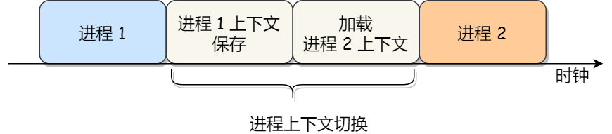
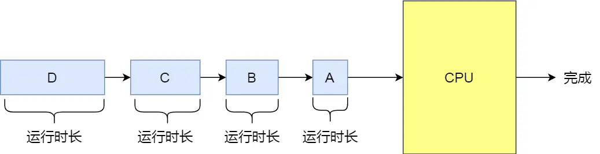
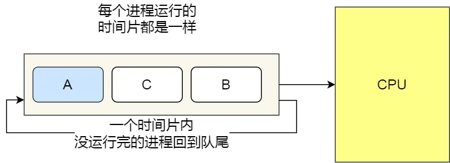
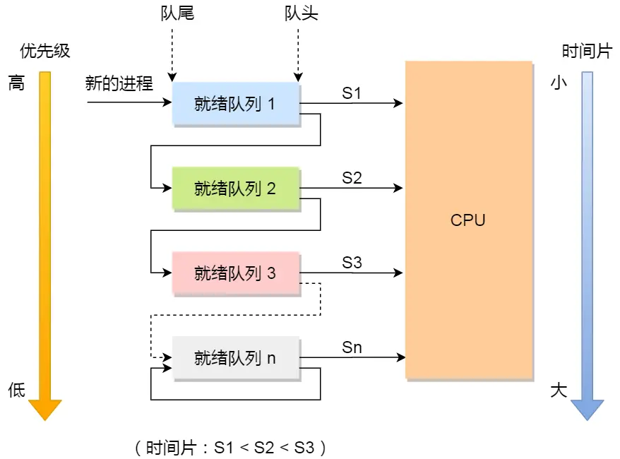
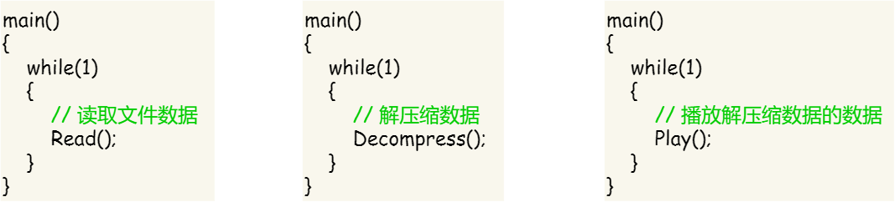

## x程区别

### 线程和进程的区别是什么？

- **本质区别**：进程是操作系统资源分配的基本单位，而线程是任务调度和执行的基本单位
- **在开销方面**：每个进程都有独立的代码和数据空间（程序上下文），程序之间的切换会有较大的开销；线程可以看做轻量级的进程，同一类线程共享代码和数据空间，每个线程都有自己独立的运行栈和程序计数器（PC），线程之间切换的开销小
- **稳定性方面**：进程中某个线程如果崩溃了，可能会导致整个进程都崩溃。而进程中的子进程崩溃，并不会影响其他进程。
- **内存分配方面**：系统在运行的时候会为每个进程分配不同的内存空间；而对线程而言，除了CPU外，系统不会为线程分配内存（线程所使用的资源来自其所属进程的资源），线程组之间只能共享资源
- **包含关系**：没有线程的进程可以看做是单线程的，如果一个进程内有多个线程，则执行过程不是一条线的，而是多条线

### 进程，线程，协程的区别是什么？

- 首先，我们来谈谈**进程**。**进程是操作系统中进行资源分配和调度的基本单位**，它拥有自己的独立内存空间和系统资源。每个进程都有**独立的堆和栈**，不与其他进程共享。进程间**通信**需要通过特定的机制，如管道、消息队列、信号量等。由于进程拥有**独立的内存空间**，因此其稳定性和安全性相对较高，但同时上下文切换的开销也较大，因为需要保存和恢复整个进程的状态。
- 接下来是**线程**。线程是进程内的一个执行单元，也是**CPU调度和分派的基本单位**。与进程不同，线程共享进程的内存空间，包括**(共享)堆和全局变量**。线程之间通信更加高效，因为它们可以**直接读写共享内存**。线程的上下文切换开销较小，因为只需要保存和恢复线程的上下文，而不是整个进程的状态。然而，由于多个线程共享内存空间，因此存在数据竞争和线程安全的问题，需要通过同步和互斥机制来解决。
- 最后是**协程**。协程是一种用户态的轻量级线程，其调度**完全由用户程序控制**，而不需要内核的参与。协程拥有自己的**寄存器上下文和栈**，但与其他协程共享堆内存。协程的切换开销非常小，因为只需要保存和恢复协程的上下文，而无需进行内核级的上下文切换。这使得协程在处理大量并发任务时具有非常高的效率。然而，协程需要程序员显式地进行调度和管理，相对于线程和进程来说，其编程模型更为复杂。

### 协程和线程的关系

|   特性   |             协程             |             线程              |
| :------: | :--------------------------: | :---------------------------: |
|  调度者  |  编程语言 / 框架（用户态）   |    操作系统内核（内核态）     |
| 切换开销 |   极小（仅保存函数调用栈）   | 较小（保存寄存器 + 栈上下文） |
| 抢占方式 |   非抢占式（协程主动让出）   |  抢占式（操作系统强制切换）   |
| 资源占用 | 极低（1 个线程可跑上万协程） |  较高（系统默认线程栈几 MB）  |
| 依赖关系 |      必须运行在线程之上      |      运行在 CPU 核心之上      |

 通俗比喻：

- CPU 核心 = 工厂的生产车间；

- 线程 = 车间里的工人（操作系统招聘 / 调度，每个工人占一个工作台 <线程栈>）；

- 协程 = 工人手里的 “小任务卡片”（程序员写的，一个工人能拿几十 / 上百张卡片）；

- 线程切换 = 工厂管理员（操作系统）把工人从 A 工作台调到 B 工作台，要收走工人的笔记本 <寄存器>、记录工作台进度 < 栈 >，耗时；

- 协程切换 = 工人自己把手里的 A 卡片放到一边，拿起 B 卡片继续做，只记一下 A 卡片做到哪了，几乎不耗时。

根据上面的比喻，我们可以得出核心的区别（ps：面试就说这个）：

1.  **依赖关系**：协程完全寄生在线程上，无线程则无协程

   - 协程是**线程内的执行流**，所有协程的代码最终都要靠线程执行 ——1 个线程可以承载 N 个协程（N 可达上万），这些协程在该线程内 “串行切换执行”；

   - 多核场景下，若想让协程利用多核，需要创建多个线程，每个线程跑一批协程（如 Go 的 GPM 模型：G = 协程，P = 线程，M=CPU 核心）。

2. **切换机制**：协程切换是 “用户态轻量切换”，线程是 “内核态重量级切换”

3. **处理机使用特点（这个是核心，决定了什么时候用协程）**：

   - 线程：操作系统**强制抢占**CPU（时间片到了就切换），比如线程 A 还在执行，操作系统可以直接暂停它，让线程 B 运行；
   - 协程：**非抢占式**，必须由协程主动 “让出” CPU（如遇到 IO 等待时），其他协程才能执行 —— 如果一个协程死循环不让出，该线程内的所有其他协程都无法运行。

4. **资源占有：** 

   - 协程**不独立拥有寄存器**，寄存器是线程的私有资源，协程共享所属线程的寄存器（本质原因是 一个线程同一时间只能运行一个协程）；
   - 协程**有独立的用户态栈**（但远小于线程栈），线程有独立的内核态栈 + 用户态栈；

5. **应用场景：**协程专治 “IO 密集型任务”（如网络请求、文件读写），线程适配 “CPU 密集型 + IO 密集型”（如数学运算、数据处理）

## 进程

### **为什么进程崩溃不会对其他进程产生很大影响**

主要是因为：

- **进程隔离性**：每个进程都有自己独立的内存空间，当一个进程崩溃时，**其内存空间会被操作系统回收**，不会影响其他进程的内存空间。这种进程间的隔离性保证了一个进程崩溃不会直接影响其他进程的执行。
- **进程独立性**：每个进程都是独立运行的，它们之间**不会共享资源**，如文件、网络连接等。因此，一个进程的崩溃通常不会对其他进程的资源产生影响。

### 你说到进程是分配资源的基本单位，那么这个资源指的是什么？

虚拟内存、文件句柄、信号量等资源。（下面的了解即可）

- 虚拟内存：把物理内存条抽象成的**进程专属 “虚拟内存条”**，系统给每个进程画了一块连续的内存空间，让进程觉得自己独占了所有内存，**实现内存的隔离**
- 句柄：进程打开文件 / 硬盘 / 网络连接后，系统给的**唯一 “访问小票”**（就是个数字），进程后续要读 / 写 / 关这些资源，不用直接找底层硬件，只需要拿这个小票告诉系统就行。**避免进程直接操作底层资源**
- 信号量：互斥原语，即并发时持有的钥匙。（信号量既能控制进程之间，也能控制进程内部的线程之间）

|   资源名称   |                   核心定义（通俗 + 专业）                    |                      进程层面的核心作用                      |                   面试高频考点 / 关键特性                    |
| :----------: | :----------------------------------------------------------: | :----------------------------------------------------------: | :----------------------------------------------------------: |
| **虚拟内存** | 操作系统为每个进程分配的**连续逻辑地址空间**，通过 MMU + 页表映射到物理内存，是对物理内存的抽象封装 | 1. 让进程 “感觉独占整个内存”，实现进程内存隔离；2. 解决物理内存不足问题（结合交换区实现虚拟内存扩容）；3. 统一进程地址布局，简化程序开发 | 1. 进程私有，不同进程虚拟地址互不干扰；2. 32 位系统默认 4G 虚拟地址空间（内核态 1G + 用户态 3G）；3. 核心映射单位：页（默认 4KB），缺页会触发缺页中断 |
| **文件句柄** | 操作系统为进程**打开的文件 / 设备 / 网络套接字**分配的**整数标识**，是进程访问各类 I/O 资源的 “唯一凭证”，内核通过句柄管理资源的打开状态、偏移量等 | 1. 作为进程与内核的交互接口，避免进程直接操作底层资源；2. 统一文件 / 设备 / 网络的访问方式（一切皆文件思想）；3. 记录进程对资源的操作上下文（如文件读写偏移量） | 1. 进程私有，句柄仅在所属进程内有效；2. 系统对单进程句柄数有上限（如 Linux 默认 1024）；3. 进程退出时操作系统会自动释放未关闭的句柄，避免资源泄漏 |
|  **信号量**  | 操作系统提供的**进程 / 线程间同步互斥的核心原语**，本质是一个**受保护的整数变量**，通过 P/V 操作（申请 / 释放）实现对共享资源的有序访问 | 1. 实现进程间的同步（如 A 进程完成后通知 B 进程执行）；2. 实现共享资源的互斥访问（如多个进程访问同一文件时加锁）；3. 协调多个进程的执行顺序，避免竞态条件 | 1. 可跨进程共享（系统级信号量），也可线程内使用（进程级信号量）；2. 核心分类：二元信号量（互斥锁，0/1）、计数信号量（多资源分配）；3. 易引发死锁（如多个进程互相持有对方需要的信号量） |

进程作为**资源分配基本单位**，分配的是**系统级独立资源**，上述三者的核心共性是**进程私有、操作系统统一管理、进程退出时自动回收**，以此保证进程的资源隔离和系统稳定性。

### 进程的状态（五种状态），如何切换？

啥时候会切换：

1. **进程阻塞**（如等待 I/O）；
2. **时间片用完**；
3. **有更高优先级进程就绪**；
4. **进程退出**；
5. **中断处理后需要重新调度**。

一个完整的进程状态的变迁如下图：

进程五种状态的变迁

再来详细说明一下进程的状态变迁：

- *NULL -> 创建状态*：一个新进程被创建时的第一个状态；
- *创建状态 -> 就绪状态*：当进程被创建完成并初始化后，一切就绪准备运行时，变为就绪状态，这个过程是很快的；
- *就绪态 -> 运行状态*：处于就绪状态的进程被操作系统的进程调度器选中后，就分配给 CPU 正式运行该进程；
- *运行状态 -> 结束状态*：当进程已经运行完成或出错时，会被操作系统作结束状态处理；
- *运行状态 -> 就绪状态*：处于运行状态的进程在运行过程中，由于分配给它的运行时间片用完，操作系统会把该进程变为就绪态，接着从就绪态选中另外一个进程运行；
- *运行状态 -> 阻塞状态*：当进程请求某个事件且必须等待时，例如请求 I/O 事件；
- *阻塞状态 -> 就绪状态*：当进程要等待的事件完成时，它从阻塞状态变到就绪状态；

**进程切换**（Context Switch）是指操作系统**暂停当前运行的进程**，保存其执行状态（上下文），然后**恢复另一个进程的状态并开始运行它**的过程。目标是切换后，新进程“感觉”自己一直在运行，仿佛没有被打断。

### 进程上下文有哪些？

简记（分别对应**执行状态 + 内存 + I/O + 异步 + 调度**）：

- CPU 寄存器值（如程序计数器 PC、栈指针 SP）
- 内存映射（页表）
- 打开的文件描述符
- 信号处理状态
- 调度信息（优先级、时间片等）

各个进程之间是共享 CPU 资源的，在不同的时候进程之间需要切换，让不同的进程可以在 CPU 执行，那么这个**一个进程切换到另一个进程运行，称为进程的上下文切换**。

在详细说进程上下文切换前，我们先来看看 CPU 上下文切换

大多数操作系统都是多任务，通常支持大于 CPU 数量的任务同时运行。实际上，这些任务并不是同时运行的，只是因为系统在很短的时间内，让各个任务分别在 CPU 运行，于是就造成同时运行的错觉。

任务是交给 CPU 运行的，那么在每个任务运行前，CPU 需要知道任务从哪里加载，又从哪里开始运行。

所以，操作系统需要事先帮 CPU 设置好 **CPU 寄存器和程序计数器**。

- CPU 寄存器是 CPU 内部一个容量小，但是速度极快的内存（缓存）。我举个例子，寄存器像是你的口袋，内存像你的书包，硬盘则是你家里的柜子，如果你的东西存放到口袋，那肯定是比你从书包或家里柜子取出来要快的多。
- 再来，程序计数器则是用来存储 CPU 正在执行的指令位置、或者即将执行的下一条指令位置。所以说，CPU 寄存器和程序计数是 CPU 在运行任何任务前，所必须依赖的环境，这些环境就叫做 **CPU 上下文**。

既然知道了什么是 CPU 上下文，那理解 CPU 上下文切换就不难了。

CPU 上下文切换就是先把前一个任务的 CPU 上下文（CPU 寄存器和程序计数器）保存起来，然后加载新任务的上下文到这些寄存器和程序计数器，最后再跳转到程序计数器所指的新位置，运行新任务。系统内核会存储保持下来的上下文信息，当此任务再次被分配给 CPU 运行时，CPU 会重新加载这些上下文，这样就能保证任务原来的状态不受影响，让任务看起来还是连续运行.

上面说到所谓的「任务」，主要包含**进程、线程和中断**。所以，可以根据任务的不同，把 CPU 上下文切换分成：**进程上下文切换、线程上下文切换和中断上下文切换**。

1. 进程的上下文切换到底是切换什么呢？进程是由内核管理和调度的，所以进程的切换**只能发生在内核态**。

   所以，**进程的上下文切换不仅包含了虚拟内存、栈、全局变量等用户空间的资源，还包括了内核堆栈、寄存器等内核空间的资源。**

   通常，会把交换的信息**保存在进程的 PCB**，当要运行另外一个进程的时候，我们需要从这个进程的 PCB 取出上下文，然后恢复到 CPU 中，这使得这个进程可以继续执行，如下图所示：

大家需要注意，进程的上下文开销是很关键的，我们希望它的开销越小越好，这样可以使得进程可以把更多时间花费在执行程序上，而不是耗费在上下文切换。

### 进程调度算法有哪些？

先总说（除了最后一个其他的都不用细看）：

1. 先来先服务（FCFS）
2. 短进程优先（SJF）
3. 高响应比有限(HRRN)
4. 时间片轮转(RR)
5. 最高优先级调度算法(HPF) 分抢占式和非抢占式（抢占式就是高优先级进来在下一拍直接上）
6. 多级反馈队列(多级兼顾优先级、反馈是优先级高的时间片段、队列是先来先服务)，这个要看一下下面的内容

> 先来先服务调度算法

最简单的一个调度算法，就是非抢占式的**先来先服务（\*First Come First Severd, FCFS\*）算法**了。

顾名思义，先来后到，**每次从就绪队列选择最先进入队列的进程，然后一直运行，直到进程退出或被阻塞，才会继续从队列中选择第一个进程接着运行。**

这似乎很公平，但是当一个长作业先运行了，那么后面的短作业等待的时间就会很长，不利于短作业。 FCFS 对长作业有利，适用于 CPU 繁忙型作业的系统，而不适用于 I/O 繁忙型作业的系统。

> 最短作业优先调度算法

**最短作业优先（Shortest Job First, SJF）调度算法**同样也是顾名思义，它会**优先选择运行时间最短的进程来运行**，这有助于提高系统的吞吐量。

这显然对长作业不利，很容易造成一种极端现象。

比如，一个长作业在就绪队列等待运行，而这个就绪队列有非常多的短作业，那么就会使得长作业不断的往后推，周转时间变长，致使长作业长期不会被运行。

> 高响应比优先调度算法

前面的「先来先服务调度算法」和「最短作业优先调度算法」都没有很好的权衡短作业和长作业。

那么，**高响应比优先 （Highest Response Ratio Next, HRRN）调度算法**主要是权衡了短作业和长作业。

**每次进行进程调度时，先计算「响应比优先级」，然后把「响应比优先级」最高的进程投入运行**，「响应比优先级」的计算公式：

从上面的公式，可以发现：

- 如果两个进程的「等待时间」相同时，「要求的服务时间」越短，「响应比」就越高，这样短作业的进程容易被选中运行；
- 如果两个进程「要求的服务时间」相同时，「等待时间」越长，「响应比」就越高，这就兼顾到了长作业进程，因为进程的响应比可以随时间等待的增加而提高，当其等待时间足够长时，其响应比便可以升到很高，从而获得运行的机会；

> 时间片轮转调度算法

最古老、最简单、最公平且使用最广的算法就是**时间片轮转（Round Robin, RR）调度算法**。

**每个进程被分配一个时间段，称为时间片（\*Quantum\*)，即允许该进程在该时间段中运行。**

- 如果时间片用完，进程还在运行，那么将会把此进程从 CPU 释放出来，并把 CPU 分配另外一个进程；
- 如果该进程在时间片结束前阻塞或结束，则 CPU 立即进行切换；

另外，时间片的长度就是一个很关键的点：

- 如果时间片设得太短会导致过多的进程上下文切换，降低了 CPU 效率；
- 如果设得太长又可能引起对短作业进程的响应时间变长。将

通常时间片设为 `20ms~50ms` 通常是一个比较合理的折中值。

> 最高优先级调度算法

前面的「时间片轮转算法」做了个假设，即让所有的进程同等重要，也不偏袒谁，大家的运行时间都一样。

但是，对于多用户计算机系统就有不同的看法了，它们希望调度是有优先级的，即希望调度程序能**从就绪队列中选择最高优先级的进程进行运行，这称为最高优先级（Highest Priority First，HPF）调度算法**。 进程的优先级可以分为，静态优先级或动态优先级：

- 静态优先级：创建进程时候，就已经确定了优先级了，然后整个运行时间优先级都不会变化；
- 动态优先级：根据进程的动态变化调整优先级，比如如果进程运行时间增加，则降低其优先级，如果进程等待时间（就绪队列的等待时间）增加，则升高其优先级，也就是**随着时间的推移增加等待进程的优先级**。

该算法也有两种处理优先级高的方法，非抢占式和抢占式：

- 非抢占式：当就绪队列中出现优先级高的进程，运行完当前进程，再选择优先级高的进程。
- 抢占式：当就绪队列中出现优先级高的进程，当前进程挂起，调度优先级高的进程运行。

但是依然有缺点，可能会导致低优先级的进程永远不会运行。

> 多级反馈队列调度算法

**多级反馈队列（Multilevel Feedback Queue）调度算法**是「时间片轮转算法」和「最高优先级算法」的综合和发展。

顾名思义：

- 「多级」表示有多个队列，每个队列优先级从高到低，同时优先级越高时间片越短。
- 「反馈」表示如果有新的进程加入优先级高的队列时，立刻停止当前正在运行的进程，转而去运行优先级高的队列；

来看看，它是如何工作的：

- 设置了多个队列，赋予每个队列不同的优先级，每个**队列优先级从高到低**，同时**优先级越高时间片越短**；
- 新的进程会被放入到第一级队列的末尾，按先来先服务的原则排队等待被调度，如果在第一级队列规定的时间片没运行完成，则将其转入到第二级队列的末尾，以此类推，直至完成；
- 当较高优先级的队列为空，才调度较低优先级的队列中的进程运行。如果进程运行时，有新进程进入较高优先级的队列，则停止当前运行的进程并将其移入到原队列末尾，接着让较高优先级的进程运行；

可以发现，对于短作业可能可以在第一级队列很快被处理完。

对于长作业，如果在第一级队列处理不完，可以移入下次队列等待被执行，虽然等待的时间变长了，但是运行时间也会更长了，所以该算法很好的**兼顾了长短作业，同时有较好的响应时间。**

## 进程间通讯有哪些方式？

Linux 内核提供了不少进程间通信的方式：

- 管道：分为匿名（仅限亲子进程，内核缓存、单向无格式流）和命名（突破亲缘限制，**基于文件系统**，FIFO），是最基础的IPC方式。
- 消息队列：**内核中的消息链表**，以独立消息体传输（支持自定义类型），解决管道无格式字节流问题，但需内核态与用户态拷贝。
- 共享内存：直接分配共享空间供进程直接访问，无需内核拷贝，是最快的IPC方式，但需解决多进程资源竞争问题。
- 信号：**异步通信机制**，用于内核与应用进程或进程间通知事件，支持默认、捕捉、忽略三种响应方式（SIGKILL/SIGSTOP不可捕捉忽略）。
- 信号量：通过计数器控制资源访问，可实现进程间互斥与同步，核心是P/V原子操作，用于保护共享资源。
- Socket：支持跨主机及本地进程通信，基于TCP/UDP协议或本地通信方式，是跨主机IPC的核心方案。

上面是回答的，下面是细讲：

1. Linux 内核提供了不少进程间通信的方式，其中最简单的方式就是管道，管道分为「匿名管道」和「命名管道」。
   - **匿名管道**顾名思义，它没有名字标识，匿名管道是特殊文件**只存在于内存**，没有存在于文件系统中，shell 命令中的「|」竖线就是匿名管道，通信的数据是**无格式的流并且大小受限**，通信的方式是**单向**的，数据只能在一个方向上流动，如果要双向通信，需要创建两个管道，再来**匿名管道是只能用于存在父子关系的进程间通信**，匿名管道的生命周期随着进程创建而建立，随着进程终止而消失。
   - **命名管道**突破了匿名管道只能在亲缘关系进程间的通信限制，因为使用命名管道的前提，需要在文件系统创建一个类型为 p 的设备文件，那么毫无关系的进程就可以通过这个设备文件进行通信。另外，不管是匿名管道还是命名管道，进程写入的数据都是**缓存在内核**中，另一个进程读取数据时候自然也是从内核中获取，同时通信数据都遵循**先进先出**原则，不支持 lseek 之类的文件定位操作。
2. **消息队列**克服了管道通信的数据是**无格式的字节流**的问题，消息队列实际上是保存在内核的「消息链表」，消息队列的消息体是可以用户自定义的数据类型，发送数据时，会被分成一个一个独立的消息体，当然接收数据时，也要与发送方发送的消息体的数据类型保持一致，这样才能保证读取的数据是正确的。消息队列通信的速度不是最及时的，毕竟**每次数据的写入和读取都需要经过用户态与内核态之间的拷贝过程。**
3. **共享内存**可以解决消息队列通信中用户态与内核态之间数据拷贝过程带来的开销，**它直接分配一个共享空间，每个进程都可以直接访问**，就像访问进程自己的空间一样快捷方便，不需要陷入内核态或者系统调用，大大提高了通信的速度，享有**最快**的进程间通信方式之名。但是便捷高效的共享内存通信，**带来新的问题，多进程竞争同个共享资源会造成数据的错乱。**
4. 那么，就需要**信号量**来保护共享资源，以确保任何时刻只能有一个进程访问共享资源，这种方式就是互斥访问。**信号量不仅可以实现访问的互斥性，还可以实现进程间的同步**，信号量其实是一个计数器，表示的是资源个数，其值可以通过两个原子操作来控制，分别是 **P 操作和 V 操作**。
5. 与信号量名字很相似的叫**信号**，它俩名字虽然相似，但功能一点儿都不一样。信号是**异步通信机制**，信号可以在应用进程和内核之间直接交互，内核也可以利用信号来通知用户空间的进程发生了哪些系统事件，信号事件的来源主要有硬件来源（如键盘 Cltr+C ）和软件来源（如 kill 命令），一旦有信号发生，**进程有三种方式响应信号 1. 执行默认操作、2. 捕捉信号、3. 忽略信号**。有两个信号是应用进程无法捕捉和忽略的，即 SIGKILL 和 SIGSTOP，这是为了方便我们能在任何时候结束或停止某个进程。
6. 前面说到的通信机制，都是工作于同一台主机，如果**要与不同主机的进程间通信，那么就需要 Socket 通信了**。Socket 实际上不仅用于不同的主机进程间通信，还可以用于本地主机进程间通信，可根据创建 Socket 的类型不同，分为三种常见的通信方式，一个是基于 TCP 协议的通信方式，一个是基于 UDP 协议的通信方式，一个是本地进程间通信方式。

### 管道有几种方式？

管道在Linux中有两种方式：匿名管道和命名管道。

- 匿名管道：是一种在父子进程或者兄弟进程之间进行通信的机制，只能用于具有亲缘关系的进程间通信，通常通过pipe系统调用创建。
- 命名管道：是一种允许无关的进程间进行通信的机制，基于文件系统，可以在不相关的进程之间进行通信。

### 信号和信号量有什么区别？

- 信号：一种处理异步事件的方式。信号是比较复杂的通信方式，用于通知接收进程有某种事件发生，除了用于进程外，还可以发送信号给进程本身。
- 信号量：进程间通信处理同步互斥的机制。是在多线程环境下使用的一种设施，它负责协调各个线程，以保证它们能够正确，合理的使用公共资源。

信号量本质上是使用是一个整形变量：

- 支持两种原子操作：

  - **P 操作（wait / down / acquire）**：将信号量值减 1。如果结果小于 0，则当前线程/进程被阻塞，直到信号量变为非负。

  - **V 操作（signal / up / release）**：将信号量值加 1。如果有等待的线程/进程，则唤醒其中一个。

- 根据初始值和使用方式，信号量可分为：

  - **二值信号量（Binary Semaphore）**：初值为 1，功能类似于互斥锁（Mutex），用于互斥访问。

  - **计数信号量（Counting Semaphore）**：初值 ≥ 1，可用于表示可用资源的数量，允许多个线程/进程同时访问有限数量的资源。

### 共享内存怎么实现的？

**共享内存的机制，就是拿出一块虚拟地址空间来，映射到相同的物理内存中**。这样这个进程写入的东西，另外一个进程马上就能看到了，都不需要拷贝来拷贝去，传来传去，大大提高了进程间通信的速度。

## 线程

### 讲下为什么进程之下还要设计线程？

我们举个例子，假设你要编写一个视频播放器软件，那么该软件功能的核心模块有三个：

- 从视频文件当中读取数据；
- 对读取的数据进行解压缩；
- 把解压缩后的视频数据播放出来；

对于单进程的实现方式，我想大家都会是以下这个方式：

对于单进程的这种方式，存在以下问题：

- 播放出来的画面和声音会不连贯，因为当 CPU 能力不够强的时候，Read 的时候可能进程就等在这了，这样就会导致等半天才进行数据解压和播放；
- 各个函数之间不是并发执行，影响资源的使用效率；

那改进成多进程的方式：

对于多进程的这种方式，依然会存在问题：

- 进程之间如何通信，共享数据？
- 维护进程的系统开销较大，如创建进程时，分配资源、建立 PCB；终止进程时，回收资源、撤销 PCB；进程切换时，保存当前进程的状态信息；

那到底如何解决呢？需要有一种新的实体，满足以下特性：

- 实体之间可以并发运行；
- 实体之间**共享相同的地址空间**；

这个新的实体，就是**线程(** ***Thread*** **)**，线程之间可以**并发运行且共享相同的地址空间**。

### 多线程比单线程的优势，劣势？

- 多线程比单线程的**优势**：提高程序的运行效率，可以充分利用多核处理器的资源，同时处理多个任务，加快程序的执行速度。
- 多线程比单线程的**劣势**：存在多线程数据竞争访问的问题，需要通过锁机制来保证线程安全，增加了**加锁的开销**，并且还会有**死锁的风险**。多线程会**消耗更多系统资源**，如CPU和内存，因为每个线程都需要占用一定的内存和处理时间。

### 多线程是不是越多越好，太多会有什么问题？

多线程不一定越多越好，过多的线程可能会导致一些问题。

- **切换开销**：线程的**创建和切换会消耗系统资源**，包括内存和CPU。如果创建太多线程，会占用大量的系统资源，导致系统负载过高，某个线程崩溃后，可能会导致进程崩溃。
- **死锁的问题**：过多的线程可能会导致竞争条件和死锁。竞争条件指的是多个线程同时访问和修改共享资源，如果没有合适的同步机制，可能会导致数据不一致或错误的结果。而死锁则是指多个线程相互等待对方释放资源，导致程序无法继续执行。

### 线程切换详细过程是怎么样的？上下文保存在哪里？

**线程切换**的详细过程可以分为以下几个步骤：

- **上下文保存**：当操作系统决定切换到另一个线程时，它首先会保存当前线程的上下文信息。上下文信息包括**寄存器状态、程序计数器、堆栈指针**等，用于保存线程的执行状态。
- **切换到调度器**：操作系统将执行权切换到调度器（Scheduler:决定在任意时刻哪个线程（或进程）应该在 CPU 上运行）。**调度器负责选择下一个要执行的线程**，并根据调度算法做出决策。
- 上下文恢复：调度器选择了下一个要执行的线程后，它会从该线程保存的上下文信息中恢复线程的执行状态。
- 切换到新线程：调度器将执行权切换到新线程，使其开始执行。

上下文信息的保存通常由**操作系统负责管理**，具体保存在哪里取决于操作系统的实现方式。一般情况下，上下文信息会保存在**线程的控制块**（Thread Control Block，TCB）中。

TCB是操作系统用于管理线程的数据结构，包含了线程的状态、寄存器的值、堆栈信息等。当发生线程切换时，操作系统会通过切换TCB来保存和恢复线程的上下文信息。

### 线程间通讯有什么方式？

Linux系统提供了五种用于线程通信的方式：**互斥锁、读写锁、条件变量、自旋锁和信号量**。

- **互斥锁（Mutex）**：一种用于确保同一时刻**仅有一个线程访问共享资源**的排他性同步机制。
- **条件变量（Condition Variable）**：配合互斥锁使用，实现线程间“等待-通知”式的同步，用于阻塞线程直到特定条件成立。
- **自旋锁（Spinlock）**：一种在用户态通过忙等待实现的轻量级锁，适用于锁持有时间极短的场景。
- **信号量（Semaphore）**：一个计数器型同步原语，用于控制对**有限数量资源**的并发访问，支持多个线程同时进入临界区。
- **读写锁（Read-Write Lock）**：允许多个读线程并发访问、但写操作独占的锁机制，适用于读多写少的场景。

细看如下：

- **互斥锁（Mutex）**：互斥量(mutex)从本质上说是一把锁，在访问共享资源前对互斥量进行加锁，在访问完成后释放互斥量上的锁。对互斥量进行加锁以后，任何其他试图再次对互斥锁加锁的线程将会阻塞直到当前线程释放该互斥锁。如果释放互斥锁时有多个线程阻塞，所有在该互斥锁上的阻塞线程都会变成可运行状态，**第一个变为运行状态的线程可以对互斥锁加锁**，其他线程将会看到互斥锁依然被锁住，只能回去再次等待它重新变为可用。
- **条件变量（Condition Variables）**：条件变量(cond)是在多线程程序中用来实现"等待--》唤醒"逻辑常用的方法。条件变量**利用线程间共享的全局变量进行同步的一种机制**，主要包括两个动作：**一个线程等待"条件变量的条件成立"而挂起；另一个线程使“条件成立”**。为了防止竞争，条件变量的使用总是和一个互斥锁结合在一起。线程在改变条件状态前必须首先锁住互斥量，函数pthread_cond_wait把自己放到等待条件的线程列表上，然后对互斥锁解锁(这两个操作是原子操作)。在函数返回时，互斥量再次被锁住。
- **自旋锁（Spinlock）**：自旋锁通过 CPU 提供的 CAS 函数（*Compare And Swap*），**在「用户态」完成加锁和解锁操作**，不会主动产生线程上下文切换，所以相比互斥锁来说，会快一些，开销也小一些。一般加锁的过程，包含两个步骤：第一步，查看锁的状态，如果锁是空闲的，则执行第二步；第二步，将锁设置为当前线程持有；使用自旋锁的时候，当**发生多线程竞争锁的情况，加锁失败的线程会「忙等待」，直到它拿到锁**。CAS 函数就把这两个步骤合并成一条硬件级指令，形成**原子指令**，这样就保证了这两个步骤是不可分割的，要么一次性执行完两个步骤，要么两个步骤都不执行。这里的「忙等待」可以用 while 循环等待实现，不过最好是使用 CPU 提供的 PAUSE 指令来实现「忙等待」，因为可以减少循环等待时的耗电量。
- **信号量（Semaphores）**：信号量可以是命名的（有名信号量）或无名的（仅限于当前进程内的线程），用于控制对资源的访问次数。通常**信号量表示资源的数量**，对应的变量是一个整型（sem）变量。另外，还有**两个原子操作的系统调用函数来控制信号量的**，分别是：*P 操作*：将 sem 减 1，相减后，如果 sem < 0，则进程/线程进入阻塞等待，否则继续，表明 P 操作可能会阻塞；*V 操作*：将 sem 加 1，相加后，如果 sem <= 0，唤醒一个等待中的进程/线程，表明 V 操作不会阻塞；
- **读写锁（Read-Write Locks）**：读写锁从字面意思我们也可以知道，它由「读锁」和「写锁」两部分构成，如果只读取共享资源用「读锁」加锁，如果要修改共享资源则用「写锁」加锁。所以，**读写锁适用于能明确区分读操作和写操作的场景**。读写锁的工作原理是：当「写锁」没有被线程持有时，多个线程能够并发地持有读锁，这大大提高了共享资源的访问效率，因为「读锁」是用于读取共享资源的场景，所以多个线程同时持有读锁也不会破坏共享资源的数据。但是，一旦「写锁」被线程持有后，读线程的获取读锁的操作会被阻塞，而且其他写线程的获取写锁的操作也会被阻塞。所以说，写锁是独占锁，因为任何时刻只能有一个线程持有写锁，类似互斥锁和自旋锁，而读锁是共享锁，因为读锁可以被多个线程同时持有。知道了读写锁的工作原理后，我们可以发现，**读写锁在读多写少的场景，能发挥出优势**。

## 线程进程切换

### 进程切换和线程切换的区别？

1. 进程切换：进程切换涉及到更多的内容，包括整个进程的**地址空间、全局变量、文件描述符等**。因此，进程切换的开销通常比线程切换大。
2. 线程切换：线程切换只涉及到线程的**堆栈、寄存器和程序计数器**等，不涉及进程级别的资源，因此线程切换的开销较小。

### 线程切换为什么比进程切换快，节省了什么资源？

线程切换比进程切换快是因为线程**共享同一进程的地址空间和资源**，线程切换时只需切换堆栈和程序计数器等少量信息，而不需要切换地址空间，避免了进程切换时需要切换内存映射表等大量资源的开销，从而节省了时间和系统资源。

