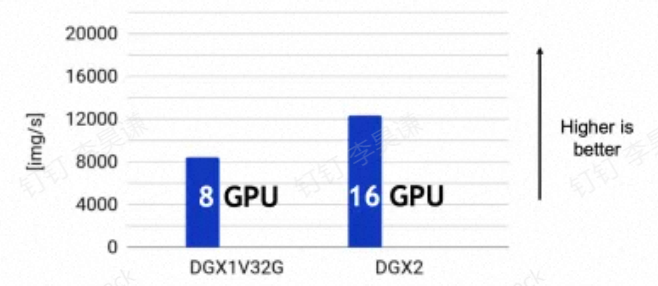
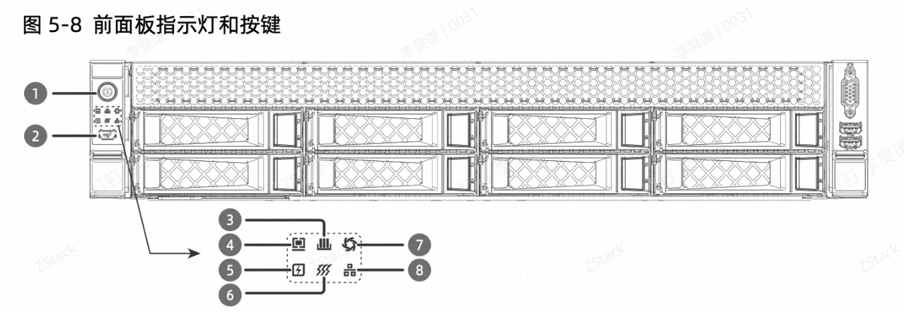

在以往，我们对于配比要求没那么多，主要是看业务对 CPU 有无要求，对存储用量如何，但是对于 GPU 智算业务，一来用户对业务不熟悉，二来引入了 GPU 这一新变量，因此在规划上会更有难度。

#### **推理场景**

首先考察推理场景，一般来说，业务虚拟机使用时 GPU、CPU、内存可以这样配比

**CPU 线程数 = (GPU 数量 \* 4)+2****内存大小 = GPU 显存 \*1.5**

参考这个，假设一个计算节点配了两张 L20，那么至少需要给业务准备 10 个核心和 144GB 内存，此外我们的 kvmagent 等管控大概占用 2~6 个核心、2~4GB 内存，这样的话 CPU 可能会闲置，此时可以考虑在服务器上在跑一些 CPU、低内存业务。

然后再说说网络，考虑到模型文件少则几十 GB，多则几百 GB，因此存储网络推荐 25Gb 好一些，此外按照我们一般的管理、业务、存储来划分的话：

| **名称**                                                    | **基础配置**                   | **推荐配置** | **端口聚合** | **用途**                                                     |
| ----------------------------------------------------------- | ------------------------------ | ------------ | ------------ | ------------------------------------------------------------ |
| **带外管理（IPMI）**                                        | 千兆                           | 千兆         | 无需         | IPMI 管理使用                                                |
| **带内管理（ZStack 管理网）**                               | 万兆（可以考虑电口，兼容千兆） | 25Gb         | 建议         | ZStack 管理节点和计算节点管控（持续流量数 MB/s）             |
| ZStack 管理节点数据库同步（持续流量数 MB/s）                |                                |              |              |                                                              |
| 虚拟机迁移（短时流量可达到数百 MB/s）                       |                                |              |              |                                                              |
| 虚机镜像下发（短时流量可达数百 MB/s，只有本地存储需要考虑） |                                |              |              |                                                              |
| 容器镜像同步与下发（短时流量可达数百 MB/s）                 |                                |              |              |                                                              |
| **存储网络**                                                | 万兆                           | 25Gb         | 建议         | 虚拟机、容器访问存储访问存储的网络，例如以太网（分布式存储网关、iSCSI）、FC 网络（本地存储不需要） |
| 存储同步网络（分布式存储）                                  |                                |              |              |                                                              |
| 存储恢复网络（分布式存储），资源充裕的话可以单独配置        |                                |              |              |                                                              |
| **备份网络**                                                | 万兆                           | 25Gb         | 根据业务要求 | 如果业务有灾备需求，建议单独配置灾备网络，考虑到备份往往数据量较大，建议 10Gb 起步 |
| **业务内网**                                                | 万兆                           | 根据情况配置 | 建议         | 根据业务情况配置，平台没有特殊要求，如果业务有比较大的流量（例如图片、视频的生成）那么可能需要更大的带宽，否则万兆即可 |
| **互联网出口**                                              | 200Mbps                        | 多多益善     | 根据业务要求 | 如果是做一些科研、探索、新模型尝试，建议更大的互联网出口，不然模型下载、数据下载会花掉大量的时间（例如智源新开源的数据集规模为 3.4TB） |

和我们以往的配置相比，主要是带内**建议用更大的带宽，因为实例内存、镜像体积普遍非常大**，如果有资源专门规划网络也可以独立出来，如果和管理网合并那么需要较大的带宽确保虚拟机迁移、虚拟机与容器镜像下发的速度等。

另外如果有一定的**新模型的尝试、体验的需求的话，需要注意互联网出口的带宽**，方便模型的下载、同步。

再看下存储，用户可能会选择：

- NFS（专门或者分布式存储提供）
- SAN 存储
- 分布式存储

这几种情况下 ZStack AIOS 都是可以运行、使用的，如果有独立的 NFS 的话就不需要我们自行搭建 NFS 或者 ZDFS。

关于容量，可以把运行一个大模型所需的存储资源设计为 500GB 左右（实际在 150～300GB 左右，留有一些冗余），那么运行 20 个模型就是 10TB，以此类推。

关于性能，推理场景对于存储性能的需求不会特别苛刻，大文件小文件都有，其中模型文件是大文件，推理代码（lib 库）文件会有一定的小文件，但性能不会非常致命，因此一**般的混闪存储即可满足**，如果存储带宽大、IOPS 高体验会更好一些。如果使用本地存储，建议使用 SSD，资源非常非常紧张的话，可以采用较好的 Raid 卡，但需要注意的是容器需要较好的存储，因此可以给容器准备单独的 SSD。

如果觉得这些配比、建议过于复杂，**一会儿看到** [ZStack AIOS 实问实答](https://alidocs.dingtalk.com/i/nodes/Gl6Pm2Db8D3mGnlZiXyZRZgDJxLq0Ee4?utm_scene=team_space&iframeQuery=anchorId%3Duu_m0z5x7wkexczczgjqxo) **里面会有比较多的案例**式介绍，会简单一些，但对于售前同事还是需要“知其然更知其所以然”。

#### **训练场景**

简单来说，训练场景的要求更一些，GPU、CPU、内存可以这样配比：

**CPU 线程数 = GPU 数量 \* (4~8)****内存大小 = GPU 显存 \* (1.5~2)**

参考这个，假设一个计算节点配了八张 H20，那么至少需要给业务准备 34 个核心和 1.1TB 内存，建议准备 64 核心和 1.5TB 内存。

训练场景下 CPU 可能非常重要！尽管 CPU 并不直接参与深度学习模型计算，但 CPU 需要提供大于模型训练吞吐的数据处理能力。比如，一台 8 卡 NVIDIA V100 的 DGX 服务器，训练 ResNet-50 ImageNet 图像分类的吞吐就达到 8000 张图像/秒，而扩展到 16 卡 V100 的 DGX2 服务器却没达到 2 倍的吞吐，说明这台 DGX2 服务器的 CPU 已经成为性能瓶颈了。

我们通常为每块 GPU 分配固定数量的 CPU 逻辑核心。理想情况下，模型计算吞吐随 GPU 数量线性增长，单 GPU 的合理 CPU 逻辑核心数分配可以直接线性扩展到多 GPU 上。每块 GPU 应配备至少 4~8 核心的 CPU，以满足多线程的异步数据读取。分配更多的核心通常不会再有很大的收益，此时的数据读取瓶颈通常源于 Python 的多进程切换与数据通信开销（如使用 PyTorch DataLoader)。

下面看下网络，和推理的主要区别是：

需要更大的存储带宽来做检查点的保存

需要专门的 GPU 互联网络来做 GPU 多机并行计算

需要更大的互联网带宽来下载数据、同步模型

| **名称**                                                    | **基础配置** | **推荐配置** | **端口聚合** | **用途**                                                     |
| ----------------------------------------------------------- | ------------ | ------------ | ------------ | ------------------------------------------------------------ |
| **带外管理（IPMI）**                                        | 千兆         | 千兆         | 无需         | IPMI 管理使用                                                |
| **带内管理（ZStack 管理网）**                               | 万兆         | 25Gb         | 建议         | ZStack 管理节点和计算节点管控（持续流量数 MB/s）             |
| ZStack 管理节点数据库同步（持续流量数 MB/s）                |              |              |              |                                                              |
| 虚拟机迁移（短时流量可达到数百 MB/s）                       |              |              |              |                                                              |
| 虚机镜像下发（短时流量可达数百 MB/s，只有本地存储需要考虑） |              |              |              |                                                              |
| 容器镜像同步与下发（短时流量可达数百 MB/s）                 |              |              |              |                                                              |
| **存储网络**                                                | 25Gb         | 100Gb 或更高 | 建议         | 虚拟机、容器访问存储访问存储的网络，例如以太网（分布式存储网关、iSCSI）、FC 网络（本地存储不需要） |
| 存储同步网络（分布式存储）                                  |              |              |              |                                                              |
| 存储恢复网络（分布式存储），资源充裕的话可以单独配置        |              |              |              |                                                              |
| **备份网络**                                                | -            | -            | -            | 训练场景为离线业务，核心数据是训练代码和训练 checkpoint，在平台侧做备份比较低效，一般存储侧保障好数据安全即可 |
| **GPU 互联网络**                                            | 4*100Gb      | -            | 无需         | GPU 多机并行计算时的通信互联，目前比较常见的配置是 4*100Gb、4*200Gb、8*100Gb、8*200GB、8*400Gb 等 |
| **业务内网**                                                | -            | -            | -            | 训练场景本身其实业务网络就是 GPU 互联用，如果还需要和其他业务互联的话可以配置业务网络，配置看业务需求 |
| **互联网出口**                                              | 1Gbps        | 多多益善     | -            | 训练模型涉及公共数据、外部数据的下载、传输，数据下载会花掉大量的时间（例如智源新开源的数据集规模为 3.4TB），此外还可能需要备份、上传 Checkpoint、下载测试模型等，互联网带宽 1Gbps 起步，多多益善 |

再看下存储，一般来说存储使用本地+分布式（可能是标准的分布式存储，也可能是分布式并行文件系统）或者本地+集中式存储（集中式的 NFS 或 SAN 等）或者纯本地

为什么都总会带一个本地？详细可以参考 [ZStack x AI/GPU/大模型](https://alidocs.dingtalk.com/i/nodes/G1DKw2zgV2RXneo3CAvgkxy4VB5r9YAn?utm_scene=team_space&iframeQuery=anchorId%3Duu_lu9xq7zcgst3s60fwae) 因为 AI 训练时往往需要不断保存 Checkpoint，每个 Checkpoint 大小约等于 GPU 显存大小，为了减少 Checkpoint 的时间，使用本地存储是性价比最高的选择，因此每个服务器至少要有确保完成一次 Checkpoint 的 NVMe，以八卡 H20 为例，就是 8*96GB=768GB，如果要充分使用带宽，那么可以增加 NVMe 数量来提升总带宽，例如 4 个 1.82TB 的 NVMe

为什么还要外接一个存储？因为 3h 一个 Checkpoint 的话，假设训练一周也就是 768GB*8*7=42TB，如果在服务器插 6 块 7.84TB NVMe 的话可以满足，但是无论成本还是接口可能都有挑战，因此再外接一个存储，用于把已经导出到 NVMe 的 Checkpoint 再同步出去性价比会高一些。其容量就是这里所计算的，假设是 4 台服务器组成集群，那么需要 168TB，如果是 8 台，确保 14 天的 Checkpoint，那就是 672TB，以此类推。

### **ZStack AIOS 的典型部署架构是什么样子，如何给预算紧张的客户做规划**

AIOS 最常见的部署模式有两种：

- ZStack Cloud 智算版 + ZStack AI 模型平台，不包含容器，适合用户**硬件比较局促，对云原生没有刚需，应用比较明确**的场景
- ZStack Cloud 智算版 + AI 云原生（Zaku AI 版本，以下简称为容器）+ ZStack AI 模型平台，包含了容器，**适合硬件相对宽松，有明确的 GPU 切割的需求，了解容器概念或者计划往云原生发展**的场景。

#### **不含容器的极简配置**

由于容器本身就需要占据一定的资源（具体资源数量在后面介绍），因此对于硬件比较局促（例如只有两台机器，打算先弄个应用看看）可以考虑 ZStack 双管理节点 All in one + 本地存储的模式。

​    **<此处加图>**

首先我们帮用户规划一下 GPU，这里以需要搭建一个知识库应用为例。

**GPU**

首先计算 GPU 的用量：

|                        | **推荐模型**                                                 | **所需显存**                                      |
| ---------------------- | ------------------------------------------------------------ | ------------------------------------------------- |
| **大语言模型（必须）** | Qwen2-72B-Int4 （如果有更宽松的预算可以用无量化版本、Int8 量化版本） | 96GB（RAG 需要较长的上下文，建议 96GB，越多越好） |
| **向量模型（必须）**   | BAAI/bge-large-zh-v1.5                                       | 2GB                                               |
| **重排序模型（必须）** | BAAI/bge-reranker-large                                      | 4GB                                               |

可以看到至少 102GB 显存是需要的，那么需要至少 3 张 48GB GPU，或者还需要进一步压缩成本的话就选择两个 48GB GPU，一个 24GB GPU。

**CPU**

运行三个模型需要 10+6+6=22 核心，一个知识库应用建议 10c，应用加起来占用 32 核心（线程）。

此外需要给平台预留 16 核心，因此一共需要 48 核（线程）。

**内存**

（96+2+4）*1.5+4=157GB（向量模型和重排序模型系统各预留 2GB），知识库应用建议 16GB，加起来占用 173GB，加上平台预留 32GB，一共需要 205GB，向上取整，建议 256GB 或更多。 

**硬盘**

根据  [ZStack x AI/GPU/大模型](https://alidocs.dingtalk.com/i/nodes/G1DKw2zgV2RXneo3CAvgkxy4VB5r9YAn?utm_scene=team_space&iframeQuery=anchorId%3Duu_lz7z4wn8lue7oqhi0p9)业务使用 1TB 存储一般足够，加上平台预留 120GB 存储，AI 模型平台保留 1TB，2.5TB 就够了。

算下来，部署平台（不带容器）加上一个 RAG 知识库应用，累计需要：102GB 显存、48 核 CPU、205GB 内存。

不考虑高可用的话，CPU、内存的用量都还好，但是由于 102GB 显存需要两张 A100 或者 3 张 L20，而 A100 用在推理场景不是很划算，因此结合高可用的考虑，实际使用两台 GPU 服务器会好一些。那么对应配置“呼之欲出”：

| **项目**   | **配置**                  | **说明**                                        |
| ---------- | ------------------------- | ----------------------------------------------- |
| **服务器** | 2U                        | 2U 服务器安装、运维比较便捷                     |
| **CPU**    | 2*5318Y 共 48 核 96 线程  | 如果不部署其他业务，使用 4310 也可              |
| **内存**   | 8*32GB DDR4 共 256GB      | 如果还需要部署其他业务，那么可以再加内存        |
| **系统盘** | 2*480GB SATA SSD          | -                                               |
| **数据盘** | 2*1.6TB SATA SSD          | 本地存储，另外可能会部署一个 NFS 来运行模型平台 |
| **网卡**   | 2*双口万兆，共 4 个万兆口 | 其中两个万兆口用于管理，两个万兆口用于业务      |
| **GPU**    | 2*L20                     | GPU 直通虚拟机                                  |

#### **包含容器与超融合存储的极简配置**

包含容器、包含超融合存储的话需要三台起步，相比前面的配置，需要考虑 Zaku 和存储的资源占用，所以需要额外增加一些要求：

- **存储**（ZStone）
  - **硬盘**：对于 2U 服务器，安装 GPU 时由于要预留风道，因此可安装的盘位有限，假定两系统盘、两缓存盘，则可安装 4 个数据盘
    
  - **内存**：每个 OSD  需要 （4GB + 缓存分区 GB*1%）的内存，假设一个服务器上 4 块数据盘，使用 480GB 缓存盘，则需要 8.8*4=35.2 GB 内存，此外存储的管控（Mon、Mgr）也需要 16GB 内存，合计 51.2GB
  - **CPU**：每个 OSD 需要 1 个线程，每个 Mon、Mgr  共预留 8 个线程，一共是 12 线程。
- Zaku
  - 硬盘：Zaku 服务