由于 GPU 特别是高端 GPU 的价格高昂，企业常常会有这样的想法：GPU 的利用率往往不是总 100%，**能不能把 GPU 做一下切分，类似于服务器上启动多个虚拟机那样**，每个人分配一部分来使用，岂不是可以**大大提升 GPU 的利用率**？

然而现实上，GPU 的虚拟化远远落后于 CPU 的虚拟化，其背后有几点原因：

1. 1. GPU **工作方式**与 CPU 的天然不同
2. 2. GPU 的**使用场景**与 CPU 的天然不同
3. 3. 厂家和行业的**发展进程**造成虚拟化进展的不同

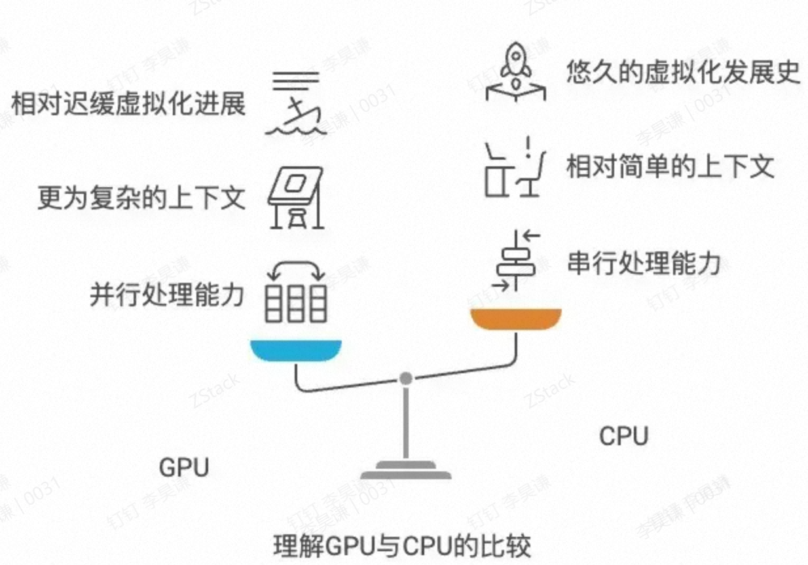

今天我们就从 **GPU 的工作原理**、**几种 GPU 共享的方法**谈起，最终讨论对于大部分企业来说，**AI 时代究竟需要怎样的 GPU 共享**，**如何提升 GPU 的利用率和效率**。

### **1. GPU 的工作原理概述**

1. 1. **高度并行的硬件架构**

   GPU（Graphics Processing Unit）最初专注于图形加速，是一种为大规模数据并行计算而设计的处理器。相较于 CPU 的通用性，GPU 内部包含大量的流处理器（Streaming Multiprocessors/SM 等称呼），能够在单一指令多数据（SIMD，也可以近似理解成 SIMT）的模式下同时执行数百甚至数千个线程。

2. 2. **Context（上下文）与 显存（VRAM）**

   - • **Context**：在 CUDA 编程环境下，如果不同的进程（或容器）要使用 GPU，需要各自拥有自己的 CUDA Context。GPU 会在不同 Context 之间进行**时间片切换**或**合并共享**（如 NVIDIA MPS 合并多个进程到同一个 Context）等模式。
   - • **显存（VRAM）**：GPU 自带的显存容量往往比较固定，同时 GPU 对其管理也区别于 CPU（CPU 主要通过操作系统内核 MMU 进行内存分页等），GPU 常常需要显式地分配显存空间。从下图可以看到 GPU 具有大量的 ALU，同时各自有自己的 Cache 空间：

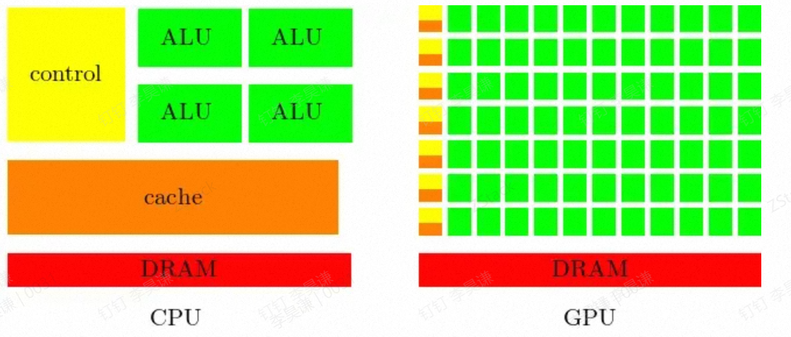

1. 3. **GPU 侧硬件与调度模式**

   - • GPU 上下文切换频率与效率明显比 CPU 要复杂。因为 GPU 往往需要将 Kernel（GPU 端的计算函数）完整运行完才会进行调度切换，不同进程间还需保存并恢复 GPU Context 数据，这比 CPU 上下文切换的代价大。
   - • GPU 资源包括两个主要维度：**算力**（对应流处理器、SM 等）与**显存**。GPU 在实际使用中既要考虑算力是否占满，也要考虑显存是否充足。

### **2. GPU 共享技术落后于 CPU 共享的原因**

1. 1. **CPU 虚拟化成熟且指令集与硬件支持完善**

   CPU 上的虚拟化（如 KVM、Xen、VMWare 等）已经发展了数十年，硬件层面（Intel VT-x、AMD-V）也对虚拟化提供了大量支持。CPU 的上下文较为简单，且硬件厂商和虚拟化厂商之间已经深度合作。

2. 2. **GPU 的高并行与上下文切换成本高**

   由于 GPU 上下文切换（Context Switch）的复杂度和代价明显高于 CPU，想要在 GPU 上做“共享”时，需要灵活地处理不同进程对 GPU 并发访问、对显存的争抢、内核态闭源驱动的兼容适配等问题。对于 GPU 这种数百乃至数千个内核的软硬件协作，厂商难以像 CPU 一样在指令集层面做完整的硬件虚拟化抽象，或需要相当长的演进过程才能做到。（下图为 GPU 上下文切换示意图，可以看到上下文切换造成了非常高的延时）

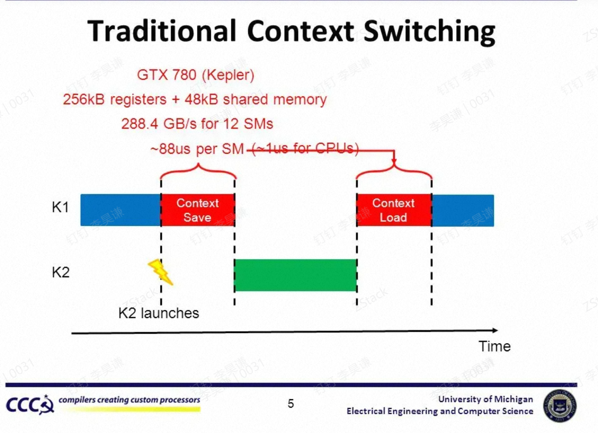

1. 3. **场景需求差异**

   CPU 常见地为大规模多用户虚机、容器做共享，且大部分使用场景对 CPU 效率要求较高，但绝对不会像深度学习训练那样激烈调用数千线程进行矩阵乘法或卷积操作。GPU 的训练与推理等场景中，往往希望最大化利用 GPU 的峰值算力，一旦进行虚拟化或者共享，会出现**上下文切换开销**与**资源 QoS 保证**的冲突问题，因而存在各种技术上的割裂。

2. 4. **厂商之间的差异性**

   目前 CPU 厂商相对比较集中，海外主要以 Intel、AMD 为主，均为 **x86 架构**，而国内厂商主要也是 **X86（或 C86）**、**ARM** 居多，个别厂商采用 **LoongArch** 等自有指令集。但 GPU 厂商的差异度非常大，至少可以分为 **CUDA 流派**、**CUDA 兼容流派**、**ROCm 流派**以及包含 **CANN** 架构在内的各种**自有生态流派**，导致生态的割裂性较重。

综合来看，这些原因导致 GPU 共享技术一直落后于 CPU 虚拟化的成熟度与灵活性。

------

## **二、常见 GPU 共享方式的优缺点与适用场景**

综合来看，可将 GPU 共享的主要思路大致分为以下几类（名称可能不同，但原理类似）：

1. 1. **vGPU（基于硬件/内核态/用户态的多种实现，如 NVIDIA vGPU、AMD MxGPU、内核态 cGPU/qGPU 等）**
2. 2. **MPS（Nvidia Multi-Process Service，合并 Context 方案）**
3. 3. **MIG（Nvidia 多实例 GPU，A100/H100 等最新架构的硬件隔离）**
4. 4. **CUDA Hook（API 劫持/拦截，如 GaiaGPU 等用户态劫持方式）**

### **1. vGPU**

- • **基本原理**：通过内核层或用户层对 GPU 进行“切分”，将单卡 GPU 虚拟成多个虚拟 GPU（vGPU）实例。Nvidia vGPU、AMD MxGPU 属于官方硬件/软件支持最完善的一类。也有开源方案如 KVMGT（Intel GVT-g）、cGPU、qGPU 等。
- • **优点**：
  - • 可以对算力、显存进行**相对灵活的分配**，能做到“在一块卡上同时跑多个容器或虚机”的效果；
  - • 相对成熟的硬件厂商支持（如 NVIDIA vGPU、AMD MxGPU），在 QoS、驱动维护、行业生态上较为完善；
- • **缺点**：
  - • 一些官方方案（如 Nvidia vGPU）仅支持虚拟机，不支持容器；且**license 成本较高**；
  - • 如果是开源用户态/内核态方案（如 vCUDA、cGPU 等），可能需要**适配不同 CUDA 版本**，安全性和隔离性也不如官方硬件级方案；
- • **适用场景**：
  - • 企业需要 GPU 虚拟桌面、工作站或云游戏等桌面渲染场景；
  - • 多业务并存，想要一定**显存/算力配额隔离**。对 GPU 算力利用率有较高要求；
  - • 需求：对安全隔离有一定需要，但容忍适配和 license 成本；（下图为 vGPU 原理图，可以看到一个物理 GPU 被切割为 3 个 vGPU 并透传到虚拟机）

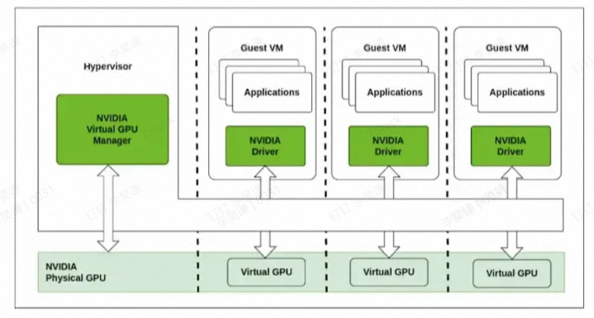

### **2. MPS（Multi-Process Service）**

- • **基本原理**：NVIDIA 官方在 Volta 及之后的架构上提供的一种“**合并 Context**”共享方式。多个进程以 MPS Client 的方式将自己的计算请求合并进同一个 MPS Daemon 的 Context，再由这一个上下文对 GPU 发出命令。
- • **优点**：
  - • 性能更好：不同进程的 Kernel 可以在微观层面交织执行（即 GPU 硬件上尽力并行调度），减少了频繁上下文切换；适合多个小任务同时推理或同一框架内多进程训练初步并行；
  - • 使用**官方驱动**，对 CUDA 版本匹配较好，减少了第三方适配；
- • **缺点**：
  - • **故障隔离差**：若 MPS Daemon 出错或某个任务出错，会**影响所有共享进程**；
  - • 显存没有硬隔离，不同进程之间需要更高一级的调度或管理，否则一个进程内存泄漏可能影响其他；
- • **适用场景**：
  - • 典型的“小算力推理”场景，为了最大化并行吞吐；
  - • 多个小作业打包到同一 GPU（需非常注意故障隔离、显存抢占）；
    （下图为 MPS 的示意图，可以看到两个进程的任务被合并到同一个上下文，在 GPU 内几乎并行运行）
  
  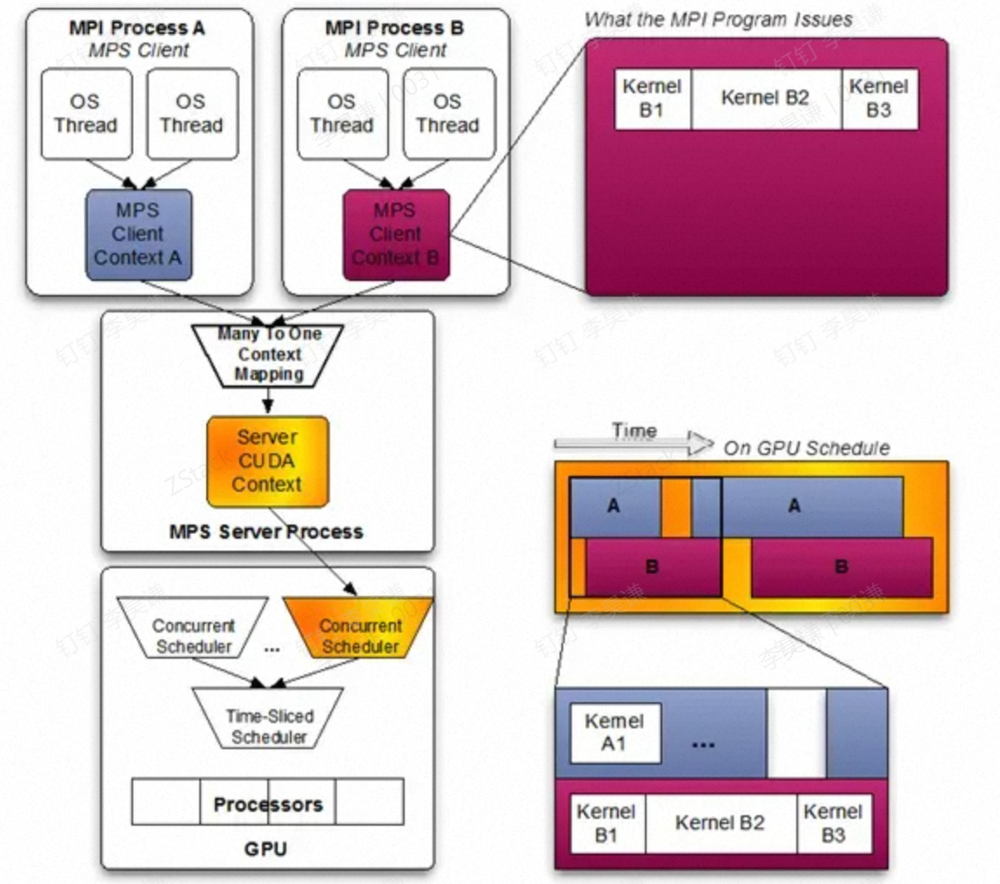

### **3. MIG（Multi-Instance GPU）**

- • **基本原理**：NVIDIA 在 A100、H100 系列等 Ampere 及之后架构增加的硬件级隔离方案。将 GPU 的 SM（流处理器）、L2 Cache、显存控制器等都做**硬件层直接分割**，并可将一块 A100 最多切成 7 个子卡，每个子卡都有较为完整的硬件隔离能力。
- • **优点**：
  - • **隔离度最高**：显存、带宽等资源在硬件维度做切分，各实例之间故障互不影响；
  - • 无需额外的外部 API Hook 或 License（基于 A100/H100 硬件自身特性）。
- • **缺点**：
  - • **灵活性有限**：只能切成有限几个固定的 GPU 实例（如 1g.5gb、2g.10gb、3g.20gb …），一般是 7 个或更少，**粒度较粗**；
  - • A100/H100(或 A30、A16 等新架构)以外的 GPU 不支持；老旧 GPU 无法享受；
- • **适用场景**：
  - • 高性能计算、公有云或私有云中需**多租户**并行且**隔离性**要求极高、分配较为静态；
  - • 多用户共同使用同一台大卡服务器，但每个用户只需要 A100 部分算力且互不干扰；（下图为 **A100 MIG 所支持的 profile**）

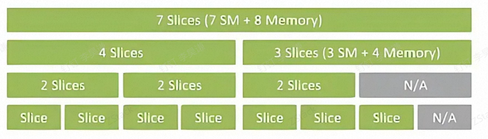

### **4. CUDA Hook（API 劫持/拦截）**

- • **基本原理**：通过修改/劫持 CUDA 动态库（Runtime 或 Driver API），截获应用程序对 GPU 的调用，包括分配显存、提交 Kernel 等，然后在用户态或附加进程中做**资源限制**、调度和统计。
- • **优点**：
  - • **开发门槛相对较低**：不需要内核大规模改动，也无须硬件强支持；对于已有 GPU，兼容性相对更好；
  - • 可以做出更灵活的限速、配额（比如合并调度、统计 GPU 占用再延迟执行 Kernel）；
- • **缺点**：
  - • **故障隔离、性能开销**：由于所有调用都要经过 Hook 进行分析和调度，且必须小心处理多进程情况下的上下文切换；
  - • 对于大规模的训练场景，频繁劫持/插桩带来一定的性能损失；
- • **适用场景**：
  - • 一般是**企业内部**或**明确任务需求**，需要快速“切片”大卡；
  - • 或者开发场景下短时将一张卡给多个小作业跑，提升利用率；

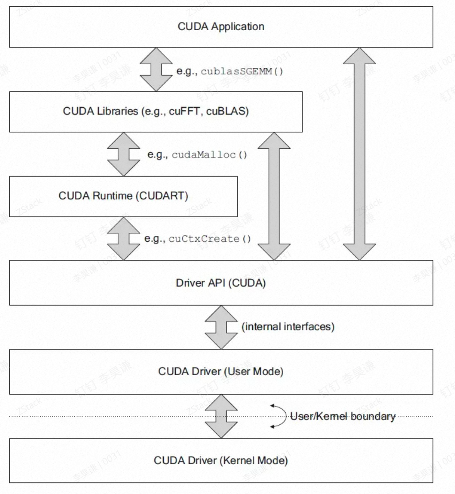

### **5. 远程调用（rCUDA 等）简述**

- • **概念**：远程调用（如 rCUDA、VGL 之类）本质属于 API Remoting，将 GPU 指令在网络上传输给远端服务器执行，再将结果带回本地。
- • **优点**：
  - • 可以让无 GPU 节点也用上 GPU；
  - • 理论上可以对 GPU 进行资源池化。
- • **缺点**：
  - • **网络带宽和延迟**成为短板，效率不高，具体可以参考下面表格 ；
  - • 适配复杂度高，对 GPU 的操作需要转换、打包、拆包，某些高吞吐场景会“得不偿失”。
  - • **适用场景**：
  - • 典型的分布式集群中，某些对网络开销不敏感、小批量计算作业，例如显存使用在几百 MB 以内；
  - • 大多数情况下，如果需要高性能、低延迟，远程调用并不理想。（下图为网络、CPU、GPU 对应带宽数值，直接比较可能不完全准确但可以看到带宽差距，即使 400Gb 网络与 GPU 显存带宽相比也有很大距离）

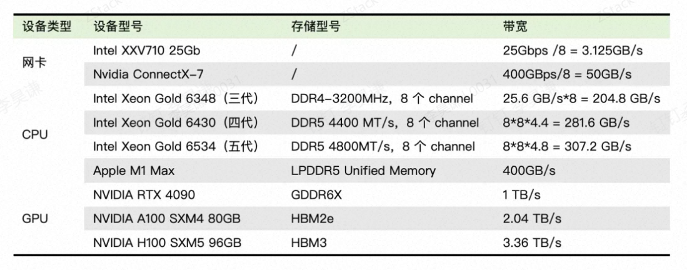

## **三、模型层面的“共享”与 GPU 切割的对比**

随着大语言模型（LLM）如 Qwen、Llama、DeepSeek 等的兴起，模型规模、参数量以及需要的显存占用越来越高。“单卡甚至单机”往往不足以完全装下模型，更别提大批量的推理和训练消耗。因此衍生出基于模型层面的“切分”和“共享”思路，例如：

1. 1.

   **张量并行（Tensor Parallelism）、流水并行（Pipeline Parallelism）、专家并行（Expert Parallelism）**等。

2. 2. **Zero Redundancy Optimizer (ZeRO)** 技术或各种分布式训练框架下的显存优化。

3. 3. **小模型推理场景下，通过切分 GPU 的方式处理多用户请求。**

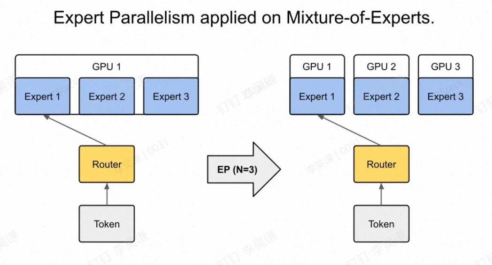

在实际部署大模型时，往往会将一个模型切分到多个 GPU/节点上，以获得更大的总显存和算力。此时，**模型的并行切分**其实就变成了“通过分布式训练/推理框架自身来管理多 GPU 资源”。这在一定意义上是一种更高层次的“GPU 共享”：

- • 当一个模型非常大时，哪怕在单个 GPU 上做分割（vGPU/MIG/MPS 等方式）也无济于事，因为显存容量根本不够。
- • 在大模型 MoE 场景下，为了最大化吞吐，需要更多 GPU 参与调度与路由，**模型本身**就能把算力打满。此时对 GPU 虚拟化或共享的需求反而不迫切，或需求点不在显存切分，而在于多 GPU 间高速互联。

### **哪些情形下适合“模型并行”哪些情形适合“GPU 虚拟化”**

1. 1. **超大模型场景**

   如果单卡显存工作不下，必须要多卡甚至多机分布式并行。这时候，硬件层面的 GPU 切分意义并不大，因为你要的不是把一块物理卡“分”给多任务，而是把更多卡“合”起来支撑一个巨大模型。（下图为张量并行示意，将一个矩阵运算拆分为小矩阵）
   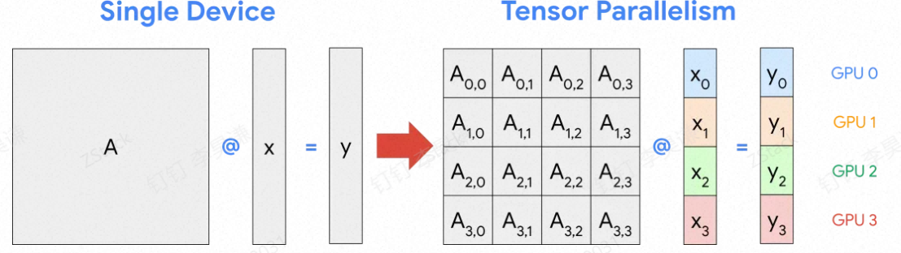

2. 2. **成熟的推理与训练应用**

   在产品级别的大模型推理或训练流水线上，大多已经有一整套多卡并行、批量调度的体系。一旦 GPU 切分或远程调用，会增加额外管理复杂度、降低性能，还不如直接在多卡集群上做分布式训练或推理。

3. 3. **小模型、测试场景**

   对于那些临时测试、小模型应用、或推理批次较小的场景，需要藉由 GPU 虚拟化/共享技术来提升利用率。一块高端 GPU 可能只利用了 10% 的算力或显存，例如运行 Embedding 模型只需要几百 MB 或者几 GB 的显存即可，通过 GPU 切割可以有效提升利用率。

### **是否建议远程调用**

- • 远程调用可能适合某些集群内部简易共享，**但对于大模型推理和训练**这种对延迟和带宽极其敏感的应用，大规模地用网络化 GPU 调用并不现实。
- • 常见生产环境为了**保证推理时延**且**减少开销**，通常不会做远程调用，而是通过**直连 GPU**（整卡或部分切分）来进行调度。远程 GPU 调用导致的通信延迟会大幅影响吞吐与响应。

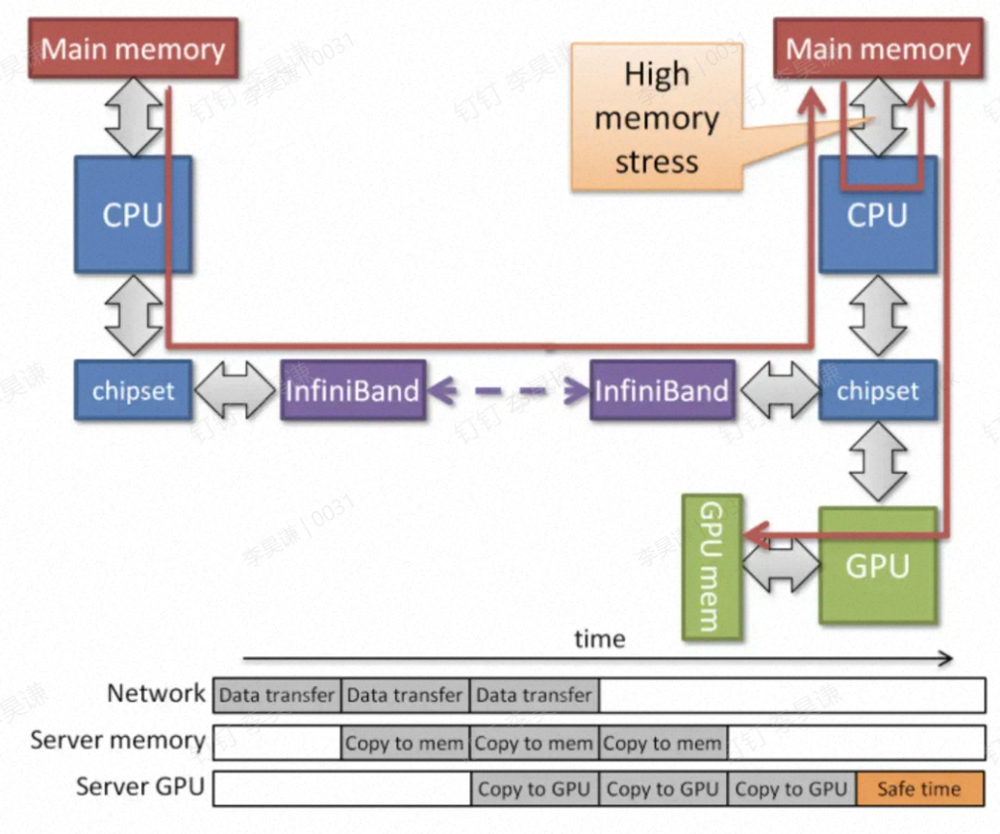

------

## **四、总的建议与结论**

1. 1. **大模型或需要高性能的应用**

   - • 单卡显存肯定不足时，**应该依赖模型本身的分布式并行**（如张量并行、流水并行、MoE 等），让 GPU 资源在更高层次进行 “合并” 式利用，而非在物理卡层面“切分”。这样可以最大化性能、避免过多的上下文切换损失。
   - • 远程调用（rCUDA 等）不建议在此场景大量使用，除非在特殊网络架构下（非常高速低延迟）且对性能要求不高。

2. 2. **在 GPU 利用率不足的小模型测试场景**

   - • 虚拟机上考虑使用 **MIG**（如在 A100/H100 上）、**vGPU**（如 NVIDIA vGPU 或开源 cGPU/qGPU），把大卡分给多个并行任务使用；或者**在容器利用 CUDA Hook 方案**做灵活限额，提升资源使用率。
   - • 要注意故障隔离和性能开销。如果是对 QoS 与稳定性要求高，可以优先选择 MIG（隔离度最优）、或官方 vGPU（license 预算充足的前提下）。
   - • 如果是明确的使用场景或者测试场景，CUDA Hook/劫持类方案部署相对最灵活。

3. 3. **远程调用不适合作为大规模 GPU 共享的主要方式**

   - • 通过 API Remoting 的方式对 GPU 进行虚拟化，会带来明显的网络开销、序列化延迟，除非对延时不敏感，且仅在极少数分布式虚拟化场景中才值得考虑。

------

## **五、总结**

- **GPU 工作原理决定了其共享相比 CPU 有更高的上下文切换代价与隔离难度**。尽管有多种技术路线（vGPU、MPS、MIG、CUDA Hook、rCUDA 等），但都没有像 CPU 虚拟化那样完全通用和成熟。

-  **面向超大模型与实际生产**：当模型体量大（特别是 LLM，需要大显存、大算力）时，往往要做“多卡/多机并行”，即模型本身负责切分，GPU 虚拟化对性能、大显存需求并无本质帮助。

  **此时可以通过私有化的 MaaS 服务共享资源**。

- **面向小模型如嵌入模型、重排序模型**：适合GPU 虚拟化/共享，选择何种技术需要考虑**隔离性、成本、SDK 兼容、运维难易度**。MIG 或官方 vGPU 方案隔离度好，但灵活性有限。MPS 并行能力

- 但故障隔离不佳。CUDA 劫持最灵活，目前采用比较多。

-  **远程调用**（API Remoting）通常不建议在高性能场景中大规模使用，除非网络延迟可控、也只有小负载场景才可能带来收益。

由此可见，若是大语言模型（尤其是极大参数量）场景，最佳实践还是在分布式并行模型（如张量并行、流水线并行）来“共享”与“分配”算力，而不是对单卡再做虚拟化切分。针对于小型模型、多用户测试的情况，可以用 GPU 虚拟化或切割来提高单卡利用率。这样才是有理有据且有策略分层的做法。

但是如何进一步提升 GPU 的效率，如何尽可能的让有限的 GPU 发挥更高的吞吐？

