# 备注

尚未解决的问题

1. 虚拟化存储网络中如何明确自己虚拟磁盘存储空间位置（怎么知道哪部分是自己的）
2. VM exit和VM entry是怎么做的
3. 虚拟机查询地址的每一层是怎么查的，四层页表为什么这么设计
4. 文件系统
5. 虚拟机视角下设备驱动和设备控制器的区别和关系
6. 中断注入

# 什么是虚拟化技术

假设我有台服务器，上面会有这些资源（除了加粗的看一下就行了）：

- **NIC（网络接口控制器，网卡）**
  - 物理 NIC 会被虚拟化层（比如 ZStack 的虚拟化模块、KVM、VMware 的 ESXi）抽象为**虚拟网卡（vNIC）**
  
- **CPU（中央处理器）**——几核
  - 虚拟化层会根据虚拟机的配置，为其分配对应的 vCPU 数量，比如给一个业务虚拟机分配 2 核 vCPU
  
- **Disk（磁盘存储设备）**

  - 物理 Disk（HDD/SSD）会被虚拟化层抽象为**虚拟磁盘（Volume）**

- **Memory（内存）**——几G

  - 物理 Memory 的存储资源会被虚拟化层抽象为虚拟内存

  - 虚拟化层会为每个虚拟机分配指定大小的虚拟内存，虚拟机运行时的数据会暂时保存在虚拟内存中
  - 虚拟化层会负责管理物理内存和虚拟内存之间的数据交换，当虚拟机的虚拟内存不足时，虚拟化层会把部分暂时不用的数据交换到物理磁盘上（虚拟内存交换区）

我现在想出租我的服务器，比如租给A，那我只需要装一个os，然后他就可以ssh连上去跑他的应用程序了

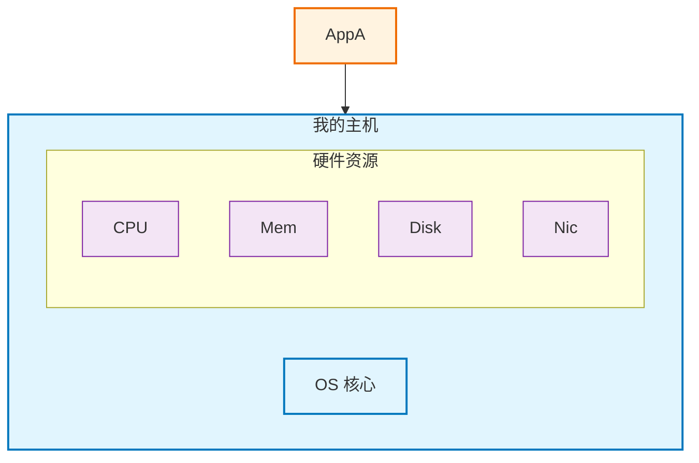
```mermaid
graph TD
    subgraph OS_Container ["我的主机"]
        subgraph Resource_Layer ["硬件资源"]
            B["CPU"]
            C["Mem"]
            D["Disk"]
            E["Nic"]
        end
        A["OS 核心"]
    end
    
    F["AppA"] --> OS_Container

    %% 样式设置
    classDef os_fill fill:#e1f5fe,stroke:#0277bd,stroke-width:2px
    classDef resource_fill fill:#f3e5f5,stroke:#7b1fa2,stroke-width:1px
    classDef app_fill fill:#fff3e0,stroke:#ef6c00,stroke-width:2px

    class OS_Container,A os_fill
    class B,C,D,E resource_fill
    class F,G app_fill
```

现在，我发现他的这个程序占用我CPU的20%，内存的30%，所以我打算再租给B

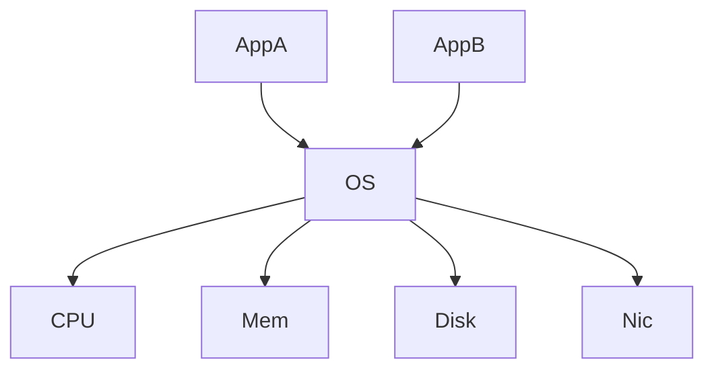
```mermaid
graph TD
    A[OS] --> B[CPU]
    A --> C[Mem]
    A --> D[Disk]
    A --> E[Nic]
	F[AppA]-->A
	G[AppB]-->A
```

但是在这种情况下会遇到一些问题：

- A B的依赖版本可能不一样
- A B谁崩了或者造成系统资源死锁可能会影响到别人

因此这时候，我们就很自然的想到去给他们运行单独的环境，让他们在实际使用物理资源的同时，理论上运行在不用的环境中——云虚拟化是一种将**物理**的计算、存储、网络等**硬件资源**，通过抽象、隔离、封装的技术手段，转化为可以灵活分配、调度、使用的虚拟资源池，以此为用户提供弹性、可扩展的云计算服务的技术。

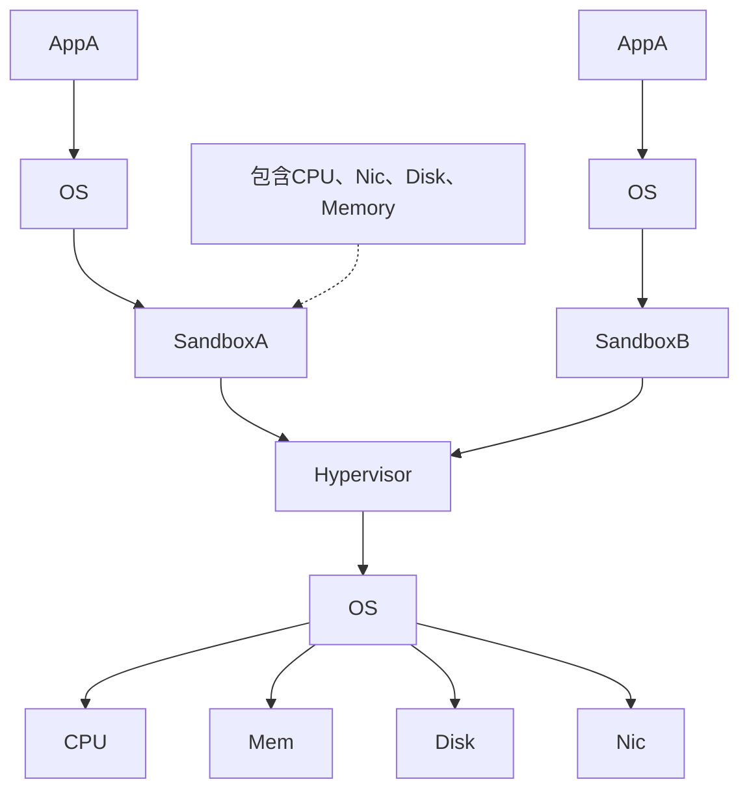
```mermaid
graph TD
    A[OS] --> B[CPU]
    A --> C[Mem]
    A --> D[Disk]
    A --> E[Nic]
	F[Hypervisor]-->A
	G[SandboxA]-->F
	H[SandboxB]-->F
	I[OS]-->G
	J[OS]-->H
	K[AppA]-->I
	L[AppA]-->J
	M[包含CPU、Nic、Disk、Memory]-.->G
```

上面的是一个逻辑上的一台主机的分包关系，下面是我理解中的分配关系（一台物理机就是宿主机，两台虚拟机的简单逻辑关系）：

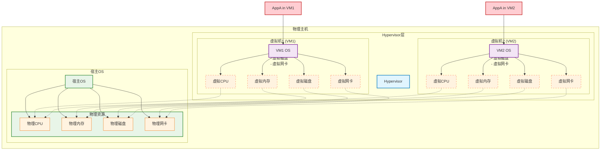
```mermaid
graph TD
    subgraph Physical_Host ["物理主机"]
        subgraph Host_OS ["宿主OS"]
            A["宿主OS"]
            subgraph Host_Resource ["物理资源"]
                B["物理CPU"]
                C["物理内存"] 
                D["物理磁盘"]
                E["物理网卡"]
            end
            A --> B
            A --> C
            A --> D
            A --> E
        end

        subgraph Hypervisor_Layer ["Hypervisor层"]
            F["Hypervisor"]
            
            subgraph SandboxA ["虚拟机1 (VM1)<br/>- 虚拟CPU<br/>- 虚拟内存<br/>- 虚拟磁盘<br/>- 虚拟网卡"]
                I["VM1 OS"]
                I --> CPU1["虚拟CPU"]
                I --> MEM1["虚拟内存"]
                I --> DISK1["虚拟磁盘"]
                I --> NIC1["虚拟网卡"]
                
                %% 虚拟资源映射到物理资源
                CPU1 -.-> B
                MEM1 -.-> C
                DISK1 -.-> D
                NIC1 -.-> E
            end

            subgraph SandboxB ["虚拟机2 (VM2)<br/>- 虚拟CPU<br/>- 虚拟内存<br/>- 虚拟磁盘<br/>- 虚拟网卡"]
                J["VM2 OS"]
                J --> CPU2["虚拟CPU"]
                J --> MEM2["虚拟内存"]
                J --> DISK2["虚拟磁盘"]
                J --> NIC2["虚拟网卡"]
                
                %% 虚拟资源映射到物理资源
                CPU2 -.-> B
                MEM2 -.-> C
                DISK2 -.-> D
                NIC2 -.-> E
            end
        end
    end

    K["AppA in VM1"] --> I
    L["AppA in VM2"] --> J

    %% 样式设置
    classDef physical_fill fill:#e8f5e8,stroke:#388e3c,stroke-width:2px
    classDef hypervisor_fill fill:#e1f5fe,stroke:#0277bd,stroke-width:2px
    classDef vm_fill fill:#f3e5f5,stroke:#7b1fa2,stroke-width:2px
    classDef resource_fill fill:#fff3e0,stroke:#ef6c00,stroke-width:1px
    classDef app_fill fill:#ffcdd2,stroke:#c62828,stroke-width:2px
    classDef mapping stroke-dasharray: 5 5,stroke:#ff6b35

    class A,Host_Resource physical_fill
    class F hypervisor_fill
    class I,J vm_fill
    class CPU1,MEM1,DISK1,NIC1,CPU2,MEM2,DISK2,NIC2,B,C,D,E resource_fill
    class K,L app_fill
    class CPU1,MEM1,DISK1,NIC1,CPU2,MEM2,DISK2,NIC2 mapping

```

下面我们明确一下云主机、虚拟机、宿主机、物理机的关系再接着进行

```
[物理世界]
└── 宿主机（物理服务器）
    └── Hypervisor（虚拟化层，如 KVM）
        ├── 虚拟机 1（VM1）
        ├── 虚拟机 2（VM2）
        └── ……
            └── 其中某一台被你租用 → 这就是你的「云主机」
```

# CPU虚拟化

首先我们简单看一下现有的CPU架构类型

| CPU 架构类型        | 所属厂商                              | 指令集                   | 主流产品系列                                                 | 核心特点                                                   | 主要适用场景                                                 |
| ------------------- | ------------------------------------- | ------------------------ | ------------------------------------------------------------ | ---------------------------------------------------------- | ------------------------------------------------------------ |
| **x86-64（AMD64）** | Intel、AMD                            | CISC（复杂指令集）       | Intel：酷睿、至强；AMD：锐龙、霄龙                           | 生态完善，软件兼容性极强，单线程性能表现优异，技术成熟度高 | 个人消费级电脑（台式机、笔记本）、通用服务器、工作站         |
| **ARMv8/ARMv9**     | ARM（授权）、高通、苹果、华为、联发科 | RISC（精简指令集）       | 苹果：M 系列芯片；高通：骁龙、霄龙；华为：鲲鹏；联发科：天玑 | 能耗比高，发热量低，可扩展性强，适合多核并行计算           | 智能手机、平板电脑、轻薄本、边缘计算设备、低功耗服务器、嵌入式设备 |
| **RISC-V**          | 开源生态（SiFive、赛昉等）            | RISC（精简指令集，开源） | SiFive：Freedom 系列；赛昉：昉・星光系列                     | 完全开源无授权限制，架构灵活可定制，研发成本低             | 嵌入式设备、物联网设备、小众的边缘计算设备、科研 / 定制化计算场景 |
| **PowerPC**         | IBM                                   | RISC（精简指令集）       | IBM：Power 系列                                              | 多线程并行性能出色，稳定性强，容错能力高                   | 大型服务器、企业级工作站、部分高性能计算场景                 |

以典型的x86架构为例子，通常针对不同用户执行的操作也有不同（比如root权限可以执行所有指令，其他用户执行部分指令、远程用户只能ping或者获取一些开放资源等等）

```text
ring3---UserApp
ring2
ring1
ring0---HostOS（可以操作所有物理资源）

CPU
```

## 敏感指令

虚拟化相当于是共享经济，现在如果我租把这个服务器共享给了A，那么理论上应该是这样的

```text
ring3---UserApp
ring2
ring1
ring0---HostOS VmOsA

CPU
```

但是这时候有一个问题就是，如果A执行了一个命令，修改了一个HostOS正在使用的寄存器，就会明显影响到别人的使用

因此，识别这样的**“敏感指令”**就至关重要了，我们尝试使用下面这样的架构

```
ring3---UserApp
ring2
ring1---VmOsA---|
ring0---HostOS VMM 

CPU
```

- VmOsA在上面一层，执行的命令会先发给Vmm，经过识别之后再交给CPU（**VMM（Virtual Machine Monitor）**，也称为 **Hypervisor（虚拟机监视器）**，是负责创建、运行和管理虚拟机（VM）的核心软件层）

然后这一招在x86架构上是行不通的，因为有一些敏感指令可以绕开这种操作

- **`POPF`（Pop Flags）**: 
  - 从栈中弹出一个字到 `EFLAGS` 寄存器，**可以修改中断标志 IF、方向标志 DF 等**
  - 问题：`POPF` **不是特权指令**！即使在 ring 3 也能执行。如果 Guest OS（运行在 ring 1）执行 `POPF` 关闭中断（清 IF 位），**CPU 真的会关闭中断**！但 VMM **完全不知道**，因为没有 trap 发生。结果：整个系统（包括其他 VM 和宿主机）可能因中断被禁而死锁。

- **`SMSW`（Store Machine Status Word）**：
  - 读取控制寄存器 `CR0` 的低 16 位（包含 PE、MP、EM、TS、ET、NE、WP、AM、NW、CD 等标志）。
  - 敏感性：`CR0` 是核心系统寄存器，反映 CPU 是否处于保护模式等关键状态。
  - 问题：`SMSW` **可以在任何特权级执行**（非特权指令）。Guest OS 可以直接读取真实的 `CR0` 值，**发现它不在裸机上运行**（比如某些位不符合预期），从而检测到虚拟机存在。更严重的是，如果 VMM 没有虚拟化 `CR0`，Guest 可能基于错误信息做出错误决策。

因此，VmWare使用动态二进制翻译的技术绕过这个问题

## 动态二进制翻译

**动态二进制翻译（Dynamic Binary Translation, DBT）** 是一种在程序运行时，将源指令集（如 x86）的代码**实时翻译**成目标指令集（可以是同一架构的优化形式，也可以是不同架构）并执行的技术。在 **x86 虚拟化早期**（在 Intel VT-x / AMD-V 出现之前），DBT 是实现**全虚拟化（Full Virtualization）** 的关键技术，尤其用于解决 x86 架构中“敏感但非特权指令”无法被 VMM 拦截的问题。

```
ring3---UserApp
ring2
ring1---VmOsA-----------------|(指令到达DBT之前是二进制形式)
					 		  |
ring0---VMM-（敏感指令交给VMM）-DBT（在这里先翻译成指令集，然后判断不是敏感指令再下发）
							  |
CPU---------------------------|（非敏感指令）
```

我们简单讲一下对于敏感指令的操作

- VMos下发了一个写寄存器的重要操作
- DBT识别出之后交给VMM
- VMM替换：VMM不会写进去，而是存在自己这里，等需要查询或者操作的时候再识别出来，然后给数据返回去

我们可以提炼出原理：

- VMM 在运行时扫描 Guest 代码；
- 将包含敏感指令的基本块**重写**，替换为调用 VMM 模拟函数的代码；
- **缓存翻译结果**以提升性能。

## 全虚拟化

这是早期的CPU虚拟化，被称为**全虚拟化（Full Virtualization）**——在不修改客户操作系统（Guest OS）的前提下，让它像运行在真实物理硬件上一样正常工作。

但是，在上面全虚拟化的操作中，我们一直基于一个核心目的来执行——骗虚拟机，让它以为自己在真机上运行。然而，这样的操作其实对于用户而言是无所谓的，而捕捉的方式一定程度上存在漏捕和性能消耗等。那么我们能不能想到一种方法，团结虚拟机操作系统，让它主动配合主动告知我们敏感指令呢？

## 半虚拟化

**半虚拟化（Paravirtualization，简称 PV）** 是一种虚拟化技术，其核心思想是：

> **通过修改客户操作系统（Guest OS）的内核，使其“主动配合” VMM（虚拟机监视器），用高效、明确的接口（hypercall）替代那些难以虚拟化的敏感指令，从而提升性能和简化 VMM 设计。**

与“全虚拟化”不同，半虚拟化**不要求硬件完全模拟真实机器**，而是让 Guest OS **知道自己运行在虚拟环境中**，并与其协作。

```
GuestOs----|（执行敏感指令是主动调用）
		   |
VMM    Hypercall(提供一套向上的接口)
```

**Hypercall（超级调用）**： 类似系统调用（syscall）工作流程如下

1. Guest 内核通过 `hypercall` 向 VMM 请求服务，例如：

   - “请帮我更新页表”

   - “我要发送一个网络包”

   - “设置定时器中断”

   ```c
   // 伪代码：Guest 内核发起 hypercall
   hypercall(HC_update_page_table, virtual_addr, pte);
   ```

2. **去除或替换敏感指令**

   - 原本会执行 `MOV CR3, %rax`（切换页表）的地方，改为调用 `hypercall`；
   - VMM 在安全上下文中完成实际操作，并维护虚拟到物理的映射。

3. **共享内存与事件通道**

   - VMM 与 Guest 通过**共享内存页**传递数据（如网络包、磁盘 I/O）；
   - 使用**事件通道（event channel）** 通知中断（代替物理中断）。

这个方案存在一个问题——兼容性，因为这个方案要回答的问题就是“问什么操作系统厂商要配合？”
对于一些开源代码，如Linux，可以通过修改其中敏感指令的代码来生成适合虚拟化的发行版，但是对于Windows这种闭源厂商，这样的方案在兼容性上就回遇到问题。而这个方案上，我们是希望操作系统来配合我们，那么CPU呢？可以获得CPU的配合吗？

## 硬件辅助虚拟化技术   

**硬件辅助虚拟化技术** 是现代 CPU 为解决传统软件虚拟化（尤其是 x86 架构）性能和正确性问题而引入的**专用硬件扩展**。它通过在处理器内部增加新的执行模式、控制结构和指令，使 VMM（虚拟机监视器）能够高效、安全地管理虚拟机，从而实现高性能的**全虚拟化（Full Virtualization）**。

- **代表**：Intel VT-x（2005）、AMD-V（2006）
- **现代应用**：KVM、Hyper-V、VMware ESXi、Xen（HVM 模式）均依赖此技术。

这个方案是基于两种权限状态转化来实现的——Root模式和Non-Root模式（注意：虚拟机永远不能进入 Root 模式，所说的状态转化都是指的VMM）

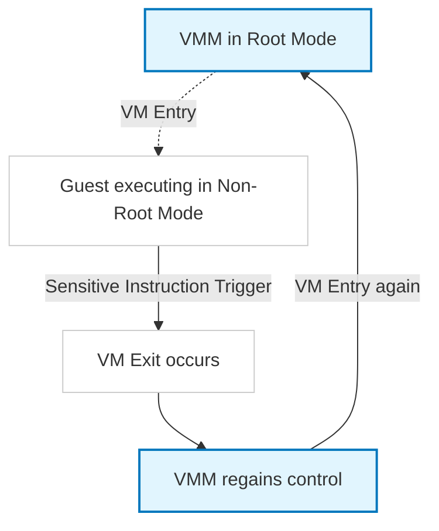
```mermaid
graph TD
    A[VMM in Root Mode] -.->|VM Entry| B[Guest executing in Non-Root Mode]
    B -->|Sensitive Instruction Trigger| C[VM Exit occurs]
    C --> D[VMM regains control]
    D -->|VM Entry again| A

    style A fill:#e1f5fe,stroke:#0277bd,stroke-width:2px
    style B fill:#ffffff,stroke:#cccccc,stroke-width:1px
    style C fill:#ffffff,stroke:#cccccc,stroke-width:1px
    style D fill:#e1f5fe,stroke:#0277bd,stroke-width:2px

    classDef trigger fill:#ffebcd,stroke:#ff8c00,stroke-width:2px
    classDef vmm fill:#e1f5fe,stroke:#0277bd,stroke-width:2px

    class B,C trigger
    class A,D vmm
```

- **VMM in Root Mode**：VMM（虚拟机监视器）运行在 Root 模式下，拥有最高权限，可以直接访问物理硬件
- **Guest executing in Non-Root Mode**：客户操作系统运行在 Non-Root 模式下，受到 VMM 的监控和约束
- **VM Entry**：VMM 切换到 Non-Root 模式，让 Guest OS 执行（VMM 主动切换）
- **Sensitive Instruction Trigger**：当 Guest OS 执行敏感指令时（如 MOV CR3、I/O 操作等），触发 VM Exit
- **VM Exit occurs**：CPU 自动从 Non-Root 模式切换回 Root 模式，控制权回到 VMM
- **VMM regains control**：VMM 重新获得控制权，处理事件（如模拟指令、处理 I/O 请求等）
- **VM Entry again**：VMM 再次发起 VM Entry，让 Guest OS 继续执行

## 总结：vCPU到底是怎么实现的

这部分很重要，尤其是下面中断虚拟化部分的学习，请务必在这里弄懂这几组概念的使用

1. VM Entry与Exit的实质是什么（在宿主机上面的表现）
2. vCPU 是怎么实现的
3. Vmm充当了什么角色
4. vCPU什么时候使用CPU，什么时候退出

### VM Entry与Exit的实质

- **VM Entry**：VMM 将控制权交给 Guest，**vCPU 开始在物理 CPU 上运行（进入 Non-Root 模式）**，此时 **Guest 代码直接使用 CPU 执行指令**，但仍在硬件虚拟化机制的监控之下（并非完全“脱离” VMM 管理）。
- **VM Exit**：由于特定事件（如敏感指令、I/O、中断等），**硬件自动将控制权交还给 VMM**，vCPU 的执行被暂停，其状态由 VMM 保存和管理，**等待 VMM 处理完后再决定是否恢复运行**。

**VM Entry = 虚拟机上 CPU 跑起来；VM Exit = 虚拟机被踢下 CPU，VMM 来接管。**

### vCPU 是怎么实现的

vCPU 的本质：

- **vCPU（虚拟 CPU）不是真实的硬件**，而是 VMM（如 KVM、Xen）为每个虚拟机创建的一个 **软件抽象**，代表一个“看起来像 CPU”的执行上下文。
- 每个 vCPU 对应一组 **虚拟的 CPU 状态**（如寄存器、中断状态、控制寄存器等），这些状态保存在内存中。

 如何运行？

- 当调度器决定让某个 vCPU 运行时，VMM 会通过 **VM Entry** 将该 vCPU 的状态加载到 **物理 CPU** 上，然后 Guest 代码就在真实 CPU 上执行。
- 多个 vCPU（来自同一 VM 或不同 VM）**共享物理 CPU 核心**，由宿主机的调度器（如 Linux 的 CFS）**分时交替调度**，就像普通进程一样。
- 一旦发生 **VM Exit**（比如 I/O、中断、特权指令），物理 CPU 就暂停当前 vCPU，切回 VMM，保存 vCPU 状态，再可能去调度另一个 vCPU。

### vCPU实现和两种状态的切换中，Vmm做了什么

在 vCPU 的实现以及 **VM Entry / VM Exit** 状态切换过程中，**VMM（虚拟机监视器）** 扮演了核心的“导演+调度员+翻译官”角色。具体来说，VMM 做了以下几件事：

1. **创建和管理 vCPU 上下文**

   - VMM 为每个 vCPU 分配内存，保存其 **虚拟 CPU 状态**：通用寄存器、控制寄存器（如 CR3）、段寄存器、中断状态、APIC 状态等。

   - 这些状态在硬件中通过 **VMCS（Intel VT-x）** 或 **VMCB（AMD-V）** 数据结构管理。

   举例：KVM 中，`struct vcpu_vmx` 就封装了一个 vCPU 的 VMCS 和相关状态。

2. **执行 VM Entry：把 vCPU “送上”物理 CPU**

   - 当调度器选中某个 vCPU 运行时，VMM：
     - 将该 vCPU 的虚拟状态写入 VMCS/VMCB；
     - 执行 `VMLAUNCH` 或 `VMRESUME` 指令；
     - 触发 **硬件自动切换到 Non-Root 模式**，Guest 代码开始在物理 CPU 上运行。

   此时 VMM 暂时“隐身”，但随时可能被硬件唤回（VM Exit）

3. **处理 VM Exit：接管控制权并模拟特权操作**

   - 当 Guest 执行敏感指令（如 `cli`、`mov to CR3`）、访问 I/O 端口、收到中断等，**硬件自动触发 VM Exit**。

   - CPU 切回 Root 模式，跳转到 VMM 预设的 **VM Exit 处理函数**。

   - VMM 会：
     - **读取退出原因**（Exit Reason）；
     - **模拟对应行为**（如模拟磁盘读写、注入虚拟中断、更新页表等）；
     - **更新 vCPU 状态**（比如设置 RFLAGS、修改 RIP 指向下一条指令）；
     - 决定下一步：继续运行当前 vCPU（再次 VM Entry），还是调度其他 vCPU。

   例如：Guest 执行 `in al, 0x60`（读键盘端口），VMM 捕获后返回模拟的键盘数据。

4. **虚拟中断的注入与管理**

   - 外部中断到来时，VMM 决定是否将其 **重定向给某个 Guest**。

   - 若是，则在下次 VM Entry 前，通过 VMCS 设置 **虚拟中断位（如 RVI、SVI）或 pending interrupt**，让 Guest 在 Non-Root 模式下“看到”中断。

   - 这样 Guest 就能在不触发 VM Exit 的情况下处理中断（配合 APIC 虚拟化或 posted-interrupt 等优化）。

5. **调度与资源协调**

   - VMM（或其宿主机内核部分，如 KVM 的内核模块）将每个 vCPU 视为一个可调度实体（通常是线程）。

   - 利用宿主机 OS 的调度器，在多个 vCPU 之间 **公平/优先级地分配物理 CPU 时间片**。

### vCPU什么时候使用CPU，什么时候退出

| 类型                 | 举例                                                       | 是否由 Guest 指令引起   |
| -------------------- | ---------------------------------------------------------- | ----------------------- |
| **1. 敏感/特权指令** | `in`, `out`, `mov cr3`, `cli`                              | ✅ 是（Guest 主动执行）  |
| **2. 外部事件**      | **外部中断（External Interrupt）**、NMI、异常、INIT 信号等 | ❌ 否（由硬件/外部触发） |

也就是说，中断就是**敏感操作**或者**外部强行干预退出**的。不是中断注入就退出，这个说法不太对（后面就会涉及到这个误区）

# 存储虚拟化

上面我们考虑了CPU的情况，发现一个主机节点还是要有一个CPU的，但是结合我们用电脑的分盘经验来说，要想最大化利用空间，最好的方法就是只用一个磁盘。因此，存储虚拟化就是把所有存储设备结合到一起，然后用网络存储系统让各个虚拟机可以访问到。

**NFS（Network File System，网络文件系统）** 是一种分布式文件系统协议，最初由 Sun Microsystems 在 1984 年开发。它允许客户端计算机通过网络透明地访问远程服务器上的文件，就像访问本地文件一样。

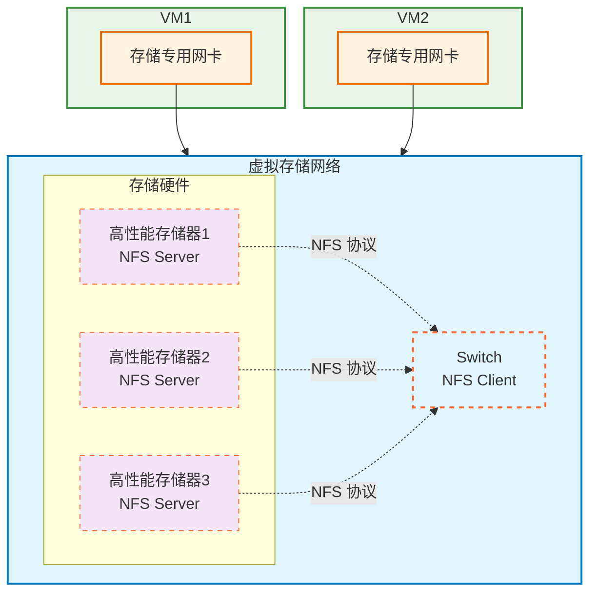
```mermaid   
graph TD
    subgraph OS_Container ["虚拟存储网络"]
        subgraph Resource_Layer ["存储硬件"]
            B["高性能存储器1<br/>NFS Server"]
            C["高性能存储器2<br/>NFS Server"]
            D["高性能存储器3<br/>NFS Server"]
        end
        A["Switch<br/>NFS Client"]
    end

    subgraph VM1 ["VM1"]
        NIC1["存储专用网卡"]
    end

    subgraph VM2 ["VM2"]
        NIC2["存储专用网卡"]
    end

    %% NFS 连接关系
    B -.->|NFS 协议| A
    C -.->|NFS 协议| A
    D -.->|NFS 协议| A

    %% VM 连接到虚拟存储网络
    NIC1 --> OS_Container
    NIC2 --> OS_Container

    %% 样式设置
    classDef os_fill fill:#e1f5fe,stroke:#0277bd,stroke-width:2px
    classDef resource_fill fill:#f3e5f5,stroke:#7b1fa2,stroke-width:1px
    classDef vm_fill fill:#e8f5e8,stroke:#388e3c,stroke-width:2px
    classDef nic_fill fill:#fff3e0,stroke:#ef6c00,stroke-width:2px
    classDef nfs_conn stroke-dasharray: 5 5,stroke:#ff6b35

    class OS_Container,A os_fill
    class B,C,D resource_fill
    class VM1,VM2 vm_fill
    class NIC1,NIC2 nic_fill
    class B,C,D,A nfs_conn

```

一台云主机，通过专用网卡连接到存储网络中。下面我们来根据最开始的结构理一下存储网络所在的位置关系(因为上面我画的图是逻辑上的，不要混淆成物理上的)

- 宿主机配备**多个物理网卡**（或使用 VLAN/SR-IOV/虚拟交换机）：
  - 一个用于**管理流量**（运维、SSH、API）
  - 一个用于**虚拟机业务流量**
  - 一个专用**存储网络**（Storage Network），连接到存储集群
- 虚拟机通过**虚拟网卡（vNIC）** → 映射到宿主机的物理网卡 → 访问存储网络

```
+---------------------+
|      虚拟机 (VM)     |
|  - OS               |
|  - App              |
|  - 虚拟磁盘 (vDisk) | ←──┐
+----------+----------+    │
           | 虚拟网卡       │
+----------v----------+    │
|   宿主机 (物理机)     |    │
|  - Hypervisor       |    │
|  - 物理CPU/内存      |    │
|  - 存储专用网卡 ────────┼──→ 网络
+---------------------+    │
                           ↓
+--------------------------------------------------+
|              集中式存储集群                       |
|  - NFS / Ceph / iSCSI / SAN / 分布式文件系统       |
|  - 提供 VM 的磁盘镜像（qcow2, raw, LUN 等）         |
+--------------------------------------------------+
```

## 虚拟机高可用

 我按照网络的存储方式拆分了以后，有天用户给我发送了投诉邮件，说现在无法访问存储资源（或者其他的情况）。我分析考虑了之后，发现这套系统存在故障应对的问题，也就是在一台机器宕掉之后，如何快速的让用户用上新的主机？

**虚拟机高可用（Virtual Machine High Availability，简称 VM HA）** 是指在物理宿主机发生故障（如宕机、断电、网络中断等）时，**自动将受影响的虚拟机在其他健康的宿主机上重新启动**，从而最大限度减少服务中断时间，保障业务连续性。一套基本的HA服务应该具备下面三点功能：

- 故障检测：快速识别到故障，但是又不能太快，因为一点网络抖动就判定失败
- 服务恢复：如何快速的在另一台虚拟机上面启动服务
- 故障机销毁：将故障虚拟机清除（直接关主机的话开销有点大），防止两个节点同时执行同一台VM造成的数据损失

存储共享化很好的解决了存储资源高可用的问题，就是让任何节点开启这台主机都可以访问到存储资源

## 虚拟机热迁移

**虚拟机热迁移（Live Migration）** 是指在**不中断虚拟机运行、不停机、不断开网络连接**的前提下，将一台正在运行的虚拟机从一台物理宿主机（源主机）**实时迁移到另一台物理宿主机（目标主机）** 的技术。

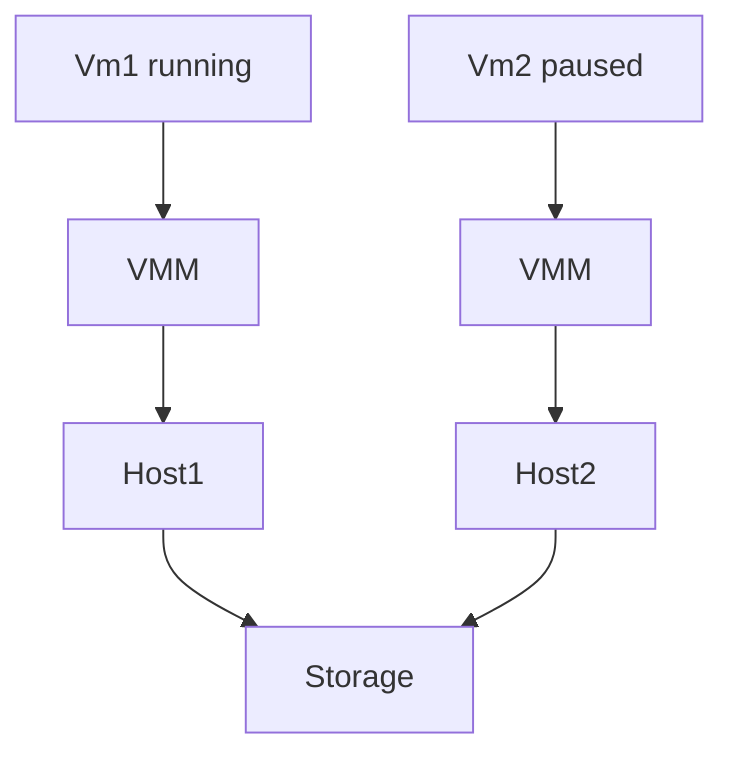
```mermaid
graph TD
    A[Host1] --> E[Storage]
    B[Host2] --> E
    C[VMM] -->A 
    D[VMM] -->B
	F[Vm1 running]-->C
	G[Vm2 paused]-->D
```

为了实现Vm1到Vm2的热迁移，我们需要对虚拟机依赖的四种资源进行逐步分析

- 网络：虚拟机的网络请求都是无状态的，因此需要把源端虚拟机的网络配置到目标虚拟机即可
- 存储：对于所有主机而言，源端主机和迁移端对于共享存储的视野是一样的

那么热迁移处理的其实是CPU和内存，分为下面两个阶段（pre-copy）

1. Iterative Copy（迭代传输）
   - 现在有若干个内存页，然后依次传递到Vm2
   - 在一次传输之后，内存会被Vm1改写，改写的内存页被称为脏页，我们可以从Vmm获取哪些脏页改变了，之后再去写这些脏页
   - 再次传输这些脏页，脏页依次会越来越少，直到我们可以在毫秒级完成新脏页的传输

2. Downtime
   - 这个阶段我们暂停Vm1
   - 传输剩余的脏页和CPU状态（主要是寄存器里面的值）给Vm2（毫秒级传输）
   - 启动Vm2

理论上来说，如果CPU产生脏页的速度一直高于传输速度的话，我们就几乎永远不能完成传输，因此我们可以人为的降低CPU的速度，或者在运行慢的时候进行热迁移

# 内存虚拟化

我们先简单看一下正常的查询是什么样的

**MMU（Memory Management Unit，内存管理单元）** 是现代 CPU 中的一个**关键硬件组件**，负责将程序使用的**虚拟地址（Virtual Address）** 转换为物理内存中的**物理地址（Physical Address）**，并提供内存保护、共享和分页等核心功能。


**CR3 寄存器（Control Register 3）** 是 x86/x86-64 架构 CPU 中一个**关键的控制寄存器**，它在**虚拟内存管理**中扮演核心角色：

> **CR3 存储了当前进程（或地址空间）的页目录基地址（Page Directory Base Address），是 MMU 进行虚拟地址到物理地址转换的起点。**

当 CPU 启用分页（Paging）后，**每次地址转换都从 CR3 开始**

**TLB（Translation Lookaside Buffer）** 是 CPU 中 MMU（内存管理单元）内部的一个**高速缓存（Cache）**，用于**加速虚拟地址到物理地址的转换过程**。 它缓存最近用过的 **虚拟页号 → 物理页帧号** 的映射，避免每次都去查慢速的内存页表。

**TLB 将常用映射缓存在 CPU 内部（SRAM），访问速度接近寄存器**

下面是相关的一些概念

| 术语                                    | 说明                                      |
| --------------------------------------- | ----------------------------------------- |
| **TLB**（Translation Lookaside Buffer） | MMU 内部的高速缓存，存储 VA→PA 映射       |
| **Page Fault**                          | MMU 无法完成地址转换时触发的异常          |
| **Swapping / Paging**                   | OS 利用 MMU 的 Present 位实现内存换入换出 |
| **ASLR**（地址空间布局随机化）          | 安全技术，依赖 MMU 提供的虚拟地址隔离     |
| **Huge Pages**（大页）                  | 使用 2MB/1GB 页减少 TLB miss，提升性能    |

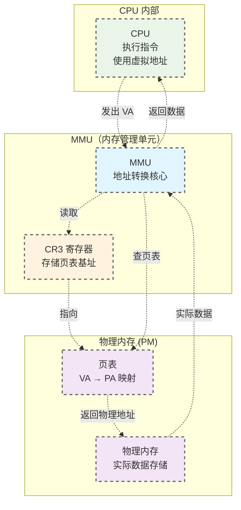
```mermaid
graph TB
    subgraph "CPU 内部"
        CPU["CPU<br/>执行指令<br/>使用虚拟地址"]
    end

    subgraph "MMU（内存管理单元）"
        MMU["MMU<br/>地址转换核心"]
        CR3_REG["CR3 寄存器<br/>存储页表基址"]
    end

    subgraph "物理内存 (PM)"
        PAGE_TBL["页表<br/>VA → PA 映射"]
        PHYS_MEM["物理内存<br/>实际数据存储"]
    end

    %% 连接关系
    CPU -.->|"发出 VA"| MMU
    MMU -.->|"读取"| CR3_REG
    CR3_REG -.->|"指向"| PAGE_TBL
    MMU -.->|"查页表"| PAGE_TBL
    PAGE_TBL -.->|"返回物理地址"| PHYS_MEM
    PHYS_MEM -.->|"实际数据"| MMU
    MMU -.->|"返回数据"| CPU

    %% 样式设置
    classDef cpu_style fill:#e8f5e8,stroke:#388e3c,stroke-width:2px
    classDef mmu_style fill:#e1f5fe,stroke:#0277bd,stroke-width:2px
    classDef pm_style fill:#f3e5f5,stroke:#7b1fa2,stroke-width:2px
    classDef cr3_style fill:#fff3e0,stroke:#ef6c00,stroke-width:2px
    classDef conn_line stroke:#666,stroke-width:2px,stroke-dasharray: 5 5

    class CPU cpu_style
    class MMU,MMU mmu_style
    class PAGE_TBL,PHYS_MEM pm_style
    class CR3_REG cr3_style
    class CPU,MMU,CR3_REG,PAGE_TBL,PHYS_MEM conn_line

```

- **CPU**：执行程序时使用虚拟地址（VA），对物理内存位置无感知
- **MMU**：内存管理单元，负责地址转换的核心硬件组件
- **CR3 寄存器**：存储当前进程页表的物理基地址，是地址翻译的起点
- **页表**：操作系统建立的 VA → PA 映射表

如果不是一层页面的话，查询结构类似于逐级查索引

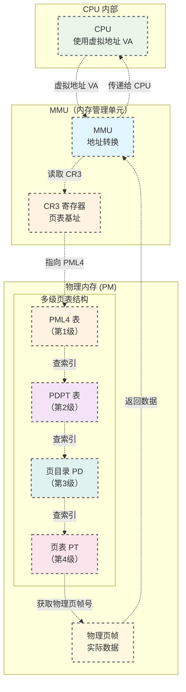
```mermaid
graph TB
    subgraph "CPU 内部"
        CPU["CPU<br/>使用虚拟地址 VA"]
    end

    subgraph "MMU（内存管理单元）"
        MMU["MMU<br/>地址转换"]
        CR3_REG["CR3 寄存器<br/>页表基址"]
    end

    subgraph "物理内存 (PM)"
        subgraph "多级页表结构"
            PML4["PML4 表<br/>（第1级）"]
            PDPT["PDPT 表<br/>（第2级）"]
            PD["页目录 PD<br/>（第3级）"]
            PT["页表 PT<br/>（第4级）"]
        end
        PHYS_PAGE["物理页帧<br/>实际数据"]
    end

    %% 连接关系
    CPU -.->|"虚拟地址 VA"| MMU
    MMU -.->|"读取 CR3"| CR3_REG
    CR3_REG -.->|"指向 PML4"| PML4
    PML4 -.->|"查索引"| PDPT
    PDPT -.->|"查索引"| PD
    PD -.->|"查索引"| PT
    PT -.->|"获取物理页帧号"| PHYS_PAGE
    PHYS_PAGE -.->|"返回数据"| MMU
    MMU -.->|"传递给 CPU"| CPU

    %% 样式设置
    classDef cpu_style fill:#e8f5e8,stroke:#388e3c,stroke-width:2px
    classDef mmu_style fill:#e1f5fe,stroke:#0277bd,stroke-width:2px
    classDef pml4_style fill:#fff3e0,stroke:#ef6c00,stroke-width:2px
    classDef pdpt_style fill:#f3e5f5,stroke:#7b1fa2,stroke-width:2px
    classDef pd_style fill:#e0f2f1,stroke:#00695c,stroke-width:2px
    classDef pt_style fill:#fce4ec,stroke:#ad1457,stroke-width:2px
    classDef phys_style fill:#fff8e1,stroke:#f57f17,stroke-width:2px
    classDef conn_line stroke:#666,stroke-width:2px,stroke-dasharray: 5 5

    class CPU cpu_style
    class MMU,MMU mmu_style
    class CR3_REG,PML4 pml4_style
    class PDPT pdpt_style
    class PD pd_style
    class PT pt_style
    class PHYS_PAGE phys_style
    class CPU,MMU,CR3_REG,PML4,PDPT,PD,PT,PHYS_PAGE conn_line

```

## 影子页表（Vmm页表）

我们结合上述的理论会发现一个问题，就是当Vm1建立了一个页表之后，其他Vm是不知道的，也就会存在Vm2映射的一个P已经被Vm1占用了，这时候Vmm就会给这个Vm2创建一个影子页表。然而，对于修改内存页这种操作理论上是不会触发Vmm的，因此就需要给内存地址设置成只读，这样每一次修改都会造成报错然后被Vmm捕捉到，进而对影子列表进行修改。

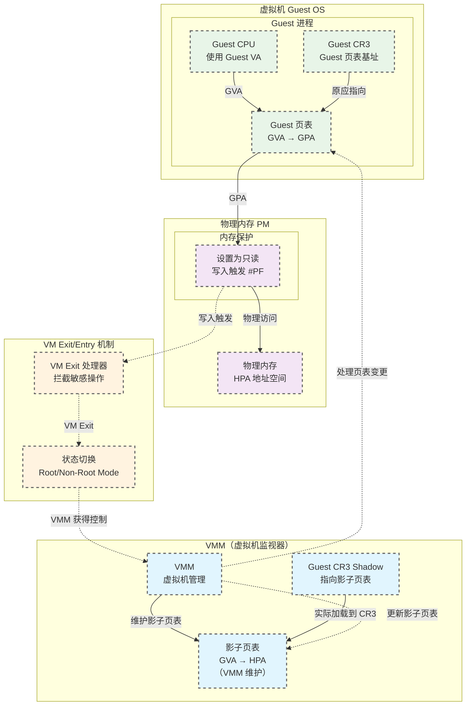
```mermaid
graph TB
    subgraph "虚拟机 Guest OS"
        subgraph "Guest 进程"
            G_CPU["Guest CPU<br/>使用 Guest VA"]
            G_CR3["Guest CR3<br/>Guest 页表基址"]
            G_PT["Guest 页表<br/>GVA → GPA"]
        end
    end

    subgraph "VMM（虚拟机监视器）"
        VMM["VMM<br/>虚拟机管理"]
        SHADOW_PT["影子页表<br/>GVA → HPA<br/>（VMM 维护）"]
        GUEST_CR3_SHADOW["Guest CR3 Shadow<br/>指向影子页表"]  
    end

    subgraph "物理内存 PM"
        PHYS_MEM["物理内存<br/>HPA 地址空间"]
        subgraph "内存保护"
            READ_ONLY["设置为只读<br/>写入触发 #PF"]
        end
    end

    subgraph "VM Exit/Entry 机制"
        EXIT_HANDLER["VM Exit 处理器<br/>拦截敏感操作"]
        STATE_SWITCH["状态切换<br/>Root/Non-Root Mode"]
    end

    %% 连接关系
    G_CPU -->|"GVA"| G_PT
    G_PT -->|"GPA"| READ_ONLY
    READ_ONLY -->|"物理访问"| PHYS_MEM

    G_CR3 -->|"原应指向"| G_PT
    VMM -->|"维护影子页表"| SHADOW_PT
    GUEST_CR3_SHADOW -->|"实际加载到 CR3"| SHADOW_PT

    READ_ONLY -.->|"写入触发"| EXIT_HANDLER
    EXIT_HANDLER -.->|"VM Exit"| STATE_SWITCH
    STATE_SWITCH -.->|"VMM 获得控制"| VMM

    VMM -.->|"更新影子页表"| SHADOW_PT
    VMM -.->|"处理页表变更"| G_PT

    %% 样式设置
    classDef guest_style fill:#e8f5e8,stroke:#388e3c,stroke-width:2px
    classDef vmm_style fill:#e1f5fe,stroke:#0277bd,stroke-width:2px
    classDef pm_style fill:#f3e5f5,stroke:#7b1fa2,stroke-width:2px
    classDef exit_style fill:#fff3e0,stroke:#ef6c00,stroke-width:2px
    classDef conn_line stroke:#666,stroke-width:2px,stroke-dasharray: 5 5

    class G_CPU,G_CR3,G_PT guest_style
    class VMM,SHADOW_PT,GUEST_CR3_SHADOW vmm_style
    class PHYS_MEM,READ_ONLY pm_style
    class EXIT_HANDLER,STATE_SWITCH exit_style
    class G_CPU,G_CR3,G_PT,VMM,SHADOW_PT,GUEST_CR3_SHADOW,PHYS_MEM,READ_ONLY,EXIT_HANDLER,STATE_SWITCH conn_line

```

1. **Guest OS**：客户操作系统以为自己在管理真实内存，使用 GVA → GPA 的页表
2. **影子页表**：VMM 维护的 GVA → HPA 映射，绕过 GPA 层
3. **只读保护**：PM 设置为只读，任何写入操作都会触发 #PF 异常
4. **VM Exit**：当 Guest 尝试写入内存时，触发 VM Exit，控制权回到 VMM
5. **状态切换**：CPU 从 Non-Root Mode（Guest）切换到 Root Mode（VMM）
6. **VMM 处理**：VMM 更新影子页表，同步 Guest 页表变更

然而这个方案存在一些弊端

- 存在很多VM exit，性能不高
- 建立页表空间消耗也不小

## 硬件辅助页表

CPU厂商也给CPU单独加了一个页表，存放**虚拟机物理地址**到**真实物理地址**的映射

我们举一个例子说明一下这个页表和影子页表的区别，现在Vm1存储了V1--P1、V2--P2的映射，然后Vm2想存一个V3--P2的映射，这时候：

- 影子页表：Vm2影子页表存 **V3--P3**（也就是Vmm给他找的地址）
- CPU页表(如EPT)：存Vm2 **P2--P3**（也就是Vm2以为它存的地方和实际上存的地方）
- 虚拟机内存页表：Vm2自己存一个页表，记录**V3--P2**

我们以因特尔的EPT页表为例子走一遍虚拟内存地址到真正的物理地址的翻译：

`虚拟地址 (VA) → PML4 → PDPT → PD → PT → 物理页帧`


```mermaid
graph TB
    subgraph "虚拟机 VM2"
        G_CPU["Guest CPU<br/>使用 GVA<br/>（Guest Virtual Address）"]
        G_CR3["Guest CR3<br/>指向 Guest 页表"]
        G_PML4["Guest PML4<br/>（第1级）"]
        G_PDPT["Guest PDPT<br/>（第2级）"]
        G_PD["Guest PD<br/>（第3级）"]
        G_PT["Guest PT<br/>（第4级）"]
        G_PA["Guest PA<br/>（Guest Physical Address）"]
    end

    subgraph "硬件 EPT 机制"
        EPTP["EPTP<br/>EPT 页表指针<br/>（由 VMM 设置）"]
        EPT_PML4["EPT PML4<br/>（第1级）"]
        EPT_PDPT["EPT PDPT<br/>（第2级）"]
        EPT_PD["EPT PD<br/>（第3级）"]
        EPT_PT["EPT PT<br/>（第4级）"]
        H_PA["HPA<br/>（Host Physical Address）"]
    end

    subgraph "物理内存"
        PHYS_MEM["物理内存<br/>实际数据"]
    end

    %% Guest 页表遍历
    G_CPU -->|"GVA"| G_CR3
    G_CR3 --> G_PML4
    G_PML4 -->|"查索引"| G_PDPT
    G_PDPT -->|"查索引"| G_PD
    G_PD -->|"查索引"| G_PT
    G_PT -->|"得到 GPA"| G_PA

    %% EPT 页表遍历
    G_PA -->|"作为 GPA 输入"| EPTP
    EPTP --> EPT_PML4
    EPT_PML4 -->|"EPT 遍历"| EPT_PDPT
    EPT_PDPT -->|"EPT 遍历"| EPT_PD
    EPT_PD -->|"EPT 遍历"| EPT_PT
    EPT_PT -->|"得到 HPA"| H_PA

    %% 最终物理访问
    H_PA -->|"实际内存访问"| PHYS_MEM

    %% 样式设置
    classDef guest_style fill:#e8f5e8,stroke:#388e3c,stroke-width:2px
    classDef ept_style fill:#e1f5fe,stroke:#0277bd,stroke-width:2px
    classDef phys_style fill:#f3e5f5,stroke:#7b1fa2,stroke-width:2px
    classDef conn_line stroke:#666,stroke-width:2px

    class G_CPU,G_CR3,G_PML4,G_PDPT,G_PD,G_PT,G_PA guest_style
    class EPTP,EPT_PML4,EPT_PDPT,EPT_PD,EPT_PT,H_PA ept_style
    class PHYS_MEM phys_style
    class G_CPU,G_CR3,G_PML4,G_PDPT,G_PD,G_PT,G_PA,EPTP,EPT_PML4,EPT_PDPT,EPT_PD,EPT_PT,H_PA,PHYS_MEM conn_line

```

| 缩写     | 英文全称                     | 中文含义     | 在虚拟机内存访问中的作用                 | 设计意义                                             | 实际例子                                                     |
| -------- | ---------------------------- | ------------ | ---------------------------------------- | ---------------------------------------------------- | ------------------------------------------------------------ |
| **PML4** | Page Map Level 4             | 页映射第4级  | Guest OS 的页表最高级，由 Guest CR3 指向 | 虚拟地址的第一层筛选，将 64 位地址分为多个 512GB 段  | VM2 中进程访问 0x7FFF00000000 时，PML4 确定使用哪个 512GB 段 |
| **PDPT** | Page Directory Pointer Table | 页目录指针表 | 连接 PML4 和 PD，存储页目录的指针        | 进一步细分 512GB 段为多个 1GB 区域，提高地址解析精度 | 继续上面的例子，确定在选定 512GB 段中的哪个 1GB 区域         |
| **PD**   | Page Directory               | 页目录       | 指向具体的页表（PT）                     | 将 1GB 区域细分为多个 2MB 页面                       | 确定访问 1GB 区域中的具体 2MB 页面                           |
| **PT**   | Page Table                   | 页表         | 包含最终的物理页帧地址                   | 将虚拟页映射到具体的物理页帧，完成最后一级翻译       | 确定虚拟页对应的实际 4KB 物理内存页                          |

这个过程没有使用到一次Vm exit，大大节省了开销。实际上还是会存在Vm exit，比如EPT页表中没有存相关记录的时候

然而这个方案也是有弊端的，就是除了常规的查询之外，它还是**每次每层**都要走EPT的四层查询

## 内存超分

内存是什么(先区分寄存、缓存、内存、磁盘)

```
CPU 寄存器  
↓  
L1 Cache（每核私有，几KB–几十KB）  
↓  
L2 Cache（每核私有或共享，几百KB）  
↓  
L3 Cache（多核共享，几MB–几十MB）  
↓  
主内存（RAM，几GB–数TB）  
↓  
磁盘（SSD/HDD，用于虚拟内存或持久存储）
```

| 名称               | 全称/类型                               | 特点                                                      |
| ------------------ | --------------------------------------- | --------------------------------------------------------- |
| **缓存（Cache）**  | 高速缓冲存储器（如 CPU L1/L2/L3 Cache） | 速度极快、容量小、成本高、靠近 CPU                        |
| **内存（Memory）** | 主存（Main Memory / RAM，通常是 DRAM）  | 速度较快、容量大、成本较低、作为 CPU 和磁盘之间的“工作区” |

### 基础概念

**Hypervisor**（也称为 **Virtual Machine Monitor, VMM**）是虚拟化技术中的核心软件层，负责创建、运行和管理虚拟机（VM），并协调多个 VM 对物理硬件资源（如 CPU、内存、I/O）的访问。

就是说，虚拟机的CPU和内存资源实际上是由Hypervisor虚拟出来的，实际使用的是宿主机上的资源，也就是说会受到宿主机资源的限制。

现在的情况是我有一台32G存内存的服务器，A买了我一个8G内存的虚拟机，但是他平时只用2G。如果我老老实实和他分的话，相当于一共起四台，但是有很多资源用不到闲置着。那么我现在想，他用多少我给他起多少，这样的话就可以更充分的利用，我可以挣到第五、第六份钱。这就是内存超分

“内存超分”（Memory Overcommitment 或 Memory Oversubscription）是虚拟化和云计算环境中常用的一种资源管理技术，指的是**分配给虚拟机（VM）或容器的内存总量超过物理主机实际拥有的物理内存容量**。这种做法基于一个前提：**并非所有虚拟机都会同时使用其分配的全部内存**。

### 回收空闲内存页

场景是，现在四台虚拟机使用内存来进行工作，这时候一些使用完的内存页被虚拟机所释放，但是这个时候Hypervisor并不知道这些已经被释放了，这就需要有虚拟机内部的代理来通知他，这就是**虚拟机中的内存代理**

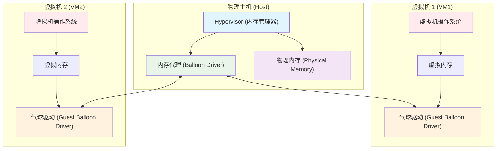
```mermaid
graph TB
    subgraph "物理主机 (Host)"
        A["Hypervisor (内存管理器)"]
        B["物理内存 (Physical Memory)"]
        C["内存代理 (Balloon Driver)"]
    end

    subgraph "虚拟机 1 (VM1)"
        D["虚拟机操作系统"]
        E["虚拟内存"]
        F["气球驱动 (Guest Balloon Driver)"]
    end

    subgraph "虚拟机 2 (VM2)"
        G["虚拟机操作系统"]
        H["虚拟内存"]
        I["气球驱动 (Guest Balloon Driver)"]
    end

    A --> B
    A --> C
    C <--> F
    C <--> I
    D --> E
    E --> F
    G --> H
    H --> I

    style A fill:#e1f5fe
    style B fill:#f3e5f5
    style C fill:#e8f5e8
    style F fill:#fff3e0
    style I fill:#fff3e0
    style D fill:#ffebee
    style G fill:#ffebee


```

当现在要起一个新的虚拟机，内存资源紧张的时候，需要回收虚拟机中释放的空闲页。

1. Hypervisor就会通知内存代理，告诉他现在要回收资源；
2. 内存代理会随之膨胀，然后更多的内存空闲页被包揽到这个气球中，无法被虚拟机操作系统或者运行的程序所分配到
3. 之后内存代理就回通知Hypervisor说，刚刚其包揽的内存页可以拿去用了

- 当然，这个内存的的膨胀肯定是有限度的，不然虚拟机上的程序就无法正常运行

当现在内存不紧张了，要还回去内存页

1. Hypervisor就回通知内存代理，开始归还内存页
2. 内存代理收到通知，就会反向的收缩自己，虚拟机内部就有更多的内存

这就是气球驱动

### 合并内存页

如果一台宿主机上面运行的虚拟机操作系统相同，或者一些配置信息相同，就有可能产生一模一样的两个内存页，这时候理论上就可以合并

我们通过对比哈希值，可以发现两个内存页是一样的，这时候就可以拼接到一起（也就是一个虚拟机来查找的时候，会引导到另外一个内存页上面，它自己是感知不到的），这样又可以节约一张内存页。问题是如果有人要写怎么办？

“Copy-on-Write”（**写时复制**，简称 **COW** 或 **CoW**）是一种**高效利用内存和存储资源的延迟分配策略**，广泛应用于操作系统、虚拟化、容器、文件系统等领域。多个进程/实体共享同一份数据副本，只有当某个实体试图“修改”该数据时，系统才为其创建一个私有副本。

1. **初始状态**：父进程和子进程（或多个 VM）**共享同一物理内存页**，页表项标记为 **只读**。
2. **读操作**：所有进程可正常读取，无开销。
3. **写操作**：
   - 某进程尝试写入该页 → 触发 **页错误（Page Fault）**
   - 操作系统/Hypervisor 捕获异常
   - **复制一份新页**，将修改写入新页
   - 更新该进程的页表指向新页，并设为可写
   - 其他进程仍共享原始页

简单来说就是读共享，写私有；以达到相同共享，不同私有的效果

但是这样的问题谁调度是需要使用CPU的，在节约了内存页资源的同时也会浪费CPU资源

### 内存交换

Hypervisor将一部分内存交换到磁盘上面，基本上是长时间不使用的内存页，但是如果交换的页过多，肯定也会影响虚拟机的性能

## 动态资源调度

刚刚提到的内存超分，如果过度使用的话会造成宿主机上资源不够的情况，所以现在立项的情况是合并多个主机的资源来实现一个资源池。

但是像存储一样把内存随意分配肯定是不显示的，我们采用的策略是把几台宿主机作为一个池，谁上面运行的虚拟机资源快过载的话，就迁移到别的宿主机上面

而动态实现这个步骤的方式就是DRS——**DRS（Distributed Resource Scheduler，分布式资源调度器）** 是 VMware vSphere 中的一项核心自动化资源管理功能，用于在集群（Cluster）中的多个 ESXi 主机之间**动态平衡计算资源（主要是 CPU 和内存）的负载**，从而提升资源利用率、保障应用性能并简化运维。

DRS不仅支持内存负载优化，还支持CPU、网络的优化

DRS 在 **启用了 vSphere HA 的集群**中运行，周期性（默认每 5 分钟）执行以下操作：

1. **监控**：收集集群内所有主机和 VM 的 CPU、内存使用情况。
2. **分析**：计算当前资源分配是否“不平衡”（基于内置或自定义规则）。
3. **决策**：若发现某主机过载、另一台空闲，则生成 **vMotion 迁移建议**。
4. **执行**：
   - **手动模式**：管理员需确认后执行迁移。
   - **自动模式**：DRS 自动通过 **vMotion** 迁移 VM（无需停机）。

> 所有迁移均通过 **vMotion** 实现，**业务无中断**。

DRS对平台有一些功能要求，和高可用很像

1. 热迁移：在业务不中断的情况下迁移虚拟机，这个是必然的
2. 共享存储：迁移过后还能看到自己的磁盘数据

通常实现DRS取决于供货商，方法：

1. 给内存等等资源的使用上限设置一个阈值，超过的话就回出发DRS重新调度
2. 一些更加全面的算法来监测资源的争抢性+加权评分

# IO设备虚拟化

IO设备与CPU和内存通过总线连接，关系就是数据的进和出

- 通过数据存储来存数据
- 通过网络设备来发送数据

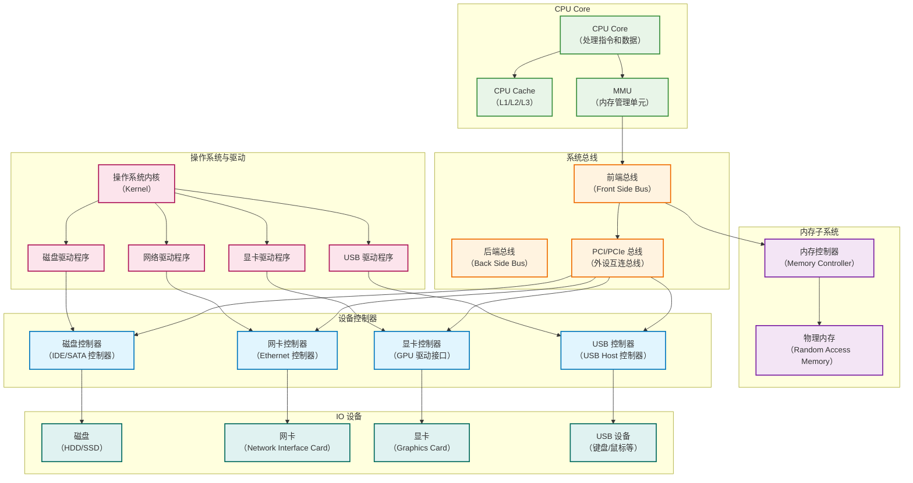
```mermaid
graph TB
    subgraph "CPU Core"
        CPU["CPU Core<br/>（处理指令和数据）"]
        CACHE["CPU Cache<br/>（L1/L2/L3）"]
        MMU["MMU<br/>（内存管理单元）"]
    end

    subgraph "内存子系统"
        RAM["物理内存<br/>（Random Access Memory）"]
        MEMORY_CTRL["内存控制器<br/>（Memory Controller）"]
    end

    subgraph "系统总线"
        FRONT_SIDE_BUS["前端总线<br/>（Front Side Bus）"]
        BACK_SIDE_BUS["后端总线<br/>（Back Side Bus）"]
        PCI_BUS["PCI/PCIe 总线<br/>（外设互连总线）"]
    end

    subgraph "IO 设备"
        DISK["磁盘<br/>（HDD/SSD）"]
        NIC["网卡<br/>（Network Interface Card）"]
        GPU["显卡<br/>（Graphics Card）"]
        USB["USB 设备<br/>（键盘/鼠标等）"]
    end

    subgraph "设备控制器"
        DISK_CTRL["磁盘控制器<br/>（IDE/SATA 控制器）"]
        NIC_CTRL["网卡控制器<br/>（Ethernet 控制器）"]
        GPU_CTRL["显卡控制器<br/>（GPU 驱动接口）"]
        USB_CTRL["USB 控制器<br/>（USB Host 控制器）"]
    end

    subgraph "操作系统与驱动"
        KERNEL["操作系统内核<br/>（Kernel）"]
        DRIVER_DISK["磁盘驱动程序"]
        DRIVER_NIC["网络驱动程序"]
        DRIVER_GPU["显卡驱动程序"]
        DRIVER_USB["USB 驱动程序"]
    end

    %% 连接关系
    CPU --> CACHE
    CPU --> MMU
    MMU --> FRONT_SIDE_BUS
    FRONT_SIDE_BUS --> MEMORY_CTRL
    MEMORY_CTRL --> RAM
    
    FRONT_SIDE_BUS --> PCI_BUS
    PCI_BUS --> DISK_CTRL
    PCI_BUS --> NIC_CTRL
    PCI_BUS --> GPU_CTRL
    PCI_BUS --> USB_CTRL

    DISK_CTRL --> DISK
    NIC_CTRL --> NIC
    GPU_CTRL --> GPU
    USB_CTRL --> USB

    KERNEL --> DRIVER_DISK
    KERNEL --> DRIVER_NIC
    KERNEL --> DRIVER_GPU
    KERNEL --> DRIVER_USB

    DRIVER_DISK --> DISK_CTRL
    DRIVER_NIC --> NIC_CTRL
    DRIVER_GPU --> GPU_CTRL
    DRIVER_USB --> USB_CTRL

    %% 样式设置
    classDef cpu_style fill:#e8f5e8,stroke:#388e3c,stroke-width:2px
    classDef memory_style fill:#f3e5f5,stroke:#7b1fa2,stroke-width:2px
    classDef bus_style fill:#fff3e0,stroke:#ef6c00,stroke-width:2px
    classDef io_style fill:#e0f2f1,stroke:#00695c,stroke-width:2px
    classDef ctrl_style fill:#e1f5fe,stroke:#0277bd,stroke-width:2px
    classDef os_style fill:#fce4ec,stroke:#ad1457,stroke-width:2px

    class CPU,CACHE,MMU cpu_style
    class RAM,MEMORY_CTRL memory_style
    class FRONT_SIDE_BUS,BACK_SIDE_BUS,PCI_BUS bus_style
    class DISK,NIC,GPU,USB io_style
    class DISK_CTRL,NIC_CTRL,GPU_CTRL,USB_CTRL ctrl_style
    class KERNEL,DRIVER_DISK,DRIVER_NIC,DRIVER_GPU,DRIVER_USB os_style

```

- **CPU Core**：中央处理器，执行程序指令
- **Memory System**：物理内存及控制器，存储数据和程序
- **System Bus**：各种总线连接 CPU、内存和 IO 设备
- **IO Devices**：各种外部设备
- **Device Controllers**：硬件控制器，管理具体设备
- **OS & Drivers**：操作系统和设备驱动程序，提供软件接口

**虚拟机是通过操作这个设备的驱动来对这个设备进行各种操作**

在这里，我们先区分一下Driver和Controller的概念和关系

1. 物理机上

   ```mermaid
   graph LR
       OS[操作系统] -->|调用标准接口| Driver[设备驱动<br/>（内核模块）]
       Driver -->|发送控制命令 / 读写数据| Controller[设备控制器<br/>（硬件）]
       Controller -->|直接控制| Device[物理设备<br/>如磁盘、网卡、USB等]
       
       Device -->|返回状态/数据| Controller
       Controller -->|中断或轮询反馈| Driver
       Driver -->|向上报告结果| OS
   
       style OS fill:#e3f2fd,stroke:#1976d2
       style Driver fill:#c8e6c9,stroke:#388e3c
       style Controller fill:#ffcc80,stroke:#f57c00
       style Device fill:#ffcdd2,stroke:#d32f2f
   
   ```

2. 虚拟机上

   ```mermaid
   graph LR
       VM1[虚拟机1<br/>包含独立操作系统] -->|调用标准接口| VDriver[虚拟设备驱动]
       VM2[虚拟机2<br/>包含独立操作系统] -->|调用标准接口| VDriver
       VDriver -->|发送控制命令 / 读写数据| VHBA[虚拟硬件总线适配器]
       
       Hypervisor(虚拟化层<br/>如Hypervisor) -.->|模拟硬件资源| VHBA
       Hypervisor -->|直接或间接管理| Controller[物理设备控制器<br/>（硬件）]
       Controller -->|直接控制| Device[物理设备<br/>如磁盘、网卡等]
   
       style VM1 fill:#e3f2fd,stroke:#1976d2
       style VM2 fill:#e3f2fd,stroke:#1976d2
       style VDriver fill:#c8e6c9,stroke:#388e3c
       style VHBA fill:#ffcc80,stroke:#f57c00
       style Hypervisor fill:#b3e5fc,stroke:#0288d1
       style Controller fill:#ffcc80,stroke:#f57c00
       style Device fill:#ffcdd2,stroke:#d32f2f
   
   ```

在一次与IO设备完整的交互中，有三个比较重要的部分：

## IO交互主要过程分析

### IO Access（设备访问）

#### 端口映射IO（PMIO）

在一组设备上面会有设备控制器，设备控制器上面会有一组IO寄存器

CPU可以通过读取这些寄存器来获取设备的信息

寄存器也可以映射为一组IO端口，操作系统内部可以通过一些特殊的指令来访问这些端口，从而达到访问IO寄存器的效果，从而达到访问IO设备的效果

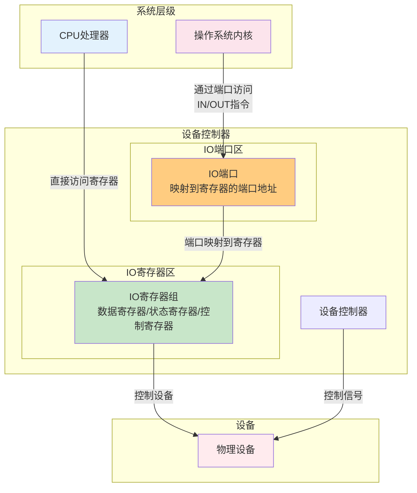
```mermaid
graph TB
    subgraph "系统层级"
        CPU[CPU处理器]
        OS[操作系统内核]
    end
    
    subgraph "设备控制器"
        Controller[设备控制器]
        
        subgraph "IO寄存器区"
            Reg[IO寄存器组<br/>数据寄存器/状态寄存器/控制寄存器]
        end
        
        subgraph "IO端口区"
            Port[IO端口<br/>映射到寄存器的端口地址]
        end
    end
    
    subgraph "设备"
        Dev[物理设备]
    end
    
    %% 两种访问方式
    CPU --"直接访问寄存器"--> Reg
    OS --"通过端口访问<br/>IN/OUT指令"--> Port
    Port --"端口映射到寄存器"--> Reg
    Reg --"控制设备"--> Dev
    Controller --"控制信号"--> Dev
    
    style Reg fill:#c8e6c9
    style Port fill:#ffcc80
    style CPU fill:#e3f2fd
    style OS fill:#fce4ec
    style Dev fill:#ffebee


```

#### 内存映射IO（MMIO）

操作系统内部，不需要执行特殊的指令，而只需要像正常的操作一样访问特殊的内存地址即可对设备进行操作，这种IO访问方式我们成为MMIO

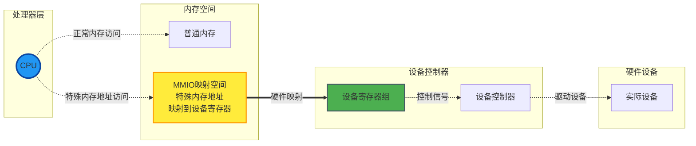
```mermaid
graph LR
    subgraph "处理器层"
        CPU((CPU))
    end
    
    subgraph "内存空间"
        MEM[普通内存]
        MMIO[MMIO映射空间<br/>特殊内存地址<br/>映射到设备寄存器]
    end
    
    subgraph "设备控制器"
        CTRL[设备控制器]
        REGS[设备寄存器组]
    end
    
    subgraph "硬件设备"
        DEVICE[实际设备]
    end
    
    CPU -.->|正常内存访问| MEM
    CPU -.->|特殊内存地址访问| MMIO
    MMIO ==>|硬件映射| REGS
    REGS -.->|控制信号| CTRL
    CTRL -.->|驱动设备| DEVICE
    
    style MMIO fill:#ffeb3b,stroke:#ff9800,stroke-width:2px
    style REGS fill:#4caf50,stroke:#455a64,stroke-width:2px
    style CPU fill:#2196f3,stroke:#0d47a1,stroke-width:3px


```

### Data Transfer

**Data Transfer（数据传输）** 是指在计算机系统中，**数据在不同组件之间移动的过程**，例如 CPU ↔ 内存、内存 ↔ I/O 设备、设备 ↔ 设备等。高效的数据传输机制对系统性能至关重要。

#### DMA

**DMA（Direct Memory Access，直接内存访问）** 是一种允许**外设（如磁盘、网卡、GPU）绕过 CPU，直接与系统主内存交换数据**的硬件机制。它的核心目标是：

> **解放 CPU，提升 I/O 性能，降低延迟和功耗。**

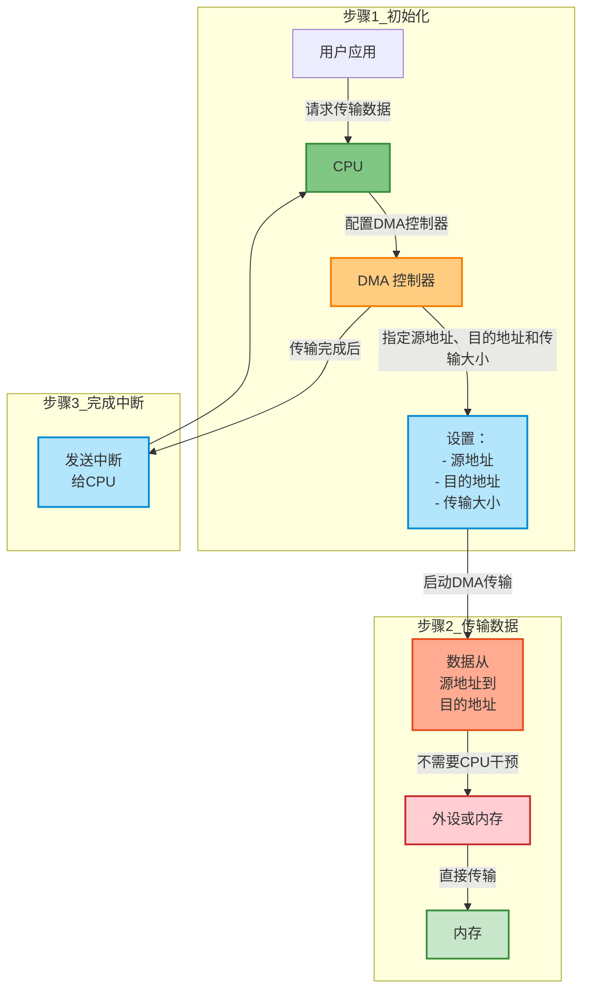
```mermaid
graph TD
    subgraph 步骤1_初始化
        用户应用 -->|请求传输数据| CPU["CPU"]
        CPU -->|配置DMA控制器| DMAC["DMA 控制器"]
        DMAC -->|指定源地址、目的地址和传输大小| DMAC_config["设置：\n- 源地址\n- 目的地址\n- 传输大小"]
    end
    
    subgraph 步骤2_传输数据
        DMAC_config -->|启动DMA传输| 数据传输["数据从\n源地址到\n目的地址"]
        数据传输 -->|不需要CPU干预| 外设设备[外设或内存]
        外设设备 -->|直接传输| 内存["内存"]
    end
    
    subgraph 步骤3_完成中断
        DMAC -->|传输完成后| 中断信号["发送中断\n给CPU"]
        中断信号 --> CPU
    end

    style CPU fill:#81c784,stroke:#388e3c,stroke-width:2px
    style DMAC fill:#ffcc80,stroke:#f57c00,stroke-width:2px
    style DMAC_config fill:#b3e5fc,stroke:#0288d1,stroke-width:2px
    style 数据传输 fill:#ffab91,stroke:#e64a19,stroke-width:2px
    style 外设设备 fill:#ffcdd2,stroke:#c62828,stroke-width:2px
    style 内存 fill:#c8e6c9,stroke:#388e3c,stroke-width:2px
    style 中断信号 fill:#b3e5fc,stroke:#0288d1,stroke-width:2px

```

1. **初始化阶段**：应用程序请求进行数据传输，CPU负责配置DMA控制器，包括设置源地址（例如外部设备的数据寄存器）、目的地址（例如系统内存中的一个特定位置）以及需要传输的数据大小。
2. **数据传输阶段**：一旦配置完成并启动了DMA传输，数据将直接在外设与内存之间传输，无需CPU的进一步干涉。这显著减少了CPU在数据传输过程中的负担。
3. **完成阶段**：当DMA传输完成后，DMA控制器会向CPU发送一个中断信号，通知它传输已完成。这样，CPU可以接着处理后续的任务或者响应这次中断以进行必要的检查和清理工作。

- 在上面的系统中多了一个DMA控制器模块，CPU把想要读取的数据和写入到什么位置都给DMA，DMA进行操作，CPU去干别的事情
- DMA操作完之后，CPU此时在忙别的的话，应该怎么通知它呢？

### Interrupt（中断）

这个在后面这部分会详细讲，中断可以让CPU从现在正在执行的任务中抽身出来，去执行一些更高优先级的事务

在DMA完成了这次操作之后，DMA会告知CPU的中断控制器，CPU感知到这次中断之后就回寄存当前处理的数据，然后去执行DMA操作的结果（准确来说是对IO完成中断的处理），完成后再去做自己的工作。

简单来说，中断需要硬件和软件系统的支持，因此如果我们想完成IO设备的虚拟化，我们就要模拟好这三个部分

## 设备虚拟化（全虚拟化）

如果我们想给一个虚拟机提供一个设备，有下面两种方法

- 直接给设备给他，但是这样的话利用效率太低，别的虚拟机用不到了
- 设备虚拟化，以虚拟的形式将设备提供给虚拟机，这个是这部分讲述的点

这个设备的模拟，需要Vmm通过和这个设备一致的行为模拟出来：

1. step1：拦截这个IO的访问请求（原理是，我们都知道虚拟机是通过操作这个设备的驱动来对这个设备进行各种操作，上面提到了）

   - PMIO：**虚拟机**内部使用特殊的指令来访问IO端口
     - 因此，Vmm首先屏蔽掉这些端口
     - 等Vm访问这些端口的时候，CPU报错
     - Vmm感知到（截获到）这次IO
   - MMIO：虚拟机直接访问特殊地址的内存
     - 这些映射是Vmm来建立的，那么Vmm不建立就可以了
     - 当虚拟机直接访问的时候，会出发报错（然后有一个Vm exit）
     - 这个时候Vmm就可以感知到虚拟机对IO设备的访问

2. step2：数据传输（就是说，虚拟机以为自己是存到一块磁盘设备上，但是实际上可能只是宿主机文件系统中的一个区域，这就需要Vmm进行模拟，而且Vmm也要模拟DMA的操作功能）DMA功能模拟：

   - 设备驱动需要告知设备控制器，它需要读哪块区域、写入哪块区域（哪个目标的内存地址中）
   - 这时候需要Vmm来模拟这个行为，将这个数据从文件中读出来然后写到目标地址中
     - 虚拟机告知的是一个自己（虚拟机）内部的物理内存地址GPA（Guest Physical Address）【可以简单理解为：Guest 客户机=云主机=虚拟机】
     - Vmm视角下需要写入的是是物理机的内存地址HPA（Host Physical Address）
   - 因此Vmm需要知道GPA和HPA的映射信息，才能够完成DMA的传输模拟，而Vmm恰好就是做这部分模拟映射的，所以自己就知道

3. step3：中断虚拟化模拟（这个是很复杂的一个过程，在下面会单开一个来讲）

   - 简单来讲就是DMA通过为虚拟机的VCPU注入一个中断的方式来告知虚拟机及内部的操作系统

这些虚拟设备都是Vmm通过软件模拟出来的，因此其具有物理设备不具备的灵活性，比如说挂别人用不完的的ISCSI，比如对虚拟磁盘文件进行加密，这些都是后话。但是，这样也有弊端，比如IO设备拦截时候触发的Vm exit，造成相比于物理机很大的性能折扣，后面我们会了解解决这个问题的一些方案

## 设备透传

对于一些需求而言，IO设备的性能优先级高于一切。一个应对方法就是把这个设备直通给虚拟机使用，避免Vm exit（也就是触发Vmm），这种操作也叫做设备的透传。

在CPU的视角下，每个设备都是一个PCI设备（简单来说就是通过总线相连），而每个设备都有一组重要的寄存器——基址寄存器

“PCI设备”是指通过 **PCI（Peripheral Component Interconnect）总线** 与计算机系统连接的硬件设备。随着技术演进，现在更多使用的是其高速版本 **PCI Express（PCIe）**。在服务器、工作站或高性能计算（HPC）集群中，PCI/PCIe 设备扮演着关键角色。

**基址寄存器（Base Register）** 是 CPU 或 I/O 控制器中用于存储一个“起始地址”（即“基地址”）的硬件寄存器。当程序或设备使用**偏移量（offset）**访问资源时，实际物理地址 = **基址 + 偏移量**。

在设备透传的场景下，实现PMIO与MMIO都是通过基址寄存器来完成的

- 在在虚拟设备的情况下，Vmm模拟基址寄存器给虚拟机（

  ```mermaid
  sequenceDiagram
      participant VM_OS as 虚拟机操作系统
      participant VMM as 虚拟机监控器 (QEMU/VMM)
      participant Phy_Dev as 物理设备 (PCIe)
      
      Note over VM_OS, Phy_Dev: 虚拟设备初始化阶段
      VM_OS->>VMM: 读取虚拟设备配置空间 BAR
      VMM-->>VM_OS: 返回虚拟基址寄存器值 (如 0xFE000000)
      
      Note over VM_OS, Phy_Dev: 虚拟机访问设备寄存器
      VM_OS->>VMM: 访问虚拟基址 0xFE000000 + 偏移
      VMM->>VMM: 检查虚拟地址映射表
      VMM->>Phy_Dev: 转换为物理地址访问
      Phy_Dev-->>VMM: 返回物理设备响应
      VMM-->>VM_OS: 返回模拟结果
      
      Note over VM_OS, Phy_Dev: 多虚拟机隔离
      participant VM2_OS as 另一个虚拟机OS
      VM2_OS->>VMM: 访问相同虚拟基址 0xFE000000
      VMM->>VMM: 重定向到不同物理设备或模拟状态
      VMM-->>VM2_OS: 返回隔离的虚拟设备响应
  ```

- 在设备透传的情况下，设备是挂载给物理主机，但是物理主机不可能直接把基址寄存器暴露给虚拟机，因此需要模拟，也就是**映射**

### IO Access

**PMIO可行性**

对于PMIO而言，核心是要访问到设备的IO端口，也就是涉及到对虚拟设备IO端口操作的请求以及转发给物理设备的IO端口，这个过程中会产生VmExit，这和我们用设备透传的想法是冲突的，所以我们就去考虑MMIO

**MMIO可行性**

MMIO核心是访问GPA（上面我们提到了，GPA和MPA映射的时候需要Vmm参与，当他不建立的时候就可以让每一次访问都报错，然后捕获到）

在这个过程中，我们需要Vmm先在EPT页表（这里用到了硬件辅助虚拟化）中建立这两者（IO GPA -> IO HPA）的关系，建立完成之后，虚拟机内部访问MMIO就不需要再经过Vmm，没有什么性能折损

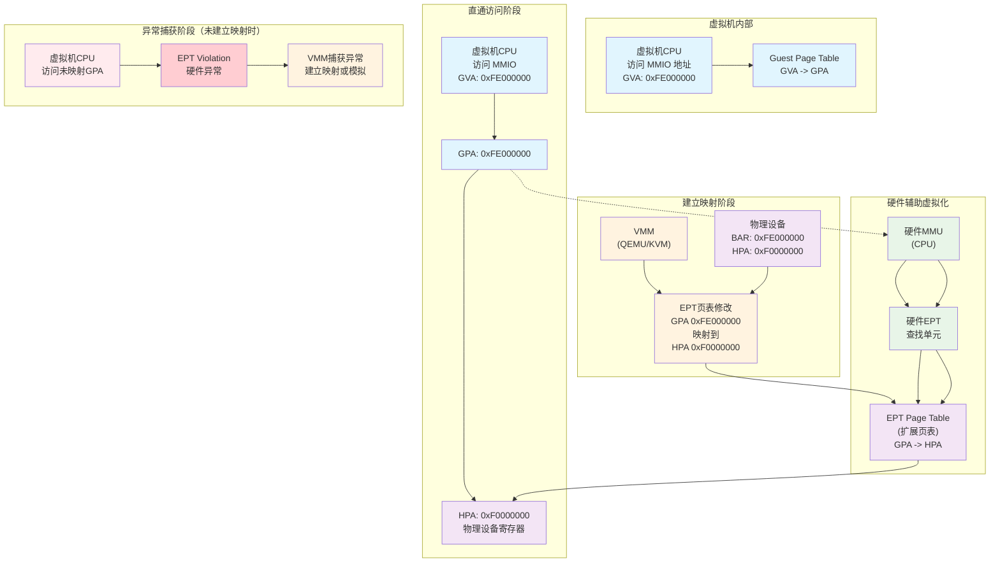
```mermaid
graph TB
    subgraph "虚拟机内部"
        A["虚拟机CPU<br/>访问 MMIO 地址<br/>GVA: 0xFE000000"]
        B["Guest Page Table<br/>GVA -> GPA"]
        A --> B
    end

    subgraph "硬件辅助虚拟化"
        C["EPT Page Table<br/>(扩展页表)<br/>GPA -> HPA"]
        D["硬件MMU<br/>(CPU)"]
        E["硬件EPT<br/>查找单元"]
        D --> E
        E --> C
    end

    subgraph "建立映射阶段"
        F["VMM<br/>(QEMU/KVM)"]
        G["物理设备<br/>BAR: 0xFE000000<br/>HPA: 0xF0000000"]
        H["EPT页表修改<br/>GPA 0xFE000000<br/>映射到<br/>HPA 0xF0000000"]
        F --> H
        G --> H
        H --> C
    end

    subgraph "直通访问阶段"
        I["虚拟机CPU<br/>访问 MMIO<br/>GVA: 0xFE000000"]
        J["GPA: 0xFE000000"]
        K["HPA: 0xF0000000<br/>物理设备寄存器"]
        I --> J --> K
        J -.-> D
        D --> E
        E --> C
        C --> K
    end

    subgraph "异常捕获阶段（未建立映射时）"
        L["虚拟机CPU<br/>访问未映射GPA"]
        M["EPT Violation<br/>硬件异常"]
        N["VMM捕获异常<br/>建立映射或模拟"]
        L --> M
        M --> N
    end

    style A fill:#e1f5fe
    style B fill:#e1f5fe
    style C fill:#f3e5f5
    style D fill:#e8f5e8
    style E fill:#e8f5e8
    style F fill:#fff3e0
    style G fill:#f3e5f5
    style H fill:#fff3e0
    style I fill:#e1f5fe
    style J fill:#e1f5fe
    style K fill:#f3e5f5
    style L fill:#ffebee
    style M fill:#ffcdd2
    style N fill:#fff3e0


```

- **GVA**(Guest Virtual Address)，即虚拟机内部的虚拟地址。在虚拟化环境中，每个虚拟机（Guest）都有其自己的虚拟地址空间，这个地址空间是虚拟机操作系统和应用程序所看到的地址范围。对于虚拟机来说，这些地址是它们用来访问内存的“物理”地址，但实际上这些地址需要通过虚拟机监控器（VMM）或相关的地址转换机制映射到真实的物理地址（Host Physical Address, HPA）上。

### 数据传输

依旧是支持DMA功能，也就是说一个IO下发之后，系统要支持IO设备操作**虚拟机的内存**

 问题是DMA的视角之下，只知道物理机上的内存地址，因此在没有知道这个映射的情况下是没法写入到正确的位置的（因为在虚拟化设备的场景下，是Vmm告诉DMA应该从哪里写到哪里，而在这个场景下并没有人告诉DMA），因此我们要引入一个重映射组件——**IOMMU（Input–Output Memory Management Unit）** 是现代计算机系统中用于**管理设备 DMA（直接内存访问）操作的硬件单元**，在虚拟化、安全性和系统稳定性方面起着至关重要的作用。

在PCI的架构中，每个设备都有自己的唯一标识符（Service ID）。

- 当设备通过PCI设备来通信的时候，其SrcId也会被带上（设备和内存的通信也一样），DMA请求会被IOMMA截获并且找到他的Src Id
- IOMMA设备中维护一张表，以PCI设备作为索引，能够导向虚拟机的信息
- 虚拟机的信息导向一个IO Mapping，这个映射维护了GPA到HPA的关系，映射是由Vmm建立的
- 从而DMA操作就可以访问到一个正确的内存地址了

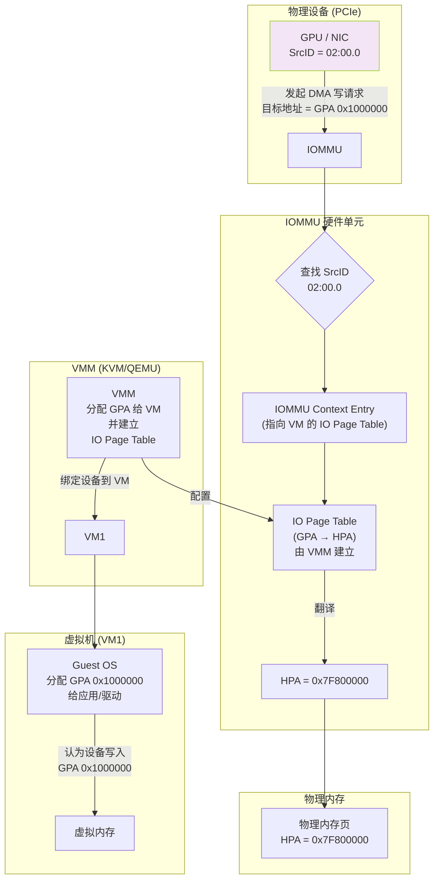
```mermaid
graph TB
    subgraph "物理设备 (PCIe)"
        A["GPU / NIC<br/>SrcID = 02:00.0"]
        A -->|发起 DMA 写请求<br/>目标地址 = GPA 0x1000000| B[IOMMU]
    end

    subgraph "IOMMU 硬件单元"
        B --> C{查找 SrcID<br/>02:00.0}
        C --> D["IOMMU Context Entry<br/>(指向 VM 的 IO Page Table)"]
        D --> E["IO Page Table<br/>(GPA → HPA)<br/>由 VMM 建立"]
        E -->|翻译| F[HPA = 0x7F800000]
    end

    subgraph "VMM (KVM/QEMU)"
        G["VMM<br/>分配 GPA 给 VM<br/>并建立<br/>IO Page Table"]
        G -->|配置| E
        G -->|绑定设备到 VM| H["VM1"]
    end

    subgraph "虚拟机 (VM1)"
        H --> I["Guest OS<br/>分配 GPA 0x1000000<br/>给应用/驱动"]
        I -->|认为设备写入<br/>GPA 0x1000000| J["虚拟内存"]
    end

    subgraph "物理内存"
        F --> K["物理内存页<br/>HPA = 0x7F800000"]
    end

    style A fill:#f3e5f5,stroke:#9c2

```

### 中断

由于虚拟机挂载在宿主机上面，所以DMA的中断最先到达的还是宿主机。因此，问题的核心就是，在共享CPU的场景下，如何将中断注入给正确的vCPU，这部分在中断虚拟化的部分会详细讲解

## 半虚拟化

在CPU虚拟化的部分我们提到过半虚拟化的技术，这是为了减少执行过程中带来的性能消耗，我们先来回顾一下半虚拟化的思想

> **通过修改客户操作系统（Guest OS）的内核，使其“主动配合” VMM（虚拟机监视器），用高效、明确的接口（hypercall）替代那些难以虚拟化的敏感指令，从而提升性能和简化 VMM 设计。**
>
> 与“全虚拟化”不同，半虚拟化**不要求硬件完全模拟真实机器**，而是让 Guest OS **知道自己运行在虚拟环境中**，并与其协作。

这部分我们以Virtio半虚拟化为例子

Virtio 是一种**半虚拟化（paravirtualization）**的 I/O 设备框架，主要用于虚拟化环境中提升虚拟机（Guest VM）与宿主机（Host）之间 I/O 操作的性能，已成为 Linux 内核和多个虚拟化平台（如 KVM、QEMU、Xen 等）的标准组件。VirtIO的特点是它尝试来统一为一个**半虚拟化IO的标准**

- 采用前后端（frontend/backend）模型：

  - **前端（Frontend）**：运行在 Guest OS 中的 Virtio 驱动（如 `virtio-net`、`virtio-blk`）。

  - **后端（Backend）**：运行在 Host 上的 Virtio 设备实现（通常由 QEMU 或 vhost 提供）。

- 核心组件：

  - **Virtqueue**：用于在 Guest 和 Host 之间传递数据的队列结构。每个 Virtio 设备可以有多个 virtqueue（例如，网络设备通常有两个：一个用于发送，一个用于接收）。

  - **共享内存**：Guest 和 Host 通过共享内存区域交换数据，避免频繁的数据拷贝。

  - **通知机制**：通过中断或事件通知对方有新数据（如使用 `ioeventfd` 和 `irqfd` 在 KVM/QEMU 中实现高效通知）。

### 前后端交流

1. 控制层面

   - 在干活之前，双方需要达成一个一致——对方能够干什么（Feature Beat）
     - 比如前端支持热插拔【**热插拔（Hot Plug / Hot Plugging）**，即在系统运行过程中动态添加或移除硬件设备，而无需重启系统。在虚拟化环境中，“热插”常指 **虚拟设备的热插拔（Hot-plug / Hot-unplug）**，例如为运行中的虚拟机（VM）动态添加/删除 CPU、内存、磁盘、网卡等资源。】，但是后端不支持这个功能
   - 因此，为了在这上面达成一致，后端需要将自己的特性集合发给前端
   - 前端需要将自己的特性集合和后端的进行对比，最后返回一个两者的交集

2. 数据层面

   - 在数据层定义了一个Virtqueue，相当于前端和后端的共享内存
   - 在Virtqueue中有一个个的内存缓冲区，我们称之为buffer
     - 每一个buffer都有一个描述符（描述其地址、长度以及一些特性）
     - Virtqueue会维护一个全局的表来记录这些描述符
     - 在这个表中，因为buffer之间可能形成链表，所以也是有存储后继节点指针的
   - 还有一个队列是Available ring，放置的是需要执行的任务
     - 注意，如果用链表相连的buffer，只用把第一个节点（实际上是Virtqueue全局表中的id）放进去就行了
   - 还有一个Used ring ，类似于Available ring，用于后端执行完操作之后把节点序号放进去
     - 此外，和Available ring不同的是，如果后端写了这个buffer，那么他就会将写的长度也写入Used Ring 中的每个条目里

   | 数据结构                          | 作用                          | 关键字段                                                  | 说明                                                         |
   | --------------------------------- | ----------------------------- | --------------------------------------------------------- | ------------------------------------------------------------ |
   | **Descriptor Table** （描述符表） | 存储所有 buffer 的元数据      | `addr` `len` `flags` `next`                               | - `addr`: Guest 物理地址（GPA） - `len`: buffer 长度（字节） - `flags`: 标志位（如 `VIRTQ_DESC_F_NEXT`, `VIRTQ_DESC_F_WRITE`） - `next`: 下一个描述符在表中的索引（仅当 `F_NEXT` 置位时有效） |
   | **Available Ring** （可用环）     | 前端 → 后端：提交待处理请求   | `flags` `idx` `ring[]`                                    | - `flags`: 控制中断抑制等（如 `VRING_AVAIL_F_NO_INTERRUPT`） - `idx`: 下一个要写入的 ring 位置（由前端维护） - `ring[N]`: 存放 Descriptor ID（即 Descriptor Table 的索引），表示一个 I/O 请求 |
   | **Used Ring** （已用环）          | 后端 → 前端：通知已完成的任务 | `flags` `idx` `ring[]`（元素为 `struct virtq_used_elem`） | - `flags`: 如 `VRING_USED_F_NO_NOTIFY`（后端设置，告诉前端不要发通知） - `idx`: 下一个要写入的 ring 位置（由后端维护） - `ring[i].id`: 完成的 Descriptor ID - `ring[i].len`: **后端实际处理的数据长度**（例如接收的网络包真实大小） |

下面我们简要介绍一下前后端操作的关键点：

假设 Descriptor Table 大小 ≥ 4，当前空闲槽位为 0,1,2。

前端操作：

1. **准备第一个写请求**（数据分散在两个 buffer）：
   - desc[0].addr = buf1_addr; .len = 512; .flags = VIRTQ_DESC_F_NEXT; .next = 1
   - desc[1].addr = buf3_addr; .len = 256; .flags = VIRTQ_DESC_F_WRITE; （无 NEXT）
2. **准备第二个写请求**：
   - desc[2].addr = buf4_addr; .len = 1024; .flags = VIRTQ_DESC_F_WRITE;
3. **写入 Available Ring**：
   - avail.ring[avail.idx % num] = 0; // 链头 ID=0
   - avail.idx++;
   - avail.ring[avail.idx % num] = 2; // 链头 ID=2
   - avail.idx++;
4. **调用 kick()** 通知后端。

> 注：前端在步骤1之前已将数据写入 buf1 和 buf3（因为是写请求）。

后端操作：

1. 收到 kick，读取 Available Ring：
   - 发现两个新请求：ID=0 和 ID=2
2. 处理 ID=0：
   - 读取 desc[0] → buf1（512B）
   - 因 F_NEXT，继续读 desc[1] → buf3（256B）
   - 将 768B 数据写入磁盘
   - 在 Used Ring 写入：{ id: 0, len: 768 }
3. 处理 ID=2：
   - 读取 desc[2] → buf4（1024B）
   - 写入磁盘
   - 在 Used Ring 写入：{ id: 2, len: 1024 }
4. 通知前端（如注入中断）。

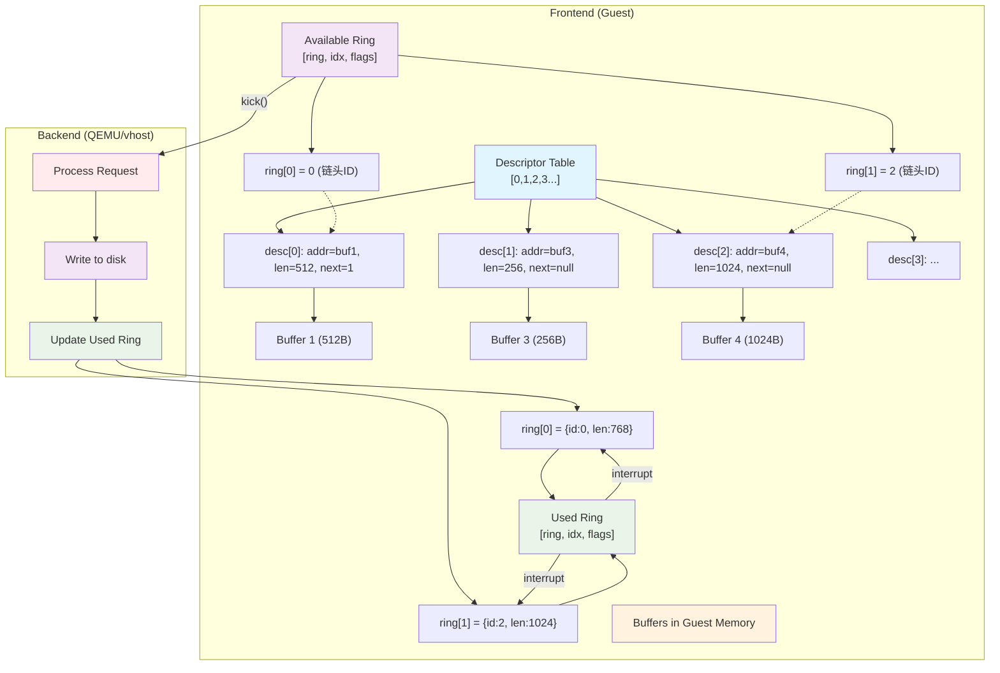
```mermaid
graph TB
    subgraph "Frontend (Guest)"
        A["Descriptor Table<br/>[0,1,2,3...]"]
        A0["desc[0]: addr=buf1, len=512, next=1"]
        A1["desc[1]: addr=buf3, len=256, next=null"]
        A2["desc[2]: addr=buf4, len=1024, next=null"]
        A3["desc[3]: ..."]
        
        B["Available Ring<br/>[ring, idx, flags]"]
        B1["ring[0] = 0 (链头ID)"]
        B2["ring[1] = 2 (链头ID)"]

        C["Used Ring<br/>[ring, idx, flags]"]
        C1["ring[0] = {id:0, len:768}"]
        C2["ring[1] = {id:2, len:1024}"]

        D["Buffers in Guest Memory"]
        D1["Buffer 1 (512B)"]
        D2["Buffer 3 (256B)"]
        D3["Buffer 4 (1024B)"]
    end

    subgraph "Backend (QEMU/vhost)"
        E["Process Request"]
        F["Write to disk"]
        G["Update Used Ring"]
    end

    %% Frontend setup
    A --> A0
    A --> A1
    A --> A2
    A --> A3

    A0 --> D1
    A1 --> D2
    A2 --> D3

    B --> B1
    B --> B2

    B1 -.-> A0
    B2 -.-> A2

    C1 --> C
    C2 --> C

    %% Kick
    B --"kick()"--> E

    %% Backend process
    E --> F
    F --> G
    G --> C1
    G --> C2

    %% Feedback to frontend
    C --"interrupt"--> C1
    C --"interrupt"--> C2

    style A fill:#e1f5fe
    style B fill:#f3e5f5
    style C fill:#e8f5e8
    style D fill:#fff3e0
    style E fill:#ffebee
    style F fill:#f3e5f5
    style G fill:#e8f5e8


```

性能分析上，VirtIo支持前端在描述符表中约束后端什么时候才能触发一次中断，也支持后端在Used Ring中设置前端下一次kick在什么时候（这都大大减少了Vm exit的产生）

## **硬件辅助虚拟化**（SR-IOV）

设备透传虽然提高了性能，但是无法实现一个虚拟设备被多个虚拟机使用。现在我们先理清楚两个概念：

- **设备透传**相当于是只有**一个虚拟机**可以使用这个IO设备
- 正常情况下，设备虚拟化指的是**一个IO设备**只能被**一个物理机（宿主机）**使用，然后**多台跑在这个主机上的虚拟机共享**

这个和存储网络是不一样的，存储网络可以被多个物理机共享访问，常见误解澄清：

> ❌ “多台物理机可以共享同一个物理 I/O 设备（如一块 NVMe 盘）”
>  ✅ 实际上：
>
> - 多台物理机可以**访问同一个存储目标**（如通过 NVMe-oF、iSCSI、FC-SAN）；
> - 但每台物理机使用的是**自己的 HBA/NVMe 控制器**去连接远端存储；
> - **不是共享同一块本地 PCIe 设备**。

例如：

- 三台服务器通过 RoCE 网络挂载同一个 Ceph 集群 → 共享**存储数据**，但每台服务器用自己的网卡；
- 不能把 Server A 的 NVMe 盘直接“插到” Server B 和 C 上同时使用（除非用特殊硬件如 PCIe Switch + 多主机支持，但这非常罕见且非标准）

### 基本概念

SR-IOV等硬件辅助虚拟化设备就是设计之初就考虑到了被多个虚拟设备共享的场景

SR-IOV（**Single Root I/O Virtualization**，单根 I/O 虚拟化）是一种由 **PCI-SIG** 定义的硬件级虚拟化技术，旨在让**一个物理 PCIe 设备**（如网卡、NVMe SSD、GPU）能够被**多个虚拟机**（VM）**近乎原生性能地直接使用**，同时保持硬件资源隔离和高效率。

1. **PF（Physical Function，物理功能）**：可以创建多个VF

   - 代表**完整的、可配置的 PCIe 功能**；

   - 拥有全部设备管理能力（如创建/销毁 VF、配置 MAC 地址、QoS 等）；

   - 通常由 **宿主机**（Host） 或 **特权虚拟机**（如管理 VM） 控制；

   - 在操作系统中表现为一个标准 PCIe 设备。

2. **VF（Virtual Function，虚拟功能）**：一个非常轻量级的虚拟网络设备

   - 由 PF **动态创建** 的轻量级 PCIe 功能；

   - **仅具备数据传输能力**（不能配置设备、不能管理其他 VF）；

   - 每个 VF 可以：
     - **分配给一个虚拟机**；
     - 被 VM **直通**（Passthrough）使用；
     - 在 VM 中加载**原生驱动**（如 ixgbe、mlx5_core），获得接近裸金属的性能；

   - VF 之间**硬件隔离**（通过 IOMMU/VT-d）。

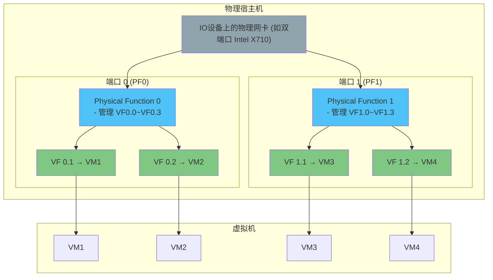
```mermaid
graph TB
    subgraph "物理宿主机"
        NIC["IO设备上的物理网卡 (如双端口 Intel X710)"]
        
        subgraph "端口 0 (PF0)"
            PF0["Physical Function 0\n- 管理 VF0.0~VF0.3"]
            VF01["VF 0.1 → VM1"]
            VF02["VF 0.2 → VM2"]
        end

        subgraph "端口 1 (PF1)"
            PF1["Physical Function 1\n- 管理 VF1.0~VF1.3"]
            VF11["VF 1.1 → VM3"]
            VF12["VF 1.2 → VM4"]
        end
    end

    subgraph "虚拟机"
        VM1["VM1"]
        VM2["VM2"]
        VM3["VM3"]
        VM4["VM4"]
    end

    %% 连接
    NIC --> PF0
    NIC --> PF1
    PF0 --> VF01
    PF0 --> VF02
    PF1 --> VF11
    PF1 --> VF12
    VF01 --> VM1
    VF02 --> VM2
    VF11 --> VM3
    VF12 --> VM4

    style PF0 fill:#4fc3f7
    style PF1 fill:#4fc3f7
    style VF01 fill:#81c784
    style VF02 fill:#81c784
    style VF11 fill:#81c784
    style VF12 fill:#81c784
    style NIC fill:#90a4ae


```

| 术语                                      | 正确理解                                                     |
| ----------------------------------------- | ------------------------------------------------------------ |
| **SR-IOV**                                | **PCIe 设备功能扩展规范**，不是“基本单位”                    |
| **PF**                                    | **支持 SR-IOV 的 PCIe 设备的“根管理单元”**，是 SR-IOV 功能的起点 |
| **VF**                                    | **由 PF 创建的轻量级功能**，用于直通给 VM                    |
| **一个物理设备(IO设备)是否可有多个 PF？** | ✅ **可以**（取决于硬件设计，如多端口网卡）                   |
| **一个 PF 是否可有多个 VF？**             | ✅ **可以**（由 SR-IOV 规范定义，数量由硬件决定）             |

### 数据传输

又到了我么绕不开的DMA过程：

一个虚拟机想写一个数据，首先就是要有自己写入的GPA，然后要经过我们上文踢提到的IOMMU模块转化成HPA。

那么如果一个VF想实现数据传输，就需要维持一个全局唯一的标识符SrcID，IOMMU通过这个SrcID找到设备挂载的虚拟机，然后找到这个虚拟机的IO内存地址的映射，从而找到GPA到HPA的映射。这个虚拟机和VF交互的过程和上面的设备透传思路大同小异，“异”就在于SR-IOV是专门为虚拟环境设计的，对虚拟环境有一些优化：

- 比如加入本地告诉缓存，存储本地GPA到HPA的映射，一些场景下就不用走上面那个过程了

那么Vmm参与了吗？

### 中断

我们忽略了一个下游环节，一个告诉vCPU IO过程已经完成的步骤，而在这个过程中，vCPU的就是Vmm看管的，这个过程就是**中断**。如果一个SR-IOV设备想发出一个中断请求，它首先是需要经过VMM来处理，VMM将他投递给正确的虚拟机，vCPU在这个过程中就涉及到了Vm exit

SR-IOV提供了很好的标准范式，减少了很多`Vm exit`的同时实现了一个物理IO设备被多个虚拟设备的利用。但是因为这个过程其实是极度相似于设备透传的，所以也就难免在热迁移上面很难支持

# 中断虚拟化

这部分其实是设备虚拟化的后继内容，但是因为非常重要就单独列出来了。

## 中断的基本机制

注意，这部分是在物理机上面先简单了解一下中断机制

中断可以分为 内部中断 和 外部中断 ，我们设备引起的中断就属于外部中断

### PIC机制

**PIC**（Programmable Interrupt Controller，可编程中断控制器）是 x86 架构早期用于管理硬件中断的核心芯片。在虚拟化和现代系统中，理解 PIC 对掌握中断机制（包括中断虚拟化）非常重要。一个PIC有八个引脚，不够用的话可以通过引脚连PIC的方式去拓展（有点像集线器套集线器）。中断的简单过程：

1. 设备执行完成之后，通过PIC的一个引脚把完成的消息传给PIC
2. PIC接收到之后，将会通过一个专门的**中断引脚**向CPU发送一个中断请求
3. CPU接到这个请求之后，会用自己的另一个引脚发送一个acknowledgement，表示自己接收到了这个中断
4. 为了知道这个中断是什么中断，CPU接着会再给PIC发一个请求
5. PIC收到这个请求之后，会把这次中断转化成一个唯一中断标识符——**中断向量**，相应的PIC就会把这个向量发送给CPU
6. CPU会维护一个中断向量的标识符表（x86架构下叫做IDT），这个表存放的是各个中断向量以及它要跳转到的执行逻辑，这个执行逻辑通常是由操作系统来定义的

其他的话可能还有一些细节，比如在PIC中会有几组寄存器来维护它中断的状态，CPU也可以屏蔽中断来给PIC发送请求。

PIC是早期CPU的中断机制，适合于单核CPU架构

### APIC机制

**APIC 既适合多核 CPU，也适合多 CPU（多插槽）系统。**

- 在这个结构下，中断处理器的单位是LAPIC，每个CPU对应一个LAPIC，这个LAPIC继承了上面PIC的功能之外又有一些其他功能
- IO APIC ：在设备和LAPIC层之间，可以将设备的中断信息发送给任意一个LAPIC从而发送给CPU（转发机制可以由操作系统配置）

```mermaid
graph TB
    subgraph "CPU 0 (多核)"
        Core0["Core 0\nLocal APIC 0"]
        Core1["Core 1\nLocal APIC 1"]
        Core2["Core 2\nLocal APIC 2"]
    end

    subgraph "CPU 1 (多核)"
        Core3["Core 3\nLocal APIC 3"]
        Core4["Core 4\nLocal APIC 4"]
        Core5["Core 5\nLocal APIC 5"]
    end

    subgraph "芯片组/SoC"
        IOAPIC["I/O APIC\n- 接收设备中断\n- 中断重定向表"]
    end

    subgraph "外设"
        NIC["网卡\nIRQ 16"]
        Disk["磁盘\nIRQ 17"]
        USB["USB控制器\nIRQ 18"]
        GPU["GPU\nIRQ 19"]
    end

    %% 中断流向
    NIC --> IOAPIC
    Disk --> IOAPIC
    USB --> IOAPIC
    GPU --> IOAPIC

    IOAPIC --> Core0
    IOAPIC --> Core1
    IOAPIC --> Core3
    IOAPIC --> Core4

    %% 核间通信
    Core0 -.->|"IPI (核间中断)"| Core1
    Core3 -.->|"IPI"| Core4

    style Core0 fill:#e3f2fd
    style Core1 fill:#e3f2fd
    style Core2 fill:#e3f2fd
    style Core3 fill:#e3f2fd
    style Core4 fill:#e3f2fd
    style Core5 fill:#e3f2fd
    style IOAPIC fill:#c8e6c9
    style NIC fill:#ffccbc
    style Disk fill:#ffccbc
    style USB fill:#ffccbc
    style GPU fill:#ffccbc


```

## 虚拟化

这部分基于APIC来说。

Vmm需要给每一个虚拟机虚拟出来一套VPIC：包含LAPIC  IOAPIC

需要完成的两个核心操作（**截获+模拟**）：

1. 虚拟机CPU对设备的访问
2. 设备对CPU的中断注入

### 截获

CPU对设备的访问通过MMIO来实现

**MMIO**（Memory-Mapped I/O，内存映射 I/O）是一种 **CPU 与 I/O 设备通信的机制**，其核心思想是：

> **把 I/O 设备的寄存器或控制/数据缓冲区映射到 CPU 的物理地址空间中，让 CPU 像访问普通内存一样读写设备**。

虚拟机想进行操作，比如暂停vPIC的中断，就会去访问特定的内存地址。VMM 通过将虚拟 LAPIC 和 IOAPIC 的 MMIO 地址区域（如 `0xFEE00000`）在 EPT/NPT 中**标记为不可直接访问**，使得虚拟机 vCPU 对这些地址的读写触发 VM-exit，从而由 VMM 截获并模拟相应的虚拟中断控制器行为（如暂停中断、读取 IRR 等）。

### 中断注入

难点在于可能有各种不同的中断，分别走向各个虚拟机，怎么做到准确对应是很关键的。设备中断来源有两种：

1. 纯软件设备发出的中断（这种设备是完全由Vmm模拟的，中断的信号也是由Vmm来实现并且注入给指定的虚拟机）
2. 物理透传设备发出的中断，这种设备连接的是物理主机上的APIC，因此他产生中断时，跳转到的是物理主机上的中断向量表对应的逻辑（但是这个挂给了一个虚拟机，要怎么对应很关键）
   - 这时候，这个中断向量表对应的逻辑是由VMM开定义的，因此在这段逻辑中Vmm就可以判断中断应该注入给哪个虚拟机
   - Vmm还要判断注入什么（不能把**原始向量**直接注入给虚拟机，因为这个表和虚拟机vCPU中的不一定一样），也就是做一个中断向量向**虚拟机视角下的中断向量**的一个转化，然后再投递给虚拟机（这样的话虚拟机根据这个跳转到自己的IDT，才会执行我们设想中的中断逻辑）

在上面的讨论中，我们知道了 注入什么（ps：向量需要转化本质上就是存的向量表是不一样的，好比说物理机这里的向量1是loop，虚拟机1存的是add），下面我们继续讨论两个问题：

1. 什么时候注入这个中断（可以看着部分之前看一下vCPU部分的总结）
   - 在硬件辅助虚拟化下，实际上是每个虚拟机来轮流使用CPU。我们在CPU虚拟化中了解了VM entry和VM exit，而中断就是在这两个过程之间注入的
   - 在每次进行Vm-Entry之前，Vmm会检查虚拟机是否有待注入的中断。如果有的话会把这个中断写入CPU的指定内存区域中，然后再开始执行虚拟机模式下，CPU就会正确的跳转到虚拟机的中断向量表里面对应的逻辑执行，并且退出到Vmm状态
   - 而在这个过程中，会引起一次Vm-exit，从而影响中断处理的性能，这就需要引入**Interrupt Posting（中断直投）机制**
2. 如何注入

#### 两种中断模式

**Interrupt Posting（中断直投）机制** 是 Intel VT-x 虚拟化中的一项**高性能中断虚拟化技术**，目的是**避免因外部中断导致不必要的 VM-Exit**，从而显著提升虚拟机的中断处理性能。

其核心目标是：**让外部中断直接、高效地投递给正在运行的 vCPU，无需先退出到 VMM（即避免“中断 → VM-Exit → 注入 → VM-Entry”的开销）。**

下面我们来解释这两种场景下的中断到底发生了什么


情况一：**没有 Interrupt Posting（传统硬件辅助虚拟化）**

这是 Intel VT-x / AMD-V 的**基础模式**，也是早期 KVM/Xen 的默认行为。

中断处理流程：

1. 物理设备产生中断（如网卡收到包）；
2. CPU 正在运行 Guest（Non-Root 模式）；
3. **硬件强制触发 VM-Exit**（因为外部中断默认会退出到 VMM）；
4. VMM（如 KVM）在 VM-Exit handler 中：
   - 读取中断源，
   - 判断该中断属于哪个 vCPU，
   - 标记该 vCPU 有 pending 虚拟中断；
5. VMM 执行 **VM-Entry**，并在进入前通过 VMCS **注入虚拟中断**；
6. Guest 开始执行自己的 ISR。

 **结论**：

> **在没有 Interrupt Posting 的情况下，每次外部中断都会导致一次 VM-Exit，VM 会暂时失去 CPU 使用权。**

但这**仅限于“外部物理中断”**。如果是 VMM 主动注入的中断（比如模拟定时器），可以在下次调度时直接注入，不额外触发退出。


情况二：**启用 Interrupt Posting（高级优化模式）**

这是 Intel **APICv（Advanced Programmable Interrupt Controller Virtualization）** 的一部分。

中断处理流程：

1. 外部中断到来；
2. 如果目标 vCPU **正在运行**：
   - 硬件直接将中断 vector 写入该 vCPU 的 **Posted-Interrupt Descriptor（PIR）**；
   - CPU 自动触发一个轻量级通知中断（Notification Vector）；
   - Guest 直接处理，**全程无 VM-Exit**。
3. 如果 vCPU **未运行**：
   - 写入 PIR + 发送 notification event 唤醒 VMM；
   - 下次调度时正常注入。

**结论**：

> **启用 Posted Interrupt 后，正在运行的 vCPU 可以“零 VM-Exit”处理外部中断，不失去 CPU 使用权。**

# GPU虚拟化

[GPU虚拟化&技术解析（vGPU，MxGPU）GPU虚拟化就是将一个物理GPU切分为多个虚拟CPU以供不同虚拟机使用（G - 掘金](https://juejin.cn/post/7321410893680787493)

[Hyper-V虚拟化平台GPU分区和GPU半虚拟化技术比较及应用建议 - 朵拉云 - 博客园](https://www.cnblogs.com/doracloud/p/18880582)

GPU必须要在Host上面，不能说一个GPU被两个Host使用：

- GPU 是通过 PCIe 总线插在某一台物理服务器（Host）主板上的设备。它只能被该 Host 的 CPU 和内存子系统直接访问。
- IOMMU（如 Intel VT-d、AMD-Vi）是在每个 Host 主板芯片组中实现的，用于为该 Host 上的虚拟机提供设备 DMA 地址转换和隔离。它无法跨机器工作。
- 无论是 NVIDIA vGPU Manager、MIG 分区工具，还是 VFIO 驱动，都必须安装在拥有该 GPU 的 Host 操作系统上。

下面是详细了解

## GPU是什么


在看GPU虚拟化之前，我们有必要理解GPU到底是什么样的一个设备。这个设备

- 在计算机系统结构这门课没有相关介绍，属于是一个新兴的技术，带高显卡价格的三个最重要方面：游戏、挖矿和模型训练，这也就是我们最直观感受到的三个功能
  - 游戏：**图像渲染**
  - 模型训练：**高性能计算**
  - 挖矿：相比于ASIC矿机，GPU在memory hard以太坊挖矿中的广泛使用还体现了另一个功能——**显存**

说完了功能，我们来看一下为什么说GPU比CPU强大？GPU又为什么不能替代CPU？

答案就是CPU工作方式和GPU的工作方式截然不同，下面的两张图有助于帮助我们理解CPU和GPU的工作方式的不同——Core


- 绿色代表的是computational units(CU 可计算单元) 每一个绿色的称为 CU cores(核心)
- 橙色代表memories（内存） 
- 黄色代表的是control units（控制单元）。

### **计算单元 (cores)**

总的来看，我们可以这样说：CPU的计算单元是“大”而“少”的，然而GPU的计算单是“小”而“多”的。

这里的大小是指的计算能力，多少指的是设备中的数量。通过观察上图，显然可以看出，计算单元（绿色的部分），CPU“大少”，GPU“小多”的特点。CPU的cores 比GPU的cores要更加聪明(smarter)，这也是所谓“大”的特点。在过去的很长时间里，CPU的core计算能力增长是得益于**主频时钟**最大的频率增长。

相反，GPU不仅没有主频时钟的提升，而且还经历过主频下降的情况，因为GPU需要适应嵌入式应用环境，在这个环境下对功耗的要求是比较高的，不能容忍超高主频的存在。例如英伟达的Jetson NANO, 安装在室内导航机器人身上，就是一个很好的嵌入式环境应用示例，安装在机器人身上，就意味着使用电池供电，GPU的功耗不可以过高。

CPU比GPU聪明，很大一个原因就是CPU拥有**"out-of-order exectutions"**（乱序执行）功能。出于优化的目的，CPU可以用不同于输入指令的顺序执行指令，当遇到分支的时候，它可以预测在不久的将来哪一个指令最有可能被执行到（multiple branch prediction 多重分支预测）。通过这种方式，它可以预先准备好操作数，并且提前执行他们（soeculative execution 预测执行），通过上述的几种方式节省了程序运行时间。

显然现代CPU拥有如此多的提升性能的机制，这是比GPU聪明的地方。相比之下，GPU的core不能做任何类似out-of-order exectutions那样复杂的事情。

总的来说，**GPU的core只能做一些最简单的浮点运算**,例如 multiply-add(MAD)或者 fused multiply-add(FMA)指令。


通过上图可以看出MAD指令实际是计算A*B+C的值。实际上，**现代GPU结构，CORE不仅仅可以结算FMA这样简单的运算，还可以执行更加复杂的运算操作**，例如tensor张量(tensor core)或者光线追踪(ray tracing core)相关的操作。


张量核心 (tensor cores) 的目的在于服务张量操作在一些人工智能运算场合，光纤追踪（ray tracing） 旨在服务超现实主义（hyper-realistic）实时渲染的场合。

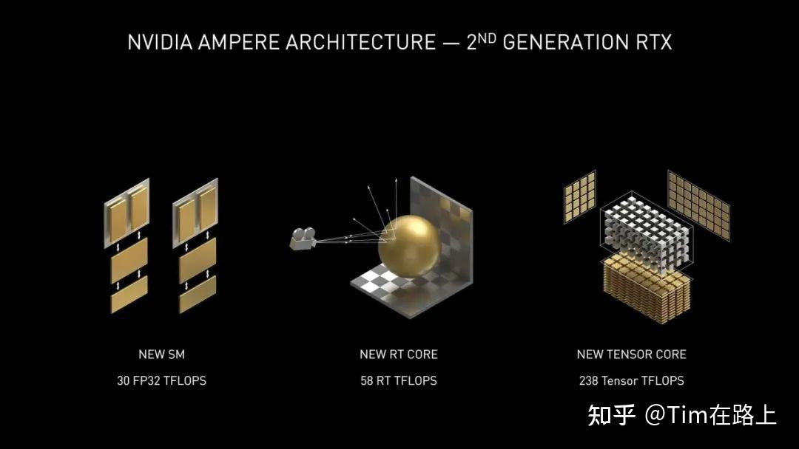

上文说到，GPU Core最开始只是支持一些简单的浮点运算FMA, 后来经过发展又增加了一些复杂运算的机制tensor core以及ray trace，但是总体来说GPU的计算灵活性还是比不上CPU的核心。值得一提的是，GPU的编程方式是[SIMD](https://zhida.zhihu.com/search?content_id=238797286&content_type=Article&match_order=1&q=SIMD&zhida_source=entity)(Single Instruction Multiple Data)意味着**所有Core的计算操作完全是在相同的时间内进行的**，但是输入的数据有所不同。显然，GPU的优势不在于核心的处理能力，而是在于他可以**大规模并行处理数据**

GPU中每个核心的作用有点像罗马帆船上的桨手：鼓手打着节拍（时钟），桨手跟着节拍一同滑动帆船。SIMD编程模型允许加速运行非常多的应用，对图像进行缩放就是一个很好的例子。在这个例子中，**每个core对应图像的一个像素点**，这样就可以并行的处理每一个像素点的缩放操作，如果这个工作给到CPU来做，需要N的时间才可以做完，但是给到GPU只需要一个时钟周期就可以完成。

当然，这样做的前提是有**足够的core来覆盖所有的图像像素点**。这个问题有个显著的特点，就是对一张图像进行缩放操作，**各个像素点之间的信息是相互独立的**，因此可以独立的放在不同的core中进行并行运算。我们认为不同的core操作的信息相互独立，是符合SIMD的模型的，使用SIMD来解决这样的问题非常方便。

但是，也不是所有的问题都是符合SIMD模型的，尤其在**异步问题**中，在这样的问题中，不同的core之间要相互交互信息，计算的结构不规则，负载不均衡，这样的问题交给GPU来处理就会比较复杂。

### **内存 memory**

CPU的memory系统一般是基于DRAM的，在桌面PC中，一般来说是8G，在服务器中能达到数百（256）Gbyte。

CPU内存系统中有个重要的概念就是**cache，是用来减少CPU访问DRAM的时间**。cache是一片小的内存区域，但是访问速度更快，更加靠近处理器核心的内存段，用来储存DRAM中的数据副本。

> **DRAM** 是 **Dynamic Random Access Memory** 的缩写，中文名为**动态随机存取存储器**，是目前电脑、服务器、移动设备中最主流的内存类型（我们常说的 DDR4、DDR5 内存都属于 DRAM）。
>
> DRAM 的存储单元由一个**电容**和一个**晶体管**组成，数据以电容的电荷状态表示（带电 = 1，不带电 = 0）。但电容存在**漏电现象**，电荷会随时间流失，因此需要**周期性刷新（Refresh）** 才能维持数据，这也是它被称为 “动态” 的原因。

cache一般有一个分级，通常分为三个级别L1，L2，L3 cache，cache离核心越近就越小访问越快，例如 L1可以是64KB L2就是256KB L3是4MB。

```mermaid
graph TB
    subgraph "CPU Core 1"
        Reg1[寄存器]
        L11[L1 Cache]
        L21[L2 Cache]
        Reg1 --> L11
        L11 --> L21
    end

    subgraph "CPU Core 2"
        Reg2[寄存器]
        L12[L1 Cache]
        L22[L2 Cache]
        Reg2 --> L12
        L12 --> L22
    end

    subgraph "CPU Core n"
        RegN[寄存器]
        L1N[L1 Cache]
        L2N[L2 Cache]
        RegN --> L1N
        L1N --> L2N
    end

    L21 --> L3[L3 Cache]
    L22 --> L3
    L2N --> L3

    L3 --> MEM[主内存]

    style Reg1 fill:#e1f5fe
    style Reg2 fill:#e1f5fe
    style RegN fill:#e1f5fe
    style L11 fill:#f3e5f5
    style L12 fill:#f3e5f5
    style L1N fill:#f3e5f5
    style L21 fill:#e8f5e8
    style L22 fill:#e8f5e8
    style L2N fill:#e8f5e8
    style L3 fill:#fff3e0
    style MEM fill:#ffebee
    style Reg1 stroke:#0277bd,stroke-width:2px
    style Reg2 stroke:#0277bd,stroke-width:2px
    style RegN stroke:#0277bd,stroke-width:2px
    style L11 stroke:#4a148c,stroke-width:2px
    style L12 stroke:#4a148c,stroke-width:2px
    style L1N stroke:#4a148c,stroke-width:2px
    style L21 stroke:#2e7d32,stroke-width:2px
    style L22 stroke:#2e7d32,stroke-width:2px
    style L2N stroke:#2e7d32,stroke-width:2px
    style L3 stroke:#f57c00,stroke-width:2px
    style MEM stroke:#c62828,stroke-width:2px


```

从第一张图(还是最上面那个)可以看到GPU中有一大片橙色的内存，名称为DRAM，这一块被称为全局内存或者[GMEM](https://zhida.zhihu.com/search?content_id=238797286&content_type=Article&match_order=1&q=GMEM&zhida_source=entity)。GMEM的内存大小要比CPU的DRAM小的多，在最便宜的显卡中一般只有几个G的大小，在最好的显卡中GMEM可以达到24G。GMEM的尺寸大小是科学计算使用中的主要限制。十年前，显卡的容量最多也就只有512M,但是，现在已经完全克服了这个问题。关于cache，从第一张图中不难推断，左上角的小橙色块就是GPU的cache段。然而GPU的缓存机制和CPU是存在一定的差异的，稍后将会证明这一点。

### **GPU的底层结构**

为了充分理解GPU的架构，让我们在返回来看下第一张图，一个显卡中绝大多数都是计算核心core组成的海洋。在图像缩放的例子中，core与core之间不需要任何协作，因为他们的任务是完全独立的，然而，GPU解决的问题不一定这么简单，让我们来举个例子。

假设我们需要对一个**数组里的数进行求和**，这样的运算属于`reductuin family`类型，因为这样的运算试图将一个序列“reduce”简化为一个数。计算数组的元素总和的操作看起来是顺序的，我们只需要获取第一个元素，求和到第二个元素中，获取结果，再将结果求和到第三个元素，以此类推。


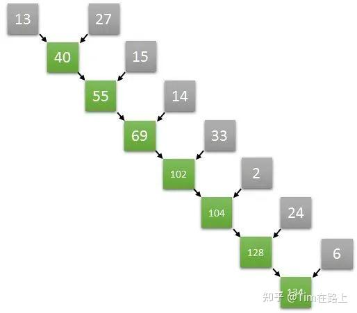


令人惊讶的是，一些看起来本质是顺序的运算，其实可以再并行算法中转化。

假设一个长度为8的数组，在第一步中完全可以并行执行两个元素和两个元素的求和，从而同时获得四个元素，两两相加的结果，以此类推，通过并行的方式加速数组求和的运算速度。具体的操作如下图所示：


如上图计算方式，如果是长度为8的数组两两并行求和计算，那么只需要三次就可以计算出结果。

如果是顺序计算需要8次。如果按照两两并行相加的算法，N个数字相加，那么仅需要log2（N）次就可以完成计算。

从GPU的角度来讲，只需要**四个core就可以完成长度为8的数组求和算法**，我们将四个core编号为0，1，2，3。

那么第一个时钟下，两两相加的结果通过0号core计算，放入了0号core可以访问到的内存中，另外两两对分别由1号2号3号core来计算，第二个个时钟继续按照之前的算法计算，只需要0号和1号两个core即可完成。

以此类推，最终的结果将在第三个时钟由0号core计算完成，并储存在0号core可以访问到的内存中。这样实际三次就能完成长度为8的数组求和计算。


如果GPU想要完成上述的推理计算过程，显然，多个core之间要可以共享一段内存空间以此来完成数据之间的交互，需要多个core可以在共享的内存空间中完成读/写的操作。

我们希望每个Cores都有交互数据的能力，但是不幸的是，一个GPU里面可以包含数以千计的core，如果使得这些core都可以访问共享的内存段是非常困难和昂贵的。

出于成本的考虑，折中的解决方案是**将各类GPU的core分类为多个组**，形成多个流处理器([Streaming Multiprocessors](https://zhida.zhihu.com/search?content_id=238797286&content_type=Article&match_order=1&q=Streaming+Multiprocessors&zhida_source=entity) )或者简称为SMs。

### **GPU架构**


- 上图的**绿色部分意味着Core计算单元**
- 绿色的**块就是上文谈到的Streaming Multiprocessors**，理解为Core的集合。
- 黄色的部分名为**RT COREs**画的离SMs非常近。单个SM的图灵架构如下图所示

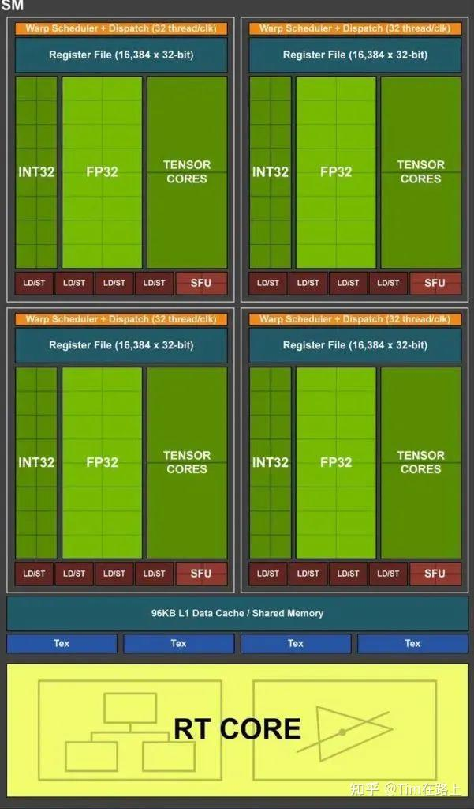

在SM的图灵结构中，绿色的部分CORE相关的，我们进一步区分了**不同类型的CORE**。主要分为INT32,FP32，TENSOR CORES。

1. **FP32 Cores，执行单进度浮点运算**，在TU102卡中，每个SM由64个FP32核，TU120由72个SMs因此，FP32 Core的数量是 72 * 64。
2. FP64 Cores. 实际上每个SM都包含了2个64位浮点计算核心FP64 Cores，用来计算双精度浮点运算，虽然上图没有画出，但是实际是存在的。
3. **Integer Cores，这些core执行一些对整数的操作**，例如地址计算，可以和浮点运算同时执行指令。在前几代GPU中，执行这些整型操作指令都会使得浮点运算的管道停止工作。TU102总共由4608个Integer Cores，每个SM有64个SM。
4. **Tensor Cores，张量core是FP16单元的变种**，认为是半精度单元，致力于张量积算加速常见的深度学习操作。

图灵张量Core还可以执行INT8和INT4精度的操作，用于可以接受量化而且不需要FP16精度的应用场景，在TU102中，我们每个SM有8个张量Cores，一共有8 * 72个Tensor Cores。

在大致描述了GPU的执行部分之后，让我们回到上文提出的问题，各个核心之间如何完成彼此的协作？

在四个SM块的底部有一个96KB的L1 Cache，用浅蓝色标注的。这个cache段是允许各个Core都可以访问的段，在L1 Cache中每个SM都有一块专用的共享内存。

作为芯片上的L1 cache他的大小是有限的，但它非常快，肯定比访问GMEM快得多。

实际上L1 CACHE拥有两个功能，一个是用于SM上Core之间相互共享内存，另一个则是普通的cache功能。

当Core需要协同工作，并且彼此交换结果的时候，编译器编译后的指令会将部分结果储存在共享内存中，以便于不同的core获取到对应数据。

当用做普通cache功能的时候，当core需要访问GMEM数据的时候，首先会在L1中查找，如果没找到，则回去L2 cache中寻找，如果L2 cache也没有，则会从GMEM中获取数据，L1访问最快 L2 以及GMEM递减。

缓存中的数据将会持续存在，除非出现新的数据做替换。从这个角度来看，如果Core需要从GMEM中多次访问数据，那么编程者应该将这块数据放入功能内存中，以加快他们的获取速度。

其实可以将共享内存理解为一段受控制的cache，事实上L1 cache和共享内存是同一块电路中实现的。编程者有权决定L1 的内存多少是用作cache多少是用作共享内存。

最后，也是比较重要的是，可以储存各个core的计算中间结果，用于各个核心之间共享的内存段不仅仅可以是共享内存L1，也可以是寄存器，寄存器是离core最近的内存段，但是也非常小。

最底层的思想是每个线程都可以拥有一个寄存器来储存中间结果，每个寄存器只能由相同的一个线程来访问，或者由相同的warp或者组的线程访问。

### **总结**

GPU的基本底层构成，主要是以GPU计算核心 Cores,以及Memory以及控制单元，三大组成要素组成。

Core是计算的基本单元，既可以用作简单的浮点运算，又可以做一些复杂的运算例如，tensor 或者ray tracing。

多个core之间通讯的方式：

- **在特定的应用场合多个core之间是不需要的通讯的**，也就是各干各的（例如 图像缩放）。
- 但是也有一些例子，多个core之间要相互通讯配合（例如上文谈到的数组求和问题），每个core之间都可以实现交互数据是非常昂贵的，因此提出了SMs的概念，SMs是多个core的集合，**一个SMs里面的cores可以通过L1 Cache进行交互信息**，完成使用GPU处理数组求和问题的时候，多个核心共享数据的功能。

关于memory，存在全局的内存GMEM，但是访问较慢，Cores当需要访问GMEM的时候会首先访问L1,L2如果都miss了，那么才会花费大代价到GMEM中寻找数据。

## GPU虚拟化方案

GPU虚拟化技术允许**多个虚拟机或容器**共享同一块物理GPU，提高了资源的利用率和灵活性。在云计算中，GPU虚拟化主要通过以下几种方式实现资源分配：

1. **软件模拟（Software Emulation / Paravirtualization）**：也称为半虚拟化，通过软件模拟GPU的功能，但这种方式性能损失较大，不适合生产环境。
   - **例子**：QEMU 在没有硬件加速的情况下，使用 `virtio-gpu` 模拟一个基本的图形设备，仅能支持简单的桌面显示，无法运行 3D 渲染或 AI 训练任务。
   - **类比**：就像用纸笔手绘一辆汽车的驾驶体验——你能“想象”开车的感觉，但无法真正上路飙车。
2. **直通独占（pGPU, Physical GPU Passthrough）**：将整个物理GPU分配给一个虚拟机独占使用。这种方式简单且兼容性好，但不支持GPU资源的分割和热迁移。
   - **例子**：在 VMware vSphere 或 KVM 中，将一块 NVIDIA A100 GPU 完整直通给一台运行深度学习训练任务的虚拟机，该 VM 独占整块 GPU。
   - **类比**：如同把整辆跑车钥匙交给一个人——别人不能同时使用，哪怕他只是想听个音乐。
3. **直通共享（vGPU, SR-IOV-based）**：基于SR-IOV技术，将物理GPU虚拟化为多个虚拟GPU（vGPU），每个vGPU可以独立分配给不同的虚拟机使用。这种方式可以实现GPU资源的共享和隔离。
   - **例子**：NVIDIA Tesla T4 支持 SR-IOV，可划分为最多 16 个 vGPU，分别分配给 16 个云桌面用户，每人获得独立的图形加速能力。
   - **类比**：像把一栋大楼改造成多个独立公寓——水电（GPU 资源）各自计量，互不干扰，但共用同一栋建筑（物理 GPU）。

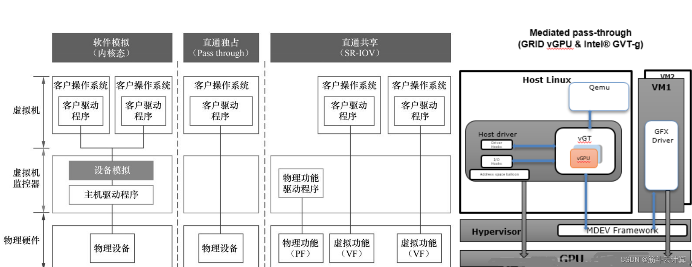

4. **GPU分片虚拟化（Mediated Passthrough / mdev）**：属于全虚拟化技术，通过VFIO mediated passthrough framework实现。这种方式可以将物理GPU的访问直接传递给虚拟机，同时拦截和模拟性能无关的MMIO访问。基于VFIO mediated passthrough framework的GPU虚拟化方案。该方案由NVIDIA提出，并联合Intel一起提交到了Linux kernel 4.10代码库，该方案的kernel部分代码简称mdev模块。把会影响性能的访问直接passthrough给虚拟机，把性能无关，功能性的MMIO访问做拦截并在mdev模块内做模拟。商业产品有NVIDIA GRID vGPU 与Intel的GVT-g系列，前者不开源，后者大部分开源。
   - **例子**：Intel 的 Data Center GPU Flex 系列或 NVIDIA A100（配合特定驱动）可通过 `mdev` 创建多个受控的虚拟设备，供 Kubernetes Pod 或 VM 使用。
   - **类比**：像银行柜台——客户（虚拟机）可以直接办理业务（访问 GPU 核心功能），但保安（mdev 驱动）会检查并代填一些非敏感表格（模拟 MMIO），确保安全又高效。

5. **多实例GPU（MIG）技术**：NVIDIA提出的技术，可以将单个GPU分区为多个完全隔离的vGPU实例，提高物理GPU的利用率。可将单个 GPU 分区为最多 7个完全的隔离vGPU实例，减少资源争抢的延时，提高物理 GPU 利用率。但可惜目前仅昂贵和国内禁售的NVIDIA A100 GPU 支持。

   - **例子**：一块 NVIDIA A100 GPU 可被划分为 7 个 MIG 实例（如 1g.5gb、2g.10gb 等配置），分别运行不同的推理服务，彼此内存、计算、缓存完全隔离。

   - **类比**：像把一块瑞士军刀拆成多个独立小工具——剪刀、螺丝刀、开瓶器各自独立工作，互不影响，但都来自同一把刀。

6. **Time-Slicing GPU（时间片共享）**：时间共享GPU技术，将GPU的流水线在时间维度上进行分割和共享，实现多个任务的并发执行。把本来再空间上并行（时间独占）的成百上千的GPU流水线进行的时间维度的分割和共享。各个GPU厂家都有类似的技术。英伟达的技术文档：https://docs.nvidia.com/datacenter/cloud-native/gpu-operator/latest/gpu-sharing.html 

   - **例子**：NVIDIA 的 Time-Sliced vGPU（如 GRID vGPU）允许多个虚拟机轮流使用同一块 GPU 的计算单元，适用于轻量级图形应用或低负载 AI 推理。

   - **类比**：像多人共用一台微波炉——大家按顺序加热食物（任务），虽然不能同时加热，但调度得当就能感觉“几乎同时”完成。

- 第四种是收费的，所以企业用户要去英伟达官网购买
- 第五种MIG则是买到昂贵的A100卡就能用了，不需要license
- 普通玩k8s的企业，则**用免费的Time-Slicing GPU (时间分片共享GPU)** 

### GPU软件模拟模式 (sGPU)

真实场景太少，存在于实验和理论层面

```mermaid
graph TB
    subgraph "虚拟化层"
        VMM[虚拟机监控器<br/>Virtual Machine Monitor<br/>如：QEMU/KVM]
        sGPU[软件GPU模拟器<br/>Software GPU Emulator<br/>如：virglrenderer]
    end

    subgraph "虚拟机 (VM)"
        GuestOS[Guest OS]
        GuestGPU[虚拟GPU设备<br/>如：Virtio-GPU]
        App1[应用程序1]
        App2[应用程序2]
    end

    subgraph "物理硬件"
        CPU[物理CPU]
        Memory[物理内存]
        GPU[物理GPU<br/>（不直接使用）]
    end

    %% 连接关系
    App1 --> GuestGPU
    App2 --> GuestGPU
    GuestGPU --> sGPU
    GuestOS --> App1
    GuestOS --> App2

    sGPU --> VMM
    VMM --> CPU
    VMM --> Memory
    VMM -.-> GPU

    %% 样式定义
    style sGPU fill:#ffcdd2,stroke:#c62828,stroke-width:2px
    style GuestGPU fill:#f8bbd9,stroke:#ad1457,stroke-width:2px
    style VMM fill:#e1bee7,stroke:#6a1b9a,stroke-width:2px
    style App1 fill:#c8e6c9,stroke:#388e3c,stroke-width:2px
    style App2 fill:#c8e6c9,stroke:#388e3c,stroke-width:2px
    style CPU fill:#bbdefb,stroke:#1976d2,stroke-width:2px
    style Memory fill:#b39ddb,stroke:#5e35b1,stroke-width:2px
    style GPU fill:#ffcc80,stroke:#f57c00,stroke-width:2px
    style GuestOS fill:#b2ebf2,stroke:#00838f,stroke-width:2px
    
    %% 虚线表示不直接使用物理GPU
    linkStyle 7 stroke-dasharray: 5 5,stroke:#ff5722


```

### GPU 直通模式 （pGPU）

几种GPU的虚拟化技术，直通是最早出现，即技术上最简单和成熟的方案。厂家（Nvidia ，AMD ，Intel等 ）的GPU，只要支持**IOMMU的理论**上都可以，即直通模式的实现依赖于IOMMU的功能。

优点：

- 原理简单。GPU直通模式的技术方案与虚拟化领域其他PCI直通（eg.网卡直通 ，USB 直通）原理相同
- 兼容性好。硬件驱动无需修改，不依赖GPU厂商，技术简单。所以小型GPU集群的运维的技术成本低，

缺点：

- 不支持热迁移/在线迁移（Live Migration）
- 不支持GPU资源的分割（即对显存的分割，所以出现了下文的几种技术）,不能充分利用高价买的GPU
- 缺少物理机层面的GPU性能监控API接口，在大型GPU集群中，这又导致运维成本上升。

安全性：

- 由于GPU的复杂性和安全隔离的要求，GPU直通技术相对于任何其他设备来说，会有额外的PCI 配置空间模拟和MMIO的拦截（参见QEMU VFIO quirk机制）。比如Hypervisor或者Device Module 不会允许虚拟机对GPU硬件关键寄存器的完全的访问权限

```mermaid
graph TB
    subgraph "宿主机 (Host)"
        Hypervisor[虚拟机监控器<br/>Hypervisor<br/>如：KVM/Xen/VMware]
        IOMMU[IOMMU<br/>Input/Output Memory Management Unit<br/>硬件地址转换与隔离]
        VFIO[VFIO驱动<br/>Virtual Function I/O<br/>安全设备访问框架]
    end

    subgraph "虚拟机 (VM)"
        GuestOS[Guest OS]
        GuestDriver[GPU驱动<br/>如：NVIDIA驱动]
        App[GPU应用程序]
    end

    subgraph "物理硬件"
        CPU[物理CPU]
        Memory[物理内存]
        GPU[物理GPU<br/>直通给虚拟机]
        PCIe[PCIe总线]
    end

    %% 连接关系
    App --> GuestDriver
    GuestDriver --> GuestOS
    GuestOS --> Hypervisor

    Hypervisor --> VFIO
    VFIO --> IOMMU
    IOMMU --> GPU
    GPU --> PCIe
    PCIe --> CPU
    PCIe --> Memory

    %% 安全机制标注
    subgraph "安全机制"
        Quirk[VFIO Quirk<br/>PCI配置空间模拟<br/>MMIO拦截]
        Isolation[硬件级隔离<br/>GPU寄存器访问控制]
    end

    VFIO --> Quirk
    VFIO --> Isolation

    %% 样式定义
    style Hypervisor fill:#e1f5fe,stroke:#0277bd,stroke-width:2px
    style IOMMU fill:#f3e5f5,stroke:#4a148c,stroke-width:2px
    style VFIO fill:#e8f5e8,stroke:#2e7d32,stroke-width:2px
    style GuestOS fill:#fff3e0,stroke:#f57c00,stroke-width:2px
    style GuestDriver fill:#ffebee,stroke:#c62828,stroke-width:2px
    style App fill:#e0f2f1,stroke:#00695c,stroke-width:2px
    style GPU fill:#fce4ec,stroke:#ad1457,stroke-width:3px
    style CPU fill:#bbdefb,stroke:#1976d2,stroke-width:2px
    style Memory fill:#c8e6c9,stroke:#388e3c,stroke-width:2px
    style PCIe fill:#f8bbd9,stroke:#ad1457,stroke-width:2px
    style Quirk fill:#fff9c4,stroke:#f57f17,stroke-width:2px
    style Isolation fill:#dcedc8,stroke:#558b2f,stroke-width:2px

    %% 特殊连接线样式


```

### GPU 全虚拟化（vGPU）

原理：在硬件实现GPU全虚拟化，将虚拟图形处理单元（vGPU）透传给虚拟机使用。

GPU全虚拟化技术先后有SR-IOV(开源技术) 。还有vGPU 、MIG。它们虚拟出来的GPU都是vGPU。

GPU虚拟化的实现原理简介：

物理GPU虚拟化为多个虚拟机GPU，每个虚拟GPU直接分配给虚拟机使用，通过软件调度的方式在主机（Host）与计算机的来宾账户（Guest）之间提供一个中间设备来允许Guest虚拟机访问Host中的物理GPU。

NVIDIA 官网说的Grid vGPU优势:

- 安全性高。具有完全输入输出内存管理单元（ IOMMU ）保护的虚拟机能够同时直接访问单个物理 GPU 。
- 通过实时虚拟机迁移进行虚拟机管理
- 支持运行混合的 VDI 和计算工作负载，以及与许多行业虚拟机监控程序的集成。

```mermaid
graph TB
    subgraph "宿主机 (Host)"
        Hypervisor[虚拟机监控器<br/>Hypervisor<br/>如：KVM/Xen/VMware]
        GPUManager[GPU管理器<br/>GPU Manager<br/>如：NVIDIA Grid vGPU Manager]
        VMM[虚拟机管理器<br/>VM Manager]
    end

    subgraph "物理GPU"
        PhysicalGPU[物理GPU<br/>如：NVIDIA T4/A10<br/>支持虚拟化]
        VGPU1[vGPU实例1]
        VGPU2[vGPU实例2]
        VGPU3[vGPU实例n]
        PhysicalGPU --> VGPU1
        PhysicalGPU --> VGPU2
        PhysicalGPU --> VGPU3
    end

    subgraph "虚拟机1 (VM1)"
        GuestOS1[Guest OS]
        GuestDriver1[GPU驱动]
        App1[GPU应用程序]
    end

    subgraph "虚拟机2 (VM2)"
        GuestOS2[Guest OS]
        GuestDriver2[GPU驱动]
        App2[GPU应用程序]
    end

    subgraph "虚拟机n (VMn)"
        GuestOSn[Guest OS]
        GuestDrivern[GPU驱动]
        Appn[GPU应用程序]
    end

    subgraph "安全机制"
        IOMMU[IOMMU<br/>输入输出内存管理单元<br/>硬件级隔离]
        Scheduler[调度器<br/>资源调度与隔离]
    end

    %% 连接关系
    Hypervisor --> GPUManager
    GPUManager --> PhysicalGPU
    VGPU1 --> GuestOS1
    VGPU2 --> GuestOS2
    VGPU3 --> GuestOSn

    GuestOS1 --> GuestDriver1
    GuestDriver1 --> App1

    GuestOS2 --> GuestDriver2
    GuestDriver2 --> App2

    GuestOSn --> GuestDrivern
    GuestDrivern --> Appn

    IOMMU --> VGPU1
    IOMMU --> VGPU2
    IOMMU --> VGPU3

    GPUManager --> Scheduler

    %% 样式定义
    style Hypervisor fill:#e1f5fe,stroke:#0277bd,stroke-width:2px
    style GPUManager fill:#f3e5f5,stroke:#4a148c,stroke-width:2px
    style PhysicalGPU fill:#ffcdd2,stroke:#c62828,stroke-width:3px
    style VGPU1 fill:#c8e6c9,stroke:#388e3c,stroke-width:2px
    style VGPU2 fill:#c8e6c9,stroke:#388e3c,stroke-width:2px
    style VGPU3 fill:#c8e6c9,stroke:#388e3c,stroke-width:2px
    style GuestOS1 fill:#bbdefb,stroke:#1976d2,stroke-width:2px
    style GuestOS2 fill:#bbdefb,stroke:#1976d2,stroke-width:2px
    style GuestOSn fill:#bbdefb,stroke:#1976d2,stroke-width:2px
    style GuestDriver1 fill:#fff3e0,stroke:#f57c00,stroke-width:2px
    style GuestDriver2 fill:#fff3e0,stroke:#f57c00,stroke-width:2px
    style GuestDrivern fill:#fff3e0,stroke:#f57c00,stroke-width:2px
    style App1 fill:#e0f2f1,stroke:#00695c,stroke-width:2px
    style App2 fill:#e0f2f1,stroke:#00695c,stroke-width:2px
    style Appn fill:#e0f2f1,stroke:#00695c,stroke-width:2px
    style IOMMU fill:#f8bbd9,stroke:#ad1457,stroke-width:2px
    style Scheduler fill:#dcedc8,stroke:#558b2f,stroke-width:2px
    style VMM fill:#e8f5e8,stroke:#2e7d32,stroke-width:2px

    %% 特殊连接线样式
    linkStyle 0 stroke-width:3px,stroke:#ff5722
    linkStyle 1 stroke-width:3px,stroke:#ff5722


```

Grid vGPU劣势：使用NVIDIA 的vGPU需要license，这块费用需要考虑在技术选型里面。

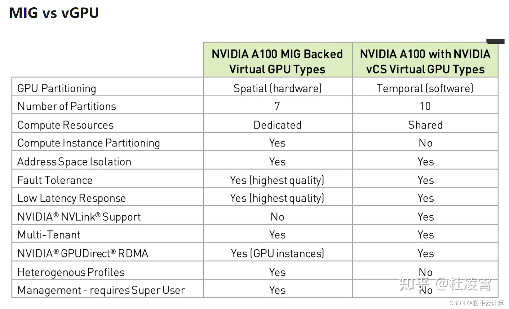

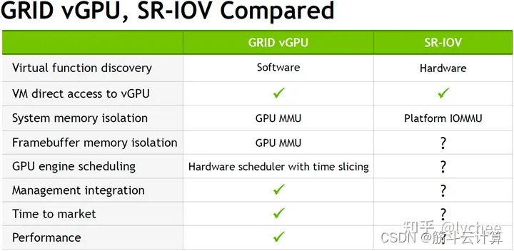

### 英伟达GPU虚拟化技术的对比

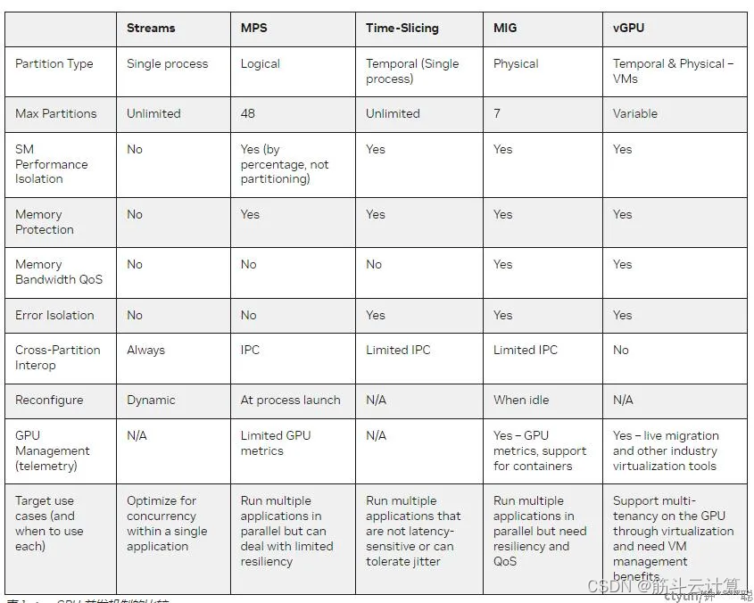

## 发展历史与作用

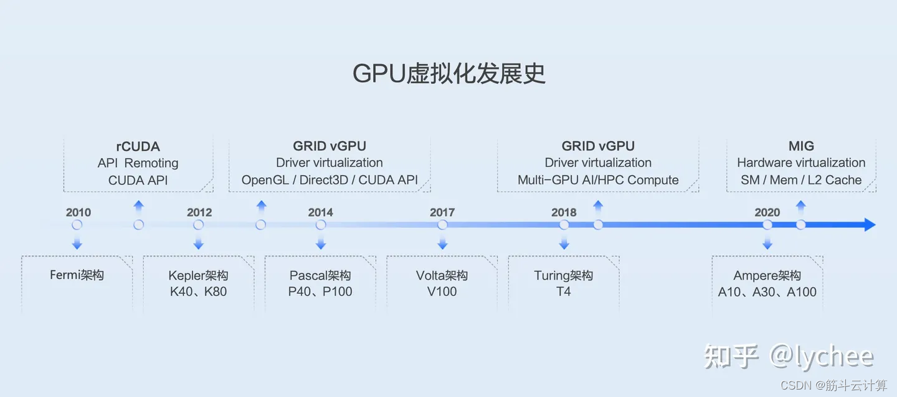

GPU虚拟化技术应该是现在浏览器博客最多的技术之一，究其原因是机器学习带火的一个上游新技术热点，下面是华为云社区总结的GPU虚拟化技术在深度学习领域的作用。

GPU虚拟化在深度学习领域的应用主要体现在以下几个方面：

1. 资源共享和隔离：通过将物理GPU资源虚拟化为多个虚拟GPU（vGPU），多个用户或任务可以共享同一块物理GPU，同时保证相互之间的资源隔离，提高了GPU资源的利用率。这对于需要频繁启动和停止任务的深度学习模型调试或教学环境尤其有用。例如，NVIDIA的vGPU技术可以在虚拟化环境中为每个用户提供独立的GPU资源，加速深度学习模型的训练和推理过程。
2. 提高模型训练速度和效率：GPU虚拟化技术可以为深度学习模型的训练提供所需的计算资源，通过优化资源分配，提高模型训练的速度和效率。在某些情况下，与仅使用CPU相比，使用GPU可以提速50倍，提供接近裸机的性能。
3. 深度学习环境的搭建：GPU虚拟化技术可以帮助搭建易用且可扩展的深度学习环境。例如，在教育行业中，通过GPU虚拟化技术，可以为每个学生提供一个虚拟GPU来完成实训，降低了成本并提高了资源利用率。同时，老师还可以利用vGPU的新特性，将不同物理GPU资源聚合在一起提供给某一个虚拟机使用，为科研工作提供高算力支持。
4. 支持AI、深度学习和数据科学的服务器虚拟化：NVIDIA的vComputeServer软件和NVIDIA NGC容器使得AI工作负载可以轻松部署到虚拟化环境中，提高了数据中心的安全性、利用率和可管理性。通过这种方式，IT管理员可以在虚拟化环境中运行GPU服务器上的AI工作负载，使用相同的管理工具来管理GPU集群。
5. 分布式深度学习框架的协同：GPU虚拟化和分布式深度学习框架可以协同工作，以加速深度学习应用的开发和部署。分布式深度学习框架通过将任务分布在多个GPU或多个节点上，显著提高计算效率和吞吐量。而GPU虚拟化则通过资源共享，为每个用户提供独立的GPU资源，两者结合可以进一步提高深度学习计算的效率。
6. 深度学习推理任：GPU虚拟化特别适用于深度学习推理任务，因为推理任务的计算需求可能时有时无，通过GPU虚拟化，可以更有效地利用计算资源。

# 虚拟机FT

之前在聊到HA（高可用）的时候，谈到了如果一个虚拟机宕机，就迁移到另外一台主机上面再运行，但是这样的方案对于一些有状态的服务不适用，比如CPU、cache、TCP连接等等。如果我们使用主从的结构，有台虚拟机备份这个虚拟机的CPU等等的状态信息，然后当前者挂掉的时候就可以做到外界无感知的继续运行，这大致就是Fault Tolerance。

实现这项技术的关键就是如何让备份虚拟机和源虚拟机**时刻保持CPU和内存状态的一致**

假设现在我的一个虚拟机上面只有一个CPU，那么这个CPU就会一个一个指令的执行；那么我们就需要在备份虚拟机上面执行相同的指令（以及指令参数），就可以保证相同的状态。

- 但是，这样的话肯定会极大的降低我源虚拟机的运行效率，甚至严重影响业务

## CPU执行

我们先了解一下CPU基本指令执行原理：

虚拟机会将一个个指令存放在一个个内存地址中，**Program Counter**存储**下一条将要被 CPU 执行的指令的内存地址**，每执行一条指令，PC 通常会自动递增（指向下一条指令），实现程序的顺序执行（当然，JMP、CALL这些就不是简单的递增，详情看计组）

- 不确定性指令：比如读取“随时间变化”的特殊寄存器，会导致两次在同一起点的PC最终执行的结果不一样
- 中断：由外部一些IO设备引起的CPU中断对于CPU自身而言也是随机的，也会造成不确定性

由于在虚拟机中，不确定性CPU也是一个个执行命令的，这也就会造成不确定性事件。我们把**不确定性事件**想象成一个个对虚拟机的输入，执行的结果想象成一次次的输出，那么我们能得到如下的思路（注意，这部分我们在讨论单机，还没说同步的事情）：

- 我们捕获到每次执行的不确定性事件（比如在第三个指令上读取当前时间）
- 我们将上次执行的结果注入到下次

这样能不能保证两次执行结果的一致呢？

答案是肯定的，相当于我们确保了执行路径是一样的，也就确保了结果是一样的。这就是虚拟机的**录制与重放**，下面是需要“拦截和记录的”：

1. 读取时间、产生随机数等非确定性指令
2. 硬件产生的中断（记录中断执行点：指令执行的数量或者寄存器位置）
3. 外部设备的数据输入（比如磁盘--DMA机制读取的数据 和 网卡）

基于这个原理，我们来了解一下**vLockStep**

## vLockStep

**vLockStep（虚拟锁步）** 是一种用于**高可用性（HA）和容错（Fault Tolerance）虚拟化系统**的高级技术，主要用于在多个物理主机上**同步运行同一个虚拟机（VM）的多个副本**，以实现**零停机容错**。

现在我们有源虚拟机和备份虚拟机这两台机器

1. 主要思路还是将VM1上面的不确定性时间记录下来，然后注入给VM2
   - 这样的操作会遇到下面的问题：比如VM1遇到了中断事件，然后我们注入到VM2中。在此期间阻塞暂停源虚拟机（VM1），这样的操作符合我们的设计，但是也会极大的损害VM1的性能
2. 因此，我们选择非阻塞式的方式，不阻塞源端虚拟机，采用异步的方式去发送
   - 这样的问题时：比如我们有100个非确定性事件，注入了75个，剩余25个注入之前，源虚拟机故障了，这时候25个时间丢失，备份虚拟机接管源虚拟机，产生不一致性，这个破坏了我们的根本目的

也就是说，我们需要找一种平衡效率和一致性的问题。这个方法就是我们重新定义不一致性事件——即在一些特殊的时间点上两个VM是一模一样的状态即可

我们定义一个边界，边界内部是CPU和内存，边界外面是磁盘、网卡等外部设备。

1. 每当虚拟机从边界内部向边界外部输出时（外界可见时），定义为特殊事件。

   - 我们设置源虚拟机和备份虚拟机运行的两条线
   - 在某一点上，源端虚拟机产生了对外的输出，也就是特殊事件，此时Hypervisor可以感知到，并且会**延迟输出对外界的发送**，从而保证异步发送的事件已经成功注入给备份虚拟机
   - 然后我们假设某一时刻，源虚拟机宕机了，这时候我们可以保证，备份虚拟机目前的状态起码**在源虚拟机上一次发送之前是同步到的**，也就能保证外界感知不到两次发送不一致的地方

   这个思路就是说，我们不追求完全的同步，但是追求外面感知不到我们的不同步，

   - 比如说源虚拟机完成了第三次发送的**准备**，那么备份虚拟机没有同步到第三次之前，源虚拟机第三次、第四次、第五次是发不出去的，直到备份虚拟机完成截止到第三次发送的同步之后源虚拟机再发送第三次
   - 这样就是说，哪怕这两个虚拟机进度差的再大，**外界感受不到输出的异常**

2. 讨论完了输出，我们再来讨论一下输入--Hypervisor也要感知到这些输入，同时让备份端读取到同样的输入

   - 比如某个时间点某个网卡接收到的网络包、数据都需要同步给备份虚拟机。Hypervisor感知外界给虚拟机的网络包，当网络包积累到一定成度之后，Hypervisor会将这部分网络包trap出来，放到CPU接收网络数据的内存中，同时保证**在源虚拟机运行之前**将这部分数据同步到备份端中 
   - 对于磁盘而言，我们之前说过是使用DMA机制让CPU读到的，因此就是需要Hypervisor感知 (DMA机制下的这块内存这块内存是虚拟机的vCPU和IO设备都可以访问到的) 到模拟设备对DMA区域的写入，拿到将被CPU读取的数据并且同步给备份端

3. 之后，我们来看一下共享存储

   - 两台虚拟机运行在共享存储上，vLockStep只允许源端的磁盘写入对这个共享磁盘生效，备份端的磁盘会被Hypervisor拦截到，假装他是成功的，但是不会对共享磁盘生效。这避免了两者都写入磁盘然后网络设备向外界发送两次请求包

支持虚拟机录制和重放的原理实现有一个缺陷——就是其只支持单个CPU（对多CPU支持不好）。因为多CPU的场景下，相较于我们之前提到的三种不确定性事件，多CPU场景下会多一种不确定性事件就是CPU对共享内存访问顺序的不确定性，如果在vLockStep设定下解决这个问题，会消耗很大的带宽，一次引入一个新的方案——Remus

## Remus

看这部分之前，可以先过一下热迁移的知识——因为这个方案中，我们把目标端虚拟机想象成备份的热迁移虚拟机 

我们上个方案中，我们明确了一致性指的是**“对外一致性”**，也就是让外界感受不到虚拟机进行了迁移。这就需要借助我们上一个方案提到的**“保留在两个检查点之间”**的思想，这个方案将数据的对外发送分成若干个检查点，每个检查点之间有如下的流程：

```mermaid
graph TD
    A[Start of Checkpoint Cycle] --> B[Pause: VM Execution Suspended]
    B --> C[Mem-sync: Sync State to Backup VM]
    C --> D[Release-Output: Flush Buffered Network Output]
    D --> E[Resume: VM Execution Resumed]
    E --> F[Wait for Next Checkpoint Interval]
    F --> A
    style A fill:#e1f5fe
    style E fill:#e8f5e8
    style D fill:#fff3e0
    style B fill:#ffebee
    style C fill:#f3e5f5
    style F fill:#fafafa
```

1. **Pause（暂停）**:此阶段确保我们能获取一个**一致的状态检查点（checkpoint）**。

   - **目的**：冻结 Primary VM 的执行，以便捕获其当前完整状态。

   - **操作**：
     - 暂停虚拟机 CPU 执行（通过 Xen 的 `vm.pause()` 或类似接口）。
     - 此时 VM 内核/应用不再处理新指令。

   - **关键点**：
     - 所有**非确定性事件**（如网络包接收、时钟中断、磁盘 I/O）在此前已被记录为日志（log）。
     - 状态快照包括内存、CPU 寄存器、设备状态等。

2. **Mem-sync（内存同步 / 日志传输）**:这是整个流程中最耗时的部分，也是 Remus 引入延迟的主要来源。

   - **目的**：将 Primary 的状态变更（以日志形式）异步发送给 Backup VM。

   - **操作**：
     - 将本次周期内产生的 **执行日志（包括输入事件和状态差异）** 通过网络发送到 Backup 主机。
     - Backup VM 在后台重放这些日志，使其状态与 Primary 保持一致。

   - **特点**：
     - **异步传输**：不要求实时完成，但必须在下一阶段前确认接收。
     - 使用增量内存页传输（dirty page tracking）优化带宽。

3. **Release-Output（释放输出）**:这是 Remus 实现 **Exactly-once semantics（精确一次语义）** 和 **状态一致性** 的关键！

   -  **目的**：**只有在 Backup 确认已接收并处理该 checkpoint 后**，才允许 Primary 向外发送本周期产生的所有输出。

   - **操作**：
     - Primary 在此周期内产生的所有**对外输出**（如网络响应包、写入外部数据库的操作）被**缓冲在本地输出队列中**，**并未真正发出**。
     - 一旦收到 Backup 的 **ACK（确认已同步）**，立即批量释放（flush）这些输出。

   - **核心价值**：
     - 如果 Primary 在此之前崩溃，**没有任何输出被外部看到**，Backup 接管后可安全重放并产生正确输出。
     - 避免了“主已发包但备未同步 → 切换后重复发包或丢失”的问题。

4. **Resume（恢复执行）**

   - **目的**：恢复 Primary VM 的正常运行，开始处理下一个工作周期。

   - **操作**：
     - 解除 VM 暂停状态，继续执行用户程序。
     - 开始记录下一周期的输入事件和状态变更。

   - **进入下一轮**：等待下一个 checkpoint 周期开始，重复上述四阶段。

但是，上述这个流程在性能上存在很大的问题——就是随着这个循环的周期不断缩短，我们虚拟机暂停的次数就会依次增多，很大程度上影响了源虚拟机的性能，因此对上述步骤，优化了一下执行顺序

1. 在第一步暂停源端虚拟机之后，并不会利马去做内存同步到目标端这个步骤
2. 而是（第二步）将这部分脏页拷贝一份，拷贝完之后就会立马运行源虚拟机
   - 因为我们上面介绍过程的时候，也提到了第二步是最耗时的，这个操作就是为了避免这个问题
3. 第三步直接恢复执行Resume
   - 并且在后台**异步的**将之前拷贝出来的脏页同步给备份端
4. 同步完成之后，将上一轮积攒的对外输出释放出去

这个方案，对于CPU数量并没有什么限制，而是只关心**内存产生的脏页**以及**CPU的状态同步**

但是这个方案的问题就是随着checkpoint的增多，这种周期性的暂停和脏页迁移也会越来越频繁，因此我们来了解一下COLO方案

## COLO

由 **上海交通大学（SJTU）IPADS 实验室**（Institute of Parallel and Distributed Systems）提出的一种**高可用虚拟机容错（Fault Tolerance, FT）方案**，全称为：

> **COLO: COarse-grained LOck-stepping virtual machines for non-stop service**

该方案发表于 **USENIX NSDI 2015**，是对传统容错技术（如 VMware FT 的细粒度锁步、Remus 的异步复制+输出抑制）的重要改进，目标是在**保持零停机（zero downtime）的同时显著降低性能开销和网络延迟影响**。

这个方案的核心是一个假设：在我们不同步不确定性事件的前提下，两个VM有没有可能产生相同的输出

```mermaid
graph TB
    subgraph "Primary Host"
        A[Primary VM]
        B[Network Proxy A]
        C[State Sync Module A]
    end

    subgraph "Backup Host"
        D[Backup VM]
        E[Network Proxy B]
        F[State Sync Module B]
    end

    subgraph "External Network"
        G[Client Requests]
        H[Response to Client]
    end

    subgraph "COLO Coordinator"
        I[Output Comparator]
        J[Recovery Manager]
    end

    G --> B
    B --> A
    A --> B
    B --> I
    B --> H

    G --> E
    E --> D
    D --> E
    E --> I
    E --> H

    I --> J
    J --> C
    J --> F

    C <--> F
    C --> A
    F --> D

    style A fill:#e1f5fe
    style D fill:#e1f5fe
    style B fill:#f3e5f5
    style E fill:#f3e5f5
    style I fill:#fff3e0
    style J fill:#ffebee
    style G fill:#e8f5e8
    style H fill:#e8f5e8


```

1. **并行执行模式**

   - 主备虚拟机在大多数时间里**独立全速运行**，不强制同步每条指令

   - 通过网络代理**同时向主备VM注入相同的输入请求**

2. **输出比对机制**

   -  网络代理捕获主备VM的所有输出包

   - 通过输出比对器实时检查输出一致性

   - 一致时直接放行响应，**零额外延迟**

3. **按需恢复协议**(一样的话就不管了，接着走直到下一轮)

   - 仅当检测到输出不一致时，才触发恢复流程

   - 暂停VM，从检查点回滚，进入同步模式

   - 重新稳定后自动切回高性能并行模式

4. **状态同步模块**

   -  负责在需要时同步主备VM的内存和状态

   - 通过协调器管理同步过程