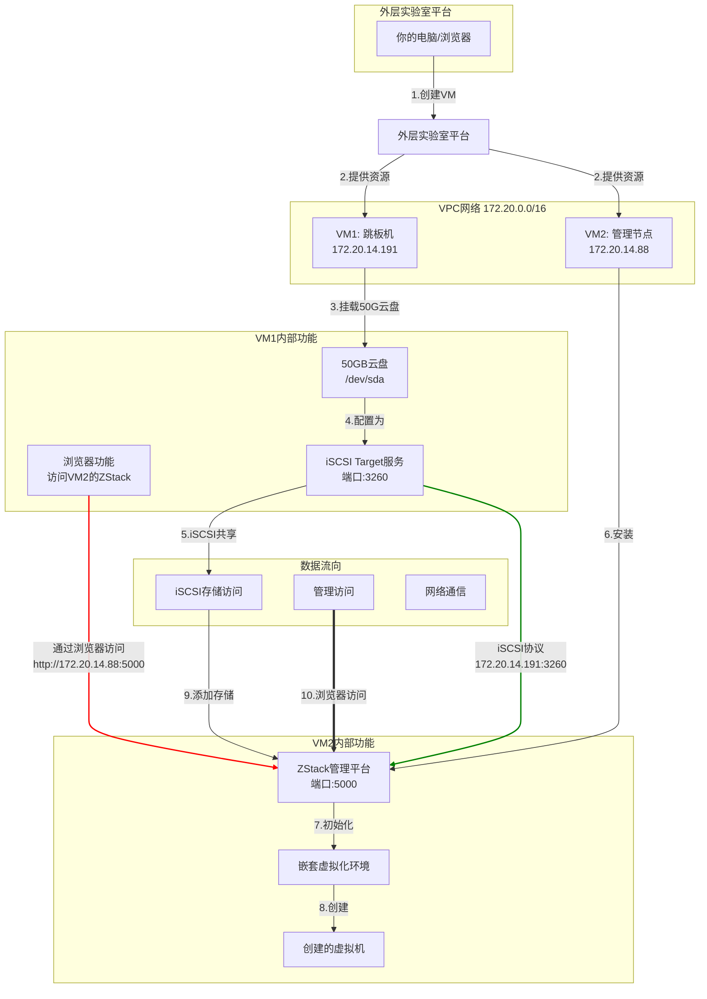

26.4之前的自学重点在容器化，这部只涉及跳板机的逻辑，抓包结果之后会结合业务来细说

# ZCCT实验

在Cloud环境上，配置两台VM，其中一台充当跳板机和存储提供机，一台作为管理机

名词了解：

1. 物理机：对于VM1，VM2而言，在初始化和配置`Zstack`的时候，他们就可以称为物理机（这个操作要在`Ipvm:5000`上进行）

## 逻辑关系

### 物理关系与网络操作



### 内部结构

```text
你的电脑
    ↓ (通过浏览器)
外层ZStack实验室平台 (lab.zstack.io:5000)
    ├── 创建 → VM1 (跳板机: 172.20.14.191)
    └── 创建 → VM2 (管理节点: 172.20.14.88)

VM1 (172.20.14.191):[VM1有三重角色]
├── 角色1: 访问入口
│   └── 运行浏览器(指的是VM1上的，不是自己电脑上的)，访问 VM2:5000
├── 角色2: iSCSI存储服务器
│   ├── 50GB云盘 (/dev/sda)
│   ├── targetcli服务 (端口3260)
│   └── IQN: iqn.2003-01...d80f9a2f6562
└── 角色3: 网络跳板
    └── 中转访问请求
    
VM2 (172.20.14.88):
├── ZStack管理平台 (端口5000)
│   ├── 区域: Region-1
│   ├── 集群: Cluster-1
│   └── 物理机: VM2自己
└── 嵌套虚拟化环境[这个必须要安装完整的ZStack软件才可以操作，yum install zstack]
    └── 可以创建新的虚拟机
```

### 数据流向

```
流向①：管理访问流
你的电脑 ←?→ VM1的浏览器 ←----→ VM2的ZStack (5000端口)
      (可能受限)         (内网直达)
      
流向②：存储访问流
VM1的50GB云盘 → iSCSI Target → VM2的ZStack → 嵌套虚拟机
    (/dev/sda)   (3260端口)     (添加为主存储)
    
流向③：网络通信流
VM1 (172.20.14.191) ←---→ VM2 (172.20.14.88)
    (同一VPC/16网段)
```

### 操作逻辑

就是说上面是理论上的操作步骤，比如说操作跳板机操作管理机这一步，如果说跳板机不支持浏览功能的话，在外面浏览器上的配置是样的，只是起不到这种防火墙一样的管理效果

1. 你的电脑 → 外层平台 → 创建VM1和VM2
2. 外层平台 → VM1挂载50GB云盘
3. VM1配置iSCSI服务
4. VM2安装ZStack平台
5. 通过VM1浏览器 → 登录VM2的ZStack
6. 在ZStack中添加iSCSI存储 → 172.20.14.191:3260
7. ZStack发现iSCSI LUN → 50GB磁盘
8. 创建SharedBlock主存储(使用iSCSI作为主存储)
9. 创建嵌套虚拟机 → 使用iSCSI存储
10. 嵌套虚拟机启动 → 数据存储在VM1的50GB云盘


