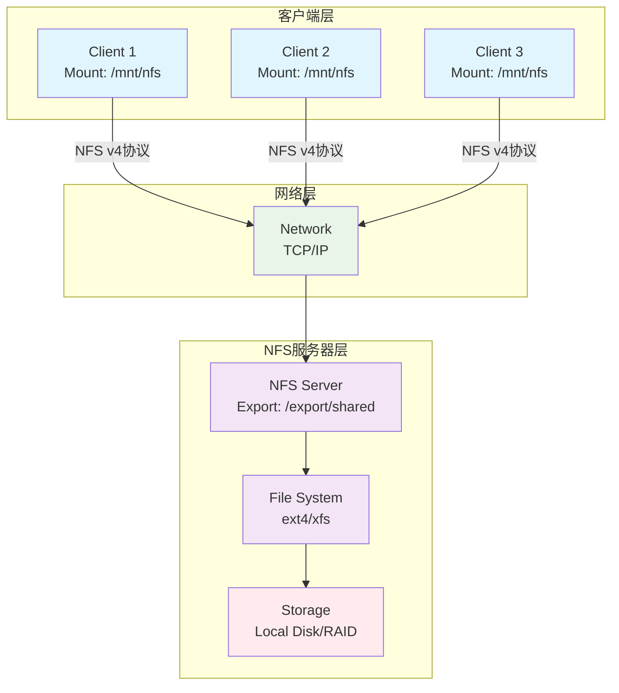
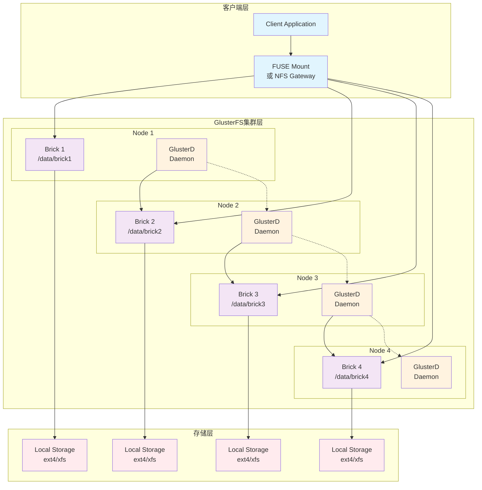

# 代码目录

## 支持的存储类型

1. 块存储 (Block Storage)

   - blockSD.py - 块存储域实现
   - 基于LVM（逻辑卷管理）的存储
   - 支持iSCSI和FC（光纤通道）存储
2. 文件存储 (File Storage)

   - fileSD.py - 文件存储域实现
   - 通用文件系统存储支持
3. NFS存储方式

   - nfsSD.py - NFS存储域实现
   - 网络文件系统存储
4. GlusterFS存储方式

   - glusterSD.py - GlusterFS存储域实现

   - 分布式文件系统存储

## 核心概念

1. 存储域 (Storage Domain)
   - sd.py - 存储域基类
   - 逻辑存储单元，包含多个镜像和卷
   - 有版本概念，支持版本升级（通过**formatConverter.py**）
2. 卷 (Volume)
   - volume.py - 卷基类
   - blockVolume.py - 块卷实现
   - fileVolume.py - 文件卷实现
   - glusterVolume.py - Gluster卷实现
3. 镜像 (Image)
   - image.py - 镜像管理
   - 由一个或多个卷组成的虚拟机镜像

## 存储操作概念

1. SPM (Storage Pool Manager)
   - spmstop.sh - SPM停止脚本
   - spmprotect.sh.in - SPM保护脚本
   - 负责存储域的管理和锁定机制
2. 存储域管理 (SDM)
   - sdm 目录 - 存储域管理API
   - create_volume.py - 创建卷
   - copy_data.py - 数据复制
   - merge.py - 卷合并
   - amend_volume.py - 卷属性修改
3. 卷格式
   - RAW格式 - 原始格式，直接映射到存储
   - COW格式 - Copy-on-Write格式，支持快照和精简配置
4. 存储资源管理
   - resourceManager.py - 资源管理器
   - resourceFactories.py - 资源工厂
   - 负责存储资源的锁定和并发控制

## 关键组件

1. 存储缓存
   - sdc.py - 存储域缓存
   - 缓存存储域信息以提高访问性能
2. 存储服务器
   - storageServer.py - 存储服务器接口
   - 处理存储连接和挂载操作
3. 任务管理
   - task.py 和 taskManager.py - 存储操作任务管理

# 存储类型

[块存储、文件存储、对象存储的区别 - 李婷 - Confluence](http://confluence.zstack.io/pages/viewpage.action?pageId=156080855)

我们先来了解一下主要涉及的三种存储类型

## 块存储

块存储：块存储将数据划分为固定大小的“块”（如512字节、4KB等），每个块有唯一地址，操作系统或应用程序**可以直接读写**这些块，就像操作本地硬盘一样。块存储的用户是可以读写块设备的软件系统

- 适合数据库、虚拟机磁盘等对 I/O 性能要求高的场景，例如虚拟机磁盘（如 AWS EBS、OpenStack Cinder）、数据库存储（MySQL、Oracle 等）、高性能计算
- 通过 SCSI、iSCSI、FC（光纤通道）等协议访问，**一个块设备通常只能被一个主机挂载**（除非使用集群文件系统如 GFS2）

缺点：

块存储是排它的，服务器上的某个逻辑块被一台客户端挂载后，其它客户端就无法访问上面的数据了**。而且挂载了块存储的客户端上的一个程序要访问里面的数据，不算类似数据库直接访问裸设备这种方式外，通常也**需要对其进行分区、安装文件系统后才能使用**。除了在网络上传输的数据包效率更高以外，并不比使用文件存储好多少，客户端的文件系统依然需要对路径分解，然后逐级查找才能定位到某一个具体的文件。

## 文件存储

文件存储：文件存储以“文件”和“目录”的形式组织数据，用户通过标准文件操作（如 open、read、write）访问数据。底层由文件系统管理元数据和权限。

- 性能相比于块存储较低，但是多个主机可同时挂载同一个文件系统（需处理并发控制），用于共享文档、日志存储、Web 服务器静态资源、开发环境中的代码共享
- 需要基于文件系统，如 **NFS**、SMB/CIFS、**FTP** 等协议提供访问接口

缺点：

文件存储的树状结构以及路径访问方式虽然方便人类理解、记忆和访问，但计算机需要把路径进行分解，然后逐级向下查找，最后才能查找到需要的文件，对于应用程序来说既没必要，也很浪费性能。

## 对象存储

对象存储：对象存储其实介于块存储和文件存储之间，用户则其它计算机软件

对象存储出现就是为了解决两个问题：

1. 块存储不连续读
2. 文件存储分散、读取慢

对于不同的软件系统来说，一次访问需要获取的不一定是单个我们传统意义上的文件，根据不同的需要可能只是一个/组值，某个文件的一部分，也可能是多个文件的组合，甚至是某个块设备，**统称为对象**（就是啥都能存）。这就是对象存储。

### 块存储不连续读

- 块设备的访问方式虽然比文件存储快，其实也很麻烦——一个文件往往是由多个块组成，并且很可能是不连续的（要读取一个文件，可能需要发出这样的指令 读取从编号A₁开始的N₁个块...）最后自行把这i个连续的块自行拼接成一个文件，这才完成了一个文件的读取操作。
  - 为了发出这些指令，访问文件的软件系统需要记录下这个文件分成多少个部分，每个部分的起始块编号是多少，有多少块，顺序如何
  - 不单是读取操作，删除、写入、修改操作也是如此，非常麻烦复杂
- 为了解决这中麻烦，使用一个**统一的底层存储系统**，管理这些文件和底层介质的组织结构，然后给**每个文件一个唯一的标识**，其它系统需要访问某个文件，直接提供文件的标识就可以了。存储系统可以用更高效的数据组织方式来管理这些标识以及其对应的存储介质上的块。

### 文件存储读写慢

| 类型         | 存储位置                                                     | 说明                             |
| ------------ | ------------------------------------------------------------ | -------------------------------- |
| **Metadata** | 目录项（Directory Entry）、FAT 表、BPB（BIOS Parameter Block） | 记录文件名、大小、起始簇、属性等 |
| **Data**     | 数据区（Data Region）的簇                                    | 存放文件实际内容                 |

像FAT32 文件系统将文件按“簇”（最小分配单位）打散存储在磁盘上，文件的实际数据块可能不连续。它通过一个全局的“文件分配表”（FAT）来记录每个簇的后续簇号，从而形成**簇链**。读取文件时，系统先从目录项获取起始簇号，再查 FAT 表（而非从前一个数据块中）得知整个簇链，因此**元数据（如 FAT 表和目录项）与文件数据是明确分离的**。虽然簇链结构在逻辑上是链式的，但现代操作系统通常会预读或缓存 FAT 表，一次性解析出所有数据簇位置，并结合 I/O 调度优化读取顺序。机械硬盘（HDD）**物理上只有一个磁头臂**，导致随机访问时寻道时间长。

- FAT 表太大时效率低（FAT32 最大支持 ~2TB 卷，但 FAT 表可能占几百 MB）
- 簇链长时遍历慢（但可通过缓存缓解）

### 对象存储方案

对象存储最常用的方案，就是**多台服务器内置大容量硬盘**，再装上对象存储软件，然后再额外搞**几台服务作为管理节点**，安装上对象存储管理软件。管理节点可以管理其他服务器对外提供读写访问功能。

对象存储将数据以“对象”（Object）为单位进行管理，每个对象包含**数据本身、唯一标识符（Object ID）和可自定义的元数据**。在典型的分布式对象存储架构中，**元数据与数据是分离的**：

- **元数据服务器**（或控制平面，如 Ceph 的 Monitor + MDS，或 Swift 的 Account/Container Server）负责管理对象的元信息，包括对象的唯一 ID、大小、自定义属性，以及**该对象的数据块被存储在哪些 OSD（Object Storage Device）节点上**。
- **OSD 节点**（即数据服务器）负责实际存储对象的数据，并处理客户端的读写请求。

当用户要访问一个对象时，通常先向元数据服务（或通过网关/API）查询该对象的位置信息；元数据服务返回其所在的 OSD 列表（例如文件 A 的数据分布在 OSD-B、C、D 上）；随后，**客户端直接与这些 OSD 并行通信，读取或写入数据**。这种设计实现了**控制与数据路径的分离**，支持高并发、高扩展性和并行 I/O。（ps：不是所有对象存储都显式使用“元数据服务器”，而是使用控制平面，避免对外暴露分布式元数据管理）

## NFS

NFS（Network File System） 是一种**分布式文件系统协议**，最初由 Sun Microsystems 开发，允许客户端通过网络透明地访问远程服务器上的文件，就像访问本地文件一样，其基本架构分为三层：

- **客户端层**：多个客户端通过NFS协议挂载远程共享目录
- **网络层**：使用TCP/IP协议进行通信
- **服务器层**：NFS服务器导出本地文件系统给客户端访问



## GlusterFS

GlusterFS：GlusterFS 是一个**开源的分布式文件系统**，通过将多个物理存储节点（称为“砖块”，Brick）聚合为一个统一的全局命名空间，提供横向扩展的文件存储服务

GlusterFS采用去中心化架构，通过GlusterD守护进程在节点间进行通信协调



- **客户端层**：应用通过FUSE或NFS网关访问文件系统
- **集群层**：多个节点（Node）组成集群，每个节点包含Brick（存储块）和GlusterD守护进程
- **存储层**：底层本地存储设备

# 从源代码看存储

[【vdsm 源代码漫步】vdsm的存储（1） – oVirt中文社区](https://www.cnovirt.com/archives/3059)

[【vdsm 源代码漫步】vdsm的存储（2） – oVirt中文社区](https://www.cnovirt.com/archives/3087)

[【vdsm 源代码漫步】vdsm的存储（3） – oVirt中文社区](https://www.cnovirt.com/archives/3121)

[【vdsm 源代码漫步】vdsm的存储（4） – oVirt中文社区](https://www.cnovirt.com/archives/3123)

[【vdsm 源代码漫步】vdsm的存储（5） – oVirt中文社区](https://www.cnovirt.com/archives/3130)


> - **iSCSI SAN / FC**：iSCSI 和 Fibre Channel 是两种用于构建存储区域网络（SAN）的协议，通过网络将块设备（LUN）直接映射给主机，提供高性能、低延迟的块级存储访问。
> - **GlusterFS**：GlusterFS 是一个分布式文件系统，通过将多个存储节点的磁盘聚合为统一的全局命名空间，支持横向扩展和高可用性。
> - **LUN**：LUN（Logical Unit Number）是存储设备中逻辑划分的一个块设备单元，通常由 SAN 存储阵列提供，可被主机识别并挂载为物理磁盘。
> - **NFS**：NFS（Network File System）是一种基于网络的文件共享协议，允许客户端像访问本地文件一样读写远程服务器上的文件目录。
> - **VG（Volume Group）**：VG（Volume Group）是 LVM（逻辑卷管理器）中的一个逻辑容器，由一个或多个物理卷（PV）组成，用于创建可动态调整大小的逻辑卷（LV）。
> - **qcow2 模式**：qcow2 是 KVM 虚拟化中常用的磁盘镜像格式，支持快照、压缩和稀疏存储，数据以虚拟磁盘形式存在，但实际占用空间可小于原始大小。
> - **raw 模式**：raw 模式是直接使用原始磁盘设备或镜像文件作为虚拟机磁盘，不经过格式封装，性能高但缺乏快照和压缩等高级功能。
> - **master**：在分布式系统或集群中，master 节点负责协调任务、管理元数据或调度资源，是控制平面的核心组件。
> - **inbox**：inbox 通常指邮件系统或消息队列中接收新消息的临时存储区域，也常用于描述系统接收待处理请求的入口缓冲区。
> - **xlease**：xlease 是 Open vSwitch 或某些虚拟化平台中用于实现跨主机虚拟机迁移时的“租约”机制，确保网络配置一致性与安全隔离。

1. 存储管理是vdsm主要功能之一。代码在vdsm/storage下，主要功能是细化管理存储设备，为虚拟机提供相应的磁盘空间。
   - “供给方”是块存储的lun，nfs文件存储提供的存储目录。块存储主要是IPSAN/FC； glusterfs, 本地存储都是文件存储。
   - “需求方“主要是虚拟机的磁盘。
     - 当采用块存储时候，一个lun会被做成一个VG，虚拟机的磁盘文件会被做成LV。
     - 当采用文件存储时候，主要是生成qcow2模式或者raw模式的文件供虚拟机使用。
     - 当然在这个过程中也会生成一些管理类的文件，如master, inbox,xlease 等等。
2. 除了虚拟机会对自己的磁盘有写入操作，vdsm对存储的管理也会有一些落盘操作，包括写入元数据，创建一些目录等。这些落盘操作是通过两种方式进行的
   - 对于块文件是通过directio.py里面的函数处理的，主要是进行了字节对齐。
   - 对于文件操作相对比较复杂。它调用了2个rpm包（本文暂称呼为ioprocess）。
     - 这是因为nfs下，经常会出现一种 D 状态。为了处理这种情况，专门创建了ioprocess处理包（主要是通过管理子进程，来避免这种情况）。
     - vdsm并没有直接使用ioprocess rpm处理包，而是通过storage/outOfProcess.py 进行wrapper后，使用的。

3.  storage 进程管理相对比较复杂一些。但是基本原理很简单，就是创建一个线程池，池里面有若干线程，这些线程只做一件事情，就是等待队列里面出现任务数据，然后执行任务函数。

   - 场景： engine界面上可能会要求创建/删除一个快照。这个时候任务执行时间可能会很长，所以任务不是同步的，并且不止需要执行一个函数。此时，执行的任务还是一个（taskid唯一），但是任务被分成了若干job.每个job执行一个函数。同时，在操作过程中，如果重启vdsmd，任务不能被丢失。而且如果被操作对象被占用，需要等待。

   - 代码： storage/task.py storage/taskManager.py threadpool.py storage/dispatcher.py hsm.py vdsmd.py

   - 漫步： 

     - 我们进入hsm.py, 会找到好多类似 _spmSchedule, _hsmSchedule 的函数。这些函数都调用到了self.taskMng.scheduleJob 函数。我们进入taskManager.py, 会发现scheduleJob只是将job加入了task，至于什么时候得到执行，那是另一个故事了。

     - 望文生义，taskManager就是管理task的类而已。先看__init__函数，最重要的一件事就是生成了一个threadpool，也就是生成了一个线程池。函数queue， queueRecovery 本质上都是在调用 self.tp.queueTask，即将task放入到threadpool里面的一个队列里。

     - 我们先来看threadpool.py. 这个文件很简单，就是生成一堆线程，并将其启动

       ```python
       newThread = WorkerThread(self, name)
       newThread.start()
       # 而这些线程WorkerThread不停的做什么事情呢？
       concurrent.thread(self.run, name=name) #(包含在WorkerThread.__init__）
       self._processNextTask() #（包含在self.run）
       self.__pool.getNextTask() #包含在self._processNextTask
       cmd(args) #包含在self._processNextTask
       ```

       显然，所有线程都在监控一个队列 self.__tasks = queue.Queue(maxTasks)，一旦发现队列里面有task任务就会自动执行。换句话说将任务放到Queue后，只要线程空闲就会得到 执行。

     - 那么task是什么时候放到queue中的呢。显然 调用taskManager中queue函数，就会将task放到queue中。再进一步，什么时候会调用queue函数。是在一个内部函数 def __state_queued(self, fromState)（task.py内部）中被调用。

     - 我们进一步来查看task.py文件。文件中最重要的一个函数叫做_updateState，它会根据当前的task状态，自动进入下一个状态，关键代码：

       ```python
       fn = getattr(self, “_Task__state_%s” % state)
       fn(fromState)
       ```

       fn是所有 类似 __state_xxxxx的函数，其中xxxxx是状态。显然，task实现了一个自动状态机。简单而精巧。taskManager的queue函数，会将task和commit，放到threadpool的queue里面去执行，commit会自动调用状态机。 状态机的起始状态是init–>prepare–>……（见参考文献三）当task对象被创建时候自动就是init状态。所以整个状态机的启动有赖于外部调用prepare函数。从而使得任务得到开始执行。

     - taskManager.py以及task.py里面有很大一部分涉及到recovery相关，主要是在重启vdsmd等操作时候，能够将task元数据保存，恢复之后，重新执行task。当然也包含一些撤销操作。

     - 一个task可能会包含很多Job。每一个Job才是一个基本的执行单元。而Task其实是一个管理单元。

参考资料：

(1) https://www.cnovirt.com/archives/636

(2)https://www.ibm.com/developerworks/cn/cloud/library/1209_xiawc_ovirt/index.html

(3)https://www.ovirt.org/develop/developer-guide/vdsm/tasks.html