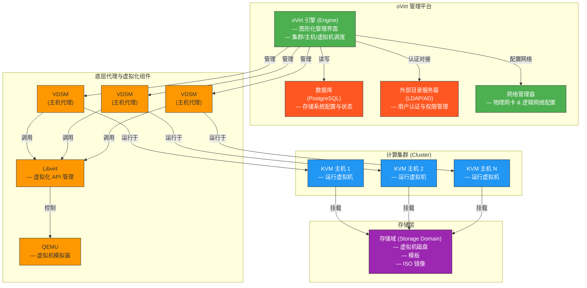

# OVIRT架构

OVIRT系统是由以下组件所组成的:

- 用来运行虚拟机的主机 利用了 KVM 来提供虚拟化的功能。
- 代理程序和工具 包括 VDSM，QEMU 和
  libvirt。这些工具提供了对本地虚拟机，网络，存储等的管理。
- OVIRT虚拟化管理工具 是 OVIRT
  系统的管理平台。它提供了一个图形化的管理界面，方便用户来管理 OVIRT
  系统
- 存储域 用来存储虚拟机的镜像资源，模板，和 ISO 文件等。
- 数据库 用来保存系统的信息。
- 外部目录服务器 用来提供用户权限管理
- 网络管理 管理整个环境的网络，包括物理网卡的管理，和逻辑网络的管理

下面这个是ovirt的一个逻辑图（采用了**Engine 统一调度，VDSM 分布执行，共享存储保障迁移与高可用**的设计思想）：

- **oVirt 引擎（Engine）**：整个系统的“大脑”，提供 Web 管理界面，负责资源调度、用户权限、高可用等。
- **KVM 主机**：运行在物理服务器上的虚拟化节点，基于 Linux + KVM。
- **VDSM（Virtual Desktop and Server Manager）**：每个主机上运行的代理程序，接收 Engine 指令，管理本地 VM、存储、网络。
- **Libvirt + QEMU**：VDSM 底层依赖的开源虚拟化栈，Libvirt 提供统一 API，QEMU 执行实际虚拟机运行。
- **存储域**：共享存储（如 NFS、iSCSI、GlusterFS），所有主机访问同一份虚拟机磁盘数据。
- **数据库**：默认使用 PostgreSQL，保存所有元数据（主机状态、VM 配置、用户信息等）。
- **外部目录服务器**：集成企业 LDAP 或 Active Directory，实现统一身份认证

# OVIRT系统组件

OVIRT 虚拟化管理系统由一个或者多个运行 OVIRT的主机和至少一个运行 OVIRT的管理系统组成。

对 OVIRT主机来讲，它是利用 KVM(Kernel-based Virtual Machine)技术来提供的虚拟化服务。

对 OVIRT 管理端来讲，它同样需要运行在 OVIRT系统上，提供一个图形界面来管理整个系统。利用这个图形界面的接口来管理虚拟机的任务，存储的分配，网络的管理，用户权限对用户来讲，OVIRT 管理端是使用浏览器来访问和控制的。

# OVIRT对资源的定义

总的来讲，OVIRT 系统的资源分为以下两类:
**物理**资源和**逻辑**资源。顾名思义，物理资源指的是存在实体的资源，比如主机和存储等。相反的，逻辑资源是指不存在物理实体的资源，比如逻辑网络和虚拟机模板等，下面对
OVIRT 系统中的资源做一个概括。

- 数据中心：是在 OVIRT系统中所有物理资源和逻辑资源的最大容器单位，它是所有虚拟机，存储，和网络的集合。

- 集群：一个集群指的是**物理主机的集合**，在这里，**主机可以看做是虚拟机的资源池**。在同一个集群中的主机共享相同的网络和存储架构，而且集群中的虚拟机可以在属于该集群的不同的主机之间迁移。

- 逻辑网络：逻辑网络是物理网络在逻辑上的表示，它把网络负载根据管理流量，主机流量，存储流量和虚拟机的流量分组，从而更好的实现网络的管理和流量的分离。

- 主机：主机就是物理上的服务器，虚拟机在主机上运行。一个主机可以运行一个或者多个虚拟机，正如上面提到的，是主机组成了集群。在**一个集群中的虚拟机可以在不同的主机间迁移**。

- 存储池：存储池是一个逻辑上的概念，包含同一种存储类型的仓库，比如iSCSI，Fibre Channel，NFS，或者POSIX。每一种存储池都可以包含几个同类型的存储域，用来存储虚拟机镜像，ISO文件，或者是用来导入/导出存储域。

- 虚拟机：虚拟机就像实际的机器一样，有自己的硬件(CPU，内存等)，包含操作系统和一系列应用软件。OVIRT系统中的虚拟机有两种——虚拟桌面和虚拟服务器。

  多个同样的虚拟机能同时快速的在一个池里面创建。注意，虚拟机的创建，管理，删除等操作只能被超级用户和授予相关权限的用户执行。

- 模板：模板是一种虚拟机模型，这种模型预先定义了虚拟机的很多内容，比如操作系统等。通过模板，可以在简单的一个操作中以最快的方式创建大量的虚拟机。

- 虚拟机池：虚拟机池是指**一组相同的虚拟机的集合**。对一些特定的目的，虚拟机池很有用。比如不同部门虚拟机使用的划分，一个池给市场部门用，另一个池给研发部门用，等等。

- 快照：快照是指某一个时间点虚拟机**操作系统的所有内容的一个状态**。快照有很多用途，比如在升级虚拟机或者修改虚拟机内容的时候，可以建立一个快照，当升级完系统出问题的时候，可以用快照恢复到之前的状态。

- 用户类型 OVIRT：系统支持不同级别的管理员和用户权限。系统管理员管理物力资源，比如数据中心，主机，存储资源等。是系统管理员建立的虚拟机池和虚拟机，用户具有访问这些虚拟机的能力。

- 事件和监控：报警，警告和其它关于系统的通知可以帮助系统管理员更好的了解整个系统的性能和资源的状态。

- 报表：从基于JasperReports的报表模块，或是数据库产生需要的报表。用户也可以使用任何支持 SQL语句的查询工具查询包含主机，虚拟机和存储等的监控数据。

# OVIRTAPI声明

OVIRT系统抛出了一系列使用的接口，方便用户和整个系统交互。**这些接口是对图形化的用户接口的一个补充**。有了这些接口，开发人员可以做一些更高级,自动化的开发。目前为止，OVIRT 系统的各个组件抛出了大部分接口，并且这些接口完全可读写，仅有少部分接口是只读或者还没有完全被支持。

## 完全支持读写权限的接口

以下接口完全具有**读写权限**，可以直接利用下列接口和系统中的组件交互

- Representational State Transfer(REST) API：在 OVIRT 系统中，REST API 完全被支持，你可以使用该接口和系统中的组件交互。
- Software Development Kit(SDK)：SDK 在 OVIRT 中也是被完全支持的，它是由 ovirt-engine-sdk 软件包提供的。
- Command Line Shell：OVIRT 系统完全支持命令行接口，该接口由 vdsm-cli 和 ovirt-engine-cli软件包提供。
- VDSM Hooks：目前，OVIRT 系统支持对虚拟机创建 VDSM Hooks，然后通过该 Hooks
  修改虚拟机的配置。但是对主机的 Hooks 还不支持。

## 只支持读权限的接口

以下接口只支持**读权限**和系统交互:

- OVIRT Manager History Database：目前仅仅支持 OVIRT Manager History Database 的读权限，写权限是不允许的。
- Libvirt：通过命令行 virsh -r 只读连接到 Libvirt是完全支持的。但是写支持还不支持。

## 不支持的接口

以下接口目前还不支持:

- vdsClient 命令：暂不支持使用这个命令和系统交互
- Hypervisor Console：目前暂不支持使用除了用户图形界面以外的工具访问 Hypervisor Console。
- 数据库：不支持直接访问和操纵系统的数据库。

# SPICE

SPICE协议主要是用来为用户提供一个**图形化的访问虚拟机的方式**，它有以下特点:

- 支持超过 30FPS(Frames Per Second) 的视频播放
- 双向音频
- 双向视频
- 同一个虚拟机支持**多个虚拟显示器连接**（就像是电脑外接显示器一样，而不是多用户共同操作）
- 支持重定向客户端的 USB 端口到虚拟机里面
- 支持通过代理连接 SPICE 协议

# 管理和维护OVIRT环境

OVIRT 管理系统需要一个系统管理员来保持整个系统的良好运行。作为一个系统管理员，他需要负责以下的一些工作:

- 管理物理资源和虚拟资源。包括升级主机，添加新的主机，导入存储域，管理虚拟机池等等
- 监控整个系统的运行情况，发生一些严重问题时候一边可以很快恢复。比如某些主机负载太高，内存或者存储空间不够等等。
- 满足普通用户对虚拟机使用的一些需求，比如升级虚拟机的操作系统，给虚拟机分配更多的内存等。
- 使用 tags 管理一些特性的对象属性
- 管理搜索结果，把它们作为公共的书签
- 管理用户的创建和权限
- 为一些用户或者虚拟机错误操作恢复环境
- 生成报告

## 管理员门户的要素

OVIRT 系统的管理门户由相关联的面板和各种菜单组成。主要有两种使用方式——树形模式和扁平模式：

- 树形模式是以数据中心开始的一个树状的结构，你可以在这个结构上操作属于该数据中心的一些元素，我们主要推荐使用树状模式来管理OVIRT 系统。管理门户的组成元素如下:

- 头部栏：
  头部栏包括以下元素: 登录用户的名字, 配置按钮，指南按钮,关于按钮，和登出按钮。
  点击关于按钮显示简单的系统版本信息，配置按钮允许管理员配置用户的角色和权限，点击指南按钮会打开一个指向 OVIRT 管理系统使用文档的页面，你可以在上面查找到该系统的使用手册。

- 搜索栏
  在搜索栏这里，你可以搜索到想要的任何资源，比如可以简单的用host关键字搜索所有的主机，还可以用更复杂的条件搜索更精确的结果。每次输入搜索条件时，内置的搜索引擎打开一个下拉框自动提示可能想要搜索的结果。点击搜索栏右边的的星图标，你可以把这次搜索保存为书签，方便下次查看。

- 资源标签
  包括存储，主机等的所有资源，都可以通过主面板上的标签找到。另外,事件标签所展示的是每个资源的所有事件。管理门户提供了以下几类资源标签: 数据中心，集群，主机，存储，磁盘,虚拟机，池，模板，用户和事件

- 结果列表
  如果选中相关的资源，然后在之上执行一个任务，比如创建新的存储，等等。关于选中的资源的一些信息就会在详细信息面板上显示出来。
- 详细面板
  详细信息面板显示选中条目的详细信息，比如选中一个存储域，在下方的面板上就会以标签的形式显示该存储域的详细信息，包括挂载的数据中心，路径等等。

- 树/书签/标签 面板
  树形面板以树的形式显示了在 OVIRT 管理系统中所有资源，用户可以在这棵树上导航到任何资源。书签通常用来保存频繁使用的搜索条件，标签可以增加, 编辑，或者删除。标签是一组资源的集合，比如点击存储标签，就会显示 所有的存储资源。

- 警告/事件 面板
  点击警告标签，会列出所有系统的安全方面的事件, 例如系统的错误和警告信息。事件标签列出所有资源 的一般事件，比如创建了一个虚拟机等等。任务标签会列出当前运行的所有任务。通过点击放大/缩小按钮，可以展开这些标签的面板。