这是公司架构师对于开源框架的详细介绍，是一套区别于openstack的轻量级私有云应用框架，其中的插件化设计、异步调用底层组件、单主机单进程是精华

# 1.ZStack的架构特点

易用性，稳定性，高性能，以及扩展性

## 易用性

1. 首先考虑的是软件的安装部署与升级
2. 其次是在长期使用的过程中的营运和维护

### 对于安装和部署

1. `ZStack`是一个Java项目，在编译的完成后，所有的文件都会被打包到一个Java的WAR文件中，部署`ZStack`实际就是部署一个标准的Java WAR文件到Apache Tomcat这样的web container中

2. `ZStack`对外部的依赖非常少，仅仅需要MySQL数据库，RabbitMQ消息总线，以及Ansible系统配置管理软件

3. 一个单管理节点的ZStack部署:

   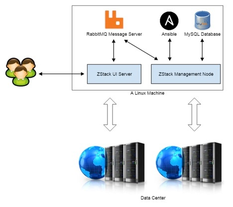

4. 把MySQL和RabbitMQ放到单独的机器，单管理节点的部署可以很容易扩展成多节点部署：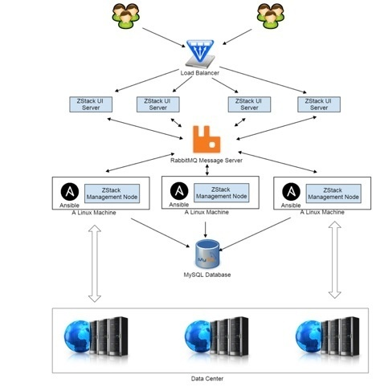

### 系统自动配置

由于IaaS软件管理数据中心中大量的硬件，很多情况下需要安装agent到硬件上（比如安装agent到作为KVM计算节点的Linux机器）。为了让用户从手动安装配置硬件的枯燥工作中解脱出来，ZStack跟Ansible无缝集成：

1. 当用户添加一个计算节点时，ZStack调用Ansible自动安装agent并配置系统，整个过程对用户透明
2. 用户只需调用一个API即可。类似的设计应用在所有需要安装agent的服务，例如负责提供网络功能的虚拟机(Virutal Router VM)。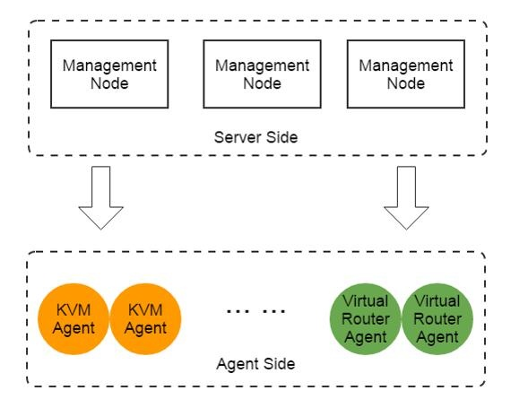

KVM agent的Ansible的配置文件如图所示：

### 系统监控

在监控方面，ZStack目前提供对关键的系统资源比如物理机，虚拟机的状态进行监控，任何在ZStack控制外的状态变化

### 查询功能

丰富的查询API是ZStack为用户运维提供的一个重要功能。ZStack的查询API提供超过400万单项查询条件，400万阶乘的组合查询条件。用户在API层面就可以完成数据库级别的资源查询。

ZStack的查询API的一个独特之处在于，查询框架在接收到API后可以自动生成SQL语句，无需编写代码。开发人员只要在数据库中定义了表，然后在Java程序中用annotation描述新表与其它表之间的foreign key，再为新表继承一个查询API的基础类，所有工作就完成了

## 稳定性

IaaS软件本身是个集成项目，管理了数据中心中大量的子系统，它实际上管理着所有子系统和所有设备的状态。下面的三种设计是通过松耦合架构来实现的

### WorkFlow工作流回滚

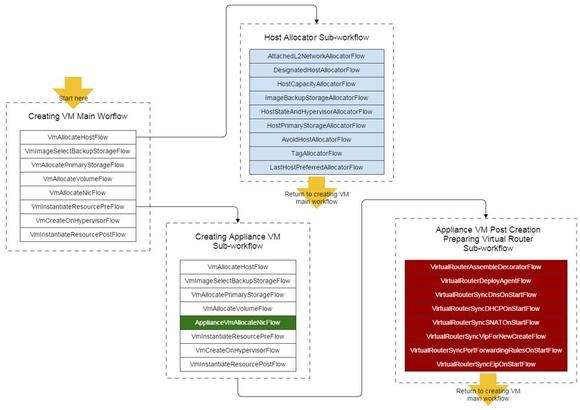

#### 错误执行回滚

如果做这部分的开发，要明确任何一个操作会发生的前置流程（方便知道回滚的时候执行什么、释放什么资源）

1. IaaS中每一个任务的执行路径非常长，如创建一个虚拟机就涉及到计算节点，网络节点，存储节点状态的变化，其中任何一个步骤都可能出错
2. 一旦错误发生，由于当前IaaS缺乏回退机制，某些子系统会遗留在中间状态（如一个虚拟机最后创建失败了，但它的DHCP信息却可能遗留在网络节点，导致将来可能的DHCP冲突）

为此，ZStack设计了一个workflow引擎，将任务的每个操作都封装到flow中，一旦某个操作出错，workflow引擎会回退(rollback)所以已经执行的flow，保证不会系统遗留在中间状态。

例如在上图的创建虚拟机workflow中，假设任务在VmCreateOnHypervisorFlow这一步失败了，workflow引擎会回退前面已执行的6个flow，包括子workflow（图中计算节点分配workflow，创建网络节点虚拟机的workflow）。例如删除已创建的网络节点虚拟机，删除已创建的虚拟磁盘，归还已分配的计算资源到计算节点等。最大程度保证系统状态的完整性。

#### 关键任务配置

除了可以回退外，workflow引擎还可以允许开发人员通过XML文件来配置关键任务。

例如在上图中，创建虚拟机的workflow包含一个创建网络节点虚拟机的子workflow（Creating Appliance VM sub-workflow）。

1. 这个子workflow跟创建用户虚拟机的workflow类似，只有分配网卡这个flow不同。ZStack**通过配置XML文件替换掉该条flow**（图中绿色部分），就实现了创建网络节点虚拟机的逻辑。
2. 开发人员甚至不用写新代码，只需重新组合一些flow的顺序就可以实现新的业务逻辑，这种方式使ZStack的组件复用度非常高，帮助整个架构实现了松耦合

### Eclipse插件系统

ZStack在设计最初期就引入了一个类似于Eclipse的插件系统，所有核心功能都是以小插件的形式搭建起来的，保证无论是添加新功能还是移除旧功能，都不会修改已有代码，从而保证在快速实现新功能的同时，整体系统可以保持稳定。

这个插件系统的核心是扩展点(extension point)。每个组件都可以定义自己的扩展点允许其它组件接入，从而扩展业务逻辑。

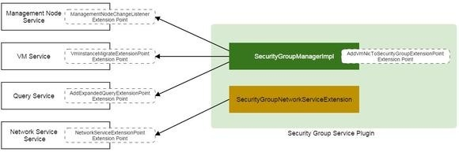

如上图所示的安全组(security group)功能，它需要在虚拟机的不同生命期对防火墙规则进行编程。

1. 对于虚拟机本身来说，安全组只是一个附加功能，所以并不应该实现在虚拟机自身的逻辑当中
2. 基于ZStack的插件系统，安全组通过虚拟机模块，网络模块等定义的扩展点插入到了虚拟机生命期，网络配置等业务逻辑中，在不修改任何已有模块的情况下，实现成一个单独的Java JAR文件。
3. 也就是说，安全组本身不会对现有功能造成任何影响，即使删除安全组对应的JAR文件，整个系统也只是失去了这个功能而已

通过插件系统，ZStack本身架构完全实现了**松耦合**

### Tag system

插件可以通过定义system tag，在不修改已有数据库表的情况下，实现为现有表添加新的字段

例如在虚拟机表中并不存在一个字段叫hostname，ZStack的一个插件通过定义一个vm::hostname的system tag，为虚拟机表增加了这个字段，从而允许用户在创建虚拟机时指定它的hostname

通过这种方式，插件在扩展已有功能时，无需对现有数据库表格式进行修改，从而减轻了软件升级过程中数据库迁移的负担

### 测试驱动

ZStack中验证功能点的唯一方法就是写测试用例，我们有三个全自动化的测试系统：

1. Integration testing system：
2. System testing system：
3. Model-based testing system：可以随机组合API生成测试用例，测试出很多正常使用情况下无法触及的死角
   - 为了能够快速重现Model-based testing system发现的死角，我们还开发了一个回放工具，它能读入Model-based测试用例产生的日志而生成一个新测试用例通过回放失败用例来产生一个供开发人员调试的环境，避免了人工手动重试数千个API来重现失败用例

## 高性能

`ZStack`的高性能受益于三个架构设计：**全异步架构，无状态服务架构，无锁架构**

### 全异步架构

全异步架构保证一个任务从API调用开始，到最后在外部设备上执行的过程都是全异步的，任何线程都不会因等待一个操作完成而阻塞。

`ZStack`的全异步架构由三部分组成：异步消息（服务之间调用时使用）、异步函数调用、异步HTTP调用

1. 宏观上看，ZStack的功能划分成了多个独立的服务，**服务之间通过消息通信**，连API都是以消息的形式实现(例如有虚拟机服务，网络服务，存储服务等)。
2. 在服务的内部存在许多组件，他们协作完成一个服务的功能。这些**组件之间**的调用使用的是**传统的函数调用方式**，通过回调函数(callback)实现异步。
3. 服务与外部agent通信时采用的是异步 HTTP调用（例如在创建KVM虚拟机时，虚拟机服务将请求提交给KVM agent后就返回了。KVM agent在虚拟机创建完成后，会通过回调HTTP链接通知虚拟机服务。）

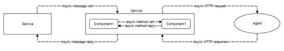

### 无状态服务

无状态服务是指通过一致性哈希环(consistent hashing ring)，服务本身可以和它所管理的具体资源分离开来，服务相互之间也无需交换所管理资源的信息

例如在多管理节点部署中会存在多个虚拟机服务，他们共同管理系统中的所有虚拟机。但**每个服务自身是不需要知道**哪些虚拟机是自己管理的，哪些是其它人管理的。当其它服务向虚拟机服务发送请求时，会用虚拟机的UUID通过一致性哈希环算出管理这个虚拟机的服务，从而保证无论**请求在哪个管理节点发起，最终都会被发送到相同的服务去处理**。

也就是说一个管理节点相当于一个办事员，既可以接收外面的命令，也可以执行命令。而他们通过一致性哈希算法来确定发给自己的任务是自己干还是交给别人干

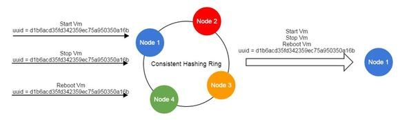

得益于无状态服务，ZStack的所有业务逻辑无需通过锁相互竞争资源，资源竞争完全**通过队列**控制

由于一致性哈希环会把针对某一个资源的操作全部转发到同一个服务，ZStack允许每个服务在内存中创建FIFO队列，以请求到达的顺序响应

1. 对于所有操作只能顺序执行的资源，例如虚拟机，服务可以创建并发度为1的队列，保证同一时间只有一个操作在执行

   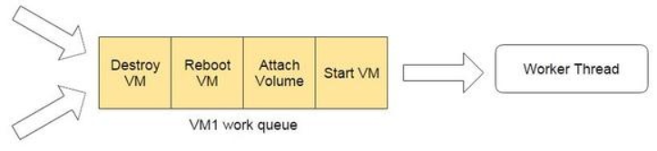

2. 对于允许并发操作的资源，例如物理服务器可以允许同时执行多个操作，可以创建并发度大于1的队列。

   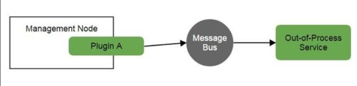

通过基于队列的无锁架构，ZStack即实现了对关键资源的操作同步，又实现了对操作并发度的控制，在提高系统的吞吐性同时，又保证了系统在大吞吐量时的稳定性。

## 扩展性

考虑到了不同的用户对云的使用模式的差异性、

- 如公有云提供商，服务提供商，倾向于亚马逊的模式
- 传统企业用户，则更喜欢VMWare的企业虚拟化模式(Enterprise Virtualization)

架构设计

1. `ZStack`将每个功能实现成小插件，默认是亚马逊的EC2模式，也就是各种资源池化
2. 在这个基础上，通过一些辅助插件，ZStack可以在**EC2的模式**上组合出**VMWare这种以虚拟机为中心的模式**

两种模式还可以互通，比如以虚拟机为中心的模式也可以使用EC2模式所提供的安全组（security group），弹性IP（EIP）这样的网络服务

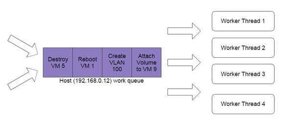

ZStack的整个架构并非离散的功能点的组合，而是在经过精密设计后相辅相成的。例如：

1. 要实现查询API自动化，数据模型就必须预先定义完备；
2. 又比如要实现无锁架构，就必须要有无状态服务的基础。

通过对架构的缜密思考，ZStack有信心解决当前IaaS行业面临的困难，为用户提供一款优秀的开源软件。

# 2.进程内微服务架构 

为了应对诸如惊人的操作开销、重复的努力、可测试性等微服务通常面临的挑战，以及获得诸如代码解耦，易于横向扩展等微服务带来的好处

ZStack将**所有服务包含在单个进程中**，称为**管理节点**，构建一个进程内的微服务架构

## 设计原因

构建一个IaaS软件是很难的，这是一个已经从市场上现存的IaaS软件获得的教训。作为一个集成软件，IaaS软件通常需要去管理复杂的各种各样的子系统（如：虚拟机管理器hypervisor，存储，网络，身份验证等）并且需要组织协调多个子系统间的交互。如果一开始设计一套架构，随着功能拓展，我们会发现组件之间的调用会相当的复杂

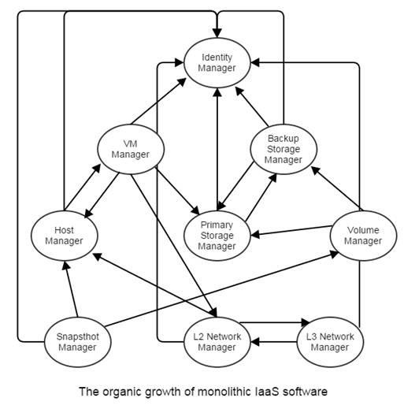

因此这就是使用微服务架构的绝佳场景

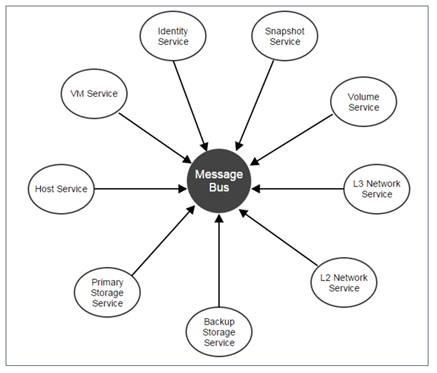

服务在微服务中是编译独立的，添加或者删除服务将不会影响整个系统的架构。

不过也存在如下的问题：

1. **难以定义服务的边界和重复做功**，管理数据库交互的代码非常难以决定应不应该被定义为服务，数据库服务可以使得整个架构更加清晰明了，但是这样会导致严重的性能下降；服务很容易重复造轮子和导致不必要的重复做功
2. **软件难以部署、升级和维护**， 服务的数量确实很重要：IaaS软件通常有许许多多的服务。拿著名的openstack举个例子，为了完成一个基础的安装你将需要：Nova, Cinder, Neutron, Horizon, Keystone, Glance
3.  **零散的配置**，运行在不同服务器上的服务，分别维护着它们散乱在系统各个角落的配置副本。在系统范围更新配置的操作通常由临时特定的脚本完成，这会导致由不一致的配置产生的令人费解的失败。
4. **额外的监控努力**，为了跟踪系统的健康状况，用户必须付出额外的努力去监控每一个服务实例。这些监控软件，要么由第三方工具搭建，要么服务自身维护，仍然受到和微服务面临的问题所类似的问题的困扰，因为它们仍然是以分布式的方式工作的软件。
5. **插件杀手**，插件这个词在微服务的世界中很少被听到，因为每个服务都是运行在不同进程中一个很小的功能单元（function unit）；传统的插件模式（参考The Versatile Plugin System）目标是把不同的功能单元相互挂在一起，这在微服务看来是不可能的，甚至是反设计模式的。然而，对于一些很自然的，要在功能单元间强加紧密依赖的业务逻辑，微服务可能会让事情变得非常糟糕，因为缺乏**插件支持**，修改业务逻辑可能引发一连串服务的修改。

## 所有的服务都在一个进程

意识到上述的所有问题，以及这么一个事实，即一个可以正常工作的IaaS软件必须和所有的编排服务一起运行之后，ZStack把所有服务封装在单一进程中，称之为管理节点。除去一些微服务已经带来的如解耦架构的优点外，进程内的微服务还给了我们很多额外的好处：

1. **简洁的依赖**
   - 因为所有服务都运行在同一进程内，软件只需要一份支持软件（如：database library, message library）的拷贝；升级或改变支持库跟我们对一个单独的二进制应用程序所做的一样简单。

2. 高可用，负载均衡和监控
   - 服务可以专注于它们的业务逻辑，而不受各种来自于高可用、负载均衡、监控的干扰，这一切只由管理节点关心；更进一步，状态可以从服务中分离以创建无状态服务

3. 中心化的配置

   - 由于在一个进程中，所有的服务共享一份配置文件——zstack.properties；用户不需要去管理各种各样的分散在不同机器上的配置文件。
   - 易于部署、升级、维护和横向扩展

   - 部署，升级或者维护一个单一的管理节点跟部署升级一个单一的应用程序一样容易。横向扩展服务只需要简单的增加管理节点。

4. 允许插件
   - 因为运行在一个单一的进程中，插件可以很容易地被创建，和给传统的单进程应用程序添加插件一样。
   - 进程内的微服务并不是一个新发明：早在90年代，微软在COM（Component Object Model）中把server定义为远程、本地和进程内三种。这些进程内的server是一些DLLs，被应用程序在同一进程空间内加载，属于进程内的微服务。Peter Kriens在四年前就声称已经定义了一种总是在同一进程内通信的服务，OSGi µservices。

在微服务中，一个服务通常是一个可重复的业务活动的逻辑表示，是无关联的、松耦合的、自包含的，而且对服务的消费者而言是一个“黑盒子”。简单来说，一个传统的微服务通常只关心特定的业务逻辑，有自己的API和配置方法，并能像一个独立的应用程序一样运行。尽管ZStack的服务共享同一块进程空间，它们拥有这些特点中的绝大多数。ZStack很大程度上是一个使用强类型语言java编写的项目，但是在各个编排服务之间没有编译依赖性，例如：计算服务（包含VM服务、主机服务、区域服务、集群服务）并不依赖于存储服务（包含磁盘服务、基础存储服务、备份存储服务、磁盘快照服务等），虽然这些服务在业务流程中是紧密耦合的。

在源代码中，一个ZStack的服务并不比一个作为一个独立的jar文件构建的maven模块多任何东西。每一个服务可以定义自己的APIs、错误码、全局配置，全局属性和系统标签。例如KVM的主机服务拥有自己的APIs（如下所示）和各种各样的允许用户自己定义配置的方式。

## 我的理解

简单来说就是，单台部署所有服务成为管理节点（**单进程+全量微服务**），微服务拆出的不同服务在这个项目中只做功能拆分，而不做分布式部署（**不做服务级分布式，但做节点级分布式**）

**进程内微服务架构** = 「微服务的解耦优势」 + 「单进程部署的简洁性」：

- 本质：把原本分布式部署（多服务器 / 多进程）的微服务，全部封装到**同一个操作系统进程（ZStack 管理节点）** 中运行；

- 核心特点：服务间保持微服务的 “逻辑解耦、独立职责、无编译依赖”，但放弃了 “物理分布式部署”，转而在单进程内通过异步消息 / 多线程完成交互；

- 对比传统微服务：

  | 维度       | 传统分布式微服务      | ZStack 进程内微服务             |
  | ---------- | --------------------- | ------------------------------- |
  | 部署形态   | 多进程 / 多服务器     | 单进程（管理节点）              |
  | 服务间通信 | 网络调用（HTTP/RPC）  | 进程内异步消息（RabbitMQ 总线） |
  | 配置管理   | 多配置文件 / 分散存储 | 单配置文件（zstack.properties） |
  | 依赖管理   | 多份依赖库 / 重复加载 | 一份依赖库 / 共享使用           |
  | 并发处理   | 多进程并发            | 单进程内多线程并发              |

# 3.异步架构

在某一时刻，IaaS系统可能有成千上万个任务要处理，这些任务可能来自API也可能来自内部组件。在糟糕的情况下，用户为了创建一台新的虚拟机可能需要等待一个小时，因为系统同时被5000个任务阻塞，然而线程池仅有1000条线程（这个是我们自己创建的）。

我们非常不赞同一些文章里面描写的关于“**一些基础配套设施，尤其是数据库和消息代理（message brokers）限制了IaaS的可拓展性**”的观点

1. 数据库方面：facebook和twitter的数据量是万亿级别，IaaS软件只处于百万级别（对于一些非常大型的数据中心），而facebook和twitter依旧坚强的使用Mysql作为他们主要的数据库
2. ZStack使用的rabbitmq相对Apache Kafka或ZeroMQ是一个中型的消息代理，但是它依然可以维持平均每秒5万条消息的吞吐量

影响可拓展性的真正原因——任务执行缓慢，因此我们对于一些任务要异步的执行

## **同步和异步**

传统的IaaS软件使用同步的方式执行任务，他们通常给每一个任务安排一个线程，这个线程**只有在之前的任务执行完毕时才会开始执行下一个任务**，因为任务执行缓慢，当达到一个任务并发的高峰时，系统会因为**线程池容量不足**，运行非常缓慢，新来的任务只能被放在队列中等待被执行。

1. 一个直观的想法是提高线程池容量，但是这个想法在实际中是不可行的，即使现代操作系统允许一个应用程序拥有成千上万条线程，没有操作系统可以非常有效率的调度他们。
2. 随后有一个想法是把线程分发出去，让不同的操作系统上相似的软件分布式的处理线程，因为每一个软件都有它自己的线程池，这样最终增加了整个系统的线程容量。然而，分发会带来一定的开销，它增加了管理的复杂度，同时集群软件在软件设计层面依旧是一个挑战。最后，IaaS软件自身变成云的瓶颈，而其他的基础设施包括数据库，消息代理和外部的系统（比如成千台物理服务器）都足够去处理更多的并发任务。

针对这个情况，zstack使用异步架构来解决这个问题（相当于是托管给KVM等外部组件）：

我们把目光投向IaaS软件和数据中心的设备之间的关系，我们会发现IaaS软件实际上扮演着一个协调者的角色，它负责协调外部系统但并不做任何真正耗时的操作（举个例子，存储系统可以分配磁盘容量，镜像系统可以下载镜像模板，虚拟机管理程序可以创建虚拟机）。**IaaS软件所做的工作是做决策然后把子任务分配给不同的外部系统**（比如，对于KVM，KVM主机需要执行诸如准备磁盘、准备网络、创建虚拟机等子任务。创建一台虚拟机可能需要花费5s，IaaS软件花费时间为0.5s，剩下的4.5s被KVM主机占用，ZStack的异步架构使IaaS管理软件不用等待4.5s，它只需要花费0.5s的时间选择让哪一台主机处理这个任务，然后把任务分派给那个主机。*一旦主机完成了它的任务，它将结果通知给IaaS软件*）。通过异步架构，一个只有100条线程容量的线程池可以处理上千数的并发任务。

## ZStack的异步方法

异步操作在计算机科学中是非常常见的操作，异步I/O,AJAX等都是一些众所周知的例子。在laas集成软件的场景下，**最大的挑战是必须让所有组件都异步，并不只是一部分组件异步**

举个例子，如果你在其他服务都是同步的条件下，建立一个异步的存储服务，整个系统性能并不会提升。因为在异步的调用存储服务时，调用的服务自身如果是同步的，那么调用的服务必须等待存储服务完成，才能进行下一步操作，这会使得整个工作流依旧是处于同步状态。（一个执行业务流程服务的线程同步调用了存储服务，然而存储服务和外部存储系统是异步通信的，因此它依旧需要等到存储服务返回之后，才能往下执行，这里的异步就等同于同步了。）

ZStack的异步架构包含了三个模块：异步消息，异步方法，异步HTTP调用：

1. 异步消息

   - ZStack使用rabbitmq作为一个消息总线连接各类服务，当一个服务调用另一个服务时，源服务发送一条消息给目标服务并注册一个回调函数，然后立即返回。一旦目标服务完成了任务，它返回一条消息触发源服务注册的回调函数。代码如下：

   - ```java
     AttachNicToVmOnHypervisorMsg amsg = new AttachNicToVmOnHypervisorMsg();
     amsg.setVmUuid(self.getUuid());
     amsg.setHostUuid(self.getHostUuid());
     amsg.setNics(msg.getNics());
     
     // 指定目标服务
     bus.makeTargetServiceIdByResourceUuid(amsg, HostConstant.SERVICE_ID, self.getHostUuid());
     
     // 发送消息并注册回调
     bus.send(amsg, new CloudBusCallBack(msg) {
         @Override
         public void run(MessageReply reply) {
             AttachNicToVmReply r = new AttachNicToVmReply();
             if (!reply.isSuccess()) {
                 r.setError(errf.instantiateErrorCode(VmErrors.ATTACH_NETWORK_ERROR, r.getError()));
             }
             bus.reply(msg, r);
         }
     });
     ```

   - ```mermaid
     graph TD
         A[源服务] -->|"1. 构建消息+注册回调函数"| B[RabbitMQ消息总线]
         B -->|"2. 转发消息"| C[目标服务]
         C -->|"3. 执行任务（如挂载网卡/连接主机）"| D{任务执行结果}
         D -->|成功/失败| C
         C -->|"4. 发送结果消息"| B
         B -->|"5. 触发源服务注册的回调函数"| A
         A -->|"6. 回调函数处理结果（返回响应/发布事件）"| E[请求方/后续流程]
     ```

     - 源服务先把要执行的任务封装成消息，同时告诉系统 “任务做完后要调用 XX 函数处理结果”，然后把消息丢给 RabbitMQ；
     - RabbitMQ 把消息传给目标服务，目标服务执行具体任务（比如给虚拟机挂载网卡）；
     - 任务执行完后，目标服务把结果通过 RabbitMQ 回传给源服务；
     - 源服务触发之前注册的回调函数，用这个结果做后续处理（比如返回成功 / 失败响应）。

2. 服务内部异步方法调用

   - ZStack 服务内部的组件、插件交互，同样采用异步方式，通过 `Completion` 回调接口处理执行结果（支持带返回值的回调）

   - ```java
     // 无返回值异步方法
     protected void startVm(final APIStartVmInstanceMsg msg, final SyncTaskChain taskChain) {
         startVm(msg, new Completion(taskChain) {
             @Override
             public void success() {
                 // 成功逻辑：发布事件并执行下一个任务
                 VmInstanceInventory inv = VmInstanceInventory.valueOf(self);
                 APIStartVmInstanceEvent evt = new APIStartVmInstanceEvent(msg.getId());
                 evt.setInventory(inv);
                 bus.publish(evt);
                 taskChain.next();
             }
     
             @Override
             public void fail(ErrorCode errorCode) {
                 // 失败逻辑：发布错误事件
                 APIStartVmInstanceEvent evt = new APIStartVmInstanceEvent(msg.getId());
                 evt.setErrorCode(errorCode);
                 bus.publish(evt);
                 taskChain.next();
             }
         });
     }
     ```

   - ```java
     // 带返回值异步方法
     public void createApplianceVm(ApplianceVmSpec spec, final ReturnValueCompletion<ApplianceVmInventory> completion) {
         CreateApplianceVmJob job = new CreateApplianceVmJob();
         job.setSpec(spec);
         
         if (!spec.isSyncCreate()) {
             // 异步执行任务，通过回调返回结果
             job.run(new ReturnValueCompletion<Object>(completion) {
                 @Override
                 public void success(Object returnValue) {
                     completion.success((ApplianceVmInventory) returnValue);
                 }
     
                 @Override
                 public void fail(ErrorCode errorCode) {
                     completion.fail(errorCode);
                 }
             });
         } else {
             // 同步执行逻辑
             jobf.execute(spec.getName(), OWNER, job, completion, ApplianceVmInventory.class);
         }
     }
     ```

   - ```mermaid
     graph TD
         A[服务内部调用方] -->|"1. 调用异步方法+传入Completion回调"| B[被调用组件/插件]
         B -->|"2. 执行业务逻辑（如启动虚拟机/创建应用VM）"| C{任务执行结果}
         C -->|成功| B
         B -->|"3. 调用回调的success()方法"| A
         C -->|失败| B
         B -->|"3. 调用回调的fail()方法"| A
         A -->|"4. 回调内处理结果（发布事件/返回VM信息）"| D[任务链/上层流程]
     ```

     - 服务里的 A 组件调用 B 组件的方法时，不直接等结果，而是给 B 组件传一个 “结果处理规则”（Completion 回调）；
     - B 组件执行完业务逻辑（比如启动虚拟机）后，根据结果触发回调里的`success()`或`fail()`；
     - A 组件在回调里处理结果（比如成功就发布 “虚拟机启动成功” 事件，失败就返回错误码），然后继续执行后续任务。

3. HTTP 异步调用（Agent 管理外部系统）

   - ZStack 通过 Python CherryPy 构建轻量级 Agent 管理外部系统（如 KVM 主机、虚拟路由）。由于缺乏双向通信能力，在 HTTP 请求头中嵌入回调 URL，Agent 完成任务后主动调用该 URL 返回结果。

   - ```java
     RefreshFirewallCmd cmd = new RefreshFirewallCmd();
     List<ApplianceVmFirewallRuleTO> tos = new RuleCombiner().merge();
     cmd.setRules(tos);
     
     // 异步发送 HTTP 请求，注册 JSON 回调处理结果
     resf.asyncJsonPost(buildUrl(ApplianceVmConstant.REFRESH_FIREWALL_PATH), cmd, new JsonAsyncRESTCallback<RefreshFirewallRsp>(msg, completion) {
         @Override
         public void fail(ErrorCode err) {
             /* 处理请求失败逻辑 */
         }
     
         @Override
         public void success(RefreshFirewallRsp ret) {
             /* 处理请求成功逻辑 */
         }
     
         @Override
         public Class<RefreshFirewallRsp> getReturnClass() {
             return RefreshFirewallRsp.class;
         }
     });
     ```

   - ```mermaid
     graph TD
         A[ZStack核心服务] -->|"1. 构建HTTP请求：嵌入回调URL+注册JSON回调"| B[Python CherryPy Agent]
         A -->|"2. 发送异步HTTP请求后立即返回"| A
         B -->|"3. 执行任务（如刷新防火墙规则）"| C{任务执行结果}
         C -->|成功/失败| B
         B -->|"4. 调用回调URL，返回结果"| A
         A -->|"5. 触发JSON回调的success()/fail()"| D[处理结果（更新状态/返回响应）]
     ```

     - ZStack 核心服务给管理外部系统的 Agent 发 HTTP 请求时，会在请求头里塞一个 “回调地址”，同时注册一个 JSON 回调函数；
     - 核心服务发完请求就不管了，不用等结果；
     - Agent 执行完任务（比如刷新防火墙规则）后，主动访问这个**回调地址**，把结果传回去；
     - 核心服务收到结果后，触发之前注册的 JSON 回调，处理成功 / 失败逻辑（比如更新防火墙状态）。

4.  ZStack 全局异步架构流程图（Mermaid 汉语通俗解释）

   - ```mermaid
     graph TB
         subgraph "发起请求方"
             A[API请求/内部组件任务]
         end
     
         subgraph "三种异步处理通道"
             B[异步消息通道]
             C[服务内部异步方法]
             D[HTTP异步调用通道]
         end
     
         subgraph "底层支撑组件"
             B1[RabbitMQ消息总线]
             C1[Completion回调接口]
             D1[Python CherryPy Agent]
         end
     
         subgraph "任务处理方"
             E[目标服务/内部插件/外部系统]
         end
     
         subgraph "结果处理"
             F[回调函数处理结果]
             G[发布事件/返回响应]
         end
     
         %% 流程关联
         A --> B & C & D
         B --> B1 --> E
         C --> C1 --> E
         D --> D1 --> E
         E --> F --> G
     ```

     - **请求发起**：系统的任务来自外部 API 请求或内部组件的业务需求。
     - **异步分流**：任务会被分发到三个异步通道处理：
       - 跨服务的任务走 **RabbitMQ 异步消息通道**；
       - 服务内部组件交互走 **异步方法通道**；
       - 管理外部系统的任务走 **HTTP 异步调用通道**。
     - **任务执行**：底层支撑组件把任务转发给对应的处理方（目标服务、插件、外部系统）。
     - **结果回调**：任务处理完成后，通过预先注册的回调函数处理结果，最后发布事件或返回响应给请求方。

# 4.无状态架构

## 设计原因

1. 当用户想要去创建一个高可用的生产环境或处理非常大的并发工作负载，一个管理节点是不够的。解决方案是建立一个负载均衡的分布式系统，这种通过添加新节点来拓展整个系统的能力的方法被称为横向拓展。设计一个分布式系统不是一件简单的事情。
2. 一个分布式系统，特别是一个有状态的系统，必须处理一致性（consistency）、可用性（availability）和分区容忍性（partition tolerance）（CAP理论）的问题
3. 与之相反，一个无状态的分布式系统一定程度上降低了复杂度
   - 第一，因为节点不用分享状态，整个系统的一致性是可以保证的。
   - 第二，因为节点都是相似的，对于分区问题系统通常是可以容忍的。

因此，通常把一个分布式系统设计为无状态的而不是有状态的，使整个系统无状态的基础是无状态的服务，在讨论什么是无状态的服务之前，我们首先理解什么是“状态”。
在ZStack中，主机、虚拟机、镜像和用户等资源是被一个个服务管理的。当整个系统的服务实例不止一个的时候，资源会被分发到不同的服务实例中。假设有10000台虚拟机和两个虚拟机服务实例，理想状态下每个实例会管理5000台虚拟机。

因为有两个服务实例，在向一个虚拟机发出请求前，请求者必须知道哪个实例管理哪个虚拟机，否则，他将不知道向哪个实例发出请求。类似“**哪个服务实例管理哪个资源**”的信息就是我们所说的状态。如果一个服务是有状态的，每个服务维护自己的状态。请求者必须可以获取到当前的状态信息。当服务实例的数量改变的时候，服务需要去改变状态。

状态的改变是危险且易错的，这通常限制了整个系统的可拓展性。

## 实现

为了使整个系统的可靠性和横向拓展性增强，把状态和服务分离开，使得服务无状态是比较理想的解决办法（参考Service Statelessness Principle）。**无状态的服务使请求者不需要询问向哪里发送请求，当新添一个新的服务实例或者删除一个旧的服务实例的时候，服务之间也不用交换状态。**

备注：在以下文档中，为了简便，“服务”和“服务实例”是可以互换的

### 服务和管理节点

通过中心消息代理-- RabbitMQ彼此通信的服务，在ZStack中是一等公民。

与典型的microservice架构不同，典型的microservice架构中每个服务通常运行在不同的进程或者不同的机器上，ZStack则把所有服务封装在一个被称为管理节点的进程中。文章“进程内的microservice架构”解释了我们这么做的原因。针对ZStack的业务逻辑，实现无状态服务的核心技术，是一致性哈希算法。当系统启动的时候，每一个管理节点将被分配一个version 4 UUID（管理节点UUID），这个UUID将和服务名称拼在一起在消息代理上注册一个服务队列。例如，一个管理节点可能有类似下面的服务队列：

```
zstack.message.ansible.3694776ab31a45709259254a018913ca
zstack.message.api.portal      
zstack.message.applianceVm.3694776ab31a45709259254a018913ca    
zstack.message.cloudbus.3694776ab31a45709259254a018913ca    
...
```

所有的队列都是以一个相同的管理节点的UUID结尾的，主机，磁盘，虚拟机等资源也有特定的UUID。和资源相关的消息通常在服务之间传递，在发送一个消息之前，发送者必须基于资源的UUID选择一个接收服务，一致性哈希算法这时候就发挥作用了。

一致性哈希是一种较特别的哈希，当一个哈希表的大小发生变化时，只有一部分键需要被重新映射。深入了解一致性哈希，请阅读http://www.tom-e-white.com/2007/11/consistent-hashing.html，在ZStack中，管理节点组成了一个一致性哈希如下：

**每一个管理节点维护了一份包含系统中所有管理节点的UUID的环拷贝**，当一个管理节点添加或删除的时候，一个**生命周期事件**[生命周期事件就像公司的 “人员变动通知”—— 新员工入职（节点上线）、老员工离职（节点下线），HR 会发全员邮件（广播事件），让所有人都知道最新的 “公司人员名单”（一致性哈希环），避免找人时找错人（消息路由错误）]将通过消息代理广播到其他的管理节点，这将导致这些节点拓展或者收缩环去描述当前系统的状态。当发送一条消息时，发送者将使用资源的UUID哈希得出目标管理节点的UUID。例如，当VM的UUID是932763162d054c04adaab6ab498c9139时发送一个`StartVmInstanceMsg`

每个管理节点都是**一个功能齐全的ZStack软件**。因为包含的服务是无状态的，管理节点不共享任何状态，但仍然需要维护和其他节点的心跳记录，和一个一致性哈希环，我们接下来将详细介绍哈希环。心跳用来监视管理节点是否正常运行，一旦一个管理节点停止更新自己的心跳一段时间后，其他的管理节点将会驱逐它然后接管他所管理的资源。

### 无状态的服务

针对ZStack的业务逻辑，实现无状态服务的核心技术，是一致性哈希算法。当系统启动的时候，每一个管理节点将被分配一个version 4 UUID（管理节点UUID），这个UUID将和服务名称拼在一起在消息代理上注册一个服务队列。例如，一个管理节点可能有类似下面的服务队列：

```
zstack.message.ansible.3694776ab31a45709259254a018913ca
zstack.message.api.portal      
zstack.message.applianceVm.3694776ab31a45709259254a018913ca    
zstack.message.cloudbus.3694776ab31a45709259254a018913ca    
...
```

所有的队列都是以一个相同的管理节点的UUID结尾的，主机，磁盘，虚拟机等资源也有特定的UUID。和资源相关的消息通常在服务之间传递，在发送一个消息之前，发送者必须基于资源的UUID选择一个接收服务，一致性哈希算法这时候就发挥作用了。

一致性哈希是一种较特别的哈希，当一个哈希表的大小发生变化时，只有一部分键需要被重新映射。深入了解一致性哈希，请阅读http://www.tom-e-white.com/2007/11/consistent-hashing.html，在ZStack中，管理节点组成了一个一致性哈希如下：

**每一个管理节点维护了一份包含系统中所有管理节点的UUID的环拷贝**(ZStack 里的**哈希环**，可以理解成一个 “刻满了管理节点 UUID 的环形地址簿)，当一个管理节点添加或删除的时候，一个**生命周期事件**将通过消息代理广播到其他的管理节点，这将导致这些节点拓展或者收缩环去描述当前系统的状态。当发送一条消息时，发送者将使用资源的UUID哈希得出目标管理节点的UUID。例如，当VM的UUID是932763162d054c04adaab6ab498c9139时发送一个`StartVmInstanceMsg`，伪代码如下：

```java
# 1. 构建启动虚拟机的消息对象
msg = new StartVmInstanceMsg();

# 2. 核心：通过一致性哈希算法，根据虚拟机UUID计算目标管理节点的UUID
# 入参：待操作的虚拟机UUID（932763162d054c04adaab6ab498c9139）
# 出参：目标管理节点的UUID（用于路由消息）
destinationManagementNodeUUID = consistent_hashing_algorithm("932763162d054c04adaab6ab498c9139");

# 3. 设置消息的目标服务ID（服务名称+目标管理节点UUID，匹配该节点的服务队列）
# 例如最终生成：vmInstance.3694776ab31a45709259254a018913ca
msg.setServiceId("vmInstance." + destinationManagementNodeUUID);

# 4. 通过云总线（CloudBus）发送消息，消息会路由到目标管理节点的对应服务队列
cloudBus.send(msg);
```

1. 代码块中`consistent_hashing_algorithm`函数的核心逻辑：
   - 基于传入的**资源 UUID（虚拟机 UUID）** 哈希计算；
   - 匹配本地维护的「一致性哈希环」（包含所有管理节点 UUID）；
   - 返回该资源对应的目标管理节点 UUID。
2. `setServiceId`拼接规则：对应 ZStack 中 “服务名称 + 管理节点 UUID” 的服务队列命名规范（如`zstack.message.vmInstance.3694776ab31a45709259254a018913ca`）；
3. `cloudBus.send(msg)`：底层基于 RabbitMQ 将消息投递到目标管理节点的`vmInstance.xxx`服务队列，保证消息精准路由。

有了哈希环，资源UUID相同的消息将被映射到特定管理节点的相同服务中，这点是ZStack的无锁架构的基础

当环收缩或者拓展的时候，因为哈希环的固有特性，仅有小部分节点将被影响。**因为使用一致性哈希环，发送者不需要知道哪个服务实例将处理这条消息，因为服务实例将被哈希计算出来。服务也不用维护、交换他们管理的资源信息，并且因为选择正确的服务实例可以由哈希环完成，服务只需要单纯的处理消息。因此，服务变得极其简单且无状态。**

除了包含资源UUID的消息（例如StartVmInstanceMsg, DownloadImageMsg）以外，有一种**不包含资源UUID的消息**，这种消息通常是创造性的消息（例如CreateVolumeMsg）和不进行资源操作的消息（例如AllocateHostMsg），因为这些消息可以被发送到任意管理节点的服务中，他们就被发送到本地的管理节点，因为发送者和接收者在同一个节点上，接收者在发送者发送消息时一定是可用的。

对于API消息（如APIStartVmInstanceMsg），有一个特别的处理方法是他们经常和一个重要的服务ID api.portal绑在一起发送。在消息代理中，一个称为zstack.message.api.portal的全局的队列被所有管理节点的API服务共享，带有api.portal的消息将通过一致性哈希环把消息映射到正确的服务中，从而实现负载均衡。通过上面这种方式，ZStack隐藏了API客户端消息选路的实现，减少了ZStack API客户端代码。

```java
# API消息路由示例伪代码
msg = new APICreateVmInstanceMsg()
msg.setServiceId("api.portal")  # 绑定全局API服务队列
cloudBus.send(msg)  # 基于一致性哈希环负载均衡路由
```

本文演示了ZStack是如何通过构建一个无状态的分布式系统来进行横向拓展的。因为管理节点共享的信息非常少，建立一个庞大的拥有几十或上百个管理节点的集群是非常容易的。然而，在现实中，对于私有云，两个管理节点足够满足高可用性和可拓展性的需求。对于公有云，管理者可以依据负载量大量创建管理节点。因为异步架构和无状态架构，ZStack能够处理现有的IaaS软件处理不了的非常大的并发任务。

## 我的理解

### 哈希环的作用

| 作用维度           | 具体说明                                                     | 类比理解                                                     |
| ------------------ | ------------------------------------------------------------ | ------------------------------------------------------------ |
| 消息精准路由       | 用资源 UUID（如虚拟机 UUID）哈希后，能在环上找到唯一对应的管理节点 UUID，消息只发往该节点的服务队列 | 快递员用收件人手机号后几位哈希，找到唯一的快递网点，只把包裹送过去 |
| 无锁架构基础       | 相同资源 UUID 的消息，永远映射到同一个管理节点的同一个服务，避免多个节点同时操作一个资源，不用加锁 | 同一个用户的所有订单，永远分配给同一个客服，不会出现两个客服同时改一个订单的情况 |
| 动态扩缩容影响最小 | 新增 / 下线节点时，只有小部分资源的路由关系会变，不会全集群乱套 | 快递网点新增一个站点，只有少数片区的快递会改派，不是所有包裹都重新分配 |
| 服务无状态化支撑   | 服务不用记 “我管哪些资源”，只需要等哈希环把对应消息路由过来，接消息就处理 | 客服不用记 “我负责哪些用户”，系统把对应用户的订单自动推过来，接了就处理 |

#### 无状态服务的完整执行链路

1. 集群初始化（哈希环准备）

   - 节点 A、B、C 启动后，各自生成 UUID，通过 “生命周期事件” 广播给集群；

   - 每个节点都在本地生成包含 A、B、C 的哈希环（环形地址簿），三者的哈希环完全一致。

2. 发送方（比如节点 A）处理消息，不用 “知道” 谁来处理

   - 节点 A 收到 “启动虚拟机” 的请求，构建`StartVmInstanceMsg`；

   - 节点 A 调用`consistent_hashing_algorithm`函数，把虚拟机 UUID `932763162d054c04adaab6ab498c9139` 哈希计算；

   - 计算结果匹配到哈希环上的节点 B 的 UUID（比如`3694776ab31a45709259254a018913ca`）；

   - 节点 A 给消息设置服务 ID：`vmInstance.3694776ab31a45709259254a018913ca`，然后通过 CloudBus 发送。

3. 接收方（节点 B）处理消息，不用 “记” 资源信息（核心无状态体现）

   - 节点 B 的`zstack.message.vmInstance.3694776ab31a45709259254a018913ca`队列收到消息；

   - 节点 B 的 vmInstance 服务**完全不用知道 “这个虚拟机是不是我管的”“我还管了哪些虚拟机”** —— 它只需要做一件事：解析消息，执行 “启动虚拟机” 的逻辑；

   - 执行完成后，通过回调返回结果即可，全程**不用维护任何 “资源 - 节点” 的映射关系**。

4. 扩缩容时，无状态服务依然稳定（关键验证），如果此时节点 C 故障下线：

   - 集群触发 “节点下线事件”，A、B 同步更新哈希环（移除 C 的 UUID）；

   - 重新计算虚拟机 UUID 的哈希，发现依然映射到节点 B（只有少数原本映射到 C 的资源会改到 A/B）；

   - 节点 B 的 vmInstance 服务完全不用做任何配置修改，依然是 “接消息就处理”—— 这就是**无状态**：服务本身不绑定任何节点 / 资源信息，只依赖哈希环的路由。

#### 无状态服务的核心价值

1. **服务不用 “记东西”**：节点 B 的 vmInstance 服务，不管是处理 1 台还是 1000 台虚拟机的启动消息，都不用记录 “这些虚拟机归我管”，哈希环会把该来的消息送过来；
2. **节点故障不影响服务逻辑**：就算节点 B 宕机，集群更新哈希环后，该虚拟机的消息会自动路由到 A，A 的 vmInstance 服务不用改任何代码，直接处理即可；
3. **集群扩缩容无感知**：新增节点 D 后，只有小部分资源的消息会路由到 D，A/B/C 的服务依然按原有逻辑运行，不用重启、不用改配置。

# 5.无锁架构

在一个分布式系统中同时实现串行化和细粒度的并行化并不容易，这通常需要借助分布式调度软件，面对挑战，ZStack提出基于队列的无锁架构，使得任务本身可以简单的控制他们的并行化等级为1（串行的）…N（并行的）。

好的IaaS软件应该能对任务的串行化和并行化进行细粒度的控制。通常，因为任务之间有依赖关系，**任务希望以特定的序列被执行**。比如，如果当一个对某个磁盘进行快照的任务正在运行时，那么删除该磁盘的操作不能被执行。有些时候，为了提升性能，**任务应该被并行地执行**；比如，在同一台主机上有十个创建虚拟机的任务，这些任务可以同时运行并不会产生任何问题。然而，如果不进行合理的控制，并行化会对系统造成一定的伤害；比如，1000个在一台主机上创建虚拟机的并发任务，将毫无疑问的摧毁整个系统，或者导致整个系统长时间没有任何回应。这种并发编程问题在多线程的环境中是复杂的，并且在分布式系统环境中将更加复杂。

1. 在一个节点中，解决同步和并行问题的答案是锁（lock）和信号量（semaphore）
2. 在分布式系统中为了解决此问题，一个直接的想法是使用一些类似Apache ZooKeeper的分布式调度软件或一些基于Redis的类似软件

问题在于，当使用锁和信号量的时候，**一个线程需要去等待其他线程释放他们所持有的锁或者信号量。**在“ZStack可拓展性秘密武器1：异步架构”中我们阐述了ZStack是一个异步的软件，没有线程将因为等待其他线程的完成而被阻塞，所以使用锁和信号量并不是一个可行的方案。

 **同步（Synchronous）与串行化（Synchronized）**：在我们的文档中同步（Synchronous）是指一个任务将会在运行时阻塞线程，而串行化（Synchronized）是指一个任务执行时是互斥的。如果一个任务一直占用一个线程直到任务完成，它是同步的（Synchronous）任务。如果一个任务在其他任务执行时不能被同时执行，它是串行的（Synchronized）任务。

## 无锁架构的基础

​     无锁架构的基础是一致性哈希算法，因为一致性哈希算法保证了对应同一资源的所有消息，总是被同一服务实例处理。这种聚合消息到特定节点的做法，降低了同步与并行化的复杂度，因为处理环境从分布式系统变为多线程。（详见“ZStack可拓展性秘密武器2：无状态服务”）。

## 工作流

传统而又清楚的解决方案

（ps：在深入讲解细节之前，请注意我们将要讲的队列和 “ZStack 可拓展性秘密武器 2：无状态服务” 中提到的 RabbitMQ 的消息队列是**没有任何关联的**。消息队列就是 RabbitMQ 的一个术语，**ZStack 的队列指的是内部的数据结构**）

因为 ZStack 是消息驱动的，聚合消息使得**相关联的任务在同一节点执行**，避免了需要使用线程池进行并发编程的经典问题。为了避免竞争锁，ZStack 将使用工作队列而不是锁和信号量的方式。串行的（synchronized）任务以工作队列的方式保存在内存中，最终一个个的被执行。

工作队列在保存任务的同时也保存并行度，使得并行的任务能以一个定义好的并行度执行。下面的例子展示了一个并行度为 4 的队列。(ps：备注：串行的（synchronized）和并行的任务都可以被工作队列执行，当并行度等于 1 的时候，队列是串行的（synchronized）；并行度大于 1 的时候，队列是并行的；并行度等于 0 的时候，队列的并行度不被限制。)

### 基于内存的同步队列

在 ZStack 中有两种类型的工作队列；一种是同步的（synchronous）工作队列，即一个任务（通常是一个 Java 可执行程序）在它返回后才被认为已经完成。

```java
// 提交同步任务到工作队列
thdf.syncSubmit(new SyncTask<Object>() {
    // 定义同步任务的唯一标识（用于队列分组/调度）
    @Override
    public String getSyncSignature() {
        return "api.worker";
    }

    // 设置同步任务的并行度（apiWorkerNum为配置的并行度数值）
    @Override
    public int getSyncLevel() {
        return apiWorkerNum;
    }

    // 定义任务名称，用于日志/监控识别
    @Override
    public String getName() {
        return "api.worker";
    }

    // 任务核心执行逻辑
    @Override
    public Object call() throws Exception {
        // 判断消息类型是否为"API是否就绪"消息
        if (msg.getClass() == APIIsReadyToGoMsg.class) {
            // 处理"API是否就绪"类型的消息
            handle((APIIsReadyToGoMsg) msg);
        } else {
            try {
                // 分发处理通用API消息
                dispatchMessage((APIMessage) msg);
            } catch (Throwable t) {
                // 捕获异常：记录异常日志并附带消息内容
                bus.logExceptionWithMessageDump(msg, t);
                // 给消息发送方返回错误响应
                bus.replyErrorByMessageType(msg, errf.throwableToInternalError(t));
            }
        }
        /* 当call()方法返回后，队列会立即执行下一个任务 */
        return null;
    }
});
```

强调：在同步（synchronous）队列中，一个 Runnable.run () 返回后，工作线程将继续抓取下一个可执行程序，一直到整个队列为空时，该线程将被放回线程池。因为任务将一直占用一个工作线程，所以队列是同步的（synchronous）。

### 基于内存的异步队列

另一种异步工作队列的方式指的是，当任务发布了一个完整的通知，就被认为已经完成。

```java
// 提交链式异步任务到工作队列（入参为待处理的消息）
thdf.chainSubmit(new ChainTask(msg) {
    // 定义任务名称，拼接虚拟机UUID便于识别（如"start-vm-xxx-xxx-xxx"）
    @Override
    public String getName() {
        return String.format("start-vm-%s", self.getUuid());
    }

    // 定义同步标识，关联到指定的串行线程名称
    @Override
    public String getSyncSignature() {
        return syncThreadName;
    }

    // 任务核心执行逻辑，入参chain用于控制任务链路流转
    @Override
    public void run(SyncTaskChain chain) {
        // 执行启动虚拟机的核心逻辑，传入chain用于后续通知
        startVm(msg, chain);
       
        /* 只有当startVm()方法内部调用了chain.next()后，队列才会执行下一个任务 */
    }
});
```

强调：因为使用异步队列，ChainTask.run (SyncTaskChain chain) 方法可能在做完一些异步操作后立即返回，比如说，发送了一个注册回调函数的消息。在 run () 方法返回后，工作线程立即返回到线程池；然而，**工作线程返回的时候，任务并没有被完成**，在队列中的任务直到前一个任务发出了一个通知（比如说调用 SyncTaskChain.next () 函数）后才可以被运行，因为任务本身不会阻塞工作线程，不会让它等到任务本身完成，所以队列是异步的。

### 限制

虽然基于无锁架构的队列能 99.99% 的解决一个管理节点内的串行和并行问题，一致性哈希算法会导致系统进入混乱的状态：一个新加入的节点将因为一致性哈希算法接管临近节点的一部分工作。

在这个样例中，node 3 新加入后，之前在 node2 上的一部分任务将转移到 node3 上，在这个时候，如果一个与某资源相关的旧任务仍然运行在 node2 上，但是与同一资源相关的新任务被提交到 node3 中，这种情况下就会发生混乱。然而，情景并没有想象的那么糟糕。

1. 首先，互相冲突的任务在一个正常的系统中很少存在，比如，一个健壮的 UI 应该不允许你在启动一台虚拟机的同时关闭这台虚拟机。
2. 第二，每一个 ZStack 的资源有他们的状况（state）/ 状态（status），如果任务开始的时候，资源处于错误的状况 / 状态，这将会导致报错。比如，如果一个虚拟机在停止状态，给该虚拟机绑定磁盘的任务将立即返回错误。
3. 第三，处理很多任务传输的代理（agents），有一个附加的串行机制；例如：尽管我们在管理节点上已经有了云路由的工作队列，云路由代理（agent）将串行所有修改 DHCP 配置文件的请求。最后，提前规划好操作是持续管理云的关键，操作组可以在启动云之前启动足够的管理节点，如果不需要动态添加一个新的节点，当云在运行的时候添加管理节点的几率是较小的。

本部分主要介绍了无锁架构，它是建立在基于内存的工作队列的基础上的。ZStack没有使用复杂的分布式调度软件，尽可能的提升了自己的性能，同时也预防了任务异常的产生。

## 我的理解

无锁化的核心是**从 “线程竞争资源加锁” 转向 “消息 / 任务串行化执行”**，从根源上消除锁的需求。这个队列**不是针对管理节点单线程操作**，也非依赖单线程。

### 队列的 “并行度” 是核心控制手段

| 并行度值   | 队列执行模式 | 线程使用逻辑                                                 | 举例（贴合 IaaS 场景）                                       |
| ---------- | ------------ | ------------------------------------------------------------ | ------------------------------------------------------------ |
| 并行度 = 1 | 串行执行     | 同一资源的所有任务，由 1 个**线程**串行处理（其他线程处理其他资源的任务） | 某台磁盘的 “创建快照”“删除磁盘” 任务串行，避免冲突；但其他磁盘的任务可由其他线程并行处理 |
| 并行度 = 4 | 有限并行     | 同一类任务（如 “主机 A 创建 VM”）最多 4 个线程同时执行       | 主机 A 上最多同时创建 4 台 VM，既提升效率，又避免 1000 个并发任务压垮主机 |
| 并行度 = 0 | 无限制并行   | 线程池有多少空闲线程，就用多少线程执行                       | 无资源冲突的纯计算任务（如统计 VM 数量），最大化利用线程池   |

### “串行化任务”≠“单线程进程”

- 管理节点进程内有**线程池**（多线程），比如线程池有 20 个线程；
- 队列的 “串行” 仅针对**同一资源 / 同一类任务**（如 VM-A 的所有操作），而非整个进程；
- 不同资源的任务仍由不同线程并行处理（如 VM-A 的任务串行，VM-B 的任务也串行，但 VM-A 和 VM-B 的任务由不同线程同时执行）

### 为什么队列能实现 “无锁化”？

无锁化的核心是 **“消除竞争场景”**，而非 “用更复杂的锁替代”，ZStack 通过 “一致性哈希 + 工作队列” 两层设计，从根源上避免了锁的需求：

1. 第一步：一致性哈希 —— 把 “分布式竞争” 降维为 “节点内竞争”：通过一致性哈希，**同一资源的所有消息 / 任务都路由到同一个管理节点**（比如 VM-A 的所有操作都到节点 X）：

   - 传统分布式系统：同一资源的任务可能被分发到不同节点，需要分布式锁（ZooKeeper/Redis）控制竞争，线程会阻塞等锁；

   - ZStack：分布式层面无竞争（资源任务只在一个节点），只需解决节点内的多线程竞争，复杂度大幅降低。

2. 第二步：工作队列 —— 把 “节点内线程竞争” 转化为 “任务串行化”：节点内的多线程不再直接操作资源，而是通过工作队列调度任务，从根源上消除竞争：

   1. 串行任务（并行度 = 1）：彻底消除竞争，无需锁

      - 同一资源的所有任务（如 VM-A 的启动、停止、快照）都进入同一个 “并行度 = 1” 的队列，**串行执行**；

      - 因为任务是串行的，后一个任务必须等前一个完成才执行，不存在 “多个线程同时操作同一资源” 的场景，自然不需要加锁。
      - 举例：磁盘 A 的 “创建快照” 任务执行时，“删除磁盘” 任务会在队列里排队，直到快照任务完成，无需给磁盘加锁。

   2. 并行任务（并行度 > 1）：有限并行，避免无序竞争

      - 对无冲突的任务（如主机 A 创建 VM），设置有限并行度（如 4），队列只允许最多 4 个线程同时执行这类任务；

      - 并行度由队列控制，而非线程自由竞争，避免 “1000 个并发任务压垮系统”，也无需用信号量（semaphore）限制线程数（信号量会导致线程阻塞等许可）。

   3. 异步队列：线程不阻塞，彻底规避锁的核心问题

      - 传统锁 / 信号量的致命问题：**线程会阻塞等待锁释放**（比如线程 A 拿了磁盘锁，线程 B 必须等 A 释放，期间 B 阻塞）；

      - ZStack 的异步队列：线程执行任务时，只需把任务放进队列，执行完核心逻辑（如发送消息）就立即返回线程池，**不会阻塞等待任务完成**；后续任务的执行由`SyncTaskChain.next()`触发，线程全程不阻塞，自然不需要锁 / 信号量。

   无锁化的核心是：通过一致性哈希**把分布式竞争降维为节点内竞争**（同一个虚拟机实例的操作只能在一个管理节点上进行），再通过工作队列的 “**串行化 + 有限并行 + 异步执行**”，从根源上消除线程竞争场景，无需锁 / 信号量，也避免了线程阻塞。

   无锁化的前提是分布式一致性哈希的实例分配，也就是 **“同一个具体资源实例”：比如 VM-A（UUID=xxx）的所有操作（启动、停止、快照、扩容）、磁盘 - A（UUID=yyy）的所有操作（创建、挂载、删除），各自绑定到固定的管理节点**，针对UUID来做的

   | 传统方案（锁 / 信号量）            | ZStack 方案（一致性哈希 + 工作队列）               |
   | ---------------------------------- | -------------------------------------------------- |
   | 线程直接操作资源，多线程竞争→加锁  | 任务先入队列，队列调度任务操作资源→无竞争，无需锁  |
   | 分布式场景需分布式锁，线程阻塞等锁 | 一致性哈希把资源任务聚合到单节点，分布式层面无竞争 |
   | 并行度靠信号量控制，线程阻塞等许可 | 并行度由队列内置控制，线程不阻塞，按需执行         |
   | 同步任务阻塞线程，线程池易耗尽     | 异步队列释放线程，线程池利用率最大化               |

# 6.通用插件系统

一个IaaS软件不可能在一开始就完成它所有的特性。基于以上事实，一个IaaS软件的架构必须有能力，在添加新特性的同时保持核心结构稳定。ZStack的通用插件系统，使得特性可以像插件一样实现（在线程内或在线程外），这样不只能使ZStack的功能得到了拓展，也可以注入业务逻辑内部去改变默认的行为

由于仍然处在开发阶段，私有云目前还没有经过验证的完整的解决方案。不像专用的公有云软件，可以专门为制造商的基础设施和服务定制；开源的IaaS软件必须同时考虑公有云和私有云的需求，使得创建一个完整的解决方案变得更加困难。我们没有办法预测一个完整的解决方案应该是什么样，我们唯一的办法是提供一个插件式的架构，它能在添加插件的同时，不影响核心业务稳定性

## 插件设计模式

以我们的经验来看，我们把所有插件归纳成两种结构，可以被准确的描述为[GoF design patterns](http://en.wikipedia.org/wiki/Design_Patterns)一书中的[策略模式](http://en.wikipedia.org/wiki/Strategy_pattern)和[观察者模式](http://en.wikipedia.org/wiki/Observer_pattern)

1. 源自策略模式的插件

这种形式的插件通常是通过提供不同的实现，拓展软件特定的功能；或者通过添加插件 APIs 去添加新的功能。我们熟悉的很多软件都是通过这种模式搭建的，比如，操作系统的驱动，网页浏览器的插件。这种插件组成的工作方式是，允许应用程序通过定义良好的协议去访问插件。


2. 源自观察者模式的插件

这种形式的插件通常注入应用程序的业务逻辑，针对特定的事件。一旦一个事件发生，挂在上面的插件将被调用，以执行一段甚至可能改变执行流的代码，比如，当事件满足某些条件，抛出异常去停止执行流。基于这种模式的插件通常对最终用户是透明的、纯内部实现的，例如，一个监听器监听数据库插入事件。这种插件的工作方式是，允许插件通过定义良好的扩展点去访问应用程序。

大多数软件声称它们是插件式的，要么实现了这些组成方式中的一种，要么有一部分代码实现这些组成方式。为了变得完全插件化，软件必须设想到这么一个想法，即**所有的业务逻辑都使用这两种方式实现**。这意味着整个软件是由大量的小插件组成的，就像乐高玩具一样。


## 插件系统

一个重要的设计原则贯穿了所有ZStack的组件：**每一个组件都应该被这么设计，信息最少、自包含、无关其他组件。**

比如，为了创建一个虚拟机，分配磁盘、提供DHCP、建立SNAT【是网络地址转换（NAT）的一种常见类型，主要用于解决私有网络内的设备访问公网的地址映射问题，是云计算、企业内网等场景中非常常用的网络技术】都是非常必要的步骤，管理创建VM的组件应该非常清楚。但是它真的需要知道这么多吗？为什么这个组件不能简化为，分配VM的CPU/内存，然后给主机发送启动请求，让其他组件，像存储、网络来关心它们自己的事情。你可能已经猜到了这个答案：不，在ZStack中，组件并不需要知道那么多，没错！可以是那么简单。我们充分意识到这么一个事实，**你的组件知道的信息越多，你的应用程序耦合越紧密，最终你得到一个复杂的难以修改的软件。**所以我们提供以下插件形式来保证我们的架构是松耦合的，并且使我们容易添加新特性，最终形成一个完整的云解决方案。

### 1 策略模式插件

**策略组是「同一接口下的平级替代方案」**

通常IaaS软件中的插件是整合不同物理资源的驱动。例如，NFS主存储，ISCSI主存储，基于VLAN的L2网络，基于Open vSwitch的L2网络；这些插件都是我们刚刚提到的策略模式的形式。ZStack已经将云资源抽象成：虚拟机管理器、主存储、备份存储、L2网络、L3网络等等。每个资源都有一个相关的驱动程序，作为一个单独的插件。要添加一个新的驱动程序，开发人员只需要实现三个组件：一个类型，一个工厂，和一个具体的资源实现，这些全部都被封装在单一的插件中，通常被构建成一个jar文件。

1. **NFS 主存储**：一种通过网络共享文件的存储（NFS 是一套规定了怎么在网络上共享文件的规则），就像把一个公共的文件夹放在网上，所有被允许的服务器都能直接往里存文件、读文件，常用来集中存虚拟机的镜像文件。【相当于在网上开了个公共网盘（NFS 就是规定这个网盘怎么用、大家怎么一起存读的规矩），所有被允许的服务器都能直接用这个网盘，比如公司里的虚拟机都把自己的系统镜像存在这个网盘中，大家共用】
2. **ISCSI 主存储**：一种把远程硬盘变成本地硬盘用的存储（ISCSI 是一套规定了怎么把远程的硬盘映射到本地的规则），就像把隔壁机房的硬盘，通过网络变成自己服务器上的一个本地磁盘用，速度和稳定性都比较好，适合存需要快速读写的数据。【相当于把别的机房的硬盘，通过网络 “搬” 到了自己服务器里用（ISCSI 就是规定怎么把远程硬盘变成本地能用的规矩），用起来和自己服务器插的本地硬盘没差，读写速度还快，适合存那些要经常快速存取的数据】
3. **基于 VLAN 的 L2 网络**：一种给物理网线划分 “虚拟小网络” 的网络（VLAN 是一套规定了怎么在物理网线上划分隔离子网的规则），就像把一根能走很多人的大路，用虚拟的墙分成好几条小路，每条小路里的人只能自己内部通信，不会互相干扰。【相当于把一根能走所有设备的物理网线，用虚拟的墙分成了好几个小房间（VLAN 就是规定怎么分这些小房间的规矩），每个小房间里的设备只能跟自己房间里的设备聊天，不会被别的房间的设备打扰】
4. **基于 Open vSwitch 的 L2 网络**：一种用软件模拟交换机的二层网络（Open vSwitch 是一套用软件实现交换机功能的规则 / 工具），就像不用买实体的交换机，用软件在服务器里模拟出交换机，来管理虚拟机之间的网络通信，还能灵活控制网络的流量、隔离规则。【相当于不用花钱买实体的交换机，在服务器里用软件模拟出一个交换机（Open vSwitch 就是做这个软件交换机的工具 / 规矩），专门管虚拟机之间的网络聊天，还能随便改这个交换机的规则，比如让某些虚拟机不能互相通信，或者限制它们的网速】


ZStack 中新增资源类型（如 Open vSwitch L2 网络）遵循「类型定义→工厂创建→具体实现」的核心流程，所有资源驱动均通过该模式扩展，且无需修改核心代码。

#### 1.1 定义 Open vSwitch L2 网络类型

声明专属的 L2 网络类型标识，注册到 ZStack 的 L2 网络类型系统中，使其可通过 API 检索。

```java
/**
 * 定义Open vSwitch类型的L2网络标识
 * 注册后可通过ZStack API检索到名为"Openvswitch"的L2网络类型
 */
public static L2NetworkType type = new L2NetworkType("Openvswitch");
```

#### 1.2 实现 L2 网络工厂类

工厂类负责创建具体的 Open vSwitch L2 网络实例，关联 API、数据库对象与业务逻辑。

```java
/**
 * Open vSwitch L2网络工厂类
 * 实现L2NetworkFactory接口，负责返回具体的L2网络实例与类型
 */
public class OpenvswitchL2NetworkFactory implements L2NetworkFactory {

    @Override
    public L2NetworkType getType() {
        // 返回1.1中定义的Openvswitch类型标识
        return type;
    }

    @Override
    public L2NetworkInventory createL2Network(L2NetworkVO vo, APICreateL2NetworkMsg msg) {
        /*
         * 自定义资源的创建逻辑说明：
         * 1. APICreateOpenvswitchL2NetworkMsg：继承自APICreateL2NetworkMsg的专属创建API
         * 2. OpenvswitchL2NetworkVO：继承自L2NetworkVO的专属数据库持久化对象
         * 3. OpenvswitchL2NetworkInventory：继承自L2NetworkInventory的属性封装Bean
         */
        // 强转为Open vSwitch专属创建消息
        APICreateOpenvswitchL2NetworkMsg cmsg = (APICreateOpenvswitchL2NetworkMsg) msg;
        // 初始化Open vSwitch L2网络数据库对象
        OpenvswitchL2NetworkVO cvo = new OpenvswitchL2NetworkVO(vo);
        // 用API参数校验并填充数据库对象属性
        evaluate_OpenvswitchL2NetworkVO_with_parameters_in_API(cvo, cmsg);
        // 将对象持久化到数据库
        save_to_database(cvo);
        // 转换为Inventory对象返回（封装所有网络属性）
        return OpenvswitchL2NetworkInventory.valueOf(cvo);
    }

    @Override
    public L2Network getL2Network(L2NetworkVO vo) {
        // 返回1.3中实现的具体Open vSwitch L2网络实例
        return new OpenvswitchL2Network(vo);
    }
}
```

#### 1.3 实现 Open vSwitch L2 网络核心逻辑

对接后台 Open vSwitch 控制器，处理专属业务消息，通用逻辑复用父类。

```java
/**
 * Open vSwitch L2网络具体实现类
 * 继承L2NoVlanNetwork，专注处理Open vSwitch专属逻辑，通用逻辑由父类接管
 */
public class OpenvswitchL2Network extends L2NoVlanNetwork {
    
    // 构造方法：传入数据库对象初始化
    public OpenvswitchL2Network(L2NetworkVO self) {
        super(self);
    }

    @Override
    public void handleMessage(Message msg) {
        /*
         * 消息处理规则：
         * 1. 专属消息（OpenvswitchL2NetworkSpecificMsg1/2）：自定义处理
         * 2. 通用消息（如绑定/解绑集群）：交给父类L2NoVlanNetwork处理
         * 3. 可覆写父类消息处理器（如L2NetworkDeletionMsg），实现删除前的清理逻辑
         */
        if (msg instanceof OpenvswitchL2NetworkSpecificMsg1) {
            // 处理Open vSwitch专属消息1
            handle((OpenvswitchL2NetworkSpecificMsg1)msg);
        } else if (msg instanceof OpenvswitchL2NetworkSpecificMsg2) {
            // 处理Open vSwitch专属消息2
            handle((OpenvswitchL2NetworkSpecificMsg2)msg);
        } else {
            // 通用消息交给父类处理
            super.handleMessage(msg);
        }
    }
}
```

#### 1.4 打包与部署

将上述代码放入一个 Maven 模块，添加必要的 Spring 配置文件后编译为 JAR 包，即可完成新 L2 网络类型的注册 —— 全程无需修改 ZStack 核心代码。


### 2 观察者模式插件：注入业务逻辑（扩展点机制）

**扩展点就是这条流水线上提前留好的 “钩子”**

- 流水线走到这个 “钩子” 位置时，会自动检查：有没有插件 “挂” 在这个钩子上？
- 如果有，就先执行插件的逻辑（比如创建 GRE 隧道、校验 OVS 进程），再继续走核心流程；
- 插件甚至能 “打断” 流水线（比如校验 OVS 进程失败，抛异常阻止主机连接）。

策略模式驱动用于扩展资源类型，而观察者模式插件通过「扩展点」注入业务逻辑，ZStack 内置约 100 个扩展点，支持监听 / 修改核心流程，且不侵入原有代码。

#### 示例 1：VM 创建前创建 GRE 隧道

实现`PreVmInstantiateResourceExtensionPoint`扩展点，在 VM 实例化前准备 GRE 隧道：

```java
/**
 * Open vSwitch L2网络GRE隧道创建插件
 * 实现PreVmInstantiateResourceExtensionPoint，钩入VM创建流程
 */
public class OpenvswitchL2NetworkCreateGRETunnel implements PreVmInstantiateResourceExtensionPoint {

    @Override
    public void preBeforeInstantiateVmResource(VmInstanceSpec spec) throws VmInstantiateResourceException {
        /*
         * VM实例化前置校验：
         * 若满足特定条件（如网络配置异常），可抛出VmInstantiateResourceException终止VM创建
         */
    }

    @Override
    public void preInstantiateVmResource(VmInstanceSpec spec, Completion completion) {
        /*
         * VM实例化前的核心逻辑：
         * 从VmInstanceSpec中获取VM的网络、主机等信息，创建GRE隧道
         */
        // 完成逻辑后调用success()通知流程继续
        completion.success();
    }

    @Override
    public void preReleaseVmResource(VmInstanceSpec spec, Completion completion) {
        /*
         * VM创建失败后的清理逻辑：
         * 删除此前创建的GRE隧道，避免资源泄漏
         */
        completion.success();
    }
}
```

#### 示例 2：KVM 主机连接时检查 Open vSwitch 守护进程

实现`KVMHostConnectExtensionPoint`扩展点，校验主机的 Open vSwitch 状态：

```java
/**
 * Open vSwitch L2网络KVM主机连接校验插件
 * 实现KVMHostConnectExtensionPoint，钩入KVM主机连接流程
 */
public class OpenvswitchL2NetworkKVMHostConnectedExtension implements KVMHostConnectExtensionPoint {

    @Override
    public void kvmHostConnected(KVMHostConnectedContext context) throws KVMHostConnectException {
        /*
         * KVM主机连接时的校验逻辑：
         * 1. 方式：通过SSH登录、调用KVM agent的HTTP接口等
         * 2. 校验内容：主机上Open vSwitch守护进程的运行状态
         * 3. 异常处理：若校验失败，抛出KVMHostConnectException阻止主机连接
         */
    }
}
```

#### 注册扩展点（Spring 配置）

在插件的 Spring 配置文件中声明扩展点实现，ZStack 插件系统会自动在对应时机调用：

```xml
<?xml version="1.0" encoding="UTF-8"?>
<beans xmlns="http://www.springframework.org/schema/beans"
       xmlns:xsi="http://www.w3.org/2001/XMLSchema-instance" 
       xmlns:aop="http://www.springframework.org/schema/aop"
       xmlns:tx="http://www.springframework.org/schema/tx" 
       xmlns:zstack="http://zstack.org/schema/zstack"
       xsi:schemaLocation="http://www.springframework.org/schema/beans
    http://www.springframework.org/schema/beans/spring-beans-3.0.xsd
    http://www.springframework.org/schema/aop
    http://www.springframework.org/schema/aop/spring-aop-3.0.xsd
    http://www.springframework.org/schema/tx 
    http://www.springframework.org/schema/tx/spring-tx-3.0.xsd
    http://zstack.org/schema/zstack 
    http://zstack.org/schema/zstack/plugin.xsd"
       default-init-method="init" default-destroy-method="destroy">

    <!-- 注册VM创建前GRE隧道扩展点 -->
    <bean id="OpenvswitchL2NetworkCreateGRETunnel" 
          class="org.zstack.network.l2.ovs.OpenvswitchL2NetworkCreateGRETunnel">
        <zstack:plugin>
            <zstack:extension interface="org.zstack.header.vm.PreVmInstantiateResourceExtensionPoint" />
        </zstack:plugin>
    </bean>

    <!-- 注册KVM主机连接校验扩展点 -->
    <bean id="OpenvswitchL2NetworkKVMHostConnectedExtension"
          class="org.zstack.network.l2.ovs.OpenvswitchL2NetworkKVMHostConnectedExtension">
        <zstack:plugin>
            <zstack:extension interface="org.zstack.kvm.KVMHostConnectExtensionPoint" />
        </zstack:plugin>
    </bean>

</beans>
```

设计理念：不使用 OSGI，ZStack 插件系统虽与 Eclipse/OSGI 相似，但放弃使用 OSGI，核心原因：

1. **避免过度设计**：OSGI 引入额外容器、独立类加载器，增加插件开发复杂度，属于「用力过猛」；
2. **扁平化架构**：ZStack 追求插件与核心代码平权，无需严格隔离，避免因接口设计缺陷导致插件编写冗余代码；
3. **企业级软件特性**：ZStack 面向企业级场景，所有插件需严格测试，扁平架构让代码更简洁、健壮，无需像消费级应用（如浏览器）那样隔离恶意插件。


### 3 进程外服务（插件）：跨进程 / 跨语言扩展

**脱离核心进程的 “独立协作单元”**，可以部署在同一台机器，也可以部署在其他服务器，甚至用 Python/Go/Java 等任意语言开发

虽然ZStack把所有的编排服务包装成一个单一的进程，独立于业务流程服务的功能可以被实现为独立的服务，这些服务运行在不同的进程甚至不同的机器上。ZStack Web UI，一个通过RabbitMQ和ZStack编排服务进行交互的Python应用程序，是一个很好的例子。ZStack有一个定义良好的消息规范，进程外的服务可以用任何语言编写，只要它们能通过RabbitMQ进行交互。ZStack也有称为canonical event的机制，用于暴露一些内部事件给总线，比如VM创建，VM停止，磁盘创建。诸如计费系统的软件完全可以通过监听这些事件，建立一个进程外的服务。如果一个服务想要在进程外，但仍需要访问一些还没有暴露的核心业务流程的数据结构，或需要访问数据库，它可以使用一种混合的方式，即在管理节点上的一块小插件负责采集数据并将它们发送给消息代理，在进程外的服务接受这些数据并完成自己的事情。

除进程内插件外，ZStack 支持「进程外服务」扩展，核心特点：

1. **通信方式**：基于 RabbitMQ 和标准化消息规范，支持任意语言开发（如 ZStack Web UI 基于 Python 实现）；
2. **事件机制**：通过「canonical event」暴露内部事件（如 VM 创建 / 停止、磁盘创建），可用于实现计费等独立服务；
3. **混合模式**：若进程外服务需访问核心数据 / 数据库，可通过管理节点上的轻量插件采集数据，再通过消息代理转发给进程外服务。

## 五、总结

ZStack 的插件架构通过「策略模式驱动（扩展资源类型）+ 观察者模式插件（注入业务逻辑）+ 进程外服务（跨进程扩展）」三种方式，实现了核心业务流程的稳定性与功能扩展的灵活性：

- 新增资源类型无需修改核心代码；
- 扩展点机制支持无侵入式注入业务逻辑；
- 进程外服务兼容多语言、跨节点部署；
- 扁平化插件系统（弃用 OSGI）保证代码简洁与健壮，适配企业级软件的严格测试要求。

# 7.工作流引擎

为了保持系统的完整性，一个IaaS软件必须提供一套机制用于**回滚先前的操作步骤**。通过一个工作流引擎，ZStack的每一个步骤，包裹在独立的工作流中，可以在出错的时候回滚。此外，通过在配置文件中组装工作流的方式，关键的执行路径可以被配置，这使得架构的耦合度进一步降低。

1. 为了反映出数据中心的整体状态，IaaS软件必须管理分散在各个设备的状态，导致执行路径很长。一个IaaS软件任务通常会涉及在多个设备上的状态改变，错误可能在任何步骤发生，然后让系统处在一个中间状态，即一些设备已经改变了状态而一些没有。
2. 另一方面，硬编码的业务逻辑在传统的IaaS软件内对于改变来说是不灵活的；开发人员往往要重写或修改现有的代码来改变一些既定的行为，这些影响了软件的稳定性。

【注意：在ZStack中，我们可以将工作流中的步骤（step）称为“流程（flow）”，在以下文章中，流程（flow）和步骤（step）是可以互换的。】

如果整个架构中没有强制一种统一的，可以全局加强错误处理的机制。忽略错误处理在一个IaaS软件中是特别有害的。不像消费级程序可以通过重启来恢复所有的状态，一个IaaS软件通常没有办法自己恢复状态，将会需要管理员们去手动更正在数据库和外部设备中的错误。一个单一的状态不一致可能不会导致任何大的问题，而且也可能甚至不会被注意到，但是这种状态不一致性的不断积累将会在某个时刻最终摧毁整个云系统。

## 工作流引擎

工作流是一种方法，把一些繁琐的方法调用分解为一个个专注于一件事情的、细粒度的步骤，它由序列或状态机驱动，最终完成一个完整的任务。配置好回滚处理程序后，当错误或未处理的异常在某一步骤发生时，一个工作流可以中止执行并回滚所有之前的执行步骤。

以创建虚拟机为例，主要工作流程看起来像顺序工作流，来源于*链式设计模式（**Chain Pattern**）*，有着可以预见的执行顺序，这是ZStack工作流的基础。**一个流程（flow），本质上是一个java接口**，可以包含子流程，并只在前面所有流程完成后才可以执行。

```java
public interface Flow {
    void run(FlowTrigger trigger, Map data);
    void rollback(FlowTrigger trigger, Map data);
}
```

在`Flow`接口中，工作流前进到这个流程（flow）的时候:

1. run(FlowTrigger trigger, Map data)方法会被调用；
   - 参数Map data可以被用于从先前的流程（flow）中获取数据并把数据传递给后续的流程（flow）。
2. 当**自身完成**时，这个流程（flow）调用trigger.next()引导工作流（workflow）去执行下一个流程（flow）；
3. 如果一个**错误发生**了，这个流程（flow）应该调用trigger.fail(ErrorCode error)方法中止执行，并通知工作流（workflow）**回滚已经完成的流程（包括失败的流程自身）**调用各自的rollback()方法。

在`FlowChain`接口中被组建好的流程代表了一个完整的工作流程。有两种方法来创建一个FlowChain：

### 声明式

流程可以在一个组件的Spring配置文件中被配置，一个`FlowChain`可以通过填写一个*流程的类*的名字的列表到FlowChainBuilder中以被创建。

```xml
<!-- 
  普通虚拟机实例管理器配置Bean
  作用：定义创建普通VM时执行的工作流（Flow）列表，通过Spring注入到VmInstanceManagerImpl实现类中
-->
<bean id="VmInstanceManager" class="org.zstack.compute.vm.VmInstanceManagerImpl">
    <!-- 
      注入创建VM的工作流元素列表
      每个Flow对应VM创建流程中的一个核心步骤，按列表顺序依次执行
    -->
    <property name="createVmWorkFlowElements">
        <list>
            <!-- 1. 为VM分配物理主机 -->
            <value>org.zstack.compute.vm.VmAllocateHostFlow</value>
            <!-- 2. 为VM镜像选择备份存储 -->
            <value>org.zstack.compute.vm.VmImageSelectBackupStorageFlow</value>
            <!-- 3. 为VM分配主存储 -->
            <value>org.zstack.compute.vm.VmAllocatePrimaryStorageFlow</value>
            <!-- 4. 为VM分配云硬盘（卷） -->
            <value>org.zstack.compute.vm.VmAllocateVolumeFlow</value>
            <!-- 5. 为VM分配网卡（NIC） -->
            <value>org.zstack.compute.vm.VmAllocateNicFlow</value>
            <!-- 6. VM实例化资源前置处理（如扩展点插件执行：创建GRE隧道、校验资源等） -->
            <value>org.zstack.compute.vm.VmInstantiateResourcePreFlow</value>
            <!-- 7. 在虚拟化管理程序（如KVM/ESXi）上创建VM -->
            <value>org.zstack.compute.vm.VmCreateOnHypervisorFlow</value>
            <!-- 8. VM实例化资源后置处理（如资源校验、状态更新） -->
            <value>org.zstack.compute.vm.VmInstantiateResourcePostFlow</value>
        </list>
    </property>
    <!-- 注：仅展示配置的核心部分，其他属性（如依赖注入）未列出 -->
</bean>

<!-- 
  代码层面构建VM创建流程链
  作用：基于上述配置的Flow列表，构建可执行的流程链（FlowChain），按顺序执行所有Flow步骤
-->
<-- Java代码片段 -->
// 1. 创建流程链构建器，传入Spring配置的createVmWorkFlowElements（Flow类名列表）
FlowChainBuilder createVmFlowBuilder = FlowChainBuilder.newBuilder()
        .setFlowClassNames(createVmWorkFlowElements)
        .construct();
// 2. 构建最终可执行的流程链
FlowChain chain = createVmFlowBuilder.build();
```

这是创建一个严肃的、可配置的、包含可复用流程的工作流程的典型方式。

在上面的例子中，那个工作流的目的是创建用户VM；一个所谓的应用VM具有除分配虚拟机网卡外基本相同的流程，所以appliance VM的单一的流程配置和用户VM的流程配置大多数是可以共享的：

```xml
<!-- 
  设备虚拟机（ApplianceVM，如网关/防火墙VM）门面实现类配置Bean
  作用：定义创建设备VM的专属工作流，继承普通VM流程并替换网卡分配步骤
-->
<bean id="ApplianceVmFacade" class="org.zstack.appliancevm.ApplianceVmFacadeImpl">
    <!-- 
      注入创建设备VM的工作流列表
      与普通VM流程的差异：替换了网卡分配Flow（ApplianceVmAllocateNicFlow），适配设备VM的网卡特性
    -->
    <property name="createApplianceVmWorkFlow">
        <list>
            <!-- 1. 为设备VM分配物理主机（复用普通VM流程） -->
            <value>org.zstack.compute.vm.VmAllocateHostFlow</value>
            <!-- 2. 为设备VM镜像选择备份存储（复用普通VM流程） -->
            <value>org.zstack.compute.vm.VmImageSelectBackupStorageFlow</value>
            <!-- 3. 为设备VM分配主存储（复用普通VM流程） -->
            <value>org.zstack.compute.vm.VmAllocatePrimaryStorageFlow</value>
            <!-- 4. 为设备VM分配云硬盘（复用普通VM流程） -->
            <value>org.zstack.compute.vm.VmAllocateVolumeFlow</value>
            <!-- 5. 设备VM专属网卡分配流程（替换普通VM的VmAllocateNicFlow） -->
            <value>org.zstack.appliancevm.ApplianceVmAllocateNicFlow</value>
            <!-- 6. 设备VM实例化资源前置处理（复用普通VM流程） -->
            <value>org.zstack.compute.vm.VmInstantiateResourcePreFlow</value>
            <!-- 7. 在虚拟化管理程序上创建设备VM（复用普通VM流程） -->
            <value>org.zstack.compute.vm.VmCreateOnHypervisorFlow</value>
            <!-- 8. 设备VM实例化资源后置处理（复用普通VM流程） -->
            <value>org.zstack.compute.vm.VmInstantiateResourcePostFlow</value>
        </list>
    </property>

    <!-- 
      ZStack插件注册配置
      作用：将ApplianceVmFacadeImpl注册为ZStack插件，实现Component和Service接口，纳入ZStack组件生命周期管理
    -->
    <zstack:plugin>
        <!-- 声明实现ZStack基础组件接口 -->
        <zstack:extension interface="org.zstack.header.Component" />
        <!-- 声明实现ZStack服务接口，参与服务注册/启动/停止 -->
        <zstack:extension interface="org.zstack.header.Service" />
    </zstack:plugin>
</bean>
```

### 编程式

一个`FlowChain`还可以通过编程方式创建。通常当要创建的工作流是琐碎的、**流程不可复用**的时候，使用这种方法。

线性流程链，线性执行的独立流程flow

```java
// 1. 创建简单流程链构建器（无共享上下文，Flow之间仅通过Map传递数据）
FlowChain chain = FlowChainBuilder.newSimpleFlowChain();

// 2. 设置流程链名称（用于日志/监控标识）
chain.setName("test");

// 3. 初始化流程链共享数据容器（Flow之间通过该Map传递数据）
chain.setData(new HashMap<>());

// 4. 组装流程链：按顺序添加Flow，配置完成/异常处理器，最后启动
chain.then(new Flow() {
    // Flow名称（用于流程追踪/日志）
    String __name__ = "flow1";

    /**
     * 执行Flow的核心业务逻辑
     * @param trigger 流程触发器：控制流程走向（next/rollback/error）
     * @param data 流程共享数据：Flow之间传递数据的容器
     */
    @Override
    public void run(FlowTrigger trigger, Map data) {
        /* 执行flow1的业务逻辑：如分配主机、创建网卡等 */
        // 触发流程进入下一个Flow
        trigger.next();
    }

    /**
     * 流程回滚逻辑（当后续Flow执行失败时，反向执行rollback）
     * @param trigger 流程触发器：通知回滚完成
     * @param data 流程共享数据：回滚时需要的上下文数据
     */
    @Override
    public void rollback(FlowTrigger trigger, Map data) {
        /* 回滚flow1的业务操作：如释放已分配的主机、删除已创建的网卡 */
        // 通知触发器回滚完成（继续回滚前一个Flow）
        trigger.rollback();
    }
}).then(new Flow() { // 追加第二个Flow，按顺序执行
    String __name__ = "flow2";

    @Override
    public void run(FlowTrigger trigger, Map data) {
        /* 执行flow2的业务逻辑：如分配存储、挂载磁盘等 */
        trigger.next();
    }

    @Override
    public void rollback(FlowTrigger trigger, Map data) {
        /* 回滚flow2的业务操作：如释放已分配的存储、卸载磁盘 */
        trigger.rollback();
    }
}).done(new FlowDoneHandler() { // 流程链全部执行成功的回调
    @Override
    public void handle(Map data) {
        /* 流程链执行成功后的收尾逻辑：如更新VM状态为"Running"、发送成功通知 */
    }
}).error(new FlowErrorHandler() { // 流程链任意Flow执行失败的回调
    @Override
    public void handle(ErrorCode errCode, Map data) {
        /* 流程失败后的处理逻辑：如记录错误日志、发送告警、清理脏数据 */
    }
}).start(); // 启动流程链（核心：触发所有Flow按顺序执行）
```

（1）SimpleFlowChain：责任链模式 + 事务回滚思想

- **责任链模式**：多个 Flow 按顺序组成链式结构，每个 Flow 负责处理自己的业务，通过`trigger.next()`传递流程控制权，符合 “请求沿链传递，每个节点处理自己的逻辑” 的责任链核心；
- **事务回滚**：每个 Flow 实现`rollback()`方法，当流程链任意节点失败时，框架会从失败节点反向执行所有已完成 Flow 的`rollback()`，保证 “要么全部成功，要么全部回滚” 的事务特性。

以上形式使用不方便，因为在流中通过一个map data交换数据，每一个流程必须冗余地调用data.get()和data.put()函数。使用一种**类似DSL的方式**，流可以通过变量共享数据：

共享流程链，带共享上下文的流程组

```java
// 1. 创建共享流程链构建器（支持Flow之间共享上下文变量，而非仅Map传递）
FlowChain chain = FlowChainBuilder.newShareFlowChain();

// 2. 设置流程链名称
chain.setName("test");

// 3. 组装共享流程块（ShareFlow）：内部可定义多个Flow，共享上下文
chain.then(new ShareFlow() {
    // ① 共享变量：ShareFlow内的所有Flow可直接访问/修改（跨Flow共享）
    String data1 = "data can be defined as class variables";

    // ② 初始化块：创建ShareFlow实例时执行，初始化共享变量
    {
        data1 = "data can be initialized in object initializer";
    }

    /**
     * 配置ShareFlow内部的子Flow（核心方法）
     * 特点：子Flow可共享当前ShareFlow的成员变量，实现更灵活的上下文传递
     */
    @Override
    public void setup() {
        // ③ 方法内的final变量：子Flow（匿名内部类）可访问，不可修改
        final String data2 = "data can also be defined in method scope, but it has to be final";

        // 添加第一个子Flow到ShareFlow
        flow(new Flow() {
            String __name__ = "flow1";

            @Override
            public void run(FlowTrigger trigger, Map data) {
                // 修改ShareFlow的共享变量（跨Flow可见）
                data1 = "we can change data here";
                // 访问方法内的final变量
                String useData2 = data2;

                /* 执行flow1业务逻辑：如基于共享变量data1做个性化处理 */
                trigger.next();
            }

            @Override
            public void rollback(FlowTrigger trigger, Map data) {
                /* 回滚flow1操作，可基于修改后的data1做回滚适配 */
                trigger.rollback();
            }
        });

        // 添加第二个子Flow（NoRollbackFlow：无需回滚的Flow，简化实现）
        flow(new NoRollbackFlow() {
            String __name__ = "flow2";

            @Override
            public void run(FlowTrigger trigger, Map data) {
                // 访问flow1修改后的共享变量data1
                String useData1 = data1;

                /* 执行flow2业务逻辑：无需回滚（如仅读取数据、记录日志） */
                trigger.next();
            }
        });

        // ShareFlow内的流程执行成功回调
        done(new FlowDoneHandler() {
            @Override
            public void handle(Map data) {
                /* ShareFlow内所有子Flow执行成功的收尾逻辑 */
            }
        });

        // ShareFlow内的流程执行失败回调
        error(new FlowErrorHandler() {
            @Override
            public void handle(ErrorCode errCode, Map data) {
                /* ShareFlow内任意子Flow失败的错误处理 */
            }
        });
    }
}).start(); // 启动共享流程链
```

（2）ShareFlowChain：闭包 / 上下文共享 + 组合模式

`ShareFlow`是外层对象，内部的`Flow`是匿名内部类对象，内部类会持有外层`ShareFlow`对象的引用，因此可以直接访问 / 修改外层的成员变量，无需显式传递参数。

- **上下文共享**：解决 SimpleFlowChain 仅靠`Map`传递数据的局限性，通过 ShareFlow 的成员变量实现 Flow 之间的 “隐式共享”，简化数据传递（尤其适合多个 Flow 依赖同一批上下文的场景）；
- **组合模式**：ShareFlow 是 “Flow 的容器”，内部可嵌套多个子 Flow，对外表现为一个独立的 Flow 节点，符合 “整体 - 部分” 的组合模式思想（将多个 Flow 组合成一个大的 Flow 块）

在这部分内容中，我们展示了ZStack的工作流引擎。通过使用它，在错误发生的时候，ZStack在99%的时间里可以很好地保持系统状态一致，注意是99%的时间里，虽然工作流大多数时候是一个不错的处理错误的工具，但仍然有一些情况它不能处理，例如，回滚处理程序运行失败的时候。ZStack还配备了垃圾收集系统，我们将在以后的文章对它进行介绍。

# 8.级联框架

云中的资源相互都有关系。操作一个资源通常会引发连锁反应；例如，当删除一个集群的时候，是非常合理地去删除属于该集群的所有主机并停止所有在这些主机上运行的虚拟机。

云中的资源多多少少都彼此依赖；例如，一个主机是一个集群的子资源，一个主存储是一个集群的兄弟资源，L3网络是一个区域的后裔资源。资源之间的关系可以被描述为一个**有向图**

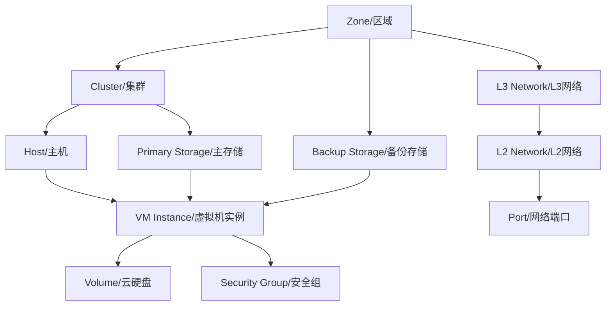

由上图所暗示的，当对资源进行操作时，不仅仅是目标资源，相关资源也将受到影响；例如，当删除一个区域时，比较理想的是属于区域的集群、主机、主存储、L2网络等资源也同时被删除。为了处理这个问题，IaaS软件必须满足级联（cascading）操作的需求。

大多数IaaS软件很少考虑级联操作。

1. 它们要么硬编码业务逻辑，例如，你需要显式删除一个将要被删除帐户的所有资源；
2. 要么直接不允许这种操作，例如，当你试图删除一个IP地址范围时，抛出一个错误信息“仍有VM使用在这个IP范围中的IP”。

但是这种太麻烦了，因为如果一个集群又几百台机器，为了删除这个集群要一个个删除？

## 级联框架

ZStack通过一个级联框架解决这一问题；顾名思义，级联框架**允许一个操作能从一个资源级联到其他资源**。为了解耦整个架构，这个级联框架被作为一个单独的组件创造出来，资源可以按意愿加入框架。要加入框架，资源所需要做的全部事情就是实现一个扩展点`CascadeExtensionPoint`（在我们的例子中`AbstractAsyncCascadeExtension`是一个实现CascadeExtensionPoint的类）：

```java
import java.util.Arrays;
import java.util.List;

/**
 * VM实例级联操作扩展类
 * 继承抽象异步级联扩展，实现针对VM实例的各类关联资源级联操作逻辑
 * 核心作用：当删除主存储、L3网络、IP段、主机等资源时，对关联的VM执行对应的级联操作
 */
public class VmCascadeExtension extends AbstractAsyncCascadeExtension {

    /**
     * 异步执行级联操作的核心方法
     * @param action 级联操作上下文（包含触发源、操作类型、资源信息等）
     * @param completion 异步操作完成回调（用于通知框架操作结果）
     */
    @Override
    public void asyncCascade(CascadeAction action, Completion completion) {
        try {
            // 根据不同的触发源（删除的资源类型）执行对应的VM级联操作
            String triggerResourceName = action.getResourceName();
            switch (triggerResourceName) {
                // 场景1：触发源为删除主存储（PrimaryStorage）
                case "PrimaryStorageVO":
                    // 删除所有根卷存储在该主存储上的VM实例
                    deleteVmsWithRootVolumeOnPrimaryStorage(action);
                    break;

                // 场景2：触发源为删除L3网络（L3Network）
                case "L3NetworkVO":
                    // 停止所有在该L3网络上有网卡的VM，并移除这些网卡
                    stopVmsAndRemoveNicsOnL3Network(action);
                    break;

                // 场景3：触发源为删除IP段（IpRange）
                case "IpRangeVO":
                    // 停止所有网卡IP属于该IP段的VM实例
                    stopVmsWithIpInRange(action);
                    break;

                // 场景4：触发源为删除主机（Host）
                case "HostVO":
                    // 停止所有运行在该主机上的VM实例
                    stopVmsOnHost(action);
                    break;

                // 其他未定义的触发源，不执行任何操作
                default:
                    break;
            }
            // 通知框架级联操作执行成功
            completion.success();
        } catch (Exception e) {
            // 异常场景：通知框架操作失败（补充异常日志，便于问题排查）
            completion.fail(e);
        }
    }

    /**
     * 获取当前扩展关注的「关联资源边缘名称」（触发级联操作的资源类型）
     * 即：哪些资源的操作会触发VM的级联操作
     * @return 关联资源类型名称列表
     */
    @Override
    public List<String> getEdgeNames() {
        return Arrays.asList(
                PrimaryStorageVO.class.getSimpleName(),  // 主存储
                L3NetworkVO.class.getSimpleName(),        // L3网络
                IpRangeVO.class.getSimpleName(),          // IP段
                HostVO.class.getSimpleName()              // 主机
        );
    }

    /**
     * 获取当前扩展负责的「级联资源名称」（被级联操作的目标资源类型）
     * @return VM实例资源类型名称
     */
    @Override
    public String getCascadeResourceName() {
        return VmInstanceVO.class.getSimpleName();
    }

    /**
     * 为子资源创建级联操作上下文
     * 将父资源的级联上下文转换为VM实例相关的上下文，便于子资源执行级联操作
     * @param action 原始级联操作上下文
     * @return 转换后的VM相关级联操作上下文
     */
    @Override
    public CascadeAction createActionForChildResource(CascadeAction action) {
        return convertContextToVmRelatedContext(action);
    }

    // ------------------------------ 私有业务方法（补充实现占位）------------------------------

    /**
     * 删除所有根卷存储在指定主存储上的VM实例
     * @param action 级联操作上下文（包含待删除的主存储信息）
     */
    private void deleteVmsWithRootVolumeOnPrimaryStorage(CascadeAction action) {
        // 1. 从action中获取待删除的主存储ID/信息
        // 2. 查询所有根卷关联该主存储的VM实例列表
        // 3. 执行VM实例的删除操作（含前置校验、资源清理等）
    }

    /**
     * 停止所有在指定L3网络上有网卡的VM，并移除这些网卡
     * @param action 级联操作上下文（包含待删除的L3网络信息）
     */
    private void stopVmsAndRemoveNicsOnL3Network(CascadeAction action) {
        // 1. 从action中获取待删除的L3网络ID/信息
        // 2. 查询所有网卡关联该L3网络的VM实例列表
        // 3. 停止这些VM实例（确保VM处于停止状态后再操作网卡）
        // 4. 移除VM上关联该L3网络的网卡
    }

    /**
     * 停止所有网卡IP属于指定IP段的VM实例
     * @param action 级联操作上下文（包含待删除的IP段信息）
     */
    private void stopVmsWithIpInRange(CascadeAction action) {
        // 1. 从action中获取待删除的IP段信息（网段、起始/结束IP等）
        // 2. 查询所有网卡IP在该IP段内的VM实例列表
        // 3. 停止这些VM实例（可根据业务需求选择强制停止/优雅停止）
    }

    /**
     * 停止所有运行在指定主机上的VM实例
     * @param action 级联操作上下文（包含待删除的主机信息）
     */
    private void stopVmsOnHost(CascadeAction action) {
        // 1. 从action中获取待删除的主机ID/信息
        // 2. 查询所有运行在该主机上的VM实例列表
        // 3. 停止这些VM实例（如需迁移，可先执行热迁移再停止）
    }

    /**
     * 将原始级联上下文转换为VM实例相关的上下文
     * 核心：提取父资源上下文的关键信息，适配VM级联操作的上下文要求
     * @param action 原始级联操作上下文
     * @return VM相关的级联操作上下文
     */
    private CascadeAction convertContextToVmRelatedContext(CascadeAction action) {
        // 1. 解析原始action中的上下文参数（如资源ID、操作类型、租户信息等）
        // 2. 构建VM实例级联操作所需的上下文（补充VM相关的过滤条件、权限信息等）
        // 3. 返回转换后的CascadeAction对象
        return action; // 此处为占位，需根据实际业务逻辑实现
    }
}
```

- getCascadeResourceName()方法返回该资源的名称（VmInstance）；
- getEdgeNames()方法返回一个和资源直接关联的资源名列表，在我们的例子中返回主存储、L3网络、IpRange和主机；
  - 所以如果删除操作在这些edge resources或其上游资源（如区域）上发生时，该操作将被级联至在getEdgeNames()方法中声明了这些资源的扩展。
  - 级联扩展可以在asyncCascade() 中采取行动，并获取必须的信息比如操作码（如删除），根发起者（如区域，下文将很快给出解释），作为操作来源的父发起者（如主机，将很快给出解释）和操作上下文（例如，哪台主机正在被删除）。
  - 由于资源的关系是一个可能有环路的有向图，级联框架将把图压扁成一棵树，并把环路变为分支。

例如，删除区域的操作将最终创建以下树（一部分）：


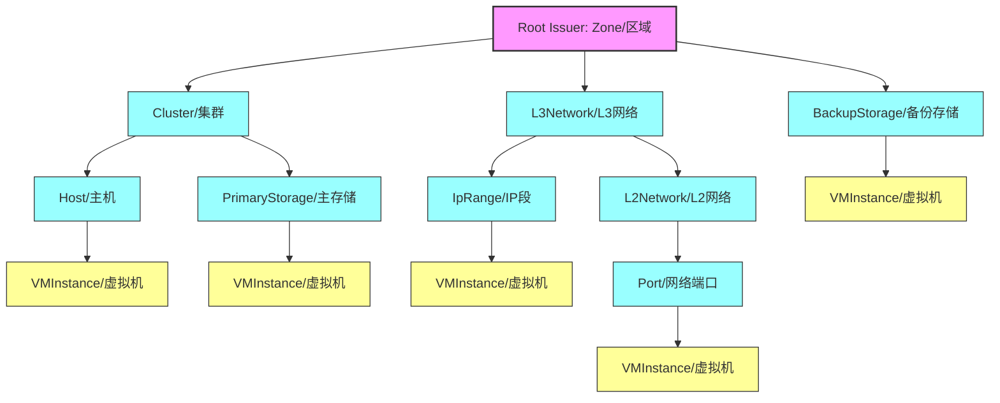

1. 删除区域操作将多次级联到虚拟机的级联扩展，这是刻意的，因为级联扩展通常依赖于父发起者去决定该采取什么行动；
2. 在这个例子中，虚拟机的父发起者为主存储、主机、L3网络和IP范围，然而，对于不同的父发起者，扩展可能会采取不同的行动；
   - 例如，如果父发起者为主存储并且操作码为`delete`，该扩展将摧毁所有根云盘在该主存储的虚拟机；
   - 但如果父发起者是主机，扩展将会只停止在那台主机上的虚拟机，因为这些虚拟机稍后就可以在其他主机上启动。考虑到ZStack没有产生冲突的级联操作，例如，不会有一个操作导致虚拟机在路径A启动而在路径B停止，所以级联操作从不同路径进行多次延伸是没有问题的。

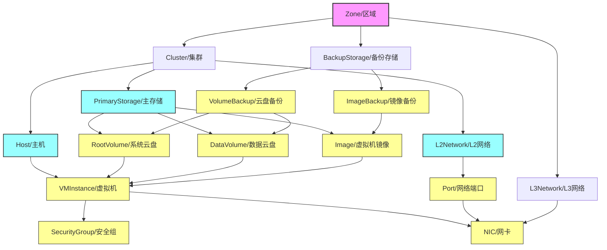

| 关联路径                    | 关系标注 | 业务逻辑解释                                                 |
| --------------------------- | -------- | ------------------------------------------------------------ |
| Zone → Cluster              | 1:n      | 一个区域（物理数据中心）可包含多个集群（逻辑计算单元）       |
| Cluster → Host              | 1:n      | 一个集群可管理多台主机（物理计算节点）                       |
| Cluster → PrimaryStorage    | 1:n      | 一个集群可关联多个主存储（块存储 / 镜像存储）                |
| Cluster → L2Network         | 1:n      | 一个集群可覆盖多个二层网络（VLAN / 平层网络）                |
| Host → VM                   | 1:n      | 一台物理主机可运行多台虚拟机（虚拟化核心逻辑）               |
| PrimaryStorage → RootVolume | 1:n      | 一个主存储可存储多台虚拟机的系统云盘（系统盘）               |
| RootVolume → VM             | 1:1      | 一台虚拟机仅对应一个系统云盘（强绑定，不可多系统盘）         |
| DataVolume → VM             | 1:n      | 一块数据云盘可灵活挂载到多台虚拟机（或一台 VM 挂载多块数据云盘，双向 1:n） |
| Image → VM                  | 1:n      | 一个镜像模板可部署出多台相同配置的虚拟机（镜像复用）         |
| L2Network → Port            | 1:n      | 一个二层网络可包含多个网络端口（虚拟机与网络的连接点）       |
| Port → VMNic                | 1:1      | 一个网络端口仅绑定一个虚拟机网卡（一对一映射，端口是网卡的底层载体） |
| BackupStorage → ImageBackup | 1:n      | 一个备份存储可保存多个镜像的备份（容灾复用）                 |
| VolumeBackup → RootVolume   | 1:1      | 一块系统云盘仅对应一个备份（或多版本备份，此处标注核心 1:1 关系） |

- Zone / 区域
  - 作用：ZStack 的最高层级资源，用于划分物理数据中心的边界，统一管理下属的集群、网络、存储资源，实现资源的隔离与调度
  - 实质：一个逻辑划分的资源集合，对应现实中的一个物理数据中心，或者一个数据中心内的独立分区
- Cluster / 集群
  - 作用：将一组主机、主存储、L2 网络进行逻辑聚合，实现计算资源的统一调度、存储资源的关联管理，是 ZStack 中计算资源的核心管理单元
  - 实质：一组具备相同网络、存储访问能力的物理主机的逻辑组合，是资源调度和级联操作的核心枢纽
- Host / 主机
  - 作用：承载虚拟机的运行，提供 CPU、内存、算力等计算资源，同时负责虚拟机的运行状态管理
  - 实质：一台安装了 ZStack Agent 的物理服务器（或虚拟化服务器），是虚拟机的运行载体
- PrimaryStorage / 主存储
  - 作用：存储虚拟机的系统云盘、数据云盘、虚拟机镜像，为虚拟机提供持久化的存储资源，是虚拟机运行的核心数据载体
  - 实质：可以是一块共享物理磁盘、一组分布式存储集群、或者 SAN 存储设备，是 ZStack 中负责持久化存储的核心资源
- L2Network/L2 网络
  - 作用：提供虚拟机之间的二层网络通信能力，实现同一 L2 网络内虚拟机的直接网络互通，是 L3 网络的底层基础
  - 实质：对应现实中的 VLAN、VXLAN 等二层网络技术，是一个逻辑的二层广播域
- L3Network/L3 网络
  - 作用：为虚拟机提供三层网络的访问能力，分配 IP 地址、子网、网关，实现不同 L2 网络之间、虚拟机与外部网络的通信
  - 实质：一个包含 IP 地址池、路由规则的逻辑三层网络，对应现实中的一个子网
- VMInstance / 虚拟机
  - 作用：ZStack 提供给用户的核心计算资源，用于运行用户的业务程序、服务
  - 实质：通过虚拟化技术，在物理主机上模拟出来的一台独立的逻辑计算机，拥有独立的 CPU、内存、磁盘、网络资源
- RootVolume / 系统云盘
  - 作用：存储虚拟机的操作系统和系统运行的核心数据，是虚拟机启动和运行的基础
  - 实质：一块存储在主存储上的逻辑块存储，绑定到特定的虚拟机，是虚拟机的系统盘
- DataVolume / 数据云盘
  - 作用：为虚拟机提供额外的存储空间，用于存储用户的业务数据，可随时挂载或卸载到虚拟机上
  - 实质：一块存储在主存储上的独立逻辑块存储，不绑定虚拟机的生命周期，可灵活分配使用
- Image / 虚拟机镜像
  - 作用：作为虚拟机的启动模板，包含预安装的操作系统和应用程序，用于快速创建虚拟机
  - 实质：一个存储在主存储上的只读镜像文件，是虚拟机的初始化模板
- BackupStorage / 备份存储
  - 作用：存储虚拟机镜像、系统云盘、数据云盘的备份数据，用于在数据丢失或损坏时进行恢复
  - 实质：可以是一块独立的物理磁盘、网络存储设备，是 ZStack 中用于容灾备份的存储资源
- SecurityGroup / 安全组
  - 作用：为虚拟机提供网络访问控制，通过设置入站、出站规则，限制虚拟机的网络流量
  - 实质：一组网络防火墙规则的集合，绑定到虚拟机的网卡上，实现虚拟机的网络安全管控
- NIC / 网卡
  - 作用：作为虚拟机与网络的连接接口，实现虚拟机与其他设备的网络通信
  - 实质：一个逻辑的网络接口，绑定到 L2/L3 网络上，为虚拟机提供网络访问能力

看一下上述关系之后再来理解下面这段话

当级联一个操作时，该框架从该操作被应用的root issuer开始；在上述删除区域的示例中，`zone`是根发起者；那么框架将**从根发起者遍历树**，并调用扩展的createActionForChildResource()方法为每一条路径上的每一个扩展创建上下文；一旦所有上下文创建成功，该框架将再次遍历树，不过是从叶子节点到根，并调用每个扩展的asyncCascade()方法；一个扩展可以依靠父发起者去决定应该做哪些操作，父发起者在`getEdgeNames()`方法中以资源名的方式声明；例如，如果父发行者是主机，则停止虚拟机；如果父发行者是主存储，则删除虚拟机。

这两个阶段的遍历保证，一个操作（例如删除）将只会被应用到根发起者，在所有下游资源都做完一些合适的操作后。例如，一个区域只在所有子孙资源都被删除后才能被删除。由于并不是所有的操作都需要级联，一个资源可以在它需要的时候直接调用CascadeFacade.asyncCascade()。

我们演示了ZStack的级联框架，这是一个强大的工具，用于扩散操作而不需要硬编码。ZStack用很多方式使用了它，除了我们在文中提到的以外，一些操作，如卸载主存储（这将停止将被卸载的集群中的所有虚拟机），卸载L2网络（这将停止将被卸载的集群中的所有虚拟机）都是以这种方式实现的。有了它的帮助，管理员可以快速尝试不同的云部署而无需担心不方便；你可以只删除你的部署的一部分并重新创建一个新的，而不需要仅因为你在一个设计错误的L2网络上创建了许多虚拟机，就重新部署整个云（举个例子）。

# 9.查询API

## 9.1Query API

IaaS软件用户面临的共同挑战是如何快速、准确地找到一个想要的资源；例如，从10,000台虚拟机中发现有EIP（16.16.16.16）的虚拟机。大多数IaaS软件通过API中的特定查询逻辑解决这个问题。ZStack不用特定查询，而是配备了一个框架，这个框架可以自动为每个资源的每个字段生成查询，并联合跨越了多个资源的查询，帮助用户管理云端数量庞大的资源。解药就是要提供一种机制，这种机制可以**自动为每个资源的每个字段都生成查询**，而且可以处理join查询。

各个资源使用一个查询表是常规做法，问题是联合查询

大多数IaaS软件使用关系型数据库（如MySQL）作为后台数据库，在这种数据库中资源通常被安排在单独的表中，比如虚拟机表，主机表，云盘表。对于每一个资源，都有一个API用来获取该资源的单独的一条，它可能被命名为`describe API`、`list API`或`query API`；这些API通常有硬编码的参数，用来暴露一部分数据库表的列，允许用户通过少量的查询条件查询资源；这些参数是精心选择的，通常是对API设计者自身非常重要的列，例如，name、UUID。然而，由于**并不是所有的列都被暴露**，用户经常遇到他们想查询的列不存在的情况，这样他们就必须检索所有的资源，然后使用一个或多个`for..loop`进行后置处理。一个复杂的查询场景，可能需要使用联合查询，这种查询通常跨越多个数据库表；例如，找到一个EIP为16.16.16.16的虚拟机，它可能**涉及虚拟表、网卡表和EIP表**。一些IaaS软件使用数据库视图解决这个问题，这是另一种硬编码方式，只能以固定的格式join选中的表，而在现实中表是能以非常复杂的方式被join的。在软件升级过程中，如果一个视图指向的任一表已经改变了的话，视图也需要进行数据库迁移操作。

### 查询API

为了避免在API中手动编码查询逻辑，并给用户提供能在任何地方查询任何东西的灵活的查询，ZStack创建了一个框架，这个**框架可以自动为所有资源生成查询，并且不需要开发者写代码去实现查询逻辑**；更进一步，该**框架还可以生成各种join查询，只要所需的表已经通过外键连接**。

在以下篇幅中，我们将用zone作为一个例子来阐述这个令人惊叹的框架。一个zone在数据库中有下面的这些列：

| **FIELD**   | **DESCRIPTION**                     |
| ----------- | ----------------------------------- |
| uuid        | zone UUID                           |
| name        | zone name                           |
| description | zone description                    |
| state       | zone state                          |
| type        | zone type                           |
| createDate  | the time the zone was created       |
| lastOpDate  | the last time the zone was operated |

用户可以通过任何一个字段或字段组合来查询zone，并采用常规的SQL比较运算符如'=', '!=', '>', '>=', '<', '<=', 'in', 'not in', 'is null', 'is not null', 'like', 'not like'。

*注意：在命令行工具中，一些运算符有不同的格式：'in'(?=), 'not in'(!?=), 'is null'(=null), 'is not null'(!=null), 'like'(~=), 'not like'(!~=).*

QueryZone name=west-coast-zone

QueryZone name=west-coast-zone state=Enabled

因为zone是ZStack中主要资源的祖先，很多资源都或多或少和它有关系；例如，一个运行中的虚拟机总是在一个zone内。像这种关系可以生成联合查询，如：

```
QueryZone vmInstance.name=web-vm1
```

如上表格所示，一个zone不会暴露任何叫vmInstance的字段，但在上述查询中有一个条件是由'vmInstance'开始的。这种查询在ZStack中称为*扩展查询*。这里`vmInstance`代表VM表，VM表有一个字段为`zoneUuid`（外键）指向zone表，因此查询框架可以理解它们的关系并生成联合查询。上面的例子可以被解释为“*寻找名字为web-vm1**的虚拟机的zone*”。进一步扩展这个例子，因为虚拟机网卡表有外键指向VM表，并且EIP表有外键指向虚拟机网卡表，查询zone也可以使用EIP作为条件：

```
QueryZone vmInstance.vmNics.eip.vipIp=16.16.16.16
```

查询被解释为*“查找一个区域，它上面的虚拟机的网卡的**EIP**为 16.16.16.16**”*。现在您知道了查询接口的强大之处了！我们甚至可以创建一些非常复杂的查询：

```
QueryVolumeSnapshot volume.vmInstance.vmNics.l3Network.l2Network.attachedClusterUuids=13238c8e0591444e9160df4d3636be82
```

这个复杂的查询目的是找到磁盘快照，目标磁盘快照是由虚拟机磁盘创建的，而该虚拟机有网卡在L3网络上，这个L3网络的父L2网络则是附加在一个集群上的，这个集群的uuid是13238c8e0591444e9160df4d3636be82。不要惊慌，你很少需要这么复杂的查询，但它确实证明了框架的能力。此外，SQL的一些特性例如选择字段、排序、计数和分页也是支持的：

```
QueryL3Network name=L3-SYSTEM-PUBLIC count=true
QueryL3Network l2NetworkUuid=33107835aee84c449ac04c9622892dec limit=10
QueryL3Network l2NetworkUuid=33107835aee84c449ac04c9622892dec start=10 limit=100
QueryL3Network fields=name,uuid l2NetworkUuid=33107835aee84c449ac04c9622892dec
QueryL3Network l2NetworkUuid=33107835aee84c449ac04c9622892dec sortBy=createDate sortDirection=desc
```

### 实现（使用时候看）

尽管查询API功能是如此强大，实现却是非常简洁的。当添加一个新的资源时，开发人员不需要写任何关于查询逻辑的代码，除了定义查询API和资源本身。要实现zone的查询API，开发人员需要：

1. ZoneInventory（区域库存类）- 核心元数据注解定义

```java
import java.io.Serializable;
import java.sql.Timestamp;

/**
 * 区域（Zone）库存类
 * 作用：封装Zone资源的核心属性，通过注解声明与其他资源的关联关系，为扩展查询提供元数据支撑
 */
// 核心注解：关联Zone的持久化VO类（数据库映射类）
@Inventory(mappingVOClass = ZoneVO.class)
// 兼容Python端的Inventory注解（ZStack多语言适配）
@PythonClassInventory
// 扩展查询注解：声明Zone可关联查询的其他资源（核心）
@ExpandedQueries({
        // 扩展查询虚拟机实例：通过zoneUuid关联Zone和VmInstance
        @ExpandedQuery(
                expandedField = "vmInstance",          // 扩展字段名（查询时可通过该名称关联VM）
                inventoryClass = VmInstanceInventory.class,  // 关联的目标库存类
                foreignKey = "uuid",                   // 当前Zone的关联字段（Zone的uuid）
                expandedInventoryKey = "zoneUuid"      // 目标资源中关联Zone的字段（VM的zoneUuid）
        ),
        // 扩展查询集群：通过zoneUuid关联Zone和Cluster
        @ExpandedQuery(
                expandedField = "cluster",
                inventoryClass = ClusterInventory.class,
                foreignKey = "uuid",
                expandedInventoryKey = "zoneUuid"
        ),
        // 扩展查询主机：通过zoneUuid关联Zone和Host
        @ExpandedQuery(
                expandedField = "host",
                inventoryClass = HostInventory.class,
                foreignKey = "uuid",
                expandedInventoryKey = "zoneUuid"
        ),
        // 扩展查询主存储：通过zoneUuid关联Zone和PrimaryStorage
        @ExpandedQuery(
                expandedField = "primaryStorage",
                inventoryClass = PrimaryStorageInventory.class,
                foreignKey = "uuid",
                expandedInventoryKey = "zoneUuid"
        ),
        // 扩展查询L2网络：通过zoneUuid关联Zone和L2Network
        @ExpandedQuery(
                expandedField = "l2Network",
                inventoryClass = L2NetworkInventory.class,
                foreignKey = "uuid",
                expandedInventoryKey = "zoneUuid"
        ),
        // 扩展查询L3网络：通过zoneUuid关联Zone和L3Network
        @ExpandedQuery(
                expandedField = "l3Network",
                inventoryClass = L3NetworkInventory.class,
                foreignKey = "uuid",
                expandedInventoryKey = "zoneUuid"
        ),
        // 扩展查询备份存储关联：通过zoneUuid关联Zone和BackupStorageZoneRef（隐藏字段，不对外暴露）
        @ExpandedQuery(
                expandedField = "backupStorageRef",
                inventoryClass = BackupStorageZoneRefInventory.class,
                foreignKey = "uuid",
                expandedInventoryKey = "zoneUuid",
                hidden = true  // 标记为隐藏字段，查询结果中不显示该字段，仅作为关联桥梁
        ),
})
// 扩展查询别名：为隐藏的backupStorageRef提供别名，简化查询语法
@ExpandedQueryAliases({
        @ExpandedQueryAlias(
                alias = "backupStorage",          // 对外暴露的别名
                expandedField = "backupStorageRef.backupStorage"  // 实际关联的隐藏字段路径
        )
})
public class ZoneInventory implements Serializable {
    // 区域唯一标识
    private String uuid;
    // 区域名称
    private String name;
    // 区域描述
    private String description;
    // 区域状态（如启用/禁用）
    private String state;
    // 区域类型（如普通区域/边缘区域）
    private String type;
    // 区域创建时间
    private Timestamp createDate;
    // 区域最后操作时间
    private Timestamp lastOpDate;
}
```

2. APIQueryZoneMsg（区域查询 API 消息类）

```java
/**
 * 区域查询API请求消息类
 * 作用：定义查询Zone的API接口，通过注解自动绑定返回结果和库存类，无需手动编写查询逻辑
 */
// 自动查询注解：指定返回结果类、关联的库存类，由ZStack查询服务自动生成查询逻辑
@AutoQuery(
        replyClass = APIQueryZoneReply.class,  // 查询API的返回结果类
        inventoryClass = ZoneInventory.class   // 关联的库存类（查询结果封装为该类）
)
public class APIQueryZoneMsg extends APIQueryMessage {
    // 无需编写任何业务逻辑：ZStack查询服务会根据注解自动处理查询请求
}
```

3. zone-api.xml（区域 API 配置文件）

```xml
<?xml version="1.0" encoding="UTF-8"?>
<!-- 
    Zone资源的API配置文件
    作用：声明Zone相关的API接口，指定路由规则和拦截器
    命名空间：ZStack标准服务配置命名空间
-->
<service xmlns="http://zstack.org/schema/zstack">
    <!-- 服务唯一标识：对应Zone资源 -->
    <id>zone</id>
    <!-- API请求拦截器：处理Zone API的前置校验（如权限、参数合法性） -->
    <interceptor>ZoneApiInterceptor</interceptor>

    <!-- 声明查询API消息 -->
    <message>
        <!-- 要注册的查询API全类名 -->
        <name>org.zstack.header.zone.APIQueryZoneMsg</name>
        <!-- 路由的目标服务ID：query（ZStack内置的查询服务） -->
        <serviceId>query</serviceId>
    </message>
</service>
```

### 当前限制

主要的限制是在查询条件中，只有逻辑`AND`是被支持的，OR是不被支持的。例如：

```
QueryZone name=west-coast-zone state=Enabled
```

上述查询语句可以被解释为“寻找区域名字为west-coast且state是Enabled的区域”我们这么做的原因是我们由ZStack源代码中SQL的使用分析得出99%的组合的查询条件都是基于AND逻辑的。另一方面，如果逻辑`OR`在没有创建DSL的情况下就被引入，要保持代码简洁是非常困难的。然而，在很多情况下，OR可以使用比较操作in(?=)实现：

```
QueryZone name=west-coast-zone state?=Enabled,Disabled
```

上述例子表述的是“寻找名字为west-coast的区域，并且它的状态是Enabled或Disabled”，将来，我们将引入DSL风格的查询语言，例如：

```
QueryZone name=west-coast-zone AND (state=Enabled OR state=Disabled)
```

这篇文章中，我们演示了ZStack的查询API。通过使用这个强大的工具，用户能以类似关系型数据库的方式查询任何资源。将来，ZStack将建立一套高级的UI，它可以使用查询API创建各种各样的视图（过滤器），例如，展示所有运行在同一L3网络的虚拟机，为IaaS UI的用户体验带来革命性的改变。

## 9.2 ZQL查询语言

### 背景

当前ZStack的Query API只能针对单个资源的多个条件做AND逻辑查询，无法实现OR逻辑，同时不支持子查询，导致一些场景需要调用多次Query API并在应用端组合数据。

此外，ZWatch引入监控系统后，监控查询API GetMetricData 是单独一套，无法跟Query API结合，导致UI往往需要先通过Query API获得资源UUID，再传给GetMetricData，在资源多的时候，例如1000个VM时，开销巨大。

为此我们引入ZStack Query Language，简称ZQL，目的是支持类似SQL语言的查询语法，满足以下需求：
- 支持查询条件的AND和OR，并且能够嵌套
- 支持类似SQL的子查询
- 支持restrict by的语法（见后）
- 支持合并监控数据查询

### 例子
```
query vminstance where name='webvm' and vmnics.ip='192.168.0.10' or (vmnics.eip = '172.20.100.100' and (cpuNum >= 8 or clusterUuid in ('fe13b725c80e45709f0414c266a80239','73ca1ca7603d454f8fa7f3bb57097f80')))
restrict by (zone.uuid != 'fec2889fef2d49b1967c7e39025f4eb4') return with (total, zwatch{metricName='CPUUsedUtilization',offsetAheadOfCurrentTime=3600,period=10,labels='CPUNum=10',labels='CPUNum=100', functions=limit(limit=10), functions=top(num=2)}) order by cpuNum limit 100 offset 10
```
这个复杂的例子展示了ZQL当前版本的所有功能，在后面的章节中我们对它详细解释

### 定义
**query查询：**
问号表示可选从句
```
query queryTarget (WHERE condition+)? restrictBy? returnWith? groupBy? orderBy? limit? offset? filterBy? namedAs?
```

**count查询：**
```
count queryTarget (WHERE condition+)? restrictBy? groupBy? orderBy? limit? offset? namedAs?
```

**sum查询：**
```
sum queryTarget sumBy (WHERE condition+)? namedAs?
```

### 功能详解

### query关键字
ZQL语句以`query`或`count`关键字开头。`query`返回资源的inventory，类似SQL的`select *`；`count`返回满足查询条件的数据数目，类似SQL的`select count(*)`。例如：

```sql
query vminstance  #类似 select * from VmInstanceVO
count vminstance  #类似 select count(*) from VmInstanceVO
```

#### query target
`query`关键字后面跟的是要查询资源的名称，query target的命名方式是资源名去掉VO后缀。例如`VmInstanceVO`，query target即为`vminstance`。query target名采用全小写，例如`primarystorage`, `l2network`。

query target支持只查询资源的某些字段。例如：

```sql
query vminstance.uuid,name  #类似SQL的，select uuid,name from VmInstanceVO
```

#### function
目前只支持常见的聚合函数（理论上任何`function_name(xx)`类似这种单参数的函数都能支持，但是没有逐一验证）。经过验证的`DISTINCT`, `COUNT`, `SUM`, `MAX`, `MIN`, `AVG`。

因为历史原因：
1. `DISTINCT` 原先集成在 Query Grammar中，所以会保持和原来一样。
2. `COUNT`, `SUM` 原先有独立的 Count Grammar 和 Sum Grammar，所以不要在 Query Grammar中使用，如果使用会报错阻止。
3. `MAX`，`MIN` 在 5.1.8 的实现中存在缺陷，仅支持 `query max(vmInstance.cpuNum)`，不支持 `query max(vmInstance.cpuNum) gorup by hostUuid;` 所以有返回数据结构的改变

##### **max function**

MIN,AVG 写法类似，返回数据结构都一样

这种写法支持，但是不推荐：
```sql
admin >>>ZQLQuery zql="query max(vmInstance.cpuNum)"
{
    "results": [
        {
            "inventoryAggregateFunctions": [
                [
                    {
                        "cpuNum": 8
                    },
                    8
                ]
            ]
        }
    ],
    "success": true
}
```

推荐聚合时配合group by从句：
```sql
admin >>>ZQLQuery zql="query max(vmInstance.cpuNum) group by uuid"
{
    "results": [
        {
            "inventoryAggregateFunctions": [
                [
                    {
                        "cpuNum": 8,
                        "uuid": "09c6692b6b4c4a38a9df2620c85720f6"
                    },
                    8
                ],
                [
                    {
                        "cpuNum": 1,
                        "uuid": "ebca11c578594c54845626154aa98e30"
                    },
                    1
                ]
            ]
        }
    ],
    "success": true
}
```

#### join从句
跟随在 target 之后，类似sql写法(left, right, inner) 使用外联(left, right)时需要注意联表条件是否正确防止重复数据。通过on后面的条件列表进行关联表的查询。

```sql
query vmInstance left join vmNic on vmInstance.defaultL3NetworkUuid=vmNic.l3NetworkUuid and vmInstance.uuid=vmNic.vmInstanceUuid order by INET_ATON(vmNic.ip) desc
```

跟SQL类似：
```sql
select
	vm.*
from
	VmInstanceVO vm
    left join VmNicVO nic on vm.defaultL3NetworkUuid = nic.l3NetworkUuid and vm.uuid = nic.vmInstanceUuid
    order by
    INET_ATON(nic.ip) desc
```

#### where从句
where从句为optional，不指定则返回所有数据。

跟SQL类似，where从句用于指定查询条件。可以支持AND/OR逻辑，并且逻辑可以嵌套。跟Query API类似，where从句指定的查询条件可以本资源的字段，也可以是跨表的join查询条件，例如：

```sql
query vminstance where name='webvm'
```
这里name是vminstance本身的字段。

```sql
query vminstance where vmNics.ip='192.168.0.100'
```
这里vmNics.ip实际是跟VmNicVO表做了自动的join查询。可以支持AND/OR逻辑条件，通过括号做嵌套，例如：

```sql
query vminstance where (name = 'webvm' or cpuNum > 10) and description is not null
```

查询条件的值，字符串用单引号，例如`name = 'webvm'`

#### sub query从句
查询条件支持子查询，例如：

```sql
query vminstance where hostUuid in (query host.uuid where state = 'Disconnected') and state = 'Running'
```

sub query从句的query target必须选着一个字段，例如`host.uuid`，没选择字段或选择多个字段都会报错。sub query的where从句跟普通query的where从句一样。

sub query不支持restrict by, return with从句；也不支持limit, order by, offset关键字。

#### restrict by从句
restrict by从句解决资源关联查询的问题，例如eip资源上没有字段跟zone关联，这时要查询一个属于某个zone的eip就会很麻烦。这种情况可以使用restrict by 从句解决，例如：

```sql
query eip restrict by (zone.uuid = '28818693f3924d92af2b19b2407317ff')
```

restrict by 从句中的条件只能是and关系，例如：

```sql
restrict by (zone.uuid = '28818693f3924d92af2b19b2407317ff', zone.name like '%east-%')
```

restrict by的条件名跟query target中的带字段查询格式相同，为：
```
资源名.字段名
```

#### return with 从句
return with用于返回附带数据，目前支持两种附带数据，一个是`total`，即满足查询条件的数据数量；一个是`zwatch`，返回满足查询条件的监控数据。例如：

```sql
query vminstance where cpuNum > 8 return with (total)
```
查询结果会返回一个total字段。

#### zwatch子句
zwatch子句用于在执行数据库查询的时候同时执行zwatch查询。其工作原理是：
1. 先执行where子句中的数据库查询条件，获取符合查询条件数据
2. 讲where子句中查询返回的数据作为输入条件注入zwatch查询，例如query vminstance返回了vm的数据，则vm的uuid字段会作为zwatch的查询label注入

例子：
```sql
query vminstance where cpuNum > 8 return with (zwatch{metricName='CPUUsedUtilization',offsetAheadOfCurrentTime=3600,period=10,labels='CPUNum=10',labels='CPUNum=100', functions=limit(limit=10), functions=top(num=2)})
```

这个例子中，首先执行数据查询，找到满足cpuNum > 8的条件的VM，然后将VM的uuid合并成一个zwatch的label，注入到之后的zwatch查询条件。

zwatch子句以`zwatch`关键字打头，查询条件放到花括号中`{}`。查询条件即为GetMetricData API的各个字段。

```java
private String metricName;
private Long startTime;
private Long endTime;
private Long offsetAheadOfCurrentTime;
private Integer period;
private List<String> labels;
private List<String> functions;
```

参数里面没有namespace，namespace由query target指定的资源确定，例如`vminstance`就代表`ZStack/VM`。

对于字符串型的参数，需要用单引号；对于labels和functions两个list类型的参数，采用多个输入，在列表中的顺序按参数出现的先后顺序确定。例如：
```
labels='CPUNum=10', labels='CPUNum=8'
```

参数之间用逗号(,)分隔。

zwatch子句查询返回的监控数据数目跟满足where从句的数据库记录数据数目可能是不一样的。例如在本节的例子里面，满足cpuNum > 8的VM可能有100个，但zwatch子句用了`top(num=2)`函数，则返回的监控数据只会有两个。

如果只对监控数据感兴趣，ZQL的query target应该指定字段而不是指定资源本身。例如：

```sql
query vminstance.name where cpuNum > 8 return with (zwatch{metricName='CPUUsedUtilization',offsetAheadOfCurrentTime=3600,period=10,labels='CPUNum=10',labels='CPUNum=100', functions=limit(limit=10), functions=top(num=2)})
```

返回的数据中就只包含vm的名称和监控数据，可以大大减少API传输的数据量。

#### 多zwatch子句
return with从句支持多个zwatch子句，在使用多子句时，需要通过resultName指定返回数据在ZQL返回对象中reurnWith对象中的名字。例如：

```sql
query vminstance.name where cpuNum > 8 return with (zwatch{resultName='zwatch1',metricName='CPUUsedUtilization',offsetAheadOfCurrentTime=3600,period=10,labels='CPUNum=10',labels='CPUNum=100', functions=limit(limit=10), functions=top(num=2)}, zwatch{resultName='zwatch2',metricName='CPUUsedUtilization',offsetAheadOfCurrentTime=3600,period=10,labels='CPUNum=10',labels='CPUNum=100', functions=limit(limit=10), functions=top(num=2)})
```

这里用两个子句分别指定了`resultName='zwatch1'`，`resultName='zwatch2'`，则对应的返回值以zwtach1和zwatch2命名：

```json
"returnWith": {
    "zwatch1": [{
        "value": 105.0,
        "time": 7.0,
        "labels": {
            "VMUuid": "bdbc971d1de74a91b8f3f0c7c9f5babe"
        }
    }, {
        "value": 101.0,
        "time": 1.0,
        "labels": {
            "VMUuid": "bdbc971d1de74a91b8f3f0c7c9f5babe"
        }
    }],
    "zwatch2": [{
        "value": 105.0,
        "time": 7.0,
        "labels": {
            "VMUuid": "bdbc971d1de74a91b8f3f0c7c9f5babe"
        }
    }, {
        "value": 101.0,
        "time": 1.0,
        "labels": {
            "VMUuid": "bdbc971d1de74a91b8f3f0c7c9f5babe"
        }
    }]
}
```

#### group by 从句
类似SQL的group by从句，可以使用资源的字段对结果分组，例如：

```sql
query vminstance group by name
count vminstance where cpuNum > 8 group by name,memorySize
```

只有query和count查询支持group by，sum查询的by字段天然就是group by字段。

#### order by 从句
类似SQL的order by从句，可以用资源的字段对返回结果排序，例如：

```sql
query vminstance order by cpuNum asc
```
或
```sql
query vminstance order by cpuNum desc
```

#### limit 从句
类似SQL的limit从句，限定返回数据数目，例如：

```sql
query vminstance limit 100
```

#### offset 从句
类似SQL的offset从句，跟limit从句一起使用实现翻页功能，例如：

```sql
query vminstance limit 100 offset 10
```

#### sum 求和查询
可以通过sum查询完成类似SQL `select sum(xxx) ... group by yyy`的求和功能，例如：

```sql
sum vminstance.cpuNum,memorySize by uuid where cpuNum > 0
```

该查询对vminstance的cpuNum, memorySize两个字段分别进行求和，并通uuid字段对数据进行group by。

sum关键字后跟着的是要进行求和的一个或多个字段，by关键字后是进行group by的字段。上面的语句等同于SQL：

```sql
select sum(vm.cpuNum),sum(vm.memorySize) from VmInstanceVO vm where vm.cpuNum > 0
```

返回的结果类似：

```json
{
    "results": [{
        "inventories": [
            ["7dba128454014abc8a69e739f1c4e2ad", 2, 536870912],
            ["e889cbf61cf6434f875e80e3b1c5a92d", 4, 8589934592]
        ]
    }]
}
```

返回结果的每个元素为一个数组，第一个元素总是 by 关键字指定的group by字段，通过该字段可以分辨后面求和值所对应的资源；第二个元素开始为求和的结果，其顺序跟sum关键字后的字段顺序相同。例如这里2对应vm.cpuNum，536870912对应vm.memorySize。

sub query不支持restrict by, return with从句；也不支持limit, order by, offset关键字。

#### 多ZQL查询
一个查询可以包含多个ZQL语句，以实现批量查询，例如：

```sql
query host named as 'host';
query zone return with (total) named as 'zone'
```

多个ZQL语句通过分号`";"`分隔。例子中的named as加下一节"named as 从句"。返回的结果类似于：

```json
{
    "results": [{
        "inventories": [{
            "username": "root",
            "password": "password",
            "sshPort": 22,
            "zoneUuid": "1a29060d81724b6083caaf530b4c6ab5",
            "name": "kvm",
            "uuid": "f1e112cf4f3c4bbd939fdf18f72ac5e8",
            "clusterUuid": "324fece70aa848ed917b9134ef7072c1",
            "managementIp": "localhost",
            "hypervisorType": "KVM",
            "state": "Enabled",
            "status": "Connected",
            "totalCpuCapacity": 320,
            "availableCpuCapacity": 314,
            "cpuSockets": 2,
            "totalMemoryCapacity": 34359738368,
            "availableMemoryCapacity": 25232932864,
            "cpuNum": 32,
            "createDate": "Jul 10, 2018 5:32:56 PM",
            "lastOpDate": "Jul 10, 2018 5:32:58 PM"
        }],
        "name": "host"
    }, {
        "inventories": [{
            "uuid": "1a29060d81724b6083caaf530b4c6ab5",
            "name": "zone",
            "description": "test",
            "state": "Enabled",
            "type": "zstack",
            "createDate": "Jul 10, 2018 5:32:54 PM",
            "lastOpDate": "Jul 10, 2018 5:32:54 PM"
        }],
        "total": 1,
        "name": "zone"
    }]
}
```

#### named as 从句
当进行多个一个查询里包含多个ZQL语句时，可以使用named as从句对ZQL语句命名，以方便分别结果对应的是哪一条ZQL语句。其用法是`named as`关键字后跟一个字符串，用作ZQL语句的名称。

ZQL语句的名称必须全局唯一，否则后面的ZQL语句会覆盖前面同名语句的结果。

named as从句可选，当省略时，返回的结果中不包含name字段，只能按照结果在数组中的顺序分辨其跟ZQL语句的对应关系。

### CLI示例

```sql
admin >>>ZQLQuery zql="query vminstance.uuid,name where state = 'Running' return with (zwatch{metricName='CPUUsedUtilization',offsetAheadOfCurrentTime=3600,period=10, functions=limit(limit=10), functions=top(num=5)})"
{
    "results": [{
        "inventories": [
            {
                "name": "vm-1",
                "uuid": "21115489e7a045ad805a7501d1b003a6"
            },
            {
                "name": "vm",
                "uuid": "4fb528ec9eac4ae18b3c464cc5f42b24"
            }
        ],
        "returnWith": {
            "zwatch": [
                {
                    "labels": {
                        "CPUNum": "0",
                        "VMUuid": "21115489e7a045ad805a7501d1b003a6"
                    },
                    "time": 1530790027.0,
                    "value": 1.3
                },
                {
                    "labels": {
                        "CPUNum": "0",
                        "VMUuid": "21115489e7a045ad805a7501d1b003a6"
                    },
                    "time": 1530790097.0,
                    "value": 1.3
                },
                {
                    "labels": {
                        "CPUNum": "0",
                        "VMUuid": "21115489e7a045ad805a7501d1b003a6"
                    },
                    "time": 1530790037.0,
                    "value": 1.2
                },
                {
                    "labels": {
                        "CPUNum": "0",
                        "VMUuid": "21115489e7a045ad805a7501d1b003a6"
                    },
                    "time": 1530790087.0,
                    "value": 1.1001100110011
                },
                {
                    "labels": {
                        "CPUNum": "0",
                        "VMUuid": "21115489e7a045ad805a7501d1b003a6"
                    },
                    "time": 1530790067.0,
                    "value": 1.1
                }
            ]
        }
    }],
    "success": true
}
```

### 其它
**UI实现top 5**
实现top 5功能的时候，特别是虚拟机top 5，记得指定`state = 'Running'`条件，这样可以大大提高数据库查询到监控数据查询的性能。

# 10.标签系统

ZStack中的标签不仅帮助用户聚集资源，也帮助控制软件行为。ZStack有一套完整的规范，用以定义标签的类别、形式和用法。**除了用户外，插件也可以创建自己的标签**，以记录元数据和拓展现有的资源属性；通过这些手段，标签可以帮助插件引入新的特性，而不改变ZStack的数据库结构，消除了在软件升级对数据库迁移的需求。

随着云中资源的不断增长，用户可能会想要有一种方式，使用人类可读的标签，去分组相似的资源。举个例子，所有Web服务器的虚拟机都可以有一个标签*'web-tier-vm'*，这样可以从UI和CLI把它们作为一个组来获取。根据各自的业务逻辑，插件可以选择是否创建数据库表。比如：

- Open vSwitch L2 Network插件，由于需要创建一种新的类型的资源，可能需要添加一张新表；
- 然而，一个允许主机保留内存的插件可能不需要添加一张新表，而仅需在主机上附加一点数据。

如果IaaS软件没有为插件提供一种附加数据，它们将开始创造新的、琐碎的模式或添加现有模式的列从而修改现有的模式，导致软件升级时数据库迁移的难处理的情况。对于建立在ZStack上的第三方软件，允许它们将信息存储到ZStack的数据库可以避免数据完整性问题，并使得它们可以使用ZStack的全部查询API（详见“查询API”）。

大多数IaaS软件都有着标签的概念。然而，它们并不是都为不同场景定义了一个详尽的标签规范。例如，一些IaaS使用标签是为了用户聚合资源，一些IaaS是为了内部业务逻辑。

ZStack则为不同场景的标签的每一个层面都精心设计了标签规范。在ZStack中，标签本质上是携带了少量资源相关信息的字符串。一个标签通常由以下几个字段组成：

| **FIELD**    | **DESCRIPTION**              |
| ------------ | ---------------------------- |
| uuid         | 标签的UUID                   |
| resourceUuid | 标签所关联的资源的UUID       |
| resourceType | 标签所关联的资源的类型       |
| Tag          | 一个包含了有意义信息的字符串 |
| Type         | 标签类型：System 或者 User   |

在标签方面，ZStack和其他IaaS软件的本质区别是ZStack将标签分为两类：用户（User）和系统（System）。

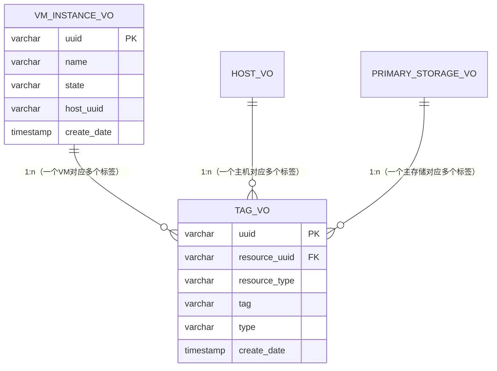


## 用户标签

用户标签，顾名思义，是用户为资源分组而创建的标签。例如，通过标签'apache2-http'将安装了Apache2 HTTP服务器的虚拟机分组，这样用户就可以通过查询API获取这些虚拟机，使用标签'apache2-http'作为查询条件即可：`QueryVmInstance __userTag__=apache2-http`备注：详见“查询API”，这是最常见的标签使用方法，一个资源可以和多个标签相关联，并且被不同的逻辑组划分。

用户标签也可以通过和系统的标签一起使用来控制ZStack的行为。例如，如果一个用户标签`SSD`已经在主存储系统上创建好，那么一个系统标签可以指导ZStack在有用户标签SSD的主存储上去创建VM的根目录。在这种情况下，用户标签更像是用户输入的资源元数据。我们很快就会看到，插件也可以使用系统标签创建资源元数据。

ZStack 会设计一张**通用的标签表（如`TagVO`）**，表结构完全匹配前文提到的标签字段，一个资源（如 VM）关联多个用户标签时，会在`TagVO`表中生成多条记录（仅`tag`字段不同，`resourceUuid`/`resourceType`相同）


## 系统标签

不像用户标签可以被用户在任意时间、以任意值创建，系统标签有固定的格式，并且是被ZStack的业务服务和插件提前定义好的，可以在以下场景被使用

### 元数据

**插件**可以使用系统标签来记录资源的元数据。

例如，主机的数据库表中没有列去记录如hypervisor版本，hypervisor SDK版本这样的元数据；然而，衍生的主机插件，例如，KVM主机插件，可能需要这些元数据来确定当前虚拟机管理程序是否有某些特征；例如，是否能对KVM在线快照是由libvirt和QEMU版本决定的。在ZStack中，当连接到后端主机时，KVM主机插件将OS的版本，libvirt版本，QEMU的版本和qemu-img工具的版本作为系统标签保存。`QuerySystemTag fields=tag resourceUuid=d07066c4de02404a948772e131139eb4`

```json
{
  "inventories": [
      {
          "tag": "capability:liveSnapshot"
      },
      {
          "tag": "qemu-img::version::2.0.0"
      },
      {
          "tag": "os::version::14.04"
      },
      {
          "tag": "libvirt::version::1.2.2"
      },
      {
          "tag": "os::release::trusty"
      },
      {
          "tag": "os::distribution::Ubuntu"
      }
  ],
  "success": true
}
```

### 资源属性

插件也可以使用系统标签将新属性添加到资源中。

例如，虚拟机的数据库模式中没有列来记录该使**用什么IP分配算法**，**什么时候分配虚拟机网卡**。这种额外的属性可以用系统标签实现。插件可以创建的系统标签的数量没有限制，附加的插件可以利用这点，并避免干扰数据库模式。

*数据库表和系统标签：因为数据库表和系统标签都可以定义资源属性，有时会**难以决定属性是应该为数据库模式中的一列，还是应该为一个单独的表中的系统标签**。添加新列来修改一个现有的数据库模式，通常需要进行数据库迁移，这是IaaS**软件升级的一个主要痛点。所以开发者可能更倾向使用系统标签来代表新属性。然而，滥用系统标签是一种错误的编程方式。按照ZStack**的约定，只应该使用系统标签形式引入非固有的资源属性；系统的标签并不能拯救设计的很烂的数据库表。例如，如果VM**的数据库表缺失集群UUID**（虽然不会），即使需要进行数据库迁移也必须补充回来；但为了私人使用而被用户创建的插件引入的部门ID**应该作为一个系统标签实现。这种权衡有时候并不容易，我们会严格控制任何数据库结构的变化。*

### 元编程

系统标签也可以标注资源以影响ZStack的执行流，它在某种程度上类似于Metaprogramming（https://en.wikipedia.org/wiki/Metaprogramming）。

例如，管理员可以在KVM主机上创建一个系统标签reservedMemory::1G，提示ZStack主机分配器从主机的可用内存保留1G内存；如果管理员改变心意，他可以通过删除标签来回收这1G内存。有很多类似的系统标签。

例如，在用户标签这一节中，我们提到了同时使用*用户标签*SSD和*系统标签*来为VM的根云盘指定主存储。系统标签叫primaryStorage::allocator::userTag::{tag}::required，如果一个*虚拟机实例规格*上有primaryStorage::allocator::userTag::SSD::required，从该*虚拟机实例规格*上创建的虚拟机根云盘的任务，将只被分配到拥有*用户标签*为SSD的主存储上。有许多称之为解释点interpreting points的代码，将在执行过程中寻找特定的系统标签，可以改变代码的默认行为。

### 第三方软件集成

建立在ZStack上的第三方软件可以使用系统标签在ZStack的数据库中存储和资源关联的信息，这能有效避免第三方软件数据库和ZStack数据库的数据不一致性。

例如，一个私有软件可能需要记录虚拟机的部门ID来审计每个部门IT资源的使用情况，这个功能通常由一个私有的数据库完成，并迫使私有软件跟踪虚拟机的生命周期，因为它需要在数据库创建或销毁时，去更新自己的数据库。否则，数据将不会正确反映真实情况。

有了系统标签的帮助，私有软件可以使用系统标签，例如audit::departmentId::{id}将信息存储在ZStack的数据库，将管理*部门**ID*生命周期的责任转移给ZStack。当一个虚拟机被销毁，它的*部门**ID*（例如audit::departmentId::1）将在删除该虚拟机记录的数据库事务中被自动删除。此外，私有软件可以用它们的部门ID调用常规查询API检索虚拟机：

```
QueryVmInstance fields=uuid __sysTag__=audit::departmentId::1
```

注：在ZStack版本（0.6）中，我们还没开放允许定义任意系统标签的接口，所有的系统标签都是预先定义的。我们计划在下一个版本中开放这个接口，用户定义的系统标签可以在创建的时候添加一些系统允许的前缀，例如，`*3rd::*`。

## 和其他组件的关系

标签系统是ZStack核心组件之一；它不仅具有单独的API和服务，而且还和其他核心组件无缝集成。用户可以在资源创建时或在资源创建后创建标签。ZStack所有创造型的API支持两个固有参数：`userTags`和systemTags，通过它们传递的标签将随着资源一起创建。例如:

```
CreateVmInstance name=testTag systemTags=hostname::web-server-1 l3NetworkUuids=6572ce44c3f6422d8063b0fb262cbc62
instanceOfferingUuid=04b5419ca3134885be90a48e372d3895 imageUuid=f1205825ec405cd3f2d259730d47d1d8
```

如果资源已经存在，用户可以使用*标签**API*来创建或删除标签：

```
CreateUserTag resourceType=VmInstanceVO resourceUuid=613af3fe005914c1643a15c36fd578c6 tag=web
DeleteTag uuid=596070a6276746edbf0f54ef721f654e
```

资源被删除时，与资源相关联的标签将被自动删除。

资源可以通过使用两个特殊的查询条件进行查询：`__userTag__`and__systemTag__标签：

```
QueryVmInstance __userTag__=web zoneUuid=04b5419ca3134885be90a48e372d3895
QueryHost __systemTag__=capability:liveSnapshot
```

也有查询API专门用于分类：

```
QueryUserTag resourceUuid=0cd1ef8c9b9e0ba82e0cc9cc17226a26 tag~=web-server-%
QuerySystemTag resourceUuid=50fcc61947f7494db69436ebbbefda34
```

# 11.主存储和备份存储

ZStack通过逻辑功能，将存储系统抽象成主存储和备份存储。

- 一个主存储是一个存放VM磁盘的存储池；
- 一个备份存储是这么一个存储，用户存储镜像模板、备份的磁盘、快照。

主存储和备份存储可以是物理分离的存储系统，也可以是同一个存储系统同时扮演两种角色。存储厂商可以轻松地，通过实现相应的存储插件，在ZStack中加入他们的产品。

## 概述

云中的存储系统可以以它们的逻辑功能被分为两类。

- 一类作为存储池工作，存储VM的磁盘，并可以被运行中的VM访问；

  - 这类存储可以是基于文件系统的，磁盘被作为文件存储；
  - 或者基于块存储，磁盘则变成了块设备。

  在ZStack的术语表中，这类存储被称为**主存储**

  - 要么可以是网络共享的存储，如NFS、ISCSI：
  - 要么是本地存储，如物理主机的硬盘：

- 另一类存储系统作为仓库存在，存储含有操作系统的镜像模板，以及备份的磁盘和快照；

  - 这类存储可以是基于文件系统的，实体作为文件被存储；
  - 或者是基于对象存储的，实体作为对象被存储。

  在ZStack的术语表中，这类存储被称为**备份存储**，对VM无法直接访问，只能是网络共享的存储：

这两种存储都是逻辑概念，

- 事实上它们**可以是各自独立的存储系统，使用不同的协议**。例如，ISCSI主存储和NFS备份存储。
- 或者同一个存储系统，同时扮演两种角色。例如，ceph，它的块存储部分是用于满足主存储，而它的对象存储部分则扮演了备份存储的角色

存储厂商可以很容易地在ZStack中，同时为主存储和备份存储加入他们的存储系统，通过实现存储插件的方式。

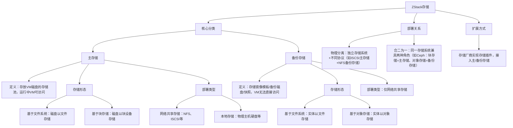

## 内部实现

主存储和备份存储并不是分开工作的；它们为了执行存储相关的活动，确实需要相互合作。最重要的活动是为了创建一个新的虚拟机。当一个虚拟机是第一次在一个主存储上被创建，**它的镜像模板将会被从备份存储下载到主存储的镜像缓存中**。由于大多数hypervisor使用称为[链式克隆](https://www.vmware.com/support/ws55/doc/ws_clone_overview.html)的技术，一旦镜像模板被下载，它将为所有的，使用了同样的镜像模板且在同样的主存储中有根磁盘的虚拟机，作为基础磁盘来工作。

在下载镜像之外，主存储也会上传实体，像磁盘、快照，到备份存储；这些上传活动都是备份相关的；例如，当用户备份一个数据磁盘时，数据磁盘的一个副本将会被上传到备份存储，作为一个镜像模板，可以在之后被下载到主存储用于创建新的数据磁盘。

### 源代码插件实现

在源代码中，主存储和备份存储在不同的插件中实现。

在复杂性方面，备份存储显得更直接，因为只处理自身的事情。备份存储的主要活动是下载、上传和删除。一个备份存储需要定义一些协议，规定主存储怎样下载和上传实体，但它不需要知道主存储的细节，因为这是主存储的责任去使用这些协议来执行这些活动。另外，备份存储必须实现一些协议，这些协议允许镜像服务注册和删除镜像模板。和所有的其他资源类似，备份存储有一个抽象的基类BackupStorageBase,已经实现了大多数通用的业务逻辑，存储厂商只需要实现那些和他们后台存储系统直接相关的操作，通常是通过调用SDK或调用agent。

主存储更加复杂。复杂的根源来自于这么一个事实，即它的业务逻辑不只是依赖于备份存储，也依赖于hypervisor的细节。一个主存储，首先，必须理解备份存储的协议，以下载和上传实体；例如，一个NFS主存储必须知道Sftp备份存储，亚马逊S3备份存储，Swift备份存储的信息，如果它计划支持所有的这些。另一方面，对于同一个备份存储，协议的使用方法也会随着不同的hypervisor而不同；例如，NFS主存储可以调用KVM agent去使用s3tool来从亚马逊S3备份存储下载一个镜像模板；然而，由于VMWare有一个封闭的生态系统，对于NFS主存储来说要做同样事情的唯一方式是通过VMWare的SDK。基于这些事实，主存储的复杂性是M*N，其中M是备份存储的种类，N是它所支持的hypervisor的种类。

正如ZStack—通用插件系统一文中所描述的,ZStack是一个插件系统，每一个特性都被做成一个小的插件；一个主存储需要定义两个接口来打破这个复杂性。

- 第一个是一个hypervisor的后端，用于处理只和hypervisor有关的活动；
  - 例如，NFS主存储有个定义好的接口：NfsPrimaryStorageBackend，对每一个支持的hypervisor，都会有一个具体的类，类似NfsPrimaryStorageKVMBackend用于KVM。
- 第二个，称之为PrimaryToBackupStorageMediator，是一个*hypervisor到备份存储*的后端，用于处理同时涉及到hypervisor和备份存储的后端；
  - 例如，Nfs主存储有一个NfsPrimaryToSftpBackupKVMBackup的实现，用于为KVM支持Sftp备份存储。

这听起来非常糟糕，因为一个主存储必须实现如此多的东西；然而，事实上，一个主存储可能不需要去为所有的hypervisor支持所有的备份存储；例如，为VMWare支持Sftp备份存储是毫无意义的，因为VMWare SDK没有可能允许用scp传输一个文件到它的存储仓（即使可以通过绕过SDK使得这成为可能，我们不把它视为一种可靠的方式）。而且网络共享存储上，流行的协议并不特别多，大多数的使用场景可以被处理，一旦我们把Nfs主存储和Iscsi主存储准备就位。

***注意：\****在当前的ZStack版本中（0.6），只有Nfs主存储和Sftp备份存储被实现了。*

在这篇文章中，我们演示了ZStack的存储模型。通过以逻辑功能将存储划分成主存储和备份存储，ZStack提供了一个非常棒的灵活性，使得存储厂商可以选择性地以各种意图插入他们的存储系统。而且随着越来越的普遍的存储协议，比如NFS、ISCSI、S3、Swift，将被作为默认插件加入，用户将不需要忧虑他们是否能够为他们现存的存储系统找到合适的组合。

# 12.网络模型1：L2和L3网络

ZStack将网络模型抽象为L2和L3网络。

- L2网络提供一种二层网络隔离的方式，
- 而L3网络主要和OSI七层模型中第4层~第7层网络服务相对应。

我们的想法是使用管理员熟悉的术语和概念，来形容ZStack的网络模型，使得管理员可以方便快捷的创建网络拓扑。

*注：*我们将不涉及任何在Hypervisor端虚拟化技术的网络实现细节；例如，我们将不讨论ZStack如何在Linux操作系统中创造网桥或VLAN设备。这篇文章的目的是给你**介绍ZStack网络模型的简要构想**。如果你还没有阅读“通用插件系统”的话，我们强烈建议你去阅读一遍，因为许多和插件相关的术语将在下文被提到。

## 概述

云计算中最令人兴奋和最困难的部分应该是网络模型。云技术给传统的数据中心带来的最大的变革是，管理员不需要花费几天甚至几周的时间去创建或改变网络的拓扑结构，相反，他们可以几分钟就能完成以前很艰巨的任务，通过点击在IaaS软件用户界面上的一些按钮。

为了达到这种简单性，IaaS软件必须有一个清晰、灵活的网络模型，可以帮助管理员在云中建立大多数的，传统数据中心里的典型的网络拓扑。而且，更重要的是，它必须允许管理员**改变已经构建好的网络**，在任何必要的时候，而无需重新部署整个云。

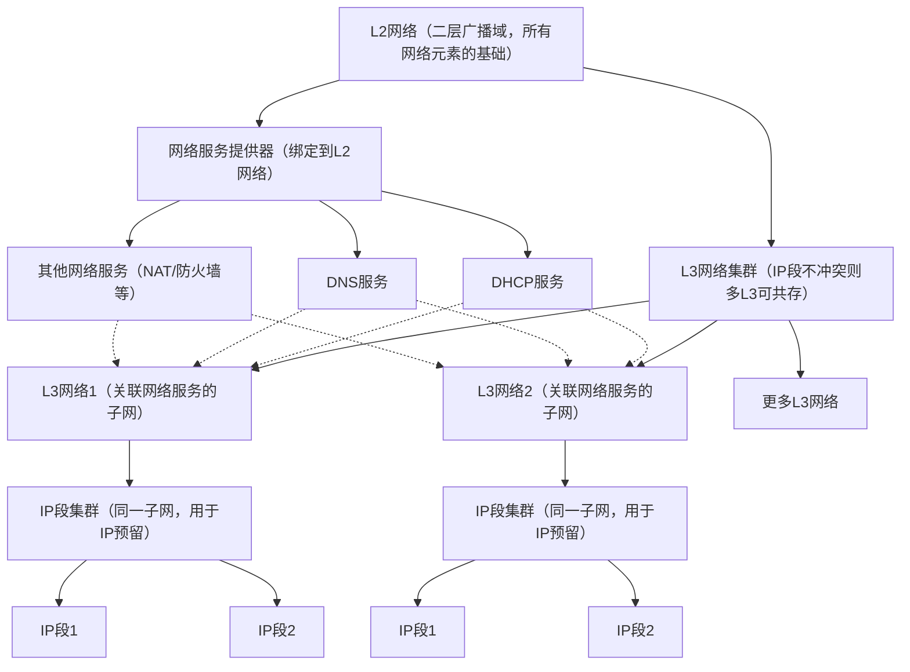

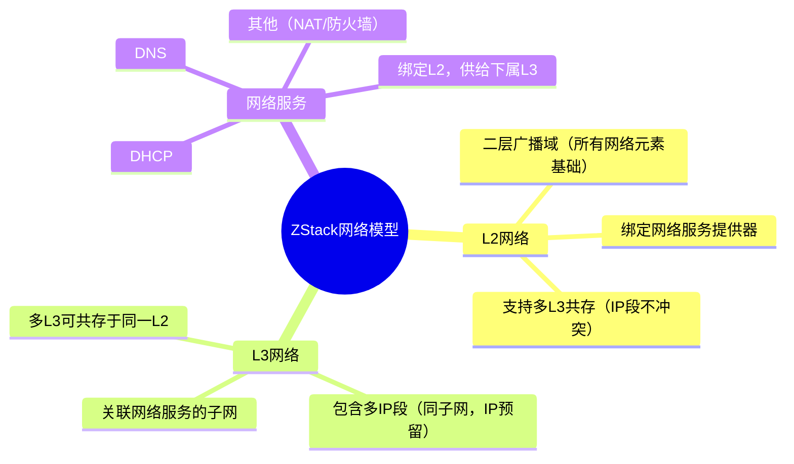

- 一个L2网络，精确地表示了一个二层网络广播域的，是所有网络元素的基础。
- 在L2网络之上，有各种L3网络和网络服务提供模块；
  - 一个L3网络是一个与网络服务相关的子网；
  - 尽管一个L2网络通常只包含一个L3网络，只要L3网络的IP段不冲突，多个L3网络可以并存于同一L2网络
  - 一个L3网络可能有一个或多个属于同一子网的IP段，IP地址分段的目的是为了让用户保留一部分来自子网的IP。
  - 网络服务，类似于DHCP、DNS，由绑定到一个L2网络上的提供器提供给L3网络。

***注：\***由于虚拟私有云（VPC**）尚未在这个ZStack**版本（0.6**）支持，上述网络模型不显示VPC**将如何工作。然而，概念是类似的，VPC**只是一个为多个L3**网络设计的，有编程选路功能的调度器。我们将在未来的ZStack**版本中引入VPC**，不久之后。

## L2网络

一个L2网络负责提供一种二层隔离方法，可以是一个纯粹的L2技术（如VLAN），或一个网络覆层（overlay）技术（如GRE隧道，VxLAN）。ZStack不关心L2网络在后端使用的技术细节，所以包含必要的L2信息的数据结构--L2NetworkInventory--是高度抽象的：

| **FIELD**            | **DESCRIPTION**                                              |
| -------------------- | ------------------------------------------------------------ |
| uuid                 | L2 network UUID                                              |
| name                 | a short name                                                 |
| description          | a long description                                           |
| zoneUuid             | uuid of zone the L2 network belongs to                       |
| physicalInterface    | a string containing information necessary to implement the L2 network at the backend. for example, 'eth0' |
| type                 | L2 network type                                              |
| attachedClusterUuids | a list of cluster uuid the L2 network has attached to        |

L2网络的子类型可能有额外的属性，例如，L2VlanNetwork有一个额外的字段的vlan。

### 绑定策略

在真实的数据中心中，L2网络通常代表主机之间一个的物理网络连接。

例如，在同一L2交换机下的主机可能在同一个L2网络中。网络的连接不是一成不变的，它可能会在任何数据中心的物理设备改变的时候改变，例如管理员重新配置（re-wire）一个L2交换机。为了提供一种灵活的、描述主机和L2网络之间的关系的方式，ZStack采用了一种所谓的*绑定策略*，允许一个L2网络连接从多个集群（主机的集合）中绑定/解绑。

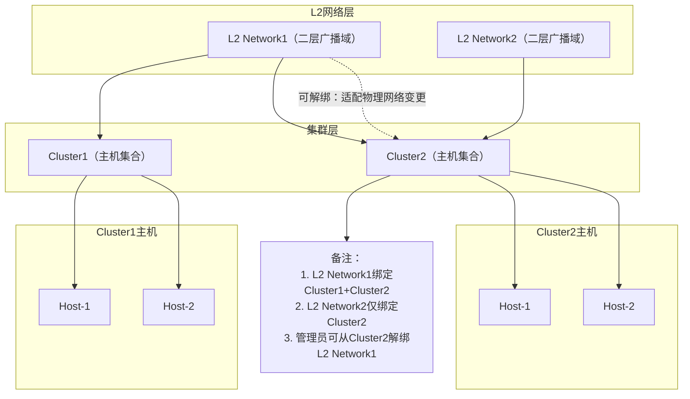

上图，Cluster1和Cluster2中的主机都是挂载在L2 Network1上，同时Cluster2上的主机也挂载在L2 Network2上，管理员可以同时将L2 Network1绑定两个集群，却不能仅仅把L2 Network2绑定在Cluster2上。一段时间后，如果管理员为了删除L2 Network1上的连接，重新配置在Cluster2上的主机，他们可以从Cluster2中解绑L2 Network1去反映当前的网络连接。


集群和L2网络之间的挂载关系，展示了在这些集群内的主机之间建立L2广播域的行为，这并不总是涉及到物理连接的变化。例如，连接到标记的交换机端口的主机，可以在以太网设备上使用操作系统中相同的VLAN创建网桥，用来为连接到这些网桥的虚拟机建立一个L2广播域；在这种情况下，绑定或解绑L2网络并不意味着任何物理基础设施的变化，但意味着创建或删除一个L2广播域的行为。

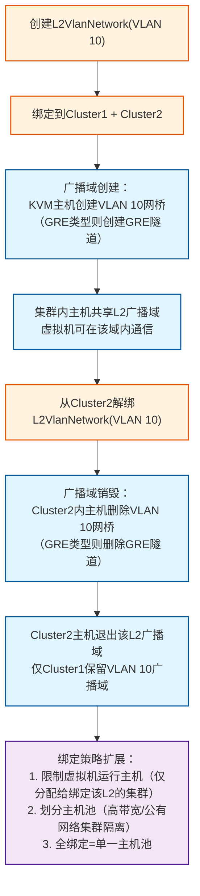

上图所示，一旦管理员创建一个包含VLAN 10的L2VlanNetwork，并把它挂载到cluster1和cluster2上，一个广播域在这些集群中的主机之间被创建。虚拟机管理程序可以通过各种方式来实现L2广播域，例如，KVM主机可以在它们的Linux操作系统上通过VLAN设备（VLAN 10）创建网桥；如果L2VlanNetwork解绑集群cluster2后，被解绑的集群中的主机将通过删除它们的VLAN(10)网桥的方式，从广播域中被移除。这种创建/销毁广播域的概念适用于所有L2网络类型；例如，绑定一个OvsGreL2Network到KVM集群上可能导致GRE隧道在这些主机中被创建，而将一个OvsGreL2Network解绑可能导致GRE隧道被删除。

这种绑定策略有一个额外的好处是，考虑到了限制虚拟机可以运行的主机。因为虚拟机总是和L3网络一起被创建，这些L3网络属于一些L2网络，虚拟机将只被分配给已经绑定这些L2网络的集群中的主机。通过这种方式，管理员可以通过L2网络把主机划分到不同的池中，例如，一个连接了高带宽的L2网络的集群，一个连接了公有L2网络的集群。如果管理员想把所有的主机都放在一个单一的池中，他们可以让所有的L2网络绑定所有的集群。

### 后端实现

通过虚拟化技术，L2网络的后端实现是高度依赖Hypervisor的。例如，在KVM主机上实现L2VlanNetwork就是创建一个VLAN设备的网桥，但对于VMWare ESXi主机则是配置vSwitch。为了让L2网络的实现和Hypervisor解耦，ZStack将实现某种类型L2网络的责任委托给Hypervisor插件。为了实现一个L2网络，定义了两个扩展点。

第一个是L2NetworkRealizationExtensionPoint

```java
/**
 * L2网络实例化扩展点接口
 * <p>
 * 该接口是ZStack中用于扩展不同类型L2网络（如L2VlanNetwork、OvsGreL2Network等）在主机上的实例化/校验逻辑的核心扩展点，
 * 存储/网络厂商可实现此接口，适配不同Hypervisor（如KVM、VMware）下L2网络在物理主机上的创建、校验逻辑，
 * 例如：KVM主机上创建VLAN网桥、GRE隧道，或校验主机是否满足L2网络挂载条件。
 * </p>
 */
public interface L2NetworkRealizationExtensionPoint {

    /**
     * 实例化L2网络到指定主机（核心业务方法）
     * <p>
     * 实现L2网络在目标主机上的物理/逻辑实例化，例如：
     * - L2VlanNetwork：在KVM主机创建对应VLAN ID的网桥；
     * - OvsGreL2Network：在OVS环境下创建GRE隧道；
     * 操作结果需通过Completion回调告知ZStack核心框架，异步完成。
     * </p>
     * @param l2Network 待实例化的L2网络元数据（包含网络类型、VLAN ID、GRE配置等核心信息）
     * @param hostUuid 目标主机的UUID（标识要挂载L2网络的物理主机）
     * @param completion 异步完成回调：
     *                   - success()：实例化成功，继续流程；
     *                   - fail(Throwable)：实例化失败，终止流程并返回异常。
     */
    void realize(L2NetworkInventory l2Network, String hostUuid, Completion completion);

    /**
     * 校验指定主机是否支持该L2网络的实例化
     * <p>
     * 在执行realize()前的前置校验，例如：
     * - 校验主机是否安装OVS组件（针对OvsGreL2Network）；
     * - 校验主机网卡是否支持指定VLAN ID（针对L2VlanNetwork）；
     * - 校验主机是否已绑定该L2网络所属集群（贴合L2网络-集群绑定策略）；
     * 校验结果通过Completion回调返回。
     * </p>
     * @param l2Network 待校验的L2网络元数据
     * @param hostUuid 目标主机的UUID
     * @param completion 异步完成回调：
     *                   - success()：校验通过，允许执行realize()；
     *                   - fail(Throwable)：校验失败，终止实例化流程。
     */
    void check(L2NetworkInventory l2Network, String hostUuid, Completion completion);

    /**
     * 获取当前扩展点支持的L2网络类型
     * <p>
     * 用于ZStack框架匹配扩展点与L2网络类型，例如返回：
     * - L2VlanNetworkType.TYPE（VLAN类型L2网络）；
     * - OvsGreL2NetworkType.TYPE（GRE隧道类型L2网络）；
     * 确保扩展点仅处理指定类型的L2网络实例化逻辑。
     * </p>
     * @return 支持的L2网络类型枚举（L2NetworkType）
     */
    L2NetworkType getSupportedL2NetworkType();

    /**
     * 获取当前扩展点支持的虚拟化类型（Hypervisor）
     * <p>
     * 用于ZStack框架匹配扩展点与主机的Hypervisor类型，例如返回：
     * - HypervisorType.KVM（KVM虚拟化主机）；
     * - HypervisorType.VMWARE（VMware虚拟化主机）；
     * 确保扩展点仅处理指定虚拟化类型主机的L2网络实例化。
     * </p>
     * @return 支持的Hypervisor类型枚举（HypervisorType）
     */
    HypervisorType getSupportedHypervisorType();
}
```

当一个L2网络被绑定到一个集群，这个拓展点将被集群中的每个主机所调用，这个Hypervisor插件可以借此机会在后端主机实现网络；例如，KVM的插件同时有KVMRealizeL2NoVlanNetworkBackend和`KVMRealizeL2VlanNetworkBackend`，后者拓展了`L2NetworkRealizationExtensionPoint`，为了在Linux操作系统创造网桥。这个扩展点是非常有用的，对于不需要知道虚拟机信息的L2网络而言。L2NoVlanNetwork和L2VlanNetwork都属于这一类。

然而，一些L2网络可能只能在虚拟机被创建的时候实现，例如，一个L2VxlanNetwork可能需要查找虚拟机所有者帐户的VID，为了建立一个L2广播域；在这种情况下，Hypervisor插件可以实现另一个扩展点PreVmInstantiateResourceExtensionPoint：

```java
/**
 * VM实例化资源前置扩展点接口
 * <p>
 * 该接口是ZStack中用于扩展VM（虚拟机）实例化/资源释放流程的核心扩展点，
 * 允许存储/网络厂商或定制化开发方在VM资源实例化前、释放前插入自定义逻辑，
 * 例如：存储资源预检查、网络策略适配、主机资源预留等；
 * 接口包含同步/异步方法，适配不同耗时的自定义逻辑场景。
 * </p>
 */
public interface PreVmInstantiateResourceExtensionPoint {

    /**
     * VM资源实例化前置预处理（同步方法）
     * <p>
     * 在VM实例化核心逻辑执行前同步执行的预处理逻辑，若抛出异常则直接终止整个VM实例化流程；
     * 适用于轻量、快速完成的校验逻辑（如：检查主存储可用容量、L2网络与集群绑定关系）。
     * </p>
     * @param spec VM实例规格对象，包含VM配置、关联的存储/网络/主机资源等核心元数据
     * @throws VmInstantiateResourceException 预处理失败时抛出，终止VM实例化流程
     */
    void preBeforeInstantiateVmResource(VmInstanceSpec spec) throws VmInstantiateResourceException;

    /**
     * VM资源实例化前置处理（异步方法）
     * <p>
     * 在VM实例化过程中异步执行的自定义逻辑，适用于耗时操作（如：异步初始化存储插件、创建GRE隧道网络）；
     * 需通过Completion回调告知框架处理结果，不阻塞主线程。
     * </p>
     * @param spec VM实例规格对象，包含VM全量配置及关联资源信息
     * @param completion 异步完成回调对象：
     *                   - 调用completion.success()：自定义逻辑执行成功，继续VM实例化流程；
     *                   - 调用completion.fail(Throwable)：自定义逻辑执行失败，终止VM实例化并返回异常。
     */
    void preInstantiateVmResource(VmInstanceSpec spec, Completion completion);

    /**
     * VM资源释放前置处理（异步方法）
     * <p>
     * 在VM资源释放（销毁/迁移）前异步执行的自定义清理逻辑，适用于耗时的资源回收操作（如：释放块存储设备、删除VM关联的快照/备份）；
     * 需通过Completion回调告知框架清理结果。
     * </p>
     * @param spec VM实例规格对象，包含待释放VM的资源关联信息
     * @param completion 异步完成回调对象：
     *                   - 调用completion.success()：清理成功，继续VM资源释放流程；
     *                   - 调用completion.fail(Throwable)：清理失败，终止资源释放并返回异常。
     */
    void preReleaseVmResource(VmInstanceSpec spec, Completion completion);
}
```

插件可以从`VmInstanceSpec`中获取获取目标主机和虚拟机的信息，然后在目标主机创建虚拟机之前实现一个L2网络。

## L3网络

一个L3网络是**创建在L2网络上的一个子网**，与网络服务相关联；它可以有多个IP地址范围，只要它们属于同一个L3网络且彼此并不冲突。

在上面的图片中有两个IP范围（192.168.0.10 - 192.168.0.50）和（192.168.0.60 - 192.168.0.100），从192.168.0.51到192.168.0.59的IP被保留，这样管理员可以把它们分配给不被ZStack管理的设备。

如果没有由网络服务提供模块提供的、和底层的L2网络服务相关的网络服务，L3网络没有任何用处。网络服务提供模块可以提供一个或多个网络服务，例如，ZStack的默认*虚拟路由提供模块*能够提供几乎所有常见的网络服务如DHCP、DNS、NAT等，而*F5**提供模块*可能只提供负载均衡服务。在ZStack版本（0.6）中，网络服务提供模块只能在L2网络被创建的时候和L2网络关联；例如，实现了`L2NetworkCreateExtensionPoint`的虚拟路由，将在任何L2网络创建后与之关联。

管理员可以将网络服务绑定到一个L3网络；对于一类服务，只有一个网络服务提供模块提供的服务可被绑定到这个L3网络；例如，你不能将来自不同提供模块的两个DHCP服务绑定到同一L3网络。在ZStack版本（0.6）中，定义了六种网络服务类型：DHCP、DNS、NAT、EIP、端口转发和安全组，提供模块只需要实现相应的后端：NetworkServiceDhcpBackend，`NetworkServiceDnsBackend`,`NetworkServiceSnatBackend`,`EipBackend`,`PortForwardingBackend`,和`SecurityGroupHypervisorBackend`来提供这些服务。在“网络模型2：虚拟路由器的网络服务提供模块”，我们将讨论我们引用到的提供模块*——虚拟路由*，你可以探索更多的细节。

在这部分内容中，我们简要地解释了ZStack的网络模型。在没有挖掘后台Hypervisor的细节的情况下，我们演示了ZStack是如何将OSI模型抽象为L2网络（layer 2），L3网络（layer 3）以及网络服务（layer 4～7）。在下一篇文章中，我们将详细阐述网络服务提供模块的参考实现，关于它如何在虚拟机中实现DHCP、DNS、NAT、EIP和端口转发。
