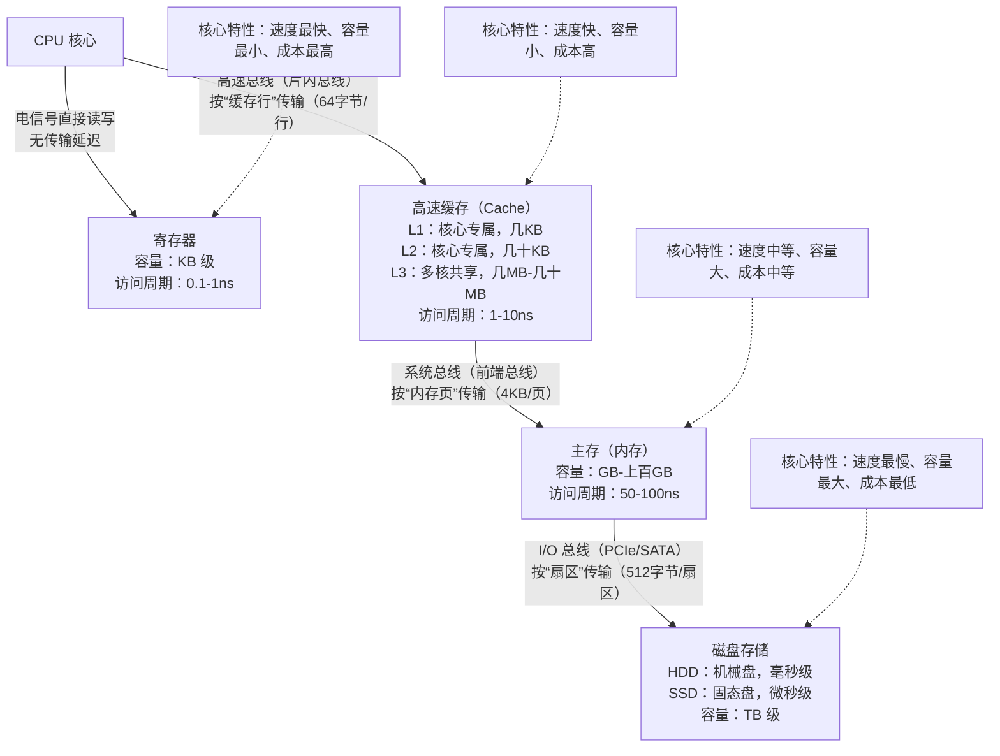

# 存储器层次结构

```mermaid
graph TD
    A[CPU 核心] -->|电信号直接读写<br>无传输延迟| B[寄存器<br>容量：KB 级<br>访问周期：0.1-1ns]
    A -->|高速总线（片内总线）<br>按“缓存行”传输（64字节/行）| C[高速缓存（Cache）<br>L1：核心专属，几KB<br>L2：核心专属，几十KB<br>L3：多核共享，几MB-几十MB<br>访问周期：1-10ns]
    C -->|系统总线（前端总线）<br>按“内存页”传输（4KB/页）| D[主存（内存）<br>容量：GB-上百GB<br>访问周期：50-100ns]
    D -->|I/O 总线（PCIe/SATA）<br>按“扇区”传输（512字节/扇区）| E[磁盘存储<br>HDD：机械盘，毫秒级<br>SSD：固态盘，微秒级<br>容量：TB 级]
    
    %% 标注层级核心特性
    note1[核心特性：速度最快、容量最小、成本最高] -.-> B
    note2[核心特性：速度快、容量小、成本高] -.-> C
    note3[核心特性：速度中等、容量大、成本中等] -.-> D
    note4[核心特性：速度最慢、容量最大、成本最低] -.-> E
```

下面我们按照最靠近