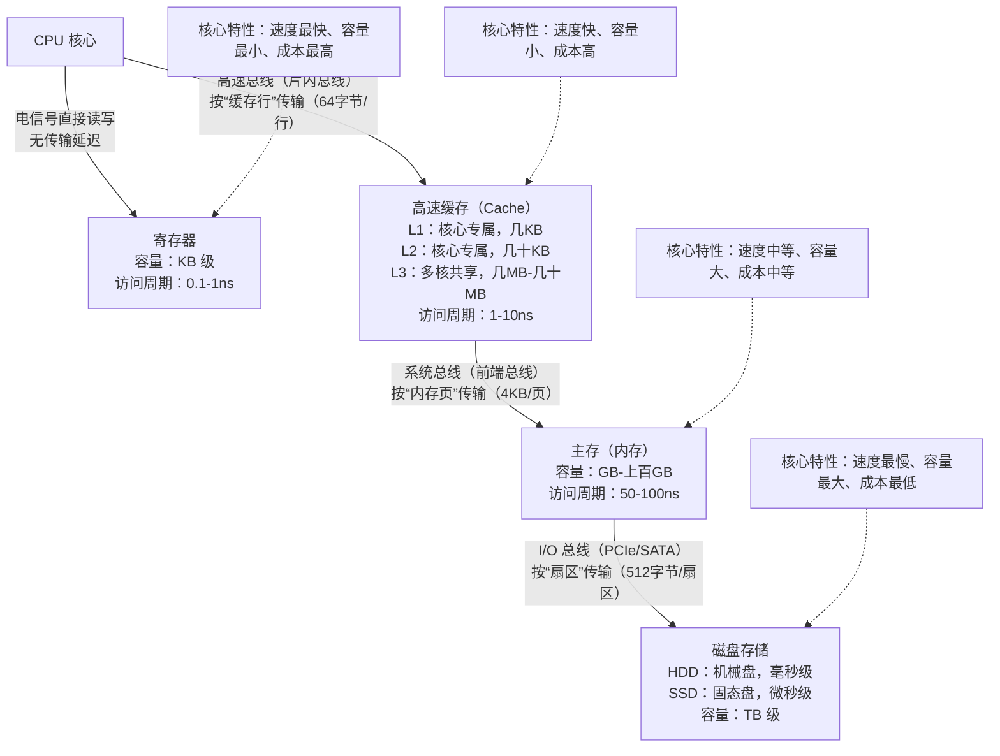

# 存储器层次结构

下面我们按照最靠近cpu向下梳理：

- 寄存器：0个周期就可以获取到
- 高速缓存：1-30个周期
- 主存：50-200个周期
- 磁盘：几千万个周期

然后我们梳理一下这些传输的方式（线路、总线等）：

- CPU 核心 ↔ 寄存器：电信号直接读写，无专用传输总线
- CPU 核心 ↔ 高速缓存（L1/L2/L3）：CPU 片内高速总线，L3 缓存与多核的互连为**片内多核互连架构**
- 高速缓存 ↔ 主存（内存）：系统前端总线（FSB）/ 内存控制器总线
  - 传统设计：内存控制器集成在北桥芯片，通过**前端总线**连接 CPU 与北桥，再通过**内存总线**连接北桥与内存条（主板板间总线，厘米级物理距离）；
  - 现代设计（酷睿 / 锐龙后）：**内存控制器集成在 CPU 内部**，CPU 直接通过**DDR 专用总线**连接主板上的内存条（板间总线，物理距离更短，延迟更低）；
- 主存 ↔ 磁盘存储（HDD/SSD）：计算机 I/O 总线体系
  - 连接HDD（机械盘）：SATA 总线（主板 SATA 接口 → SATA 数据线 → 硬盘 SATA 接口）
  - 连接SSD（固态盘）：PCIe 总线（主流 NVMe 协议）/SATA 总线（主板 PCIe 插槽 → NVMe SSD（直连）；SATA 接口 → SATA SSD）