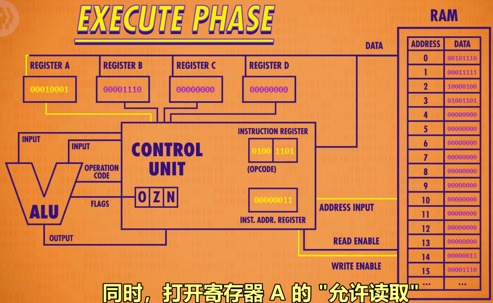
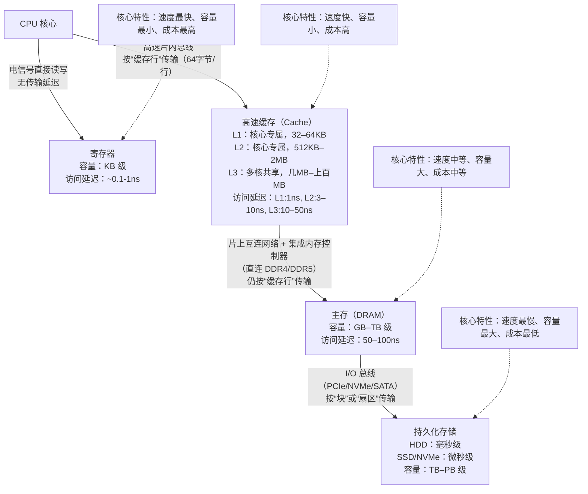
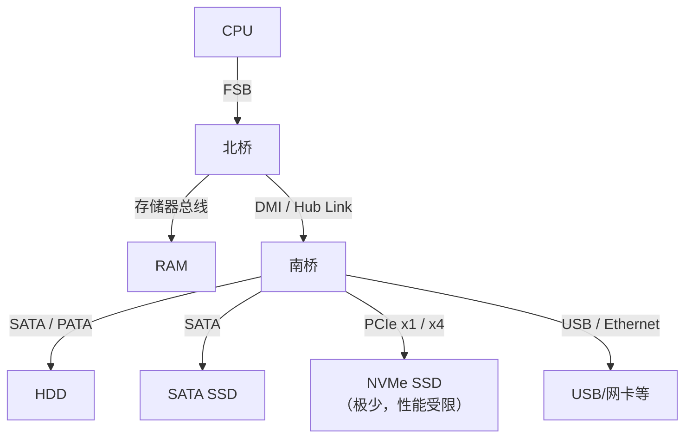
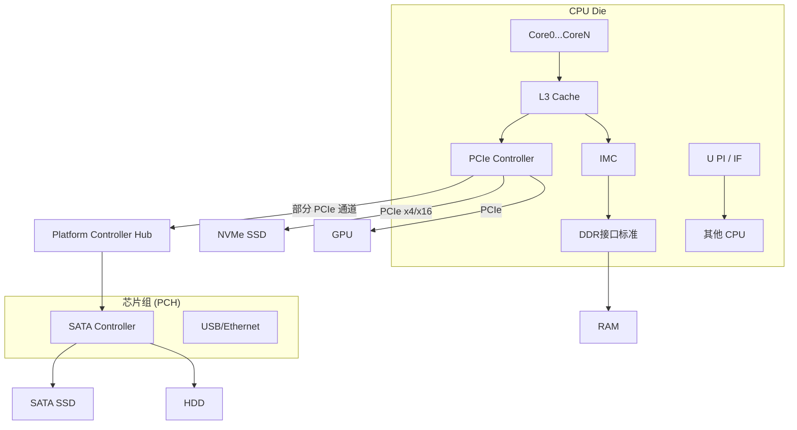

# 存储技术

## 存储介质

来源：深入理解计算机系统——存储器结构层次章节

- 易失性存储器：断电就寄了

  - SRAM：有电就维持稳态，不用刷新存取快抗干扰，但是需要更多晶体管

  - DRAM：每个存储位对一个电容充电
    - 传统DRAM
    - 增强的DRAM

- 非易失性存储器

  - ROM：只读存储器
  - PROM：（P：Programmable）可以被写，但是是熔断金属丝的方式，所以只能写一次
    - EPROM：（E：Eraseable）可擦写，允许光（紫外光）达到存储单元，大概能用1000次
      - EEPROM：（E：electrically）电子可擦除，能用100000次（**PS：** 闪存就是基于这个——固态又是基于闪存的）

## 存储器结构（电存部分）

### 传统架构

CPU- ALU+RAM这个内部结构就不细究了，之后有时间回顾看一下[3. 布尔逻辑 和 逻辑门-Boolean Logic & Logic Gates_哔哩哔哩_bilibili](https://www.bilibili.com/video/BV1EW411u7th?vd_source=ec6316a581a37a9f967c180fffa5f8b5&spm_id_from=333.788.videopod.episodes&p=3)这个是从逻辑门电路开始，**逐层封装**到CPU，并且讲了一下ADD和LOOP这俩汇编指令怎么走的。



- CPU是用内部的**总线接口**连接***系统总线***使用**IO桥**走***存储器总线***访问到**主存储（图中RAM）**

  - ps：IO桥是一个北桥的功能，不是IO设备

  - ps:前端总线=系统总线

    ```txt
    +------+     +------------------+     +--------------+
    | CPU  |<--->| 前端总线 (FSB)   |<---> |  北桥     	 |
    +------+     +------------------+     | (含内存控制器) |
                                          +-----+--------+
                                                |
                                         	存储器总线
                                                |
                                             +-----+
                                             | RAM |
                                             +-----+
    ```

    

### 新架构

L1，L2，L3在CPU芯片内部

- L1核心内部 1-2个时钟周期访问
- L2核心附近 比较大 10个时钟周期
- L3芯片内 **独立于单个核心** 30-50个时钟周期



下面我们按照最靠近cpu向下梳理：

- 寄存器：0个周期就可以获取到
- 高速缓存：1-30个周期
- 主存：50-200个周期
- 磁盘：几千万个周期

然后我们梳理一下这些传输的方式（线路、总线等）：

- CPU 核心 ↔ 寄存器：电信号直接读写，无专用传输总线
- CPU 核心 ↔ 高速缓存（L1/L2/L3）：CPU 片内高速总线，L3 缓存与多核的互连为**片内多核互连架构**
- 高速缓存 ↔ 主存（内存）：系统前端总线（FSB）/ 内存控制器总线
  - 传统设计：内存控制器集成在北桥芯片，通过**前端总线**连接 CPU 与北桥，再通过**内存总线**连接北桥与内存条（主板板间总线，厘米级物理距离）；
  - 现代设计（酷睿 / 锐龙后）：**内存控制器集成在 CPU 内部**，CPU 直接通过**DDR 专用总线**连接主板上的内存条（板间总线，物理距离更短，延迟更低）；
- 主存 ↔ 磁盘存储（HDD/SSD）：计算机 I/O 总线体系
  - 连接HDD（机械盘）：SATA 总线（主板 SATA 接口 → SATA 数据线 → 硬盘 SATA 接口）
  - 连接SSD（固态盘）：PCIe 总线（主流 NVMe 协议）/SATA 总线（主板 PCIe 插槽 → NVMe SSD（直连）；SATA 接口 → SATA SSD）

#### CPU-->RAM

```txt
+-------------------------------------------------+
|                   CPU Die                       |
|                                                 |
|  Core0 —— Core1 —— ... —— CoreN                 |
|    |        |               |                   |
|   L1/L2    L1/L2          L1/L2                 |
|    \        |               /                   |
|     \       |              /                    |
|      +------+--------------+                    |
|             |                                   |
|           L3 Cache                              |
|             |                                   |
|      Integrated Memory Controller (IMC)         |
|             |                                   |
|          DDR4/DDR5 Channels                     |
+-------------+-----------------------------------+
              |
            +-----+
            | RAM |
            +-----+
```

我们基于上述的知识，来梳理一下如果一个CPU想拿一个RAM中的数据，需要经过

1. 请求从 **L1 发起** → 未命中；
2. 自动查 **L2** → 未命中；
3. 自动查 **L3** → 未命中；
4. 触发 **内存控制器** 从 **RAM 读取整块数据（Cache Line，通常 64 字节）**；
5. 数据 **先填入 L3** → 再填入 L2 → 最后填入 L1；
6. CPU 核心从 **L1 读取所需字节** 到寄存器。

#### 发生的变化：系统总线的拆分

给前端总线（=系统总线）拆分成不同的线放在CPU芯片内部了

##### 拆分

之前的系统总线的功能：

| 功能                      | 说明                                                         |
| ------------------------- | ------------------------------------------------------------ |
| **1. 访问主存（RAM）**    | CPU 所有内存读写请求都通过 FSB 发送给北桥中的内存控制器      |
| **2. 多核/超线程通信**    | 早期多核 CPU（如 Core 2 Duo）的核间数据交换也走 FSB          |
| **3. 访问显卡（GPU）**    | 显卡连接在北桥上（AGP/PCIe），CPU 与 GPU 通信需经 FSB        |
| **4. 与南桥通信（间接）** | 北桥通过 DMI 或 Hub Link 连接南桥，I/O 请求（如磁盘）最终也挤占 FSB 带宽 |

拆分之后的类型

| FSB 原功能                    | 现代替代方案                                                 | 特点                                                         |
| ----------------------------- | ------------------------------------------------------------ | ------------------------------------------------------------ |
| **访问主存（RAM）**           | ➤ **集成内存控制器（IMC） + DDR 通道** （如 DDR4/DDR5 控制器） | - 直连 DRAM - 每通道带宽 > 25 GB/s - 延迟从 ~100ns 降至 ~50ns |
| **多核 & 缓存通信**           | ➤ **片上互连网络（On-die Interconnect）** （如 Intel Ring Bus / Mesh，AMD Infinity Fabric on-die） | - 核心 ↔ L3 ↔ IMC 高速互联 - 支持并发访问 - 延迟仅几纳秒     |
| **连接高速外设（GPU/NVMe）**  | ➤ **集成 PCIe 控制器 + PCIe 通道**                           | - SSD/GPU 直连 CPU - 绕过芯片组（PCH） - PCIe 5.0 x16 带宽达 128 GB/s |
| **多 CPU 插槽互联**（服务器） | ➤ **点对点高速链路** （Intel UPI / AMD Infinity Fabric inter-socket） | - 替代 FSB 的多路扩展功能 - 低延迟、高带宽、可扩展           |

##### 架构变化

老架构

```
[CPU] ←—(FSB)—→ [北桥] ←→ RAM
                  ↘
                 [南桥] ←→ 磁盘 / USB / 网卡
                  ↗
            显卡 (AGP/PCIe)
```

新架构

```
+-------------------------------------------------------+
|                   CPU Die                        		|
|                                                 	 	|
|  [Core0]—[L1/L2]                                  	|
|      \                                            	|
|       \                                           	|
|        [片上互连] —— [L3 Cache] —----— [IMC] ——------- DDR → RAM	  	
|        /                  \                        	|
|       /                    \                       	|
|  [CoreN]—[L1/L2]        [PCIe Controller] —— NVMe/GPU |
|                             |							|
|                         [UPI/IF] —— 其他 CPU（服务器）	|
+-------------------------------------------------------+
```

## 存储器结构（持久化存储）

- **老**：CPU → FSB → 北桥 → 南桥 → SATA 控制器 → HDD/SSD
- **新**：CPU → **集成 PCIe 控制器** → NVMe SSD（**绕过芯片组**）

### 灾备链路中的存储器层次

```
寄存器（Registers）
   ↓
L1 / L2 / L3 缓存（Cache）
   ↓
主存（Main Memory, RAM） ← 易失性
   ↓
持久化存储（Persistent Storage） ← 非易失性
   ├── HDD（机械硬盘）
   ├── SATA SSD
   └── NVMe SSD（直连 PCIe）
   ↓
磁带 / 光盘 / 云对象存储（归档层）
```

### 数据传输的流程

首先，不同于RAM的部分，持久化存储介质有明显的三种类型，而每种类型走的线都可能不同，所以，我们先明确三分三确定：

三个类型区分：

- **HDD（机械硬盘）**
- **SATA SSD（基于 SATA 接口的固态盘）**
- **NVMe SSD（基于 PCIe 的高性能固态盘）**

三个不变：

- 所有持久化存储都通过 **I/O 子系统**访问，**不走内存通道**；
- CPU **不能直接按地址读写磁盘**，必须通过 **设备控制器 + 驱动程序**；
- 数据最终从 **RAM → 设备** 或 **设备 → RAM**，再由程序处理。

#### 老架构

三种相似，所有 I/O 流量必须经过 **南桥 → 北桥 → FSB → CPU**



```
CPU → FSB → 北桥 → 南桥 → [HDD / SATA SSD / (受限 NVMe)]
                     ↑
                   所有 I/O 共享窄带宽
```

| 存储类型     | 控制器位置                                         | 总线                 | 协议             | 特点                                   |
| ------------ | -------------------------------------------------- | -------------------- | ---------------- | -------------------------------------- |
| **HDD**      | 南桥内置 SATA/PATA 控制器                          | SATA / IDE           | AHCI（或更老）   | 速度慢（~100 MB/s），延迟高（ms 级）   |
| **SATA SSD** | 南桥 SATA 控制器                                   | SATA III (6 Gbps)    | AHCI             | 比 HDD 快，但受 AHCI 和 SATA 带宽限制  |
| **NVMe SSD** | ❌ **几乎不存在** （即使插 PCIe，也走南桥低速通道） | PCIe（但经南桥中转） | NVMe（理论支持） | 实际带宽和延迟受南桥瓶颈，无法发挥性能 |

#### 新架构

持久化存储**直连 CPU**（尤其是 NVMe）,不跟其他的IO争抢带宽

现代“南桥”已演变为 **PCH（Platform Controller Hub）**，功能类似但连接方式不同

```
CPU Die
 ├─→ IMC → DDR → RAM
 ├─→ PCIe Controller → NVMe SSD  （高速直连）
 └─→ PCIe → PCH → SATA → HDD / SATA SSD  （低速走芯片组）
```



# 三大存储范式

注意这个和硬盘那三个不是一回事，我之前就弄混了

| 类型         | 常见技术/产品                             | 访问方式                          | 英文           | 你能怎么“看”它？                             | 典型用途                        | 协议                    |
| ------------ | ----------------------------------------- | --------------------------------- | -------------- | -------------------------------------------- | ------------------------------- | ----------------------- |
| **块存储**   | iSCSI, Fibre Channel, AWS EBS, 阿里云云盘 | 块设备（/dev/sdX）                | Block Storage  | 像一块**裸硬盘**，只有扇区（0,1,2...）       | 装操作系统、数据库、虚拟机磁盘  | iSCSI, FC, NVMe-oF      |
| **文件存储** | NFS, SMB/CIFS, FTP, GlusterFS, CephFS     | 文件路径（/mnt/share/file）       | File Storage   | 像一个**共享文件夹**，有目录、文件名、权限   | 共享文档、日志、媒体库          | NFS, SMB, FTP（仅传输） |
| **对象存储** | Amazon S3, 阿里云 OSS, MinIO, Ceph RGW    | HTTP URL（https://s3/bucket/key） | Object Storage | 像一个**超大网盘**，每个文件有唯一 ID（URL） | 图片/视频存储、备份、大数据归档 | S3, Swift               |

看一下常见产品、访问方式就行了，下面简单说一下：

- 块存储（Block Storage）

  - **特点**：
    - 最底层，直接暴露为**逻辑磁盘**（如 `/dev/sdb`）；
    - 操作系统在其上创建**文件系统**（ext4, NTFS, XFS）；
    - **低延迟、高性能**，适合随机读写；
    - **不支持多主机同时挂载**（会损坏文件系统，除非用集群文件系统）。

  - **常见协议/技术**：
    - **iSCSI**：在普通以太网上模拟 SCSI 命令，把远程块设备映射成本地磁盘；
    - **Fibre Channel (FC)**：专用高速网络，用于高端存储阵列；
    - **NVMe over Fabrics (NVMe-oF)**：下一代高性能块协议；
    - **云服务**：AWS EBS、阿里云 ESSD、Azure Disk。

  - **类比**：就像你买了一块**空白移动硬盘**，插上电脑后自己分区、格式化、存文件。

- 文件存储（File Storage）

  - **特点**：
    - 提供**标准文件接口**（open/read/write/close）；
    - 支持**多用户/多机器同时访问**同一目录；
    - 由**文件服务器**管理目录结构和权限；
    - 性能通常低于块存储（因协议开销）。

  - **常见协议/系统**：

    | 协议/系统                         | 特点                                  | 使用场景                   |
    | --------------------------------- | ------------------------------------- | -------------------------- |
    | **NFS**（Network File System）    | Unix/Linux 标准，轻量高效             | Linux 服务器共享、K8s PV   |
    | **SMB/CIFS**                      | Windows 标准（如 `\\server\share`）   | Windows 文件共享、办公协作 |
    | **FTP**（File Transfer Protocol） | **不是实时文件系统**！仅用于上传/下载 | 网站文件上传、旧式数据交换 |
    | **GlusterFS**                     | 分布式文件系统，可横向扩展            | 大规模日志、媒体存储       |
    | **CephFS**                        | 基于 Ceph 的 POSIX 兼容文件系统       | 云平台、高性能计算         |

    **⚠️ 注意 FTP 不是“文件存储系统”**：
     FTP 只是一个**传输协议**，不能像 NFS 那样让程序直接 `open("/mnt/ftp/file.txt")`。它更像是“快递员”，而不是“共享文件夹”。

  - **类比**：就像公司里的**公共网盘**，大家都能看到 `\\company\docs\report.docx`，并同时编辑（需锁机制）。

- 对象存储（Object Storage）

  - **特点**：
    - 数据以 **“对象”** 形式存储：**唯一 ID（Key） + 数据（Value） + 元数据**；
    - 通过 **HTTP/HTTPS API**（如 `PUT /bucket/photo.jpg`）访问；
    - **无限扩展**，适合海量非结构化数据；
    - **最终一致性**（非强一致），不适合数据库；
    - **低成本、高持久性**（通常 99.999999999%）。

  - **常见系统**：
    - **Amazon S3**（事实标准）
    - **阿里云 OSS / 腾讯云 COS / 华为云 OBS**
    - **MinIO**（开源，兼容 S3）
    - **Ceph RGW**（Ceph 的对象网关）

  - **类比**：就像你把文件寄存在**智能储物柜**：
    - 柜号 = Bucket（如 `my-photos`）
    - 密码 = Object Key（如 `2025/vacation.jpg`）
    - 你只能整份存/取，不能“只改第10行”

# 存储方式

这两种方式都属于文件存储，都可以让不同主机通过网络共享访问

- **NFS**：轻量、快、简单，适合“**一台服务器共享给多台用**”。
- **GlusterFS**：强大、可扩、高可用，适合“**把多台服务器变成一台超大存储**”。

| 项目                | NFS                          | GlusterFS                                          |
| ------------------- | ---------------------------- | -------------------------------------------------- |
| **全称**            | Network File System          | —（无全称，开源项目名）                            |
| **类型**            | **网络文件系统协议**         | **分布式文件系统（软件）**                         |
| **核心目标**        | 让远程目录像本地目录一样访问 | 将多台服务器的存储聚合成一个统一、可扩展的文件系统 |
| **是否 POSIX 兼容** | ✅ 是                         | ✅ 是                                               |
| **开源/商业**       | 开源协议（各厂商实现）       | ✅ 开源（Red Hat 主导）                             |

ps：下面的有时间再看就行，不关紧

| 能力             | NFS                                                     | GlusterFS                                           |
| ---------------- | ------------------------------------------------------- | --------------------------------------------------- |
| **挂载方式**     | `mount -t nfs server:/path /mnt`                        | `mount -t glusterfs server:/vol /mnt` 或 FUSE       |
| **多客户端并发** | ✅ 支持（需 NLM 锁）                                     | ✅ 原生支持高并发                                    |
| **扩展性**       | ❌ 单点瓶颈（Server 性能上限）                           | ✅ 横向扩展（加节点即扩容）                          |
| **高可用**       | ❌ 依赖外部 HA（如 Pacemaker）                           | ✅ 内置副本（Replica）或纠删码                       |
| **性能**         | ⚡ 中高（内核级，延迟低）                                | 中（FUSE 有开销；可通过 NFS-Ganesha 优化）          |
| **适用规模**     | 中小规模（< 10 节点）                                   | 大规模（10s–1000s 节点）                            |
| **典型场景**     | - Linux 服务器配置共享 - Kubernetes PV - 虚拟机模板存储 | - 视频/日志集中存储 - 私有云后端存储 - 替代传统 NAS |

- NFS

  - **架构**：**客户端-服务器（C/S）模型**
    - **NFS Server**：提供共享目录（基于本地文件系统，如 ext4/XFS）
    - **NFS Client**：通过 `mount` 挂载远程路径为本地目录

  - **依赖组件**：
    - `rpcbind` / `portmap`（旧版）
    - `nfs-kernel-server`（服务端）
    - 内核原生支持（无需额外驱动）

- GlusterFS

  - **架构**：**无中心、对等（Peer-to-Peer）分布式系统**
    - **Brick**：每台服务器上的一个本地目录（如 `/data/brick1`）
    - **Volume**：由多个 Brick 组成的逻辑存储池
    - **Client**：通过 FUSE 挂载 Volume，或通过 NFS/SMB 网关访问

  - **关键特性**：
    - **无元数据服务器**（元数据分布存储）
    - 支持多种卷类型：Distribute、Replicate、Disperse（纠删码）

# 云计算主存储种类(还没看)

| 存储类型     | 是否共享         | 接口类型     | 扩展性     | 典型用途               | 如何实现（简要）                                             |
| ------------ | ---------------- | ------------ | ---------- | ---------------------- | ------------------------------------------------------------ |
| 本地主存储   | ❌ 单机           | 块设备       | ❌ 固定     | 高性能计算、本地盘实例 | 直接使用物理服务器上的 SATA SSD / NVMe 磁盘，无网络依赖      |
| NFS 主存储   | ✅ 多主机         | 文件系统     | ❌ 有限     | 文件共享、K8s PV       | 通过 NFS 协议将一台服务器的本地目录（如 ext4/XFS）共享给多台客户端挂载 |
| Shared Block | ✅ 多主机         | 块设备       | ✅ 可扩展   | 虚拟化、数据库集群     | 使用 iSCSI、Fibre Channel 或 NVMe-oF 将远程块设备映射为本地磁盘，配合集群文件系统（如 GFS2）支持并发访问 |
| SMP 主存储   | ✅ 多主机         | 文件系统     | ⚠️ 有限     | 简易共享、测试环境     | 通常基于 SMB/CIFS 或轻量级私有协议，提供简单目录共享能力     |
| Ceph 主存储  | ✅ 多主机         | 块/文件/对象 | ✅ 弹性扩展 | 私有云、大数据平台     | 开源分布式存储系统，通过 CRUSH 算法将数据分布到多个节点，支持 RBD（块）、CephFS（文件）、RGW（对象）三种接口 |
| AliyunEBS    | ✅ 多主机（部分） | 块设备       | ✅ 可扩容   | 云上 VM、数据库        | 阿里云提供的托管块存储服务，底层基于分布式存储集群，通过虚拟化层挂载到 ECS 实例，支持快照、三副本等企业级特性 |

# 虚拟磁盘格式(还没看)

| 格式  | 全称 / 所属平台                   | 是否动态分配        | 快照支持                    | 典型用途                     | 如何实现（简要）                                             |
| ----- | --------------------------------- | ------------------- | --------------------------- | ---------------------------- | ------------------------------------------------------------ |
| qcow2 | QEMU Copy-On-Write v2（KVM/QEMU） | ✅ 是                | ✅ 内置快照（支持内部/外部） | Linux KVM 虚拟机默认格式     | 基于 QEMU 的写时复制文件格式，元数据记录块映射、快照链和压缩信息，运行时按需分配存储空间 |
| raw   | Raw Disk Image（通用）            | ❌ 否（预分配全量）  | ❌ 无                        | 性能敏感场景、云平台底层镜像 | 纯二进制磁盘镜像，内容与物理硬盘逐字节一致，无额外元数据，可直接 `dd` 操作 |
| vmdk  | Virtual Machine Disk（VMware）    | ✅（thin provision） | ✅（依赖 vSphere 快照机制）  | VMware ESXi 虚拟机           | VMware 专有格式，支持单文件或分片存储（如 `-000001.vmdk`），通过 VMFS 文件系统管理元数据和 I/O |

我们要注意一个和灾备很相关的概念——快照支持：

- **虚拟化平台或存储系统是否提供快照能力（平台层）**
- **镜像格式本身是否支持快照（格式层）**

**qcow2 是唯一广泛使用的、格式自身支持快照的虚拟磁盘格式**

# 存储架构类型(还没看)

[(27 封私信) 一文带你彻底搞清楚DAS/SAN/NAS - 知乎](https://zhuanlan.zhihu.com/p/614992586)

- **DAS**：硬盘插在自己电脑上 → 只能连接一台服务器
- **SAN**：远程硬盘像本地一样用 → **“块设备走专线”**
- **NAS**：远程文件夹直接挂载 → **“文件共享走网线”**

```
DAS:      [Server] ===(SATA/NVMe)===> [Local Disk]

SAN:      [Server1] \
                      ---(FC/iSCSI)---> [Shared Block Storage]
          [Server2] /

NAS:      [Server1] \
                      ---(TCP/IP)---> [File Server (NFS/SMB)]
          [Server2] /
```

| 项目           | **DAS** （Direct-Attached Storage） | **SAN** （Storage Area Network）                             | **NAS** （Network Attached Storage）             |
| -------------- | ----------------------------------- | ------------------------------------------------------------ | ------------------------------------------------ |
| **中文名**     | 直连式存储                          | 存储区域网络                                                 | 网络附加存储                                     |
| **本质**       | 存储设备**直接连接**到单台服务器    | 通过专用网络提供**块级存储**                                 | 通过标准网络提供**文件级共享**                   |
| **连接方式**   | SATA / SAS / NVMe / USB（直插主板） | 光纤通道（FC）或 iSCSI（以太网）                             | TCP/IP 网络（以太网）                            |
| **访问接口**   | 块设备（如 `/dev/sda`）             | 块设备（如 `/dev/sdb`）                                      | 文件系统（如 `\\server\share` 或 `/mnt/nas`）    |
| **协议**       | 无网络协议（本地总线）              | FC、iSCSI、NVMe-oF                                           | NFS（Linux）、SMB/CIFS（Windows）、FTP（仅传输） |
| **是否共享**   | ❌ 单机独享                          | ✅ 多主机可共享（需集群文件系统）                             | ✅ 原生支持多主机并发访问                         |
| **性能**       | ⚡ 极高（无网络开销）                | ⚡ 高（专用网络，低延迟）                                     | ⚠️ 中等（受网络和协议开销影响）                   |
| **扩展性**     | ❌ 差（受限于服务器插槽数）          | ✅ 好（可扩展存储阵列）                                       | ✅ 较好（可加 NAS 设备或集群）                    |
| **管理复杂度** | 低                                  | 高（需 FC 交换机、多路径等）                                 | 中（配置共享目录、权限即可）                     |
| **典型设备**   | 服务器内置硬盘、外接 JBOD           | EMC PowerStore、HPE Primera、Dell Unity                      | Synology、QNAP、NetApp FAS、AWS EFS              |
| **典型用途**   | - 数据库本地盘 - 高性能计算节点     | - 虚拟化集群（VMware vSphere） - Oracle RAC - 核心业务数据库 | - 文件共享 - 日志集中存储 - 家庭/办公文档库      |

补充概念：

- **SAN 不是“一个设备”，而是一个网络架构**：包含存储阵列、光纤交换机、HBA 卡等；
- **NAS 本质是一台带操作系统的专用服务器**：运行 Linux + NFS/Samba 服务；

- **现代融合趋势**：

  - **统一存储**：一台设备同时提供 SAN（块）和 NAS（文件）服务（如 Dell PowerStore）；

  - **超融合（HCI）**：将 DAS + 虚拟化 + 分布式存储融合（如 Nutanix、vSAN）。

# 企业存储底层关键技术(还没看)

- **SCSI 是“语言”**：定义怎么读写硬盘；
- **FC / SAS / iSCSI 是“运输车”**：负责把 SCSI 命令送到硬盘；
- **RAID 是“硬盘编组策略”**：决定多块盘如何协同工作。

```
[应用程序]
     ↓
[文件系统]  ---→  [块设备层]
                     ↓
             [SCSI 命令集] ←—— 所有块 I/O 最终转为 SCSI 命令
                     ↓
   ┌───────────────────────────────┐
   │ 传输层（承载 SCSI 命令）       	 │
   ├───────────────┬───────────────┤
   │   SAS         │   iSCSI       │   FC
   │ (直连/背板)     │ (以太网)      │ (光纤通道网络)
   └───────────────┴───────────────┘
                     ↓
        [物理硬盘] ← RAID 控制器将多盘虚拟为单个 LUN
```

| 技术                     | 全称                                                      | 本质作用                                                     | 关键特点                                                     | 典型应用场景                                                 |
| ------------------------ | --------------------------------------------------------- | ------------------------------------------------------------ | ------------------------------------------------------------ | ------------------------------------------------------------ |
| **RAID**                 | Redundant Array of Independent Disks （独立磁盘冗余阵列） | **将多个物理硬盘组合成一个逻辑卷**，以提升性能、可靠性或两者兼顾 | - 通过条带化（Striping）、镜像（Mirroring）、奇偶校验（Parity）实现 - 常见级别：RAID 0（快但无冗余）、RAID 1（镜像）、RAID 5/6（带校验的冗余）、RAID 10（镜像+条带） - 可由硬件控制器或软件（如 Linux mdadm）实现 | - 服务器本地存储冗余 - 存储阵列内部硬盘组织方式 - 提升单机磁盘 I/O 性能与容错能力 |
| **FC** （Fibre Channel） | 光纤通道                                                  | **专为存储设计的高速网络协议与硬件体系**，用于构建 SAN（存储区域网络） | - 传输速率高（32/64 Gbps） - 低延迟、高可靠性 - 使用专用 FC 交换机和 HBA 卡 - 协议栈独立于 TCP/IP - 支持远距离（多模/单模光纤） | - 高端 SAN 环境（如 Oracle RAC、VMware vSphere） - 金融、电信等对 I/O 要求极高的场景 |
| **SCSI**                 | Small Computer System Interface （小型计算机系统接口）    | **定义主机与存储设备之间命令/数据交互的标准协议**            | - 不仅是物理接口，更是**命令集协议**（如 READ/WRITE/INQUIRY） - 现代 SCSI 运行在多种底层传输上： • 并行 SCSI（已淘汰） • SAS（Serial Attached SCSI） • iSCSI（SCSI over IP） • FC（Fibre Channel Protocol = SCSI over FC） - 是 SAN 和块存储的“通用语言” | - 硬盘/磁带驱动器通信标准 - 所有块存储系统（包括云盘）底层都兼容 SCSI 命令 |
