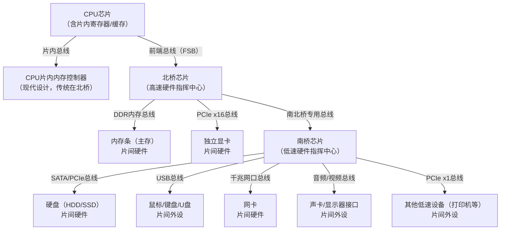
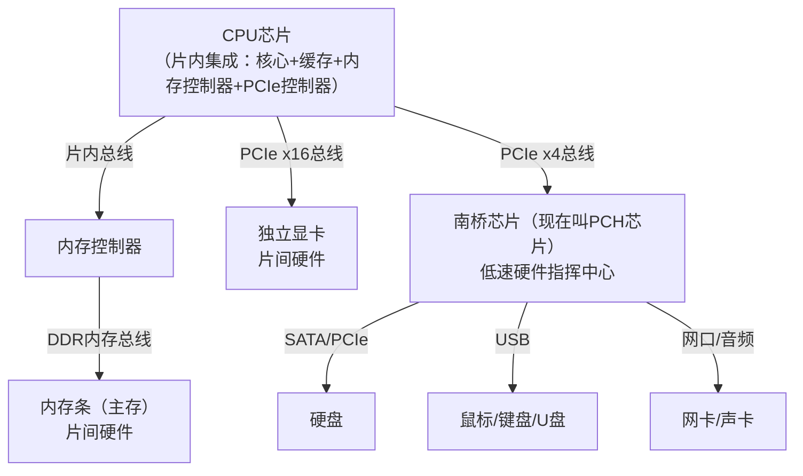

# 辅助理解线程与进程不同

首先，我们明确一下存储器的结构：

**从 CPU 近→远（速度快→慢，容量小→大）**：寄存器 → 多级缓存（L1→L2→L3） → 主存（Memory，物理内存） → 外存（硬盘 / SSD / 网盘，补充层）

以及和进程线程强相关的软件的概念：

**堆栈**：并非独立硬件层，是**主存中被操作系统划分的一块专用区域**，属于软件 + 硬件结合的存储形态，和进程 / 线程强绑定。

## 回答（先看这部分再补下面的知识）

### 线程切换

首先我们先上结论，看一下**线程切换**时候涉及到的变化：

线程切换 = 保存当前线程的「CPU 执行现场（寄存器）」+「函数运行现场（私有栈）」，加载新线程的对应现场，仅此而已（无页表切换）。

这俩东西就相当于是做的临时笔记，让出处理机的时候给目前的结果和任务进度记一下，下次拿到处理机的时候能根据这个临时笔记接着弄（线程暂停时，**核心运行上下文（寄存器 + 栈指针）会被保存到主存**）

| 上下文类型   | 类比（工人）         | 存储位置                 | 核心作用                                                     |
| :----------- | :------------------- | :----------------------- | :----------------------------------------------------------- |
| 寄存器上下文 | 工人手边的临时笔记本 | 主存的 PCB（进程控制块） | 包含 PC（下一条指令地址）、SP（栈指针）、通用寄存器、状态寄存器等，恢复后知道上次执行到哪、运算到哪 |
| 线程栈上下文 | 工人的专属工作台     | 主存的进程地址空间       | 保存栈顶地址，恢复后能找到函数局部变量、参数等               |

### 进程独享内存

“进程独占主存” 是**操作系统给进程的 “视觉假象”**，通过虚拟地址 + 独立页表实现逻辑隔离，物理上所有进程共享主存；该机制是操作系统的通用设计，**单核 / 多核均适用**，多核仅在 “多进程并行运行、各核心独立管理 MMU” 上做了扩展，核心隔离逻辑不变。

相比于我们上面说的线程的“临时笔记”，进程还需要记录：

1. 进程专属上下文（线程切换无，进程切换必保存）

   | 上下文类型               | 类比（工人）       | 存储位置   | 核心作用                                                     |
   | :----------------------- | :----------------- | :--------- | :----------------------------------------------------------- |
   | 内存映射上下文（页表）   | 车间的物料位置台账 | 主存的 PCB | 包含进程虚拟地址→物理地址的映射表、页表基址寄存器值，恢复后进程才能访问自己的主存区域 |
   | 地址空间上下文           | 车间的专属区域边界 | 主存的 PCB | 记录进程虚拟地址空间的范围（如代码段 / 数据段 / 堆 / 栈的起止地址），保证内存隔离 |
   | CPU 状态上下文（特权级） | 工人的操作权限等级 | 主存的 PCB | 记录进程运行的 CPU 特权级（用户态 / 内核态），恢复后保证进程只能执行权限内的操作 |

2. 进程资源上下文（可选但常见，进一步增加开销）

   | 上下文类型     | 类比（工人）       | 存储位置   | 核心作用                                                     |
   | :------------- | :----------------- | :--------- | :----------------------------------------------------------- |
   | 文件句柄上下文 | 车间的工具领用记录 | 主存的 PCB | 记录进程打开的文件、套接字等句柄列表，恢复后进程能继续操作这些文件 / 网络连接 |
   | I/O 设备上下文 | 车间的设备使用记录 | 主存的 PCB | 记录进程正在使用的 I/O 设备（如打印机、磁盘），切换时需暂停 / 恢复设备操作 |
   | 信号处理上下文 | 车间的告警响应规则 | 主存的 PCB | 记录进程对各类信号（如中断、异常）的处理方式，恢复后信号能正常响应 |

### 切换流程

- 线程：

  暂停线程 → 保存「寄存器+栈指针」到TCB（线程控制块）→ 加载新线程的「寄存器+栈指针」→ 运行新线程

  - 仅操作主存中的 TCB（几十 KB），无额外资源校验；

  - 缓存可能颠簸，但页表无需切换，缓存中进程的共享数据仍可用。

- 进程：

  暂停进程（含所有线程）→ 保存「寄存器+栈指针」到TCB → 保存「页表+地址空间+资源句柄」到PCB → 切换MMU（内存管理单元）指向新进程页表 → 加载新进程的「页表+地址空间+资源句柄」→ 加载新进程线程的「寄存器+栈指针」→ 运行新进程

  - 需操作 PCB（几 MB），且修改 MMU 配置（硬件级操作，耗时）；

  - 缓存**完全失效**（新进程的地址空间与原进程无关），CPU 需重新从主存加载所有数据到缓存，进一步增加开销。

## 存储层介绍

### 寄存器（Register）：CPU 内部的「超高速临时工作台」

#### 硬件属性（计组基础）

1. 位置：**CPU 芯片内部**，与运算器 / 控制器直接相连，是离 CPU 最近的存储；
2. 速度：**最快**（纳秒级，和 CPU 时钟周期同步），无读写延迟；
3. 容量：**极小**（单个 CPU 一般几十到上百个，总容量 KB 级），按功能划分专用寄存器；
4. 造价：**最高**，无法大规模扩容。

#### 核心分类（常用）

- 通用寄存器：临时存**运算数据 / 地址**（比如计算 1+2，先把 1 和 2 存这里）；
- 程序计数器（PC）：存**下一条要执行的指令地址**，CPU 靠它知道下一步干什么；
- 状态寄存器（PSW）：存 CPU 执行指令后的**状态**（比如是否计算溢出、是否中断）；
- 栈指针寄存器（SP）：指向**堆栈的栈顶地址**，是堆栈操作的核心。

#### 与进程 / 线程的核心关联

- **线程私有，进程内所有线程共享进程的资源，但各自独占一套寄存器**；
- 操作系统做**线程切换**时，核心操作就是**保存当前线程的寄存器值，加载待运行线程的寄存器值**（这也是线程切换开销远小于进程的核心原因）；
- 进程切换时，寄存器值也会保存，但还需额外保存进程的**内存映射、文件句柄**等，开销更大。

### 多级缓存（Cache）：CPU 与主存之间的「速度缓冲器」

#### 硬件属性（计组基础）

1. 位置：**CPU 内部（L1/L2）+ CPU 与主存之间的片上缓存（L3）**，多核 CPU 中 L3 为多核共享；
2. 速度：仅次于寄存器，**L1≈几纳秒，L2≈十几纳秒，L3≈几十纳秒**，远快于主存（百纳秒级）；
3. 容量：比寄存器大，比主存小（L1：几十 KB；L2：几百 KB~ 几 MB；L3：几 MB~ 几十 MB）；
4. 设计原因：CPU 运算速度远快于主存读写速度，若 CPU 每次都直接从主存取数据，会大量**空等（访存延迟）**，缓存用来存 CPU**即将要读 / 刚读过的高频数据 / 指令**，让 CPU “就近取数”。

#### 三级缓存架构（经典）

| 缓存层级 |        所属主体         |      速度      |       容量        |                           核心特点                           |
| :------: | :---------------------: | :------------: | :---------------: | :----------------------------------------------------------: |
|    L1    |    单个 CPU 核心私有    |      最快      | 最小（32KB/64KB） | 分**指令缓存（L1i）和数据缓存（L1d）**，指令存待执行的代码，数据存运算所需值 |
|    L2    |    单个 CPU 核心私有    |      次快      | 中等（256KB~8MB） | 不分指令 / 数据，存 L1 缓存没命中的高频数据，是 L1 和 L3 的中间缓冲 |
|    L3    | 整个 CPU 的所有核心共享 | 最慢（缓存内） | 最大（4MB~128MB） |  多核协作的核心，存多个核心都会用到的共享数据，减少主存访问  |

#### 缓存核心机制：**局部性原理**

操作系统和硬件协同利用该原理做缓存调度，也是进程 / 线程高效运行的基础：

- 时间局部性：**刚用过的数据 / 指令，短期内大概率还会用**（比如循环代码）；
- 空间局部性：**用过某个地址的数据，其附近地址的数据大概率也会用**（比如数组）；
- 硬件会按 ** 缓存行（Cache Line，一般 64 字节）** 加载数据，即取一个数据时，会把其附近的 64 字节一起加载到缓存，提升命中率。

#### 与进程 / 线程的核心关联

1. 缓存是**硬件级自动管理**，操作系统无需直接操作，但会通过**进程地址空间分配、线程调度策略**间接优化缓存命中率；
2. 多核场景下，**线程间共享数据**会存在**缓存一致性问题**（比如核心 1 修改了缓存中的数据，核心 2 的缓存中该数据就失效了），操作系统和硬件（如 MESI 协议）会协同解决；
3. 线程切换若频繁，会导致**缓存颠簸**（缓存中的数据被频繁替换），命中率下降，这也是操作系统要做合理线程调度的原因之一。

### 主存（Memory）：计算机的「主力工作内存」（物理内存）

#### 硬件属性（计组基础）

1. 位置：**主板上的内存条**，独立于 CPU，通过内存总线与 CPU / 缓存连接；
2. 速度：百纳秒级，比缓存慢，比外存快（机械硬盘毫秒级，SSD 微秒级）；
3. 容量：GB 级（主流 8G/16G/32G），是进程 / 线程运行的**核心载体**；
4. 特性：**易失性存储**（断电后数据丢失），与外存的 “非易失性” 形成互补。

#### 计组核心：**冯・诺依曼体系核心要求**

CPU**只能直接从主存取指令和数据**，寄存器、缓存的数据最终都来自主存，外存的数据必须**加载到主存**后，CPU 才能处理（这是操作系统文件管理、设备管理的核心逻辑之一）。

#### 与进程 / 线程的核心关联（操作系统内存管理的核心）

1. **进程私有独立的地址空间**，主存会被操作系统划分为多个区域，每个进程拥有**虚拟地址空间**（操作系统封装，让进程感觉独占主存），映射到物理主存的实际区域；
2. **线程共享所属进程的主存空间**：同一个进程内的所有线程，能直接访问进程的代码段、数据段、堆区，这是线程间通信比进程简单的核心原因；
3. 主存是操作系统**资源分配的基本单位**（进程是资源分配单位的本质），操作系统通过**分页 / 分段 / 段页式**管理主存，解决内存不足、地址冲突问题；
4. 当主存空间不足时，操作系统会通过 **虚拟内存（虚拟存）**技术，把主存中暂时不用的数据换入外存（交换区），需要时再换回来。

### 堆栈（Stack/Heap）：主存中的「进程 / 线程专用区域」

均属于主存，不是物理上的分级架构，而是用分区实现的逻辑上的两种存储，这两种存储的区别在于

1. 使用方式：栈是先进后出（**OS自动管理**），堆是**用户**手动申请手动释放
2. 是谁独有的：栈是线程独有、堆是进程独有（线程共享）

#### 核心定位

堆栈不是独立硬件，是**操作系统在主存中为进程 / 线程划分的两块逻辑区域**，均属于主存，只是**管理方式、用途、归属**完全不同，是进程运行的核心载体，和寄存器、缓存直接交互。

#### 栈（Stack）：「先进后出」的线程私有区域

1. 归属：**线程私有**，每个线程在创建时，操作系统会为其分配一块固定大小的栈空间（一般几 MB，大小固定，操作系统限制）；
2. 管理：**操作系统自动管理**，无需程序员手动申请 / 释放，入栈（push）/ 出栈（pop）由编译器和 CPU 指令控制；
3. 存储内容：函数的**局部变量、函数参数、返回地址、寄存器现场**（线程切换时保存的寄存器值会暂存到栈）；
4. 访问速度：快（因先进后出，地址连续，硬件易优化，栈指针寄存器直接指向栈顶）；
5. 核心特点：地址连续、大小固定、溢出风险（栈溢出，比如递归过深）。

#### 堆（Heap）：「自由分配」的进程共享区域

1. 归属：**进程私有，进程内所有线程共享**，整个进程只有一个堆区；
2. 管理：**程序员手动申请（如 Go 的 new/make，C 的 malloc）、手动释放（C 的 free，Go 靠 GC 自动回收）**，操作系统提供堆管理接口；
3. 存储内容：进程运行时**动态分配的大数据**（比如大数组、对象、链表）；
4. 访问速度：比栈慢（地址不连续，需要通过指针查找，操作系统需维护堆的空闲块链表）；
5. 核心特点：地址不连续、大小动态（理论上受主存 / 虚拟内存限制）、内存泄漏风险（未及时释放的堆空间）。

#### 堆栈与进程 / 线程的核心关联（必记）

```
进程主存地址空间（简化版）：代码段 → 数据段 → 堆区（向上生长） → 空闲区 → 栈区（向下生长）
```

- 栈区向上生长、堆区向下生长，二者向中间的空闲区扩展，避免地址冲突；
- 线程切换时，栈的上下文（栈顶地址、栈内数据）会和寄存器值一起被保存，恢复线程时一并加载；
- 进程退出时，操作系统会**自动释放该进程的所有栈和堆空间**，避免内存泄漏。

## 存储层关联

| 存储层      | 归属（进程 / 线程）                | 操作系统管理角色            | 与进程 / 线程切换的关系               | 核心作用                          |
| ----------- | ---------------------------------- | --------------------------- | ------------------------------------- | --------------------------------- |
| 寄存器      | 线程私有                           | 切换时保存 / 加载上下文     | 线程切换的**核心操作**，开销极小      | CPU 运算的临时数据 / 指令地址存储 |
| 多级缓存    | L1/L2 线程 / 核心私有，L3 多核共享 | 间接优化命中率              | 频繁切换会导致缓存颠簸，命中率下降    | 缓解 CPU 与主存的速度差           |
| 主存        | 进程私有（虚拟地址）               | 内存管理（分页 / 虚拟内存） | 进程切换需切换内存映射表，开销较大    | 进程 / 线程运行的核心载体         |
| 栈（Stack） | 线程私有                           | 自动分配 / 释放 / 管理      | 线程切换需保存 / 加载栈上下文         | 函数运行的临时数据存储            |
| 堆（Heap）  | 进程私有，线程共享                 | 提供分配 / 释放接口         | 与进程 / 线程切换无关，共享需同步保护 | 动态大数据存储                    |

### 存储层的「数据流转逻辑」（进程执行一条指令的完整路径）

以 **CPU 执行 “计算两个变量的和”** 为例，理解数据在各存储层的流转，这是操作系统和计组结合的核心：

1. 外存中的**程序可执行文件**（如.exe/.go）被操作系统**加载到主存**的进程代码段 / 数据段；
2. CPU 通过**程序计数器（寄存器）\**获取主存中\**下一条指令的地址**，并将该指令**加载到 L1 指令缓存**，再送入 CPU 控制器；
3. 指令需要的两个变量，先从主存加载到**L1 数据缓存**，再送入**通用寄存器**；
4. CPU 运算器（ALU）从寄存器中取出数据，完成加法运算，结果暂存回**通用寄存器**；
5. 若结果需要保存，从寄存器送入 L1 数据缓存，再刷回**主存的堆 / 栈**（根据变量类型）；
6. 整个过程中，**缓存硬件自动完成数据的加载 / 替换**，操作系统负责主存的地址映射和进程调度，寄存器由 CPU 指令直接控制。

总结区别点：

- **线程切换**：仅需保存 / 加载**当前线程的寄存器值 + 栈上下文**，这些数据量极小（KB 级），且操作在 CPU / 缓存层面完成，速度极快；
- **进程切换**：除了保存 / 加载寄存器 / 栈上下文，还需**切换进程的虚拟地址空间映射表、页表、文件句柄、设备资源**等，这些数据存于主存，需要修改 MMU（内存管理单元）的配置，且会导致**缓存全失效**（新进程的缓存数据和原进程无关联），数据量极大（MB 级），开销是线程切换的数十倍甚至上百倍。
- **核心结论**：进程是**资源分配的基本单位**（分配主存、外存、设备等资源），线程是**CPU 调度的基本单位**（仅占用寄存器、栈等 CPU 相关的小资源），根源就是这套存储架构的设计。

# 传输层次

基于存储金字塔从 CPU 核心到磁盘的层级架构，计算机内部的传输体系围绕**不同总线物理结构**搭建，传输方式、传输单位、延迟特性与存储层级强绑定，核心遵循**近 CPU 则总线更高速、传输单位更小，远 CPU 则总线带宽导向、传输单位更大**的设计原则。

## 各层级传输方式 + 物理结构

### 层级 1：CPU 核心 ↔ 寄存器

#### 物理结构

无独立总线，**CPU 核心内部的硬件走线**（运算器 / 控制器与寄存器直接互连），属于**片内物理集成**，无物理传输距离。

#### 传输方式

- 链路类型：电信号直接读写，无专用传输总线；
- 传输单位：按**寄存器位宽**（如 64 位 CPU 为 8 字节）传输，单指令即可完成读写；
- 控制方式：CPU 硬件逻辑直接控制，**无传输协议**、无寻址开销；
- 核心特性：无传输延迟，与 CPU 时钟周期同步（0.1-1ns 访问周期为纯读写逻辑延迟，非传输延迟）。

### 层级 2：CPU 核心 ↔ 高速缓存（L1/L2/L3）

#### 物理结构

**CPU 片内高速总线**（片上互连总线，On-Chip Bus），所有缓存均集成在 CPU 芯片内部，L3 缓存与多核的互连为**片内多核互连架构**（如 Intel QPI、AMD Infinity Fabric），物理传输距离为芯片内部微米级。

#### 传输方式

- 链路类型：片内专用高速总线，并行传输架构；
- 传输单位：按**缓存行（Cache Line）** 传输，固定 64 字节 / 行（硬件定死，为适配空间局部性原理）；
- 控制方式：CPU 缓存控制器硬件自动控制，遵循**缓存一致性协议（MESI/MOESI）**（多核场景），无操作系统参与；
- 核心特性：按行批量加载 / 替换，L1/L2 为核心专属总线，L3 为多核共享总线，访问周期 1-10ns（含极短传输 + 读写逻辑延迟）。

### 层级 3：高速缓存 ↔ 主存（内存）

#### 物理结构

**系统前端总线（FSB）/ 内存控制器总线**，分 2 种主流设计：

1. 传统设计：内存控制器集成在北桥芯片，通过**前端总线**连接 CPU 与北桥，再通过**内存总线**连接北桥与内存条（主板板间总线，厘米级物理距离）；
2. 现代设计（酷睿 / 锐龙后）：**内存控制器集成在 CPU 内部**，CPU 直接通过**DDR 专用总线**连接主板上的内存条（板间总线，物理距离更短，延迟更低）；

> 注：主存为主板上的内存条，通过金手指与主板内存插槽物理连接。

#### 传输方式

- 链路类型：DDR 内存专用并行总线（DDR4/DDR5），系统级高速总线；
- 传输单位：按**内存页（Page）** 传输，固定 4KB / 页（操作系统定死，为适配内存管理的分页机制），硬件层实际按**内存突发长度**（如 8 拍）批量传输；
- 控制方式：CPU 内存控制器 + MMU（内存管理单元）硬件控制，配合操作系统页表完成**虚拟地址→物理地址**映射后传输；
- 核心特性：按页批量加载 / 换出，访问周期 50-100ns（含总线传输 + 地址映射 + 内存芯片读写延迟）。

### 层级4：主存 ↔ 磁盘存储（HDD/SSD）

#### 物理结构

**计算机 I/O 总线体系**，主板板间总线（厘米级），磁盘通过专用接口与主板 I/O 插槽物理连接，核心分 2 类总线：

|   磁盘类型    |             核心物理总线              |                      物理连接方式                       |
| :-----------: | :-----------------------------------: | :-----------------------------------------------------: |
| HDD（机械盘） |               SATA 总线               |      主板 SATA 接口 → SATA 数据线 → 硬盘 SATA 接口      |
| SSD（固态盘） | PCIe 总线（主流 NVMe 协议）/SATA 总线 | 主板 PCIe 插槽 → NVMe SSD（直连）；SATA 接口 → SATA SSD |

> 注：PCIe 为串行高速总线，是当前 I/O 总线的主流，SATA 为传统并行 I/O 总线，逐步被 PCIe 替代。

#### 传输方式

- 链路类型：PCIe 3.0/4.0/5.0（串行差分总线）、SATA 3.0（并行总线）；
- 传输单位：按**磁盘扇区**传输，传统 512 字节 / 扇区，现代 4K 扇区（硬件级最小读写单位），操作系统按**文件块**（如 4KB）封装后传输；
- 控制方式：主板南桥芯片（I/O 控制器）+ 磁盘控制器共同控制，遵循**NVMe/SATA 协议**（I/O 传输协议），由操作系统**设备管理 / 文件管理**模块调度；
- 核心特性：
  - HDD：机械盘因磁头寻道，**传输延迟为毫秒级**（总线传输微秒级，主要延迟为物理寻道）；
  - SSD：固态硬盘无机械结构，**传输延迟为微秒级**（PCIe NVMe SSD 比 SATA SSD 快 10 倍以上，因 PCIe 总线带宽更高、协议开销更小）。

### 注释

ps：北桥 / 南桥 + 片内 / 片间 解释

#### 片内 / 片间

- **片内（On-Chip）**：**同一个芯片内部**的组件。比如手机 SOC 芯片（相当于电脑 CPU）里，同时集成了处理器核心、显卡核心、内存控制器 —— 这些都属于**片内组件**，彼此通过芯片内部的走线连接，距离极近（微米级），传输速度最快、延迟最低。对应电脑：CPU 芯片里的寄存器、L1/L2/L3 缓存、CPU 核心，都是**片内**的。
- **片间（Off-Chip/Inter-Chip）**：**不同芯片之间**的组件。比如手机的 SOC 芯片、电池管理芯片、摄像头芯片，是三个独立的芯片，彼此通过手机主板上的排线 / 焊点连接 —— 这些属于**片间组件**，物理距离更远（厘米级），传输依赖外部总线，速度比片内慢、延迟更高。对应电脑：CPU 芯片、内存条、硬盘、显卡，都是**片间**的独立硬件，通过主板上的总线连接。

总结：**片内 = 同一个芯片里的零件**，片间 = 不同芯片 / 硬件之间的零件；**近 CPU 的多是片内，远 CPU 的多是片间**，这也是存储金字塔速度差异的物理根源之一。

#### 北桥 + 南桥

北桥、南桥是**传统计算机主板上的两个核心芯片**，合称**芯片组（Chipset）**，作用是**连接 CPU 和所有片间硬件（内存、硬盘、显卡、外设），管理所有片间传输总线**—— 相当于主板的 “总路由器 + 交通调度站”。

之所以分北桥、南桥，是因为**硬件的传输速度差异大**，分开管理能避免 “高速硬件被低速硬件拖慢”，就像高速路和普通路要分不同的交警指挥。



- 北桥芯片：管**高速**片间硬件，离 CPU 最近。北桥是**高速交通站**，只连接**传输速度快的片间硬件**，直接和 CPU 通过**前端总线（FSB）** 通信，延迟低、带宽高，核心负责：

  1. 连接**内存条（主存）**（DDR 内存总线）；
  2. 连接**独立显卡**（PCIe x16 高速总线）；
  3. 连接**南桥芯片**（南北桥专用高速总线），把低速硬件的请求中转给 CPU。

  **核心特点**：靠近 CPU 插槽安装，发热量大，一般带散热片；是片间传输的 “高速核心”，决定了电脑的内存、显卡性能上限。

- 南桥芯片：管**低速**片间硬件，是外设总入口。南桥是**普通交通站**，连接**所有传输速度慢的片间硬件 / 外设**，不直接和 CPU 通信，而是通过北桥中转，核心负责：

  1. 存储外设：硬盘（SATA/PCIe 总线）、U 盘（USB 总线）；
  2. 输入输出：鼠标、键盘、打印机（USB/PCIe x1 总线）；
  3. 网络 / 音频：网卡、声卡、显示器接口（千兆网口 / 音频总线）；
  4. 其他低速设备：主板上的各种拓展接口。

  **核心特点**：安装位置离 CPU 较远，发热量小，无需单独散热；是电脑的 “外设总入口”，决定了主板的拓展性（有多少 USB 口、SATA 口）。

#### 现代计算机架构（没有南北桥）




- 把**北桥的核心功能（内存控制器、PCIe 控制器）直接集成到 CPU 芯片内部**，变成**CPU 片内组件**。
- 现代南桥的新名字：PCH 芯片：现代的南桥芯片改叫**PCH（平台控制器中枢）**，功能和传统南桥基本一致，还是管低速外设，只是和 CPU 的连接方式变了：从 “通过北桥中转” 变成**CPU 直接通过 PCIe 总线连接 PCH**，传输更高效。

## 计算机内部核心总线分类（物理结构总览，按功能划分）

基于上述层级传输，计算机内部的总线按**物理位置 + 功能**可分为 3 大类，覆盖所有硬件间的传输

|   总线类别   |       物理位置        |                  核心功能                   |          代表类型          |          传输速度           |
| :----------: | :-------------------: | :-----------------------------------------: | :------------------------: | :-------------------------: |
| **片内总线** |     CPU 芯片内部      | 连接 CPU 核心、寄存器、片内缓存（L1/L2/L3） | 片上互连总线、多核共享总线 |       最快（GHz 级）        |
| **系统总线** | CPU 与主存 / 北桥之间 |        连接 CPU、主存、高速 I/O 设备        | 前端总线 FSB、DDR 内存总线 |        快（GB/s 级）        |
| **I/O 总线** |  主板南桥与外设之间   |      连接主存与磁盘、显卡、网卡等外设       | PCIe、SATA、USB、千兆网口  | 中等 - 低速（MB/s~GB/s 级） |

> 核心演进：现代计算机已取消北桥芯片，将内存控制器、PCIe 控制器集成到 CPU 内部，**片内总线 + 系统总线**融合，进一步降低传输延迟。