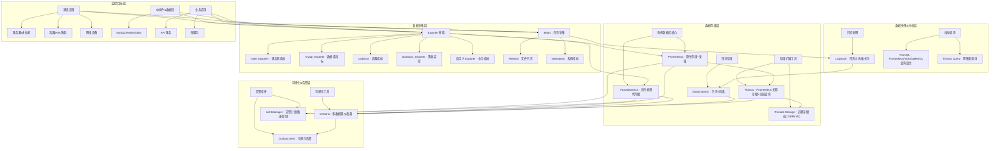

# 1.`Laas Saas Paas`

## 概念对应与技术解释

### IaaS - 基础设施即服务

我搭建一个网站，去阿里云租云服务器就是laas

- **是什么：** 提供最基础的云计算资源。像“网上租用机房”。
- **你得到：** 虚拟服务器、存储空间、网络、负载均衡器等。
- **你要做：** 自己安装操作系统、中间件、运行环境、应用程序和数据。
- **例子：** **AWS EC2（虚拟机）**，阿里云ECS，腾讯云CVM，Azure Virtual Machines。
- **适合谁：** 需要高度控制底层环境，或运行特殊定制软件的公司（如运维工程师、需要灵活配置的开发者）。

### PaaS - 平台即服务

腾讯的TCS，在阿里云的基础上搭建好了操作系统和数据库这些

- **是什么：** 提供一个完整的开发、测试、部署和运行应用程序的平台。
- **你得到：** 操作系统、运行环境（如Java/Python环境）、数据库系统、开发工具等已经配置好的平台。
- **你要做：** 专注于编写和上传自己的应用程序代码，并管理应用数据。
- **例子：** **Google App Engine**， Heroku，阿里云函数计算，腾讯云开发。
- **适合谁：** 应用程序开发者和团队，希望快速开发部署，不想操心服务器维护。

### SaaS - 软件即服务

我直接买一个软件来用

- **是什么：** 提供通过网络直接使用的完整应用程序。
- **你得到：** 一个打开浏览器或客户端就能用的软件。
- **你要做：** 注册账号、登录、使用。所有维护、升级都由服务商搞定。
- **例子：** **Gmail，Office 365，Salesforce，钉钉，飞书**，腾讯会议。
- **适合谁：** 几乎所有终端用户和企业，想直接用软件解决办公、协作等问题，无需自己开发。

## 总结与对比表

| 特性         | IaaS                         | PaaS                                 | SaaS                    |
| :----------- | :--------------------------- | :----------------------------------- | :---------------------- |
| **服务内容** | 虚拟硬件（计算、存储、网络） | 开发部署平台（运行时、数据库、工具） | 完整的软件应用          |
| **控制级别** | 高（控制OS及以上）           | 中（控制应用和数据）                 | 低（仅控制应用设置）    |
| **管理责任** | 管理OS、中间件、应用、数据   | 管理应用和数据                       | 基本无需管理            |
| **用户角色** | 系统管理员/运维工程师        | 应用程序开发者                       | 终端用户/业务人员       |
| **技术例子** | AWS EC2, 阿里云ECS           | Google App Engine, 腾讯云开发        | Gmail, Office 365, 钉钉 |
|              |                              |                                      |                         |

# 2.容量管理策略

## 调度

- **是什么**：云计算里的 “调度”，核心是**给任务找合适的机器去跑**。你可以把它想象成 “机房管理员”，手里有一堆服务器（节点），还有一堆等着运行的应用 / 虚拟机 / 容器，调度器的工作就是根据规则，把任务分配到最优的节点上。
- **核心目标**：提高资源利用率（别让机器闲着）、保证服务质量（比如把高优先级任务分配给性能好的机器）、避免节点过载。
- **常见场景**：Kubernetes（K8s）里的 kube-scheduler 就是最典型的调度器，ZStack 云平台也有自己的调度模块来管理虚拟机的部署。

## 混部

- **是什么**：全称是**资源混合部署**，简单说就是**把不同类型的任务放在同一台服务器上跑**。
- **分类**：
  - 业务混部：比如把在线服务（如电商网站 API）和离线任务（如数据分析、报表计算）部署在同一集群。
  - 资源混部：比如 CPU 密集型任务和内存密集型任务搭配部署，充分利用服务器的 CPU 和内存资源。
- **核心目标**：最大化服务器资源利用率，降低硬件成本。
- **关键挑战**：要避免离线任务抢占在线任务的资源，导致在线服务卡顿，一般会通过资源隔离、优先级控制来解决。

## HPA

- **是什么**：全称 **Horizontal Pod Autoscaler**，中文叫**水平 Pod 自动扩缩容**，是 K8s 里的核心功能（很多云平台也借鉴了这个逻辑）。
- **核心逻辑**：**根据服务的负载情况，自动增加或减少 Pod 的数量**。Pod 可以理解为应用的 “实例”。
- **举例**：当电商网站搞促销，CPU 利用率超过 80% 时，HPA 会自动多启动 5 个 Pod 来分担压力；促销结束后，负载降下来，又会自动关掉多余的 Pod。
- **触发指标**：最常用的是 CPU 利用率、内存利用率，也可以基于自定义指标（比如每秒请求数 QPS）。

## VPA

- **是什么**：全称 **Vertical Pod Autoscaler**，中文叫**垂直 Pod 自动扩缩容**，和 HPA 是 “搭档” 但方向相反。
- **核心逻辑**：**不增加 Pod 数量，而是直接调整单个 Pod 的资源配额**（比如给 Pod 的 CPU 从 1 核提升到 2 核，内存从 2G 提升到 4G）。
- **适用场景**：当任务的负载特点是 “单实例需要更强的资源”，而不是 “多实例分担压力” 时用。比如一些数据分析任务，数据量变大后，单 Pod 需要更多内存来处理。
- **小区别**：HPA 是 “加人”，VPA 是 “给单人升级装备”。

# 3.前沿技术

## Linux Kernel

- **是什么**：就是**Linux 操作系统的内核**，是操作系统的 “心脏”。它管理着计算机的所有硬件资源（CPU、内存、磁盘、网络），并为上层应用程序提供统一的接口。
- **在云计算里的作用**：
  - 所有云服务器（ECS）、容器的底层几乎都是 Linux 内核。
  - 云计算的很多核心特性（比如容器的 namespace、cgroup 资源隔离）都是基于 Linux 内核实现的。
  - 内核的性能、稳定性直接决定了云平台的运行效率。

## EBPF

- **是什么**：全称 **extended Berkeley Packet Filter**，中文叫**扩展伯克利包过滤器**，是近几年 Linux 内核最火的技术之一，你可以把它理解为**Linux 内核的 “可编程插件系统”**。
- **核心能力**：**不用修改内核代码、不用重启系统，就能给内核动态添加自定义的功能**。
- **在云计算里的应用**：
  - 网络监控：实时抓包、分析网络流量，排查服务间的通信问题。
  - 安全审计：监控进程的异常行为（比如某个程序突然访问敏感文件）。
  - 流量控制：实现高性能的网络转发、负载均衡（Cilium 就是基于 eBPF 的）。
- **优点**：性能极高（代码直接在内核态运行）、安全（有严格的沙箱机制，不会搞崩内核）。

## Cilium

- **是什么**：一款**基于 eBPF 的开源网络和安全解决方案**，主要用于 K8s 集群的网络管理。
- **核心功能**：
  - 服务网格（Service Mesh）：代替传统的 Istio，用 eBPF 实现更高效的服务间通信、流量治理。
  - 网络策略：精细化控制 Pod 之间的访问权限（比如只允许 A Pod 访问 B Pod 的 80 端口）。
  - 可观测性：基于 eBPF 实时采集网络流量数据，方便排查问题。
- **核心优势**：相比传统的 iptables 等工具，基于 eBPF 的 Cilium 性能更高、配置更灵活，是云原生网络的未来趋势。

# 4.监控系统

## 监控系统关系与组件

关系图核心说明：

1. **层级划分**：从下到上分为「监控目标层」（要监控的对象）→「数据采集层」（拿数据）→「数据存储层」（存数据）→「数据处理 & 分析层」（加工数据）→「可视化 & 告警层」（用数据），符合监控系统的实际工作流程。
2. **核心关联**：
   - Exporter 是 Prometheus/VictoriaMetrics 的 “数据入口”，专门对接各类监控目标；
   - Thanos 不替代 Prometheus，而是给它做 “扩容”（长期存储、跨集群查询）；
   - Grafana 是 “万能展示台”，能对接所有存储组件，同时支持自身告警和联动 AlertManager；
   - ELK 组件（Beats/Logstash/Elasticsearch）专门处理日志数据，和时序指标体系互补。
3. **补充概念**：
   - 黑盒监控（blackbox_exporter）：不侵入目标，通过 “ping / 端口探测 / HTTP 请求” 判断服务可用性；
   - 自定义 Exporter：针对公司业务场景开发的指标采集工具（比如订单量、支付成功率）；
   - Remote Storage：Thanos 用于长期存储的底层介质（云存储 / 对象存储）。

## promethues

- **是什么**：一款**开源的时序数据库监控系统**，是云原生监控的 “事实标准”，几乎所有云平台都会集成它。
- **核心特点**：
  - 时序数据：专门存储带时间戳的指标数据（比如 “某台服务器 10:00 的 CPU 利用率是 60%”）。
  - 拉取（Pull）模式：主动从被监控的目标（服务器、Pod、数据库）拉取监控指标。
  - 强大的查询语言 PromQL：可以灵活地分析监控数据（比如 “查询过去 1 小时所有 Pod 的内存峰值”）。
  - 告警功能：配合 AlertManager，可以在指标异常时（比如 CPU 利用率超 90%）发送邮件、钉钉告警。
- **典型架构**：Prometheus Server（采集、存储数据） + Exporter（暴露监控指标，比如 node_exporter 采集服务器指标） + AlertManager（告警） + Grafana（可视化图表）。

## ELK

- **是什么**：是**Elasticsearch + Logstash + Kibana**的缩写，一套开源的**日志收集、存储、分析、可视化的全家桶**，现在也常叫 ELK Stack（后来还加入了 Beats，变成了 Elastic Stack）。
- **各组件分工**：
  - Logstash：日志 “搬运工 + 加工师”，负责从各个服务收集日志，对日志进行过滤、格式化（比如把杂乱的日志转换成 JSON 格式）。
  - Elasticsearch：日志 “存储 + 搜索引擎”，把处理后的日志存储起来，并且提供快速的全文检索能力（比如 “搜索所有包含‘报错’关键词的日志”）。
  - Kibana：日志 “可视化面板”，把 Elasticsearch 里的数据做成图表、仪表盘，方便运维人员查看和排查问题。
  - Beats：轻量级的日志采集器（比如 Filebeat 采集日志文件），代替 Logstash 做前端采集，更轻量高效。
- **在云计算里的作用**：收集云平台、应用的日志，排查故障、分析用户行为、做安全审计。

## Grafana

- **是什么**：一款**开源的监控可视化工具**，堪称监控领域的 “颜值担当 + 数据展示中心”。
- **核心作用**：
  - 不存储数据，只做**数据可视化**：把 Prometheus、VictoriaMetrics、Thanos 这些存储监控数据的组件当作 “数据源”，拉取数据后生成直观的图表（折线图、柱状图、仪表盘等）。
  - 支持多数据源：除了时序数据库，还能对接 MySQL、Elasticsearch 等，适合做一站式监控大盘。
  - 灵活的告警配置：可以基于图表数据设置告警规则，也能和 AlertManager 联动。
- **使用场景**：你在公司里看到的 “服务器资源监控大屏”“应用接口 QPS 走势图”，大概率都是用 Grafana 做的。

## Thanos

- **是什么**：一款**为 Prometheus 打造的高可用、长期存储扩展工具**，解决 Prometheus 的原生痛点。
- **Prometheus 原生痛点**：
  - 单节点存储，数据量大会撑爆磁盘；
  - 集群多个 Prometheus 实例的数据分散，无法全局查询；
  - 数据保留时间有限，没法做长期趋势分析。
- **Thanos 核心能力**：
  - **长期存储**：把 Prometheus 的历史数据备份到对象存储（如 S3、MinIO），节省本地磁盘空间，支持几年的数据查询。
  - **全局视图**：聚合多个 Prometheus 实例的数据，实现跨集群的统一监控查询。
  - **降采样**：对历史数据进行 “降精度” 存储（比如把 1 分钟 1 个数据点合并成 1 小时 1 个），减少存储成本。
- **定位**：不是替代 Prometheus，而是**增强 Prometheus** 的企业级能力。

##  VictoriaMetrics

- **是什么**：一款**高性能、低成本的开源时序数据库**，可以直接**替代 Prometheus 的存储模块**，也能作为独立的监控数据存储。
- **核心优势**：
  - **性能更强**：写入和查询速度比 Prometheus 快很多，适合大规模监控场景（比如几万台服务器、百万级指标）。
  - **存储更省**：采用高效的压缩算法，相同数据量下，磁盘占用只有 Prometheus 的 1/10 左右。
  - **兼容 Prometheus**：支持 PromQL 查询语言、支持 Prometheus 的远程读写协议，迁移成本低。
  - **高可用架构**：原生支持集群部署，比 Prometheus + Thanos 的组合更轻量化。
- **适用场景**：当你的 Prometheus 集群遇到性能瓶颈（比如查询慢、存储占用高）时，VictoriaMetrics 是常用的替代方案。

## AlertManager

- **是什么**：Prometheus 生态中**专门负责告警处理的组件**，是监控告警的 “大脑”。
- **核心作用**：
  - **接收告警**：接收来自 Prometheus、VictoriaMetrics 等组件的告警信息。
  - **告警分组**：把同一原因引发的多个告警合并成一个（比如服务器宕机导致多个指标告警，只发一条通知），避免告警轰炸。
  - **告警抑制**：设置规则，比如 “当集群宕机告警触发时，抑制该集群内的所有其他告警”。
  - **告警路由**：把不同类型的告警发送到不同的渠道（比如 CPU 告警发钉钉群、磁盘告警发邮件给运维）。
  - **重试与静默**：告警发送失败时自动重试；支持手动静默（比如升级维护时，暂时关闭告警）。
- **搭配关系**：**Prometheus 负责检测指标异常并触发告警 → AlertManager 负责处理告警并发送通知**。

## Exporter

- **是什么**：一类**监控指标采集工具的统称**，作用是把 “不支持 Prometheus 协议的系统 / 组件” 的指标，转换成 Prometheus 能识别的格式。
- **核心逻辑**：
  - 相当于 “翻译官”：比如服务器的 CPU、内存指标存在于 Linux 内核里，MySQL 的连接数指标存在于数据库内部，这些系统本身不会主动暴露 Prometheus 格式的指标。
  - Exporter 会去采集这些指标，然后通过 HTTP 接口暴露出来，等待 Prometheus 来 “拉取”。
- **常见的 Exporter 举例**：
  - `node_exporter`：采集服务器（Linux/Windows）的资源指标（CPU、内存、磁盘、网络）。
  - `mysql_exporter`：采集 MySQL 数据库的指标（连接数、慢查询数、缓存命中率）。
  - `cadvisor`：采集容器的资源使用指标。
  - `blackbox_exporter`：做黑盒监控（比如检测网站是否能正常访问、端口是否通）。

