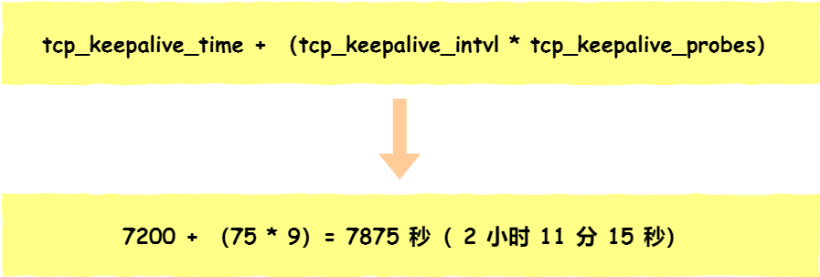
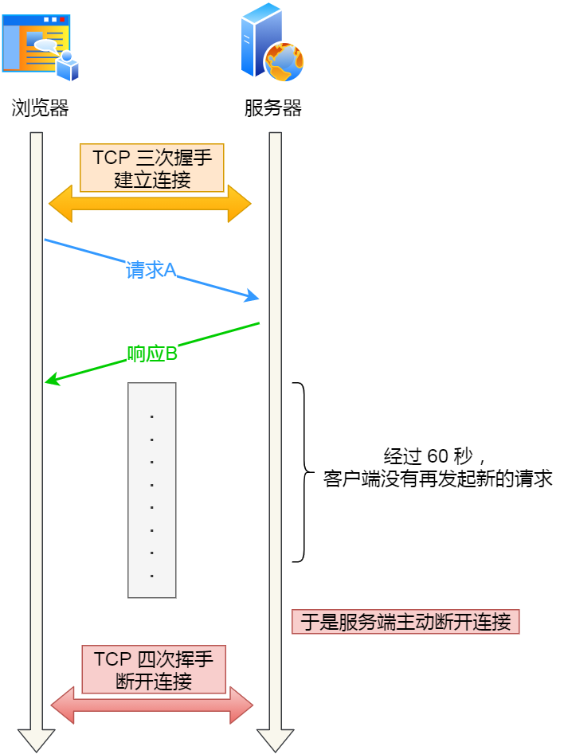

### 描述一下打开百度首页后发生的网络过程


- 解析URL：分析 URL 所需要使用的传输协议和请求的资源路径。如果输入的 URL 中的协议或者主机名不合法，将会把地址栏中输入的内容传递给搜索引擎。如果没有问题，浏览器会检查 URL 中是否出现了非法字符，则对非法字符进行转义后在进行下一过程。
- 缓存判断：浏览器缓存 → 系统缓存（hosts 文件） → 路由器缓存 → ISP 的 DNS 缓存，如果其中某个缓存存在，直接返回服务器的IP地址。
- DNS解析：如果缓存未命中，浏览器向本地 DNS 服务器发起请求，最终可能通过根域名服务器、顶级域名服务器（.com）、权威域名服务器逐级查询，直到获取目标域名的 IP 地址。
- 获取MAC地址：当浏览器得到 IP 地址后，数据传输还需要知道目的主机 MAC 地址，因为应用层下发数据给传输层，TCP 协议会指定源端口号和目的端口号，然后下发给网络层。网络层会将本机地址作为源地址，获取的 IP 地址作为目的地址。然后将下发给数据链路层，数据链路层的发送需要加入通信双方的 MAC 地址，本机的 MAC 地址作为源 MAC 地址，目的 MAC 地址需要分情况处理。通过将 IP 地址与本机的子网掩码相结合，可以判断是否与请求主机在同一个子网里，如果在同一个子网里，可以使用 ARP 协议获取到目的主机的 MAC 地址，如果不在一个子网里，那么请求应该转发给网关，由它代为转发，此时同样可以通过 ARP 协议来获取网关的 MAC 地址，此时目的主机的 MAC 地址应该为网关的地址。
- 建立TCP连接：主机将使用目标 IP地址和目标MAC地址发送一个TCP SYN包，请求建立一个TCP连接，然后交给路由器转发，等路由器转到目标服务器后，服务器回复一个SYN-ACK包，确认连接请求。然后，主机发送一个ACK包，确认已收到服务器的确认，然后 TCP 连接建立完成。
- HTTPS 的 TLS 四次握手：如果使用的是 HTTPS 协议，在通信前还存在 TLS 的四次握手。
- 发送HTTP请求：连接建立后，浏览器会向服务器发送HTTP请求。请求中包含了用户需要获取的资源的信息，例如网页的URL、请求方法（GET、POST等）等。
- 服务器处理请求并返回响应：服务器收到请求后，会根据请求的内容进行相应的处理。例如，如果是请求网页，服务器会读取相应的网页文件，并生成HTTP响应。

### 网页非常慢转圈圈的时候，要定位问题需要从哪些角度？

最直接的办法就是抓包，排查的思路大概有：

1. 先确定是服务端的问题，还是客户端的问题。先确认浏览器是否可以访问其他网站，如果不可以，说明客户端网络自身的问题，然后检查客户端网络配置（连接wifi正不正常，有没有插网线）；如果可以正常其他网页，说明客户端网络是可以正常上网的。
2. 如果客户端网络没问题，就抓包确认 DNS 是否解析出了 IP 地址，如果没有解析出来，说明域名写错了，如果解析出了 IP 地址，抓包确认有没有和服务端建立三次握手，如果能成功建立三次握手，并且发出了 HTTP 请求，但是就是没有显示页面，可以查看服务端返回的响应码：
   - 如果是404错误码，检查输入的url是否正确；
   - 如果是500，说明服务器此时有问题；
   - 如果是200，F12看看前端代码有问题导致浏览器没有渲染出页面。
3. 如果客户端网络是正常的，但是访问速度很慢，导致很久才显示出来。这时候要看客户端的网口流量是否太大的了，导致tcp发生丢包之类的问题。

总之就是一层一层有没有插网线，网络配置是否正确、DNS有没有解析出 IP地址、TCP有没有三次握手、HTTP返回的响应码是什么。

### server a和server b，如何判断两个服务器正常连接？出错怎么办？

直不会发送数据给客户端，那么服务端是永远无法感知到客户端宕机这个事件的，也就是服务端的 TCP 连接将一直处于 ESTABLISH 状态，占用着系统资源。

为了避免这种情况，TCP 搞了个**保活机制**。这个机制的原理是这样的：定义一个时间段，在这个时间段内，如果没有任何连接相关的活动，TCP 保活机制会开始作用，每隔一个时间间隔，发送一个探测报文，该探测报文包含的数据非常少，如果连续几个探测报文都没有得到响应，则认为当前的 TCP 连接已经死亡，系统内核将错误信息通知给上层应用程序。

在 Linux 内核可以有对应的参数可以设置保活时间、保活探测的次数、保活探测的时间间隔，以下都为默认值：

```shell
net.ipv4.tcp_keepalive_time=7200
net.ipv4.tcp_keepalive_intvl=75  
net.ipv4.tcp_keepalive_probes=9
```

- tcp_keepalive_time=7200：表示保活时间是 7200 秒（2小时），也就 2 小时内如果没有任何连接相关的活动，则会启动保活机制
- tcp_keepalive_intvl=75：表示每次检测间隔 75 秒；
- tcp_keepalive_probes=9：表示检测 9 次无响应，认为对方是不可达的，从而中断本次的连接。

也就是说在 Linux 系统中，最少需要经过 2 小时 11 分 15 秒才可以发现一个「死亡」连接。



注意，应用程序若想使用 TCP 保活机制需要通过 socket 接口设置 SO_KEEPALIVE 选项才能够生效，如果没有设置，那么就无法使用 TCP 保活机制。

如果开启了 TCP 保活，需要考虑以下几种情况：

- 第一种，对端程序是正常工作的。当 TCP 保活的探测报文发送给对端, 对端会正常响应，这样 **TCP 保活时间会被重置**，等待下一个 TCP 保活时间的到来。
- 第二种，对端主机宕机并重启。当 TCP 保活的探测报文发送给对端后，对端是可以响应的，但由于没有该连接的有效信息，**会产生一个 RST 报文**，这样很快就会发现 TCP 连接已经被重置。
- 第三种，是对端主机宕机（*注意不是进程崩溃，进程崩溃后操作系统在回收进程资源的时候，会发送 FIN 报文，而主机宕机则是无法感知的，所以需要 TCP 保活机制来探测对方是不是发生了主机宕机*），或对端由于其他原因导致报文不可达。当 TCP 保活的探测报文发送给对端后，石沉大海，没有响应，连续几次，达到保活探测次数后，**TCP 会报告该 TCP 连接已经死亡**。

TCP 保活的这个机制检测的时间是有点长，我们可以自己在应用层实现一个心跳机制。

比如，web 服务软件一般都会提供 keepalive_timeout 参数，用来指定 HTTP 长连接的超时时间。如果设置了 HTTP 长连接的超时时间是 60 秒，web 服务软件就会**启动一个定时器**，如果客户端在完成一个 HTTP 请求后，在 60 秒内都没有再发起新的请求，**定时器的时间一到，就会触发回调函数来释放该连接。**



### 服务端正常启动了，但是客户端请求不到有哪些原因?如何排查?

如果客户端请求的接口没有响应，排查的方式：

- 检查接口IP地址是否正确，ping一下接口地址。
- 检查被测接口端口号是否正确，可以在本机Telnet接口的IP和端口号，检查端口号能否连通
- 检查服务器的防火墙是否关闭，如果是以为安全或者权限问题不能关闭，需要找运维进行策略配置，开放对应的IP和端口。
- 检查你的客户端（浏览器、[测试工具 (opens new window)](https://so.csdn.net/so/search?q=测试工具&spm=1001.2101.3001.7020)），是否设置了网络代理，网络代理可以造成请求失败。

如果客户端的请求有响应，但是返回了错误状态码，那么根据错误码做对应的排查：

- 400：客户端请求错误，比如请求参数格式错误
- 401：未授权，比如请求header里，缺乏必要的信息头。（token，auth等）
- 403：禁止，常见原因是因为用户的账号没有对应的URL权限，还有就是项目中所用的中间件，不允许远程连接（Tomcat）
- 404：资源未找到，导致这种情况的原因很多，比如URL地址不正确
- 500：服务器内部错误，出现这种情况，说明服务器内部报错了 ，需要登录服务器，检查错误日志，根具体的提示信息在进行排查
- 502/503/504（错误的网关、服务器无法获得、网关超时）：如果单次调用接口就报该错误，说明后端服务器配置有问题或者服务不可用，挂掉了；如果是并发压测时出现的，说明后端压力太大，出现异常，此问题一般是后端出现了响应时间过长或者是无响应造成的

### 服务器ping不通但是http能请求成功，会出现这种情况吗?什么原因造成的?

ping 走的是 icmp 协议，http 走的是 tcp 协议。

有可能服务器的防火墙禁止 icmp 协议，但是 tcp 协议没有禁止，就会出现服务器 ping 不通，但是 http 能请求成果。