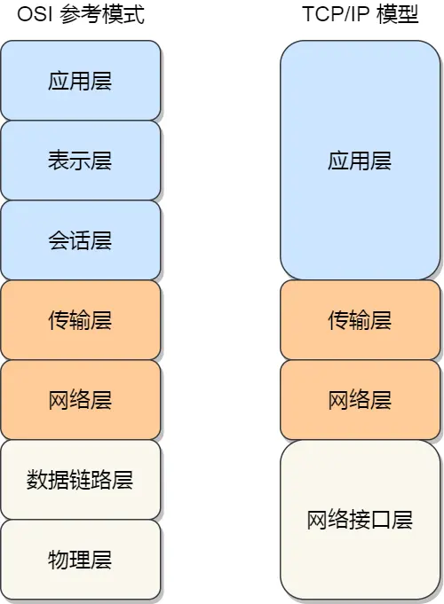
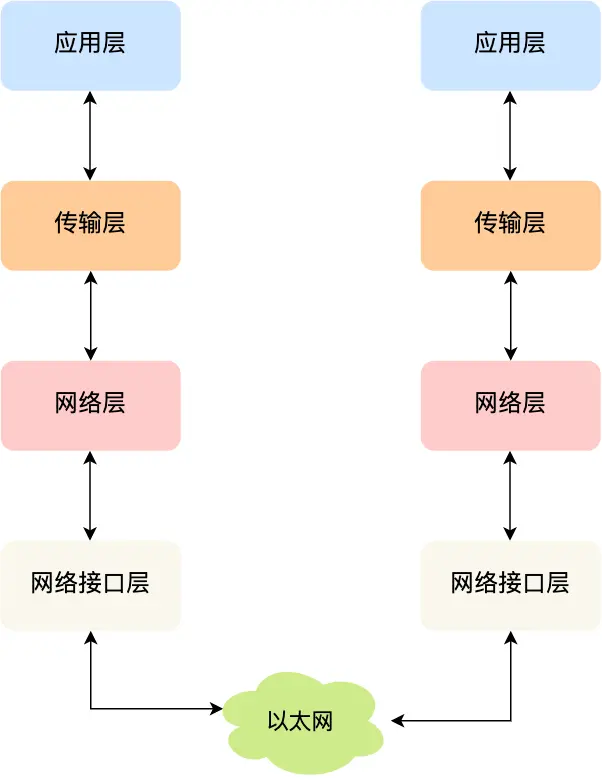

### 网络OSI模型和TCP/IP模型分别介绍一下

> OSI七层模型

为了使得多种设备能通过网络相互通信，和为了解决各种不同设备在网络互联中的兼容性问题，国际标准化组织制定了开放式系统互联通信参考模型（*Open System Interconnection Reference Model*），也就是 OSI 网络模型，该模型主要有 7 层，分别是应用层、表示层、会话层、传输层、网络层、数据链路层以及物理层。

每一层负责的职能都不同，如下：

- 应用层，负责给应用程序提供统一的接口；
- 表示层，负责把数据转换成兼容另一个系统能识别的格式；
- 会话层，负责建立、管理和终止表示层实体之间的通信会话；
- 传输层，负责端到端的数据传输；
- 网络层，负责数据的路由、转发、分片；
- 数据链路层，负责数据的封帧和差错检测，以及 MAC 寻址；
- 物理层，负责在物理网络中传输数据帧；

由于 OSI 模型实在太复杂，提出的也只是概念理论上的分层，并没有提供具体的实现方案。

事实上，我们比较常见，也比较实用的是四层模型，即 TCP/IP 网络模型，Linux 系统正是按照这套网络模型来实现网络协议栈的。

> TCP/IP模型

TCP/IP协议被组织成四个概念层，其中有三层对应于ISO参考模型中的相应层。ICP/IP协议族并不包含物理层和数据链路层，因此它不能独立完成整个计算机网络系统的功能，必须与许多其他的协议协同工作。TCP/IP 网络通常是由上到下分成 4 层，分别是**应用层，传输层，网络层和网络接口层**。

- 应用层 支持 HTTP、SMTP 等最终用户进程
- 传输层 处理主机到主机的通信（TCP、UDP）
- 网络层 寻址和路由数据包（IP 协议）
- 链路层 通过网络的物理电线、电缆或无线信道移动比特

### tcp、ip分别位于哪一层？

- tcp 在传输层
- ip 在网络层